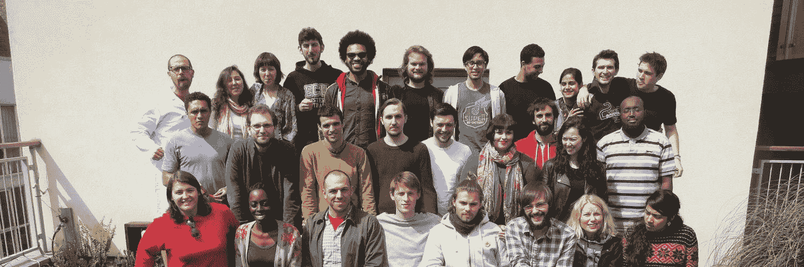
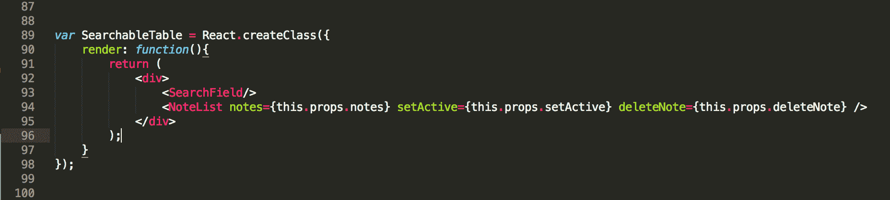
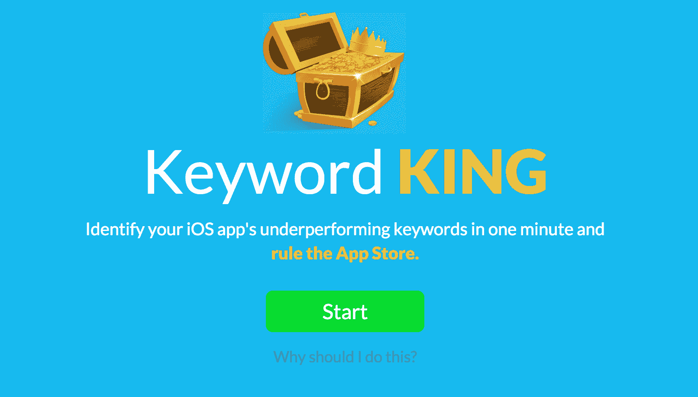

# 如何在 5 个月内成为反应显影剂

> 原文：<https://www.freecodecamp.org/news/how-to-become-a-react-developer-in-5-months/>

### 我是如何从一名非技术人员成为一名 React 开发人员的。

当我 29 岁的时候，我从一个业余爱好的程序员过渡到了一个专业的前端开发人员。这种转变是我做过的最有意义的事情之一，无论是个人还是职业。

就我个人而言，它给了我信心，让我相信我可以学到任何我想学的东西，从专业上来说，它对我的职业生涯至关重要。今天，我是一个学习平台 [Scrimba](https://scrimba.com/) 的联合创始人，这个平台每月教超过 10 万人编程。如果我不知道如何编码，我根本不可能有这个角色。

看到这种转变对我来说有多么重要，我想鼓励更多的人走上同样的道路。所以在这篇文章中，我将解释我是如何做到的。我会列出我学过的每一门课程和做过的每一个项目。希望这能激励你考虑做同样的事情。

但是请注意，我选择的方法不一定是最有效的，因为它涉及到编码训练营。这本身就很贵，而且这段时间你没有薪水。

> 在这一点上，我将足够大胆地推荐我们在 React 上的[免费入门课程](https://scrimba.com/g/glearnreact)和[即将推出的高级课程](https://scrimba.com/g/greact)，为那些正在寻找*绝对*最快可能方式的人。这些的目的是让你尽快达到可雇佣的水平，我已经亲自审核了课程。

但是如果你愿意参加编码训练营，请继续读下去。

### 关闭我以前的创业公司

2014 年末，我和我的两位联合创始人决定关闭我们的儿童应用初创公司 Propell，因为我们已经失去了动力，也不知道如何才能盈利。它最初是我攻读经济学学位时的一个兼职项目，但很快演变成一份全职工作，高峰期有四个人在公司工作。

[https://www.youtube.com/embed/x1tR9W57-E0?feature=oembed](https://www.youtube.com/embed/x1tR9W57-E0?feature=oembed)

虽然放弃肯定很糟糕，但它也给了我机会去做我从 2011 年左右就一直想做的事情，那就是正确地学习如何编码。

编程实际上是我过去几年的爱好，因为我在晚上、周末和假期参加了课程，所以我知道一点编程，但我仍然认为自己不是技术人员，远离任何专业水平。

让我开始学习的课程是 Udacity 在 Udemy 上的[计算机科学导论](https://www.udacity.com/course/intro-to-computer-science--cs101)和[企业家编程](https://codingforentrepreneurs.com/)。它们都很棒，尽管我一个也没完成。

无论如何，继续在网上自学是不可能的。我想要一个强化的面对面课程，因为我知道这将增加我成功转型的机会。我想要一个环境，在那里我可以花 100%的时间和其他人一起编码。因此，我翻遍了所有我能找到的编码训练营，并应用于以下内容:

*   [开发训练营](http://devbootcamp.com/)
*   [德夫山](https://devmounta.in/)
*   [熨斗学校](http://flatironschool.com/)
*   [创始人和编码者](http://www.foundersandcoders.com/) (FAC)
*   [HackerShip](http://www.hackership.org/)
*   黑客攻击反应堆
*   [MakerSquare](http://www.makersquare.com/)
*   [反曲中心](https://www.recurse.com/)

除了 Hack Reactor 和 Recurse Center，我都被录取了。如果你正在考虑自己做一个编码训练营，我建议你也这样做。申请所有你看起来感兴趣的学校，然后开始筛选。通过与在那里工作的人交谈和体验申请过程，你会对学校的质量和理念有一个很好的了解，这两者都非常重要。

> 有几所学校似乎太急于接受我了，这让我产生了怀疑。似乎从尽可能多的人那里收取学费比得到最好的候选人更重要。

我听说过基本上都是骗局的代码训练营的故事，所以当你选择一个时要小心和挑剔！

如果你想 100%确定训练营是认真的，你应该考虑一个有后付费选项的训练营，比如 [V School](https://vschool.io) 。那么你就能保证他们的目标与你的一致。

无论如何，在来来回回的讨论之后，在与杰出的创始人和编码主管 Dan Sofer 进行了令人信服的交谈之后，我最终决定搬到伦敦并加入 FAC。

### 创始人和编码者哲学

FAC 不像其他训练营。首先，它是完全免费的。这意味着我不用贷款就能负担得起，而其他训练营则不同，因为他们的学费大多在一万到一万五千美元之间。其次，FAC 是完全基于项目的，这是我喜欢的，因为我总是从实践中学到比阅读更多的东西。

学费的缺乏意味着他们不能雇佣全职教师，所以这是基于点对点的学习，你主要从你的同学和你自己那里学习。不过，你也可以从以前的同伴那里得到帮助，因为他们会在自己的咨询工作中留下来帮助新同学。FAC 还有两位伟大的导师纳尔逊·科雷亚和伊内斯·特莱什，他们为学生和组织提供了宝贵的帮助。

> 总而言之，这创造了一个令人敬畏的环境——一个渴望知识的人们渴望彼此分享技能的社区。

然而，这并不是学习如何编码的最简单的方法。你不能每次遇到困难就举手从老师那里得到答案，我认为你可以在 10-15，000 美元的训练营中得到答案。在 FAC，你必须自己并与你的同行一起调查，这需要很多自律。

但这也有巨大的好处；你将极大地提高你解决问题的能力，学会如何自学任何你想学的东西。这是作为一名开发人员最重要的技能之一。

> 所以如果你通过了 FAC，你就再也不会害怕面对技术挑战了。另外，你会有很多新朋友。

经历 FAC 很可能会让你的生活变得更好。

### 第 1 部分—八个项目

第一天，全班分成四人一组。这些小组将在接下来的两个月内组成。每周一我们都会收到一个新项目，我们需要在下周五构建并向全班展示。在团队中，我们将在四个不同的角色之间轮换——开发运营、图书管理员、测试人员和回购负责人——以确保每个成员都了解构建 web 应用程序的所有部分。

除此之外，我们每天早上都有一个编码挑战，在那里我们练习核心 Javascript 技能。

所有都是开源的，所以我在下面链接了我们每周的项目。回顾这些项目，我不能直接说我为它们感到骄傲。但我当然为我在建造它们时学到的一切感到骄傲。

我还记下了我们在各自的几周里学到的技术。另外，每周的作业在这本手册中有更详细的描述，对那些有兴趣了解更多的人来说。

*   [第一周:团队博客](https://github.com/foundry-matrix/fmblog) — HTML/CSS、jQuery、Github 页面
*   第二周:卫报 API —网络 API，Ajax
*   [第三周:社交墙](https://github.com/foundry-matrix/socialfeed) — Servers，Node.js
*   [第 4 周:InstagramFeed](https://github.com/foundry-matrix/socialfeed) — Heroku，mongodb
*   [第五周:StopGoContinue](https://github.com/foundry-matrix/StopGoContinue) — D3.js
*   [第六周:备注](https://github.com/foundry-matrix/NoteTakingApp) — React.js
*   第七周:博客 —服务器端渲染，cookies
*   第八周:博客 — Hapi.js

项目的复杂程度稳步增长，因此每周都要学习新技术。我通常在周末阅读和做辅导，为一周做准备。

在工作日，我想我平均每天花大约 10 个小时编码或学习编码，这意味着我在伦敦的四个月总共花了不到 1000 个小时。

### 找到我的反应空间

如你所见，我们在第 6 周开始使用 React.js。我很快就喜欢上了使用它，并喜欢上了能够开发原生移动应用的想法。所以我决定在整个课程中尽可能多地使用 React。

How you wrote React.js back in 2015.

这也是一个战略选择。如果我要达到专业水平，我知道我需要把我的注意力缩小到更少的科目上，而不是把我的努力分散到许多不同的科目上。React 成为双倍下注的自然选择。这种策略当然有回报，我会告诉你更多。

第九个项目周包括制造我们自己的产品，因为 FAC 也想启发学生们制作他们自己的东西。我的团队开发了一个小工具来分析你的 iOS 应用的关键词，叫做 [KeywordKing](http://www.keywordking.co/) ，你可以[在这里读到。](https://medium.com/@oslokommuneper/the-one-week-startup-28b5efadc734#.jxknx1g3r)

### 第 2 部分—为客户构建 MVP

本周也为我们准备了课程的第二部分，包括为外部客户建立 MVP。在最初的八个星期里，我们每周都被客户推销，他们需要开发人员为他们的想法制作原型。

它是这样工作的:对于 500 美元，一个由 3-5 名学生组成的团队将在一周内建立一个原型。对我们来说，这是一种学习如何与客户合作，进一步提高我们的编码技能，同时也赚一点钱的方式。对于客户来说，这是一个快速获得廉价 MVP 的机会。而且不冒任何钱的风险，因为只有当他们对结果满意时才会开发票，而大多数客户(但不是全部)都满意。

在这几周里，我和其他学生一起完成了以下项目:

*   Sir predict alot——一款类似火绒的新闻预测应用的原型
*   Troll-Olav——一个儿童谜题
*   [RateMyStuff](https://github.com/people-under-the-stairs/midnight-marauders) —一个基于图像评级的社交网络
*   [Squish](https://github.com/pajoa/pajoa-the-chimp) —学生的强化学习工具

我还做了一个为期一周的机器学习特技，我已经[在这里](https://blog.skcript.com/machine-learning-in-a-week-a0da25d59850)写了，此外还制作了几个关于这个主题的教程视频(很抱歉有这么糟糕的音频)。

那时，我已经在伦敦呆了大约四个月，是时候搬回挪威了，在那里度过我的余生。

### 回到挪威

回到家后，我的计划是尽快进入专业编码领域，因为我需要实践我新获得的知识，以便坚持下去。

我试图找到一些咨询工作，但要让它运转起来比我想象的要困难。我还怀疑，如果我找到工作，我的学习曲线会更陡。跳入一个由专业人员构建的外国代码库似乎是一个艰难的挑战。

因此，我向需要 Javascript 开发人员的公司发出了三份求职申请。其中两个邀请我去面试。

我没有得到第一个。不知道为什么，但我怀疑他们想要一个更高级的开发人员。下一个让我通过了两轮面试，然后给了我一个编码任务。

### 建立关系网以找到完美的工作

几乎在同一时间，我参加了一个由我略知一二的企业家安排的创业活动。他是一家资金雄厚的初创公司 Xeneta 的首席技术官，我是这家公司的粉丝已经好几年了。根据他们的网站，他们正在寻找前端开发人员——他们实际上提到了 React.js 作为他们使用的技术之一。

晚上，他告诉我，他们刚刚在 React.js 中重写了整个前端，正在寻找一个了解这个库的新开发人员；这似乎好得难以置信。我告诉他我对这份工作感兴趣，我们决定以后再聊。

接下来的一周，我参加了第一轮面试，然后又参加了两轮面试。然后他们给我发了一个编码挑战。

### 接受招聘挑战

我不能与你分享确切的挑战，但我认为我做了一些正确的事情，可以从中吸取教训。

首先，我花了比预期多得多的时间。一周结束时，我被分配了这项任务，并被告知我不需要在这项任务上花费太多时间。但是快速完成对我来说不是一个选择。所以我问是否可以在周末送货，他们同意了。然后我花了整个周末的时间来研究它。我检查了每一行代码，确保它是干燥的，易读的，没有马虎。

我的解决方案也包含了一堆测试，尽管这不是规范的一部分，尽管我认为编写测试非常无聊。

最后，我让我以前在 FAC 的一些同学快速看一下我的解决方案，这也有所帮助。这可能有点偷偷摸摸，但我决心提供一个完美的解决方案。

后来，由于我一直在桌子的另一边，我经常看到申请人用草率的代码提交解决方案。不要这样！

### 接受邀请

6 月 26 日——正好是我在 Founders and Coders 工作的第一天的五个月后——我们达成了协议，我被聘为前端开发人员。

在一家初创公司里，这的确是一份令人敬畏的工作，在一个巨大的市场里，拥有极其熟练的人员来解决一个大问题。我每天都受到挑战。所以我不后悔我做了职业转换。

在那里工作了一年多之后，我的前联合创始人辛德雷·阿尔瑟向我展示了 Scrimba 的早期原型，并问我是否有兴趣加入他的团队，围绕它建立一家公司。我立刻喜欢上了这项技术，并抓住了这个机会。这一切都归功于我真正学会了如何编码，并成为了一名专业的开发人员。没有那段经历，我不可能成为 Scrimba 的联合创始人。

从那时起，我们已经把这个平台从一无所有发展到每月活跃用户超过 10 万。这是一个奇妙的旅程，人们每天都告诉我们这对他们学习编码有多大的帮助。

如果你有兴趣成为一名 React 开发人员，请在这里注册查看我们的[入门课程](https://scrimba.com/g/glearnreact)即将到来的[高级课程](https://scrimba.com/g/greact)，我们将尽力帮助你。

祝你好运:)