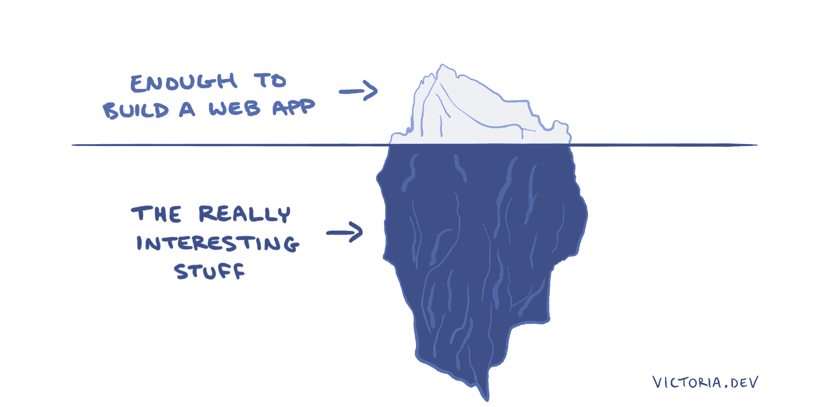
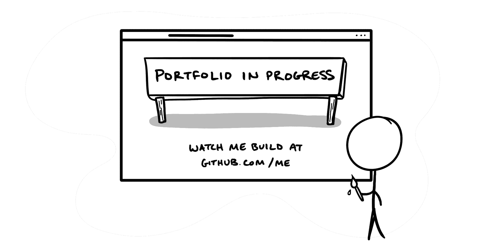

# 如何成为一名软件开发人员

> 原文：<https://www.freecodecamp.org/news/how-to-become-a-software-developer/>

作为一名工程总监，我是一名软件开发人员，负责雇佣和领导其他软件开发人员。毫不奇怪，我经常以各种形式被问到这个问题:

*   如何成为一名软件开发人员？
*   *先学什么语言或者框架？*
*   我从哪里开始？

虽然我确信没有适合所有人的正确答案，但我也确信这个世界需要更多的软件开发人员和系统思考者。

我所能做的帮助你领导自己、学习编码并成为一名软件开发人员的最好的事情就是分享我自己是如何做到的最有效的部分。这是我希望在开始写代码时读过的文章。

## 知识的深度很重要

软件极其复杂。就像一本你希望永远读不完的好小说一样，总有更多的东西需要发现和学习。

如果你不想错过最精彩的部分，就不要满足于表面层次的解释。永远深入下去！问为什么，为什么，再问为什么，直到找到根本。很快，你就会开始看到模式。

通过更深入的挖掘，您将开始理解事物如何连接的基本原理，是什么让事情变得“快速”，以及您可能甚至无法想象存在的软件操作方面。这就像透过窗帘看到了一个大部分人都不知道的系统和过程的世界。

深入学习可以拓展你的思维和学习能力。一直问为什么。跟踪每一个环节。让你的好奇心引导你。

## 硬东西很重要

给自己一个通过发现而快乐的机会不是免费的。阅读并把复杂的想法压缩到你的肉脑里，需要付出很大的努力。

重要的是不要掩饰困难。事实上，如果有些事情看起来太难理解，你可能会从先做它中受益。你可能需要变得有创造力来找到向自己解释事情的方法，但是当你成功的时候，它会让以后的事情变得更容易。

类比有助于理解难懂的概念，但它们只能帮助你开始在表面层次上理解概念。记得要深入。不要停留在类比上。

## 写作很重要

马上写。养成用长篇大论的方式向自己解释你所学到的一切的习惯。比要点更好的是，用对话的语气写作能让你的大脑部分参与进来，帮助你处理和记忆新信息。这就是人类喜欢并记住故事的原因，也是你免费获得的超能力。

从为自己写作开始。写下你感兴趣的东西。尝试一些新的东西，即使它看起来很初级，并深入地写下你所学到的东西。([我最受欢迎的帖子之一](https://victoria.dev/blog/iteration-in-python-for-list-and-map/)是关于 Python 中的迭代。当我第一次写它的时候，我认为自己是一个完全的初学者。)

如果你想更进一步，与世界分享你的作品。像我一样在公共场合学习。我经常收到这样的问题，“我如何为我的博客选择一个主题？”或者“我该用什么平台？”或者“我应该关注什么流行语言/框架/话题？”我的回答是:不用担心。

不要太担心你的博客主题或平台。从现在开始，选择最容易的选项。所有这些都会随着你的学习、练习和发现你的焦点而改变和提高。开始写吧，最好是昨天。

通过解释你正在做的事情来为你自己写作，就好像它已经过去了——你在教导未来的你——因为它已经过去了。你将是你的第一个读者，也是你的博客有多大用处的第一个评判者。求打动自己！

## 语言、框架或版本并不重要

为什么在开始之前就把你的能力分类呢？选择任何你第一次阅读时觉得有意义的软件语言、框架或技术。从那里开始。

请记住，深入挖掘和理解基本面非常重要。软件的基本概念超越了语言。

无论您选择哪种第一语言，都要理解函数、变量、返回值、迭代以及不变性是如何工作的。你会发现学习这些概念会让你在第二语言中更容易识别它们，并且也能学会。

## 你的投资组合不重要

如果你的第一个目标是建立一个投资组合，你可能会先跑后走。建立一个向潜在雇主展示的投资组合是一个伟大的目标，但却是糟糕的第一步。

如果你认为第一步是创建一个精美的作品集，那么在关注内容之前，你可能会花太多时间把它做得漂亮和像样。作为一个雇佣软件开发人员的人，我可以全心全意地告诉你，我宁愿看到干净、写得好的代码，而不是华而不实的首页。

不要混淆构建投资组合和构建项目。绝对要从一开始就构建项目。没有比这更好的方式来观察你所学知识的实际应用。只是把它们当作初稿，当作训练场，不要担心为了专业消费而包装它们。

通过允许自己先建立一些项目草案，你就给了自己从这些项目中学习的空间。专注于迭代，专注于每次都让一件小事变得更好，你会在没有意识到的情况下建立一个投资组合。

## 专注于重要的事情

不要盲目遵循这个建议——相反，把它融入你自己的系统。尝试，让它比你发现它时更有效，然后通过写下你所学到的东西让别人阅读来回报它！

如果你想培养一种学习的心态，这里有我最喜欢读或听的书。编码员参见[非编码书籍](https://victoria.dev/bookshelf/)。

如果这篇文章在某些方面对你有益，我鼓励你写下来！学习如何学习的过程是永无止境的。你可以成为下一个迭代。

如果你喜欢这篇文章，我很想知道。在 victoria.dev 上加入成千上万和我一起学习的人吧！请访问并订阅更多关于构建您的编码技能堆栈的信息。