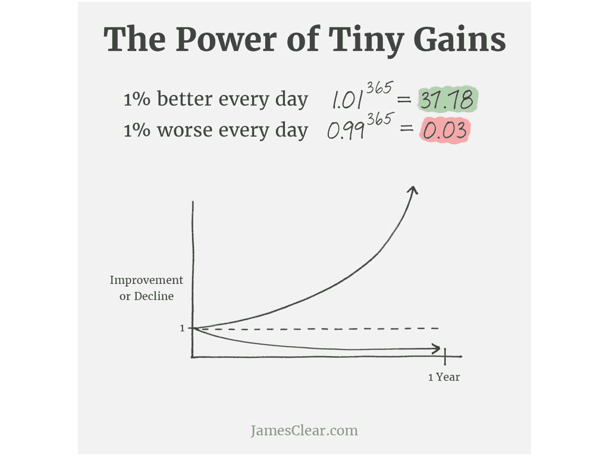
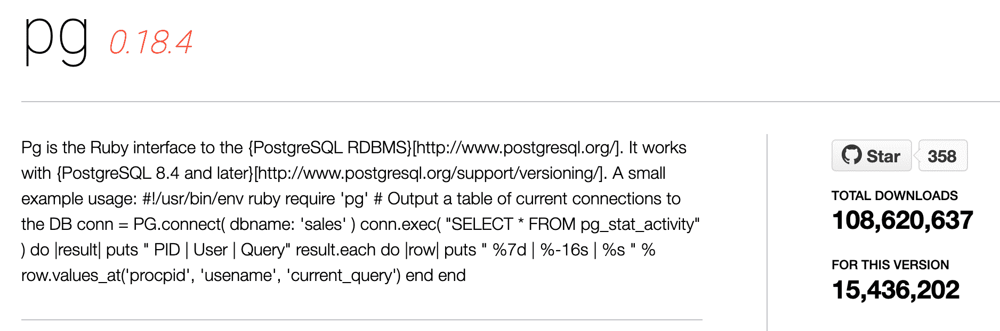
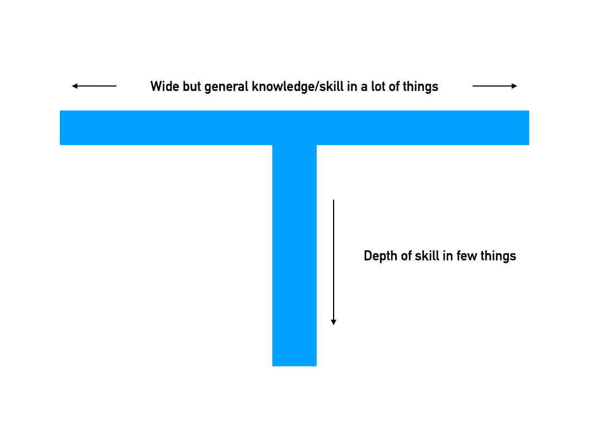
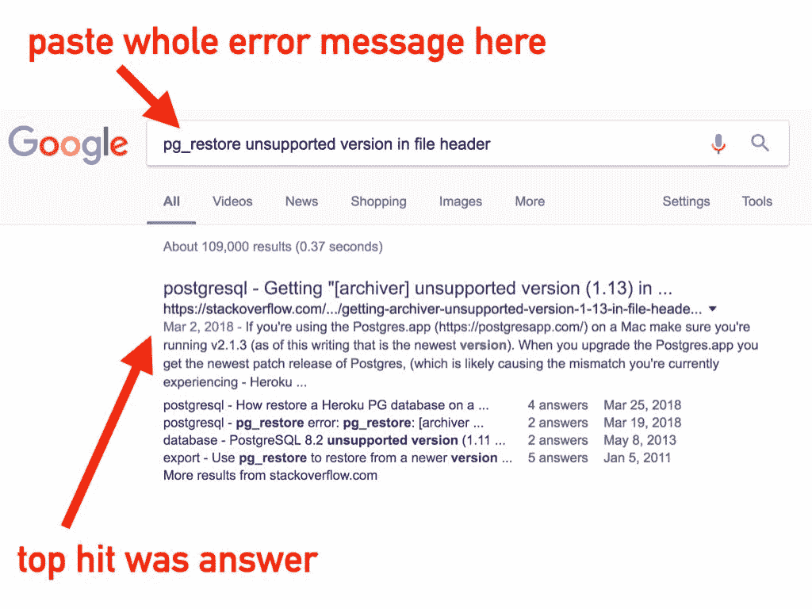
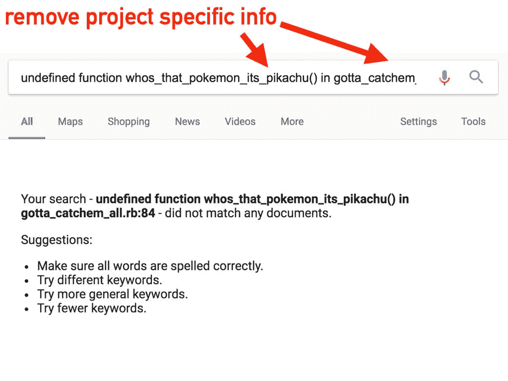
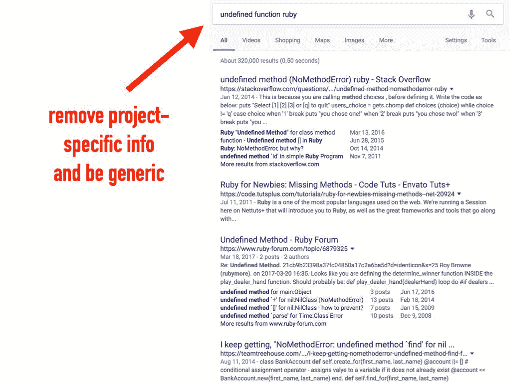
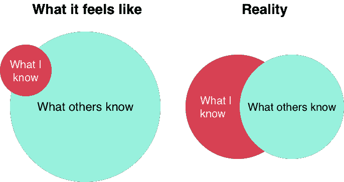

# 如何成为一名优秀的初级开发人员

> 原文：<https://www.freecodecamp.org/news/how-to-become-an-astounding-junior-developer/>

如果你正在读这篇文章，你可能刚刚得到了你的第一份科技工作——所以恭喜你！获得第一份工作是你在科技行业最难做的事情之一。你已经付出了太多的工作和努力。

或者也许你还没有你的第一份工作，但你想知道你应该期待什么。

无论哪种方式，在这篇文章中，我将解决一些常见的担心和问题，比如工作中的期望，以及如何在开发人员的职业生涯中取得成功。

以下是我们将要介绍的内容:

1.  工作中的期望(最初的几天/几周)
2.  你的中短期计划
3.  成功的心态
4.  如何成为一名优秀的新开发者

## 工作中会有什么期待

这一天终于到来了。作为一名新的开发人员，你第一次走进办公室(或者远程加入晨会)。即使你很紧张，也要试着回忆和接受你的第一天。这是一个激动人心的时刻！

你的第一天可能是后勤方面的事情:安装你的电脑，入职培训，人力资源后勤(银行信息，保险，等等)。

然而，让新开发人员在你的第一天就投入生产已经成为一种惯例。通常是一些非常小的事情——比如在公司网站上添加你的名字和照片，或者修改一个错别字。这测试你的计算机设置是好的，它也给你一个非常快速的胜利，并让你加入团队航运软件的其余部分。

### 你的公司希望你成功

作为一名新的开发人员，雇佣你的公司知道你目前的知识和技能的局限性。他们明白他们需要在你的成长中投入大量的时间来教导和训练你。

记住，这家公司*希望你成功！*他们站在你这边。这家公司花了很大力气来寻找、面试和雇佣你。从公司的时间和金钱角度来看，这是一个昂贵的过程。他们不会把你晾在一边——那样对待他们对你的投资是不明智的。

有些技能是你一开始就能掌握的，但有些技能在专业工作环境之外很难(尽管并非不可能)获得。

由于这是您的第一份工作，您可能从未与使用源代码控制或维护生产应用程序的大型团队合作过——这没关系！这些技能在生产环境中更容易掌握。

### 你的第一天/第一周

一旦你的电脑安装好了，你可以使用你需要的所有工具，你的第一个任务可能是小的功能改进或修复小的错误——只是让你在各种项目中有所涉猎。

除了纯粹的技术知识，每个公司都有你需要学习的领域知识或“业务逻辑”(公司的产品或服务做什么，以及它们是如何做的)。

如果公司有多种产品，他们可能会在每个代码库中给你一些小任务，让你开始探索这些产品。也有可能他们会指派团队中的另一个人与你配对——或者至少在最初的几周内可以回答你的问题。

在最初的几天和几周里，你只有一个目标:学习，学习，学习。

了解你正在使用的技术，了解公司及其运作方式，并学习如何与你的队友合作。此时，你的工作产出并不重要，重要的是你的增长率。

### 深入生产代码库

当你开始在公司的各种代码库中工作时，你可能会感觉像一条离开水的鱼。这是完全正常的——写代码比读代码容易得多。

生产代码库与你正在学习的教程或玩具项目非常不同。

首先，这个代码库可能已经存在了很多年，并且由许多不同的人开发——每个人都有自己的风格，每个人都犯自己的错误。

这也很可能有更多的软件包或插件注入到这个应用程序比你以前遇到过。所有在教程中被忽略的便利快捷方式或边缘情况(如错误处理)都必须在这里处理——这是一个真正的应用程序。

这一开始可能会让人不知所措，但是阅读别人的代码是一项你必须培养的技能，而且是一项你将在整个职业生涯中使用的技能(在这篇文章的最后，我会给你一些帮助你做到这一点的技巧)。

最后，不要害怕寻求帮助！你的队友在那里支持你，在过去的某个时候，他们不得不问同样的问题。

### 新的开发者期望

首先要做的事情是:这家公司并不期待你加入进来并开始推出新功能。他们知道你需要时间来发展你还不具备的技能，理解代码库，并学习如何有效地与团队合作。

很可能你的老板会与你会面，并制定一个 30/60/90 天的计划。如果他们不这样做，那就去问！任何主管都会欣赏你拥有自己的工作和工作期望。

在前 30 天，你可能只是做一些小的功能改进和小的 bug 修复——只是为了了解公司的产品和代码库。在第 60 天，你可能会做一些稍微大一点的功能和错误修复。到了 90 天，范围会增加一点，但是他们仍然不会期望你自己拥有和驱动大的特性。

最终，公司只是希望你继续学习和吸收你周围的信息。你不会知道所有正在进行的事情，或者在 90 天后，这没关系！过一天算一天。

### 新的开发人员心态

走进一家新公司，有很多事情你无法控制，但有一件很重要的事情你可以:你的心态。你的日常想法、实践以及你如何将周围发生的事情内化将决定你的成功。

有时你会感到困惑，有时你会感到不知所措，有时你甚至会怀疑自己是否能做到这一点(我做到了)。你如何内化这些想法很重要。记住，这不是你独有的——每个新开发人员都面临过这个问题。控制住你的思想，你会挺过去的。

当你遇到令人困惑或沮丧的事情时，重新定位你的思维:*这个障碍是一个学习的机会。*

这是一个了解新事物和成长的机会。这很糟糕，感觉很糟糕，但是不久之后你会成为一个更好的开发者。这种情况会经常发生——这只是对新事物的现实。

而不是内化:

> “我今天被困了 10 次。”

请尝试:

> “我今天有 10 次机会去学习。”

这是一个强有力的转变，对你的队友和你的工作表现都会很明显。

保持头脑清醒，不要让失败的感觉蔓延，这不仅会帮助你在这种情况下表现得更好，还会增加你离开这种情况时的知识和技能。深呼吸，休息一下，寻求帮助——但要坚持下去。

然后在一天结束的时候:把这一切都忘掉。当你离开办公室或关闭电脑时，把它放在地上。开始新的一天，为自己的冒险做好准备。

此外，记得庆祝一路上的小胜利！随着时间的推移，这些小的成功会累积起来，成为一座巨大的成功之山。

还有一件重要的事情需要记住:给自己犯错的自由。您将中断生产，您将进行一些糟糕的数据库更新(我肯定做过)——这是可恢复的，这不是世界末日或您的工作，任何有经验的开发人员都做过。这只是过程的一部分。

### 作为新开发人员，您最大的技能是什么

你可能没有意识到，但是作为一个新开发人员，你最大的技能是你已经学会了如何学习。

你已经学会了如何把一件困难、复杂、晦涩的事情分解成几个部分——一步一步地完成它。

除了学习 JavaScript、React、Ruby 或其他任何东西，你学到的最好的东西是如何自学。利用你拥有的这种练习过的技能，每天都带着它出现。

## 拥有你的成长——没有人会。

对于处于职业生涯任何阶段的开发人员来说，这可能是最重要的一句话:**你的职业是你自己的。你必须拥有它，你必须拥有你的成长。**

有时你的公司、工作岗位或老板会帮助你成长，但最终，还是取决于你自己。

大多数公司都有某种预定的审核流程——可能是每季度或每年一次。如果他们这样做了，很好，但是如果他们没有，拥有你的成长！定期向你的主管寻求反馈，并按照他们说的去做。如果有人提到你从未听说过的东西，问问他们或者自己去研究一下！

### “微小收益的力量”

https://jamesclear.com/marginal-gains

我最喜欢的书之一， [*原子习惯*作者 James Clear，](https://jamesclear.com/atomic-habits)有一个很棒的图表，题为“微小收益的力量”这是一个简单的图表。它显示了每天 1% *改善*和 1% *下降*之间的差异。

如果你每天进步 1%,一年后你会比年初时进步 38 倍！这就是“微小收获”的力量，对于成为一名伟大的软件开发人员来说也是如此。

每天你都有机会学习新东西——不管它有多小。也许是你不知道的数组上的一个新函数，一个不同的构造 CSS 的方法，一个新的文本编辑器快捷方式，或者完全像学习 SQL 和如何在数据库级存储数据这样的新事物。

不管怎样，每天努力提高 1%(大多数时候你会做得更多)，你职业生涯最初几年的成长将会令人震惊。

### 每天一页

我曾经在一个开发者播客上听说过一个为 Ruby 维护`pg`宝石的人的故事。这是 Ruby 代码和 Postgresql 数据库之间的接口。这是一些非常严肃的东西，大多数 Ruby 开发人员每天都在使用它。

他如何成为这块宝石的维护者的故事很有趣。他说，当他第一次开始时，他会打开 Postgresql 文档并阅读一页——每天只阅读一页。

随着时间的推移，他积累了大量的 Postgresql 知识，并能够开始为`pg` gem 做出贡献。过了一会儿，他成了这块宝石的维护者。

这是微小收获累积的完美例子——每天一页。我们任何人都可以做到这一点，我鼓励你采取同样的哲学，并将其应用于任何语言或系统！

### “熟能生巧”

你可能听说过这句话:*“熟能生巧。”*

我成长过程中的钢琴老师使用了一个不同的短语:***完美**熟能生巧*

我认为他是对的。我可能会用错误的方式练习钢琴——糟糕的技术，马虎，没有稳定的节奏——这就是我会得到的结果:马虎的钢琴演奏。

重要的不仅仅是练习，而是如何练习。我可以一遍又一遍地练习一首歌的第一小节，并完美地理解它，但是如果我从来不超越第一小节，我就永远学不会这首歌。我可以以世界级钢琴家的水平演奏这首歌的第一小节，但我想让*弹钢琴，所以我必须学习整首歌。*

这是一个完美的发展平行。你“实践”开发的方式(你开发的日常习惯、方法和常规)决定了你将成为什么样的开发人员。

开始的时候你会犯很多错误(每个人都会)，但是如果你意识到你的工作，你会注意到你可以改进的地方。这些都是完美的实践时刻:学习新事物或以更好的方式做某事的机会。

当你十年后回顾你的职业生涯时，你会希望有十年的成长、练习和学习——而不是一年的成长、练习和学习十次。

所以问那些愚蠢的问题。问一些明显的问题。当有人提到你一无所知的事情时，大胆地问:“那是什么？”我希望他们以一种友好和教导的方式回应，但不管怎样，要准备好学习。

这一切都回到拥有你的成长。

## t 型人

A "T-shaped" person

在您发展职业生涯的开始阶段，有太多的主题可以让您受益，因此您希望将您的努力和知识传播到广泛的主题中。

如果你的目标是成为全栈开发人员，这个列表可能包括 HTML、CSS、JS、你选择的后端语言、SQL、Git 等等。在每一个主题的表面，都有如此多容易获得的知识和益处，可以通过广撒网并将其全部纳入而获得。

随着时间的推移，你会发现你最喜欢哪种类型的发展。可能是前端、后端、数据库工作、运营、设计，或者这些的组合等等。

随着你职业生涯的进展，你会开始成为一个“T 型人”T 型的人是这样的人，就像字母“T”被形象化了一样，他对很多事情有着广泛而浅薄的知识和经验，在一些领域有着丰富的知识和经验。

这种深刻的知识需要一段时间来积累，每一步都比前一步付出更多的努力——这就是当你接近掌握一门学科时的现实。开始的时候，从广泛的学科领域中汲取所有那些容易入门的知识。

拥有这种 T 形能力将帮助你成为一个整体上更好的开发者。理解数据库模式的前端开发人员或理解这些数据库表将如何在前端用作模型的后端开发人员，将比那些孤立于自己领域的人更有知识，也是更好的团队成员。

在开始时，这种对开发的所有方面的小尝试也有助于找到你感兴趣的东西，并让你对软件世界中所有移动的部分有一个更大的了解。

追随你的兴趣，保持求知的渴望！

## 成为优秀新开发人员的技巧

既然我们已经涵盖了您的期望以及如何考虑这些期望，这里有一些实用的技巧，可以让您成为一名出色的新开发人员——一名您的团队成员喜欢与之共事的人。

### #1 非常非常非常非常好地沟通

你可能没有令人难以置信的发展知识和技能，但是你可以拥有令人难以置信的沟通技巧。

作为一名新的开发人员，你将会寻求很多帮助和指导。没关系！这里有一个如何有效寻求帮助的提示。

卡住是令人沮丧的(对我来说就是这样)。在这些时刻，很容易让挫败感压倒你，向你旁边的队友提问(或者通过电子邮件或聊天应用程序)。

比如:

> “我卡住了”
> “它出错了”
> “页面无法加载”

现在退一步，从你寻求帮助的人的角度来看待这件事。类似*“页面加载不了”*这样的消息，对这个人帮你一点帮助都没有。没有上下文。没有信息让他们继续下去。事实上，他们不得不*向你索取更多的信息。对于试图帮助你的人来说，这是非常低效和令人沮丧的。*

寻求帮助的更好方式是把它想象成一个疯狂的 Lib(如果你还记得的话):

> 我正在处理 _____，
> ，但是当我尝试 _____，
> _____ 时却发生了。
> 
> 我试过 _____，_____，还有 _____。
> 我已经看过 _____ 和 _____。

这条消息的一个例子可能是这样的:

> 我正在解决**用户密码重置错误**、
> ，但是当我尝试**生成密码重置链接**、
> 、**时，用户的令牌已经为空了**。
> 
> 我已经查看了设置了令牌的**，**我可以在数据库**，
> 中看到令牌，但是**在文件 y 的 X 行中令牌丢失了。****

**如果你把上面的信息发给某人，他们能理解:**

*   **你在做什么**
*   **问题是什么**
*   **你已经*尝试过的***
*   **问题出在哪里**

**对于你寻求帮助的人来说，这是丰富的信息。他们会非常感激你给了他们如此清晰的信息——而且你已经*尝试自己解决了。*这向他们表明你尊重他们的时间，而且你不只是在寻找一份简单的施舍。**

**寻求帮助没有错，但是如果有人只是为你解决了问题，他们就真的剥夺了你学习和成长的机会。**

**这并不是说你必须解决十个问题，然后你的余生就结束了——作为一名开发人员，你每天都会面临问题。因此，最好的结果是，他们给你足够的帮助，让你摆脱困境，但允许你自己解决问题。**

### **#2 磨练你的 Google Fu**

**就像在功夫的身体武术中发展技能一样，随着时间的推移，作为一名开发人员，你将发展在 Google Fu 艺术中的技能——即通过 Google 搜索来找到答案的艺术。这是每个有经验的开发人员都拥有的真正技能，并且是随着时间的推移而发展的。**

**有时候，你只需要谷歌一下你遇到的确切问题(这对于错误信息非常有用):**

**

Sometimes pasting the whole error message works** 

**有时谷歌搜索确切的错误信息会产生正确的结果，就像上面那样。你遇到了一个技术问题，其他人也遇到了完全相同的问题。**

**但是有时，您需要稍微编辑一下搜索查询来删除特定于项目的信息:**

**

Too much project-specific info returns no results** 

**上图中，Google 从未在文件`gotta_catchem_all.rb`中看到过函数`whos_that_pokemon_its_pikachu()`(除了我搜索后现在看到了:)。删除特定于项目的信息并添加通用信息会得到更好的结果。**

**

The underlying generic error** 

### **#3 使用“尝试计时器”**

**作为一名新的开发人员，你会遇到很多困难。会出现你以前没有见过的错误信息，你如何处理这些情况将决定你作为开发人员成长的速度。**

**尽管这可能是非常令人沮丧的时刻，但这是你学习和成长的时刻。你不会通过一遍又一遍地做同样的工作来学习——成长是通过经历道路上的这些坎坷来实现的。**

**当你遇到其中一个问题时，花些时间试着自己解决它。一些公司会把这作为入职培训的一部分告诉你——比如“在寻求帮助之前尝试 30 分钟。”在其他公司，这一点没有明确定义，但信息仍然存在:尽你最大努力，如果你仍然陷入困境，寻求帮助。**

**这不仅让你有机会自己想明白并学习，也尊重了专注于自己工作的队友的时间。因为一些你自己很快就能理解的事情而打断别人对团队来说是净损失。**

**所以好好尝试一下，然后当然要寻求帮助！**

**然而，成为一名优秀的新开发人员的秘诀是:**总是重置计时器。****

**假设你卡住了，试 30 分钟，然后求助。下次你遇到困难时，在寻求帮助前再尝试 30 分钟。**

**这似乎是显而易见的，但是在那些感觉你除了一个又一个问题什么都没碰到的日子里，你会变得沮丧，并且一旦下一个问题到来，你就会想要开始寻求帮助——这是很自然的。**

**深呼吸，散散步，用一种全新的视角去解决每个问题。**

**(这当然是说起来容易做起来难！)**

### **#4 记得放松和休息！**

**当事情变得难以承受时，记得休息一下。**

**去散步。去拿杯水。如果可以的话，睡一觉。有时候，站起来活动一会儿可以帮助你重新集中注意力。**

**记住每个开发者都曾经在你的位置上，你会熬过来的。**

**在某种程度上，开发总是令人沮丧的——你永远不会停止犯错误或遇到问题。但是随着时间的推移，你会更好地处理这些问题，你解决这些问题的信心也会增加，所以它对你的困扰会越来越少。**

### **#5 问鸭子**

**你是否曾经给某人写过一封电子邮件或一条短信，描述你遇到的一个问题，并且在你点击发送之前你意识到了解决方案？在软件世界里有这样一句话— [*橡皮鸭调试*](https://en.wikipedia.org/wiki/Rubber_duck_debugging) :**

> **这个名字参考了《实用程序员》一书中的一个故事，在这个故事中，一个程序员带着一只橡皮鸭，强迫自己一行一行地向这只鸭子解释代码，从而调试他们的代码。**

**你看，通过写一封电子邮件或与另一个人交谈，你被迫以一种合乎逻辑的方式解释整个背景，以便其他人理解正在发生的事情。**

**为了以这种方式解释问题，你自己必须能够思考并有逻辑地排序。仅仅是试图为别人准备这种背景的行为就能让你从不同的角度思考问题，很多时候你会自己找到解决办法。**

**所以回到使用尝试计时器，在你寻求帮助之前，试着在一封你没有发送的邮件中解释(或输入)问题的概要。你有可能在不打断他人的情况下获得对问题的新见解，最坏的情况是，你有一封很棒的电子邮件或聊天信息要发送给他们。**

**(我也见过很多人把真的橡胶鸭子放在桌子上！)**

### **#6 做笔记**

**这个提示可能看起来很明显...但是要记笔记！**

**当你第一次加入一家公司时，你会接触到许多不同的东西:代码库、产品、人员、业务逻辑，你不可能全部记住。把这些写下来。**

**当我开始我的第一份工作时，我的老板告诉我，他可以向我解释任何事情，但他不想做第二次。我当时明白，但现在八年后我真的明白了——这一切都是为了尊重你的队友和他们的时间。**

**如果他向我解释了什么，而我忘记了，我们就浪费了两个人的时间——而且我还得再问他一次。在他的推荐下，我甚至开始在我的显示器上贴上我想经常看到和记住的东西。比如:**

> **-尝试 30 分钟
> -在请求 PR 评审之前检查构建过程
> -确保您拥有最新的代码**

### **#7 每日对抗冒名顶替综合症**

**如果你不知道什么是冒名顶替综合症，它在你脑海中听起来是这样的:**

> **我不属于。我是个骗子。除了我，其他人都明白这一点。**

**这是你每天都要面对的心态。作为一名开发人员，会有令人沮丧的时候，但是你已经面对挫折并克服了它。每个开发者都感受到了这一点，这也将会过去。**

**事实上，冒名顶替综合症看起来更像这样:**

**

Imposter syndrome** 

## **“高级”和“初级”开发人员之间的一个关键区别是**

**当然，一个高级开发人员比一个新开发人员有更多的知识和经验，但这并不是他们的区别。一个资深开发者有一个**问题解决系统。****

**当我第一次开始开发时，我想最终我会停止犯错——我会停止犯错。**

**相反的事情发生了。我每天仍然会犯数量惊人的错误。错误的语法，错误的文件，错误的函数。**

**我没有停止犯错——我只是以惊人的速度改正了错误。**

**这是一种随着时间发展的技能，需要有意识地解决问题。**

**这里有一些关于如何建立这个系统的提示。**

## **5 个调试技巧**

### **#1 不要破坏你的代码！**

**作为一名新开发人员，我所做的事情之一——也是我看到的许多新开发人员在遇到问题时所做的事情——是他们开始疯狂地修改代码。他们没有一个系统的评估过程，只是做了大量的快速改变，试图看看是否能解决问题。**

**这是一个非常不好的习惯。你这样做只会犯更多的错误。你应该做的是:**

### **#2 阅读错误信息！**

**这个提示看似显而易见，但实际上是*阅读*信息。错误是什么？发生此错误的文件是什么？这个错误来自哪个*行*？这都是至关重要的信息。**

**如果你拒绝快速修改代码，你可以直接跳到错误发生的地方。**

**这是有经验的开发人员所做的。阅读信息——直接进入问题。**

**这样做会为你节省大量浪费的时间和精力。**

### **#3 不要在不可能的事情上浪费时间！(或者至少是不可能的)**

**

Don't waste time on the impossible!** 

**这是我看到新开发人员经常做的事情。他们面临代码中的错误，他们发现一些他们认为是问题的东西，他们不能相信这不是真的。举个例子:**

> **“我发现问题出在第 14 行，它检查了`is_admin`变量是否是`true`，而不是`true`——但是用户 ***是管理员*** ！！**

**他们处理这个问题时会想，“怎么会这样！！!"而不是*“怎么会这样？”***

**有时候你会遇到一个核心语言或框架的错误，但是 99.9%的时候，你做错了或者情况并不像看上去的那样。**

**与其花时间惊叹眼前不可能发生的事情，不如质疑你对形势的假设。事情并不像看上去的那样。被不可能吓到只是浪费时间——启动你的问题解决系统。**

### **#4“如果有疑问，多打印一些出来。”-一些聪明人**

**我不知道最初是谁说的，但这是最有效的调试技术之一。当你不知道发生了什么时，在你认为问题发生的地方开始打印你的程序的状态。**

**`user`变量中有什么？HTTP 请求的响应是什么？在这种情况下，我们是选择了`if`还是`else`分公司？我们是否调用了这个函数，或者我们是否在这个页面上？**

**我见过无数开发人员试图调试和修复一个问题(我自己也做过很多次)，但他们甚至没有在正确的文件中工作！一个快速的`print`或`console.log`会告诉你，你实际上正在查看实际运行的代码。**

### **#5 一步一步来。**

**每个新开发人员都会犯的一个常见错误是:他们一次做太多事情。**

**他们想写 30 分钟的代码，点击运行，然后看它工作。他们发现，他们花了 30 分钟编写 bug 和错误，现在修复起来简直是一场噩梦。**

**当我在一个应用程序中创建一个新页面时，我做的第一件事就是在页面上放置`
hi
`。我想确保我所有的内部代码都设置正确，并且我在页面上看到了`hi`。我拿它一个。一步。在。a .时间。**

**一次做一件事。在页面上获得*【嗨】*打印。接下来获取用户输入。接下来验证输入。接下来保存输入。如果你采取小步骤，当问题出现时，你就知道在哪里解决它。**

**即使在八年后的发展生涯中，我仍然一步一步来。我知道我会犯一大堆错误，我想立刻知道发生的时间和地点。**

## **结论**

**你已经走了这么远，但前面还有很多路要走。**

**有很多东西要学，有很多技能要发展，但也有很多有趣和有益的工作要做！**

**抬起你的头，记得休息。每天进步 1%，一年后你会对结果感到惊讶！**

**如果你喜欢这篇文章，我会在我的博客上写类似的东西。**

**感谢阅读！**