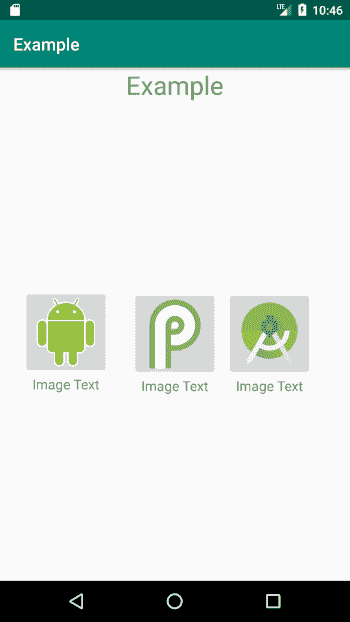
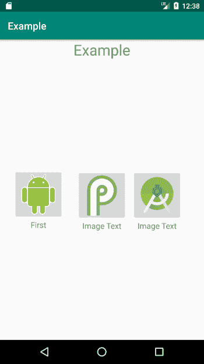
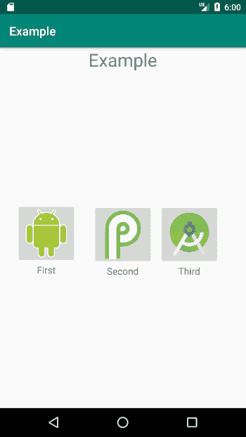
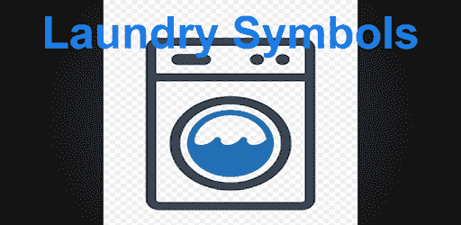

# 如何在 Android 中绑定数据

> 原文：<https://www.freecodecamp.org/news/how-to-bind-data-in-android/>

数据绑定是一种技术，当您想要将信息片段(您的数据)粘附到一些可视用户输入元素时使用。在这个过程中，每当输入更新时，其背后的数据也会更新。

这并不是一个新概念，有太多的框架已经将这一点融入了它们的设计中(比如 AngularJS/React/Vue)。

本文中我们关注的不是前端框架，而是移动开发。谷歌在 Android 中引入了[数据绑定库](https://developer.android.com/topic/libraries/data-binding)，它是 [Android Jetpack](https://developer.android.com/jetpack) 的一部分。

如果你不熟悉 Jetpack 库套件，可能是因为 [Google 已经宣布](https://developer.android.com/topic/libraries/support-library)它将停止开发其支持库。相反，它将支持 AndroidX 库(这是支持库的新版本)。

我知道有很多文章解释了如何使用适配器来使用数据绑定，但是这篇文章不会关注这个问题。相反，我将展示一种最基本、最简单的数据绑定方法，它可以通过减少您必须编写的代码量来节省您的时间。

# 为什么要使用数据绑定？

如果您还没有被说服，让我们花几分钟时间通过展示一个例子来解释使用数据绑定的好处。假设您有一个带有三个自定义按钮的菜单，其中每个按钮都是一个布局。



Our layout

生成所有这些内容的一种方法是使用四种不同的 XML 布局:一种用于主布局，一种用于三个按钮。

您需要这样做，因为每个按钮将用户导向应用程序的不同部分，因此需要不同的文本和不同的图像。

```
<?xml version="1.0" encoding="utf-8"?>
<LinearLayout xmlns:android="http://schemas.android.com/apk/res/android"
    android:orientation="vertical"
    android:layout_gravity="center_horizontal"
    android:layout_height="wrap_content"
    android:layout_width="wrap_content">

    <ImageView
        android:id="@+id/imageView"
        android:layout_height="100dp"
        android:layout_width="100dp"
        android:src="@drawable/image_name"
        android:adjustViewBounds="true"
        android:scaleType="centerInside"
        />

    <TextView
        android:id="@+id/textView"
        android:gravity="center_horizontal"
        android:layout_height="wrap_content"
        android:layout_width="match_parent"
        android:text="Image Text"
        android:textSize="16sp" />

</LinearLayout>
```

A button's layout

当然，这并没有太多的代码重复，因为我们只处理三种布局。但是如果你仔细想想，处理这些代码是非常浪费时间的。如果您考虑一个具有更复杂布局的应用程序，一个可能展示产品及其图像的应用程序，这可能会导致大量乏味的代码复制。

通过数据绑定，我们将设法只创建一个供所有按钮使用的 XML 布局。

# 我们从哪里开始？

我们需要让我们的项目支持数据绑定。为此，我们需要在应用程序的`build.gradle`文件中添加`dataBinding`元素:

```
android {
    compileSdkVersion 29
    buildToolsVersion "29.0.2"
    defaultConfig {
        applicationId "com.tomerpacific.example"
        minSdkVersion 15
        targetSdkVersion 29
        versionCode 1
        versionName "1.0"
        testInstrumentationRunner "androidx.test.runner.AndroidJUnitRunner"
        dataBinding {              //<-------
          enabled = true
        }
    }
    buildTypes {
        release {
            minifyEnabled false
            proguardFiles getDefaultProguardFile('proguard-android-optimize.txt'), 'proguard-rules.pro'
        }
    }
}
```

build.gradle

在同步我们的项目之后，我们将创建我们的数据类，我们将用它来绑定布局。

```
package com.tomerpacific.example

import android.graphics.drawable.Drawable

data class ButtonData(val buttonText: String, val buttonImageSrc : Drawable) 
```

ButtonData.kt

请注意，在我们的`ButtonData`类中有两个字段:

*   这是将显示在我们图像下方的文本。
*   `buttonImageSrc` —这负责按钮的图像。

如果我们想要更多的数据，我们只需在数据类中添加更多的字段。

# 实际绑定

接下来，我们需要在布局中声明一个变量属性，以便可以使用它。这个变量将绑定到我们创建的数据类。为此，我们需要做两件事:

*   将我们的根布局元素包装在布局标签中。
*   添加一个包含变量声明的数据标签(`buttonData`)。

```
<?xml version="1.0" encoding="utf-8"?>
<layout xmlns:android="http://schemas.android.com/apk/res/android">  // <---- 1

    <data>
        <variable name="buttonData" type="com.tomerpacific.example.ButtonData"/> // <---- 2
    </data>

    <androidx.constraintlayout.widget.ConstraintLayout xmlns:app="http://schemas.android.com/apk/res-auto"
        android:layout_width="match_parent"
        android:layout_height="match_parent">

        <TextView
            android:id="@+id/textView2"
            android:layout_width="wrap_content"
            android:layout_height="wrap_content"
            android:text="Example"
            android:textSize="30dp"
            app:layout_constraintLeft_toLeftOf="parent"
            app:layout_constraintRight_toRightOf="parent"
            app:layout_constraintTop_toTopOf="parent" />

        <LinearLayout
            android:layout_width="wrap_content"
            android:layout_height="wrap_content"
            android:layout_gravity="center_horizontal"
            android:orientation="vertical"
            app:layout_constraintBottom_toBottomOf="parent"
            app:layout_constraintEnd_toStartOf="@+id/linearLayout3"
            app:layout_constraintStart_toStartOf="parent"
            app:layout_constraintTop_toBottomOf="@+id/textView2">

            <ImageButton
                android:layout_width="100dp"
                android:layout_height="100dp"
                android:adjustViewBounds="true"
                android:scaleType="centerInside"
                android:src="@drawable/android">

            </ImageButton>

            <TextView
                android:layout_width="match_parent"
                android:layout_height="wrap_content"
                android:gravity="center_horizontal"
                android:text="Image Text"
                android:textSize="16sp" />

        </LinearLayout>

        <LinearLayout
            android:id="@+id/linearLayout3"
            android:layout_width="wrap_content"
            android:layout_height="wrap_content"
            android:layout_gravity="center_horizontal"
            android:orientation="vertical"
            app:layout_constraintBottom_toBottomOf="parent"
            app:layout_constraintEnd_toEndOf="parent"
            app:layout_constraintStart_toStartOf="parent"
            app:layout_constraintTop_toBottomOf="@+id/textView2"
            app:layout_constraintVertical_bias="0.504">

            <ImageButton
                android:layout_width="100dp"
                android:layout_height="100dp"
                android:adjustViewBounds="true"
                android:scaleType="centerInside"
                android:src="@drawable/android_p_logo">

            </ImageButton>

            <TextView
                android:layout_width="match_parent"
                android:layout_height="wrap_content"
                android:gravity="center_horizontal"
                android:text="Image Text"
                android:textSize="16sp" />

        </LinearLayout>

        <LinearLayout
            android:id="@+id/linearLayout2"
            android:layout_width="wrap_content"
            android:layout_height="wrap_content"
            android:layout_gravity="center_horizontal"
            android:orientation="vertical"
            app:layout_constraintBottom_toBottomOf="parent"
            app:layout_constraintEnd_toEndOf="parent"
            app:layout_constraintHorizontal_bias="0.200"
            app:layout_constraintStart_toEndOf="@+id/linearLayout3"
            app:layout_constraintTop_toBottomOf="@+id/textView2"
            app:layout_constraintVertical_bias="0.504">

            <ImageButton
                android:layout_width="100dp"
                android:layout_height="100dp"
                android:adjustViewBounds="true"
                android:scaleType="centerInside"
                android:src="@drawable/android_studio_icon">

            </ImageButton>

            <TextView
                android:layout_width="match_parent"
                android:layout_height="wrap_content"
                android:gravity="center_horizontal"
                android:text="Image Text"
                android:textSize="16sp" />

        </LinearLayout>

    </androidx.constraintlayout.widget.ConstraintLayout>

</layout>
```

activity_main.xml

注意，我们可以将模式从先前的主布局中移除，因为它被移动到了根布局标记中。此外，我们添加的变量直接绑定到我们的数据类。

在我们的`MainActivity`文件中，我们需要添加代码来处理绑定:

```
package com.tomerpacific.example

import androidx.appcompat.app.AppCompatActivity
import android.os.Bundle
import androidx.databinding.DataBindingUtil
import com.tomerpacific.example.databinding.ActivityMainBinding

class MainActivity : AppCompatActivity() {

    override fun onCreate(savedInstanceState: Bundle?) {
        super.onCreate(savedInstanceState)
        setContentView(R.layout.activity_main)

        val binding: ActivityMainBinding = DataBindingUtil.setContentView(
            this, R.layout.activity_main)

        binding.buttonData = ButtonData("First", resources.getDrawable(R.drawable.android))
    }
}
```

MainActivity.kt

每次在布局内部创建变量时，都会自动为该布局生成一个绑定类。在我们的例子中，我们的布局被称为`activity_main`，因此绑定类将被命名为`ActivityMainBinding`。

约定总是在布局名称的末尾加上 **绑定** 。

因为我们在布局中将`buttonData`声明为我们的变量，所以它被附加到绑定对象上，我们可以为它分配一个新的`ButtonData`类实例。

完成所有这些之后，我们终于可以在布局中使用刚刚绑定的数据了。

```
<LinearLayout
            android:layout_width="wrap_content"
            android:layout_height="wrap_content"
            android:layout_gravity="center_horizontal"
            android:orientation="vertical"
            app:layout_constraintBottom_toBottomOf="parent"
            app:layout_constraintEnd_toStartOf="@+id/linearLayout3"
            app:layout_constraintStart_toStartOf="parent"
            app:layout_constraintTop_toBottomOf="@+id/textView2">

            <ImageButton
                android:layout_width="100dp"
                android:layout_height="100dp"
                android:adjustViewBounds="true"
                android:scaleType="centerInside"
                android:src="@{buttonData.buttonImageSrc}">  // <----

            </ImageButton>

            <TextView
                android:layout_width="match_parent"
                android:layout_height="wrap_content"
                android:gravity="center_horizontal"
                android:text="@{buttonData.buttonText}"   // <----
                android:textSize="16sp" />
```

Using the bound variable buttonData

结果是:



Pretty smooth, eh?

# 等一下…

我们有三个按钮，而我们的数据类只能用于一个按钮，那么我们如何解决这个问题呢？

```
package com.tomerpacific.example

data class ButtonsData(val buttonsData : List<ButtonData>) {

    fun get(index: Int) : ButtonData {
        return buttonsData.get(index)
    }
}
```

ButtonsData.kt

我们必须覆盖`get`方法，因为当我们在布局中使用它时需要识别它。

然后，我们需要更改我们的`activity_main.xml`中的引用:

```
 <data>
        <variable name="buttonsData" type="com.tomerpacific.example.ButtonsData"/>
 </data>
```

We changed the variable name and the class to match ButtonsData

我们必须为新的数据类创建一个新的绑定:

```
override fun onCreate(savedInstanceState: Bundle?) {
        super.onCreate(savedInstanceState)
        setContentView(R.layout.activity_main)

        val binding: ActivityMainBinding = DataBindingUtil.setContentView(
            this, R.layout.activity_main)

        val firstButton : ButtonData = ButtonData("First", resources.getDrawable(R.drawable.android))

        val secondButton : ButtonData = ButtonData("Second", resources.getDrawable(R.drawable.android_p_logo))

        val thirdButton : ButtonData = ButtonData("Third", resources.getDrawable(R.drawable.android_studio_icon))

        val buttonsData : ButtonsData = ButtonsData(listOf(firstButton, secondButton, thirdButton))

        binding.buttonsData = buttonsData
    }
```

MainActivity.kt

我们创建了三个`ButtonData`类的实例。然后我们实例化一个`ButtonsData`对象，并将其附加到我们的绑定对象。

最后，我们现在可以在布局中正确使用我们的数据类了:

```
 <LinearLayout
            android:layout_width="wrap_content"
            android:layout_height="wrap_content"
            android:layout_gravity="center_horizontal"
            android:orientation="vertical"
            app:layout_constraintBottom_toBottomOf="parent"
            app:layout_constraintEnd_toStartOf="@+id/linearLayout3"
            app:layout_constraintStart_toStartOf="parent"
            app:layout_constraintTop_toBottomOf="@+id/textView2">

            <ImageButton
                android:layout_width="100dp"
                android:layout_height="100dp"
                android:adjustViewBounds="true"
                android:scaleType="centerInside"
                android:src="@{buttonsData.get(0).buttonImageSrc}">   // <-------

            </ImageButton>

            <TextView
                android:layout_width="match_parent"
                android:layout_height="wrap_content"
                android:gravity="center_horizontal"
                android:text="@{buttonsData.get(0).buttonText}"       // <--------
                android:textSize="16sp" />

        </LinearLayout>
```

Example usage of one element



Works like a charm

本文是根据我开发以下应用程序的经验撰写的:

(你永远不知道，它可能会有用)

[Laundry Symbols - Apps on Google PlayEver had a hard time figuring out what those laundry symbols mean? Well, your’e in luck! This app contains an explanation on all those weird looking symbols with an easy to use interface and picturestomerpacificApps on Google Play](https://play.google.com/store/apps/details?id=com.tomerpacific.laundry)

Get it via the Google Play Store

你可以在这里看到完整的源代码:

[TomerPacific/LaundrySymbolsAn application written in Kotlin showing the different laundry symbols with an explanation :cyclone: - TomerPacific/LaundrySymbolsTomerPacificGitHub](https://github.com/TomerPacific/LaundrySymbols)

View The Full Source Code