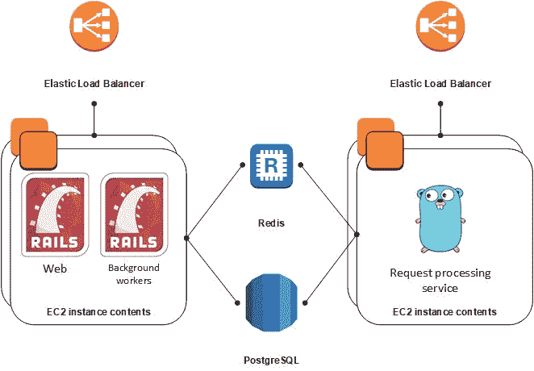

# 如何用 RSpec 对一个 Go app 进行黑盒测试

> 原文：<https://www.freecodecamp.org/news/how-to-black-box-test-a-go-app-with-rspec-421e786f4103/>

作者:德米特里·卢茨科

# 如何用 RSpec 对一个 Go app 进行黑盒测试


如今，自动化测试在 web 开发中风靡一时，并贯穿整个行业。当您添加新功能或修复 bug 时，编写良好的测试可以显著降低意外破坏应用程序的风险。当您有一个由几个相互交互的组件构建的复杂系统时，测试每个组件如何与其他组件交互是非常困难的。

让我们看看如何为在 Go 中开发组件编写良好的自动化测试，以及如何使用 Ruby on Rails 中的 RSpec 库来完成这些工作。

### 将 Go 添加到我们项目的技术堆栈中

我在我的公司工作的一个项目是 [eTeam](https://eteam.io/) ，可以分为管理面板、用户仪表板、报告生成器和请求处理器，用于处理来自集成到应用程序中的不同服务的请求。

项目中处理请求的部分是最重要的，因此我们需要最大化它的可靠性和可用性。

作为整体应用程序的一部分，影响请求处理器的错误风险很高，即使应用程序中与其无关的部分的代码发生了变化。同样，当其他组件负载过重时，请求处理器也有崩溃的风险。应用程序的 Ngnix 工作人员数量有限，随着负载的增加，这可能会导致问题。例如，当在管理面板中同时打开大量资源密集型页面时，处理器会变慢，甚至使整个应用程序崩溃。

这些风险，以及相关系统的成熟度——我们几个月来都没有进行重大修改——使得这款应用成为创建独立服务来处理请求的理想候选。

我们决定在 Go 中编写单独的服务，与 Rails 应用程序共享数据库访问，Rails 应用程序仍然负责表结构的更改。只有两个应用程序，这样一个共享数据库的方案工作得很好。它看起来是这样的:



我们在一个单独的 Rails 实例中编写和部署了服务。这样，无论何时部署 Rails 应用程序，都不必担心请求处理器会受到影响。该服务直接接受 HTTP 请求，不需要 Ngnix，也不会占用太多内存。你可以称之为极简主义应用！

### Go 中单元测试的问题

我们为 Go 应用程序创建了单元测试，其中模拟了所有数据库请求。除了这个解决方案的其他参数，主要的 Rails 应用程序负责数据库结构，因此 Go 应用程序实际上没有创建测试数据库的信息。一半的处理是业务逻辑，而另一半是数据库查询，所有这些都被嘲笑。

模仿对象在 Go 中比在 Ruby 中可读性差得多。每当添加新的函数来从数据库中读取数据时，我们都必须在以前工作的许多失败测试中添加模拟对象。最终，这样的单元测试被证明不是非常有效，而且非常脆弱。

### 我们的解决方案

为了弥补这些缺陷，我们决定在 Rails 应用程序中用功能测试来覆盖服务，并像黑盒一样在 Go 中测试服务。白盒测试在任何情况下都不会起作用，因为不可能使用 Ruby 进入服务内部并查看方法是否被调用。

这也意味着通过测试服务发送的请求也不可能被模仿，因此我们需要另一个应用程序来管理和编写这些测试。类似 RequestBin 的东西可以工作，但是它必须在本地工作。我们已经编写了一个实用程序，所以我们决定尝试使用它。

这是最终的设置:

1.  RSpec 编译并运行 Go 二进制文件，配置中指定了对测试数据库的访问以及接收 HTTP 请求的特定端口，即 8082。
2.  它还运行该实用程序，该程序记录到达端口 8083 的 HTTP 请求。
3.  我们在 RSpec 中编写常规测试。这将在数据库中创建必要的数据，并向 localhost:8082 发送一个请求，就像它是一个外部服务(如 HTTParty)一样。
4.  我们解析响应，检查数据库中的更改，接收由 RequestBin 替代记录的请求列表，并检查它们。

### 实施的细节

这是我们如何实现的。作为演示，让我们将测试服务称为服务并创建一个包装器:

值得一提的是，使用 RSpec 时，必须在 support 文件夹中配置自动加载文件:

```
Dir[Rails.root.join('spec/support/**/*.rb')].each {|f| require f}
```

启动方法:

*   读取启动服务所需的配置信息。不同的开发人员会有不同的信息，因此 Git 中不包含这些信息。该配置包含启动程序的必要设置。所有这些不同的配置都在一个地方，因此您不必创建不必要的文件。
*   编译并运行配置>的`go run <path to main.go> <path t`
*   每秒轮询一次，等待服务准备好接受请求。
*   记录每个进程的标识符，以便不重复任何操作，并且能够停止某个进程。

配置本身:

“stop”方法只是停止该过程。不过有个问题！Ruby 运行一个“go run”命令，该命令编译服务并在一个 ID 未知的子进程中启动一个二进制文件。如果我们只是停止正在 Ruby 中运行的进程，子进程不会自动停止，端口将继续使用。因此，停止服务必须通过进程组 ID:

接下来，我们准备“shared_context ”,在这里我们定义默认变量，启动服务(如果它还没有启动),并临时关闭 VCR，因为 VCR 会将我们所做的视为外部服务请求，但是我们不希望 VCR 在此时模拟请求:

现在我们可以看看如何编写规范本身:

该服务可以向外部服务发出 HTTP 请求。我们可以将其配置为将请求重定向到记录它们的本地实用程序。对于这个实用程序，还有一个用于启动和停止它的包装器，类似于“TheServiceControl ”,只是这个实用程序可以作为二进制文件启动，无需编译。

### 其他亮点

编写 Go 应用程序是为了将所有日志和调试信息发送到 STDOUT。在生产中，该输出被发送到一个文件中。当从 RSpec 启动时，日志显示在控制台中，这对调试非常有帮助。

如果你专门运行不需要服务的规范，那么它就不会启动。

为了不在每次规范改变时启动服务时浪费时间，在开发过程中，您可以在终端中手动启动服务，而不需要关闭它。必要时，您甚至可以在 IDE 调试模式下启动它。然后规范准备好一切，发送请求到服务，它停止，你可以很容易地调试它。这使得 TDD 方法非常方便。

### 结论

我们已经使用这个设置大约一年了，还没有遇到任何故障。这些规范比 Go 中的单元测试更具可读性，而且它们不依赖于对服务内部结构的了解。如果我们，出于某种原因，需要用另一种语言重写服务，那么我们不需要改变规范。只有用于用不同命令启动测试服务的包装器需要重写。