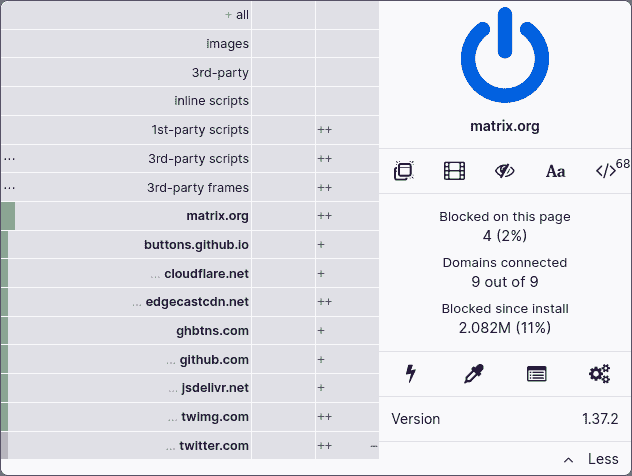
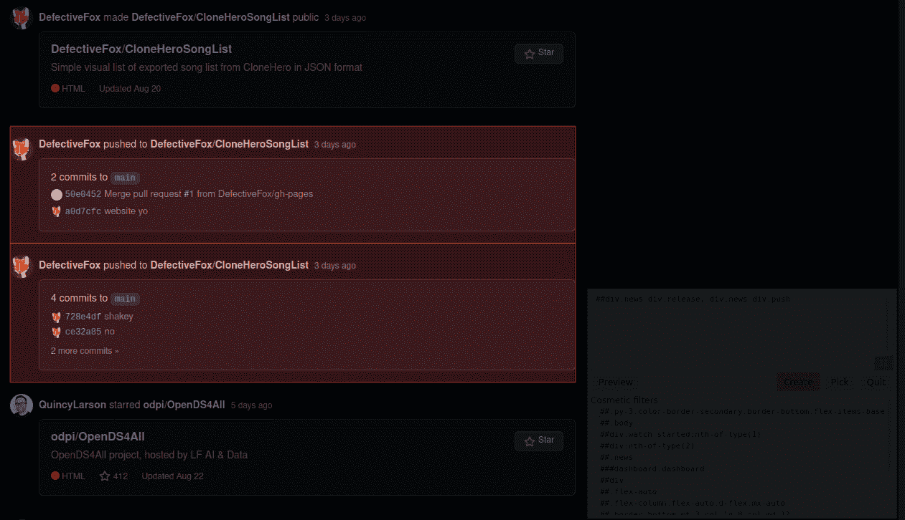
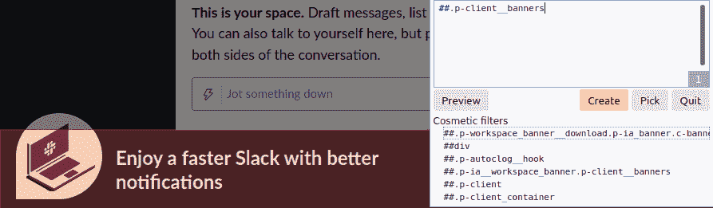
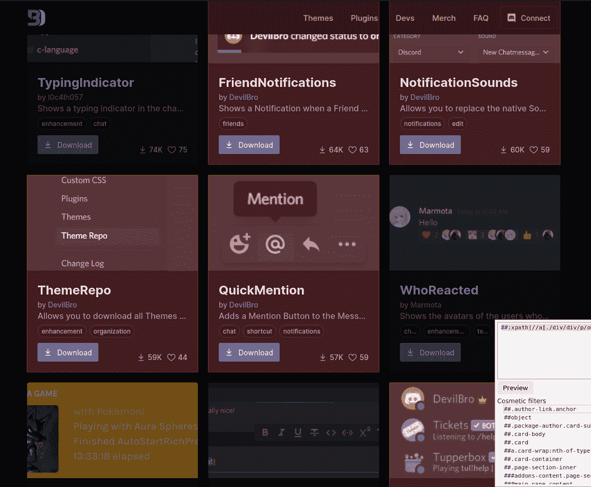
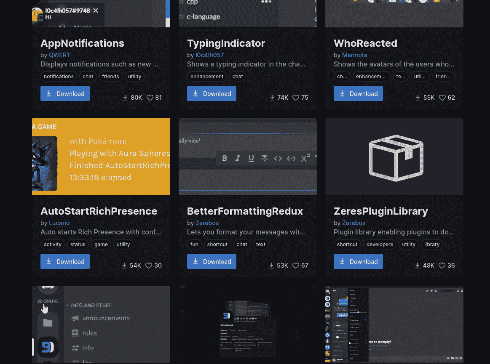
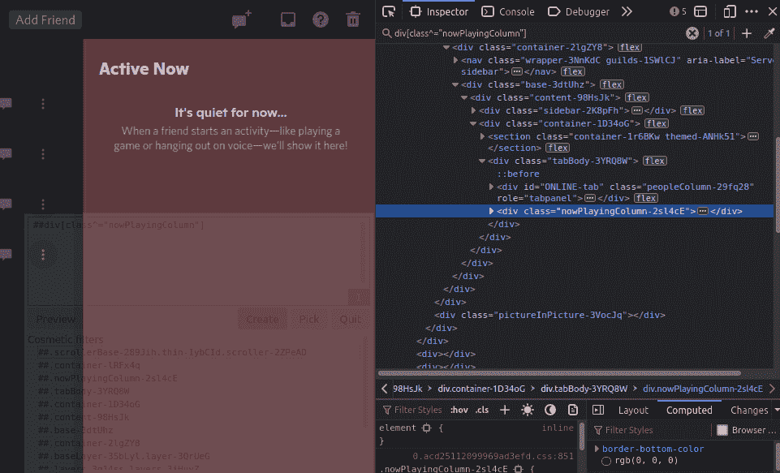

# 如何使用 uBlock Origin 阻止网页中不想要的内容

> 原文：<https://www.freecodecamp.org/news/how-to-block-content-from-web-pages-using-ublock-origin/>

您可以使用浏览器中的扩展来移除网页中您不想看到的部分。当你在网上消费信息时，消除烦恼、分心和无关的内容是保持专注和高效的好方法。

有许多扩展将这一功能添加到您的浏览器中。我将把重点放在 [uBlock Origin，](https://ublockorigin.com/)因为很多人已经有了它。如果你没有，那么我强烈建议你安装它。

## 什么是 uBlock 起源？

uBlock Origin 是一款免费开源的广告拦截器，适用于所有主流浏览器。它还包括一个[元素选择器](https://github.com/gorhill/uBlock/wiki/Element-picker)工具，可以移除定制元素，这就是我们将在本文中使用的。

了解 CSS 选择器或 XPath 将有助于您完成本教程，但不是必需的。uBlock Origin 提供可视化工具，无需技术知识即可选择元素。尽管如此，手动编写选择器通常会更可靠。

## 为什么阻塞元素是有用的

在互联网上，我们不断地消费信息，但往往是与我们无关的信息。

如果你经常访问特定的网站，如果你能有条件地挑选出你知道你不会需要的信息，并且从一开始就不消费它，这将大大提高生产力。

*   从活动或社交媒体源中删除某些类型的事件。
*   删除要求你做你不想做的事情的弹出窗口。
*   删除 YouTube 或社交媒体上特定作者的帖子。
*   移除分散你注意力的事物或动态元素。

## 如何过滤 HTML 元素

要过滤元素，您可以点按浏览器顶部的“子块原点”图标，然后点按带有眼药水图标的元素选取器。([更多信息](https://github.com/gorhill/uBlock/wiki/Element-picker))

The uBlock Origin interface, this appears if you click the icon in your browser's toolbar.

您可以从选择要删除的内容开始。即使选择并不完美，这只是一个起点。

一旦该框出现在右下角，您可以使用带有“Pick”按钮和滑块的可视化工具，或者手动指定一个选择器。

选择“创建”按钮后，将以红色突出显示的内容将被删除。即使以后刷新或重新访问该页面，这些更改也会持续存在。让我们看看这是如何工作的。

### CSS 选择器

您可以使用 CSS 选择器轻松移除大多数想要移除的元素。这对于删除页面上的静态内容非常有用。

Removes all release and push events from appearing in my GitHub activity feed. (`##div.news div.release, div.news div.push`)

Removes the banner to download Slack. (`##.p-client__banners`)

### XPath

出于以下两个原因之一，您通常会希望使用 XPath:

*   您需要检查元素的值。
*   您需要根据其子元素的属性来选择元素。

这对于删除动态或用户生成的内容非常有用。我们希望删除整个元素，但前提是元素内部的某些内容符合标准，而不是元素本身。

Removes all plugins from DevilBro. (`##:xpath(//a[./div/div/p/object/a = "DevilBro"])`)

How it looks after removing all plugins by DevilBro.

### 过滤器故障排除

在过滤元素的时候，你的选择器可能会在任何时候中断。网站因各种原因而改变，大多数情况下是由于维护或更新。

但是，不要让这阻止你做你想做的事情。这只是意味着在删除元素时，您应该记住这一点。

尽量让你的选择器位于你真正想要删除的地方，但是要足够严格，以免错误地选择页面上的其他元素。

也有很多网站不欣赏客户端的修改，并试图通过任意更改 HTML 属性值或混淆来阻碍这一点。

在这些情况下，最好指定 [CSS 属性选择器](https://developer.mozilla.org/en-US/docs/Web/CSS/Attribute_selectors)或者使用 XPath 来部分匹配属性值。

Removing the "Active Now" view on Discord using an attribute selector, (`##div[class^="nowPlayingColumn"]`)

### 如何移除过滤器

如果您不想再阻止某些内容，或者网站已经更改，您可以在制作新过滤器之前，前往设置以删除旧过滤器。

要删除自定义过滤器:

1.  导航到子块原点设置。
2.  选择“我的过滤器”选项卡。
3.  删除包含要移除的过滤器的行。
4.  单击顶部的“应用更改”。
5.  刷新您所在的页面。

## 其他有用的浏览器扩展

您也可以使用其他扩展来删除网站上特定类型的内容。

### 突出显示或隐藏搜索引擎结果

[高亮或隐藏搜索引擎结果](https://github.com/pistom/hohser) (HOHSER)支持所有主流搜索引擎，包括 [DuckDuckGo](https://duckduckgo.com/) 和 Google。

我相信域名黑名单应该是搜索引擎中的一个本地用户设置，但是在那之前，你可以使用这个扩展来隐藏你不喜欢的域名下的结果。

*   带有重新托管或可疑下载链接的网站。
*   搜索引擎优化垃圾，像假优惠券网站。
*   屏蔽欧盟用户的网站。

### 我不在乎饼干

[我不在乎 cookie](https://www.i-dont-care-about-cookies.eu/)删除了大多数网站上出现的 cookie 警告，这样你就不用自己处理它们了。

扩展将试图隐藏 cookie 消息，仅在必要时接受 cookie。

我强烈建议仅将此与 uBlock Origin 和 Privacy Badger 等扩展结合使用，以防止保存不需要的 cookies。

或者，可以将这个扩展的过滤器列表添加到 uBlock Origin。但是，这意味着 cookie 消息和广告拦截过滤器将耦合在一起。通过这种方法，您已禁用 uBlock Origin 的网站将继续显示 cookie 消息。

要将自定义过滤器列表添加到子块原点:

1.  导航到子块原点设置。
2.  选择“过滤器列表”选项卡。
3.  滚动到底部的“自定义”部分。
4.  选择“导入...”。
5.  添加`[https://www.i-dont-care-about-cookies.eu/abp/](https://www.i-dont-care-about-cookies.eu/abp/)`。
6.  选择页面顶部的“应用更改”。

## 结论

我希望你不会觉得有必要屏蔽你加载的页面上的大量内容。

但是如果你觉得有必要的话，我希望这能让浏览互联网对你来说更容易忍受一些。