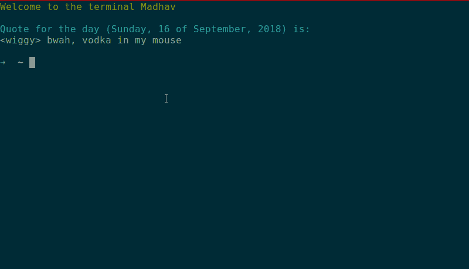
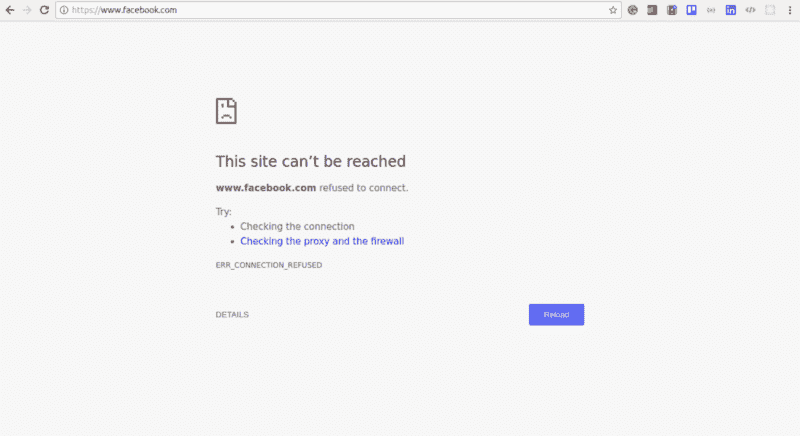
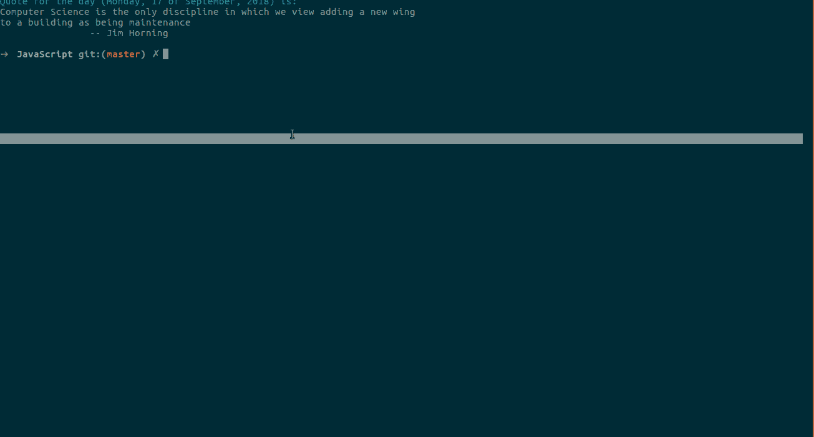

# 如何使用 JavaScript 阻止无效网站并提高您的工作效率

> 原文：<https://www.freecodecamp.org/news/how-to-block-unproductive-websites-and-boost-your-productivity-using-javascript-20534011cccc/>

作者:马达夫·巴尔

# 如何使用 JavaScript 阻止无效网站并提高您的工作效率


Time to get sh*t done :)

厌倦了在各种非生产性网站上浪费时间？为什么不写一个脚本来帮助你限制在这些网站上花费的时间呢？

这听起来熟悉吗…？

> 又是一天，浏览我的社交媒体订阅，看迷因。我发现已经有 4 个小时了，我一直坐在同一个位置上，什么也没做。我讨厌它！我必须做点什么。我想到，为什么不写一些脚本来帮助我限制在这些网站上花费的时间呢？


Stop scrolling through your feed, and do something xD (source: [https://www.writerswrite.com/writingmemes/](https://www.writerswrite.com/writingmemes/))

如何制作一个脚本来阻止所有这些网站？该脚本只允许您在一天中的特定时间使用它们。听起来很合理！让我们开始吧。:-)

是的，我知道有很多简单的方法可以屏蔽任何网站。只需下载一些 Chrome 插件，或者任何能为我们做到这一点的软件。嗯，是的，很简单！但是拜托，我们是开发商，我们不做这些事情！当我们需要一些东西时，我们为它开发脚本，而不是使用一些随机的技巧来完成工作…对吗？！

如果你想直接下载脚本，你可以从[这里](https://github.com/MadhavBahlMD/Control-Yourself/blob/master/JavaScript/blocker.js)下载。

### 我们开始吧！

与我的其他教程文章不同，您不需要为这个项目设置任何目录结构或开发环境。您所需要的只是系统上安装的 NodeJS 和一个好的文本编辑器。您可以使用任何支持文件处理的语言来编写这个脚本。我选择 JavaScript 是因为我热爱它！


**I ❤️ JavaScript!** (source: [https://brendaneich.com/2015/06/from-asm-js-to-webassembly/](https://brendaneich.com/2015/06/from-asm-js-to-webassembly/))

### 背景想法

我们要做的这个阻断器背后的想法非常简单。有一个名为`hosts`的文件。我们可以添加任何网站的 URL 和我们想要将以前的网站重定向到的网站的 URL。大概是这样的:

```
127.0.0.1    www.facebook.com
```

现在，每当我们试图打开脸书，它将被自动重定向到 127.0.0.1(本地主机)。这样会间接屏蔽网站。

如果你使用 Windows，我所说的主机文件存在于`C:\Windows\System32\drivers\etc\hosts`中。如果您是 Mac 或 Linux 用户，该文件的位置是:`/etc/hosts`。

### 让我们修改文件…

在开始编写代码之前，让我们尝试修改文件，看看它是否有效。请注意，只有具有管理员权限的用户才能修改此文件。如果你在 Windows 上，你可以右击该文件并以管理员身份打开。如果您使用的是 Linux，可以使用 sudo 命令。我用 nano 打开文件，你可以用你选择的任何其他编辑器。

```
sudo nano /etc/hosts
```

键入此命令后，它会要求您输入密码。你可以输入并打开你的文件。我们来试试吧:)



好了，我们在 hosts 文件中添加了“要阻止”的网站，现在让我们来看看它是否有效。要检查它，去任何网络浏览器，并前往该网站。



Yippee! It worked :3

现在，我们已经检查了我们的概念是正确的，让我们编码拦截器。

### 1.设置变量

正如我前面说过的，不需要大的目录结构或者开发环境的设置。你只需要做一个 JavaScript 文件(比方说，`blocker.js`)并开始编码。

首先，我们需要导入`fs`(文件系统)节点模块，通过它我们将对 hosts 文件进行更改。你可以在这里阅读 fs [的完整文档。](https://nodejs.org/api/fs.html)

```
const fs = require('fs');
```

现在，我们需要初始化 3 个变量:

1.  **filePath** —存储主机文件的路径
2.  **redirectPath** —用于重定向路径(此处为本地主机)
3.  **网站** —要阻止的网站阵列

此外，我们将创建一个名为`delay`的变量。这个变量将存储持续时间的值(以毫秒为单位),在此之后我们的脚本将重复执行。基本上，这个想法是让脚本一直运行，以检查是否是时候阻止/解封网站。为了保持它的运行，我们将在 JavaScript 中使用`setInterval()`方法。我们也可以用`while (true) {}`来做一个无限循环。

现在我们保持函数重复自身的时间不变(比如 10 秒)。但是，通过将 delay 的值设置为当前时间和脚本状态(阻止/解除阻止)必须改变的时间之间的时间差，可以使该脚本更加智能。做到这一点比感觉起来要容易得多——所以我希望你(读者)自己去做，并给我发一封邮件，我很乐意收到你的来信？

```
const filePath = "/etc/hosts";const redirectPath = "127.0.0.1";let websites = [ "www.someRandomWebsite.com","anotherWebsite.com" ];let delay = 10000;
```

**注意*** 如果您是 Windows 用户，请将它存储在 filePath 变量中:C:\ Windows \ System32 \ drivers \ etc \ hosts

### 2.拦截器功能

我们现在将创建一个阻塞函数。我们从 setInterval 方法中调用它，以保持它在每个给定的时间间隔后运行。

```
let blocker = () => {    ....    ....};
```

现在，我们将在 blocker 函数中填充代码。

#### 内部拦截器:获取当前时间

首先我们需要获得当前时间，然后检查是否是阻止网站或解除阻止的时间。

```
let date = new date();let hours = date.getHours();if(hours >= 14 && hours < 18) {    console.log('Time to block websites');    ....    ....} else {    console.log('Time to unblock websites');    ....    ....}
```

#### 内部拦截器:内部 If—If 条件为真

现在我们需要读取 hosts 文件并将获取的数据转换成字符串(`readFile()`函数将返回需要转换成字符串的缓冲区数据)。

在读取该文件后，我们需要检查每个网站和重定向路径是否存在于 hosts 文件中。如果它存在，那么我们可以忽略它。否则，我们需要将`redirectPath websiteURL`附加到它上面，看起来像这样:

```
127.0.0.1    www.someRandomWebsite
```

为了实现这一点，我们将使用 for 循环。该循环将遍历 websites 数组中的每个 URL，并检查它是否存在于文件中。为此，我们将使用`indexOf()`字符串的方法。如果值大于零，即给定的网站存在于 hosts 文件中，我们可以简单地忽略它。否则，如果值不大于零，我们需要将重定向路径和网站 URL(用空格分隔)附加到文件中。

```
fs.readFile(filePath, (err, data) => {    fileContents = data.toString();    for(let i=0;i<websites.length;i++) {        let addWebsite = "\n" + redirectPath + " " + websites[i];        if (fileContents.indexOf(addWebsite) < 0) {            console.log('Website not present in hosts file');            fs.appendFile(filePath, addWebsite, (err) => {                if (err)  return console.log(err);                console.log('File Updated Successfully');            });        } else {            console.log('Website is present');        }    }});
```

#### 内部拦截器:内部 Else —如果条件为假

如果条件为假，我们需要检查列表中的网站是否在主机文件中。如果它们存在，我们需要删除它们。

对于删除，我们将使用一个简单的技巧。我们将逐行读取文件。我们创建一个空字符串，并检查当前行是否包含列表中的任何网站。如果是，我们干脆忽略它。否则，我们将把这一行添加到我们初始化的字符串中。检查完最后一行后，我们将简单地用这个 completeContent 字符串替换文件的当前内容。

这样做的代码非常简单。首先初始化一个空字符串(`completeContent`)。然后逐行读取文件。遵循下面代码中给出的步骤。然后用 completeContent 变量替换文件的内容。

```
// Initialize the empty stringlet completeContent = '';
```

```
// Read the file line by linefs.readFileSync(filePath)    .toString()    .split()    .forEach((line) => {        ....        ....        ....        // Do the below given procedure to update completeContent });
```

```
// Replace the file contents by `completeContent` variablefs.writeFile(filePath, completeContent, (err) => {    if (err) {        return console.log('Error!', err);    }});
```

现在我们可以访问每一行了，我们可以通过使用一个标志和一个 for 循环来检查这一行是否包含任何网站。我们将标志设置为 1(或 true ),然后运行一个循环来遍历网站列表。如果该行包含当前网站(我们将使用`string.indexOf(substring)`方法进行检查)，则将标志重置为 0，并中断当前循环。在循环之外，我们检查，如果标志为 1(或 true ),我们将当前行追加到`completeContent`变量中。

**还请注意****如果标志为 1，我们还会检查当前行是否是最后一行。如果它不是最后一行，我们将当前行和一个`"\n"`一起添加到`completeContent`字符串中，这样下一行将从新的一行(或有一个换行符)添加到`completeContent`中。在上述代码块的 forEach()中执行以下代码。**

```
`let flag = 1;for (let i=0; i<websites.length; i++) {    if (line.indexOf(websites[i]) >= 0) { // line contains website        flag = 0;        break;    }}`
```

```
`if(flag == 1) {    if (line === '')           completeContent += line;    else         completeContent += line + "\n";}`
```

### **3.运行拦截器函数的代码**

**以下是 blocker 函数的代码，以防您与第 2 节中的分布式代码混淆:**

**现在，为了连续运行这个函数，我们可以将`while (true) {}`作为一个无限循环。在它里面，我们可以给一些时间延迟，这样它就不会持续占用处理器。**

**或者，更好的选择是使用`setInterval()`函数。这将在特定的时间间隔后不断重复阻断功能。但是，`setInterval()`将在指定的延迟后首次运行。因此，我们必须在 setInterval 函数之前调用一次 blocker 函数。**

```
`blocker();setInterval(blocker, delay);`
```

### **4.全部完成！让我们检查一下我们的脚本**

**该运行我们的脚本了。要运行该脚本，请在终端中打开当前工作目录，并键入以下命令:**

```
`sudo node blocker.js`
```

**如果您是 Windows 用户，可以以管理员身份打开命令提示符，转到项目目录，然后运行命令:**

```
`node blocker.js`
```

**请注意，只是为了检查的目的，我屏蔽了`facebook.com`。下面是测试运行:**

**

Yuss! We Made It ❤** 

### **5.最后一步...**

#### **适用于 Mac 和 Linux**

**您可以安排这个脚本在有人使用 crontab 启动系统时运行。Cron 是类 Unix 计算机操作系统中基于时间的作业调度程序。你可以在这里阅读更多关于 cron 的信息。**

**因此，我们将添加我们的命令，通过它我们在 cron 表中运行脚本(`sudo node blocker.js`)。这样做非常简单:使用`ctrl+alt+t`打开终端，然后使用`sudo crontab -e`打开 crontab。这个命令将打开 cron 表。**

****注意**那个我们用的是`sudo crontab`，不是`crontab`。这将使我们能够修改 cron 表。**

**一旦打开它，在末尾添加这一行(用项目目录的路径替换`path-to-script`):**

```
`@reboot node /path-to-script/blocker.js`
```

**就是这样！这样做将在每次系统重启时运行您的脚本。**

#### **对于 Windows**

**在 Windows 中，该脚本也可以安排在系统每次启动时运行。这里的是一篇很好的文章，讲述了如何做到这一点。**

### **从这里去哪里？**

**你是开源爱好者吗？想为这个项目做贡献吗？我正在开始一个名为**“控制自己”**的新开源项目，这将是一个使用[电子](https://electronjs.org/)制作的桌面应用程序。这些功能将包括:**

*   **从用户那里获取关于他们想在什么时候屏蔽哪些网站的信息**
*   **跟踪用户观看社交媒体网站的时间**
*   **计时器番茄**
*   **和一个 todo 列表应用程序与生产力的每日进度报告。**

**查看[资源库](https://github.com/MadhavBahlMD/Control-Yourself)，并在您感兴趣的问题上添加评论“感兴趣”。**

**现在，让我给你完整的代码和适当的注释，这将有助于你理解代码:**

****完整代码(blocker.js)****

### **好了**

**你觉得这篇文章有帮助吗？**

**[订阅 LeanProgrammer](http://madhavbahl.tech/subscribe/) 成为第一个收到我未来更新通知的人。**

****

**如果你想讨论什么，随时联系我，:D**

**如果您发送您的反馈或建议，或者如果您提出问题，我将非常高兴。此外，我喜欢交新朋友，所以请给我发邮件。**

> **非常感谢你一直读到最后。如有需要可以联系我:
> 邮箱:madhavbahl 10[at]Gmail[dot]com
> Web:【http://madhavbahl.tech/】Github:[https://github.com/MadhavBahlMD](https://github.com/MadhavBahlMD)LinkedIn:[https://www.linkedin.com/in/madhavba*HL/*](https://www.linkedin.com/in/madhavbahl/)**