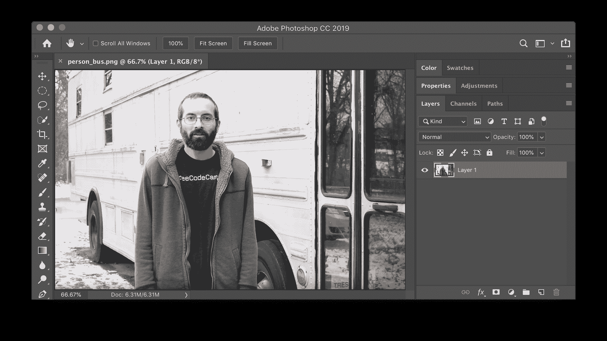
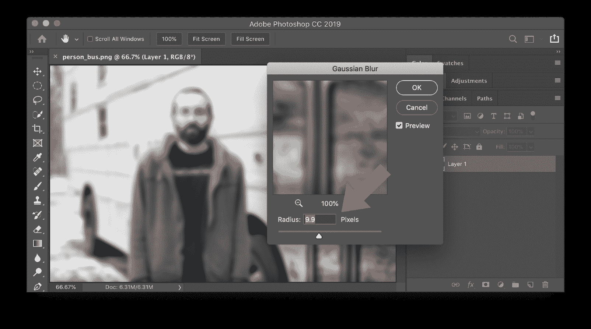
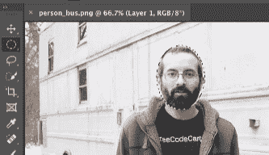
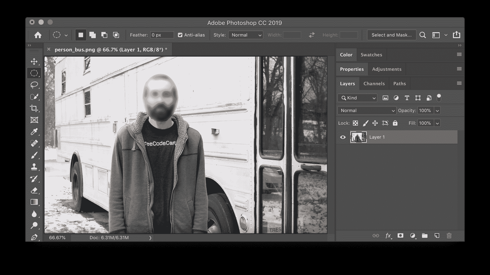
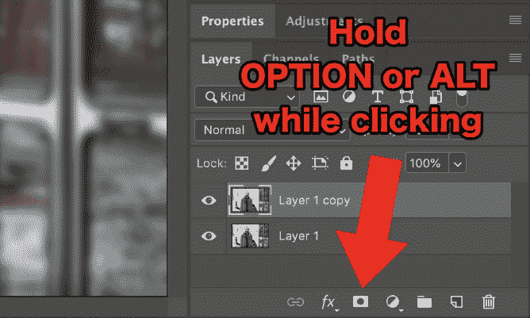
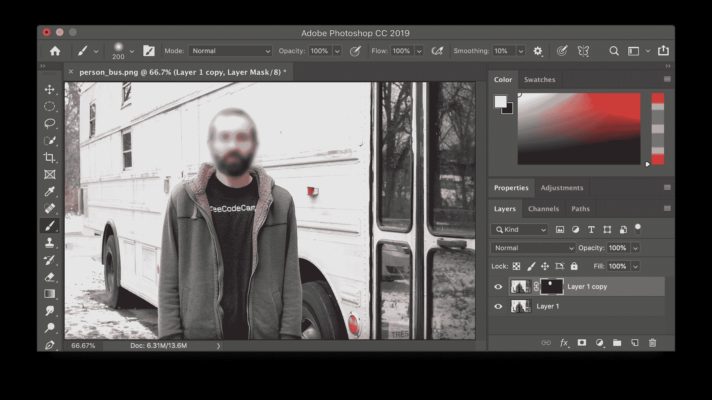

# 如何在 Photoshop 中模糊图片-模糊面孔，背景，等等

> 原文：<https://www.freecodecamp.org/news/how-to-blur-a-picture-in-photoshop-blur-faces-backgrounds-and-more/>

本教程将向您展示如何使用 Photoshop CC 模糊面部、背景、文本等。

我们将利用高斯模糊效果。第一步，在 Photoshop CC 中打开要修改的图像。

### 如何在 Photoshop 中模糊整个图像

如果你想模糊整个图像选择**滤镜>模糊>高斯模糊...**

调整半径以给图像增加或多或少的模糊。然后点击“确定”。

你完了！

### 如何在 Photoshop 中模糊人脸(简易方法)

如果你想在 Photoshop 中模糊一张脸，这里有一个简单的方法。您也可以使用这种方法来模糊文本、徽标、背景和任何其他想要模糊的内容。

首先，使用选择工具选择要模糊的区域。在以下示例中，面是使用椭圆选框工具选择的。

接下来，像之前一样应用高斯模糊(**滤镜>模糊>高斯模糊)...**)。选择半径并单击“确定”。最后，选择**选择>取消选择**。

你完了！

### 如何在 Photoshop 中模糊人脸(高级方法)

在上面的简单方法中，模糊部分和非模糊部分之间有一条硬线。如果您想要在各部分之间进行柔和过渡，请使用这种高级方法。这种方法还会将未模糊的版本保留在一个单独的图层上，以便在必要时可以轻松还原。

首先，通过右键点击图层并选择“复制图层...”来复制图层。

接下来，像之前一样应用高斯模糊(**滤镜>模糊>高斯模糊)...**)与你想要的半径。

点击“添加矢量蒙版”按钮，给复制的图层添加一个蒙版。确保按住 Mac 上的 OPTION 或 Windows 上的 ALT 键，同时单击按钮以隐藏蒙版后面的整个图层。你将不再看到模糊的层。

下一步是使用画笔工具绘制你想要模糊的区域。确保画笔工具有一个软边(考虑设置硬度为 0%)，使用白色作为前景色。

当你在蒙版上画白色的时候，你画的区域会变得模糊，因为模糊的图层会显现出来。

你可以在上面的图像中看到，原来的非模糊层仍然可用。

您可以继续绘制任何想要模糊的部分。

你完了！