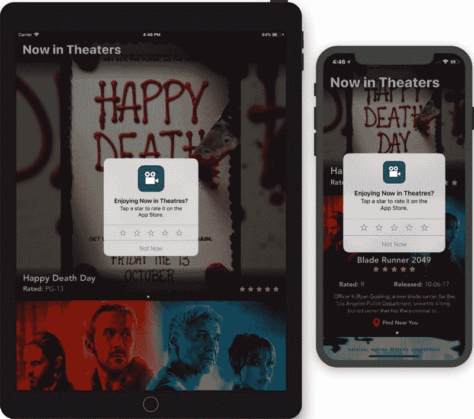
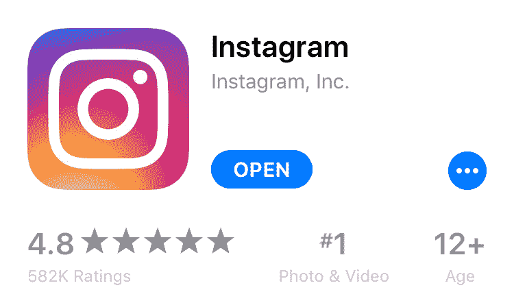
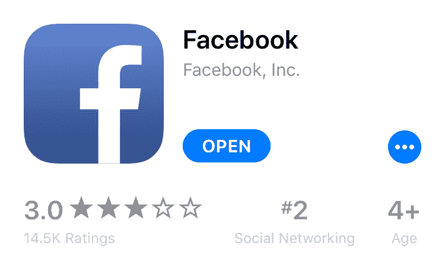
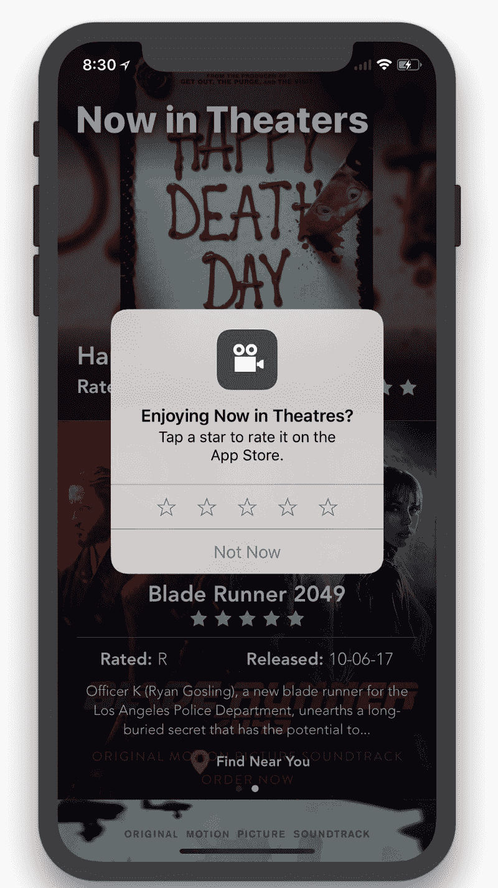

# 如何通过简单易行的方法提升您的应用商店评级

> 原文：<https://www.freecodecamp.org/news/how-to-boost-your-app-store-rating-with-a-simple-easy-approach-ba54651182c8/>

马克斯·斯坦



# 如何通过简单易行的方法提升您的应用商店评级

在决定下载哪些应用时，用户喜欢看到应用的高评级。如果两个 app 做同样的事情，但是一个比另一个评分高，你觉得大部分用户会选择哪个？

App Store 中几个最受欢迎的应用程序的评分从 3.5-4.5 上升到 4.8-5.0。与此同时，他们还看到他们的评论数量从 5，000-15，000 名评论者增加到 100，000-100 万名！

比如，我们来看看 Instagram:



Instagram on the iOS 11 App Store

来自超过 580，000 位评论者的 4.8 颗星。但 Instagram 是一个巨大的应用程序，所以不难看出为什么这么多人会给它评级。

让我们来看看比 Instagram 更大的应用——脸书:



Facebook on the iOS 11 App Store

只有 14500 名用户给脸书打了 3.0 星。当脸书的用户数量比 Instagram 多 40 倍的时候，Instagram 是如何让 40 倍多的用户给它的应用评分的？

### 苹果的评分提示

答案是[苹果原生评级提示](https://developer.apple.com/documentation/storekit/skstorereviewcontroller)的战略布局:



在这种原生解决方案出现之前，开发者必须将用户带到应用商店对他们的应用进行评级。现在有了苹果的解决方案，用户可以点击他们想要的评级，点击提交，就大功告成了！

它适用于 iOS 10.3 及更高版本，因此您的 iOS 10 用户不会掉队。

这个提示非常容易添加，只需要几行代码:

```
// Add this near the top of your fileimport StoreKit
```

```
// Put this where you want the review prompt to appearSKStoreReviewController.requestReview()
```

#### 充分利用提示

在你把它粘贴到应用程序的任何地方之前，你需要考虑你的客户群。你可以在你的应用程序的什么地方显示这个提示，让用户以一种积极的方式参与进来？

这个问题没有唯一正确的答案，但这里有一些想法:

*   对于购物应用程序—在一次或多次成功交易后。
*   对于内容消费应用——一段时间后。或者，在 X 首歌曲/视频/书籍完成后。
*   对于社交网络应用程序—在用户创建内容后。或者，当一个用户接触 X 个其他人的内容时。

#### 要记住的事情

因为此方法可能会也可能不会显示警报，所以不适合调用它来响应按钮点击或其他用户操作
https://developer . apple . com/documentation/store kit/skstorereviewcontroller/2851536-request review

`requestReview()`将根据 Apple 管理的 App Store 政策返回提示。你不应该事先提醒客户是否喜欢你的应用。如果你这样做，他们可能看不到评级提示，从而导致糟糕的用户体验。

"你可以在 365 天内最多提示三次评级."
——[https://developer.apple.com/app-store/ratings-and-reviews/](https://developer.apple.com/app-store/ratings-and-reviews/)

分级提示每年最多只会向用户显示三次，即使他们更新了你的应用。

这不像以前版本的 iOS 那样是个大问题。从 iOS 11 开始，苹果改变了 App Store 上重置评级的方式。

过去，每次你向 App Store 提交新版本，你的评分都会被重置。现在你可以选择保留你的评分历史。所以如果你对你的评分满意，你可以保留它！

在 App Store 上获得高评分是增加下载量最有效的方法之一。苹果现在提供了一种简单、自然、有效的方法来提高你的应用程序的评级。巧妙的利用它，你一定会看到效果。

如果你喜欢这个故事，我会很高兴你点击？按钮，这样更多的人可以找到它。如果您在应用程序中使用了此提示，也可以在回复中随意分享！