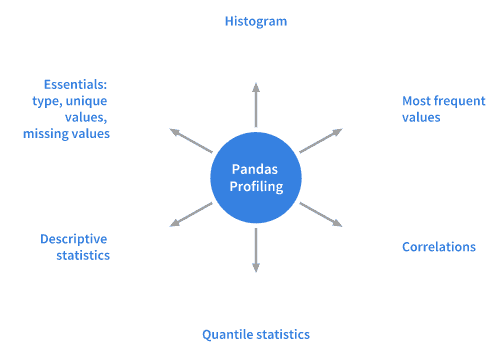
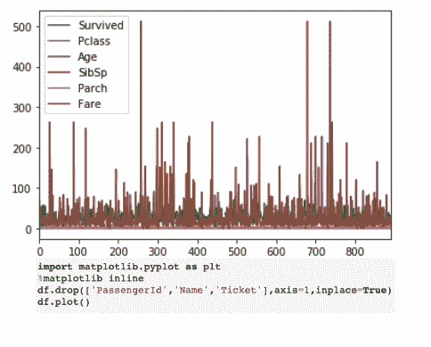
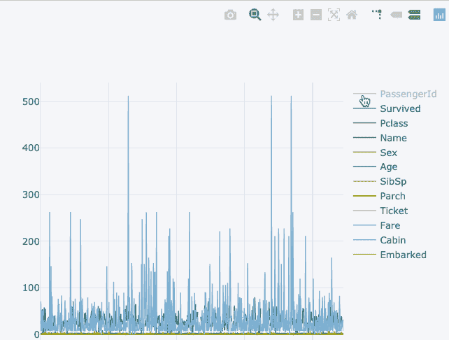
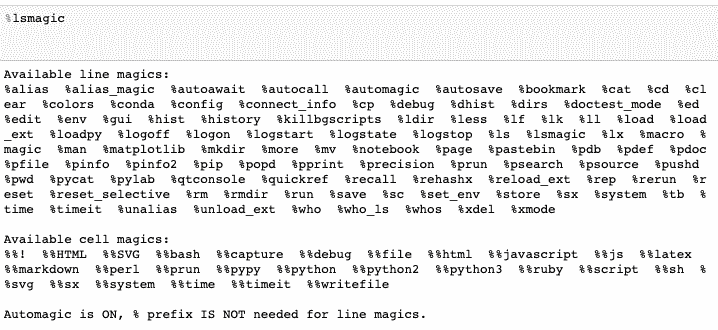
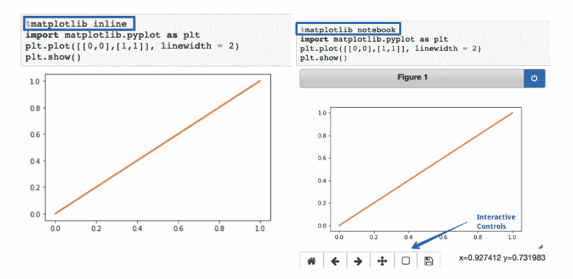
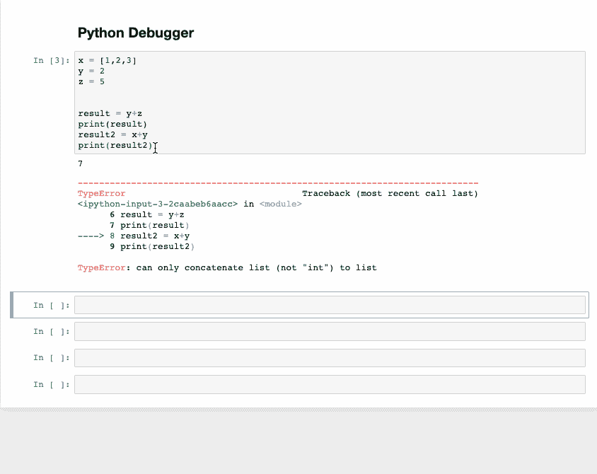
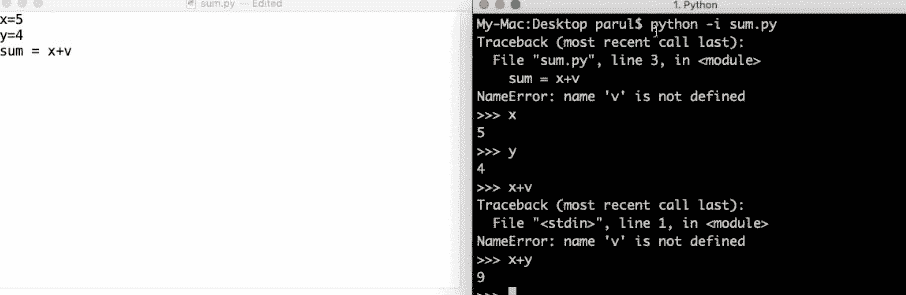
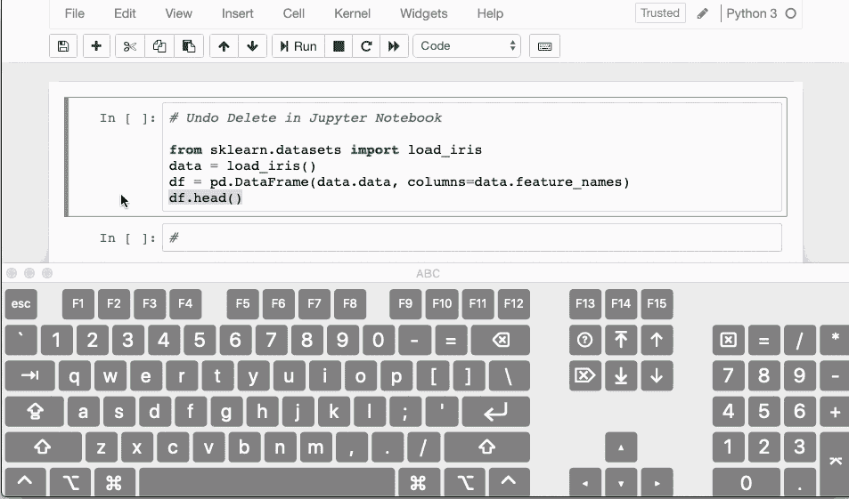

# 如何使用 Python 提高您的数据分析技能

> 原文：<https://www.freecodecamp.org/news/how-to-boost-your-data-analysis-skills-with-python/>

如果你正在学习 Python，你可能听说过 sci-kit-learn、NumPy 和 Pandas。这些都是需要学习的重要库。但是它们比你最初意识到的要多得多。

在 Python 的[世界中，有许多技巧和诀窍可以帮助您加快数据科学中的任务，改进您的代码，并且还可以帮助您更高效地编写代码。](https://www.freecodecamp.org/learn)

所以我决定在这篇文章中为你整理一些最有价值的数据分析技巧。

## 熊猫的轮廓数据框

概要分析的主要作用或目的是清楚地了解数据。这就是 Python 包 Pandas Profiling 的功能。这种方法在对熊猫的数据帧进行数据分析时既简单又快速。

探索性数据分析过程包括 Pandas df.info()函数和 df.describe()作为第一步。但是您只能获得基本的数据概述，如果您正在处理大型数据集，这可能不是很有帮助。

Pandas 的[分析功能](https://www.google.com/url?sa=t&source=web&rct=j&url=https://www.kaggle.com/parulpandey/10-simple-hacks-to-speed-up-your-data-analysis&ved=2ahUKEwjJ_tzBy-LqAhVPUBUIHYomB-gQFjAMegQIARAB&usg=AOvVaw1gTlUdtw6xS0ykqe9hhU5Y)还使用 df.profile_report()扩展了 Pandas 的数据框架，这有助于您快速分析数据。它在一行代码中显示了大量信息，这也是一个交互式的 HTML 报告。

对于一组数据，Pandas profiling 计算这些统计数据:

## 让熊猫情节更具互动性

熊猫内置的 plot()函数也是 Dataframe 类之一。但是，该函数提供的可视化效果交互性不强，因此对数据科学受众没有太大吸引力。

另一方面，用熊猫来绘制图表是很容易的。DataFrame.plot()函数。接下来的问题是，我们如何在不对代码进行重大修改的情况下，使用 Pandas Plotly 绘制交互式图表？

你可以用袖扣库做到这一点，袖扣库将 Plotly 的能力与 Pandas 快速绘图的灵活性结合在一起。

你可以在下面的图片中看到结果。

这两种可视化显示相同的东西。第一个可视化是一个静态图表，而第二个是一个更具交互性的图表(它也提供了比第一个更多的细节)。然而，我们并没有对语法做任何重大的改变。

## 魔法命令

标签“魔法命令”指的是 Jupyter 笔记本中的一组功能。他们创建了这组功能来解决标准[数据分析](https://www.analyticsvidhya.com/blog/2016/01/complete-tutorial-learn-data-science-python-scratch-2/)中遇到的许多常见问题。

有两种魔法命令。首先，有线条魔术-那些有%字符前缀的魔术。它们还对一行输入进行操作。

第二种是单元格魔术——用双%%前缀表示。他们在不止一条输入线上工作。如果将它设置为 1，您将调用神奇的函数，而不需要键入初始的%。

当您在数据分析中执行日常任务时，其中一些命令可能会派上用场。其中一些是:

### %pastebin

该函数返回 URL，并将代码上传到 Pastebin。Pastebin 是一个在线内容托管服务，可以存储纯文本(如源代码片段)，然后与其他人共享 URL。

事实上，Github gist 与 Pastebin 非常相似，但是有版本控制。

### %matplotlib notebook

您可以使用这个内嵌函数在 Jupyter 笔记本中呈现静态 Matplotlib 图。你必须试着用笔记本代替直插部分。这将使您快速调整大小和缩放绘图。

但是确保在开始导入 Matplotlib 库之前调用该函数。

### %运行

您可以使用此函数在笔记本中运行 Python 脚本。

### %%writefile

这个函数将单元格内容写入一个文件。然后将代码写入另一个名为 foo.py 的文件，然后保存到当前目录。

### % %乳胶

该功能使细胞内容物显示为乳胶。当在单元格中写数学方程式和公式时，它很方便。

## 查找并删除错误

被称为[交互式调试器](https://towardsdatascience.com/10-simple-hacks-to-speed-up-your-data-analysis-in-python-ec18c6396e6b)的功能是另一个神奇的特性。然而，对于这篇文章，它有一个完全不同的类别。

如果您正在运行一个代码单元并得到一个异常，请在新行下键入%debug，然后运行它。这将为交互式调试打开一个环境，让您回到发生异常的地方。

您还可以检查它们在程序中分配的不同变量的值，同时在那里执行操作。之后，如果你想退出调试器，按 q。

## 运行 Python 脚本时使用“I”选项

通常从命令行运行 Python 脚本的一种方式是使用 hello.py。但是如果您添加-i 并运行相同的 Python 脚本(Python -i hello.py)，您将获得更多好处。怎么会？

首先，你到了[程序尾](https://www.google.com/url?sa=t&source=web&rct=j&url=https://www.analyticsvidhya.com/blog/2019/08/10-powerful-python-tricks-data-science/&ved=2ahUKEwjJ_tzBy-LqAhVPUBUIHYomB-gQFjAAegQIAxAB&usg=AOvVaw1H3TUawIio2d4aE_ifcaP-)之后，Python 并不关闭解释器。这意味着我们可以检查不同变量的值，以及程序中定义的函数有多正确。

其次，调用 Python 调试器很容易，尤其是因为解释器仍然可以通过以下方式使用:

*   Import pdb
*   Pdb.pm()

从这里，我们可以快速到达异常发生的地方，然后处理代码。

## 删除和恢复

那么，当你误删除了 Jupyter 笔记本中的一个单元格时，你会怎么做呢？幸运的是，有一个快捷方式可以让您撤销该操作。

您可以通过按 CTRL/CMD+Z 来恢复或撤消删除的内容

如果您删除了要恢复的整个单元格，请按 ESC+Z，或者编辑>撤消删除单元格。

## 结论

本文分享了一些提高 Python 数据分析技能的技巧。在 Python 数据分析之旅的某个阶段，这些技巧应该会派上用场。