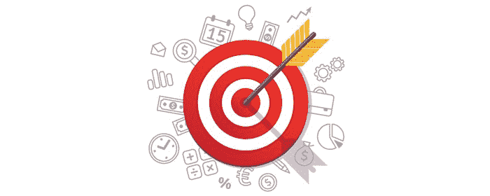
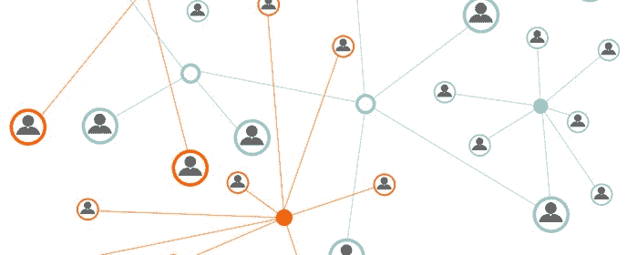

# 如何在 2019 年(及以后)给自己打上自由开发者的品牌

> 原文：<https://www.freecodecamp.org/news/how-to-brand-yourself-as-a-freelance-developer-in-2019-and-beyond-78a5d58ecd29/>

网络开发行业正在蓬勃发展。

这对自由职业者来说可能是有利的，但也有其不利之处。

什么底片？

说到自由职业，你经常会和其他提供类似服务的自由开发者竞争。

根据*美国劳工统计局*的数据，网络开发领域预计到 2026 年[将增长 15%](https://www.bls.gov/ooh/computer-and-information-technology/web-developers.htm#tab-6) 。

公司已经可以选择在世界其他地方雇佣一名自由职业的网络开发人员，他们会以低得多的价格来做这项工作。

那么，怎样做才能不成为商品，不那么容易被替代呢？

解决方法是建立你的个人品牌。

#### **什么是个人品牌？**

你的[个人品牌](https://en.wikipedia.org/wiki/Personal_branding)向你的目标受众描绘了你是谁，你代表什么，以及你与其他自由职业者的区别。

另一种思考方式是你因什么而出名或者你想因什么而出名。

#### **为什么要有个人品牌？**

许多人认为个人品牌只是专业自由职业者的专利。

不是的。

在这个竞争激烈的行业中，个人品牌是最重要的东西之一。

我这么说的 3 个原因:

**1。你鹤立鸡群**

对于许多自由职业的网络开发人员来说，获得新客户就像在一个拥挤的房间里大声呼唤他们，在那里每个人都在同时说话。

通过突出你的专业知识、技能、价值观和其他定义你的独特品质，建立你的个人品牌可以让你与众不同。

**2。你确立了自己的专家地位**

公司更喜欢与某个特定领域的专家合作。

重要的是[找到你的定位](https://ugurus.com/how-to-discover-and-dominate-niche-markets/)，然后将自己树立为一个可以信赖的权威。

当你能证明自己是该领域的专家时，公司不会介意支付更高的价格来考虑与你合作，而不是与你的廉价竞争对手合作。

**3。你获得信任**

客户通常会在决定雇佣哪个网站开发人员之前做调查。

别人推荐你做一名自由开发者，会让你在潜在客户面前更加可信。

这往往会带来未来更多的机会。

既然你已经理解了品牌的重要性，以及它是如何彻底改变你的自由职业生涯的，那就让我们进入正题吧。

**这里有 10 个可行的建议，可以让你成为自由开发者:**

1.了解你的理想客户

2.开发独特的销售主张

3.重温你的为什么

4.分享你的故事

5.开始写博客

6.创建在线投资组合

7.建立正确的联系

8.利用社交媒体

9.要求提供证明

10.做你自己

让我们更详细地了解其中的每一项。

### **1。了解你的理想客户**

了解你的理想客户至关重要。它将指导你调整你的个人品牌，让你变得与目标受众相关并吸引他们。

一种方法是创建一个[买家角色](https://blog.hubspot.com/marketing/buyer-persona-definition-under-100-sr)。这个角色是你的理想客户的半虚构的代表。这是基于彻底的市场调查和受过教育的假设。

大多数自由职业者会通过分析年龄、性别、收入、企业规模和行业等个人统计数据来做到这一点。这是一个好的开始，但是要建立一个强大的个人品牌，你需要更进一步。

以下是一些关于你理想客户/利基的问题:

他们最大的挑战是什么？
作为一名自由网页开发者，你的目标是为你的理想客户提供解决方案。了解他们的挑战将指导你在个人品牌中突出什么技能和专业知识。

他们的目标是什么？
除了创收，找出激励和驱动你理想客户的核心价值观和原则。

他们从哪里获得信息？
你的理想客户找到你的唯一途径是，当他们需要问题的答案时，你在他们去的地方建立强大的品牌形象。他们会在谷歌上搜索吗？或者他们会在特定的社交媒体渠道中寻找答案吗？你需要在那里提供他们正在寻找的解决方案。

他们订阅了哪些博客和出版物？
这些会让你更深入地了解什么样的性格最能与你的理想客户产生共鸣。例如，如果你的理想客户喜欢尼尔·帕特尔，很可能你的理想客户更喜欢注重细节的人。

这可以让你更好地了解你的理想客户在自由网站开发者身上寻找什么样的个性。同时，你知道你应该和谁建立联系。

更快的方法是使用类似 HubSpot 的角色生成器的工具。它为你提供了一系列需要回答的问题，以帮助你创建你的自由职业买家角色。

### **2。开发独特的销售主张**

独特的销售主张(USP) 是你可以向客户提供的帮助你脱颖而出的东西。它回答了你的客户所面临的一个特殊的挑战，你可以非常好地解决它。

以下是如何创建您自己的独特提案的步骤:

**1。了解你的客户想要什么**

客户通常对他们想要达到的目标含糊其辞。因此，你可能需要更深入地了解他们想要解决的主要问题是什么，或者他们想要实现的目标是什么。

**2。提供解决方案**

你的客户不会为你的服务付费。他们为解决方案付费。

你需要清楚地向他们展示你的服务和专业知识如何帮助他们实现这一目标。

突出显示以下内容:

*   他们的销售额可能会增加多少
*   他们多久能开始期待结果
*   他们的商业品牌如何提升
*   他们可能拥有多少客户

**3。让您的服务不可或缺**

你需要对你的技能和你提供的东西有信心。让你的潜在客户相信你是专家，以及你如何能在他们的业务中有所作为是很重要的。

不要像其他自由职业者一样，把一个项目看成另一个项目。花时间研究业务，它的目标和价值。

让他们意识到你的服务是如何帮助他们实现目标的，以及你与竞争对手的不同之处。

有很多方法可以让你准备好个性化的 USP。

你可以使用[电梯演讲公式](https://articles.bplans.com/how-to-create-an-elevator-speech-with-examples/)，迫使你在 30 秒或更短时间内解释你的 USP。这一点至关重要，因为研究表明，你只有几秒钟的时间来抓住目标受众的注意力。

电梯演讲以这个一句话的公式开始:

**您提供的解决方案+您的目标市场+您提供的价值**

例如，这是我对这个网站的 USP:

“我帮助开发者成为成功的自由职业者，创建有效的网站。”

我提供的解决方案是帮助启动和发展自由职业者业务。我的目标受众是开发者。我提供的价值是让他们全职自由职业，体验更多自由。

对于你的理想客户，你可能会说:

“我通过有效的网站和在线营销帮助医生获得更多的病人。”

### **3。重温你的为什么**

记住你为什么决定成为一名自由网络开发者，这对于建立你的个人品牌是非常重要的。它给你一个更广泛的目的，而不仅仅是赚钱。它激发你对工作的热情，让你保持动力和专注

更重要的是，你的“为什么”会帮助你与你的潜在客户建立联系，让你与众不同。

[西蒙·西内克](https://www.ted.com/talks/simon_sinek_how_great_leaders_inspire_action)说:*“人们不会买你做的东西。他们会购买你这么做的原因。”*

这里有一些问题要问你自己:

*   作为一名自由网络开发者，你想实现的目标是什么？
*   是什么让你选择自由网页开发？
*   你为什么要这么做？为了自由？为了钱？这是什么？

### **4。分享你的故事**

这可能是最具挑战性的，因为这意味着你需要变得透明、诚实和脆弱。

同时，我会说这不是必须要做的，但在某些情况下是有益的。

人类[与故事](https://www.shopify.com.au/partners/blog/what-is-personal-branding)相关，尤其是那些与我们可能正在经历的事情相似的故事。

讲述你的故事也有助于你向你的目标观众展示你的个性，你可以在更深的层次上与他们交流。

在写你的故事时，不要只关注你的成功、里程碑和成就。愿意分享你的奋斗、挑战和失败。

你展示的自己越真实，你的目标受众就越愿意信任你，开始建立关系。

### **5。开始写博客**

作为一名网络开发人员，快速建立个人品牌的一个有效方法是创建博客。

它不仅提供了一个分享你的知识和建议的途径，而且也在你的目标受众眼中树立了你作为专家或权威的形象。

如果你创造了一致的有价值的文章，你最终会成为他们的问题和需求的关键人物。

确保你的博客文章合乎逻辑，结构良好，开门见山，易于阅读。

如果你是博客新手，你可以从这里开始。

### **6。创建在线投资组合**

为了建立你的品牌，有一个展示你的专业知识的组合网站是至关重要的。

一个[在线投资组合](https://medium.freecodecamp.org/15-web-developer-portfolios-to-inspire-you-137fb1743cae)是你可以带来潜在客户的地方，这样他们可以更多地了解你，你做了什么以及你如何帮助他们。

以下是你的在线作品集应该包含的内容:

**一个可识别的域名**
既然你是你的个人品牌，建议尽可能在你的域名中使用你的名字。不然一个公司名也行。

**专业网站**
第一印象很重要。使用一个不仅好看，而且易于导航的网站设计。我喜欢从头开始编码，但是另一个很好的选择是一个叫做 [Divi](http://www.elegantthemes.com/affiliates/idevaffiliate.php?id=43252&url=35568) 的工具。此外，不要忘记颜色对感知的影响。

添加一个标志
你的标志应该不仅仅是一个不传达任何信息的花哨符号。它应该是你是谁、你做什么和你的价值观的一种视觉表现。

**展示你以前的作品**
客户希望看到你以前作品的证明。这意味着你需要包括你以前成功项目的投资组合，这将有助于你获得信任和信誉。

**个性化它**
[当人们看到你时，他们会更快地与你联系](https://www.shopify.com.au/partners/blog/what-is-personal-branding)。没有人喜欢和看不见的人做生意。

专注于最终目标
包含你擅长的编程语言和工具是很好的，但确保不要让这成为你网站的主要焦点。

大多数客户并不关心你所了解的编程语言或框架，或者你对它们了解多少。他们想知道的是，你所知道的是否会促进他们的业务增长。

**链接您的 GitHub 和 CodePen 账户**
拥有这些链接将有助于提高您在潜在客户中的可信度，因为它在社区中展示了您的知识和专业技能。

**行动号召**
不要假设你的潜在客户知道你希望他们采取的下一步行动。

在网站的不同区域添加正确的行动号召可以给需要成为客户的访问者带来推动力。

联系方式
我知道这听起来很明显，但令人惊讶的是，人们竟然忽略了一个清晰的电子邮件地址或一个简单的联系方式。

### **7。建立正确的联系**

尼尔森的一项研究表明，82%的人更有可能考虑他们信任的人推荐的产品和服务。

这就是为什么确保你与正确的人联系并建立关系是很重要的。

做到这一点的一个方法是参加当地的商业会议。

这些都是向当地商业社区介绍你自己作为一名网络开发人员/营销顾问的好地方。它可以为客户未来的工作打开机会之门。

你的理想客户所在的行业会议和活动也不应该被忽视。

### **8。利用社交媒体**

平均来说，一个人每天花两个小时在社交媒体上。

活跃在你的理想客户所在的社交媒体平台上，会增加他们找到你的机会。

也就是说，要确保你的大部分帖子能为你的人际网络提供价值。Bop Design 发布的一项研究显示，80%的顾客根据他们的社交媒体账户评估他们会如何看待一个品牌。

寻找你可以加入的相关团体，在那里你可以与他人分享你的专业知识。这会引起潜在客户的注意，他们最终会在团队之外联系你。

### **9。求推荐**

尽管有各种不同的营销策略，但没有什么能打败口碑广告的力量。

你可以利用这一点，在你的在线作品集上加入以前客户的推荐，打造你的个人品牌。

你需要主动询问你现在和以前的客户。

完成项目后立即给你的客户发一封简短的电子邮件是最简单的方法。

你需要做的就是问他们:*“你愿意给我一份简短的证明，告诉我你是如何发现和我一起工作的吗？”*

越多越好。因此，尽量获得至少 3-6 份推荐信。

### 10。做你自己

记住 ***你**是你的个人品牌*。

不要害怕展示你的个性。这是你是谁，是什么让你独一无二。

对自己真实，不要虚伪，不断提高自己的知识，如何与客户打交道，以及在生活的各个领域获得全面发展。

把自己打造成自由开发者需要时间和努力。开始正确，更重要的是；向右结束。

开始把自己树立为你所做的事情的专家，而不是商品。

结果很快就会出来。

感谢您的阅读，希望这篇文章对您有所帮助:)

如果你有任何问题，请在评论中告诉我。

如果你对更多自由职业相关的文章感兴趣，可以看看我的博客[**【StudyWebDevelopment.com】**](https://studywebdevelopment.com/)或者关注我的 [**推特**](https://twitter.com/study_web_dev) :)