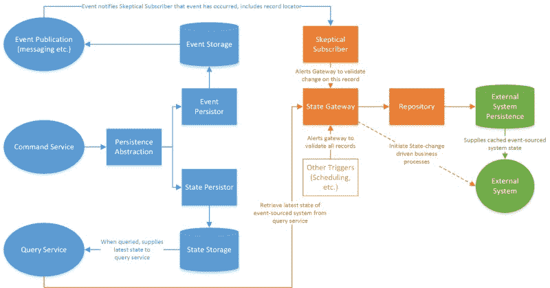

# 如何连接有状态系统和事件源系统

> 原文：<https://www.freecodecamp.org/news/how-to-bridge-stateful-and-event-sourced-systems-70a419842e29/>

乔纳森·索罗扎诺-汉密尔顿

# 如何连接有状态系统和事件源系统(并击败大猩猩)

你有了一个崭新的 [CQRS](https://martinfowler.com/bliki/CQRS.html) 系统，它已经“开发完成”，你即将开始集成测试。在你的[域名讨论期间睡在角落里的 800 磅大猩猩](https://martinfowler.com/tags/domain%20driven%20design.html)醒了。

没有看一眼你的全面的领域图，吸引人的用户故事，UI 模型，或者良好记录的接受标准，它突破了虚线的“上下文边界”,这是应该阻止它的。

大猩猩在建筑周围横冲直撞，粉碎实体，将价值化为瓦砾，连根拔起集料，并普遍破坏了项目的所有共识。大猩猩，你的名字是遗产整合。

Hey guys! I can’t wait to see how your RESTful micro-service app integrates with this thirty-year-old bespoke ERP system! Hope you like COBOL. (Image courtesy of [“Naruto” the macaque](http://www.npr.org/sections/thetwo-way/2017/09/12/550417823/-animal-rights-advocates-photographer-compromise-over-ownership-of-monkey-selfie), who is not a gorilla).

遗留系统和过程集成可能会毁掉一个原本完美执行的项目。这是一个可怕的偏头疼的问题，只有在艰苦奋斗的学校里才能学到。这也是一个问题，作为一名开发人员，当你开始与足够成熟的企业和领域合作时，你将在职业生涯中面临这个问题。

当然，如果你幸运的话，当大猩猩醒来时，你实际上还没有开始编码——或者至少还在过程的早期。或者，如果你很聪明，你看到大猩猩躲在角落里的灯罩下，揉着上次遭遇的伤疤，你从一开始就将它融入到你的架构中，从而预先阻止它不可避免的狂暴。

### 处理遗留系统

作为加州大学洛杉矶分校研究信息系统办公室的建筑助理主任，我负责弥合许多系统和数据差距。加州大学洛杉矶分校有几十年的研究遗留业务流程和系统，这些流程和系统反对任何用新技术“破坏”这些传统方法的企图。

最令人沮丧的是，这条管道被偶尔难以穿透的遗留数据冰山所堵塞，这些数据经常需要实时争论。

Oh good lord! A data-berg! No wait, this is just a [fatberg](http://www.npr.org/sections/thetwo-way/2017/09/12/550465000/behold-the-fatberg-london-s-130-ton-rock-solid-sewer-blockage). I’m glad I opted for a career in code instead of sanitation. (Image credit: the Associated Press)

在我的办公室，我们的任务是以越来越快的速度集成到这些遗留系统中。我们还在升级我们的定制交易系统，以处理小型业务流程。

对于我们自己的系统，我们通常遵循[微服务](http://microservices.io/)模式。我们正在融入更多的复杂性，如领域驱动设计(DDD)和事件源，如果需要的话。我们对这些系统的关键挑战是将遗留系统集成到状态持久化系统中。

### 接近整合

我将在接下来的几段中概述我们的方法。这就是我们如何解决从一个事件系统，特别是混合事件系统，过渡到一个纯粹的状态驱动的问题。

实现者经常忽略的一个关键原则是，事件源[不应该](https://goodenoughsoftware.net/2012/03/02/case-studies/)被[到处使用](https://www.infoq.com/news/2016/04/event-sourcing-anti-pattern)。这是 Greg Young 的观点，他被广泛认为是引入了“事件源”软件架构模式。

在我们的系统中，我们使用事件源来满足特定的目标需求。有时这会导致我们的应用程序具有可能驻留在事件流之外的状态。此外，我们的一些事件触发器来自不可靠的源系统状态变化。如果我们只依赖事件流，这将需要大量的事后事件纠正和“倒带-重放”来修复。

#### 怀疑的解决方法

我们想出了一个解决方案，我称之为“持怀疑态度的订户”持怀疑态度的订阅者解决了系统事件端的“不可靠性”问题，至少从遗留状态机的角度来看是这样的。它还解决了由于外部遗留数据问题而可能错过事件生成的系统:

1.  事件源可以生成不会导致与传统状态机相关的状态改变的事件。从它的角度来看，这些是“假阳性”事件
2.  事件源可能无法为**与传统状态机**相关的状态变化生成事件。从它的角度来看，这些是“错过的”或“跳过的”事件
3.  由于事件原始来源中的错误或差错，可能根本不会生成事件。这尤其发生在来自遗留数据仓库的提取-转换-加载(ETL)流中。从任何角度来看，这些都是真正被“跳过”的事件

怀疑订阅者方法通过保持对事件流的不信任来解决这些问题。它将事件流视为一个可能的触发器或状态已更改的通知，但它也接受其他可能的触发器。它也不相信状态改变的通知是正确的。

一旦通知状态**可能**已经改变，订户通知状态网关查询事件源系统的状态。

该状态网关根据最后已知的状态(如订阅系统所知)来评估状态。

如果更改是相关的，那么它将更新订阅系统状态，并且如果需要，启动相关的订阅系统业务流程。

Ladies and Germs, the Skeptical Subscriber!

#### 一些要求

为了使用这种方法，您的订阅系统需要:

1.  已经持久化，或者能够从它持久化的内容中导出它从事件源系统中关心的状态属性
2.  允许您重做注入状态更改数据的方式

您的事件源系统需要:

1.  提供可靠地表示系统状态的查询服务，并包括订阅系统所需的所有状态属性
2.  在事件流中提供足够的数据来定位查询服务中的相关记录
3.  支持来自查询服务的“列表”或其他批量查询

您实现的可疑订户必须包括:

1.  一个状态网关，它可以向查询服务查询特定记录(事件驱动)或记录列表(其他触发器，用于弥补“错过的”事件)
2.  状态网关必须包括来自订阅系统上下文的域比较逻辑，如果就订阅域而言，记录没有改变，则该域比较逻辑丢弃记录
3.  从事件中调用网关 per-record 的事件订阅实现
4.  用更改更新订阅系统的持久层的能力(这样下次就不会重新更新相同的记录)，比如通过存储库

持怀疑态度的订阅者**也可以**在订阅系统中发起业务流程。

如果是纯粹的状态驱动，这可能是通过持久化新的过程记录来启动伴随的过程。否则，它可以调用任何公开的流程 API。

如果您确实启动了这些业务流程，您还必须在网关中实现锁定，这样，如果在 ETL 过程中发生了事件触发，您就不会重复启动流程。

#### 积极的结果

遗留系统集成还存在许多其他挑战，尤其是在基于事件和有状态的上下文之间移动时。然而，这种模式有助于我们在使用遗留(和不稳定)数据时最小化与事件维护相关的技术负担。

在遵循这种模式之前，我们一直在严格的基于事件的方法中工作。我们失去了快速访问可直接编辑状态所提供的支持机会。通过这种模式，我们重新获得了那些机会。当遗留系统因为不“喜欢”它得到的事件而行为不当时，我们已经将负担从以某种方式修改事件流转移到简单的状态修改。

我们还添加了一个松散耦合层，通常将订阅系统与事件隔离开来。这允许重定向其他订阅系统触发器。

例如，遗留 ETL 可以作为初始状态网关触发器，直到您准备好切换到事件流。我们这样做并没有使 CQRS 服务变得过于复杂，因为我们将填隙式怀疑订户实现为一个独立的实体。

这里有一个给数据科学家和为他们服务的工程师的专业建议:如果您在订阅存储库中实现了多语言持久性，您还可以构建一个文档存储，它已经自动过滤了反映有意义的业务流程的数据更改。

最后，如果某个事件被“跳过”或“错过”，我们有一个简单的按需支持途径。我们或者重新通知订阅者关于那个记录(如果我们知道哪个记录错过了一个事件)，或者我们执行一个“赶上”全系统查询(如果我们不确定)。

我们可以在不接触事件流的情况下做到这一点。这意味着其他订阅应用程序不会受到支持活动的影响。

### 最后的想法

它并不适合所有问题(甚至大多数问题)。但是这是一个很好的解决方案，可以利用事件源和 CQRS 的松散耦合和其他下游优势，同时最小化对遗留数据流进行故障排除的支持开销。这让我们的开发人员花更多的时间编写新的应用程序，并增加我们对消费者的价值。

如果你喜欢这篇文章，请点击下面的按钮，给我一些掌声，让更多的人看到它。谢谢！

乔纳森是加州大学洛杉矶分校研究信息系统部的建筑和运营助理主任。在获得斯坦福大学的物理学学位后，他在信息系统架构、数据驱动的业务流程改进和组织管理领域工作了 10 多年。他还是 [Peach Pie Apps Workshop](http://www.peachpieapps.com) 的创始人，这是一家专注于为非营利组织构建数据解决方案的公司。