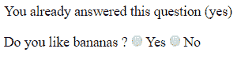

# 如何使反应性与状态发生反应

> 原文：<https://www.freecodecamp.org/news/how-to-bring-reactivity-into-react-with-states-exclude-redux-solution-4827d293dfc4/>

> 这是我的“React 初学者”系列文章的一部分，介绍 React、它的核心特性和应该遵循的最佳实践。更多文章来了！

> [<上一个](https://www.freecodecamp.org/news/p/2994c09b-d550-4eb6-b281-a83e553240c7/) | [下一个>](https://www.freecodecamp.org/news/the-beginners-collection-of-powerful-tips-and-tricks-for-react-f2e3833c6f12/)

如果你知道如何显示一个反应组件，那就太好了。现在，让我们给我们的组件它们自己的数据。

**免责声明:**本文重点介绍 React 的内置状态。注意，组件状态和 Redux 并不是不兼容的，因为它们的目的不同。

在我看来，组件状态是特定于组件范围的(用于表单完成)。此外，Redux 状态有助于在许多组件之间共享相同的状态。

### 我需要一个州吗？

为了了解状态，让我们创建一个`Question`组件。它将显示一个是/否问题并要求回答。

```
class Question extends React.Component {
  constructor(props) { // Init props and state
      super(props);
      this.state = { answered: false };
      this.answerQuestion = this.answerQuestion.bind(this);
  }
  answerQuestion({target}){ // State update (user answers to the question)
      let answer = target.value === 'true' ? true : false;
      this.setState({ answered: true, answer });
  }
  render() { // Component template in JSX
    if(this.state.answered) {
      return <p>You already answered this question ({this.state.answer ? 'yes' : 'no'})</p>
    }
    return (
      <p>
        <span>{this.props.label}</span>
        <label><input type="radio" name="answer" value="true" onChange={this.answerQuestion}/>Yes</label>
        <label><input type="radio" name="answer" value="false" onChange={this.answerQuestion}/>No</label>
      </p>
    );
  }
}
```

我们的`Question`组件只包含三个函数:

*   `*constructor*`对于初始化(道具和状态)，
*   `*answerQuestion*`用户应答时是否会触发回拨
*   你可能已经知道了——它输出组件的模板。

该组件有两种不同的状态。问题没有答案，或者问题有答案。



道具只是用来做问题标签的，除此之外，**状态的**目的要有趣得多。

状态是记忆问题是否有答案的成分记忆。如果是，它也知道答案。

### 将状态转换为道具

在组件中使用状态很容易。每当您想要更新它的内容时，您必须初始化状态并调用`setState`函数。

想象自己是一个组件。如果你的状态改变了，你的反应会是检查你是否需要更新你的显示。

事情就是这样的。在调用`render`之前先调用`shouldComponentUpdate`([参见文档](https://reactjs.org/docs/react-component.html#shouldcomponentupdate))。这第二个函数将生成下一个虚拟 DOM 状态([我的上一篇文章](https://medium.freecodecamp.org/a-quick-guide-to-learn-react-and-how-its-virtual-dom-works-c869d788cd44)谈到了它)。

```
class Survey extends React.Component { 
  // Somewhere in constructor function
  this.state = { 
    questions: [ 'Do you like bananas ?', 'Are you a developer ?' ]
  };
  // Somewhere in render function 
  this.state.questions.map(question => <Question label={question}/>)
}
```

组件从其他组件获取道具。如果这些道具改变了，那么组件就会更新。

实际上，您已经知道它是如何工作的——但是让我们以包含一些`Question`的`Survey` 为例。

`Survey`在其状态中包含问题标签，并将其作为属性提供给`Question`。

当`Survey`更新其状态(调用`setState`)时，`render`功能触发。如果是，它发送一个`Question`渲染请求(细节在[反应文档](https://reactjs.org/docs/optimizing-performance.html#avoid-reconciliation))。

### 采用容器模式

将视图和代码的其余部分解耦一直是开发人员关心的一个大问题。这就是为什么框架中使用的大多数设计模式都是从 MVC 模式扩展而来的。

如果您使用 React with Redux，您已经知道了**容器**模式。其实是通过 connect 函数内置的 Redux 功能。

```
/* 
  Question and QuestionContainer are both regular React components
  QuestionContainer renders a single Question component 
  and provides access to redux stuff through props
*/
const QuestionContainer = 
  connect(mapStateToProps, mapDispatchToProps)(Question);
```

是时候把`Question`组件拆分成两个组件了。

`Question`将负责渲染道具。这种组件被称为功能组件、表示组件或哑组件。

`QuestionContainer`会处理状态管理。

```
const Question = (props) => 
  <p>
    <span>{props.label}</span>
    <label><input type="radio" name="answer" value="true" onChange={props.answerQuestion}/>Yes</label>
    <label><input type="radio" name="answer" value="false" onChange={props.answerQuestion}/>No</label>
  </p>

class QuestionContainer extends React.Component {
  constructor(props) {
    super(props);
    this.state = { answered: false };
    this.answerQuestion = this.answerQuestion.bind(this);
  }
  answerQuestion({target}){
    let answer = target.value === 'true' ? true : false;
    this.setState({ answered: true, answer });
  }
  render() {
    if(props.answered) {
      return <p>You already answered this question (props.answer ? 'yes' : 'no'})</p>
    }
    // Here is the trick
    return <Question label={this.props.label} answerQuestion={this.answerQuestion}/>
  }
}
```

与 MVC 设计模式相比，`Question`是一个**视图**，而`QuestionContainer`是一个**控制器**。

其他需要`Question`的组件现在将使用`QuestionContainer`而不是`Question`。这一考虑在社区中已被广泛接受。

### 小心 setState 反模式

使用这个`setState`非常简单。

将下一个状态作为第一个也是唯一的参数传递。它将使用新传递的值更新当前状态属性。

```
// Very bad pratice: do not use this.state and this.props in setState !
this.setState({ answered: !this.state.answered, answer });

// With quite big states: the tempatation becomes bigger 
// Here keep the current state and add answer property
this.setState({ ...this.state, answer });
```

综上所述，不要在`setState`通话中使用`this.state`和`this.props`。

这些变量可能没有您期望的值。React 优化状态更改。由于性能问题，它将多个更改压缩为一个(在虚拟 DOM 优化之前)。

```
// Note the () notation around the object which makes the JS engine
// evaluate as an expression and not as the arrow function block
this.setState((prevState, props) 
              => ({ ...prevState, answer}));
```

你应该更喜欢另一种形式的`setState` **。**提供一个函数作为唯一参数，使用`prop`和`state`参数([见文档](https://reactjs.org/docs/state-and-lifecycle.html#state-updates-may-be-asynchronous))。

### 完整的调查组件

在本文中，我们已经介绍了 React 中的主要状态用法。您可以在下面的代码栏中找到`Survey`组件的完整代码。

[https://codepen.io/jbardon/embed/preview/RQedrv?height=300&slug-hash=RQedrv&default-tabs=js,result&host=https://codepen.io](https://codepen.io/jbardon/embed/preview/RQedrv?height=300&slug-hash=RQedrv&default-tabs=js,result&host=https://codepen.io)

这都是关于国家的。您已经遇到了组件、道具和状态，现在您有了初学者工具包来玩 React。

我希望你喜欢读这篇文章，并学到了很多东西！

**如果您觉得这篇文章有用，请点击**？**按钮几下，让别人找到文章，以示支持！？**

**别忘了关注我，获取我即将发布的文章的通知**？

> 这是我的“React 初学者”系列文章的一部分，介绍 React、它的核心特性和应该遵循的最佳实践。

> [<上一个](https://www.freecodecamp.org/news/p/2994c09b-d550-4eb6-b281-a83e553240c7/) | [下一个>](https://www.freecodecamp.org/news/the-beginners-collection-of-powerful-tips-and-tricks-for-react-f2e3833c6f12/)

### 查看我的其他文章

#### JavaScript

*   [如何通过编写自己的 Web 开发框架来提高自己的 JavaScript 技能](https://medium.freecodecamp.org/how-to-improve-your-javascript-skills-by-writing-your-own-web-development-framework-eed2226f190)？
*   [使用 Vue.js 时要避免的常见错误](https://medium.freecodecamp.org/common-mistakes-to-avoid-while-working-with-vue-js-10e0b130925b)

#### 提示和技巧

*   [停止痛苦的 JavaScript 调试，用源代码图拥抱 Intellij】](https://medium.com/dailyjs/stop-painful-javascript-debug-and-embrace-intellij-with-source-map-6fe68eda8555)
*   [如何毫不费力地减少庞大的 JavaScript 包](https://medium.com/dailyjs/how-to-reduce-enormous-javascript-bundle-without-efforts-59fe37dd4acd)