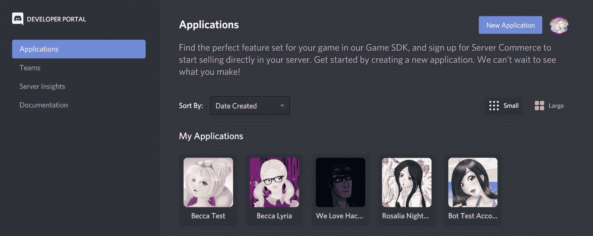
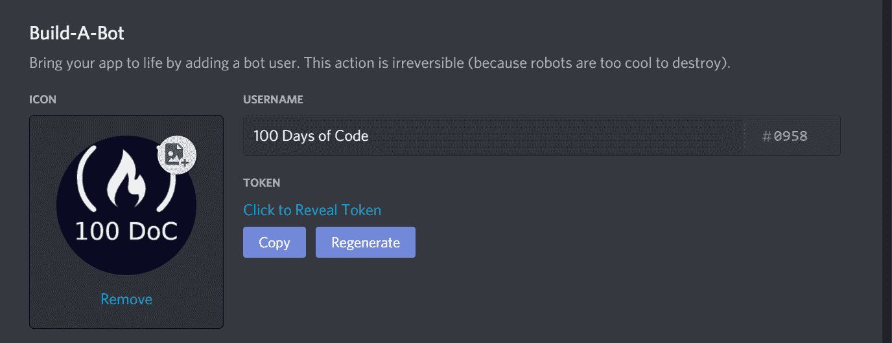
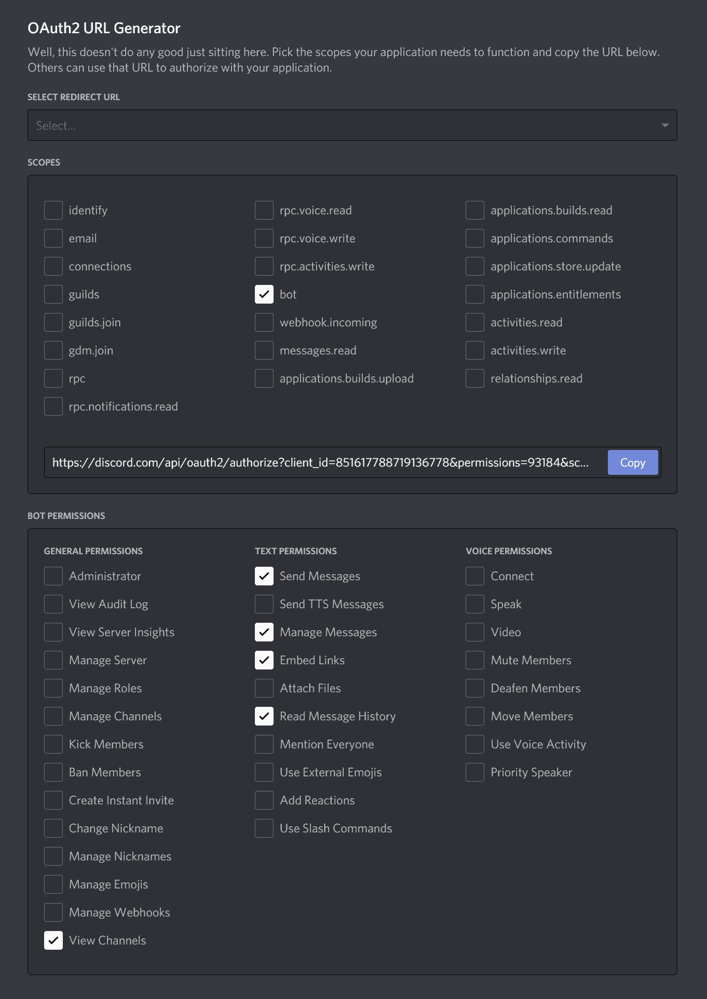
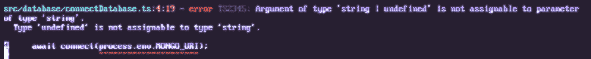
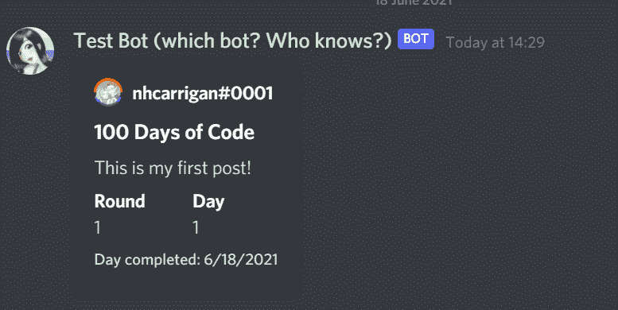
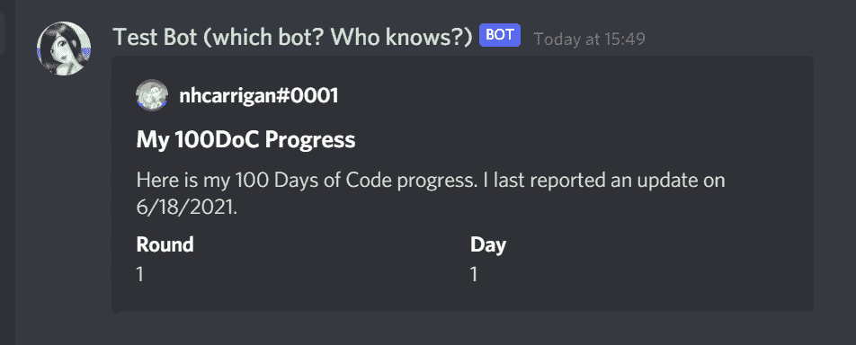
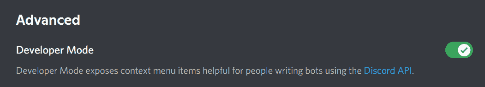
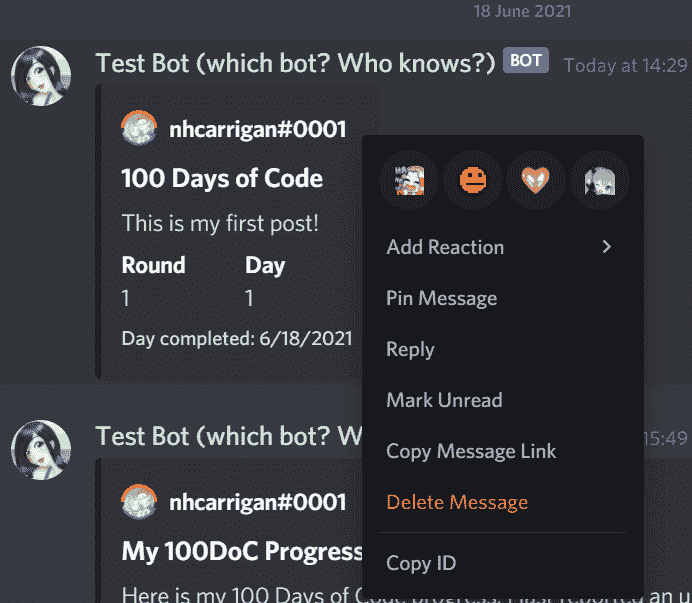
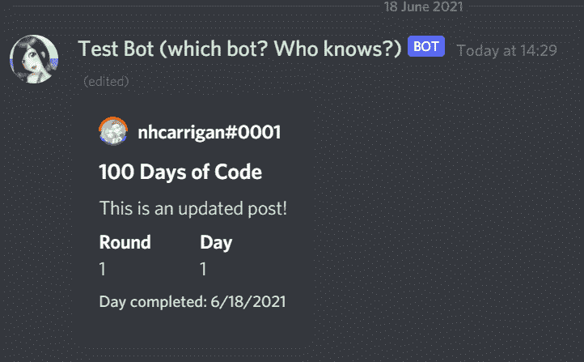
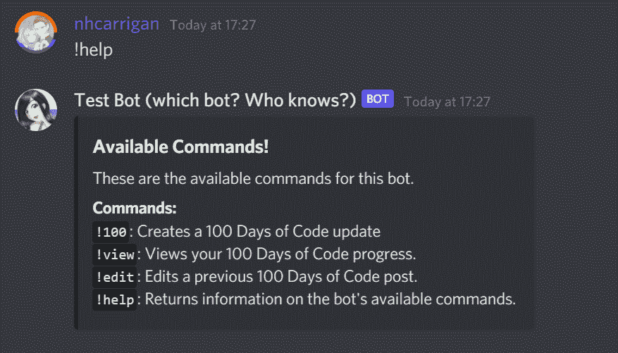

# 如何使用 TypeScript 和 MongoDB 构建一个 100 天代码不和谐 Bot

> 原文：<https://www.freecodecamp.org/news/how-to-build-a-100-days-of-code-bot-for-discord-using-typescript-and-mongodb/>

代码挑战 100 天在寻求提升技能的新程序员和开发人员中非常受欢迎。它如此受欢迎，以至于我们的[不和谐服务器](https://www.freecodecamp.org/news/freecodecamp-discord-chat-room-server/)有一个完整的频道专门用于它。

根据大众的要求，我们最近制作了一个不和谐机器人，帮助人们跟踪他们在挑战中的进展。

今天我将向你展示如何建立你自己的 100 天代码机器人。

## 如何创建一个不和谐机器人应用程序

您的第一步是设置一个 Discord bot 应用程序。前往 [Discord 开发者门户](https://discord.com/developers)，如果需要，登录，并从侧边栏中选择“应用”。



Screenshot of the Developer Portal. If this is your first bot, you will not have any applications here.

单击“新建应用程序”按钮。给它一个名字，并将其设置为“个人”应用程序。您现在将被带到应用程序的设置。在这里你可以改变名字，或者给它一个头像。

从边栏中选择“机器人”，然后单击“添加机器人”按钮。这将为您的应用程序创建一个不和谐的 Bot 帐户。



Screenshot of the Bot settings page. If you did not set an avatar, you will see a default based on your bot's name.

这是您将获得机器人令牌的屏幕。保持这个令牌的秘密是非常重要的，因为令牌允许你的代码连接到你的机器人。请妥善保管，不要与任何人分享。

现在，您需要将机器人添加到服务器，以便与之交互。单击边栏上的“OAuth2”选项。您应该在“OAuth2 URL 生成器”部分看到一个表单。将“选择重定向 URL”下拉列表留空，并选中“bot”范围的复选框。

将出现选择权限的选项。选中下列权限的复选框:

*   发送消息
*   管理消息
*   嵌入链接
*   阅读消息历史记录
*   查看频道

在该部分的上方，您应该会看到一个生成的 URL。点击“复制”按钮进行复制，然后将其粘贴到您的浏览器中即可。

这将带你通过 Discord 的过程来添加你的新机器人到服务器。请注意，您必须在要添加 bot 的服务器中拥有“管理服务器”权限。如果您在任何服务器上都没有此权限，您可以创建一个服务器来测试您的 bot。



Screenshot of the OAuth screen with the correct settings marked.

现在您已经准备好编写一些代码了！

## 如何设置您的项目

您需要为您的项目设置基础设施和工具。

### 准备`package.json`

为您的项目创建一个目录或文件夹。打开指向新文件夹的终端。运行命令`npm init`来设置您的`package.json`文件。对于本教程，默认值已经足够了，但是您可以随意编辑它们。

您应该以类似于下面的`package.json`结束:

```
{
  "name": "tutorial",
  "version": "1.0.0",
  "description": "",
  "main": "index.js",
  "scripts": {
    "test": "echo \"Error: no test specified\" && exit 1"
  },
  "author": "",
  "license": "ISC"
}
```

现在，您需要做一些更改，为 TypeScript 实现做好准备。

首先，用`./prod/index.js`替换`index.js`的`main`值——您将设置您的类型脚本编译到一个`prod`目录。

然后，删除`test`脚本并添加以下两个脚本:

```
"build": "tsc",
"start": "node -r dotenv/config ./prod/index.js"
```

`build`脚本将把你的类型脚本编译成 JavaScript，这样`node`就可以运行它，`start`脚本将运行`index.js`入口点文件。

在这里添加`-r dotenv/config`将动态导入并运行`dotenv`包中的`config`方法，它从`.env`文件中加载您的环境变量。

说到包，下一步是安装依赖项。使用`npm install`，安装这些依赖项:

*   这是将处理网关连接和管理 Discord API 调用的库。
*   `dotenv`–将`.env`值加载到节点流程中的包。
*   `mongoose`–MongoDB 连接的包装器，提供结构化数据的工具。

最后，用`npm install --save-dev`安装开发依赖项。开发依赖项是在开发环境中处理项目所需的包，但不是在生产环境中运行代码库所需的包。

*   `typescript`–这是 TypeScript 语言的包，包含了用 TypeScript 编写代码并将其编译成 JavaScript 所需的一切。
*   `@types/node`–TypeScript 依靠类型定义来帮助理解您编写的代码。这个包定义了 Node.js 运行时环境的类型，比如`process.env`对象。

安装了这些包之后，您现在应该有一个类似于下面的`package.json`:

```
{
  "name": "tutorial",
  "version": "1.0.0",
  "description": "",
  "main": "index.js",
  "scripts": {
    "build": "tsc",
    "start": "node -r dotenv/config ./prod/index.js"
  },
  "author": "",
  "license": "ISC",
  "dependencies": {
    "discord.js": "^12.5.3",
    "dotenv": "^10.0.0",
    "mongoose": "^5.12.14"
  },
  "devDependencies": {
    "@types/node": "^15.12.2",
    "typescript": "^4.3.4"
  }
}
```

### 准备打字稿

TypeScript 的编译器提供了许多不同的设置，以最大限度地控制生成的 JavaScript。

您通常可以通过项目根目录下的`tsconfig.json`文件来修改编译器设置。您可以使用`npx tsc --init`为这个文件生成默认的样板文件，如果您在另一个项目中设置了一个样板文件，可以使用现有的样板文件，甚至可以从头开始编写一个样板文件。

因为编译器设置会显著改变 TypeScript 的行为，所以在遵循本教程时最好使用相同的设置。以下是您应该使用的设置:

```
{
  "compilerOptions": {
    "target": "ES6",
    "module": "CommonJS",
    "rootDir": "./src",
    "outDir": "./prod",
    "strict": true,
    "esModuleInterop": true,
    "skipLibCheck": true,
    "forceConsistentCasingInFileNames": true,
    "resolveJsonModule": true
  }
}
```

这里最重要的设置是`rootDir`和`outDir`设置。这些告诉编译器你所有的代码都将在`src`目录中，结果 JavaScript 应该在`prod`目录中。

如果您想测试您的设置，请创建一个`src`目录并在其中放置一个`index.ts`文件。编写一些代码(比如一个`console.log`语句)并在您的终端中运行`npm run build`。您应该看到一个`prod`目录被创建，一个`index.js`包含您编译的代码。

### 附加设置说明

如果您使用`git`作为版本控制，您希望避免将秘密和不必要的代码推送到您的存储库中。在您的根项目目录下创建一个`.gitignore`文件，并添加以下内容:

```
/node_modules/
/prod/
.env
```

`.gitignore`文件告诉`git`不要跟踪与您输入的模式相匹配的文件/文件夹。忽略节点模块文件夹可以防止存储库变得臃肿。

推送已编译的 JavaScript 也是不必要的，因为您的项目通常在运行时之前在生产中编译。文件通常包含您的秘密值，比如 API 密钥和令牌，因此它们不应该被提交给存储库。

如果您使用的是基于 UNIX 的环境(比如 Linux，或者 Windows 上的 Git Bash)，您还可以在您的`package.json`中添加一个`prebuild`脚本。当您使用`npm run build`时，`prebuild`脚本会自动在`build`脚本之前运行。我设置我的用`rm -r ./prod`清理现有的`prod`目录。

## 如何创建不和谐机器人

下一步是准备初始的 bot 连接。如果您之前没有这样做，请在其中创建一个`src`目录和一个`index.ts`文件。

从一个匿名的立即调用函数表达式(IIFE)开始，以允许顶级`await`使用:

```
(async () => {

})();
```

在这个函数中，你将实例化你的不和谐机器人。在文件的顶部，用`import { Client } from "discord.js;"`导入`Client`类。`Client`类代表你的不和谐机器人的会话。

在您的函数内部，构建一个新的`Client`实例，并用`const BOT = new Client();`将它赋给一个`BOT`变量。现在`BOT`变量将代表你的机器人。

要将您的 bot 连接到 Discord 的网关并开始接收事件，您需要在您的 bot 实例上使用`.login()`方法。`.login()`方法接受一个参数，这是您之前创建的 bot 应用程序的令牌。

`discord.js`中的许多方法都是异步的，所以这里需要使用`await`。给你的生活添加一行`await BOT.login(process.env.BOT_TOKEN);`。

`process.env`对象将包含 Node.js 运行时环境的环境变量。对于`dotenv`包，这也将包括你在`.env`秘密文件中设置的任何变量。

在项目根目录下创建`.env`文件，并将`BOT_TOKEN=""`添加为第一行。在引号之间，粘贴来自 Discord 开发人员门户上的 bot 页面的 bot 令牌。

您的`index.ts`文件现在应该是这样的:

```
import { Client } from "discord.js";

(async () => {
  const BOT = new Client();

  await BOT.login(process.env.BOT_TOKEN);
})(); 
```

假设您将您的新机器人添加到了服务器，如果您运行`npm run build`和`npm start`，您应该会看到您的机器人在服务器上联机。然而，机器人还不会对任何事情做出响应，因为我们还没有开始监听事件。

## 门户事件不和谐

网关“事件”是在 Discord 上发生动作时生成的，通常作为 JSON 有效负载发送给客户机(包括您的 bot)。您可以使用`.on()`方法来监听这些事件，允许您编写逻辑，让您的机器人在特定事件发生时遵循。

要监听的第一个事件是“就绪”事件。当你的机器人已经连接到网关并且*准备好*处理事件时，这个事件被触发。在您的`.login()`通话上方，添加`BOT.on("ready", () => console.log("Connected to Discord!"));`。

为了使您的更改生效，再次使用`npm run build`来编译新代码。现在如果你尝试`npm run start`，你应该会看到“连接到不和谐！”在你的终端上打印。

## 如何连接到数据库

您将使用`mongoose`包连接到 MongoDB 实例。如果您愿意，可以在本地运行 MongoDB，也可以使用 MongoDB Atlas 免费层来实现基于云的解决方案。

如果你没有 MongoDB Atlas 账户，freeCodeCamp 有一个关于设置账户的很棒的教程。

获取数据库的连接字符串，并将其作为`MONGO_URI=""`添加到`.env`文件中，连接字符串放在引号中。对于数据库名称，使用`oneHundredDays`。

创建一个名为`database`的目录来保存包含数据库逻辑的文件。在该目录中，创建一个名为`connectDatabase.ts`的文件。您将在这里编写启动数据库连接的逻辑。

从导出的函数声明开始:

```
export const connectDatabase = async () => {

}
```

Note that you need to use the `async` keyword here, as the database connection method is asynchronous.

`mongoose`提供了连接数据库的`connect`方法。在你的文件顶部输入`import { connect } from "mongoose";`。

然后用`await connect(process.env.MONGO_URI);`使用函数内部的方法。在那之后添加一个`console.log`语句，这样您就可以识别出您的 bot 已经连接到数据库。

您的`connectDatabase.ts`文件现在应该看起来像这样:

```
import { connect } from "mongoose";

export const connectDatabase = async () => {
    await connect(process.env.MONGO_URI);
    console.log("Database Connected!")
}
```

现在，在你的`index.ts`文件中，用`import { connectDatabase } from "./database/connectDatabase"`导入这个函数，并将`await connectDatabase()`添加到你的生活中，就在`.login()`方法之前。继续再跑一次`npm run build`。



A compiler error, indicating that: Argument of type string or undefined is not assignable to parameter of type string.

哦不——一个错误！

## 环境变量验证

环境变量的问题是它们都可以是`undefined`。如果你在环境变量名中打错了字，或者把这个名字和另一个名字搞混了(这是我写这篇教程时犯的一个错误，在某些地方用了`TOKEN`而不是`BOT_TOKEN`)，这种情况就会经常发生。

TypeScript 警告您,`connect`方法接受一个字符串，而`undefined`值会破坏东西。您可以解决这个问题，但是首先您需要编写一个函数来处理对环境变量的验证。

在您的`src`目录中，创建一个`utils`目录来包含您的实用函数。在那里添加一个`validateEnv.ts`文件。

在名为`validateEnv`的文件中创建一个函数。这个函数将是同步的，不需要`async`关键字。在该函数中，添加检查两个环境变量的条件。如果缺少任何一个，返回`false`。否则，返回`true`。

您的代码可能如下所示:

```
export const validateEnv = () => {
  if (!process.env.BOT_TOKEN) {
    console.warn("Missing Discord bot token.");
    return false;
  }

  if (!process.env.MONGO_URI) {
    console.warn("Missing MongoDB connection.");
    return false;
  }
  return true;
}; 
```

回到您的`index.ts`文件，用`import { validateEnv } from "./utils/validateEnv"`导入这个验证函数。然后在生命的开始，如果函数返回 false，使用 if 语句提前返回。你的`index.ts`应该是这样的:

```
import { Client } from "discord.js";
import { connectDatabase } from "./database/connectDatabase";
import { validateEnv } from "./utils/validateEnv";

(async () => {
  if (!validateEnv()) return;

  const BOT = new Client();

  BOT.on("ready", () => console.log("Connected to Discord!"));

  await connectDatabase();

  await BOT.login(process.env.BOT_TOKEN);
})(); 
```

如果您再次尝试`npm run build`，您将会看到与之前相同的错误信息。这是因为虽然我们知道环境变量存在，但 TypeScript 仍然无法推断出它。如果缺少环境变量，验证函数将退出进程，因此我们将告诉 TypeScript 它肯定是一个字符串。

回到您的`connectDatabase.ts`文件，在`connect`函数中使用`process.env.MONGO_URI as string`将类型强制转换为`string`。错误应该会消失，现在您可以运行`npm run build`和`npm start`。

您应该在终端中看到您为 Discord 和 MongoDB 连接编写的消息。

## “消息”事件

当你在你的机器人上取得巨大进步的时候，它仍然不能做任何事情。为了让机器人响应消息，您将需要另一个事件处理程序。

其中的逻辑会稍微复杂一点，所以您应该为它创建一个单独的模块。在`src`目录下创建一个`events`文件夹。

在您的`events`文件夹中，创建一个`onMessage.ts`文件。在顶部，用`import { Message } from "discord.js";`从 discord.js 导入`Message`类。这个类将作为你的类型定义。

然后创建一个名为`onMessage`的导出函数。该函数应该是异步的，并接受一个带有`Message`类型的`message`参数。您的函数将如下所示:

```
import { Message } from "discord.js";

export const onMessage = async (message: Message) => {

}; 
```

在深入研究这个函数的逻辑之前，您应该将它附加到事件监听器。回到您的`index.ts`文件，用`import { onMessage } from "./events/onMessage";`导入您的新函数。

在现有的`.on("ready")`监听器旁边，添加一个`BOT.on("message")`监听器。对于“消息”事件，回调使用一个`message`参数，您可以将它传递给新的`onMessage`函数:

```
BOT.on("message", async (message) => await onMessage(message));
```

我们应该测试这是否可行。回到你的`onMessage.ts`文件。在你的`onMessage`函数里面，添加`console.log(message.content)`。`Message`类的`.content`属性包含消息中发送的文本内容。

使用`npm run build`和`npm start`让你的机器人再次运行，然后在机器人可以看到的不和谐频道中发送“你好”。您应该会在终端上看到“Hello”字样。

## 如何准备命令

我维护了一些不和谐的机器人，我发现有助于保持代码可维护性和可读性的一件事是使组件模块化。

### 定义一个接口

您首先需要为您的命令定义一个公共结构。在`src`中创建一个`interfaces`文件夹。然后在`interfaces`里面创建一个文件`CommandInt.ts`。

现在，您将创建一个接口。在 TypeScript 中，接口通常用于定义对象的结构，并且是许多可用于声明变量类型的工具之一。

在您的`CommandInt.ts`文件中，从 Discord 导入消息类，然后用以下语法声明一个名为`CommandInt`的接口:

```
import { Message } from "discord.js";

export interface CommandInt {

}
```

Note that when declaring an interface you do not use the assignment operator `=`.

在这个接口中，您将添加三个属性:

*   `name: string;`–`name`值将是您命令的名称。您将使用它来触发 Discord 服务器中的命令。
*   `description: string;`–值`description`解释了该命令的作用。您将在其中一个命令中使用它。
*   `run: (message: Message) => Promise<void>`–这是保存命令逻辑的属性。

`run`类型定义有点复杂，所以我们来分解一下。您已经将它作为一个带有一个参数的函数键入，`message`。这种观点应该是`Message`式的。然后将函数的`return`类型设置为`Promise<void>`。这意味着您的函数将是异步的(这在后面很重要)，并且不返回值。

### 创建命令列表

接下来，您需要一个地方来存储您所有的命令。在`src`目录下创建一个名为`commands`的文件夹，并添加一个名为`_CommandList.ts`的文件。这里的下划线将使该文件位于列表的顶部。

`_CommandList.ts`文件需要两行。首先，导入您的`CommandInt`接口，然后声明一个`CommandList`数组。该数组现在是空的，但是给它一个`CommandInt[]`类型，这样 TypeScript 就知道它最终会保存您的命令对象。该文件应该类似于:

```
import { CommandInt } from "../interfaces/CommandInt";

export const CommandList: CommandInt[] = [];
```

该文件的目的是创建一个 bot 命令数组，您将在消息事件侦听器中迭代该数组。有很多方法可以自动化这个，但是对于较小的机器人来说，这些方法往往过于复杂。

### 检查命令

回到您的`onMessage.ts`文件，您应该开始处理检查命令消息的逻辑。

第一步是确保你的机器人忽略自己的消息，以及其他机器人的消息。这有助于防止机器人自我响应的无限循环。

`message`对象有一个`author`属性，代表发送消息的不和谐用户。`author`属性有一个`bot`属性，这是一个布尔值，表明作者是一个 bot 帐户。添加一个步骤来检查该属性是否为真:

```
if (message.author.bot) {
  return;
}
```

你还想防止人们意外调用你的机器人的命令。例如，如果你有一个`help`命令，当有人说“请帮帮我”时，你不希望机器人做出反应。

这可以通过为 bot 设置一个前缀来避免。大多数机器人使用`!`，但是你可以选择你喜欢的前缀。

声明一个变量`prefix`，并给它指定您选择的前缀，比如`const prefix = "!";`。然后添加一个条件来检查`message.content`是否不是以那个前缀开始，如果是`return`。

```
const prefix = "!";

if (!message.content.startsWith(prefix)) {
  return;
} 
```

既然您已经验证了消息来自用户并且有意触发您的 bot，那么您可以检查命令是否有效。

使用(目前为空)`CommandList`数组将有助于这个过程，所以用`import { CommandList } from "../commands/_CommandList";`将其导入到文件的顶部。

有几种方法可以遍历数组——对于实时机器人，我使用了一个`for..of`循环。无论采用哪种循环方法，您都需要根据消息内容检查数组中的每个命令。以下是一个循环示例:

```
 for (const Command of CommandList) {
    if (message.content.startsWith(prefix + Command.name)) {
      await Command.run(message);
      break;
    }
  }
```

这个循环遍历命令列表，如果消息内容以前缀和命令名开头，bot 将调用命令的`run`方法。

请记住，您将`run`属性声明为一个将消息作为参数的异步函数。然后，为了节省计算时间，循环会在找到匹配的命令时中断。

## 数据库模型

在您准备开始编写命令之前，还有一个步骤。这个机器人将跟踪你的社区成员 100 天的代码进度。你需要把这个过程存储在数据库中。

`mongoose`帮助构建您的 MongoDB 记录，防止您将格式错误或不完整的数据传递到您的数据库中。

首先在您的`database`目录中创建一个`models`文件夹。在`models`文件夹中，创建一个`CamperModel.ts`文件。这将是用户对象的结构。

您首先需要从`mongoose`库中导入必要的值。在文件的顶部添加`import { Document, model, Schema } from "mongoose";`。

因为使用的是 TypeScript，所以需要为数据库对象创建类型定义。创建另一个名为`CamperInt`的接口，就像您对命令所做的那样。

```
export interface CamperInt {

}
```

您的数据库模型将有四个属性。将这些添加到您的界面中:

*   `discordId: string;`–每个不一致的用户对象都有一个唯一的标识符，称为雪花，用于将他们与其他用户区分开来。与用户名或鉴别符(用户名后的四位数)不同，`id`值不能更改。这使得它成为将您存储的数据链接到不和谐用户的理想值。
*   `round: number;`–这将代表用户在挑战中的“回合”。当一个人完成了 100 天的挑战，他们可能会选择再次接受挑战。例如，当他们这样做时，他们经常称之为“第二轮”。
*   `day: number;`–这代表用户参加挑战的日期。
*   `timestamp: number;`–您将使用该值来跟踪用户上次提交 100 天代码帖子的时间。

太好了！现在您需要为数据库条目定义模式。`mongoose`使用一个模式对象来定义进入数据库集合的文档的形状。`Schema`导入有一个构造函数，您将把它赋给一个变量。

```
export const Camper = new Schema();
```

这个构造函数将一个对象作为它的参数，这个对象定义了数据库的键和类型。继续，传入一个类似于您的接口的对象。

```
export const Camper = new Schema({
    discordId: String,
    round: Number,
    day: Number,
    timestamp: Number,
})
```

Note that we are using `String` and not `string`. `String` refers to the JavaScript primitive type, where `string` is the TypeScript type definition.

接下来你需要创建`model`。在`mongoose`中，`model`对象用于创建、读取和更新 MongoDB 数据库中的文档。在你的文件底部添加`export default model();`。

`model`函数有几个参数。第一个是字符串，是数据库中文档的名称。对于此集合，使用`"camper"`。第二个参数是用于数据的模式——使用您的`Camper`模式。

默认情况下，`mongoose`将使用您的`model`姓名的复数形式用于收藏。在我们的例子中，那就是“露营者”。如果您想改变这一点，您可以传入第三个参数`{ collection: "name" }`，将集合设置为`name`。

如果您使用的是 JavaScript，这就足以设置好您的数据库模型。但是，因为您使用的是 TypeScript，所以应该利用类型安全。`model()`默认返回一个`Document`类型的`any`。

要解决这个问题，您可以将一个泛型类型传递给`model`函数。在某种意义上，泛型类型充当类型定义的变量。您需要为您的`model`设置通用类型来使用您的接口。将`model`改为`model<CamperInt>`，添加通用类型。

就差一步了。您的`CamperInt`接口只定义了您在 MongoDB 文档中设置的属性，但不包括标准属性。

把你的`export interface CamperInt`改成`export interface CamperInt extends Document`。这告诉 TypeScript，您的类型定义是现有的`Document`类型定义的扩展——您实际上是在向该结构添加属性。

您的最终文件应该如下所示:

```
import { Document, model, Schema } from "mongoose";

export interface CamperInt {
  discordId: string;
  round: number;
  day: number;
  timestamp: number;
}

export const Camper = new Schema({
  discordId: String,
  round: Number,
  day: Number,
  timestamp: Number,
});

export default model<CamperInt>("camper", Camper); 
```

作为安全检查，再次使用`npm run build`。您应该不会在终端中看到任何错误。

## 如何编写 Bot 命令

您终于准备好开始编写一些命令了！由于这是一个 100 天代码机器人，您应该从创建 100 天代码更新的命令开始。

### 100 命令

在您的`commands`文件夹中，创建一个`oneHundred.ts`文件。这将保存你 100 天的代码命令。用`import { CommandInt } from "../interfaces/CommandInt";`导入你的命令界面。

现在声明一个导出的变量`oneHundred`，并赋予它`CommandInt`类型:

```
import { CommandInt } from "../interfaces/CommandInt";

export const oneHundred: CommandInt = {

}
```

将`name`属性设置为`"100"`，赋予其类似于`"Creates a 100 Days of Code update"`的`description`属性，将`run`功能设置为`async (message) => {}`。

现在来看看函数内部的逻辑。您的逻辑需要来自`message`对象的一些属性才能工作，所以继续并析构这些属性:`const{ author, channel, content } = message;`。

当用户调用这个命令时，它应该看起来像这样:

> ！100 这里是我代码更新的 100 天。

您将希望提取没有`!100`部分的文本。有几个 was 要做这个——我们要用`const text = content.split(" ").slice(1).join(" ")`把它切掉。使用前面的例子，`text`现在将保存字符串`"Here is my 100 Days of Code update."`。

是时候做些数据库工作了。用`import CamperModel from "../database/models/CamperModel"`导入您的`CamperModel`。请注意，您导入的是默认导出，而不是模块。

现在您需要查看用户在您的数据库中是否有记录。使用`let targetCamperData = await CamperModel.findOne()`为此做准备。

`.findOne()`方法用于在集合中查询单个记录，并接受一个对象来过滤查询。这些查询支持 MongoDB 的高级搜索语法，但是在这种情况下，您只需要通过用户的`discordId`找到记录。增加`{discordId: author.id}`作为`findOne()`的参数。

如果用户的记录还不存在会怎么样？如果这是他们第一次使用该命令，他们将不会在数据库中有文档。添加一个`if`条件来检查`targetCamperData`是否不存在:

```
if (!targetCamperData) {

}
```

在这个模块中，您将把`targetCamperData`重新分配给一个带有`targetCamperData = await CamperModel.create()`的新文档。您使用`.create()`方法生成并保存一个新文档。该方法将一个对象作为第一个参数——该对象是要创建的文档。将以下对象传递给方法:

```
targetCamperData = await CamperModel.create({
  discordId: author.id,
  round: 1,
  day: 0,
  timestamp: Date.now()
});
```

Setting the day to `0` here is important for the next step. `Date.now()` returns a Unix timestamp, which you can manipulate later into a clean date string.

无论记录已经存在还是刚刚创建，您的下一步都是更新它。在您的`if`块之后，添加一行来增加`day`值:`targetCamperData.day++`。

如果用户在第 100 天会发生什么？他们应该不能进行到第 101 天，因为挑战只有 100 天。您需要为此添加逻辑。如果用户超过第 100 天，您希望将他们的天数设置为 1，并增加他们的回合数:

```
targetCamperData.day++;
if (targetCamperData > 100) {
  targetCamperData.day = 1;
  targetCamperData.round++;
} 
```

现在用`targetCamperData.timestamp = Date.now();`更新时间戳。这似乎是多余的，因为您在`create`方法中完成了这一步，但是这确保了如果数据已经存在，时间戳会被更新。

您需要保存对文档所做的更改。添加`await targetCamperData.save();`来实现这一点——`mongoose`会将您的更改保存到 MongoDB 中的文档中。

现在，您将构建机器人应该发送的消息。为此，您将使用消息嵌入。消息嵌入是 Discord 机器人可用的特殊消息格式，它提供了额外的格式化选项和样式。

首先用`import { MessageEmbed } from "discord.js";`将`MessageEmbed`类添加到您的导入中。然后，在您的数据库逻辑之后，创建一个嵌入了`const oneHundredEmbed = new MessageEmbed();`的新消息。是时候开始设置嵌入的值了。

嵌入标题在嵌入的顶部显示为大文本。用`oneHundredEmbed.setTitle("100 Days of Code");`将标题设置为“代码 100 天”。

嵌入描述作为标准文本显示在标题下方。用`oneHundredEmbed.setDescription(text);`将其设置为用户提供的文本。

嵌入作者出现在标题上方，用于指示是谁生成了嵌入。您将使用`oneHundredEmbed.setAuthor()`进行设置。

这个方法有几个参数，您将使用前两个。第一个参数是作者的名字。将此设置为`author.username + "#" + author.discriminator`。这将会以你看到一个用户不和谐的方式显示:`nhcarrigan#0001`。

将第二个参数设置为`author.displayAvatarUrl()`。这是 discord.js 提供的一个方法，用来获取作者头像图片的 URL。

嵌入字段是附加的标题-描述对，可以嵌套在嵌入字段中，也可以选择内联。这些可以用`.addField()`方法创建，该方法最多需要三个参数。第一个参数是字段标题，第二个参数是字段描述，第三个参数是可选的布尔值，用于将字段设置为 inline。

向您的嵌入添加两个字段。第一个是`oneHundredEmbed.addField("Round", targetCamperData.round, true);`，第二个是`oneHundredEmbed.addField("Day", targetCamperData.day, true);`。

您可以在嵌入中添加页脚，并以小文本显示在底部。用`oneHundredEmbed.setFooter("Day completed: " + new Date(targetCamperData.timestamp).toLocaleDateString();`将页脚设置为数据的时间戳。`toLocaleDateString()`方法将接受一个`Date`对象，并根据 bot 服务器的位置将其转换为特定于地区的字符串。

现在您需要嵌入发送消息。您之前从`message`值中提取的`channel`属性表示发送消息的不和谐通道。这个对象有一个`.send()`方法，您可以使用它让机器人将消息发送回那个通道。使用`await channel.send(oneHundredEmbed)`发送你新嵌入到该频道。

为了保持通道干净，添加一个`await message.delete()`让机器人删除触发命令的消息。您的最终代码应该如下所示:

```
import { CommandInt } from "../interfaces/CommandInt";
import CamperModel from "../database/models/CamperModel";
import { MessageEmbed } from "discord.js";

export const oneHundred: CommandInt = {
  name: "100",
  description: "Creates a 100 Days of Code update",
  run: async (message) => {
    const { author, channel, content } = message;
    const text = content.split(" ").slice(1).join(" ");

    let targetCamperData = await CamperModel.findOne({ discordId: author.id });

    if (!targetCamperData) {
      targetCamperData = await CamperModel.create({
        discordId: author.id,
        round: 1,
        day: 0,
        timestamp: Date.now(),
      });
    }

    targetCamperData.day++;
    if (targetCamperData.day > 100) {
      targetCamperData.day = 1;
      targetCamperData.round++;
    }
    targetCamperData.timestamp = Date.now();
    await targetCamperData.save();

    const oneHundredEmbed = new MessageEmbed();
    oneHundredEmbed.setTitle("100 Days of Code");
    oneHundredEmbed.setDescription(text);
    oneHundredEmbed.setAuthor(
      author.username + "#" + author.discriminator,
      author.displayAvatarURL()
    );
    oneHundredEmbed.addField("Round", targetCamperData.round, true);
    oneHundredEmbed.addField("Day", targetCamperData.day, true);
    oneHundredEmbed.setFooter(
      "Day completed: " +
        new Date(targetCamperData.timestamp).toLocaleDateString()
    );

    await channel.send(oneHundredEmbed);
    await message.delete();
  },
}; 
```

如果您还记得，您创建了一个包含所有命令的列表。您需要将新命令添加到该列表中。回到你的`_CommandList.ts`文件。用`import { oneHundred } from "./oneHundred";`导入您的新命令，然后将`oneHundred`添加到您的空`CommandList`数组中:

```
import { CommandInt } from "../interfaces/CommandInt";
import { oneHundred } from "./oneHundred";

export const CommandList: CommandInt[] = [oneHundred]; 
```

现在您可以测试它了！使用`npm run build`和`npm start`来启动机器人。试试在频道里发送`!100 This is my first post!`。该机器人应响应一个嵌入和删除您的消息。



You can see the embed, with the author, title, description, fields, and footer.

### 查看命令

如果用户忘记他们是否提交了，或者想看看他们是哪一天，会发生什么？您应该添加一个命令来查看当前 100 天的代码进度。

在您的`commands`目录中，创建一个`view.ts`文件。像以前一样，导入您的命令界面和 CamperModel，并创建一个名为`view`的新命令。将`name`设置为`"view"`，将`description`设置为类似“查看您当前 100 天的代码进度”，将`run`命令设置为`async (message) => {}`。

您不需要这个命令的消息内容，所以从`message`中提取`author`和`channel`值，就像您之前在`const { author, channel } = message;`中所做的那样。

就像 100 命令一样，您需要从数据库中获取用户的数据。然而，这一次，如果数据不存在，您将不会创建它——所以您可以在这里使用`const`而不是`let` : `const targetCamperData = await CamperModel.findOne({ discordId: author.id });`

现在，如果用户还没有数据记录，他们就没有开始挑战机器人。你应该发信息让他们知道怎么做。

```
if (!targetCamperData) {
  await channel.send("You have not started the challenge yet.");
  return;
} 
```

Feel free to tailor the message to your own taste.

构建一个嵌入，类似于您为 100 命令构建的嵌入。别忘了导入`MessageEmbed`类！

```
 const camperEmbed = new MessageEmbed();
    camperEmbed.setTitle("My 100DoC Progress");
    camperEmbed.setDescription(
      `Here is my 100 Days of Code progress. I last reported an update on ${new Date(
        targetCamperData.timestamp
      ).toLocaleDateString()}.`
    );
    camperEmbed.addField("Round", targetCamperData.round, true);
    camperEmbed.addField("Day", targetCamperData.day, true);
    camperEmbed.setAuthor(
      author.username + "#" + author.discriminator,
      author.displayAvatarURL()
    );
```

这里有几个关键的区别。您不是从用户那里获取文本输入，而是使用一个固定的描述值来表示这是一个`view`嵌入，而不是一个`100`嵌入。因为在描述中使用了时间戳，所以不需要添加页脚。

就像之前一样，将嵌入内容发送到消息通道，并删除原始消息。您的最终文件应该是:

```
import { CommandInt } from "../interfaces/CommandInt";
import CamperModel from "../database/models/CamperModel";
import { MessageEmbed } from "discord.js";

export const view: CommandInt = {
  name: "view",
  description: "Views your 100 Days of Code progress.",
  run: async (message) => {
    const { author, channel } = message;

    const targetCamperData = await CamperModel.findOne({
      discordId: author.id,
    });

    if (!targetCamperData) {
      await channel.send("You have not started the challenge yet.");
      return;
    }

    const camperEmbed = new MessageEmbed();
    camperEmbed.setTitle("My 100DoC Progress");
    camperEmbed.setDescription(
      `Here is my 100 Days of Code progress. I last reported an update on ${new Date(
        targetCamperData.timestamp
      ).toLocaleDateString()}.`
    );
    camperEmbed.addField("Round", targetCamperData.round, true);
    camperEmbed.addField("Day", targetCamperData.day, true);
    camperEmbed.setAuthor(
      author.username + "#" + author.discriminator,
      author.displayAvatarURL()
    );

    await channel.send(camperEmbed)
    await message.delete();
  },
}; 
```

通过导入将您的新`view`命令添加到您的`_CommandList.ts`文件中，并将该命令放入`CommandList`数组中。然后使用`npm run build`和`npm start`来测试你的新变化。发”！查看”，您应该会看到机器人响应:



### 编辑命令

不幸的是，如果用户在他们的 100 天代码帖子中犯了一个错别字，他们就不能编辑消息，因为是机器人发送的。但是您可以添加一个允许他们这样做的命令。

在您的`commands`目录中创建一个`edit.ts`文件。导入您的命令接口，并声明一个名为`edit`的新命令。将`name`设置为`"edit"`，将`description`设置为类似于“编辑前 100 天的代码帖子”，并像之前一样准备`run`功能。

在函数中，从`message`对象中提取`author`、`channel`和`content`属性。

`edit`命令将接受一个 Discord 消息 id，后跟要使用的更新文本。您可以使用`const [, targetId, ...text] = content.split(" ");`从消息内容中析构这些内容。

数组中的第一个元素是`!edit`命令调用，这个命令不需要它，所以不需要给它赋值。元素是要编辑的消息的 id。`...text`使用 spread 操作符将剩余的消息内容作为一个数组分配给`text`变量。

现在，您需要使用`targetId`从 Discord 中获取实际信息。`channel`值有一个`messages`属性，表示在该通道中发送的所有消息。您可以在那个`messages`属性上使用`fetch`方法来获取一个特定的消息(或多个消息)。将此设置为`const targetMessage = await channel.messages.fetch()`。

`.fetch()`方法可以接受一个包含获取请求选项的对象，也可以接受一个字符串作为要获取的消息的`id`。因为您有了`id`，并且只获取一条消息，所以您可以将`targetId`作为唯一的参数传递给`.fetch()`方法。

有可能`targetMessage`不存在。例如，如果用户提供了无效的 id 字符串(或者根本没有 id 字符串)。您需要添加逻辑来检查是否没有找到`targetMessage`:

```
 if (!targetMessage) {
        await channel.send("That does not appear to be a valid message ID.");
        return;
    }
```

既然已经断言消息存在，就可以开始处理属性了。因为您的 bot 将消息作为嵌入发送，所以您习惯使用的`content`属性将为空。相反，您可以在`embeds`属性中找到嵌入。

`embeds`属性是一组`MessageEmbed`对象。因为你写的机器人代码只发送一个嵌入，你可以用`const targetEmbed = targetMessage.embeds[0];`访问那个嵌入。

现在您已经有了嵌入，您需要确认该嵌入是来自用户的 100 天代码帖子之一。幸运的是，您将用户设置为嵌入的作者。您可以检查嵌入的作者信息是否与邮件作者信息不匹配:

```
 if (
      targetEmbed.author?.name !==
      author.username + "#" + author.discriminator
    ) {
      await channel.send(
        "This does not appear to be your 100 Days of Code post. You cannot edit it."
      );
      return;
    }
```

If you have not seen it before, `author?.name` is optional chaining. In the event that `author` is undefined, the code will return `undefined` for that expression instead of trying to access the `name` property (this would throw an error).

您已经考虑了属于不同用户的消息(或者没有完全正确的嵌入)，所以现在您可以编辑嵌入。

像以前一样，用`.setDescription()`方法设置嵌入的描述。这次你需要在`text`变量上使用`.join(" ")`，因为它现在是一个数组。`targetEmbed.setDescription(text.join(" "));`

您需要编辑现有邮件，而不是发送新邮件。您已经在`targetMessage`中存储了现有的消息，因此您可以使用`.edit()`方法直接更改该消息。

`await targetMessage.edit(targetEmbed);`会将邮件的嵌入内容更改为您修改后的版本。然后用`await message.delete();`删除触发这个命令的消息。您的命令应该如下所示:

```
import { CommandInt } from "../interfaces/CommandInt";

export const edit: CommandInt = {
  name: "edit",
  description: "Edits a previous 100 Days of Code post.",
  run: async (message) => {
    const { author, channel, content } = message;
    const [, targetId, ...text] = content.split(" ");

    const targetMessage = await channel.messages.fetch(targetId);

    if (!targetMessage) {
      await channel.send("That does not appear to be a valid message ID.");
      return;
    }

    const targetEmbed = targetMessage.embeds[0];

    if (
      targetEmbed.author?.name !==
      author.username + "#" + author.discriminator
    ) {
      await channel.send(
        "This does not appear to be your 100 Days of Code post. You cannot edit it."
      );
      return;
    }

    targetEmbed.setDescription(text.join(" "));

    await targetMessage.edit(targetEmbed);
    await message.delete();
  },
}; 
```

将命令添加到您的`_CommandList.ts`文件中，导入它并将变量添加到数组中。然后使用`npm run build`和`npm start`再次运行机器人。

要获取消息 ID，您应该在 Discord 客户端中启用开发人员模式。如果您还没有这样做，请访问您的设置并选择“高级”部分。打开“开发者模式”:



然后回到你的频道，右键点击你原来的 100 天代码信息。您应该在上下文菜单中看到一个复制消息 ID 的选项:



选择那个选项，你会得到一个 ID(我的是`855559921666621441`)。然后在同一个通道中，使用`!edit 855559921666621441 This is an edited post!`，用您从“复制 ID”选项中获得的值替换我的值。机器人应该用你的新内容编辑现有的嵌入。



### 帮助命令

你就快到了！还有一个命令。许多机器人都有一个`help`命令，它返回可用命令的列表。你也应该给你的机器人添加一个。

最后一次，在您的`commands`目录中创建一个`help`文件。导入你的`CommandInt`界面，设置你的命令为`help`。将`name`设置为`"help"`，将`description`设置为类似`"Returns information on the bot's available commands."`的值。设置您的`run`功能。

这次您只需要消息的`channel`属性，所以不需要在这里析构任何东西。相反，从`discord.js`导入`MessageEmbed`类，并继续导入您的命令列表:`import { CommandList } from "./_CommandList";`。

构造一个新的`MessageEmbed`并将它赋给一个`helpEmbed`变量。将`title`设置为`"Available Commands:"`，并将描述设置为类似于`"These are the available commands for this bot."`的内容。

现在，您需要向嵌入中添加一个字段，并动态生成命令列表。通过添加带有`helpEmbed.addField()`的字段开始。使用第一个参数将字段名设置为`"Commands:"`。对于描述(第二个参数)，您将使用`CommandList`数组来生成可读的命令列表。

```
 helpEmbed.addField(
      "Commands:",
      CommandList.map((el) => `\`!${el.name}\`: ${el.description}`).join("\n")
    );
```

这里的过程分为两部分。首先，使用内置数组方法`.map`，从`CommandInt`对象数组中创建一个新数组。该数组包含使用 Markdown 格式化的字符串，因此命令名和描述是可读的。您的 help 命令的字符串将如下所示:

> `!help`:返回机器人可用命令的信息。

然后，用一个新的行分隔符连接该字符串数组，这将在一个字符串中创建一个垂直的命令列表(嵌入字段需要字符串作为描述)。

将嵌入内容发送到频道。因为您没有从`message`对象中析构`channel`属性，所以您需要直接使用`message.channel.send(helpEmbed);`。

这一次，不要删除原始消息——您没有将作者添加到帮助嵌入中，因此保留原始消息有助于版主查看谁使用了该命令。您的帮助命令应该类似于:

```
import { CommandInt } from "../interfaces/CommandInt";
import { MessageEmbed } from "discord.js";
import { CommandList } from "./_CommandList";

export const help: CommandInt = {
  name: "help",
  description: "Returns information on the bot's available commands.",
  run: async (message) => {
    const helpEmbed = new MessageEmbed();
    helpEmbed.setTitle("Available Commands!");
    helpEmbed.setDescription(
      "These are the available commands for this bot."
    );
    helpEmbed.addField(
      "Commands:",
      CommandList.map((el) => `\`!${el.name}\`: ${el.description}`).join("\n")
    );

    await message.channel.send(helpEmbed);
  },
}; 
```

将您的`help`命令导入到您的`_CommandList.ts`文件中，并将该命令添加到您的阵列中。使用这个最后的命令，您的`_CommandList.ts`文件应该是:

```
import { CommandInt } from "../interfaces/CommandInt";
import { oneHundred } from "./oneHundred";
import { view } from "./view";
import { edit } from "./edit";
import { help } from "./help";

export const CommandList: CommandInt[] = [oneHundred, view, edit, help]; 
```

最后一次使用`npm run build`和`npm start`测试该功能。发送`!help`到你的频道，机器人会回应:



## 结论

恭喜你！您已经成功地为 100 天代码挑战构建了一个不和谐机器人。

如果您有兴趣进一步探索，您可以查看启发了本教程的 live bot 的源代码，其中包括自定义错误日志、外部错误报告和一个文档站点。