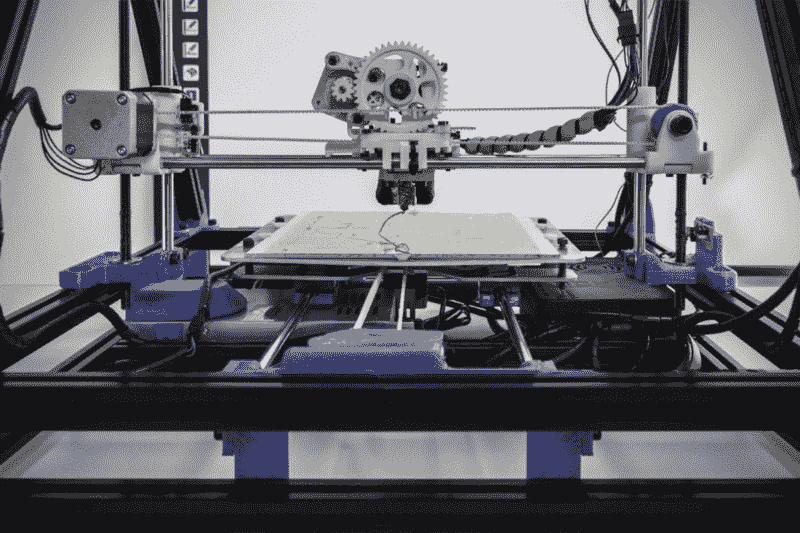
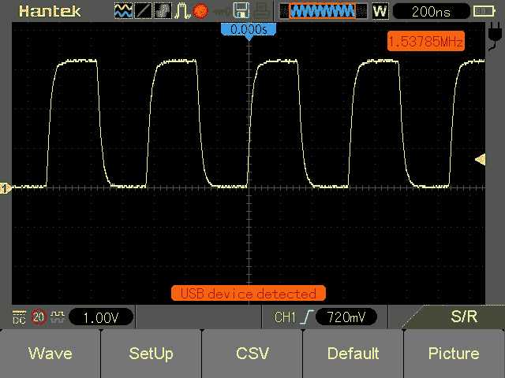
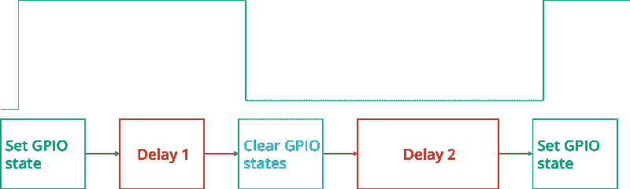
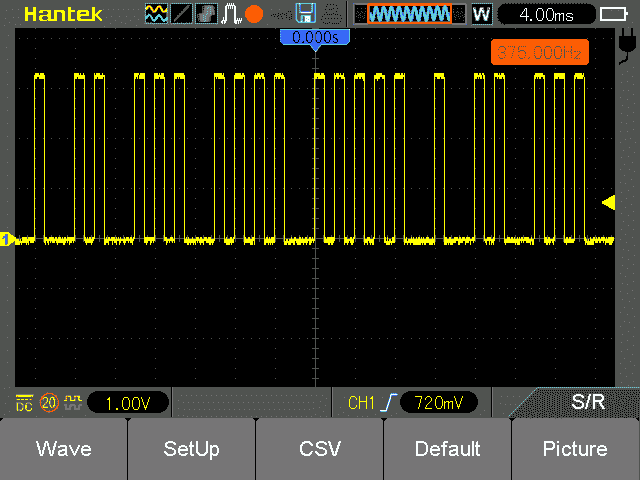
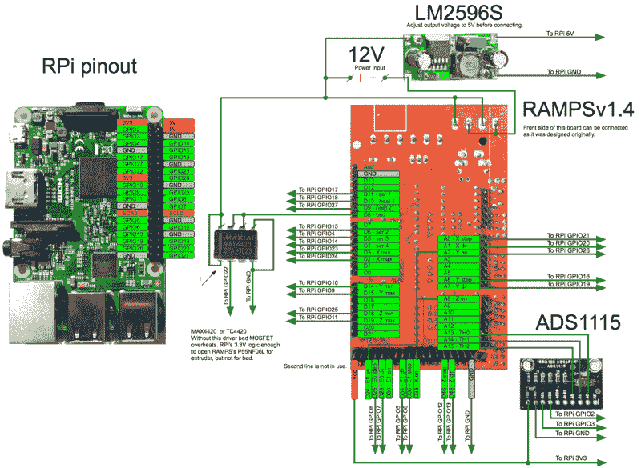
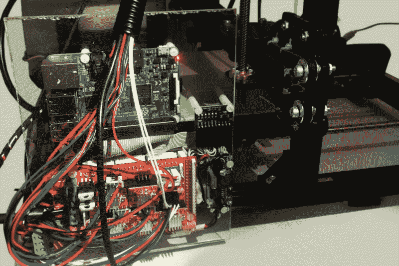

# 如何使用 Python 构建自己的 CNC 控制器和 3D 打印机

> 原文：<https://www.freecodecamp.org/news/how-to-build-a-3-d-printer-using-cnc-controller-in-python-bd3cd5e28516/>

尼古拉·哈巴罗夫

# 如何使用 Python 构建自己的 CNC 控制器和 3D 打印机



本文讨论了我用来在纯 Python 上构建第一个 CNC 机器控制器实现的过程。

计算机数字控制(CNC)机器控制器通常使用 C 或 C++编程语言来实现。它们运行在带有简单微控制器的无操作系统或实时操作系统上。

在本文中，我将描述如何使用现代 ARM 板(Raspberry Pi)和现代高级语言(Python)构建 CNC 控制器，特别是 3D 打印机。

这种现代化的方法为与其他尖端技术、解决方案和基础设施的集成提供了广泛的选择。这使得整个项目对开发者友好。

### 关于项目

现代 ARM 板通常使用 Linux 作为参考操作系统。这使我们能够访问包含所有 Linux 软件包的整个 Linux 基础设施。我们可以在板上托管网络服务器，使用蓝牙连接，使用 [OpenCV](http://opencv.org/) 进行图像识别，并构建一个板集群，等等。

这些都是众所周知的任务，可以在 ARM 板上实现，它们对于定制的 CNC 机器非常有用。例如，使用 compuvision 的自动定位对某些机器来说非常方便。

Linux 不是实时操作系统。这意味着我们不能产生具有所需时序的脉冲来直接从运行软件的电路板引脚控制步进电机，即使作为内核模块也是如此。那么，如何才能使用 steppers 和高级 Linux 特性呢？我们可以使用两个芯片——一个具有经典 CNC 实现的微控制器，一个通过 UART(通用异步收发器)连接到该微控制器的 ARM 板。

如果没有适合该微控制器的固件功能，该怎么办？如果我们需要控制微控制器中未实现的额外轴，该怎么办？对现有 C/C++固件的任何修改都需要大量的开发时间和精力。让我们看看是否可以通过简单地移除微控制器来简化甚至节省成本。

### PyCNC

PyCNC 是一款免费的开源高性能 g 代码解释器和 CNC/3D 打印机控制器。它可以在各种基于 Linux 和 ARM 的板上运行，比如 Raspberry Pi、Odroid、Beaglebone 等等。这给了你选择任何板和使用 Linux 提供的任何东西的灵活性。您可以将整个 g 代码运行时间保存在一块板上，而不需要单独的微控制器来进行实时操作。

与 C/C++项目相比，选择 Python 作为主要编程语言大大减少了代码库。它还减少了样板文件和特定于微控制器的代码，并使该项目能够为更多的受众所接受。

### 它是如何工作的

该项目在芯片硬件模块上使用 DMA(直接内存访问)。它只是将 RAM 中分配的 GPIO(通用输入输出)状态缓冲区复制到实际的 GPIO 寄存器。这一复制过程由系统时钟同步，并且完全独立于 CPU 内核工作。因此，步进电机轴的脉冲序列在内存中生成，然后 DMA 精确地将它们发送出去。

让我们更深入地研究代码，理解基础知识以及如何从 Python 访问硬件模块。

### GPIO

通用输入输出模块控制引脚状态。每个引脚可以有低或高状态。当我们对微控制器编程时，我们通常使用 SDK(软件开发工具包)定义的变量来写入该引脚。例如，要使能引脚 1 和 3 的高电平状态:

```
PORTA = (1 << PIN1) | (1 << PIN3)
```

如果您查看 SDK，您会发现该变量的声明，它看起来类似于:

```
#define PORTA (*(volatile uint8_t *)(0x12345678))
```

它只是一个指针。它不指向 RAM 中的位置，而是指向物理处理器的地址。实际的 GPIO 模块位于这个地址。

为了管理管脚，我们可以读写数据。树莓派的 ARM 处理器也不例外，它也有同样的模块。为了控制管脚，我们可以写/读数据。我们可以在官方文档中找到处理器外设的地址和数据结构。

当我们在用户运行时中运行一个进程时，这个进程在虚拟地址空间中启动。实际的外设是可以直接访问的。但是我们仍然可以用`*‘/dev/mem’*`设备访问真实的物理地址。

下面是一些使用这种方法控制 pin 状态的简单 Python 代码:

让我们一行一行地分解它:

**第 1–6 行**:标题，导入。

**第 7 行**:打开`*‘/dev/mem’*` 设备对物理地址的访问。

**第 8 行**:我们使用 [mmap](http://man7.org/linux/man-pages/man2/mmap.2.html) 系统调用将一个文件(虽然在我们的例子中，这个文件代表物理内存)映射到进程的虚拟内存中。我们指定地图区域的长度和偏移量。对于长度，我们采用页面大小。并且偏移量为`0x3F200000`。

文档说**总线**地址`0x7E200000`包含 GPIO 寄存器，我们需要指定**物理**地址。文档说(第 6 页，第 1.2.3 段),`0x7E000000`总线地址被映射到`0x20000000`物理地址，但是这个文档是针对 Raspberry 1 的。

请注意，对于 Raspberry Pi 1–3，所有模块总线地址都是相同的，但是对于 RPi 2 和 3，此映射被更改为`0x3F000000`。所以，这里的地址是`0x3F200000`。对于树莓 Pi 1，改成`0x20200000`。

在这之后，我们可以写入我们进程的虚拟内存，但是它实际上是写入 GPIO 模块。

第 9 行:关闭文件句柄，因为我们不需要存储它。

**第 11–14 行**:我们用`0x08`偏移量读写我们的地图。根据文档，它是 GPFSEL2 GPIO 功能选择 2 寄存器。该寄存器控制引脚功能。

我们设置(全部清零，然后用 OR 运算符设置)3 位，第 3 位设置为`001`。该值意味着该引脚作为输出工作。有许多引脚和可能的模式。这就是为什么模式寄存器被分成几个寄存器，每个寄存器包含 10 个引脚的模式。

**第 16 行和第 22 行**:设置“Ctrl+C”中断处理程序。

**第 17 行**:无限循环。

**第 18 行**:通过写入 GPSET0 寄存器，将引脚设置为**高电平**状态。

请注意，Raspberry Pi 不像 PORTA (AVR 微控制器)那样有寄存器。我们无法写入所有引脚的整个 GPIO 状态。只有**设置**和**清除**寄存器，用于设置和清除位屏蔽引脚指定的。

**第 19 行和第 21 行**:延迟

**第 20 行**:用 GPCLR0 寄存器将引脚设置为低电平状态。

**第 25 行和第 26 行**:将引脚切换到默认输入状态。关闭内存映射。

这段代码应该以超级用户权限运行。将文件命名为`‘gpio.py’` ，并使用`‘sudo python gpio.py’`运行它。如果你有一个 LED 连接到引脚 21，它会闪烁。

### 直接存储器存取

直接内存访问是一种特殊的模块，用于将内存块从一个区域复制到另一个区域。我们将把数据从内存缓冲区复制到 GPIO 模块。首先，我们需要在物理 RAM 中有一个将被复制的实体区域。

有几种可能的解决方案:

1.  我们可以创建一个简单的内核驱动程序来分配、锁定并向我们报告这个内存的地址。
2.  在一些实现中，虚拟内存被分配并使用`‘/proc/self/pagemap’`将地址转换成物理地址。我不推荐这种方法，尤其是当我们需要分配大面积时。任何虚拟分配的内存(甚至是锁定的，参见[内核文档](https://www.kernel.org/doc/Documentation/vm/unevictable-lru.txt))都可以移动到物理区域。
3.  所有的树莓 Pi 都有一个`‘/dev/vcio’`设备，是图形驱动的一部分，可以为我们分配物理内存。一个官方的例子展示了如何去做。我们可以用它来代替创造我们自己的。

DMA 模块本身只是一组位于某个物理地址的寄存器。我们可以通过这些寄存器来控制这个模块。基本上，有源、目的和控制寄存器。让我们检查一些简单的代码，展示如何使用 DMA 模块来管理 GPIO。

由于用`‘/dev/vcio’`分配物理内存需要额外的代码，我们将使用一个[文件](https://github.com/Nikolay-Kha/PyCNC/blob/master/cnc/hal_raspberry/rpgpio_private.py)和一个现有的 CMA PhysicalMemory 类实现。我们还将使用 PhysicalMemory 类，它使用上一个示例中的 memap 来执行这个技巧。

让我们一行一行地分解它:

**第 1–3 行**:标题，导入。

**第 5–6 行**:我们将使用的通道 DMA 号和 GPIO 引脚的常量。

**第 8–15 行**:将指定的 GPIO 管脚初始化为输出，点亮半秒钟进行视觉控制。事实上，这和我们在前面的例子中做的是一样的，用更 pythonic 化的方式编写。

**第 17 行**:在物理内存中分配`64`字节。

**第 18 行**:为 DMA 模块创建特殊结构——控制块。下面几行打破了这个块的结构。每个字段的长度为`32`位。

**第 19 行**:传输信息标志。你可以在官方文档的第 50 页找到每个标志的完整描述。

**第 20 行**:源地址。这个地址一定是总线地址，所以我们叫`*get_bus_address()*`。DMA 控制块必须按 32 字节对齐，但是这个块的**大小是`24`字节。所以我们有 8 个字节，用来存储。**

**第 21 行**:目的地址。在我们的例子中，它是 GPIO 模块的 SET 寄存器的地址。

**第 22 行**:传输长度— `4`字节。

**第 23 行**:跨步。我们不使用此功能，设置`0`。

**第 24 行**:下一个控制块的地址，在我们的例子中，下一个 32 字节。

**第 25 行**:填充。但是既然我们用这个地址作为数据源，放一个位，应该会触发 GPIO。

**第 26 行**:填充。

**第 28–37 行**:填写第二个 DMA 控制块。不同之处在于，我们写入以清除 GPIO 寄存器，并将我们的第一个模块设置为下一个控制模块，以循环传输。

**第 38–39 行**:将控制块写入物理内存。

**第 41 行**:获取所选通道的 DMA 模块对象。

**第 42–43 行**:复位 DMA 模块。

**第 44 行**:指定第一块的地址。

**第 45 行**:运行 DMA 模块。

**第 49–52 行**:清理。停止 DMA 模块，并将 GPIO 引脚切换到默认状态。

让我们将示波器连接到指定的引脚并运行这个应用程序(不要忘记 sudo 特权)。我们将观察到大约 1.5 MHz 的方波脉冲:



### DMA 挑战

在建造一台真正的数控机床之前，你应该考虑几件事情。

首先，DMA 缓冲区的大小可以是数百兆字节。

其次，DMA 模块是为快速数据复制而设计的。如果几个 DMA 通道正在工作，我们可以超出存储器带宽，缓冲区将被复制，延迟可能导致输出脉冲抖动。所以，最好有一些同步机制。

为了克服这一点，我为控制块创建了一个特殊的设计:



图像顶部的波形图显示了所需的 GPIO 状态。下面的模块代表产生该波形的 DMA 控制模块。“延迟 1”指定脉冲长度，“延迟 2”是脉冲之间的暂停长度。使用这种方法，缓冲区的大小只取决于脉冲的数量。

例如，对于行程长度为 200 毫米、每毫米 400 个脉冲的机器，每个脉冲将占用 128 个字节(每 32 个字节 4 个控制块)，总大小约为 9.8MB。我们将有多个轴，但大多数脉冲将同时发生。它将是几十兆字节，而不是几百兆字节。

我解决了第二个挑战，与同步相关，通过控制块引入临时延迟。DMA 模块有一个特殊的功能:它可以等待来自写入数据的模块的特殊就绪信号。最适合我们的模块是 PWM(脉宽调制)模块，它也将帮助我们实现同步。

PWM 模块可以序列化数据并以固定速度发送。在这种模式下，它为 PWM 模块的 FIFO(先进先出)缓冲器产生一个就绪信号。因此，让我们将数据写入 PWM 模块，并仅将其用于同步。

基本上，我们需要在传输信息标志的感知映射中启用一个特殊标志，然后以所需频率运行 PWM 模块。实现相当长——你可以自己[研究](https://github.com/Nikolay-Kha/PyCNC/blob/master/cnc/hal_raspberry/rpgpio.py)。

相反，让我们创建一些简单的代码，可以使用现有的模块来生成精确的脉冲。

```
import rpgpio
```

```
PIN=21PINMASK = 1 << PINPULSE_LENGTH_US = 1000PULSE_DELAY_US = 1000DELAY_US = 2000 g = rpgpio.GPIO()g.init(PIN, rpgpio.GPIO.MODE_OUTPUT) dma = rpgpio.DMAGPIO()for i in range(1, 6): for i in range(0, i): dma.add_pulse(PINMASK, PULSE_LENGTH_US) dma.add_delay(PULSE_DELAY_US) dma.add_delay(DELAY_US)dma.run(True) raw_input(“Press Enter to stop”)dma.stop()g.init(PIN, rpgpio.GPIO.MODE_INPUT_NOPULL)
```

代码非常简单，不需要分解。如果运行此代码并连接示波器，您将看到:



现在我们可以创建真正的 g 代码解释器并控制步进电机。但是等等！这里已经实现[了](https://github.com/Nikolay-Kha/PyCNC)。你可以使用这个项目，因为它是在 MIT 许可下发布的。

### 五金器具

Python 项目可以用于您的目的。但是为了启发你，我将描述这个项目最初的硬件实现——一台 3D 打印机。它基本上包含以下组件:

1.  树莓 Pi 3
2.  [RAMPSv1.4 板](http://reprap.org/wiki/RAMPS_1.4)
3.  4 A4988 或 DRV8825 模块
4.  用设备(终点挡板、电机、加热器和传感器)重新包装 Prusa i3 框架
5.  12V 15A 电源单元
6.  LM2596S DC-DC 降压转换器模块
7.  MAX4420 芯片
8.  ADS1115 模数转换器模块
9.  UDMA133 IDE 带状电缆
10.  丙烯酸玻璃
11.  PCB 支架
12.  带 2.54 毫米台阶的连接器套件

40 针 IDE 带状电缆适用于 Raspberry Pi 40 针连接器，但另一端需要做一些工作。从另一端切断现有接头，并将接头压接到电缆线上。

RAMPSv1.4 板最初设计用于连接到 [Arduino](https://www.arduino.cc/en/Main/arduinoBoardMega) Mega 连接器，因此没有简单的方法将该板连接到 Raspberry Pi。下面的方法可以简化电路板的连接。你需要连接少于 40 根电线。



PyCNC reference connection

我希望这个连接图相当简单，容易复制。最好连接一些销(第二挤出机，伺服系统)以备将来使用，即使它们目前并不需要。

你可能想知道——我们为什么需要 MAX4420 芯片？Raspberry Pi 引脚为 GPIO 输出提供 3.3V 电压，这些引脚可以提供非常小的电流。仅仅开关 MOSFET(金属氧化物半导体场效应晶体管)栅极是不够的。此外，其中一个 MOSFETs 在床用加热器的 10A 负载下工作。因此，直接连接到树莓派，这个晶体管会过热。因此，在高负载的 MOSFET 和 Raspberry Pi 之间最好连接一个专用的 MOSFET 驱动器。它能以有效的方式开关 MOSFET 并减少其发热。

ADS1115 是一款模数转换器(ADC)。由于 Raspberry Pi 没有嵌入式 ADC 模块，我使用了一个外部模块来测量 100k 欧姆热敏电阻的温度。RAMPSv1.4 模块已经为热敏电阻配备了分压器。LM2596S 降压转换器必须调整至 5V 输出，并用于为 Raspberry Pi 板本身供电。

现在它可以安装在 3D 打印机框架上，RAMPSv1.4 板应该连接到配备的框架上。



就是这样。3D 打印机组装好了，你可以把源代码复制到树莓派上运行。将在交互式 g 代码外壳中运行它。`sudo ./pycnc filename.gcode`将运行一个 g 代码文件。检查 [Slic3r](http://slic3r.org/) 的[就绪配置](https://github.com/Nikolay-Kha/PyCNC/blob/master/extra/sample-Slic3r-config.ini)。

在这个视频中，你可以看到它实际上是如何工作的。

如果你觉得这篇文章有用，请给我一些掌声，让更多的人看到它。谢谢！


*物联网就是快速构建创意原型。为了使之成为可能，我们开发了 [DeviceHive](https://devicehive.com/?utm_source=medium&utm_medium=social&utm_campaign=d-spring-2018) ，一个开源的物联网/M2M 平台。DeviceHive 为创建任何物联网/M2M 解决方案提供了坚实的基础和构建模块，弥合了嵌入式开发、云平台、大数据&客户端应用之间的差距。*

