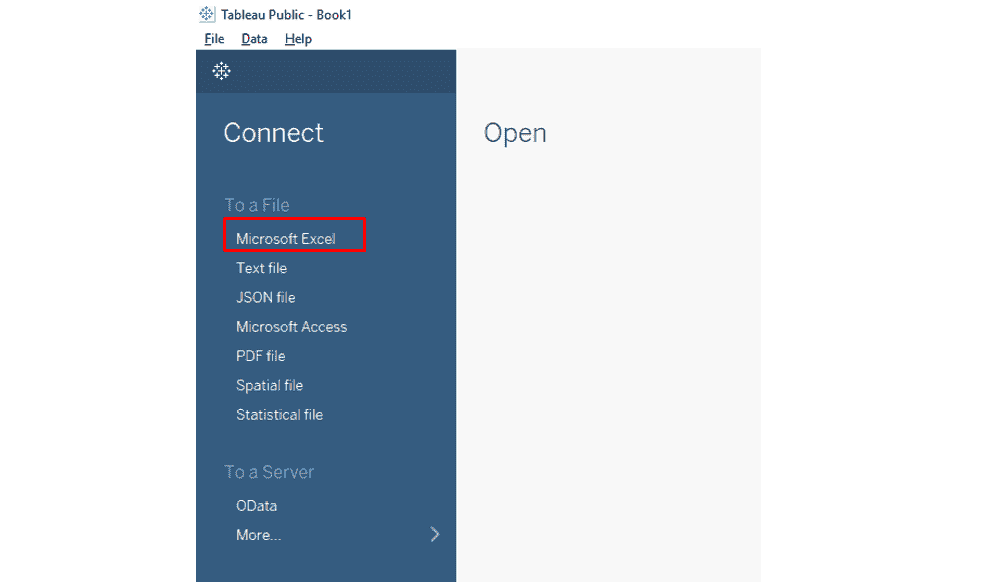
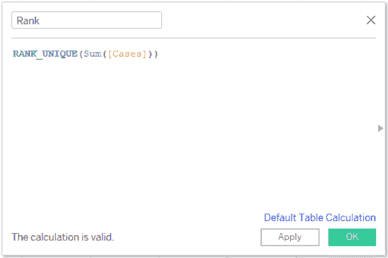
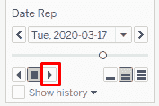
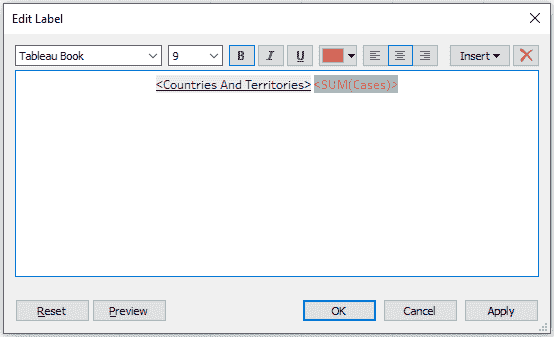
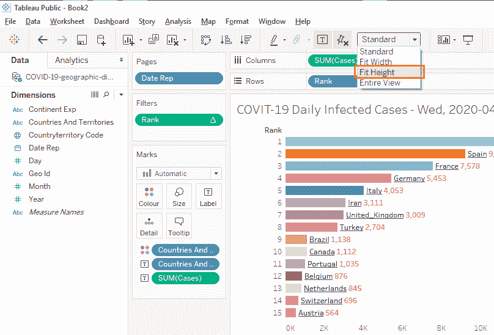
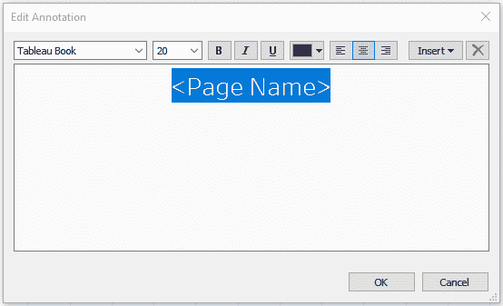

# 如何用 Tableau 在 5 分钟内完成新冠肺炎案例的条形图比赛

> 原文：<https://www.freecodecamp.org/news/how-to-build-a-bar-chart-race-on-covid-19-cases-in-tableau/>

当您构建条形图竞赛时，您正在创建许多离散的条形图页面，然后将它们串在一起。这就像传统的卡通动画一样。

2019 年 12 月，Tableau 发布了 2020.1 测试版，新增了动态参数的动画功能。这意味着下面的[条形图竞赛](https://public.tableau.com/profile/blackraven#!/vizhome/COVIT-19DailyInfectedCases/COVIT-19DailyInfectedCases)现在非常容易构建。

Watch it in action: [https://www.youtube.com/watch?v=3iZrMkZ3948](https://www.youtube.com/watch?v=3iZrMkZ3948)

## 先决条件

下载并安装 [Tableau Public](https://public.tableau.com/s/) (版本 2020.1.2 以上)。它完全免费，功能齐全。唯一的问题是，你所有的作品只能发布在 Tableau 公共服务器上，而不能保存在你的本地桌面上。如果数据不敏感或不隐私，这是正常的。

下载最新[新冠肺炎数据](https://www.ecdc.europa.eu/sites/default/files/documents/COVID-19-geographic-disbtribution-worldwide-2020-04-22.xlsx) (in *。xlsx 格式)从欧洲疾病预防和控制中心[网站](https://www.ecdc.europa.eu/en/publications-data/download-todays-data-geographic-distribution-covid-19-cases-worldwide)下载，并使用通用文件名如“新冠肺炎-地理-分布-全球. xlsx”将其重命名。以后您可以使用相同的文件名，用更新的数据替换该文件。

打开 Tableau 公共 app，在“连接”菜单上，点击“微软 Excel”，选择下载的数据文件。单击左下方的“第 1 页”选项卡。

Connect Tableau Public to dataset

## 确定要比赛的数量

在此数据集中，有两个有用的量可供您选择:

*   每日感染病例，或
*   每日死亡病例。

要选择种族数量作为每日感染病例，请将“病例”拖到列中。

要用国家名称标记条形图，请将“国家和地区”拖到标签上。

要使条形具有各种颜色，请将“国家和地区”拖至颜色。

## 创建国家排名

本节需要一行简单的编程代码。

单击维度→下拉菜单→创建计算字段。
创建一个新字段“Rank ”,并键入下面的代码:

**RANK _ UNIQUE(Sum([Cases])**

To code for Calculated Field “Rank”

单击“应用”以确保计算有效，然后单击“确定”。

将“等级”拖到行中。
点击(行)等级→下拉菜单→离散。
点击(行)排名→下拉菜单→计算使用→“国家和地区”。

## 配置动画(2020.1 版的新功能)

要创建动画帧的快照，请将“日期表示”拖到页面上。
点击(页面)日期报告→下拉菜单→确切日期。

打开动画，选择格式→动画→打开。
设置过渡持续时间:持续时间→“1.00 秒(慢速)”。
点击“X”关闭动画窗口。

寻找一个小动画控件，当动画功能打开时，它会出现，然后单击“向前播放”图标。将滑动条拖到不同的日期，或使用左/右按钮选择日期。

Animations control

## 添加简单定制

### 要改善颜色:

点击标签→确保“显示标记标签”被选中。
点击颜色→编辑颜色- >替换相似的颜色。
(我已经更换了美国、西班牙、意大利的颜色)

您可以隐藏国家/地区传奇卡，不再需要它了。

### 要将病例数的附加标签添加到条形中:

将“案例”拖到标签上。
点击标签→文本→点击“3 点”。这将打开标签编辑器。
仅将标签排列成一行。
下划线<国家和地区>。
加粗<求和(例)>，并使用红色字体。
点击“确定”。

Label editor

### 要更改工作表的名称:

双击“工作表 1”并将其更改为“新冠肺炎每日感染病例”。

### 要更改 X 轴限制:

双击 X 轴。这将调出轴菜单。选择要“固定”的范围:固定开始=0，固定结束=40，000。

### 要仅显示前 15 个国家:

将“等级”拖至过滤器→点击“确定”。
点击(过滤器)等级→下拉菜单→计算使用→“国家和地区”。
将“206”替换为“15”，并点击“确定”。
将标准视图更改为“适合身高”。

View chart using ‘Fit Height’

### 要增加标签的字体大小:

点击标签→字体→下拉菜单→将字体大小改为“15”。

### 要向图表添加日期标签:

右键单击空白图表区域→注释→区域。这将打开注释编辑器。
键入<页面名称>，并将字体大小增加到“20”。
点击“确定”。

既然已经创建了日期标签，请调整其大小并将其移动到底部。

Annotation editor

## 发布可视化

当您对自定义感到满意时，可视化就可以发布了。

点击文件→保存到 Tableau Public。

作品现在[发布在 Tableau 公共服务器](https://public.tableau.com/profile/blackraven#!/vizhome/COVIT-19DailyInfectedCases/COVIT-19DailyInfectedCases)上。然后，您可以使用可用的链接来共享它。

这里有一个视频教程，一步一步地指导整个过程:

[https://www.youtube.com/embed/ZnEuq6SHIUI?feature=oembed](https://www.youtube.com/embed/ZnEuq6SHIUI?feature=oembed)

使用 Tableau 版本 2020.1 以后的新动画特性，构建条形图竞赛变得非常简单。现在，您可以尝试使用其他国家的日期/时间序列数据:GDP、人口、预期寿命等等。

释放你的创造力！