# 如何使用 Hyperledger Fabric 和 Composer 构建区块链网络

> 原文：<https://www.freecodecamp.org/news/how-to-build-a-blockchain-network-using-hyperledger-fabric-and-composer-e06644ff801d/>

作者:哈尔迪克

# 如何使用 Hyperledger Fabric 和 Composer 构建区块链网络

#### 新区块链开发者指南

Photo by [Alexandru Acea](https://unsplash.com/@alexacea?utm_source=medium&utm_medium=referral) on [Unsplash](https://unsplash.com?utm_source=medium&utm_medium=referral)

在我开始之前，Hyperledger Fabric **只有**运行在基于 Unix 的操作系统上。因此，它将无法在 Windows 上运行，你可以做的事情也会受到限制。如果你正在运行 Windows，我建议在继续之前设置一个虚拟机。

本文假设读者对 Javascript 有所了解。这不是一个针对初级程序员的教程，而是针对区块链领域的初级程序员。

### 我们在建造什么？

所以，你想建立一个区块链应用程序，但不知道从哪里开始？别担心。通过本教程，我们将建立一个交易卡网络。拥有棒球、足球和板球运动员的不同的人可以在他们之间交换卡片。

我们还将设置一个 REST API 服务器，以允许客户端软件与我们的业务网络进行交互。最后，我们还将生成一个 Angular 4 应用程序，它使用 REST API 与我们的网络进行交互。

你可以找到我们将要在这个 [Github repo](https://github.com/haardikk21/cards-trading-network) 上构建的完整最终代码

你准备好开始了吗？

### 目录

*   Hyperledger 结构及相关应用简介
*   安装先决条件、工具和 Fabric 运行时
*   创建和部署我们的业务网络
*   测试我们的业务网络
*   生成 REST API 服务器
*   生成使用 REST API 的角度应用程序

### Hyperledger 结构及相关应用简介

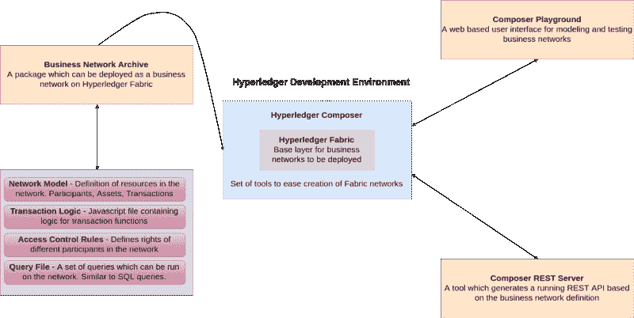

Development environment overview for Hyperledger

Hyperledger Fabric 是一个开源框架，用于创建私有(经许可的)区块链商业网络，其中成员的身份和角色为其他成员所知。构建在结构上的网络充当后端，客户端应用程序充当前端。SDK 可用于 Nodejs 和 Java 构建客户端应用程序，Python 和 Golang 支持即将推出。

**Hyperledger Composer** 是一套基于 Javascript 的工具和脚本，可简化 Hyperledger 结构网络的创建。使用这些工具，我们可以为我们的网络生成一个**业务网络档案(BNA)** 。Composer 广泛涵盖了这些组件:

*   商业网络档案 _nba)
*   作曲家游乐场
*   作曲家休息服务器

**业务网络归档** — Composer 允许我们打包几个不同的文件并生成一个归档文件，然后将其部署到光纤网络上。要生成此归档，我们需要:

*   **网络模型** —网络中存在的资源的定义。这些资源包括资产、参与者和事务。我们稍后将回到这些。
*   **业务逻辑** —交易功能的逻辑
*   **访问控制限制—** 包含定义网络中不同参与者权利的各种规则。这包括但不限于定义参与者可以控制哪些资产。
*   **查询文件(可选)——**一组可以在网络上运行的查询。可以认为这些类似于 SQL 查询。你可以阅读更多关于查询[这里](https://hyperledger.github.io/composer/latest/reference/query-language)。

**Composer Playground** 是一个基于 web 的用户界面，我们可以用它来建模和测试我们的业务网络。Playground 适合对简单的概念证明进行建模，因为它使用浏览器的本地存储来模拟区块链网络。然而，如果我们正在运行一个本地 Fabric 运行时，并且已经为它部署了一个网络，我们也可以使用 Playground 来访问它。在这种情况下，Playground 不是模拟网络，而是直接与本地 Fabric 运行时通信。

**Composer REST Server** 是一个工具，它允许我们基于我们的业务网络定义生成 REST API 服务器。客户端应用程序可以使用这个 API，它允许我们在网络中集成非区块链应用程序。

### 安装先决条件、工具和 Fabric 运行时

#### **1。安装先决条件**

现在，我们已经对构建这些网络的需求有了较高的理解，我们可以开始开发了。但是，在我们这样做之前，我们需要确保我们的系统上安装了先决条件。更新后的名单可以在[这里](https://hyperledger.github.io/composer/latest/installing/installing-prereqs.html)找到。

*   坞站引擎和坞站复合
*   诺杰斯和 NPM
*   饭桶
*   Python 2.7.x

对于 Ubuntu 用户来说，Hyperledger 有一个 bash 脚本可以让这个过程变得非常简单。在终端中运行以下命令:

不幸的是，Mac 用户必须手动安装上述工具，并确保他们的系统具备所有先决条件。[该页面](https://hyperledger.github.io/composer/latest/installing/installing-prereqs.html)与安装说明保持同步。

#### 2.**安装工具以简化开发**

在您的终端中运行以下命令，并确保您在运行 npm 命令时没有使用 sudo。

composer-cli 是唯一的基本软件包。其余的不是核心组件，但随着时间的推移会变得非常有用。当我们遇到它们时，我们将了解更多关于它们各自的功能。

#### 3.**安装本地 Hyperledger Fabric 运行时**

让我们浏览一下这些命令，看看它们是什么意思。首先，我们创建并输入一个新目录。然后，我们下载并提取安装 Hyperledger Fabric 所需的工具。

然后我们指定我们想要的 Fabric 版本，在编写时我们需要 1.2，因此 **hlfv12** 。然后，我们下载 fabric 运行时并启动它。

最后，我们生成一张`PeerAdmin`卡片。结构网络中的参与者可以拥有类似于现实生活中的名片的商务网卡。正如我们之前提到的，Fabric 是二等兵区块链构建的基础层。PeerAdmin 名片的持有者有权在这个 Fabric runtime 上部署、删除和管理业务网络(也就是您！)

如果一切顺利，您应该会看到如下输出:

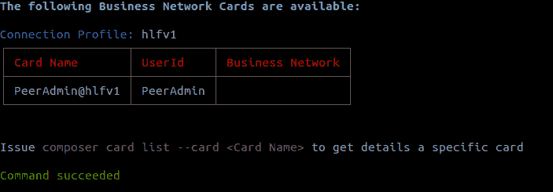

同样，如果你输入`ls`，你会看到这个:

基本上，我们在这里所做的只是下载并启动一个本地结构网络。如果我们愿意，我们可以停止使用`./stopFabric.sh`。在开发会议的最后，我们应该运行`./teardownFabric.sh`

**注意:**这个本地运行时是**，为了开发使用，需要频繁地启动、停止和拆除**。对于具有更持久状态的运行时，您将希望在开发环境之外部署网络。你可以通过在 Kubernetes 或像 IBM Blockchain 这样的托管平台上运行网络来做到这一点。不过，你应该先浏览一下这篇教程，以便有个概念。

### 创建和部署我们的业务网络

还记得我们之前安装的包`yo`和`generator-hyperledger-composer`吗？

为我们提供了一个生成器生态系统，其中的生成器是可以用 yo 命令运行的插件。这用于为各种项目设置样板样本应用程序。`generator-hyperledger-composer`是我们将使用的 Yo 生成器，因为它包含生成样板业务网络的规范。

#### **1。生成商业网络**

在选择的目录中打开终端并键入`yo hyperledger-composer`

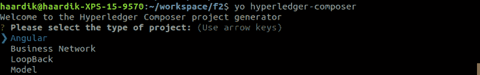

你会看到类似上面的东西。选择`Business Network`并命名为`cards-trading-network`，如下图所示:

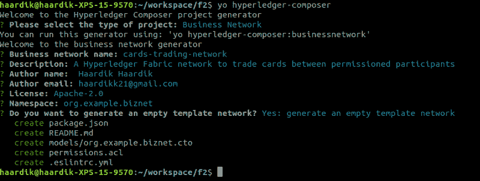

#### 2.**为我们的业务网络建模**

建立商业网络的第一步也是最重要的一步是确定现有的资源。建模语言中有四种资源类型:

*   资产
*   参与者
*   处理
*   事件

对于我们的`cards-trading-network`，我们将定义一个资产类型`TradingCard`，一个参与者类型`Trader`，一个交易`TradeCard`和一个事件`TradeNotification`。

继续，在选择的代码编辑器中打开生成的文件。打开建模文件`org.example.biznet.cto`。删除其中的所有代码，因为我们要重写它(除了名称空间声明)。

这包含了我们的资产`TradingCard`的规范。所有资产和参与者都需要有一个我们在代码中指定的惟一标识符，在我们的例子中，它是`cardId`

此外，我们的资产有一个基于下面定义的枚举器的`GameType cardType`属性。枚举用于指定一个最多可以有 N 个可能值的类型，除此之外别无其他。在我们的例子中，除了`Baseball`、`Football`或`Cricket`之外，任何`TradingCard`都不能有`cardType`

现在，为了指定我们的`Trader`参与者资源类型，在建模文件中添加以下代码

这个相对简单一些，也挺好理解的。我们有一个参与者类型`Trader`，他们由他们的`traderId`唯一标识。

现在，我们需要给我们的`TradingCard`添加一个引用，让它指向它们的所有者，这样我们就知道这张卡属于谁了。为此，在您的`TradingCard`资产中添加以下代码行:

`--> Trader ow`下

因此代码看起来像这样:

这是我们第一次使用`--&`gt；你一定想知道这是什么。这是一个关系点`r`。o a `nd` - >是我们如何区分资源自身的属性和与另一种资源类型的关系。由于所有者 `is a` Trader 是网络的参与者，我们希望直接引用 `that` Trader，而这正是 `wh` at - >所做的。

最后，将这段代码添加到建模文件中，它指定了进行事务和发出事件所需的参数。

#### 3.**为我们的交易添加逻辑**

为了在`TradeCard`函数后面添加逻辑，我们需要一个 Javascript 逻辑文件。在您的项目文件夹中创建一个名为`lib`的新目录，并使用以下代码创建一个名为`logic.js`的新文件:

**注意:**上面的评论中的装饰器功能非常重要。没有`@param {org.example.biznet.TradingCard} trade`，函数不知道代码从建模语言中引用了哪个`Transaction`。此外，确保被传递的参数名(即`trade`)是您在函数定义中紧接着传递的那个。

这段代码主要检查指定的卡是否有`forTrade == true`，并在这种情况下更新卡的所有者。然后，它为该卡触发`TradeNotification`事件。

#### 4.**定义权限和访问规则**

在`permissions.acl`中添加一条新规则，允许参与者访问他们的资源。在生产中，您可能希望对这些访问规则更加严格。你可以在这里阅读更多关于他们的信息。

#### 5.**生成业务网络档案(BNA)**

现在所有的编码都完成了，是时候为我们的业务网络创建一个归档文件了，这样我们就可以在本地 Fabric 运行时上部署它。为此，请在项目目录中打开“终端”,并键入以下内容:

`composer archive create --sourceType dir --sourceName .`

此命令告诉 Hyperledger Composer 我们要从当前根文件夹的目录中构建 BNA。

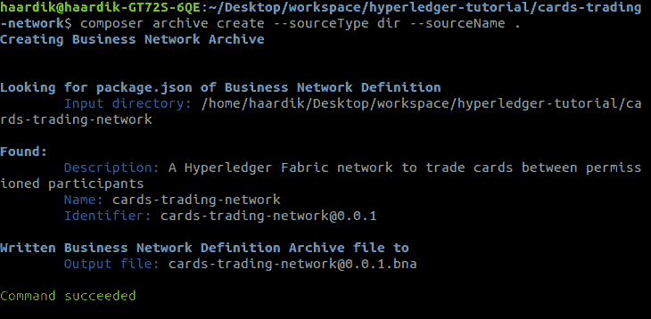

**注:**BNA 名称和版本来自`package.json`文件。当您添加更多代码时，您应该更改那里的版本号，以部署能够升级现有业务网络的唯一归档。

#### 6.**安装并部署 BNA 文件**

我们可以使用`PeerAdmin`用户将网络安装和部署到我们的本地 Fabric 运行时。要安装企业网络，请键入

`composer network install --archiveFile cards-trading-network@0.0.1.bna --card PeerAdmin@hlfv1`

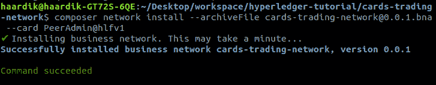

要部署业务网络，请键入

`composer network start --networkName cards-trading-network --networkVersion 0.0.1 --networkAdmin admin --networkAdminEnrollSecret adminpw --card PeerAdmin@hlfv1 --file cards-trading-admin.card`

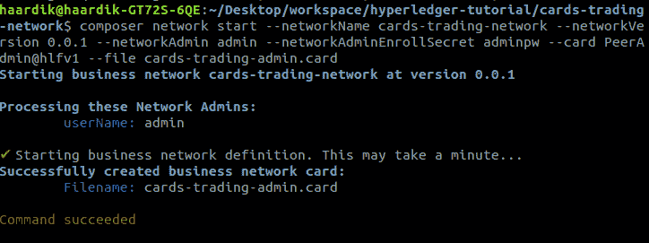

`networkName`和`networkVersion`必须与您的`package.json`中指定的相同，否则无法工作。

`--file`取要为此网络名片创建的文件的名称。然后，需要通过键入以下内容来导入该卡，使其可用

`composer card import --file cards-trading-admin.card`

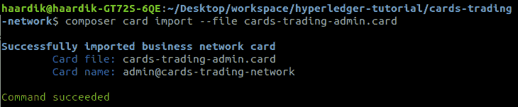

太神奇了。我们现在可以通过键入以下命令来确认我们的网络已经启动并正在运行

`composer network ping --card admin@cards-trading-network`

`--card`这一次需要我们要 ping 的网络的管理卡。

如果一切顺利，您应该会看到类似这样的内容:

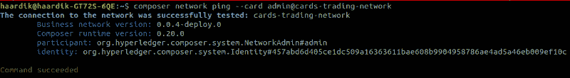

**Your network version will be 0.0.1 or whatever your package.json specifies —** I actually forgot to take this screenshot and uploaded it after I was done writing the tutorial and making edits

### 测试我们的业务网络

现在，我们的网络已经在 Fabric 上启动并运行，我们可以启动 Composer Playground 与它进行交互。为此，在终端中键入`composer-playground`,然后在浏览器中打开`[http://localhost:8080/](http://localhost:8080/)`,您应该会看到类似这样的内容:

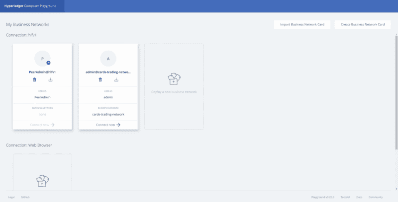

按下`admin@cards-trading-network`的现在连接，你会看到这个屏幕:

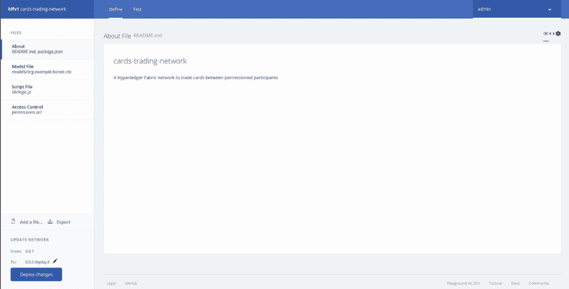

在 **Define** 页面，我们可以对代码进行更改，部署这些更改以升级我们的网络，并导出业务网络档案。

从顶部菜单转到**测试**页面，您会看到:

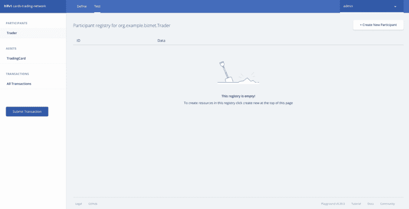

从参与者中选择`Trader`,点击右上角附近的**创建新参与者**,创建一个新的`Trader`,如下所示:

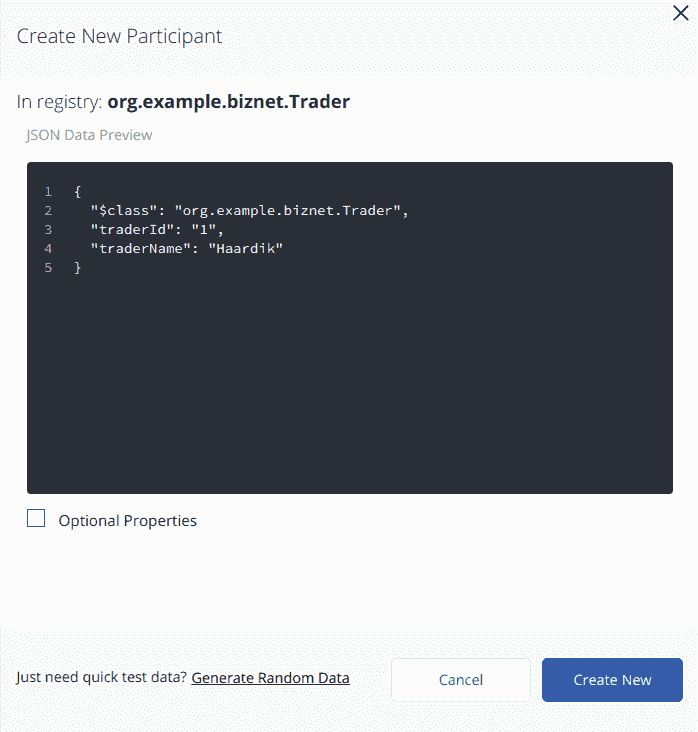

继续，再做几个`Trader`这里是我的三个交易者，名字分别是 Haardik，John 和 Tyrone。

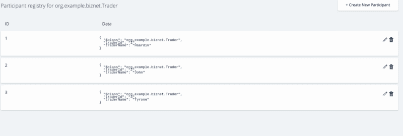

现在，让我们制造一些资产。点击左侧菜单中的`TradingCard`并按下**创建新资产**。注意这里的`owner`字段是多么有趣，看起来像这样:

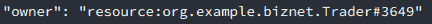

这是一种关系。这就是`--&`gt；意味着。我们指定确切的资源类型，后跟它们的唯一标识符，瞧，我们有了一个关系指针。

继续并完成一个`TradingCard`类似这样的东西:

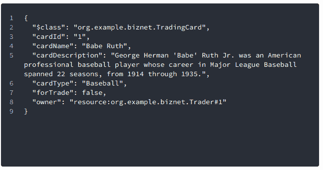

注意`owner`字段是如何指向我的`Trader#1`也就是`Haardik`的。继续制作多几张卡片，并让一对夫妇将`forTrade`设置为真。

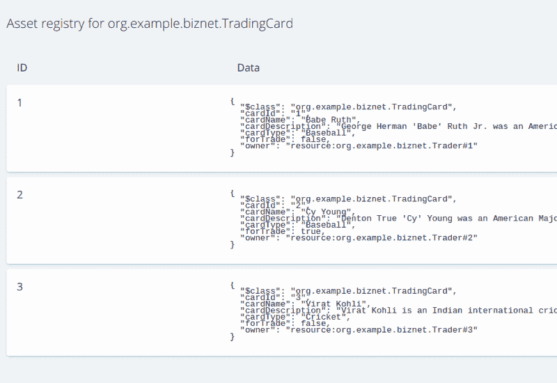

注意我的`Card#2`怎么有`forTrade == true`？

现在有趣的事情来了，让我们试着交换卡片，:D

点击左侧的**提交交易**，使`card`指向`TradingCard#2`，`newOwner`指向`Trader#3`，如下所示:

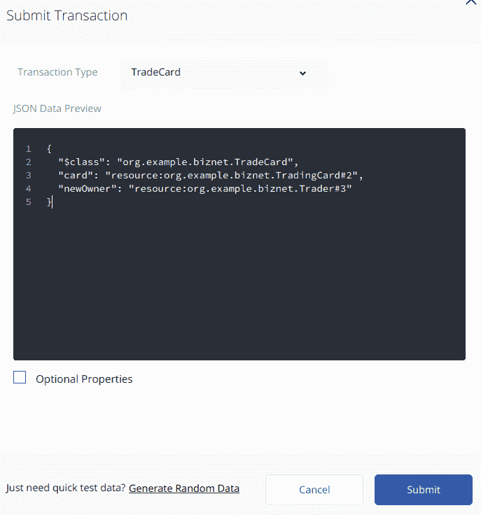

按下**提交**，看看你的`TradingCard` s，你会发现`Card#2`现在有了主人`Trader#3` :D

### 生成 REST API 服务器

用 Playground 做交易很好，但不是最优的。我们必须为用户开发客户端软件，为他们提供无缝体验，他们甚至不必了解底层的区块链技术。为此，我们需要一种更好的方式来与我们的业务网络互动。谢天谢地，我们有`composer-rest-server`模块来帮助我们。

在您的终端中键入`composer-rest-server`，指定`admin@cards-trading-network`，选择**从不使用名称空间**，并继续使用默认选项，如下所示:

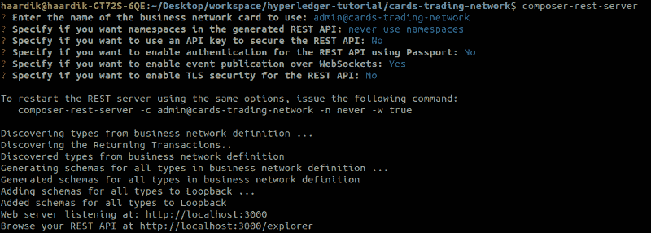

打开`[http://localhost:3000/explorer/](http://localhost:3000/explorer/)`，你会看到一个自动生成的 REST API :D 的文档版本

### 生成使用 REST API 的角度应用程序

还记得`yo hyperledger-composer`发生器吗？它能做的不仅仅是建立一个商业网络。它还可以创建一个 Angular 4 应用程序来运行我们上面创建的 REST API。

要创建 Angular web 应用程序，在您的终端中键入`yo hyperledger-composer`，选择 Angular，选择使用卡`admin@cards-trading-network`连接到现有的业务网络，并连接到现有的 REST API。(**编辑:**软件的新版本可能会要求卡文件，而不仅仅是卡的名称)

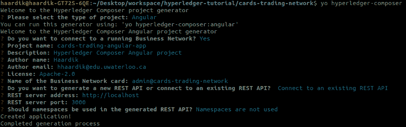

这将继续运行`npm install`，给它一分钟，一旦它全部完成，你将能够加载`[http://localhost:4200/](http://localhost:4200/)`并看到一个类似这样的页面:
**编辑:**软件的新版本可能要求你自己运行`npm install`，然后运行`npm start`

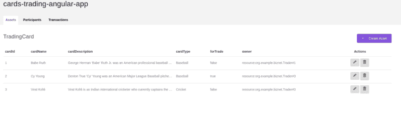

您现在可以直接从这个应用程序玩您的网络，它通过运行在端口 3000 上的 REST 服务器与网络通信。

恭喜你！您刚刚使用 Hyperledger Fabric 和 Hyperledger Composer :D 建立了您的第一个区块链业务网络

你可以给卡片交易网络增加更多的功能，在卡片上设定价格并给所有人一个平衡。你也可以有更多的事务允许`Trader`切换`forTrade`的值。你可以将它与非区块链应用程序集成在一起，允许用户购买新卡并添加到他们的帐户中，然后他们可以在网络上进一步交易。

可能性是无穷无尽的，你会如何看待它们？请在评论中告诉我:D

### 已知 BUG:你的 Angular web 应用没有正确处理事务吗？

在撰写本文时，angular generator 有一个问题，即事务页面上的紫色 Invoke 按钮不做任何事情。为了解决这个问题，我们需要对生成的 angular 应用程序进行一些更改。

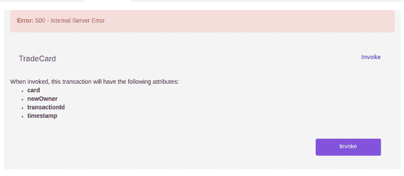

#### **1。当您按下按钮**时，打开一个模态

我们需要做的第一个改变是让按钮打开模态窗口。代码已经包含了所需的模态窗口，按钮只是缺少了`(click)`和`data-target`属性。

要解决这个问题，打开`/cards-trading-angular-app/src/app/**TradeCard/TradeCard.component.html**`

文件名会因您的`transaction`名而异。如果您的业务网络中有多个`transaction`,那么您必须在所有事务资源类型 HTML 文件中进行这种更改。

向下滚动到最后，您会在>标签上看到一个`<butt`。继续将这两个属性添加到标签中:

`(click)="resetForm();" data-target="#addTransactionModal"`

所以这条线看起来像这样:

`<button type=”button” class=”btn btn-primary invokeTransactionBtn” data-toggle=”modal” (click)=”resetForm();” data-target=”#addTransactionModal”>Invoke<`；/按钮>

`(click)`属性调用`resetForm();`将所有的输入字段设置为空，`data-target`指定点击时打开的模态窗口。

保存文件，打开浏览器，尝试按调用按钮。它应该打开这个模态:

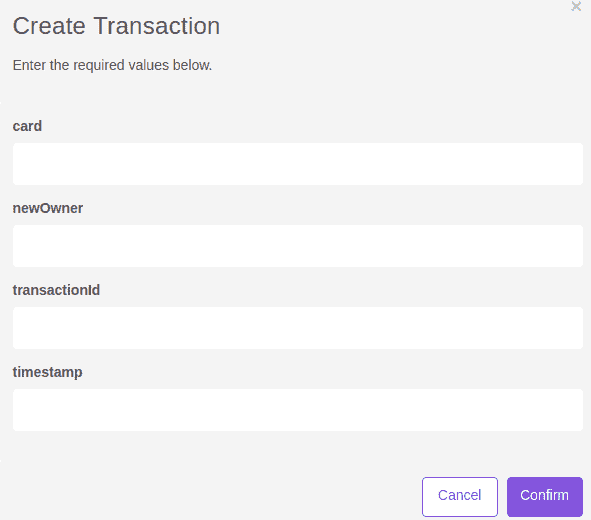

#### 2.**删除不必要的字段**

仅仅打开模态是不够的。我们可以看到它向我们请求`transactionId`和`timestamp`，即使我们没有在建模文件中添加这些字段。我们的网络存储了所有交易的内在价值。因此，它应该能够自己计算出这些值。事实证明，确实如此。这些是备用字段，我们可以把它们注释掉，REST API 会为我们处理剩下的部分。

在同一个文件中，向上滚动找到输入字段，并注释掉`addTransactionModal`中负责这些输入字段的 div

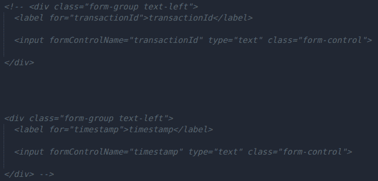

保存文件，打开浏览器，然后按 Invoke。您应该看到这个:

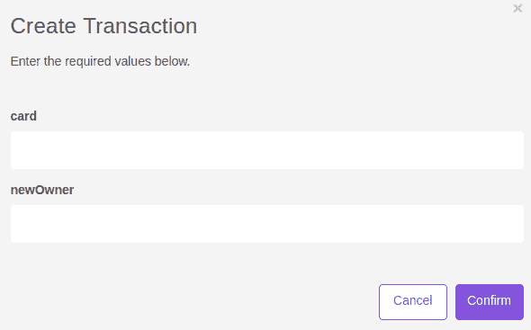

现在，您可以通过在这些字段中传递数据来创建事务。由于`card`和`newOwner`是与其他资源的关系，我们可以这样做一个事务:

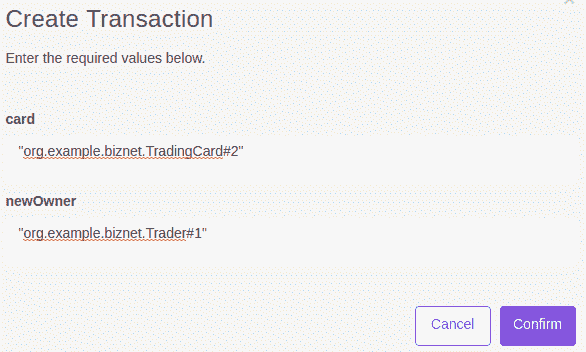

按**确认**，回到**资产**页面，你会看到`TradingCard#2`现在属于`Trader#1`:

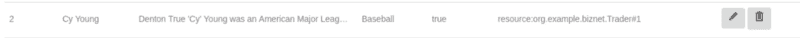

恭喜你！您已经成功地在 Hyperledger Fabric 上建立并部署了区块链业务网络。您还为该网络生成了一个 REST API 服务器，并学习了如何制作与该 API 交互的 web 应用程序。

如果你有任何问题或疑虑，请在评论中提出，我会尽快回复你。
邮箱:hhaardik @ uwaterloo . ca
LinkedIn:【https://www.linkedin.com/in/haardikkk】T2