# 如何使用静态站点生成器和 CDN 构建博客

> 原文：<https://www.freecodecamp.org/news/how-to-build-a-blog-using-a-static-site-generator-and-a-cdn/>

我想为自己建立一个有趣的项目来学习一些新技术。这一次，我决定学习一些关于静态站点生成器的知识。

我的目标是使用 SSG 构建一个博客，并在代码库发生变化时随时部署它。你可以在[https://caliburnsecurity.com](https://caliburnsecurity.com)看到结果。

## 博客要求

下面是我在决定我想让我的博客支持什么时提出的要求。

*   支持内容生成的降价
*   语法突出显示
*   代码行编号
*   "无服务器"
*   现成的主题/插件-我不是一个前端开发人员
*   SEO 功能
*   按关键字/类别浏览
*   搜索支持(因为这是静态生成的，所以搜索是通过 Google 的索引进行的——还有其他文章讨论如何添加动态 JavaScript 支持的搜索)
*   RSS 支持
*   版本控制
*   静态——没有动态内容(有一个很好的副作用，就是缩小了网站的攻击面，提高了安全性)

## 那么什么是静态站点生成器呢？

简而言之，SSG 是一个框架，旨在管理您的网站，并将其转变为一个只提供静态页面的网站。

## 为什么要用 SSG 来建博客？

我花了一些时间去理解的一件事是，如果我已经有了一个 CMS，为什么我还要使用一个静态站点。网上有很多关于使用无头 CMS 的 SSG 的文章...但是为什么呢？

据我所知，好处只是你可以更灵活地使用熟悉的框架，如 React 或 Vue，同时使用 CMS 来处理所有内容。

然而，由于我绝不是前端开发人员，我差点放弃这个项目。我想“哦，我应该用 Ghost——如果在像 DigitalOcean 这样的平台上托管，它每月只需 5 美元，是一个提供内容和管理内容的一体化平台”。

然而，我真的想尝试学习一些新的东西，看看我是否可以只使用 Markdown 免费部署一个博客。

正如经常发生的那样，当我深入研究各种技术时，我希望花几个小时的事情花了更多的时间。

我尝试了几种不同的技术，例如(并非所有这些都是 SSG，稍后会详细介绍):

*   鹈鹕(蟒蛇)
*   雨果(走)
*   Hexo
*   Gridsome(检视- JS)
*   VuePress(检视- JS)
*   《人鬼情未了》
*   盖茨比(React - JS)
*   杰基尔(红宝石)

### 我为什么选择雨果

我不会对我研究的所有技术进行过多的详细描述。但总的来说，我发现 Hugo 的设置和构建速度非常快，而且是所有选项中最简单的。

虽然我知道这类似于 Jekyll，但我真的不想处理配置 Ruby 环境的问题，Hugo 的速度让其他一切都望尘莫及。

## 如何开始建立博客

在这个练习中，让我们构建一个由 Netlify 托管的静态博客(免费！).

注意:在本教程中，我将在我的 Windows box 上使用 PowerShell，所以请记住，如果复制/粘贴。

### 确保您有以下依赖关系:

*   饭桶
*   Visual Studio 代码(或您喜欢的编辑器)
*   雨果双星

### 以下是我们工作流程的概要:

1.  下载/安装 Hugo
2.  创建 Hugo 项目
3.  添加和配置主题
4.  添加到 Git
5.  部署到网络
6.  (可选)配置免费的 Netlify CMS

### 下载或安装 Hugo

为了[安装 Hugo](https://gohugo.io/getting-started/installing/) ，我去了他们的 [GitHub Releases](https://github.com/gohugoio/hugo/releases) 页面，下载了他们独立的 Windows x64 二进制文件。我把它放在我的项目目录中，我们将在那里创建我们的站点(你可以总是正确地安装它/把二进制文件添加到你的路径中，但是我想要快一点)。

## 如何创建 Hugo 网站

要创建新站点，只需运行以下命令:

```
.\hugo.exe new site hugo-blog
mv .\hugo.exe .\hugo-blog
cd .\hugo-blog
.\hugo.exe server -D --gc 
```

我们现在已经创建了我们的项目，并且刚刚启动了 Hugo 服务器。我们使用了 **-D** 标志来告诉 Hugo 显示草稿内容，我通常会添加 **- gc** 来确保每次都通过清理缓存来进行清理。

您可以通过 http://localhost:1313 访问您的网站。

### 了解目录结构

您现在应该会看到以下目录结构:

```
|__archetypes
|__assets *this will not show up by default
|__config *this will not show up by default
|__content
|__data
|__layouts
|__static
|__themes
|__config.toml 
```

*   **原型**:预先配置好前置内容的内容模板文件。我们不会真的碰这个。
*   **资产**:存储任何由 [Hugo Pipes](https://gohugo.io/hugo-pipes/) 处理过的文件。这超出了本教程的范围。
*   **config** :存储配置文件的可选目录。我们不会做太疯狂的事情，所以我们将只使用默认的 config.toml 文件。
*   内容:这是你的内容所在——你的文章和页面。该目录中的顶级文件夹被视为一个*部分*。
*   **数据**:包含 Hugo 使用的配置文件。我从来不需要接触这个目录。
*   **布局**:存储站点的部分或完整页面 HTML 模板。这里的任何东西都可以覆盖你的主题中相应的条目，允许你在不修改主题的实际文件的情况下定制主题。
*   **static** :存储任何静态内容，比如图像、CSS 或者脚本。本文件夹中的任何内容均按原样复制，Hugo 不做任何修改或解释。这是您将存储媒体(如图像)的地方，以便在您的博客文章中引用。
*   主题目录:你将安装 Hugo 主题的目录。
*   **config.toml** :默认站点配置。如果您想要分隔不同的环境，可以使用单独的目录。

## 如何添加您的第一个主题

对于这个博客，我们将使用雨果的[故事](https://github.com/EmielH/tale-hugo)主题。从项目的根目录运行以下命令:

```
git submodule add https://github.com/EmielH/tale-hugo.git .\themes\tale 
```

我们将**不会**编辑主题中的任何文件，但是会在上面讨论的**布局**文件夹中进行所有的修改。这将让我们总是更新子模块来更新我们的主题，而不用担心我们会覆盖我们所做的任何更改。

要初始化主题，编辑根目录中的 **config.toml** 并添加以下行(同时也编辑默认值):

```
# Theme Settings
theme = "tale"
[params]
  Author = "Aaron Katz" # Add the name of the author (this theme only supports one author)
[author]
  name = "Caliburn Security" # Used by the foot copyright 
```

我们走吧，主题现在是活跃的！(注意，在很多情况下，主题会要求你将主题的 **theme.toml** 文件复制并粘贴到你的 **config.toml** 中)

去看看你的页面吧——每次你保存一个文件，Hugo 都会重新构建你的网站。

### 如何修改主题文件

当前主题的一个问题是，非帖子内容将显示在主页列表中。

要改变这一点，让我们复制**。\ themes \ tale \ layouts \ index . html**页面到**。\layouts\index.html** 。

一旦出现，将`{{range (.Paginate .Site.RegularPages).Pages}}`替换为`{{ range where .Paginator.Pages "Section" "post" }}`。这将确保列表中只显示“文章”部分。

我还想添加一个简短的页脚，所以继续在**创建一个新文件。\layouts\footer.html** 并添加以下代码:

```
<footer>
    <span>
    &copy; <time datetime="{{ now }}">{{ now.Format "2006" }}</time> {{ .Site.Author.name }}
    </span>
</footer>
```

### 如何添加谷歌分析

我还想在我的博客上添加一些谷歌分析，但我注意到主题没有包含这一功能。

幸运的是，Hugo 使得添加分析变得极其简单。打开 **config.toml** 文件并添加以下行:

```
googleAnalytics = "" # The UA-XXX number from Google Analytics 
```

保存配置后，复制**。\ themes \ tale \ layouts \ partial \ head . html**文件到**。\layouts\partial\head.html** 并在 *head* 标签的正下方添加以下代码:

```
{{ template "_internal/google_analytics_async.html" . }} 
```

我们走吧，现在我们有谷歌分析工作。酷！

## 如何写内容

让我们添加一个漂亮的关于页面，这样人们就知道关于我的一切。:)

```
.\hugo.exe new about.md 
```

为了确保这个页面被添加到主菜单中，在页面的首页添加下面一行:`menu: main`。

*注:构建 Hugo，Hugo 将生成**下的内容。\public** 文件夹，只需运行`.\hugo.exe`*

### 什么是前沿问题？

这对我来说是一个新学期。从本质上来说，前台只是内容的结构化元数据。

默认情况下，您的模板将向您创建的每个页面或帖子添加以下元数据字段:

*   标题
*   日期
*   起草

其他潜在有用的前沿问题元素有:

*   描述-这允许您输入内容的描述。
*   expiryDate -设置不再发布内容的日期时间。
*   关键词-内容的元关键词。
*   lastmod -上次修改内容的日期时间(如果您使用 enableGitInfo 配置命令，这将自动设置为上次文件在 Git 中的 mofieid)
*   标记——当设置为“rst”时，可以使用 reStructuredText 代替 Markdown(这个特性是实验性的)
*   publishDate -为要显示的内容设置一个未来的日期。
*   slug -输出 URL 的尾部。如果未指定，则默认为文件名。
*   摘要-提供文章摘要时使用的文本。如果我不想让第一段出现在摘要中，我觉得这很有用，这是典型的默认情况。
*   <taxonomies>——使用分类索引的复数形式，如*标签*或*类别*。</taxonomies>

#### 如何为博客文章创建原型

让我们继续改变我们看到的博客帖子的默认标题。在原型文件夹中，创建一个名为 **posts.md** 的新文件，并添加以下内容:

```
---
title: "{{ replace .Name "-" " " | title }}"
date: {{ .Date }}
draft: true

slug: {{ .File.BaseFileName }} # Will take the filename as the slug. Feel free to change this to any format you like.  I like including this, so that I remind myself I have the option to change if I want.

summary: "" # Remove this if you want Hugo to just use the first 70 (configurable) characters of the post as the summary.
description: ""

# Lists
keywords:
tags:
categories:
--- 
```

现在让我们用`.\hugo.exe`做最后一次构建，并准备配置我们的 Git 库。

## 如何配置 Git

为 Git 配置项目的时间:

```
git init
git remote add origin <YOUR GIT URL>
git push -u origin master 
```

太好了，现在我们已经将代码存储在我们的存储库中，并且我们已经准备好进行部署了！

## 如何部署你的博客

现在我们已经将站点存储在 Git 中，是时候进行部署了！差不多完成了——现在我将展示如何在 10 分钟内部署到 Netlify。

首先，我们需要创建 Netlify 应用程序(使用任何可用的方法随意创建一个帐户):

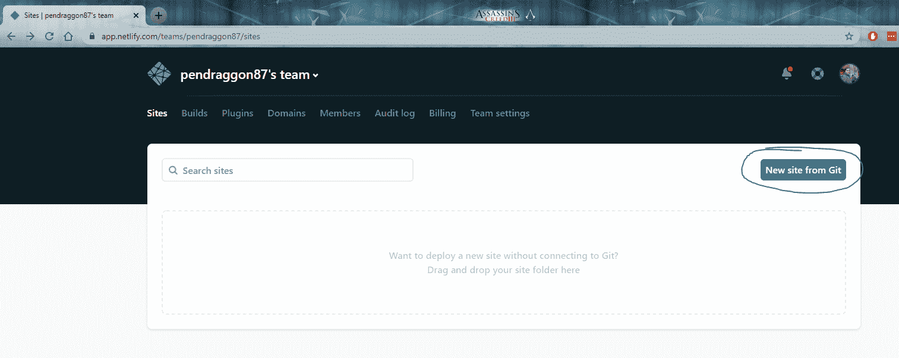

接下来，我们需要创建站点，并告诉它我们的 Git 存储库在哪里，用于我们的 Hugo 内容:

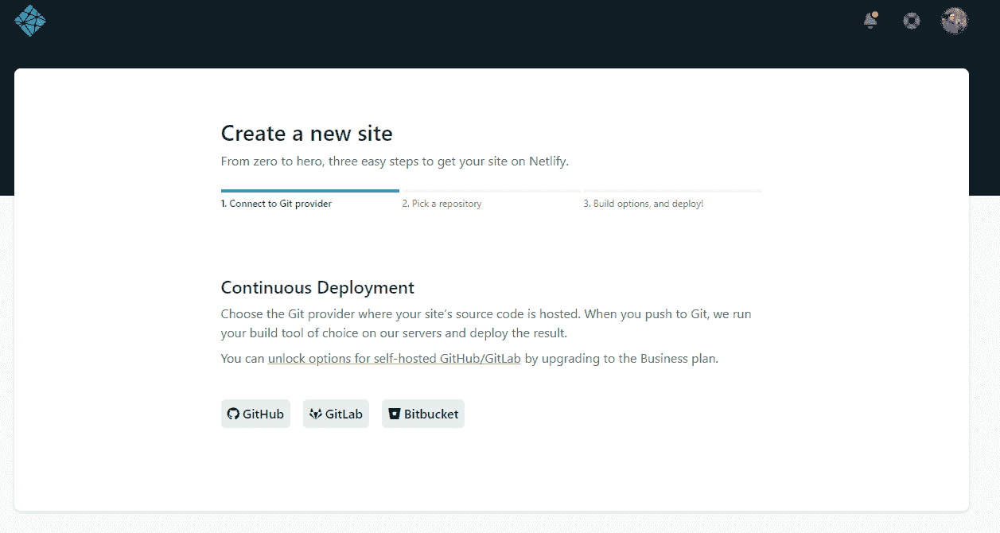

Tell Netlify where your site is located

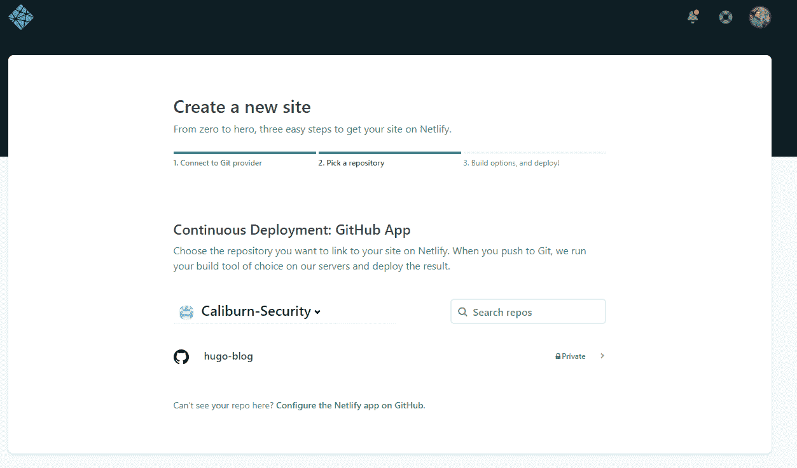

Select the repository

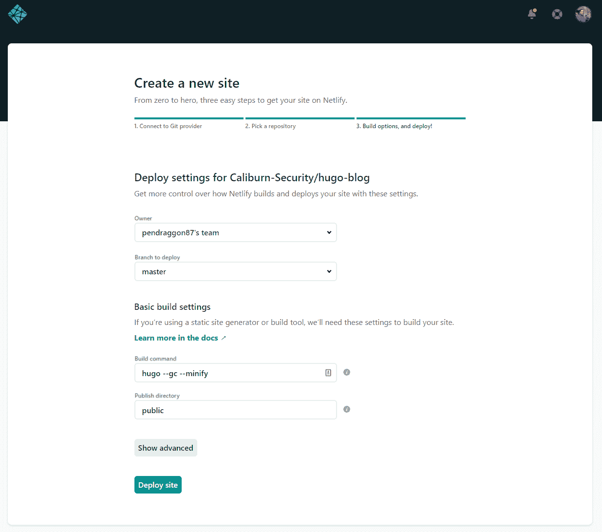

These can be left at the default settings

接下来，我们将为我们的站点设置一个自定义域:

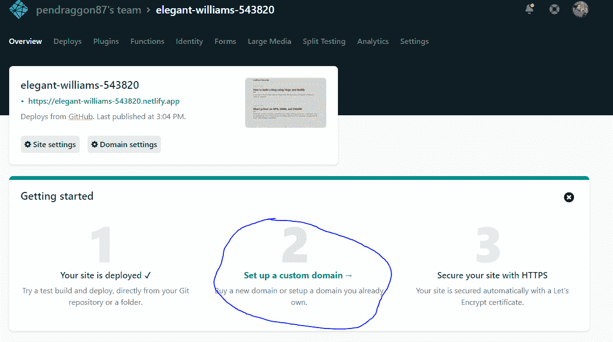

Select the custom domain option

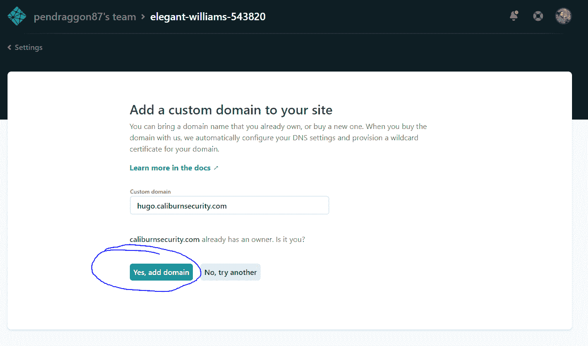

Enter your custom domain

您现在应该看到您的域带有一条消息，告诉**检查 DNS 配置**。点击该按钮，将提供的 DNS 记录信息输入管理您的 DNS 记录的服务提供商:

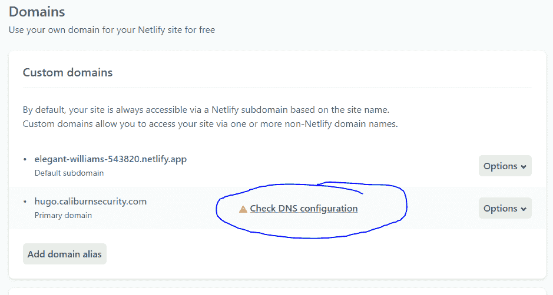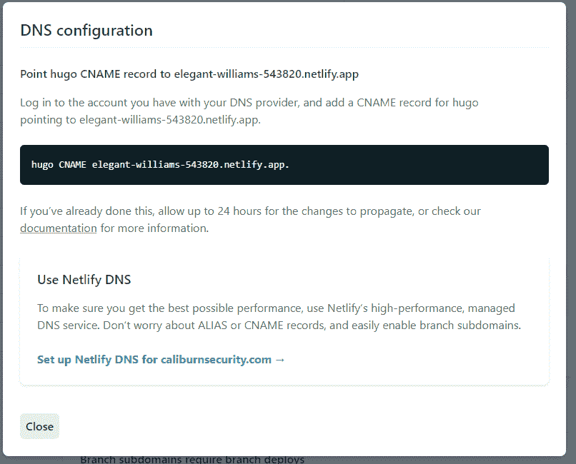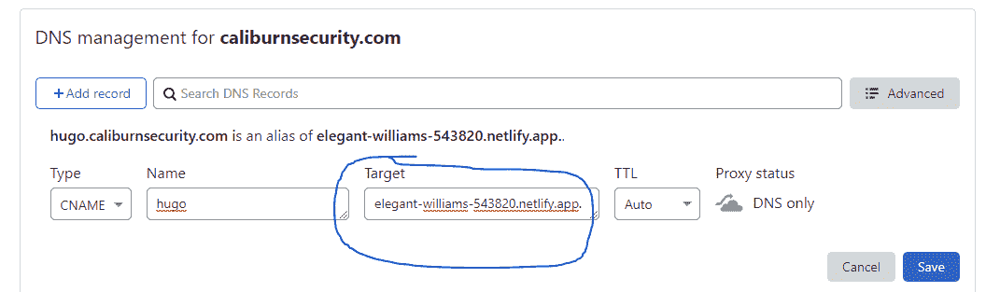

Example configuration within my Cloudflare account

完成后，等待几分钟让 DNS 设置传播，然后选择**验证 DNS 配置:**

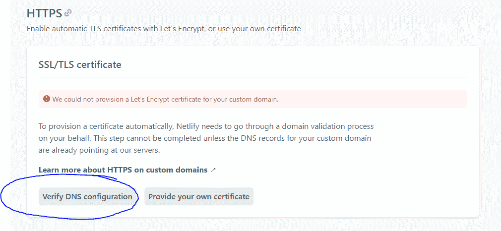

看，你的网站现在是活的！

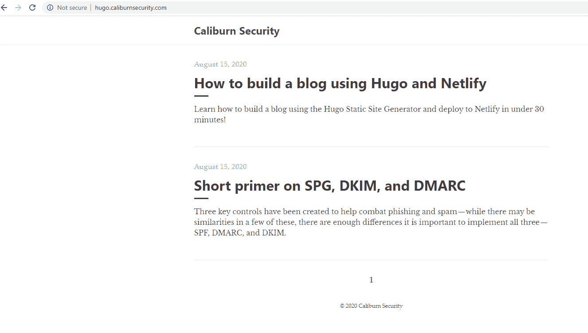

Example of my new blog hosted on Netlify!

最后，作为最佳实践，我们应该为我们的站点设置 SSL。Netlify 提供了使用[让我们加密](http://letsencrypt.org/howitworks/)的选项，为您的应用程序自动提供证书。为此，只需选择**供应证书:**

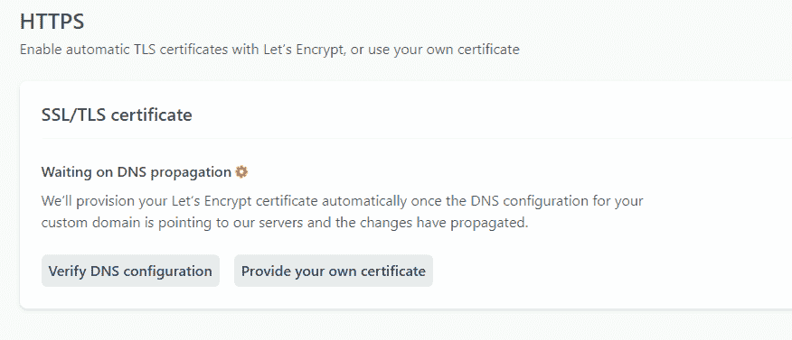

*注意:生成证书可能需要一段时间，所以请耐心等待。*

### Netlify 部署设置

在真正准备好使用 Netlify 之前，我们还有最后一步。可惜 Netlify 用的 Hugo 版本默认有些过时。但是，我们可以通过为 Netlify 创建自己的配置来解决这个问题，以便在部署我们的站点时遵循。

首先，在存储库的根目录下创建一个名为`netlify.toml`的文件，然后添加以下配置:

```
[build]
publish = "public"
command = "hugo --gc --minify"

[context.production.environment]
HUGO_VERSION = "0.74.3"
HUGO_ENV = "production"
HUGO_ENABLEGITINFO = "true"

[context.split1]
command = "hugo --gc --minify --enableGitInfo"

[context.split1.environment]
HUGO_VERSION = "0.74.3"
HUGO_ENV = "production"

[context.deploy-preview]
command = "hugo --gc --minify --buildFuture -b $DEPLOY_PRIME_URL"

[context.deploy-preview.environment]
HUGO_VERSION = "0.74.3"

[context.branch-deploy]
command = "hugo --gc --minify -b $DEPLOY_PRIME_URL"

[context.branch-deploy.environment]
HUGO_VERSION = "0.74.3"

[context.next.environment]
HUGO_ENABLEGITINFO = "true"
```

剩下要做的就是在 Netlify 控制台中选择 **Deploy site** ,这样你的站点就可以在一个定制的 SSL 域上运行了！

## 包裹

咻！这是一篇很长的博文，但是希望这篇博文能够展示使用“无服务器”博客有多快。来看看我学到了什么:)

### 什么是爱

*   构建超级简单，只需运行`hugo serve`
*   实时重新加载-进行更改，保存，页面将重新加载
*   总的来说很简单——我不需要处理 grunt、gulp、webpack 或其他东西
*   可定制的输出格式允许您生成静态站点，以及 Google AMP 站点、JSON 文件等等。
*   很快。我提到快了吗？
*   可以部署在任何地方——无论是使用 Netlify(我目前的选择)、亚马逊 S3 & Cloudfront、Heroku、GitHub Pages 等等。
*   如果降价不够，可以使用短码
*   持续部署——一切都受版本控制，并且在我发布到主分支时部署
*   允许评论和分享帖子

### 挑战

*   雨果有时候太单纯了。完全没有插件或扩展，等等。
*   使用 Go 不太直观，短代码感觉比 Vue 之类的东西更混乱
*   没有太多的主题可用，但我希望该库继续增长，因为有一个非常活跃的用户群

### 那么我需要 CMS 吗？

经历了这一切之后，我脑海中仍然有这个问题。答案是“视情况而定”。

如果我要合并很多媒体，比如我需要上传的图像或视频，那么将它们全部添加和组织到静态的图像文件夹中肯定会很乏味。

在这种情况下，我会使用 Ghost、Netlify 或 Sanity 这样的无头 CMS 来管理内容，只要我还能使用 Markdown 写文章。

### 参考

*   https://medium.com/backticks-tildes/hugo101-getting-started-with-hugo-and-deploying-to-netlify-9a813fe23b94
*   https://blog.risingstack.com/static-site-generator-hugo-netlify/
*   http://cloudywithachanceofdevops.com/posts/2018/05/17/setting-up-google-analytics-on-hugo/
*   https://www.sitepoint.com/premium/books/a-beginner-s-guide-to-creating-a-static-website-with-hugo/read/1