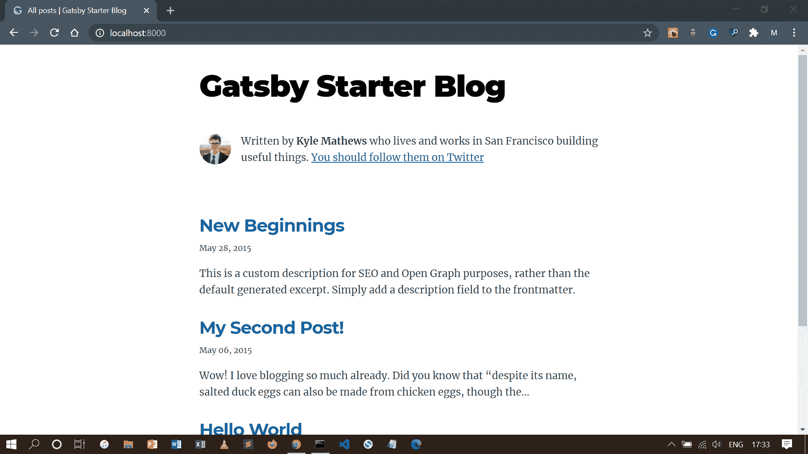
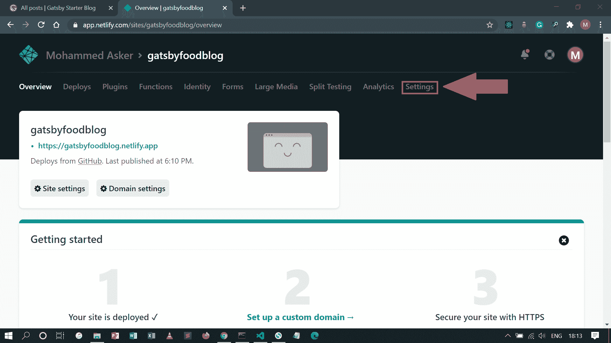
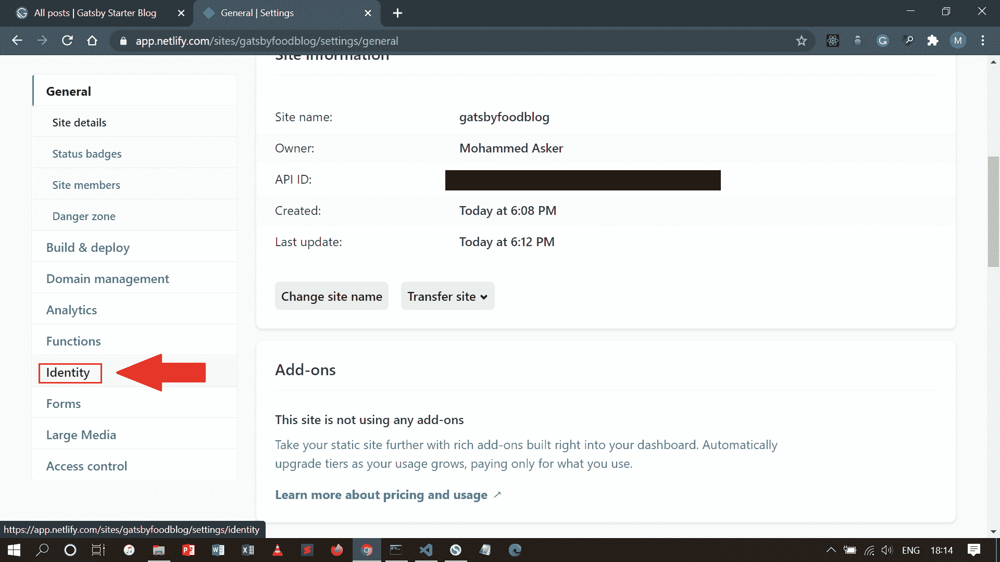
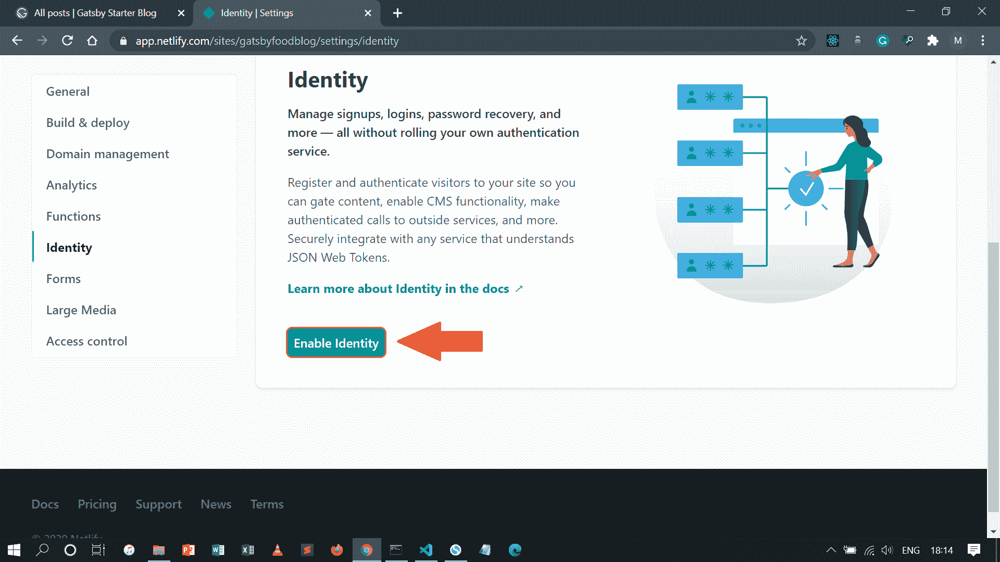
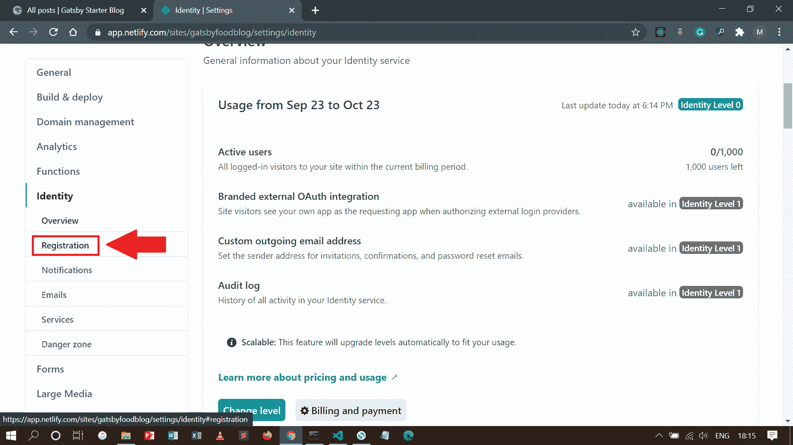
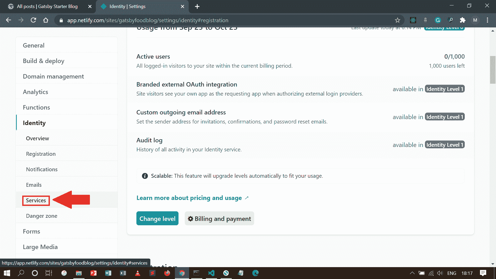
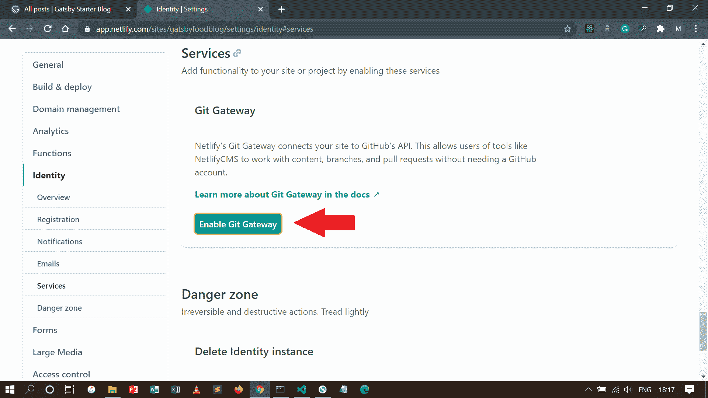
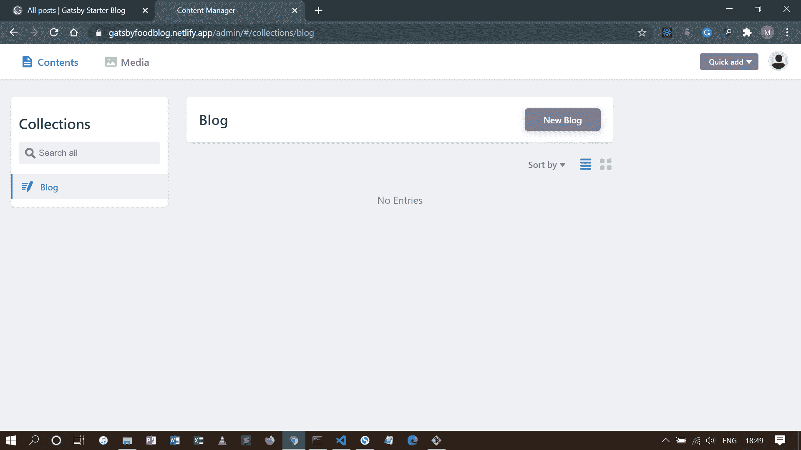

# 如何用 Gatsby 和 Netlify CMS 建立博客——完全指南

> 原文：<https://www.freecodecamp.org/news/how-to-build-a-blog-with-gatsby-and-netlify-cms/>

在这篇文章中，我们将与盖茨比和 Netlify CMS 建立一个博客。您将学习如何在您的计算机上安装 Gatsby，并使用它快速开发一个超级快速的博客网站。

您还将学习如何通过创建和配置文件将 Netlify CMS 添加到您的站点，然后通过用户验证将 CMS 连接到您的站点。

最后，您将学习如何访问 CMS admin，以便撰写您的第一篇博客文章。

这个项目的完整代码可以在这里找到。

下面简单介绍一下这些工具。

## 盖茨比是什么？

Gatsby 是一个基于 React 的免费开源框架，可以帮助你快速建立网站和网络应用。它也是一个像 Next.js、Hugo 和 Jekyll 一样的静态站点生成器。

它从一开始就包括 SEO(搜索引擎优化)、可访问性和性能优化。这意味着，与单独使用 React 构建相比，构建生产就绪的 web 应用程序将花费更少的时间。

## 什么是 Netlify CMS？

Netlify CMS 是一个静态网站生成器的 CMS(内容管理系统)。它是由制造[网络生活](https://www.netlify.com/)的同一批人建造的。它允许你像 WordPress 一样创建和编辑内容，但它是一个更简单和用户友好的界面。

Netlify CMS 的主要好处是你不必在每次想写文章的时候都创建 markdown 文件。这对于不想处理代码、文本编辑器、存储库和任何与技术有关的事情的内容作者来说很有用——他们可以专注于写文章。

好了，没有任何进一步的麻烦，让我们开始建立博客！

**但是在我们开始之前，有一个快速的提示**:这个指南需要预先了解 JavaScript 和 React。如果您对这些工具还不熟悉，我已经在文章末尾链接了参考资料来帮助您复习这些技能。

即使你是这些技术的新手，我也尽可能地让这个指南简单明了，这样你就能跟上了。

## 如何设置环境

在我们建立 Gatsby 站点之前，我们必须确保我们已经安装了博客所需的所有正确的软件。

### 安装 Node.js

Node.js 是一个可以在 web 浏览器之外运行 JavaScript 代码的环境。

它是一个工具，允许您编写后端服务器代码，而不是使用其他编程语言，如 Python、Java 或 PHP。Gatsby 是用 Node.js 构建的，这就是为什么我们需要在我们的计算机上安装它。

要安装 Node.js，请转到[下载页面](https://nodejs.org/en/download/)并根据您的操作系统下载。

当您按照安装提示完成后，打开终端并运行`node -v`来检查它是否安装正确。目前版本应该是 12.18.4 及以上。

### Install Git

Git 是一个免费的开源分布式版本控制系统，可以帮助您高效地管理您的编码项目。

Gatsby starter 使用 Git 来下载和安装所需的文件，这就是为什么您需要在您的计算机上安装 Git。

要安装 Git，请遵循基于您的操作系统的说明:

*   [在 Mac OS 上安装 Git](https://www.atlassian.com/git/tutorials/install-git#mac-os-x)
*   [在 Windows 上安装 Git](https://www.atlassian.com/git/tutorials/install-git#windows)
*   [在 Linux 上安装 Git](https://www.atlassian.com/git/tutorials/install-git#linux)

### 安装 Gatsby CLI

Gatsby CLI(命令行界面)是让您构建 Gatsby 支持的站点的工具。通过运行这个命令，我们可以安装任何我们想要的 Gatsby 站点和插件。

要安装 Gatsby CLI，请打开终端并运行以下命令:

```
npm install -g gatsby-cli 
```

一旦一切都设置成功，然后我们准备建立我们的第一个盖茨比网站。

## 如何建立一个盖茨比网站

在本指南中，我们将使用默认的 Gatsby starter 主题，但是您可以在 [Gatsby starter 库](https://www.gatsbyjs.com/starters/?v=2)上自由选择任何主题。我个人用的是 [Lekoart 主题](https://github.com/LekoArts/gatsby-starter-minimal-blog)因为设计极简美观，而且有黑暗模式。

在终端中，运行以下命令来安装新的 Gatsby 博客:

```
gatsby new foodblog https://github.com/gatsbyjs/gatsby-starter-blog 
```

【Windows 用户注意事项:如果您在创建 Gatsby 站点时遇到“错误:命令失败，退出代码为 1: yarnpkg ”,请参见[本页](https://github.com/gatsbyjs/gatsby/issues/26804)进行故障排除。您可能需要清理旧的 yarn 安装的依赖项，或者按照 Gatsby on Windows 的说明进行操作。

这个命令行到底是什么意思？让我解释一下。

*   **new**——这是创建新的 Gatsby 项目的命令行
*   **food blog**——这是项目的名称。你可以在这里随意命名。我将这个项目命名为 *foodblog* 只是作为一个例子。
*   **URL**(【https://github.com/gatsbyjs/gatsby-starter-blog】T2)——这个指定的 URL 指向一个代码库，其中保存了您想要使用的启动代码。换句话说，我为这个项目选择了主题。

一旦安装完成，我们将运行`cd foodblog`命令，这将带我们到我们的项目文件的位置。

```
cd foodblog 
```

然后我们将运行`gatsby develop`，它将开始在本地机器上运行。根据您电脑的规格，需要一段时间才能完全启动。

```
gatsby develop 
```

在浏览器中打开一个新标签页，然后转到`http://localhost:8000/`。你现在应该看到你的新盖茨比网站！



How a Gatsby starter blog homepage looks

既然我们已经创建了博客，下一步就是添加 Netlify CMS 来使写博客更加容易。

## 如何将 Netlify CMS 添加到您的网站

将 Netlify CMS 添加到您的 Gatsby 站点包括 4 个主要步骤:

*   app 文件结构，
*   配置，
*   认证，以及
*   访问 CMS。

让我们一次解决一个阶段。

### 如何设置应用程序的文件结构

这一节讨论项目的文件结构。我们将创建包含所有 Netlify CMS 代码的文件。

当你打开你的文本编辑器，你会看到很多文件。如果你对这些文件的用途感兴趣，你可以阅读这篇文章。

```
├── node_modules
├── src
├── static
├── .gitignore
├── .prettierrc
├── gatsby-browser.js
├── gatsby-config.js
├── gatsby-node.js
├── gatsby-ssr.js
├── LICENSE
├── package-lock.json
├── package.json
└── README.md 
```

不要担心所有这些文件，我们在这里只使用其中的很少一部分。

我们要找的是`static`文件夹。这是它将形成网络 CMS 的主要结构的文件夹。

如果您的项目没有`Static`文件夹，那么在项目的根目录下创建该文件夹。

在`static`文件夹中，创建一个`admin`文件夹。在这个文件夹中，创建两个文件`index.html`和`config.yml`:

```
admin
 ├ index.html
 └ config.yml 
```

第一个文件`index.html`，是 CMS admin 的入口点。这是 Netlify CMS 住的地方。您不需要做样式或任何事情，因为在下面的示例中，脚本标记已经为您完成了:

```
<!doctype html>
<html>
<head>
  <meta charset="utf-8" />
  <meta name="viewport" content="width=device-width, initial-scale=1.0" />
  <title>Content Manager</title>
</head>
<body>
  <script src="https://unpkg.com/netlify-cms@^2.0.0/dist/netlify-cms.js"></script>
</body>
</html> 
```

第二个文件`config.yml`，是 Netlify CMS 的主要核心。这会有点复杂，因为我们要写后端代码。我们会在配置部分详细讨论。

### 如何配置后端

在本指南中，我们使用 Netlify 进行托管和身份验证，因此后端配置过程应该相对简单。将本节中的所有代码片段添加到您的`admin/config.yml`文件中。

我们将从添加以下代码开始:

```
backend:
  name: git-gateway
  branch: master 
```

**抬头**:上面这段代码适用于 GitHub 和 GitLab 库。如果您使用 Bitbucket 来托管您的存储库，请遵循这些[指令](https://www.netlifycms.org/docs/bitbucket-backend/)。

我们刚刚编写的代码指定了您的后端协议和您的发布分支(即 branch: master)。Git Gateway 是一个开源 API，它充当站点和站点存储库的已验证用户之间的代理。我将在认证部分详细解释它的作用。

接下来，我们将写`media_folder: "images/uploads"`。这将允许您将照片等媒体文件直接添加到 CMS。这样你就不需要使用文本编辑器来手动添加媒体等等。

```
media_folder: "images/uploads" 
```

确保在`admin`文件夹中创建了一个名为`images`的文件夹。在`images`文件夹中，创建一个`uploads`文件夹，因为这是你存放图片的地方。

### 配置收藏

集合将定义静态站点上不同内容类型的结构。由于每个站点都可能不同，因此配置集合设置的方式也因站点而异。

假设你的网站有一个博客，文章存储在`content/blog`中，文件以日期标题格式保存，比如`2020-09-26-how-to-make-sandwiches-like-a-pro.md`。每篇文章都是以 YAML 格式的头版新闻这样开头的:

```
---
layout: blog
title: "How to make sandwiches like a pro"
date: 2020-09-26 11:59:59
thumbnail: "/images/sandwich.jpg"
---

This is the post body where I write about how to make a sandwich so good that will impress Gordon Ramsay. 
```

在上面的例子中，这是将`collections`设置添加到 Netlify CMS `config.yml`文件的方式:

```
collections:
  - name: "blog"
    label: "Blog"
    folder: "content/blog"
    create: true
    slug: "{{year}}-{{month}}-{{day}}-{{slug}}"
    fields:
      - {label: "Layout", name: "layout", widget: "hidden", default: "blog"}
      - {label: "Title", name: "title", widget: "string"}
      - {label: "Publish Date", name: "date", widget: "datetime"}
      - {label: "Body", name: "body", widget: "markdown"} 
```

让我们来看看这些字段的作用:

*   这个被用在/admin/collections/blog 这样的路径中
*   `label`:这个用在 UI(用户界面)。当你进入管理页面时，你会在屏幕上方看到一个大字“博客”。那个大字“博客”就是标签。
*   这个指向存储你的博客文章的文件路径。
*   这个允许用户(你或者任何有管理员权限的人)在这些集合中创建新文档(在这个例子中是博客文章)。
*   这个是文件名的模板。`{{year}}`、`{{month}}`、`{{day}}`，从帖子的日期字段或保存日期中拉出。`{{slug}}`是帖子标题的 URL 安全版本。默认为`{{slug}}`。

您可以在这些字段中定制内容编辑器(撰写博客文章的页面)。您可以添加评分(1-5)、特色图片、元描述等内容。

例如，在这段代码中，我们添加了花括号`{}`。在它们里面，我们用值“发布日期”写下`label`,这将是编辑器 UI 中的标签。

`name`字段是前面事件中字段的名称，我们将其命名为“日期”,因为该字段的目的是输入日期。

最后，小部件决定了 UI 样式的外观以及我们可以输入的数据类型。在本例中，我们写了`"datetime"`，这意味着我们只能输入日期和时间。

```
- {label: "Publish Date", name: "date", widget: "datetime"} 
```

你可以查看右边的列表[这里的](https://www.netlifycms.org/docs/widgets/)，看看你到底可以添加什么。如果您愿意，您甚至可以创建自己的小部件。为了简洁起见，我们在这里尽量保持简单。

### 启用身份验证

至此，我们几乎完成了 Netlify CMS 的安装和配置。现在是时候通过启用身份验证将您的 Gatsby 站点连接到 CMS 了。

我们将添加一些 HTML 代码，然后激活 Netlify 的一些功能。之后，你就可以开始写你的第一篇博文了。

我们将需要一种方法来连接前端接口到后端，以便我们可以处理认证。为此，将这个 HTML 脚本标记添加到两个文件中:

```
<script src="https://identity.netlify.com/v1/netlify-identity-widget.js"></script> 
```

添加这个脚本标签的第一个文件是`admin/index.html`文件。将其放在`<head>`标签之间。第二个添加标签的文件是`public/index.html`文件。这个也放在`<head>`标签之间。

当用户使用 Netlify 身份小部件登录时，访问令牌会将他们引导到站点主页。为了完成登录并返回 CMS，将用户重定向回`/admin/`路径。

为此，在`public/index.html`文件的结束`body`标签前添加以下代码:

```
<script>
  if (window.netlifyIdentity) {
    window.netlifyIdentity.on("init", user => {
      if (!user) {
        window.netlifyIdentity.on("login", () => {
          document.location.href = "/admin/";
        });
      }
    });
  }
</script> 
```

至此，我们已经完成了代码的编写，是时候访问 Netlify 来激活身份验证了。

在我们继续之前，您应该 Git 提交您的更改并将它们推送到存储库。此外，您必须实时部署您的站点，以便您可以访问启用身份和 Git 网关部分中的特性。

## 使用 Netlify 实时部署您的站点

我们将使用 Netlify 来实时部署我们的 Gatsby 站点。部署过程非常简单、快速，最重要的是，它附带了一个免费的 SSL(安全套接字层)。这意味着你的网站是受保护的(你可以通过查看浏览器搜索中的绿色锁来判断)。

如果你还没有注册这个平台，你可以在这里注册[。完成注册后，您可以通过以下 3 个步骤开始部署过程。](https://app.netlify.com/signup?_ga=2.69477016.986166254.1601369549-1254573554.1571849986)

1.  单击“从 Git 新建站点”按钮，创建一个要部署的新站点。选择托管站点的 Git 提供商。我的网站托管在 GitHub 上，所以我会选择它。
2.  选择要连接到 Netlify 的存储库。我的盖茨比网站的名字是“foodblog ”,但你必须选择自己的项目名称。
3.  最后一个问题是你希望 Netlify 如何调整你的构建和部署你的站点。我们将让一切保持原样，然后单击“Deploy site”按钮。这将开始将您的站点部署到 live。

部署完成后，您可以通过单击屏幕左上方为您生成的绿色链接来访问您的实时站点。例子:`https://random_characters.netlify.app`。

这样，全世界都可以看到你的网站了。通过阅读这个[文档](https://docs.netlify.com/domains-https/custom-domains/#definitions)，你可以用你的自定义域名替换这个奇怪的网址。

### 如何启用身份和 Git 网关

Netlify 的身份和 Git 网关服务帮助您管理您站点的 CMS 管理员用户，而不需要他们拥有您的 Git 主机帐户(如 GitHub)或提交对您的存储库的访问。

要激活这些服务，请转到 Netlify 上的站点仪表板，按照以下步骤操作:

1.  进入**设置** > **身份**，选择**启用身份**服务。



In the Overview page of your site, click the "Settings" link.



After clicking "Settings", scroll down the left sidebar and click the "Identity" link.



Click the "Enable Identity" button to activate the Identity feature.

2.在**注册**首选项下，选择**开放**或**只邀请**。大多数时候，你希望只有被邀请的用户才能访问你的 CMS。但是如果你只是在尝试，为了方便你可以让它保持开放。



Under the Identity submenu, click the "Registration" link and you'll be taken to the registration preferences.

3.向下滚动到**服务** > **Git 网关**，点击**启用 Git 网关**。这将向您的 Git 主机验证并生成一个 API 访问令牌。

在这种情况下，我们将**角色**字段留空，这意味着任何登录的用户都可以访问 CMS。



Under the Identity submenu, click the "Services" link.



Click the "Enable Git Gateway" button to activate the Git Gateway feature.

这样，您的 Gatsby 站点就与 Netlify CMS 建立了连接。剩下的就是访问 CMS 管理员和写博客文章了。

## 如何访问 CMS

好了，现在你可以开始写你的第一篇博文了！

根据您从身份中选择的访问选项，有两种方式可以访问您的 CMS 管理员。

如果您选择了**仅邀请**，您可以通过点击邀请用户按钮来邀请您自己和其他用户。然后会发送一封电子邮件，邀请您登录 CMS 管理员。单击确认链接，您将被带到登录页面。

或者，如果您选择了**打开**，您可以在`yoursite.com/admin/`直接访问您站点的 CMS。系统将提示您创建新帐户。当您提交时，一个确认链接将发送到您的电子邮件中。单击确认链接完成注册过程，您将被带到 CMS 页面。

**注意**:如果你点击邮件中的链接后无法进入你的 CMS admin，解决方法是在浏览器中复制以`#confirmation_token=random_characters`开头的链接，并将链接粘贴在标签“#”之后，像这样:`https://yoursite.com/admin/#confirmation_token=random_characters`。这应该可以解决问题。

如果一切顺利，您应该会看到您的网站的管理仪表板:



Netlify CMS admin.

您可以通过点击“新帖子”按钮来创建您的新帖子。

当您准备好发布帖子时，可以单击“立即发布”按钮立即发布。

当您点击“发布”按钮时，文章文件会自动创建。然后，它将根据帖子的名称以及发布的日期和时间，通过提交消息来添加更改。最后，它将被推送到主机库，从那里你的帖子将被实时看到。

您可以通过查看主机存储库中的提交消息来查看更改。

等待几分钟后，你的新帖子就应该上线了。

### 还有一点

最后要做的是清理样本文章。要删除这些文章，请在文本编辑器中打开博客文件，一个一个地删除它们。请确保在删除它们时检查您的终端，这样您的站点就不会出现问题。

一旦清除了所有的示例帖子，提交这些更改并将其推送到存储库。

现在，你们都完了！现在，您可以在舒适的 CMS 仪表板上创建新帖子，并与全世界分享您的故事。

## 摘要

在本指南中，您学习了如何:

*   创建一个盖茨比博客网站
*   通过创建和配置文件将 Netlify CMS 添加到您的 Gatsby 站点
*   通过激活身份和 Git 网关启用用户身份验证
*   访问您网站的 CMS 管理员
*   发表你的第一篇文章

本指南结束时，你应该能够享受用一个快速的网站和简单的内容编辑器写博客文章的乐趣。除非需要进一步定制，否则您可能不需要修改代码。

关于盖茨比和 Netlify CMS 还有更多的内容需要介绍。了解它们的最好方法之一是浏览它们的文档。

我希望你发现这个指南是有益的，并祝发帖愉快！

查看我的博客,了解更多关于 web 开发的技巧、诀窍和教程。

[NeONBRAND](https://unsplash.com/@neonbrand?utm_source=unsplash&utm_medium=referral&utm_content=creditCopyText) 在 [Unsplash](https://unsplash.com/s/photos/blogging?utm_source=unsplash&utm_medium=referral&utm_content=creditCopyText) 上的封面照片。

### JavaScript 和 React 的参考资料

这里有一些资源可以帮助你学习 JavaScript 和 React:

**JavaScript**

*   官方 JavaScript 文档
*   [freeCodeCamp](https://www.freecodecamp.org/)
*   [W3Schools: JavaScript 教程](https://www.w3schools.com/js/)
*   [JavaScript.info](https://javascript.info/)

**反应**

*   [官方 React 文档](https://reactjs.org/docs/getting-started.html)
*   [2020 年完成 React 开发者(w/ Redux、Hooks、GraphQL)](https://www.udemy.com/course/complete-react-developer-zero-to-mastery/)
*   [Scrimba:免费学习 React】](https://scrimba.com/learn/learnreact)
*   [弗拉维奥·科普斯:反应手册](https://flaviocopes.com/page/react-handbook/)