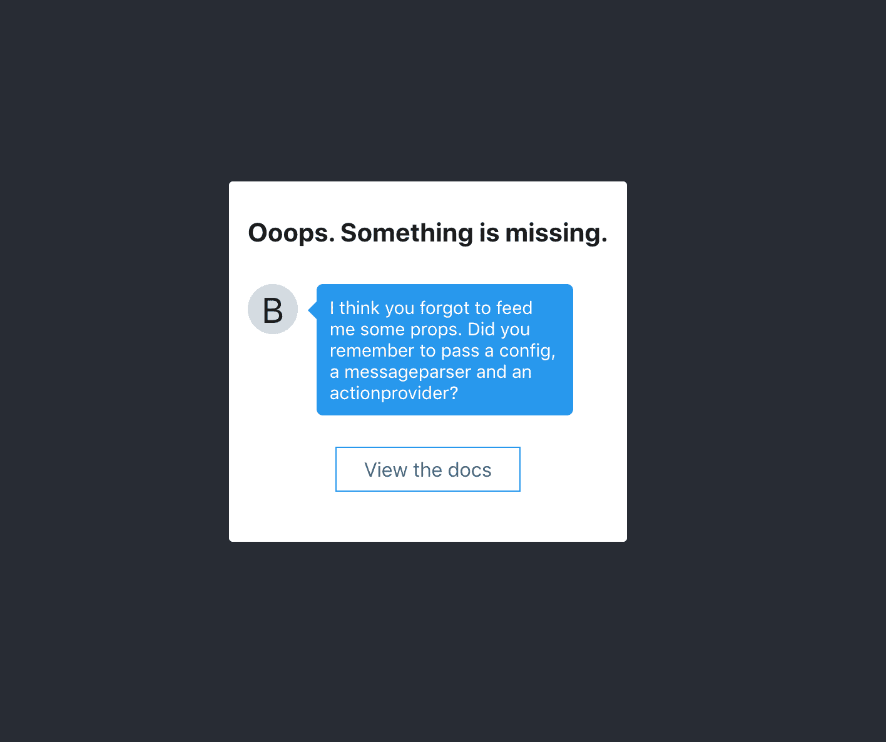
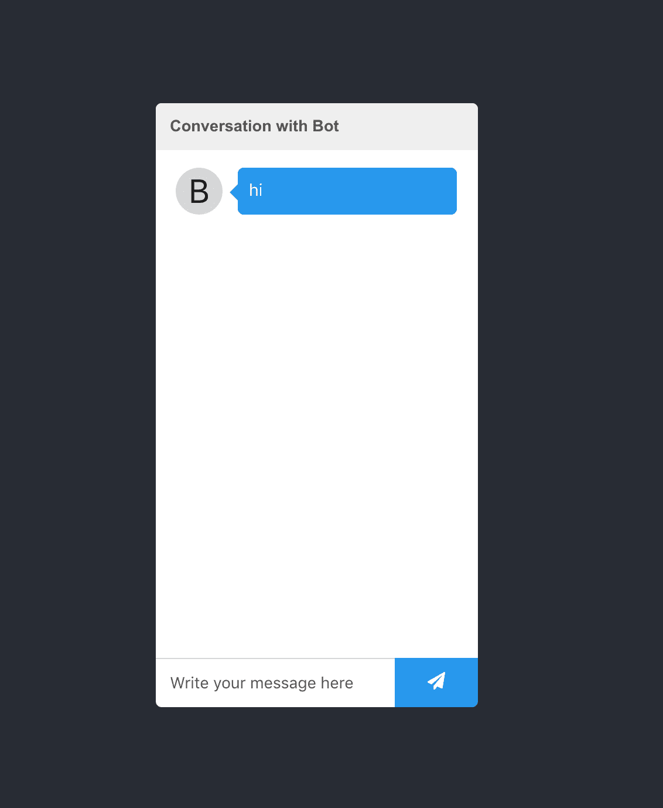
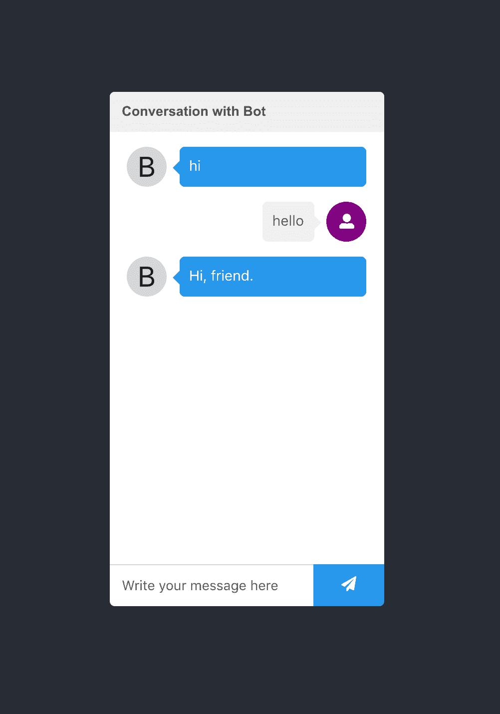
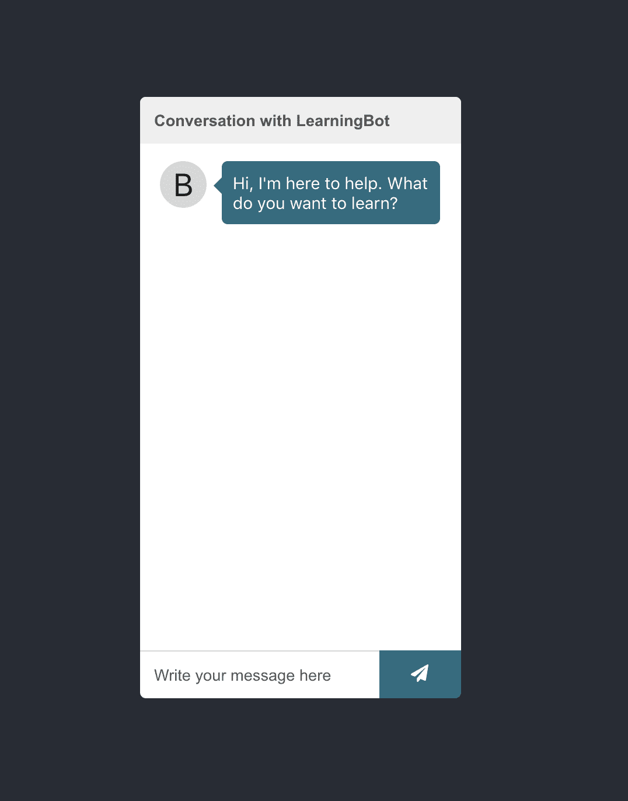
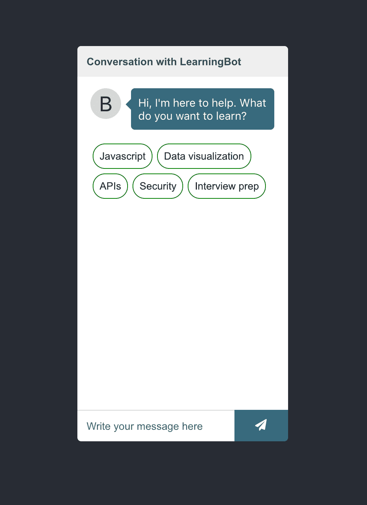
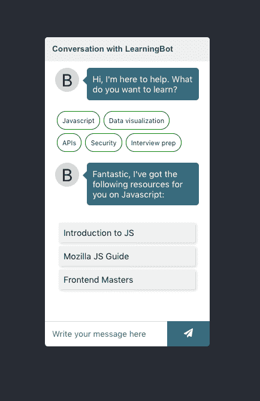

# 如何用 React 构建聊天机器人

> 原文：<https://www.freecodecamp.org/news/how-to-build-a-chatbot-with-react/>

我的哲学很简单。要变得擅长某事，你需要做很多。

做一次是不够的。你需要一次又一次的重复。它永远不会结束。我用同样的哲学来擅长编程。

在这个过程中，我注意到的一件事是，制作有趣的、看起来不错的东西要有趣得多。你可以向你的朋友展示并引以为豪的东西。当你坐在你的键盘前时，一些让你兴奋开始的东西。

这就是为什么我造了一个聊天机器人。

它演变成了一个 [npm 包。](https://www.npmjs.com/package/react-chatbot-kit)

所以我们一起造一个吧。如果你想独自接受这个挑战，你可以直接进入[文档(实际上是一个聊天机器人)](https://fredrikoseberg.github.io/react-chatbot-kit-docs/)。或者，如果你是视觉学习者，[我在 YouTube 上创建了一个教程。](https://youtu.be/vTpk-PKZwTs)

否则，我们走吧。我将假设您已经安装了 Node，并且可以访问 npx 命令。如果没有，去这里拿吧。

## 初始设置

```
// Run these commands from your command line
npx create-react-app chatbot
cd chatbot
yarn add react-chatbot-kit
yarn start
```

这应该会安装 npm 包并打开位于 localhost:3000 的开发服务器。

接下来前往`App.js`并进行这些更改:

```
import Chatbot from 'react-chatbot-kit'

function App() {
  return (
    <div className="App">
      <header className="App-header">
        <Chatbot />
      </header>
    </div>
  );
}
```

干得好。我们快到了。现在，您应该在开发服务器中看到这一点:



聊天机器人需要三个道具才能工作。首先，它需要一个配置，该配置必须包含一个带有聊天机器人消息对象的`initialMessages`属性。

其次，它需要一个必须实现解析方法的`MessageParser`类。

第三，它需要一个`ActionProvider`类，该类将实现我们基于解析消息想要采取的动作。

稍后我们将对此进行更深入的探讨。现在，[到这里获取样板代码开始。](https://gist.github.com/FredrikOseberg/c1e8ec83ade6e89ca84882e33caf599c)

*   将`MessageParser`代码放在一个名为`MessageParser.js`的文件中
*   将`ActionProvider`代码放在一个名为`ActionProvider.js`的文件中
*   将配置代码放在一个名为`config.js`的文件中

完成后，返回到您的`App.js`文件并添加以下代码:

```
import React from 'react';
import Chatbot from 'react-chatbot-kit'
import './App.css';

import ActionProvider from './ActionProvider';
import MessageParser from './MessageParser';
import config from './config';

function App() {
  return (
    <div className="App">
      <header className="App-header">
        <Chatbot config={config} actionProvider={ActionProvider} 	    messageParser={MessageParser} />
      </header>
    </div>
  );
}
```

您现在应该在 localhost:3000 上看到这个:



太好了。现在，我们已经将聊天机器人渲染到屏幕上，我们可以在输入字段中进行书写，并提交它以向聊天发送消息。但是当我们尝试的时候，什么也没有发生。

## 了解聊天机器人的工作原理

在这里，我们需要稍作停留，看看`MessageParser`和`ActionProvider`如何交互以使我们的机器人采取行动。

当机器人初始化时，配置中的`initialMessages`属性被放入聊天机器人内部状态的一个名为`messages`的属性中，该属性用于向屏幕呈现消息。

此外，当我们在聊天字段中编写并按下提交按钮时，我们的`MessageParser`(我们将其作为道具传递给聊天机器人)正在调用它的`parse`方法。这就是为什么必须实现这个方法的原因。

让我们仔细看看`MessageParser`启动代码:

```
class MessageParser {
  constructor(actionProvider) {
    this.actionProvider = actionProvider;
  }

  parse(message) {
    ... parse logic
  }
}
```

如果我们仔细观察，这个方法是用一个`actionProvider`构造的。这是我们作为道具传递给聊天机器人的同一个`ActionProvider`类。这意味着我们控制两件事——如何解析消息，以及基于所述解析采取什么行动。

让我们使用这些信息来创建一个简单的聊天机器人响应。首先像这样修改`MessageParser`:

```
class MessageParser {
  constructor(actionProvider) {
    this.actionProvider = actionProvider;
  }

  parse(message) {
    const lowerCaseMessage = message.toLowerCase()

    if (lowerCaseMessage.includes("hello")) {
      this.actionProvider.greet()
    }
  }
}

export default MessageParser
```

现在我们的`MessageParser`正在接收用户消息，检查它是否包含单词“hello”。如果是的话，它调用`actionProvider`上的`greet`方法。

现在，这会崩溃，因为我们还没有实现`greet`方法。让我们接下来做那件事。前往`ActionProvider.js`:

```
class ActionProvider {
  constructor(createChatBotMessage, setStateFunc) {
    this.createChatBotMessage = createChatBotMessage;
    this.setState = setStateFunc;
  }

  greet() {
    const greetingMessage = this.createChatBotMessage("Hi, friend.")
    this.updateChatbotState(greetingMessage)
  }

  updateChatbotState(message) {

// NOTE: This function is set in the constructor, and is passed in      // from the top level Chatbot component. The setState function here     // actually manipulates the top level state of the Chatbot, so it's     // important that we make sure that we preserve the previous state.

   this.setState(prevState => ({
    	...prevState, messages: [...prevState.messages, message]
    }))
  }
}

export default ActionProvider
```

很好。现在，如果我们在聊天字段中键入“hello ”,我们会得到以下内容:



太棒了。既然我们可以控制消息的解析和动作响应，让我们试着做一些更复杂的事情。让我们试着做一个机器人，为你提供你所要求的编程语言的学习资源。

## 创造一个学习机器人

首先，让我们回到我们的`config.js`文件，做一些细微的修改:

```
import { createChatBotMessage } from 'react-chatbot-kit';

const config = { 
  botName: "LearningBot",
  initialMessages: [createChatBotMessage("Hi, I'm here to help. What do you want to learn?")],
  customStyles: {
    botMessageBox: {
      backgroundColor: "#376B7E",
    },
    chatButton: {
      backgroundColor: "#376B7E",
    },
  },
}

export default config
```

好了，我们已经在这里添加了一些属性，并更改了我们的初始消息。最值得注意的是，我们给机器人起了一个名字，并改变了组件`messagebox`和`chatbutton`的颜色。



好吧。现在我们开始精彩的部分了。

我们不仅可以解析消息并用聊天机器人消息响应用户，我们还可以定义我们希望用消息呈现的自定义 React 组件。这些组件可以是我们想要的任何东西，它们只是普通的老式 React 组件。

让我们通过创建一个选项组件来尝试一下，该组件将引导用户找到可能的选项。

首先，我们定义学习选项组件:

```
// in src/components/LearningOptions/LearningOptions.jsx

import React from "react";

import "./LearningOptions.css";

const LearningOptions = (props) => {
  const options = [
    { text: "Javascript", handler: () => {}, id: 1 },
    { text: "Data visualization", handler: () => {}, id: 2 },
    { text: "APIs", handler: () => {}, id: 3 },
    { text: "Security", handler: () => {}, id: 4 },
    { text: "Interview prep", handler: () => {}, id: 5 },
  ];

  const optionsMarkup = options.map((option) => (
    <button
      className="learning-option-button"
      key={option.id}
      onClick={option.handler}
    >
      {option.text}
    </button>
  ));

  return <div className="learning-options-container">{optionsMarkup}</div>;
};

export default LearningOptions;

// in src/components/LearningOptions/LearningOptions.css

.learning-options-container {
  display: flex;
  align-items: flex-start;
  flex-wrap: wrap;
}

.learning-option-button {
  padding: 0.5rem;
  border-radius: 25px;
  background: transparent;
  border: 1px solid green;
  margin: 3px;
}
```

现在我们有了组件，我们需要用我们的聊天机器人注册它。转到`config.js`并添加以下内容:

```
import React from "react";
import { createChatBotMessage } from "react-chatbot-kit";

import LearningOptions from "./components/LearningOptions/LearningOptions";

const config = {
initialMessages: [
    createChatBotMessage("Hi, I'm here to help. What do you want to 		learn?", {
      widget: "learningOptions",
    }),
  ],
 ...,
 widgets: [
     {
     	widgetName: "learningOptions",
    	widgetFunc: (props) => <LearningOptions {...props} />,
     },
 ],
}
```

### 了解小部件

好吧。让我们休息一下，探索一下我们做了什么。

1.  我们创建了`LearningOptions`组件。
2.  我们在配置中的`widgets`下注册了组件。
3.  我们给了`createChatbotMessage`函数一个选项对象，指定用哪个小部件来呈现这个消息。

结果是:



太棒了，但是为什么我们需要在配置中将我们的组件注册为一个小部件函数呢？

通过给它一个函数，我们可以控制何时执行调用。这让我们有空间用聊天机器人内部的重要属性来装饰小部件。

我们定义的小部件将从聊天机器人接收许多属性(其中一些可以由配置属性控制):

1.  `actionProvider` -我们给小部件一个`actionProvider`，以便在需要时执行动作。
2.  `setState` -我们将顶级聊天机器人`setState`功能赋予小部件，以防我们需要操纵状态。
3.  `scrollIntoView` -实用功能滚动到聊天窗口的底部，如果我们需要调整视图。
4.  `props` -如果我们在小部件配置中定义了任何属性，这些属性将被传递给属性名为`configProps`的小部件。
5.  `state` -如果我们在配置中定义了自定义状态，我们可以通过使用`mapStateToProps`属性将其映射到小部件

如果您还记得，我们在`LearningOptions`组件中定义了一些选项:

```
 const options = [
    { text: "Javascript", handler: () => {}, id: 1 },
    { text: "Data visualization", handler: () => {}, id: 2 },
    { text: "APIs", handler: () => {}, id: 3 },
    { text: "Security", handler: () => {}, id: 4 },
    { text: "Interview prep", handler: () => {}, id: 5 },
  ];
```

目前它们有一个空的处理程序。我们现在要做的是通过调用`actionProvider`来替换这个处理程序。

那么当我们执行这些函数时，我们希望发生什么呢？理想情况下，我们应该有某种聊天机器人消息，以及一个附带的小部件，显示每个主题的有用资源的链接列表。让我们看看如何实现它。

首先，我们需要创建链表组件:

```
// in src/components/LinkList/LinkList.jsx

import React from "react";

import "./LinkList.css";

const LinkList = (props) => {
  const linkMarkup = props.options.map((link) => (
    <li key={link.id} className="link-list-item">
      <a
        href={link.url}
        target="_blank"
        rel="noopener noreferrer"
        className="link-list-item-url"
      >
        {link.text}
      </a>
    </li>
  ));

  return <ul className="link-list">{linkMarkup}</ul>;
};

export default LinkList;

// in src/components/LinkList/LinkList.css

.link-list {
  padding: 0;
}

.link-list-item {
  text-align: left;
  font-size: 0.9rem;
}

.link-list-item-url {
  text-decoration: none;
  margin: 6px;
  display: block;
  color: #1d1d1d;
  background-color: #f1f1f1;
  padding: 8px;
  border-radius: 3px;
  box-shadow: 2px 2px 4px rgba(150, 149, 149, 0.4);
}
```

太好了。我们现在有了一个可以显示链接列表的组件。现在我们需要在配置的小部件部分注册它:

```
import React from "react";
import { createChatBotMessage } from "react-chatbot-kit";

import LearningOptions from "./components/LearningOptions/LearningOptions";
import LinkList from "./components/LinkList/LinkList";

const config = {
  ...
  widgets: [
    {
      widgetName: "learningOptions",
      widgetFunc: (props) => <LearningOptions {...props} />,
    },
    {
      widgetName: "javascriptLinks",
      widgetFunc: (props) => <LinkList {...props} />,
    },
  ],
};

export default config; 
```

到目前为止还不错，但是我们想动态地将 props 传递给这个组件，这样我们也可以在其他选项中重用它。这意味着我们需要向配置中的小部件对象添加另一个属性:

```
import React from "react";
import { createChatBotMessage } from "react-chatbot-kit";

import LearningOptions from "./components/LearningOptions/LearningOptions";
import LinkList from "./components/LinkList/LinkList";

const config = {
  ...,
  widgets: [
    ...,
    {
      widgetName: "javascriptLinks",
      widgetFunc: (props) => <LinkList {...props} />,
      props: {
        options: [
          {
            text: "Introduction to JS",
            url:
              "https://www.freecodecamp.org/learn/javascript-algorithms-and-data-structures/basic-javascript/",
            id: 1,
          },
          {
            text: "Mozilla JS Guide",
            url:
              "https://developer.mozilla.org/en-US/docs/Web/JavaScript/Guide",
            id: 2,
          },
          {
            text: "Frontend Masters",
            url: "https://frontendmasters.com",
            id: 3,
          },
        ],
      },
    },
  ],
};

export default config; 
```

现在这些道具将作为道具传递给`LinkList`组件。

现在我们需要做两件事。

1.  我们需要给`actionProvider`添加一个方法

```
class ActionProvider {
  constructor(createChatBotMessage, setStateFunc) {
    this.createChatBotMessage = createChatBotMessage;
    this.setState = setStateFunc;
  }

  handleJavascriptList = () => {
    const message = this.createChatBotMessage(
      "Fantastic, I've got the following resources for you on Javascript:",
      {
        widget: "javascriptLinks",
      }
    );

    this.updateChatbotState(message);
  };

  updateChatbotState(message) {
    // NOTICE: This function is set in the constructor, and is passed in from the top level Chatbot component. The setState function here actually manipulates the top level state of the Chatbot, so it's important that we make sure that we preserve the previous state.

    this.setState((prevState) => ({
      ...prevState,
      messages: [...prevState.messages, message],
    }));
  }
}

export default ActionProvider; 
```

2.我们需要将这个方法作为处理程序添加到`LearningOptions`组件中:

```
import React from "react";

import "./LearningOptions.css";

const LearningOptions = (props) => {
  const options = [
    {
      text: "Javascript",
      handler: props.actionProvider.handleJavascriptList,
      id: 1,
    },
    { text: "Data visualization", handler: () => {}, id: 2 },
    { text: "APIs", handler: () => {}, id: 3 },
    { text: "Security", handler: () => {}, id: 4 },
    { text: "Interview prep", handler: () => {}, id: 5 },
  ];

  const optionsMarkup = options.map((option) => (
    <button
      className="learning-option-button"
      key={option.id}
      onClick={option.handler}
    >
      {option.text}
    </button>
  ));

  return <div className="learning-options-container">{optionsMarkup}</div>;
};

export default LearningOptions; 
```

好吧！这是相当多的信息。但是，如果我们现在尝试单击聊天机器人中的 JavaScript 选项，我们会得到以下结果:



完美。但是我们不想就此止步，这毕竟是一个聊天机器人。我们还希望能够对希望使用输入字段的用户做出响应。所以我们需要在`MessageParser`中制定一个新的规则。

让我们更新我们的`MessageParser.js`文件，如下所示:

```
class MessageParser {
  constructor(actionProvider) {
    this.actionProvider = actionProvider;
  }

  parse(message) {
    const lowerCaseMessage = message.toLowerCase();

    if (lowerCaseMessage.includes("hello")) {
      this.actionProvider.greet();
    }

    if (lowerCaseMessage.includes("javascript")) {
      this.actionProvider.handleJavascriptList();
    }
  }
}

export default MessageParser; 
```

现在尝试在输入字段中键入“javascript”并发送消息。您应该会从聊天机器人那里得到相同的列表。

所以你有它。我们已经设置了一个聊天机器人，它可以呈现一个可能选项的列表，并对用户输入做出响应。

目前，我们只设置了当有人点击或输入 JavaScript 时进行处理的 bot，但是您可以自己尝试扩展其他选项。这里有一个到存储库的链接。

所有的代码都在 GitHub 上，所以你可以自由地阅读 react-chatbot-kit 代码或文档。

## 结论

做东西很有趣，也是扩展你技能的好方法。接下来你可以把它带到任何地方。

也许你可以制作一个聊天机器人，根据一些简单的问题(利用应用程序中的路由)在网上商店中找到理想的产品，或者你可以为你的公司制作一个聊天机器人，处理最常见的客户查询。

随意扩展，提出新的想法，并测试它们。如果你看到可以改进的地方，发送一个拉取请求。

如果你想提高开发人员的水平，我鼓励你继续开发。这确实是唯一的前进道路。如果你喜欢这篇文章，并且想知道我什么时候发布更多内容，你可以在 Twitter 上关注我。