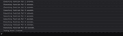
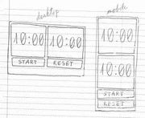
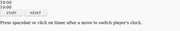
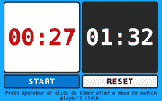
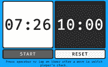

# 如何用 JavaScript 和 setInterval 构建象棋时钟

> 原文：<https://www.freecodecamp.org/news/how-to-build-a-chess-clock-with-javascript-and-setinterval/>

象棋比赛有时会持续很长时间。我曾经听说过一个故事，两个著名的国际象棋大师进行了八个多小时的国际象棋比赛，观众都在等着他们走下一步棋。

过了一会儿，一个玩家对另一个玩家说:“你不打算移动吗？”他的对手回应道:“我以为轮到你了。”

## 介绍

国际象棋时钟用于将国际象棋比赛限制在一定的时间内。象棋钟可以给象棋比赛增添许多刺激。许多人在比赛中使用这些时钟，只是为了好玩。

用象棋时钟，目标是在你的计时器用完之前将死你的对手。第一个没有将死对手而耗尽时间的人输掉游戏。

我将向你展示如何使用 JavaScript 和 [setInterval](https://developer.mozilla.org/en-US/docs/Learn/JavaScript/Asynchronous/Timeouts_and_intervals) 方法创建一个基本的象棋时钟。`setInterval`通过以毫秒为单位指定时间，允许您重复执行定时事件。可以将`setInterval`设置为一个 ID，并通过调用`setInterval` ID 上的`clearInterval`来停止。

下面是 setInterval 工作原理的一个简单示例:

```
let count = 1;

// Assign a timed event to variable timerId.

const timerId = setInterval(() => {

    console.log(`Executing function for ${count} seconds.`);

    // Increment the count variable by one.
    count++;

    if (count === 11) {

        // Stop event by calling clearInterval on timerId.
        clearInterval(timerId);
        console.log(`Timing event cleared.`);

    }

}, 1000); // Execute event every second (1000 milliseconds = 1 second). 
```

SetInterval example



output

这是应用程序在桌面和移动设备上的蓝图。



本项目的编程要求是:

*   我们需要两个倒计时钟。
*   我们需要一个开始按钮和一个重置按钮。
*   我们需要一种在倒计时时切换时钟的方法。

## 让我们建立项目

创建目录`css`、`js`和`audio`来保持项目的有序。

```
$ mkdir css js audio 
```

创建文件`index.html`、`style.css`和`script.js`。

```
$ touch index.html css/style.css js/script.js 
```

将这段代码添加到`index.html`文件中。

```
<!DOCTYPE html>
<html lang="en">

  <head>

    <meta charset="utf-8">
    <meta name="viewport" content="width=device-width, height=device-height, initial-scale=1.0">
    <link rel="stylesheet" href="css/style.css">
    <title>chess clock</title>

  </head>

  <body>

    <main>

      <div class="player">

        <div class="player__tile player-1">
          <div class="player__digits">
            <span id="min1">10</span>:<span id="sec1">00</span>
          </div>
        </div>

        <div class="player__tile player-2">
          <div class="player__digits">
            <span id="min2">10</span>:<span id="sec2">00</span>
          </div>
        </div>

      </div>

      <div class="timer__buttons">
        <button class="timer__start-bttn bttn" type="button">START</button>
        <button class="timer__reset-bttn bttn" type="button">RESET</button>
      </div>

    </main>

    <footer>

      <p>Press spacebar or click on timer after a move to switch player's clock.</p>

    </footer>

    <script src="js/script.js"></script>

  </body>

</html> 
```

这是我们没有任何 CSS 的东西。



## 添加一些 CSS 样式的项目

将这个 CSS 代码添加到`style.css`文件中，首先对项目 mobile 进行样式化。

```
* {
    margin: 0;
    padding: 0;
    box-sizing: border-box;
}

html,
body {
    width: 100%;
    height: 100%;
    background-color: #14A7FF;
}

body {
    font-size: 100%;
    font-family: monospace, monospace;
}

main {
    width: 100%;
    padding: 0 10px;
    box-sizing: border-box;
}

.player {
    margin: 1em 0 5px 0;
    display: flex;
    flex-direction: column;
}

.player__tile {
    width: 100%;
    height: 300px;
    display: flex;
    margin: 0 auto;
    color: #000000;
    max-width: 400px;
    border-radius: 8px;
    align-items: center;
    justify-content: center;
    background-color: #FFFFFF;
    box-shadow: inset 3px 3px 0 #000, 
                inset -3px 3px 0 black, 
                inset -3px -3px 0 black, 
                inset 3px -3px 0 black;
}

.player-2 {
    color: #FFFFFF;
    margin-top: 5px;
    background-color: #2D2C2C;
}

.player__digits {
    font-size: 6rem;
    font-weight: bold;
}

.timer__buttons {
    margin-bottom: 1em;
}

.timer__start-bttn, 
.timer__reset-bttn {
    width: 100%;
    display: block;
    color: #020202;
    min-height: 50px;
    max-width: 400px;
    font-size: 1.5rem;
    font-weight: bold;
    border-radius: 8px;
    letter-spacing: 2px;
    margin: 0 auto 5px auto;
    border: 4px solid #000000;
}

.timer__start-bttn {
    color: #FFFFFF;
    background-color: #0071D5;
}

.timer__start-bttn:hover {
    color: #000000;
    background-color: #FFFFFF;
}

.timer__reset-bttn:hover {
    color: #FFFFFF;
    background-color: #0071D5;
}

footer p {
    text-align: center;
}

/* Media queries for mobile first develoment. */
/* Media queries for landscape mode on mobile devices */
@media only screen and (orientation: landscape) and (max-width: 850px) {
    .player {
        max-width: 610px;
        flex-direction: row;
        margin: 5px auto 0 auto;
    }
    .player__tile {
        max-width: 300px;
        max-height: 250px;
        margin: 0 3px 5px 3px;
    }
    .player__digits {
        font-size: 5rem;
    }
    .timer__buttons {
        display: flex;
        margin: 0 auto;
        max-width: 610px;
    }
    .timer__start-bttn, 
    .timer__reset-bttn {
        display: block;
        max-width: 300px;
        margin: 0 3px 5px 3px;
    }
}

/* Media queries for portrait mode */
@media only screen and (orientation: portrait) and (min-width: 400px) {
    .player__tile {
        height: 400px;
    }
    .player__digits {
        font-size: 6rem;
    }
}

/* Screen wider than 850px wide will use these settings. */
@media only screen and (min-width: 850px) {
    .player {
        margin: 1em auto 10px auto;
        max-width: 810px;
        flex-direction: row;
    }
    .player__tile {
        height: 400px;
    }
    .player-2 {
        margin-top: 0;
    }
    .player__digits {
        font-size: 7rem;
    }
    .timer__buttons {
        display: flex;
        margin: 0 auto;
        max-width: 810px;
    }
    .timer__start-bttn, 
    .timer__reset-bttn {
        padding: .7em;
        font-size: 1.8rem;
    }
} 
```

有了 CSS 的加入，项目看起来更好了。


## 添加 JavaScript 代码使时钟运行

我将首先添加我们需要使项目工作的功能。

编辑`script.js`文件:

```
$ vim js/script.js 
```

并添加以下 ES6 箭头函数:

```
 // Add a leading zero to numbers less than 10.
const padZero = () => {
    // code
}

// Warn the player if time drops below thirty seconds.
const timeWarning = () => {
    // code
}

// Create a class for the timer.
class Timer {
    // code
}

// Swap player's timer after a move (player1 = 1, player2 = 2).
const swapPlayer = () => {
    // code
}

// Start timer countdown to zero.
const startTimer = () => {
    // code
    let timerId = setInterval(function() {
        // code
    }, 1000)
}
```

现在我们可以用代码填充 JavaScript 函数来使时钟工作。

我们从给项目添加一些变量开始。如果变量`playing`为
真，则时钟运行。

`currentPlayer`为玩家一存储值 1，为玩家二存储值 2。我们可以添加声音[(来自 freesound.org)](https://freesound.org/)，当时钟从一个玩家切换到另一个玩家时发出警报。

`padZero`函数将为小于 10 的数字添加一个前导零。

像这样编辑`script.js`文件:

```
$ vim js/script.js
```

```
let playing = false;
let currentPlayer = 1;
const panel = document.querySelector('.player');
const buttons = document.querySelectorAll('.bttn');
// Sound effects for project.
const timesUp = new Audio('audio/460133__eschwabe3__robot-affirmative.wav');
const click = new Audio('audio/561660__mattruthsound.wav');

// Add a leading zero to numbers less than 10.

const padZero = (number) => {
    if (number < 10) {
        return '0' + number;
    }
    return number;
} 
```

通过将数字更改为红色，给每位玩家一个时间即将结束的视觉通知。

```
// Warn player if time drops below one minute and thirty seconds.

const timeWarning = (player, min, sec) => {
    // Change the numbers to red below 0 minutes and 30 seconds
    if (min < 1 && sec <= 30) {
        if (player === 1) {
            document.querySelector('.player-1 .player__digits').style.color = '#CC0000';
        } else {
            document.querySelector('.player-2 .player__digits').style.color = '#CC0000';
        }
    }
}
```



我们将创建一个类来为每个玩家设置计时器。

```
// Create a class for the timer.

class Timer {
    constructor(player, minutes) {
        this.player = player;
        this.minutes = minutes;
    }
    getMinutes(timeId) {
        return document.getElementById(timeId).textContent;
    }
}

// Create an instance of the timer for each player.

let p1time = new Timer('min1', document.getElementById('min1').textContent);
let p2time = new Timer('min2', document.getElementById('min2').textContent); 
```

`swapPlayer`函数使用三元运算符在玩家 1 和玩家 2 之间切换计时器。

如果`playing`变量为假，则时钟不运行，功能退出。

```
// Swap player's timer after a move (player1 = 1, player2 = 2).

const swapPlayer = () => {
    if (!playing) return;
    // Toggle the current player.
    currentPlayer = currentPlayer === 1 ? 2 : 1;
    // Play the click sound.
    click.play();
} 
```

startTimer 功能使用`setInterval`对每个定时器进行倒计时。

将`playing`变量设置为 true 以使时钟运行。

if 语句检查哪个玩家是当前玩家，然后开始为该玩家倒计时。

如果秒数达到 60，则从分钟数中减去一个数字。HTML 元素随时间每秒更新一次。一旦秒和分钟归零，就会调用`clearInterval()`来停止计时器。

```
// Start timer countdown to zero.

const startTimer = () => {
    playing = true;
    let p1sec = 60;
    let p2sec = 60;

    let timerId = setInterval(function() {
        // Player 1.
        if (currentPlayer === 1) {
            if (playing) {
                buttons[0].disabled = true;
                p1time.minutes = parseInt(p1time.getMinutes('min1'), 10);
                if (p1sec === 60) {
                    p1time.minutes = p1time.minutes - 1;
                }
                p1sec = p1sec - 1;
                document.getElementById('sec1').textContent = padZero(p1sec);
                document.getElementById('min1').textContent = padZero(p1time.minutes);
                if (p1sec === 0) {
                    // If minutes and seconds are zero stop timer with the clearInterval method.
                    if (p1sec === 0 && p1time.minutes === 0) {
                        // Play a sound effect.
                        timesUp.play();
                        // Stop timer.
                        clearInterval(timerId);
                        playing = false;
                    }
                    p1sec = 60;
                }
            }
        } else {
            // Player 2.
            if (playing) {
                p2time.minutes = parseInt(p2time.getMinutes('min2'), 10);
                if (p2sec === 60) {
                    p2time.minutes = p2time.minutes - 1;
                }
                p2sec = p2sec - 1;
                document.getElementById('sec2').textContent = padZero(p2sec);
                document.getElementById('min2').textContent = padZero(p2time.minutes);
                if (p2sec === 0) {
                    // If minutes and seconds are zero stop timer with the clearInterval method.
                    if (p2sec === 0 && p2time.minutes === 0) {
                        // Play a sound effect.
                        timesUp.play();
                        // Stop timer.
                        clearInterval(timerId);
                        playing = false;
                    }
                    p2sec = 60;
                }
            }
        }
    }, 1000);
} 
```

为了让计时器运行，我将在 HTML 按钮中添加一个事件监听器。事件监听器还将监听`.player` div 上的点击声，或者是否有人按下空格键在计时器之间切换。

```
// Listen for a mouse click or tap on the screen to toggle between timers.

timerPanel.addEventListener('click', swapPlayer);

// Loop through the start and reset buttons.

for (let i = 0; i < buttons.length; i++) {
    buttons[i].addEventListener('click', () => {
        if (buttons[i].textContent === 'START') {
            // Turn the button a gray color to signify a disabled button.
            buttons[i].style.color = '#EEEEEE';
            buttons[i].style.backgroundColor = '#606060';
            startTimer();
        } else {
            // Reset everything by reloading the page.
            location.reload(true);
        }
    });
}

// Listen for the press of the spacebar on Windows, Linux, and Mac.

document.addEventListener('keypress', event => {
    if (event.keyCode === 32 || event.which === 32) {
        swapPlayer();
    }
});
```

### 以下是最终结果:



你可以在这里看到它[的实况，你也可以在这里](https://chessclock.cf)查看 [GitHub 资源库。](https://github.com/brandon-wallace/chess_clock2)

## 结论

这是创建基本象棋时钟的一种方式。如果你是一个象棋爱好者，这可能是一个有趣的项目，你可以使用。

这个项目展示了使用 setInterval 方法的好方法，如何使用事件侦听器，以及移动优先开发。您可以在项目中添加其他功能，例如设置时间、暂停计时器、不同的计时器模式等。

关注我的 [Github](https://github.com/brandon-wallace) | [开发到](https://dev.to/brandonwallace)