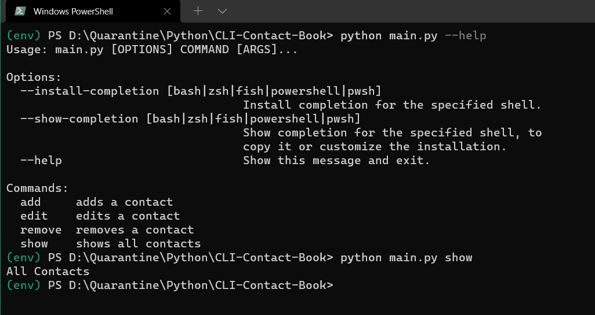

# 如何使用 Rich、Typer 和 TinyDB 在 Python 中构建通讯录应用程序

> 原文：<https://www.freecodecamp.org/news/how-to-build-a-contact-book-application-in-python-using-rich-typer-and-tinydb/>

在本 Python 教程中，我们将学习如何构建一个终端应用程序(CLI app)来管理我们的通讯录。

我们将使用 Typer 构建 CLI 应用程序，Rich 用于彩色终端输出，TinyDB 用于数据库。

# **准备好你的工具**

我们将在这个项目中使用一些外部库。下面我们就来详细了解一下，并一一安装。

但是在我们安装它们之前，让我们创建一个虚拟环境并激活它。

我们将使用`virtualenv`创建一个虚拟环境。Python 现在附带了一个预安装的`virtualenv`库。因此，要创建虚拟环境，您可以使用下面的命令:

```
$ python -m venv env
```

上面的命令将创建一个名为`env`的虚拟环境。现在，我们需要使用以下命令激活环境:

```
$ . env/Scripts/activate
```

要验证环境是否已被激活，您可以在终端中看到`(env)`。现在，我们可以安装库了。

1.  [**Rich**](https://rich.readthedocs.io/en/latest/) : Rich 是一个 Python 库，用于向终端写入 *rich* 文本(带有颜色和样式)，并显示高级内容，如表格、markdown 和语法高亮代码。
    要安装 Rich，请使用命令:

    ```
    $ pip install Rich 
    ```

2.  [**Typer**](https://typer.tiangolo.com/) : Typer 是一个构建 CLI 应用的库。
    要安装 Typer，使用命令:

    ```
    $ pip install Typer 
    ```

3.  [**TinyDB**](https://tinydb.readthedocs.io/) : TinyDB 是一个纯 Python 编写的面向文档的数据库，没有外部依赖性。
    要安装 TinyDB，使用命令:

    ```
    $ pip install TinyDB
    ```

# **通讯录功能**

我们的通讯录应用程序将是一个基于终端的应用程序。类似于 Todo 应用程序，我们可以对其执行以下操作:

1.  **添加(或创建)**:您可以在通讯录中添加新的联系人。
2.  **显示(或阅读)**:可以看到通讯录中保存的所有联系人。
3.  **编辑(或更新)**:可以编辑通讯录中保存的联系人。
4.  **移除(或删除)**:您可以删除通讯录中保存的联系人。

# **如何创建联系人模型**

首先，我们将为联系人创建一个定制类或模型。想想联系人应该有的所有字段。

我能想到这些字段——姓名和联系电话。如果您能想到更多，您可以将它们添加到您的模型中。我们将暂时继续这两个话题。

创建一个名为`contact_book`的目录。在其中，创建一个名为`model.py`的 Python 文件。然后在文件中添加以下内容:

```
import datetime

class Contact:
    def __init__ (self, name, contact_number, position=None, date_created=None, date_updated=None):
        self.name = name
        self.contact_number = contact_number
        self.position = position
        self.date_created = date_created if date_created is not None else datetime.datetime.now().isoformat()
        self.date_updated = date_updated if date_updated is not None else datetime.datetime.now().isoformat()

    def __repr__ (self) -> str:
        return f"({self.name}, {self.contact_number}, {self.position}, {self.date_created}, {self.date_updated})" 
```

我们创建了一个名为 Contact 的类，它带有两个强制参数，`name`和`contact_number`。

除了这两个，还需要三个可选参数:`position`、`date_created`、**、`date_updated`、**。如果没有传递这三个可选参数，它们分别默认为当前索引和当前时间。

此外，我们已经定义了以更易读的方式返回对象的`__repr__`方法。

# **如何使用 TinyDB 创建数据库**

现在，让我们设置 TinyDB 并创建一个数据库。如果你是 TinyDB 的新手，一定要看看这个教程。

在`contact_book`目录中，创建一个`__init__.py`文件，并在其中添加以下内容:

```
from tinydb import TinyDB, Query

db = TinyDB('contact-book.json')
db.default_table_name = 'contact-book'
ContactQuery = Query() 
```

我们已经创建了一个 *TinyDB* 类的实例，并将文件名传递给它。这将创建一个 JSON 文件 **`contact-book.json`** ，我们的数据将存储在这里。为了从这个数据库中检索数据，我们需要一个来自 **`tinydb`** 库的*查询*类的实例。

现在，让我们定义我们将用来与数据库交互的不同函数。在`contact_book`目录中，创建一个`database.py`文件，并在其中添加以下内容:

```
from typing import List
import datetime
from contact_book.model import Contact
from contact_book import db, ContactQuery

def create(contact: Contact) -> None:
    contact.position = len(db)+1
    new_contact = {
        'name': contact.name,
        'contact_number': contact.contact_number,
        'position': contact.position,
        'date_created': contact.date_created,
        'date_updated': contact.date_updated
    }
    db.insert(new_contact)

def read() -> List[Contact]:
    results = db.all()
    contacts = []
    for result in results:
        new_contact = Contact(result['name'], result['contact_number'], result['position'],
                              result['date_created'], result['date_updated'])
        contacts.append(new_contact)
    return contacts

def update(position: int, name: str, contact_number: str) -> None:
    if name is not None and contact_number is not None:
        db.update({'name': name, 'contact_number': contact_number},
                  ContactQuery.position == position)
    elif name is not None:
        db.update({'name': name}, ContactQuery.position == position)

    elif contact_number is not None:
        db.update({'contact_number': contact_number},
                  ContactQuery.position == position)

def delete(position) -> None:
    count = len(db)
    db.remove(ContactQuery.position == position)
    for pos in range(position+1, count):
        change_position(pos, pos-1)

def change_position(old_position: int, new_position: int) -> None:
    db.update({'position': new_position},
              ContactQuery.position == old_position) 
```

我们为上面提到的每个操作定义了四个不同的函数——`create()`、`read()`、`update()`和`delete()`。我们使用`position`属性来标识特定的联系人。`change_position()`功能负责在删除联系人时保持联系人的位置。

# **如何使用 Typer 创建 CLI**

现在让我们使用 Typer 创建我们的 CLI。在`contact_book`目录外，创建一个 **`main.py`** 文件，并添加以下内容。

```
import typer

app = typer.Typer()

@app.command(short_help='adds a contact')
def add(name: str, contact_number: str):
    typer.echo(f"Adding {name}, {contact_number}")

@app.command(short_help='shows all contacts')
def show():
    typer.echo(f"All Contacts")

@app.command(short_help='edits a contact')
def edit(position: int, name: str = None, contact_number: str = None):
    typer.echo(f"Editing {position}")

@app.command(short_help='removes a contact')
def remove(position: int):
    typer.echo(f"Removing {position}")

if __name__ == " __main__":
    app() 
```

首先，我们从`typer`库中创建一个 *Typer* 类的实例。然后，我们为上面讨论的四个操作创建四个独立的函数。我们使用`@app.command()`装饰器用一个命令绑定每个函数。我们还添加了 **`short_help`** 来帮助用户使用命令。

要添加联系人，我们需要`name`和`contact_number`参数。要显示联系人，我们什么都不需要。要编辑联系人，我们肯定需要 **`position`** ，而`name`和`contact_number`参数是可选的。要移除触点，我们只需要`position`。

目前，我们没有在方法内部做任何操作。我们只是使用`typer`类中的`echo`方法进行打印。在 main 方法中，我们只需要调用`app()`对象。

如果您运行该应用程序，您将得到类似的输出:



# **如何使用 Rich 设计终端风格**

我们希望用不同的颜色在一个漂亮的表格布局中显示联系人。里奇可以帮我们。如果你刚接触到 Rich，请务必查看本教程。

现在让我们修改`main.py`中的 **`show()`** 功能，因为它负责在终端上打印联系人。

```
from rich.console import Console
from rich.table import Table

console = Console()

@app.command(short_help='shows all contacts')
def show():
    contacts = [("Ashutosh Krishna", "+91 1234554321"),
                ("Bobby Kumar", "+91 9876556789")]

    console.print("[bold magenta]Contact Book[/bold magenta]", "📕")

    if len(contacts) == 0:
        console.print("[bold red]No contacts to show[/bold red]")
    else:
        table = Table(show_header=True, header_style="bold blue", show_lines=True)
        table.add_column("#", style="dim", width=3, justify="center")
        table.add_column("Name", min_width=20, justify="center")
        table.add_column("Contact Number", min_width=12, justify="center")

        for idx, contact in enumerate(contacts, start=1):
            table.add_row(str(idx), f'[cyan]{contact[0]}[/cyan]', f'[green]{contact[1]}[/green]')
        console.print(table) 
```

我们首先创建了一个*控制台*类的实例。在`show()`方法中，我们现在有一个虚拟的联系人列表。使用`console`对象，我们用粗体洋红色打印标题。

接下来，我们创建一个表并添加列。现在，我们遍历联系人，并将它们作为不同颜色的单独行放入表中。最后，我们打印表格。

# **如何用 Typer 命令连接数据库操作**

现在让我们做最后一步，即将数据库操作与命令连接起来。也就是说，当我们运行一个命令时，它应该与数据库进行适当的交互。

```
import typer
from rich.console import Console
from rich.table import Table
from contact_book.model import Contact
from contact_book.database import create, read, update, delete

app = typer.Typer()
console = Console()

@app.command(short_help='adds a contact')
def add(name: str, contact_number: str):
    typer.echo(f"Adding {name}, {contact_number}")
    contact = Contact(name, contact_number)
    create(contact)
    show()

@app.command(short_help='shows all contacts')
def show():
    contacts = read()

    console.print("[bold magenta]Contact Book[/bold magenta]", "📕")

    if len(contacts) == 0:
        console.print("[bold red]No contacts to show[/bold red]")
    else:
        table = Table(show_header=True,
                      header_style="bold blue", show_lines=True)
        table.add_column("#", style="dim", width=3, justify="center")
        table.add_column("Name", min_width=20, justify="center")
        table.add_column("Contact Number", min_width=12, justify="center")

        for idx, contact in enumerate(contacts, start=1):
            table.add_row(str(
                idx), f'[cyan]{contact.name}[/cyan]', f'[green]{contact.contact_number}[/green]')
        console.print(table)

@app.command(short_help='edits a contact')
def edit(position: int, name: str = None, contact_number: str = None):
    typer.echo(f"Editing {position}")
    update(position, name, contact_number)
    show()

@app.command(short_help='removes a contact')
def remove(position: int):
    typer.echo(f"Removing {position}")
    delete(position)
    show()

if __name__ == " __main__":
    app() 
```

在上面的代码中，我们使用了之前创建的`create()`、`read()`、`update()`和`delete()`。

# **应用程序演示**

这是最终应用的演示:

[https://www.youtube.com/embed/KnRG7cMbccE?feature=oembed](https://www.youtube.com/embed/KnRG7cMbccE?feature=oembed)

# **结论**

恭喜你！现在你应该有一个功能齐全的 CLI 应用程序。继续尝试不同的命令来修改您自己的通讯录。

该代码也可在 [GitHub](https://github.com/ashutoshkrris/Contact-Book) 上获得。

[GitHub - ashutoshkrris/Contact-Book: In this Python tutorial, we’ll learn how to build a terminal application (CLI app) to manage our contact book. We’ll use Typer for building the CLI app, Rich for a colorized terminal output, and TinyDB for the database.In this Python tutorial, we&#39;ll learn how to build a terminal application (CLI app) to manage our contact book. We&#39;ll use Typer for building the CLI app, Rich for a colorized terminal output...ashutoshkrrisGitHub](https://github.com/ashutoshkrris/Contact-Book)

如果你喜欢这个教程，请分享给你的朋友，并订阅我的时事通讯。

[Ashutosh Writes - RevueYou’ll find articles related to Python, Django, Flask and other trending technologies.Ashutosh KrishnaRevue](https://www.getrevue.co/profile/ashutoshkrris)