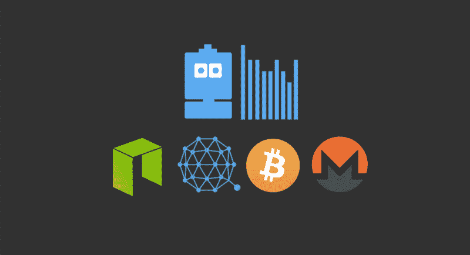
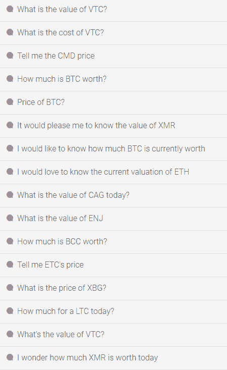
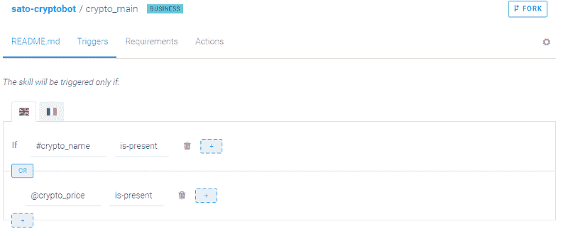
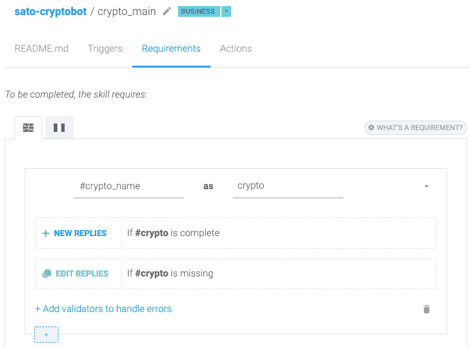
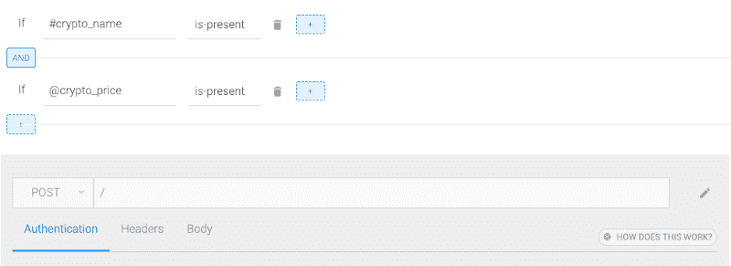
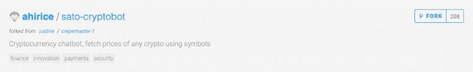
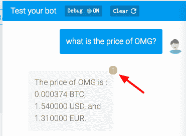
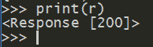
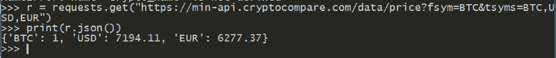

# 如何用 Python 构建一个 cryptobot 并连接到脸书信使

> 原文：<https://www.freecodecamp.org/news/how-to-build-a-cryptobot-in-python-and-connect-it-to-facebook-messenger-4bba14107fcc/>

保罗·皮纳德

#### 认识一下加密机器人 Sato，他能够从外部 API 获取任何加密货币的价格！



聊天机器人有着不可思议的潜力。然而，要使机器人高效，它们必须与现有的服务和流程集成并交换数据。

从外部 API 获取数据的能力允许比简单的 Q & A 逻辑更复杂的用例。此外，这种能力结合 NLP 提供了更多的机会。

例如，Sato——我们今天要构建的加密机器人——能够识别所有加密货币，甚至是那些尚未上市的货币。我不需要为他做任何事情，他就能处理甚至几年后出现的加密查询，因为佐藤内心深处明白什么是加密货币符号(在被灌输了数以千计的加密货币符号之后)。

### 我们今天在建造什么？

在本教程结束时，我们将有一个机器人能够根据用户输入的内容从第三方 API 获取数据，并用获取的值回复用户。这是我们今天要构建的最终结果:一个能够获取任何加密货币价格的加密机器人，又名聊天机器人。


What you’ll have by the end of this tutorial

赶时间？以下是您构建自己的网站所需的全部内容:

*   用 [SAP 对话式人工智能](https://medium.freecodecamp.org/how-to-build-your-first-chatbot-with-the-sap-conversational-ai-9a1a2bd44e3c)创建的聊天机器人。在这里报名[，完全免费！](https://cai.tools.sap/signup?utm_source=freecodecamp&utm_medium=blog&utm_campaign=LG2019)
*   [GitHub 回购](https://github.com/Ahirice/sato/)

需要看到才相信？那是明智的！点击[这里](https://www.messenger.com/login.php?next=https%3A%2F%2Fwww.messenger.com%2Ft%2Fsatofolio)！

或者，如果你更想了解它是如何制作的，请继续阅读教程。

### 1.建立你的聊天机器人的基础:选择你的道路

今天的目标是构建能够识别任何加密货币定价问题的机器人。发挥你的想象力，**它可以是任何涉及第三方 API**上可用数据的东西。

在我们进入教程之前，让我给你一些关于 Sato 如何工作的信息。

#### 见见佐藤，密码机器人

Sato 是一个机器人，用来回答关于加密货币的基本问题并获取它们的价格。以下是他的能力概述:

1.  获取加密货币价格(我们今天将构建的内容):Sato 识别加密货币符号(“ETH”、“BTC”)，并在 [cryptocompare API](https://www.cryptocompare.com/api/) 上获取它们的价格，最终将 BTC 和美元值返回给用户。
2.  回答用户关于钱包的问题——线上钱包、兑换钱包、冷钱包、硬件钱包。
3.  解决有关私钥和公钥以及加密货币安全性的问题。
4.  简要介绍主要的加密货币，目前有 BTC、ETH、BCH 和 LTC。

#### 佐藤内部

今天，我们将关注获取加密价格的技巧，因为它需要一个外部 API 调用。本质上，Sato 需要三样东西才能检测到关于加密价格的问题并返回所要求的值:

首先，他需要一个意图 [(@crypto_price](https://cai.tools.sap/ahirice/sato-cryptobot/train/crypto_price?utm_source=blog&utm_campaign=sato) )，其中提到了不同的表达方式和加密货币，这样他就可以高效地识别这些问题。以下是用于定义@crypto_price 意图的一些表达式:



A sample of the expressions used to define the @crypto_price intent

其次，为了让 Sato 能够识别所有的加密货币，他需要你能找到的最大的列表。我在 CoinMarketCap 上找到了 1200+，这已经足够好了。我创建了一个加密名称的公报来提高对它的理解。

第三，我们需要建立一个当@ask_price 意图或#crypto_name 实体被识别时触发的技能:



Sato — Cryptobot / crypto_main skill triggers

您还可以添加#crypto_name 作为要求，以确保调用的 API 不会在没有参数的情况下被触发:



Sato — Cryptobot / crypto_main skill requirements

这项技能还必须调用我们将在下面设置的 webhook:



Sato — Cryptobot / crypto_main skill actions

不要忘记在 webhook 触发器后添加一个内存重置，它需要在每次回答后清理内存。

最后，我们将在 Messenger 中直接测试我们的机器人，因此您需要创建一个页面和一个应用程序并连接它。一切都记录在`CONNECT`标签和[入门教程](https://cai.tools.sap/blog/build-your-first-bot-with-sap-conversational-ai/)中。

为了保持简洁**，本教程将不详细介绍机器人**的创建。我们将从一个功能正常的机器人开始。

去那里见我，你有两个选择:

*   选项 A:通过遵循入门教程并在 SAP conversatile AI 上创建一个[帐户，构建自己的机器人(不一定要是 cryptobot)。](https://cai.tools.sap/signup?utm_source=freecodecamp&utm_medium=blog&utm_campaign=LG2019)
*   选项 B: [叉佐藤](https://cai.tools.sap/ahirice/sato-cryptobot/train/intents)从这里出发。这就是为什么 SAP conversatile AI 是一个协作聊天机器人平台。它的工作方式非常像 GitHub！



Forking a bot on SAP Conversational AI

### 2.基本服务器代码和要求

因为我们希望与我们的机器人进行交互，所以我们需要一个服务器来接收 SAP conversatile AI 生成的 NLP 的结果，并将我们的响应发送回去。

在 [bot builder](https://cai.tools.sap/bot-builder) 上，转到`CODE`选项卡，找到启动 API 所需的基本代码示例。我们在节点中给出例子。JS，PHP，Python 和 Ruby。本教程将只有 Python。

以下是 Python 的基本代码:

```
from flask import Flask, request, jsonify import json app = Flask(__name__) port = '5000' @app.route('/', methods=['POST']) def index():   print(json.loads(request.get_data()))   return jsonify(     status=200,     replies=[{       'type': 'text',       'content': 'Roger that',     }]  )  @app.route('/errors', methods=['POST']) def errors():   print(json.loads(request.get_data()))   return jsonify(status=200)  app.run(port=port)
```

花些时间看看代码，以便更好地理解我们将要做的事情:在本教程中，我们将构建这些代码。你现在可以把它保存在你最喜欢的文本编辑器中。

#### 要求

如您所见，服务器脚本使用 [Flask 作为 web 框架](http://flask.pocoo.org/)，因此我们需要它。

对于 API 调用，我们也将使用[请求](http://docs.python-requests.org/en/master/)。让我们继续安装这两个:

```
pip install Flaskpip install requests
```

### 3.测试服务器:NGROK

现在我们有了基本服务器，让我们运行并测试它。它将允许我们在这个过程中更多的增量，因此调试(如果有的话)被简化。

为了将我们的本地服务器暴露给互联网，我们需要 ngrok。

*注意:如果你像我一样使用 Windows，有很棒的软件包管理器， [Chocolatey](https://chocolatey.org/) ，它的工作方式很像 UNIX 上的 apt-get。有了它，你就可以用一行代码`choco install ngrok_portable`安装 ngrok。此外，Chocolatey 将 ngrok 添加到您的路径中，允许您只需通过键入`ngrok`从任何终端启动 ngrok。*

现在是启动我们的服务器并测试它的时候了，这意味着:

1.  在你的 bot 中设置一个 webhook 触发器(详见步骤 1)
2.  运行您的 python 脚本
3.  使用 ngrok: `ngrok http 5000`将端口 5000 暴露给互联网
4.  从 ngrok 复制转发 URL，并将其作为 SAP conversatile AI 上的 bot 基础 URL

### 4.准备外部 API 调用

差不多是时候开始建设了！让我们来看看我们将用来获取任何加密货币价格的 api 调用。有几个 API 可用于此目的，所以我选择了一个: [Cryptocompare API](https://www.cryptocompare.com/api/) 。

Cryptocompare API 提供了数千种可能性，但是为了简单起见，我们将坚持使用基本的。**我们想要 BTC 的匹配密码的价格，美元和欧元**。

下面是电话会议的结构(这里是 ETH):

`https://min-api.cryptocompare.com/data/price?fsym="ETH"&tsyms=BTC,USD,EUR"`

您有两个参数:

*   加密货币的符号，这是我们需要获取在#crypto_name 实体中识别的 crypto_name 的地方。
*   `tsyms`:返回价格的货币。我们在这里选择了 BTC、美元和欧元。

因此，在我们的例子中，我们只需要调整`fsym`参数以适应识别的加密货币，而调用的其余部分保持不变。

### 5.修改 API 调用以包括用户输入中识别的符号

现在我们知道了如何获取价格，我们需要回到我们的服务器代码并升级它，这样它就可以:

*   知道 SAP 对话式 AI 识别的#crypto_name。
*   使用#crypto_name 对 Cryptocompare 进行 API 调用。

我们开始吧！

#### 步骤 1:在 SAP 对话式 AI JSON 中查找我们的数据

让我们来看看 SAP Conversational AI 在一个用户输入上返回的数据。为此，您可以点击所有页面右下角的`CHAT WITH YOUR BOT`按钮。然后，您可以通过单击橙色信息圈在对话和 JSON 视图之间切换，如下所示:



Check the JSON of the conversation.

在这里，我们的符号可以用`['conversation']['memory']['crypto']['raw']`来访问。既然值和 raw 在这种情况下完全相同，你可以使用其中任何一个。

在我们的服务器上，网站测试面板返回的 JSON 被**封装到`data`字典**(见服务器代码)。所以我们需要一个额外的步骤来在我们的服务器上检索它:

```
# FETCH THE CRYPTO NAMEcrypto_name = data['conversation']['memory']['crypto']['value']
```

#### 步骤 2:使用识别的实体进行 API 调用

```
import requestsr = requests.get("https://min-api.cryptocompare.com/data/price?fsym="+crypto_name+"&tsyms=BTC,USD,EUR")
```

继续打印吧，但你可能会失望:



的确，如果您想获得调用返回的值，您需要打印`r.json()`。好消息是 Cryptocompare 返回的 JSON 非常简单:



Cryptocompare JSON

太好了！现在，我们只需要完成最后一步:将价格返回给用户。

#### 步骤 3:将获取的数据返回给用户

现在，是时候完成我们的基本服务器代码升级了:我们需要编辑返回的回复，以包含我们新获取的数据。为此，我们将编辑服务器代码返回的消息:

```
return jsonify(     status=200,     replies=[{       'type': 'text',       'content': 'Roger that',     }],
```

我们将只编辑回复，以包含我们获取的价格:

```
replies=[{      'type': 'text',      'content': 'The price of %s is %f BTC and %f USD' % (crypto_name, r.json()['BTC'], r.json()['USD'])    }],
```

由于回复是一个字符串，我们必须使用模(%)操作符将我们的价格包含在字符串中。这里，第一个%s 告诉 Python 寻找一个字符串，而后面的两个%f 表示浮点。

我们的升级服务器现在已经完成，下面是完整的代码:

```
from flask import Flask, request, jsonifyimport jsonimport requestsapp = Flask(__name__)port = '5000'@app.route('/', methods=['POST'])def index():  data = json.loads(request.get_data())  # FETCH THE CRYPTO NAME  crypto_name = data['conversation']['memory']['crypto']['raw']  # FETCH BTC/USD/EUR PRICES  r = requests.get("https://min-api.cryptocompare.com/data/price?fsym="+crypto_name+"&tsyms=BTC,USD,EUR")  return jsonify(    status=200,    replies=[{      'type': 'text',      'content': 'The price of %s is %f BTC and %f USD' % (crypto_name, r.json()['BTC'], r.json()['USD'])    }]  )@app.route('/errors', methods=['POST'])def errors():  print(json.loads(request.get_data()))  return jsonify(status=200)app.run(port=port)
```

随着我们新服务器的完成，我们现在有了拼图的所有部分。让我们来组装它:

1.  运行您的 python 脚本，
2.  用 ngrok: `ngrok http 5000`将端口 5000 暴露给互联网，
3.  从 ngrok 复制转发 URL，并将其作为 SAP conversatile AI 上的 bot 基础 URL

现在你已经有了构建一个能够获取第三方数据的机器人的基础，接下来会是什么呢？你给我们看看！

PS:由于本教程使用 ngrok，您的计算机必须打开，并且 ngrok 必须运行，您的 bot 才能运行。

最初发表于 [SAP 对话式人工智能博客](https://cai.tools.sap/blog/python-cryptobot/)。