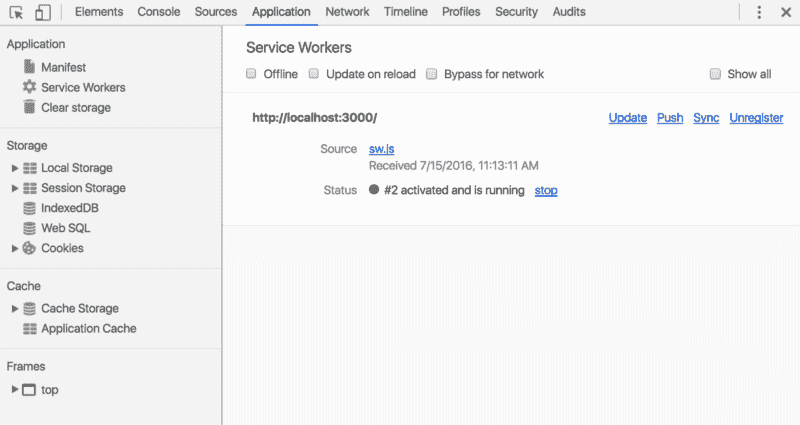
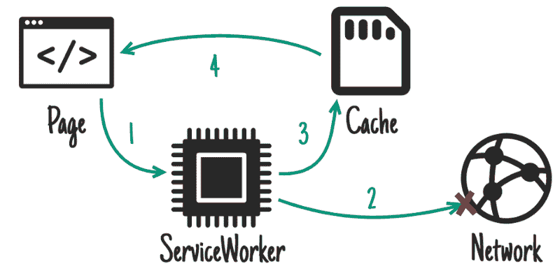
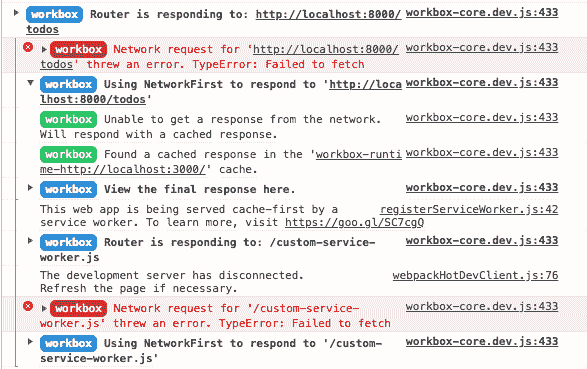
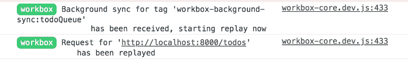

# 如何在 create-react-app 中用 Workbox 构建自定义 PWA

> 原文：<https://www.freecodecamp.org/news/how-to-build-a-custom-pwa-with-workbox-in-create-react-app-be580686cf73/>

**注:**这是 React 内部关于 PWAs 系列帖子的第三篇。快速入门，请看之前的两篇帖子[这里](https://medium.freecodecamp.org/how-to-build-a-pwa-with-create-react-app-and-custom-service-workers-376bd1fdc6d3)和[这里](https://medium.freecodecamp.org/how-to-customize-service-workers-with-create-react-app-4424dda6210c)。

在这篇后续文章中，我将带你了解如何使用 [Google 的工具箱库](https://developers.google.com/web/tools/workbox/)构建一个定制的渐进式 Web 应用程序(PWA ),而不用退出 create-react-app (CRA)外壳。

Workbox 是一个库集合，它使构建离线功能变得更加容易。Workbox 也被认为是`sw-precache`库的继承者，CRA 用它来生成默认软件。

有一些关于 CRA 从`sw-precache`迁移到 Workbox 的讨论(详情请参考[本期](https://github.com/facebook/create-react-app/issues/2340))。不幸的是，似乎还没有什么结果。

### **目标**

1.  配置 CRA 构建以使用 [react-app-rewired](https://github.com/timarney/react-app-rewired) 。(react-app-rewired 是一个库，用于配置默认的 CRA 构建，无需弹出)
2.  使用 react-app-rewired 定制构建以使用 Workbox 生成服务工作人员
3.  构建一个非常简单的 todo 应用程序
4.  使用 Workbox 实现 todo 应用程序的离线功能。
    我们将瞄准的离线功能:
    a)缓存检索到的资产，以便可以离线提供这些资产
    b)允许离线发布数据

### **将工具箱引入 CRA**

首先，使用以下命令创建一个新的 CRA 存储库:

```
npx create-react-app react-app-rewire-workbox
```

这将建立一个具有相关名称的新文件夹。设置好该文件夹后，将 cd 放入该文件夹，并在 public 文件夹中创建一个 service worker 文件。我叫我的`custom-service-worker.js`。

一旦你完成了这一步，继续并取消对在`registerServiceWorker.js`中`NODE_ENV`被设置为生产的检查

最后，在`custom-service-worker.js`文件中，粘贴以下代码:

这段代码片段是我直接从[工具箱网站](https://developers.google.com/web/tools/workbox/guides/get-started)上获取的。您使用`importScripts`行将名为`workbox`的全局变量注入到您的文件中。您正在导入的脚本是通过 CDN 提供的。然后进行一个简单的检查，看看脚本是否正确加载了变量。

因此，我们现在有了在开发环境中为我们工作的工具箱。接下来，让我们想想如何将`react-app-rewired`应用到 CRA。

### **在 CRA 实施 react-app-rewired**

使用以下命令将`react-app-rewired`包添加到您的项目文件夹中:

```
npm install --save-dev react-app-rewired
```

现在，如果你阅读[文档](https://github.com/timarney/react-app-rewired)，他们提到你需要在你项目的根目录下建立一个`config-overrides.js`文件。让我们先弄清楚这是干什么的。

我会建立一个基本文件，并向您解释它的含义。如果你想看的话，在[文档](https://github.com/timarney/react-app-rewired#extended-configuration-options)中有非常详细的解释。

您可以用三个键从这个文件中导出一个对象:webpack、jest、devServer。相应的功能允许您配置 webpack 生产服务器配置、jest 配置以及 webpack 开发服务器配置。

如果您查看`config-overrides.js`文件中的`devServer`键，您会注意到我们正在记录`configFunction.toString()`，而不仅仅是`configFunction`。这是因为如果你尝试后者，Node 会将`[Function]`打印到控制台。

打开您的`package.json`文件，用`react-app-rewired start`替换 start 的脚本命令。

### **构建待办事宜应用**

到目前为止，我们已经成功地将 Workbox 引入到我们的开发环境中，并将`react-app-rewired`引入到我们的 CRA shell 中。让我们保持现状，构建一个示例 todo 应用程序，并让它在开发环境中运行。

todo 应用程序将需要几个移动的部分，这样我们就可以真正利用服务人员。

这将涉及到:

1.  一个基本的 UI 层(我将完全忽略它的样式。)
2.  我们可以从以下位置请求数据

关于设置这个，我不会讲太多细节，因为它非常简单。在本文的最后，我会提供一个 git repo 的链接，其中包含了这个应用程序的一个工作版本，所以你可以看看。

这是我写的 Todo 组件。

该组件向我设置的一个`json-server`发出一个获取请求，并得到一个由 todos 数组组成的响应。该组件然后呈现这些待办事项。就像我说的，非常简单。

要设置`json-server`,运行以下命令:

```
npm install --save json-server
```

创建一个名为`db.json`的文件，其结构如下

最后，在终端中运行以下命令:

```
json-server --watch db.json --port 8000
```

这会在端口 8000 上运行一个本地服务器，并观察`db.json`文件的任何变化。如果有任何变化，服务器会自动重启。这是一个模仿服务器测试你的应用程序的非常简单的方法。

最后，更新您的`App.js`文件以反映您的新 Todo 组件，并从该文件中删除默认的 JSX。

启动应用程序(在一个隐姓埋名的窗口内)，看看它现在是什么样子。您应该会看到一个待办事项列表，下面有一个输入框和一个提交按钮。就像我说的，非常简单的用户界面。

一旦你做好了所有的准备，让我们想出一个方法让这些东西在离线状态下使用 Workbox。

**注意:**在开发环境中测试服务人员功能时，务必确保每次都在一个新的匿名窗口中进行。它使测试和调试变得不那么令人头疼，因为您的数据不是跨会话存储的。

### **用工具箱实现缓存**

现在，如果你继续打开 Chrome 工具栏，你应该会在应用程序标签下看到如下内容。



Google Chrome Developer Toolbar

选中“离线”复选框，然后尝试重新载入您的网页。它可能会失败，并显示一个错误，说明没有检测到网络连接。如果您查看网络选项卡，您会看到一堆失败的网络请求。

最明显会失败的是对我们的`json-server`获取待办事项列表的请求。让我们首先修理那一个。打开`custom-service-worker.js`文件并添加以下代码

```
workbox.routing.registerRoute(  'http://localhost:8000/todos',  workbox.strategies.networkFirst())
```

这是为向`http://localhost:8000/todos`端点发出的任何请求设置一个缓存策略`networkFirst`。下图清楚地解释了`networkFirst`战略的含义。您总是首先检查网络，只有在网络出现故障的情况下，您才会去缓存获取资源。当查询可能提供新数据的 API 时，这是一个典型的策略。



Network First strategy

现在，应用程序仍然无法加载，因为我们仍然缺少两个重要的部分。也就是说，我们仍然没有缓存

1.  由我们的本地开发服务器提供服务的 JS 包。
2.  `index.html`文件

将以下代码添加到`custom-service-worker.js`

```
workbox.routing.registerRoute(
```

```
 /\.(?:js|css|html)$/,
```

```
 workbox.strategies.networkFirst(),
```

```
)
```

```
workbox.routing.registerRoute(
```

```
 ‘http://localhost:3000',
```

```
 workbox.strategies.networkFirst()
```

```
)
```

如果您注意到，上面代码片段中的第一条路线是一个`RegEx`对象。这是用同一策略瞄准多条路线的一种简单明了的方法。但是，如果您的目标是不遵循相同来源策略的资源，请确保指定整个路径。

这当然不是理想的做事方式。理想情况下，我们希望像 JS 包、样式表和 HTML 文件这样的静态资产作为 Webpack 构建过程的一部分被预先缓存。我们会谈到这一点，但重要的是要明白没有黑魔法在进行。这只是简单的缓存。

继续，再次打开页面，打开你的控制台。您应该会看到 Workbox 关于路由的一堆日志。进入脱机模式，并刷新页面。您应该看到所有东西都正常加载了。如果您在控制台中打开 workbox 日志，您将看到 Workbox 打印出网络请求是失败还是成功，以及 workbox 对该失败的响应(请参见下面的屏幕截图):



Workbox log in Chrome Dev Tools Window

### **用工具箱实现数据的延迟过账**

好了，接下来:在没有网络连接的情况下，我们如何将数据发送回服务器？

首先，让我们建立一个将数据发布回网上的方法，并确保它能正常工作。更新 Todo 组件中的`addTodo`函数，如下所示:

我们所做的只是向`setState`添加了一个回调处理程序，这样我们就可以在状态更新时得到通知。此时，我们已经向`json-server`发出 POST 请求，用新的 todo 更新`db.json`。

尝试提交一个新的 todo，打开`db.json`，你应该看到新的 todo 被添加到你的对象数组中。

现在，试着离线做同样的事情，你会得到一个网络错误，原因很明显。您可能会得到一个日志语句，上面写着:获取失败。

为了解决这个问题，我们将使用一个叫做 backgroundSync 的东西，你可以在这里的[阅读这个规范。它的工作方式应该是，每当你向服务器请求一个特定的资源时(在我们的例子中是 POST 请求)，如果没有检测到网络，Workbox 将把这个请求存储在 indexedDB 中，并在一段设定的时间内保持轮询请求。当检测到网络连接时，请求将被重播。如果在预定义的时间段内没有建立网络连接，则该请求被丢弃。](https://wicg.github.io/BackgroundSync/spec/)

backgroundSync API 在幕后使用了一种叫做 SyncManager 的东西。您可以在 MDN 文档[中阅读此处](https://developer.mozilla.org/en-US/docs/Web/API/SyncManager)。不幸的是，正如你所看到的，SyncManager 不在标准轨道上，Chrome 是唯一一个完全实现了规范的浏览器。这意味着 Chrome 是唯一能保证这种功能可靠运行的浏览器。

我们需要给`custom-service-worker.js`添加一些代码来让 backgroundSync 为我们工作。将以下代码添加到文件中:

我们正在使用 Workbox 提供的后台同步插件。向构造函数提供的第一个参数是存储失败请求时希望 Workbox 创建的队列的名称。第二个参数是一个 options 对象，我们在其中定义了尝试重放请求的最长时间。

最后，我们用 POST 方法注册一个新的路由，并设置我们想要用于缓存的策略。这与我们已经做的非常相似，除了定义请求的类型，并且为我们的策略定义了一个插件。

现在，尝试在没有任何网络连接的情况下运行提交 todo 的相同场景，并观察日志中发生了什么。您将得到一个类似下面截图的日志。


Workbox adds the failed request to a queue

您可以通过在 Chrome DevTools 窗口的 application 选项卡下查找 indexedDB 来查看已经添加的请求。打开 indexedDB 下拉菜单下列出的子目录，您应该看到请求已存储，等待重放。

关闭 DevTools 窗口中的离线选项，您应该会立即看到一个新的工具箱日志弹出窗口。它将如下所示:



Workbox log detailing that the failed request has been replayed and submitted

上图涉及到 Workbox 在收到同步请求时重放失败的请求，并确认您的请求已经成功。如果您现在查看`db.json`，您会注意到新的 todo 已经添加到文件中。

好了，我们走吧。我们现在有办法通过服务人员重放失败的请求。

我们接下来需要做的是集成一个 Webpack 插件，这样 Workbox 就可以在构建过程中缓存静态资产。这将消除在我们的服务工作者文件中显式缓存静态资产的需要。

### **预缓存静态资产**

这将是最后一步。在本节中，我们将对 CRA 的构建过程进行更改，以强制它使用 Workbox 而不是`sw-precache`来生成服务工作者文件。

首先，安装以下软件包:`workbox-webpack-plugin`和`path`。

打开`package.json`文件，编辑构建脚本，用`react-app-rewired`而不是`react-scripts`运行，就像我们对启动脚本所做的一样。

最后，打开`config-overrides.js`文件，编辑如下:

我们在这个文件中做了几件事。

首先，我们检查它是否是产品版本。如果是，我们创建一个 Workbox config 对象，并为它提供自定义 SW 的路径，以及我们想要的输出 SW 的路径。

我们还提供了一个名为`importWorkboxFrom`的选项，并将其设置为`disabled`。

这是一个指定我们不希望从任何地方导入 Workbox 的选项，因为我们在 SW 脚本中直接从 CDN 请求它。

最后，我们有一个函数叫做`removeSWPrecachePlugin`。所做的就是遍历 Webpack 配置中列出的插件，找到正确的插件，然后返回索引，这样我们就可以删除它了。

现在，继续运行应用程序的构建，并打开构建文件夹中生成的 SW 文件。在我的例子中，这个软件文件的名字是`custom-service-worker.js`

您将注意到在文件的顶部有一个新的`importScripts`调用，它似乎在请求一个预缓存清单文件。这个文件存储在 build 文件夹中，如果您打开它，您应该看到 Workbox 缓存的所有静态资产的列表。

### **结论**

因此，我们已经实现了以下目标:

1.  将 CRA 构建配置为使用 [react-app-rewired](https://github.com/timarney/react-app-rewired)
2.  使用 react-app-rewired 定制构建以使用 Workbox 生成服务工作者——我们使用`workbox-webpack-plugin.`完成了这一点。构建过程现在将自动缓存所有静态资产。
3.  构建一个非常简单的 todo 应用程序
4.  使用 Workbox 实现 todo 应用程序的离线功能。
    我们将瞄准的离线功能:
    a)缓存检索到的资产，以便可以离线提供这些资产
    b)允许离线发布数据

这里是到回购的[链接](https://github.com/redixhumayun/react-app-rewired-workbox)，回购有一个应用程序的工作版本。你可以克隆它，然后玩一玩。

> 在 twitter 上关注我[这里](https://twitter.com/zz_humayun)。在 GitHub 上关注我[这里](https://github.com/redixhumayun)