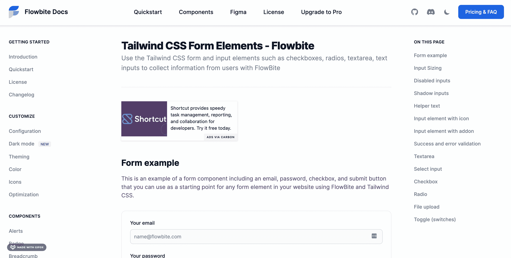
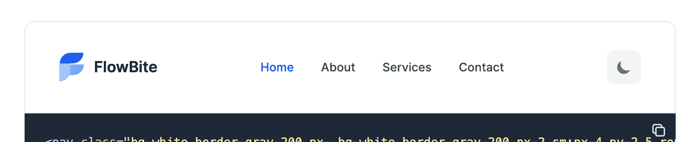
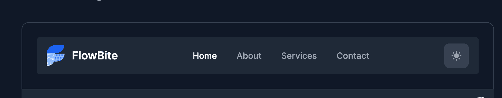
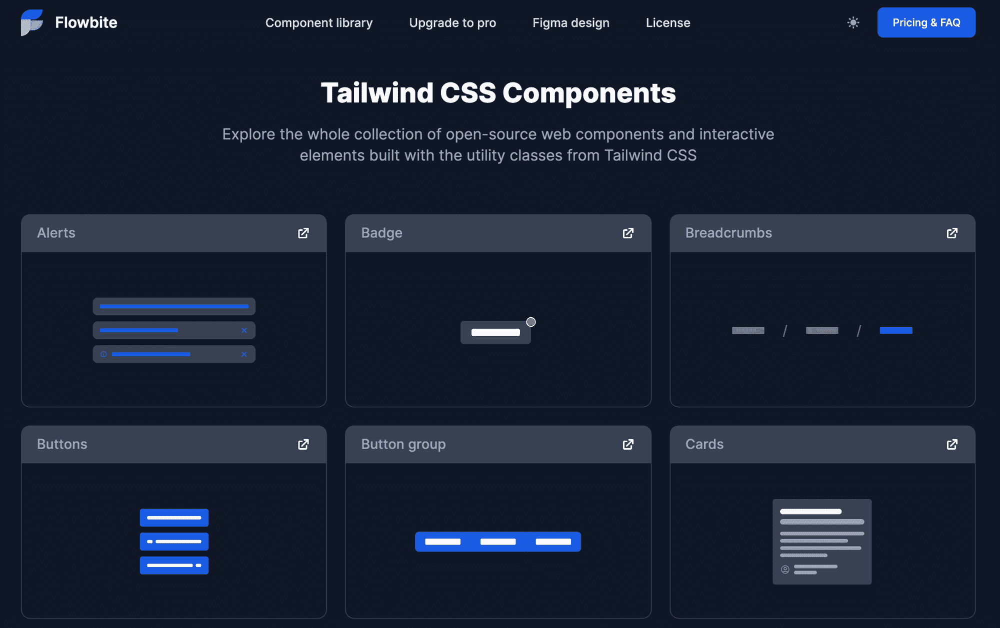
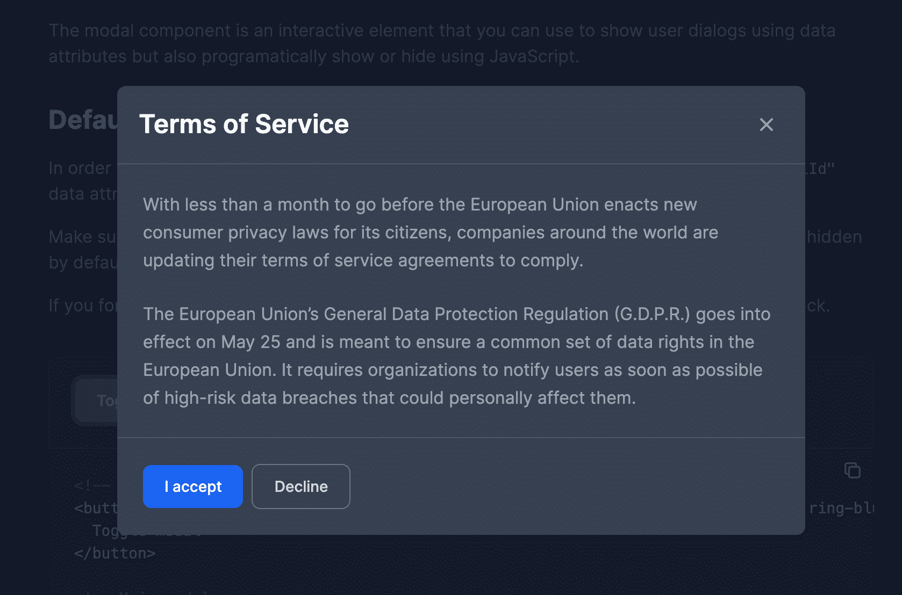

# 如何用 Tailwind CSS 和 Flowbite 构建一个黑暗模式切换器

> 原文：<https://www.freecodecamp.org/news/how-to-build-a-dark-mode-switcher-with-tailwind-css-and-flowbite/>

黑暗模式开始成为一种需求，而不是像以前那样只是一种美好的功能。它让用户可以选择一个适合他们的主题，无论他们是在白天还是晚上工作。

如果你还不知道，Tailwind CSS 是当今发展最快的 CSS 框架之一，因为它采用了实用优先的方法。

但是，即使 Tailwind 有一个非常好的黑暗模式集成指南，也没有清楚地解释如何构建一个开关元素来切换它。最重要的是，Tailwind 不包含任何支持黑暗模式的实际组件。

这就是 Flowbite 的用武之地。Flowbite 是一个库，它在 Tailwind CSS 之上提供组件和交互元素。并且从 1.2 版本开始，支持黑暗模式。

这就是我今天想向大家展示的——如何构建一个 [Tailwind CSS 黑暗模式开关](https://flowbite.com/docs/customize/dark-mode/)元素，以及如何使用 Flowbite 组件。



Flowbite - Tailwind CSS dark mode switcher

在开始学习本教程之前，请确保您已经建立了一个 Tailwind CSS 项目。你还应该[安装 Flowbite 作为插件](https://flowbite.com/docs/getting-started/quickstart/)，这样你就可以在黑暗模式下使用它的组件。

## 入门指南

如果你已经建立了一个 Tailwind CSS 项目，那么你可以跳到应该把 Flowbite 作为插件安装的部分。如果没有，那么先按照这里的说明安装 Tailwind CSS。

### 如何安装顺风 CSS

使用 Tailwind CSS 最流行的方式是将其作为 PostCSS 插件安装。为此，我们需要使用 NPM 安装三个不同的包:

```
npm install -D tailwindcss@latest postcss@latest autoprefixer@latest
```

之后，您应该创建一个名为`postcss.config.js`的文件，并在其中添加以下代码:

```
// postcss.config.js
module.exports = {
  plugins: {
    tailwindcss: {},
    autoprefixer: {},
  }
}
```

现在打开您的终端并执行以下命令:

```
npx tailwindcss init
```

这将创建一个空的`tailwind.config.js`文件，我们稍后将使用它来将 Flowbite 作为一个插件包含进来。

接下来，你应该创建一个新的 CSS 文件，你可以调用`styles.css`并在其中添加以下代码:

```
/* ./your-css-folder/styles.css */
@tailwind base;
@tailwind components;
@tailwind utilities;
```

使用 PostCSS 编译代码后，注入的指令(base、components、utilities)将作为样式出现在最终的 CSS 文件中。

最后，您需要做的就是通过运行以下命令使用 Tailwind CLI 编译 CSS:

```
npx tailwindcss -o tailwind.css
```

一个新创建的`tailwind.css`文件将在你的项目中可用，你应该将它包含在你的 HTML 模板中以访问这些样式。

现在，您的计算机上已经有了一个可以正常工作的 Tailwind CSS 配置。如果你想找到更多关于这个过程的信息，可以看看来自 Tailwind CSS 的[安装指南。](https://tailwindcss.com/docs/installation)

### 如何安装 Flowbite

我们需要安装 Flowbite 来访问组件的全部功能和黑暗版本支持。幸运的是，安装过程非常简单，因为它是一个顺风 CSS 插件。

让我们首先通过 NPM 安装它:

```
npm i flowbite
```

然后要求它作为`tailwind.config.js`文件中的一个插件:

```
module.exports = {

    plugins: [
        require('flowbite/plugin')
    ]

}
```

最后，确保在`<body>`标记结束之前的某个地方也包含了 JavaScript 文件:

```
<script src="../path/to/flowbite/dist/flowbite.bundle.js"></script>
```

### 如何在顺风 CSS 中启用黑暗模式

首先要明白的是，在顺风 CSS 中，黑暗模式是如何工作的。有两种方法可以设置它:

*   使用`media`选项
*   使用`class`选项

主要区别在于,`media`选项将只考虑你的浏览器的配色方案偏好，这实际上是由操作系统设置的。

`class`选项将只寻找应用于主`<html>`标签的`.dark`类。这是大多数网站使用的方法，因为通过这种方法，用户可以手动设置他们的偏好。

我们将坚持使用`class`选项，因为它让用户可以更好地控制他们的主题偏好。

让我们从将以下内容添加到`tailwind.config.js`文件开始:

```
module.exports = {
  darkMode: 'class',
  // ...
} 
```

Tailwind CSS dark mode configuration

这会将 Tailwind 配置为在黑暗模式下使用`class`选项。

接下来，向页面的`<head>`元素添加一个脚本。这将检查`localStorage`中先前的用户偏好，并使用浏览器的颜色方案作为备份:

```
<script>
  // It's best to inline this in `head` to avoid FOUC (flash of unstyled content) when changing pages or themes
  if (
    localStorage.getItem('color-theme') === 'dark' ||
    (!('color-theme' in localStorage) &&
      window.matchMedia('(prefers-color-scheme: dark)').matches)
  ) {
    document.documentElement.classList.add('dark');
  } else {
    document.documentElement.classList.remove('dark');
  }
</script>
```

Dark mode checker for `localStorage`

我们之所以将这个脚本添加到`<head>`标签中，而不是在结束的`<body>`标签之前，是因为我们希望在将页面设置为暗或亮模式时避免闪烁效果。

## 如何构建黑暗模式开关

既然已经配置了 Tailwind，我们需要构建用户将与之交互的元素，以便将主题从暗模式更改为亮模式。

为此，我们将坚持使用来自 [Flowbite 的组件库](https://flowbite.com/docs/components/buttons/)的基本`<button>`元素，并使用两个可互换的图标。

将以下 HTML 代码添加到您的页面中。我建议将元素添加到导航栏的右上角，因为当用户想要更改配色方案时，这是他们最自然的选择:

```
<button
  id="theme-toggle"
  type="button"
  class="text-gray-500 dark:text-gray-400 hover:bg-gray-100 dark:hover:bg-gray-700 focus:outline-none focus:ring-4 focus:ring-gray-200 dark:focus:ring-gray-700 rounded-lg text-sm p-2.5"
>
  <svg
    id="theme-toggle-dark-icon"
    class="w-5 h-5 hidden"
    fill="currentColor"
    viewBox="0 0 20 20"

  >
    <path
      d="M17.293 13.293A8 8 0 016.707 2.707a8.001 8.001 0 1010.586 10.586z"
    ></path>
  </svg>
  <svg
    id="theme-toggle-light-icon"
    class="w-5 h-5 hidden"
    fill="currentColor"
    viewBox="0 0 20 20"

  >
    <path
      d="M10 2a1 1 0 011 1v1a1 1 0 11-2 0V3a1 1 0 011-1zm4 8a4 4 0 11-8 0 4 4 0 018 0zm-.464 4.95l.707.707a1 1 0 001.414-1.414l-.707-.707a1 1 0 00-1.414 1.414zm2.12-10.607a1 1 0 010 1.414l-.706.707a1 1 0 11-1.414-1.414l.707-.707a1 1 0 011.414 0zM17 11a1 1 0 100-2h-1a1 1 0 100 2h1zm-7 4a1 1 0 011 1v1a1 1 0 11-2 0v-1a1 1 0 011-1zM5.05 6.464A1 1 0 106.465 5.05l-.708-.707a1 1 0 00-1.414 1.414l.707.707zm1.414 8.486l-.707.707a1 1 0 01-1.414-1.414l.707-.707a1 1 0 011.414 1.414zM4 11a1 1 0 100-2H3a1 1 0 000 2h1z"
      fill-rule="evenodd"
      clip-rule="evenodd"
    ></path>
  </svg>
</button> 
```

这两个 SVG 对象是图标，基于活动主题只显示其中一个。这三个对象有三个 id:

*   `#theme-toggle`为主黑暗模式开关元件
*   `#theme-toggle-dark-icon`当活动主题为“光”时，将显示月亮图标
*   `#theme-toggle-light-icon`当活动主题为黑色时，将显示太阳图标

## 如何用 JavaScript 处理黑暗模式切换

我们需要做的最后一件事是处理黑暗模式开关元素的点击事件，并更新元素内部的`localStorage`和图标。

在主 JavaScript 文件中添加以下代码:

```
var themeToggleDarkIcon = document.getElementById('theme-toggle-dark-icon');
var themeToggleLightIcon = document.getElementById('theme-toggle-light-icon');

// Change the icons inside the button based on previous settings
if (localStorage.getItem('color-theme') === 'dark' || (!('color-theme' in localStorage) && window.matchMedia('(prefers-color-scheme: dark)').matches)) {
    themeToggleLightIcon.classList.remove('hidden');
} else {
    themeToggleDarkIcon.classList.remove('hidden');
}

var themeToggleBtn = document.getElementById('theme-toggle');

themeToggleBtn.addEventListener('click', function() {

    // toggle icons inside button
    themeToggleDarkIcon.classList.toggle('hidden');
    themeToggleLightIcon.classList.toggle('hidden');

    // if set via local storage previously
    if (localStorage.getItem('color-theme')) {
        if (localStorage.getItem('color-theme') === 'light') {
            document.documentElement.classList.add('dark');
            localStorage.setItem('color-theme', 'dark');
        } else {
            document.documentElement.classList.remove('dark');
            localStorage.setItem('color-theme', 'light');
        }

    // if NOT set via local storage previously
    } else {
        if (document.documentElement.classList.contains('dark')) {
            document.documentElement.classList.remove('dark');
            localStorage.setItem('color-theme', 'light');
        } else {
            document.documentElement.classList.add('dark');
            localStorage.setItem('color-theme', 'dark');
        }
    }

});
```

代码的第一部分将基于先前的偏好改变正在显示的图标，或者通过`localStorage`或者通过浏览器的配色方案。

代码的第二部分处理 switch 元素本身的点击事件，并根据选择的主题设置`localStorage`。

### 如何使用导航栏中的黑暗模式开关

我们还没有完成，因为我们需要找到一个位置来放置黑暗模式切换器——除了导航栏，还有什么更好的地方来做这件事呢？

幸运的是，Flowbite 附带了许多很棒的[导航条组件](https://flowbite.com/docs/components/navbar/)，我们可以从中进行选择，并在其中放置黑暗模式开关按钮。

让我们以带有按钮的 navbar 示例为例，用我们自己的黑暗模式切换器对其进行更改:

```
<nav class="bg-white border-gray-200 px- bg-white border-gray-200 px-2 sm:px-4 py-2.5 rounded dark:bg-gray-800">
  <div class="container mx-auto flex flex-wrap items-center justify-between">
  <a href="#" class="flex">
    <svg class="h-10 mr-3" viewBox="0 0 52 72" fill="none" ><path d="M1.87695 53H28.7791C41.5357 53 51.877 42.7025 51.877 30H24.9748C12.2182 30 1.87695 40.2975 1.87695 53Z" fill="#76A9FA"></path><path d="M0.000409561 32.1646L0.000409561 66.4111C12.8618 66.4111 23.2881 55.9849 23.2881 43.1235L23.2881 8.87689C10.9966 8.98066 1.39567 19.5573 0.000409561 32.1646Z" fill="#A4CAFE"></path><path d="M50.877 5H23.9748C11.2182 5 0.876953 15.2975 0.876953 28H27.7791C40.5357 28 50.877 17.7025 50.877 5Z" fill="#1C64F2"></path></svg>
      <span class="self-center text-lg font-semibold whitespace-nowrap dark:text-white">FlowBite</span>
  </a>
  <div class="flex md:order-2">

      <!-- Dark mode switcher -->
          <button
      id="theme-toggle"
      type="button"
      class="text-gray-500 dark:text-gray-400 hover:bg-gray-100 dark:hover:bg-gray-700 focus:outline-none focus:ring-4 focus:ring-gray-200 dark:focus:ring-gray-700 rounded-lg text-sm p-2.5"
    >
      <svg
        id="theme-toggle-dark-icon"
        class="w-5 h-5 hidden"
        fill="currentColor"
        viewBox="0 0 20 20"

      >
        <path
          d="M17.293 13.293A8 8 0 016.707 2.707a8.001 8.001 0 1010.586 10.586z"
        ></path>
      </svg>
      <svg
        id="theme-toggle-light-icon"
        class="w-5 h-5 hidden"
        fill="currentColor"
        viewBox="0 0 20 20"

      >
        <path
          d="M10 2a1 1 0 011 1v1a1 1 0 11-2 0V3a1 1 0 011-1zm4 8a4 4 0 11-8 0 4 4 0 018 0zm-.464 4.95l.707.707a1 1 0 001.414-1.414l-.707-.707a1 1 0 00-1.414 1.414zm2.12-10.607a1 1 0 010 1.414l-.706.707a1 1 0 11-1.414-1.414l.707-.707a1 1 0 011.414 0zM17 11a1 1 0 100-2h-1a1 1 0 100 2h1zm-7 4a1 1 0 011 1v1a1 1 0 11-2 0v-1a1 1 0 011-1zM5.05 6.464A1 1 0 106.465 5.05l-.708-.707a1 1 0 00-1.414 1.414l.707.707zm1.414 8.486l-.707.707a1 1 0 01-1.414-1.414l.707-.707a1 1 0 011.414 1.414zM4 11a1 1 0 100-2H3a1 1 0 000 2h1z"
          fill-rule="evenodd"
          clip-rule="evenodd"
        ></path>
      </svg>
    </button>
    <!-- Dark mode switcher end -->

      <button data-collapse-toggle="mobile-menu-4" type="button" class="md:hidden text-gray-500 hover:bg-gray-100focus:outline-none focus:ring-2 focus:ring-gray-200 rounded-lg text-sm p-2 inline-flex items-center dark:text-gray-400 dark:hover:bg-gray-700 dark:focus:ring-gray-600" aria-controls="mobile-menu-4" aria-expanded="false">
      <span class="sr-only">Open main menu</span>
      <svg class="w-6 h-6" fill="currentColor" viewBox="0 0 20 20" ><path fill-rule="evenodd" d="M3 5a1 1 0 011-1h12a1 1 0 110 2H4a1 1 0 01-1-1zM3 10a1 1 0 011-1h12a1 1 0 110 2H4a1 1 0 01-1-1zM3 15a1 1 0 011-1h12a1 1 0 110 2H4a1 1 0 01-1-1z" clip-rule="evenodd"></path></svg>
      <svg class="hidden w-6 h-6" fill="currentColor" viewBox="0 0 20 20" ><path fill-rule="evenodd" d="M4.293 4.293a1 1 0 011.414 0L10 8.586l4.293-4.293a1 1 0 111.414 1.414L11.414 10l4.293 4.293a1 1 0 01-1.414 1.414L10 11.414l-4.293 4.293a1 1 0 01-1.414-1.414L8.586 10 4.293 5.707a1 1 0 010-1.414z" clip-rule="evenodd"></path></svg>
    </button>
  </div>
  <div class="hidden md:flex justify-between items-center w-full md:w-auto md:order-1" id="mobile-menu-4">
    <ul class="flex-col md:flex-row flex md:space-x-8 mt-4 md:mt-0 md:text-sm md:font-medium">
      <li>
        <a href="#" class="bg-blue-700 md:bg-transparent text-white block pl-3 pr-4 py-2 md:text-blue-700 md:p-0 rounded dark:text-white" aria-current="page">Home</a>
      </li>
      <li>
        <a href="#" class="text-gray-700 hover:bg-gray-50 border-b border-gray-100 md:hover:bg-transparent md:border-0 block pl-3 pr-4 py-2 md:hover:text-blue-700 md:p-0 md:dark:hover:text-white dark:text-gray-400 dark:hover:bg-gray-700 dark:hover:text-white md:dark:hover:bg-transparent dark:border-gray-700">About</a>
      </li>
      <li>
        <a href="#" class="text-gray-700 hover:bg-gray-50 border-b border-gray-100 md:hover:bg-transparent md:border-0 block pl-3 pr-4 py-2 md:hover:text-blue-700 md:p-0 md:dark:hover:text-white dark:text-gray-400 dark:hover:bg-gray-700 dark:hover:text-white md:dark:hover:bg-transparent dark:border-gray-700">Services</a>
      </li>
      <li>
        <a href="#" class="text-gray-700 hover:bg-gray-50 border-b border-gray-100 md:hover:bg-transparent md:border-0 block pl-3 pr-4 py-2 md:hover:text-blue-700 md:p-0 md:dark:hover:text-white dark:text-gray-400 dark:hover:bg-gray-700 dark:hover:text-white md:dark:hover:bg-transparent dark:border-gray-700">Contact</a>
      </li>
    </ul>
  </div>
  </div>
</nav>
```

最终结果应该是这样的:



Dark mode switch (light mode)



Dark mode switch (dark mode)

现在每当用户点击按钮，整个布局将从暗变亮，反之亦然。这是使用 Tailwind CSS 和 Flowbite 创建黑暗模式切换器所需的所有代码。

## 黑暗模式下的 Flowbite 组件

在本教程中，我还想向您展示一些已经支持黑暗模式的 Flowbite 组件，以及如何在您的 Tailwind CSS 项目中使用它们。

在 Flowbite v1.2 的[发布之后，一个重要的特性被添加到这个开源组件库中:所有组件和插件的黑暗模式的完全集成。](https://flowbite.com/docs/getting-started/changelog/)



Flowbite - Tailwind CSS component in dark mode

当你用 Tailwind CSS 构建一个需要支持黑暗模式的用户界面时，这会给你很大的帮助。由于有`.dark:{*}`类，Flowbite 的组件将开箱即用地与黑暗模式一起工作。

一个很好的例子是[模态分量](https://flowbite.com/docs/components/modal/)，当从亮到暗切换时，它完全改变了外观:


Flowbite - Tailwind CSS modal (light mode)



Flowbite - Tailwind CSS modal (dark mode)

我已经在 freeCodeCamp 上写了一篇关于如何使用 [Flowbite 的文章，你可以去看看，了解更多关于如何使用这个库中的组件的信息。](https://www.freecodecamp.org/news/tailwind-css-components-flowbite/)

## 结论

我希望这篇教程在为你的网站构建黑暗版本时，对你的顺风 CSS 和 Flowbite 之旅有所帮助。很高兴看到开源项目的发展，让网络变得更加美好。

让我在 Twitter 上知道你在浏览网站时更喜欢哪种配色方案:深色还是浅色模式？