# 如何从零开始构建数据科学项目

> 原文：<https://www.freecodecamp.org/news/how-to-build-a-data-science-project-from-scratch-dc4f096a62a1/>

依耶卡塔丽娜的厨艺

# **如何从零开始构建数据科学项目**

#### **使用柏林租金价格分析的演示**

有许多关于数据科学和机器学习的在线课程将指导你了解一个理论，并为你提供一些代码示例和对**非常干净的**数据的分析。

然而，为了开始实践数据科学，最好挑战一个现实生活中的问题。挖掘数据以获得更深层次的见解。使用额外的数据源执行特征工程，并构建独立的机器学习管道。

这篇博客将引导你从头开始构建数据科学项目的主要步骤。它基于现实生活中的一个问题——柏林租金价格的主要驱动力是什么？它将对这种情况进行分析。它还将强调初学者在机器学习时容易犯的常见错误。

这些是将要详细讨论的步骤:

*   寻找话题
*   从网络中提取数据并清理
*   获得更深刻的见解
*   使用外部 API 的特征工程
*   进行机器学习时的常见错误
*   功能重要性:寻找租赁价格的驱动因素
*   构建机器学习模型。

### 寻找话题

有很多问题可以通过分析数据来解决，但找到一个你感兴趣的、会激励你的问题总是更好的。在搜索一个话题的时候，你一定要专注于你的喜好和兴趣。

例如，如果你对医疗保健系统感兴趣，你可以从许多角度质疑该主题提供的数据。[“探索 ChestXray14 数据集:问题”](https://lukeoakdenrayner.wordpress.com/2017/12/18/the-chestxray14-dataset-problems/)是一个如何质疑医疗数据质量的例子。另一个例子——如果你对音乐感兴趣，你可以试着[从它的音频](https://hackernoon.com/finding-the-genre-of-a-song-with-deep-learning-da8f59a61194)中预测歌曲的类型。

然而，我建议不仅要专注于你的兴趣，还要倾听你周围的人在谈论什么。什么困扰着他们？他们在抱怨什么？这可能是数据科学项目的另一个好的想法来源。在那些人们仍然在抱怨的情况下，这可能意味着问题没有在第一次就得到正确的解决。因此，如果你用数据来挑战它，你可以提供一个更好的解决方案，并影响人们对这个话题的看法。

这听起来可能有点太抽象了，所以让我们来看看我是如何想出分析柏林租金价格的想法的。

> "如果我知道这里的租金这么高，我会协商加薪的。"

这只是我从最近搬到柏林工作的人那里听到的事情之一。大多数新来者抱怨说，他们没有想到柏林会这么贵，也没有关于公寓可能价格区间的统计数据。如果他们事先知道这一点，他们可能会在求职过程中要求更高的薪水，或者考虑其他选择。

我谷歌了一下，查了几个出租公寓网站，问了几个人，但找不到任何可信的统计数据或当前市场价格的可视化。这就是我如何想出这个分析的想法。

我想收集数据，建立一个互动的仪表盘，你可以选择不同的选项，如位于柏林米特的 40 平方米的公寓，带阳台和装备厨房，它会告诉你价格范围。仅此一项，就能帮助人们理解柏林的公寓价格。此外，通过应用机器学习，我将能够识别租赁价格的驱动因素，并使用不同的机器学习算法进行练习。

### 从网络中提取数据并清理

#### 获取数据

现在，您对数据科学项目有了一个想法，可以开始寻找数据了。有大量令人惊叹的数据仓库，如 [Kaggle](http://kaggle.com/) 、 [UCI ML 仓库](https://archive.ics.uci.edu/ml/index.php)或[数据集搜索引擎](https://toolbox.google.com/datasetsearch) s，以及[包含带有数据集的学术论文的网站](https://www.ncbi.nlm.nih.gov/)。或者，你可以使用[网络抓取](https://en.wikipedia.org/wiki/Web_scraping)。

但是要小心——旧数据无处不在。当我在搜索柏林租房价格的信息时，我发现了许多可视化的图片**但是**它们都是旧的，或者没有具体的年份。

对于一些统计数据，他们甚至有一张纸条说，这个价格只适用于 50 平方米的两室公寓，不带家具。但是如果我正在寻找一个带家具厨房的小公寓呢？

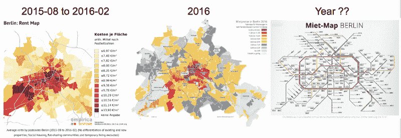

Old data is everywhere.

由于我只能找到旧的数据，我决定搜索提供出租公寓的网站。网络抓取是一种通过自动化过程从网站中提取数据的技术。

[我的网络抓取博客](https://hackernoon.com/web-scraping-tutorial-with-python-tips-and-tricks-db070e70e071)详细介绍了网络抓取的陷阱和设计模式。

[**使用 Python 的网页抓取教程:技巧与窍门**](https://hackernoon.com/web-scraping-tutorial-with-python-tips-and-tricks-db070e70e071)
[*我在搜索航班机票时，注意到机票价格在白天会有波动。我试图找出 hackernoon.com 何时…*](https://hackernoon.com/web-scraping-tutorial-with-python-tips-and-tricks-db070e70e071)

以下是主要发现:

*   在抓取之前，检查是否有可用的公共 API
*   **善良**！不要通过每秒发送数百个请求来使网站超载
*   保存提取发生的日期。将解释为什么这是重要的。

#### 数据清理

一旦你开始获取数据，尽早查看它以发现任何可能的问题是非常重要的。

在 web 抓取租赁数据时，我加入了一些小检查，比如所有特性的缺失值的数量。网站管理员可以改变网站的 HTML，这将导致我的程序不再得到数据。

一旦我确保了网络抓取的所有技术方面都被涵盖，我认为这些数据几乎是理想的。然而，由于不太明显的重复，我最终清理了大约一周的数据。

一旦你开始获取数据，尽早查看它以发现任何可能的问题是非常重要的。例如，如果你抓取网页，你可能会错过一些重要的领域。如果您在将数据保存到文件中时使用逗号分隔符，并且其中一个字段也包含逗号，那么您可能会得到分隔得不太好的文件。

ILLUSION vs REALITY

副本有几个来源:

*   重复的公寓，因为它们已经上线一段时间了
*   代理机构输入错误，例如租金价格或公寓的楼层。他们会在一段时间后更正它们，或者发布一个全新的广告，其中包含更正后的值和额外的描述修改
*   同一套公寓的一些价格在一个月后发生了变化(上涨或下跌)

虽然第一个案例中的副本很容易通过 ID 识别，但第二个案例中的副本非常复杂。原因是代理机构可以稍微改变描述，修改错误的价格，并将其作为新广告发布，这样 ID 也将是新的。

我必须想出许多基于逻辑的规则来过滤掉旧版本的广告。一旦我能够确定这些公寓实际上是重复的，但稍加修改，我就可以按照提取日期对它们进行排序，将最近的一个作为最近的。

此外，一些机构会在一个月后提高或降低同一公寓的价格。有人告诉我，如果没人要这套公寓，价格就会下降。相反，我被告知，如果有太多的要求，代理机构会提高价格。这些听起来像是很好的解释。

### 获得更深刻的见解

既然一切都准备好了，我们可以开始分析数据了。我知道数据科学家喜欢 seaborn 和 ggplot2，以及许多静态可视化，他们可以从中获得一些见解。

然而，交互式仪表板可以帮助您和其他利益相关者找到有用的见解。有许多令人惊讶的易于使用的工具，如 [Tableau](https://www.tableau.com/) 和 [Microstrategy](https://www.microstrategy.com/us) 。

我花了不到 30 分钟的时间创建了一个交互式仪表盘，人们可以选择所有重要的组件，并查看价格如何变化。

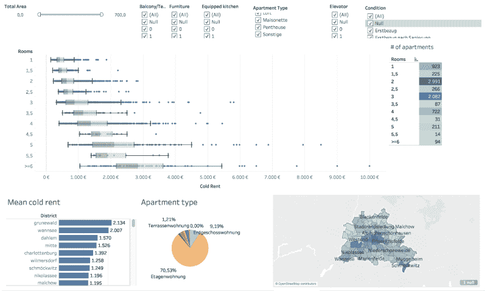

Interactive dashboard of Berlin rental prices: one can select all the possible configurations and see the corresponding price distribution. (Data date: Winder 2017/18)

一个相当简单的**仪表板**已经可以为新来者提供关于柏林价格的**洞察**，并且可以成为一个出租公寓网站的一个很好的**用户驱动力。**

从这个数据可视化可以看出，2.5 室的价格分布属于 2 室公寓的价格分布。原因是大多数 2.5 室的公寓不在市中心，这当然降低了价格。

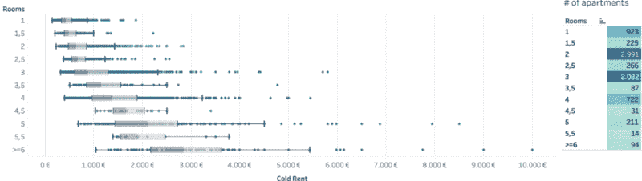

Price distribution and number of apartments in Berlin.

这些数据是在 2017/18 年冬季收集的，也会过时。然而，我的观点是，租赁网站可以经常更新他们的统计数据和可视化，为这个问题提供更多的透明度。

### 使用外部 API 的特征工程

可视化有助于您识别这些机器学习算法可以使用的重要属性或“特征”。如果您使用的特征非常缺乏信息，任何算法都会产生糟糕的预测。有了非常强大的功能，即使是非常简单的算法也能产生相当不错的结果。

在租金价格项目中，价格是一个连续变量，因此是一个典型的回归问题。通过提取所有信息，我收集了以下特征，以便能够预测租赁价格。

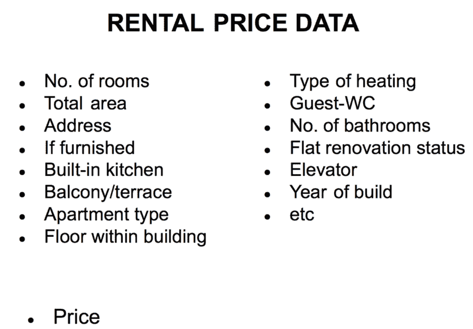

These are the majority of the features used to predict the rental apartment price.

然而，有一个特点是有问题的，即地址。有 6.6K 个单元和大约 4.4K 个不同粒度的唯一地址。大约有 200 个唯一的邮政编码可以被转换成虚拟变量，但这样会丢失特定位置的非常珍贵的信息。

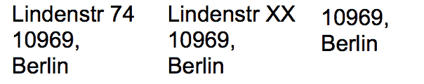

Different granularity of the address: street with the house number, street with hidden house number and only a postcode.

当你得到一个新地址时，你会怎么做？
你要么谷歌它在哪，要么怎么去。

通过使用遵循给定的四个附加特性的外部 API，可以计算公寓的地址:

1.  乘坐火车前往弗里德里希大街(中央车站)的时间

2.乘车到地铁市中心的距离

3.步行到最近的地铁站的时间

4.公寓一公里范围内的地铁站数量

这四个特性显著提升了性能。

### **进行机器学习和数据科学时的常见错误**

在抓取或获取数据之后，在应用机器学习模型之前，有很多步骤可以完成**。**

您需要可视化每个变量，以查看分布，找到异常值，并了解为什么会有这样的异常值。

如何处理某些特征中的缺失值？

将分类特征转换成数字特征的最佳方式是什么？

有很多这样的问题，但我会就大多数初学者遇到的错误给出一些细节。

#### 1.形象化

首先，您应该可视化连续特征的分布，以了解是否有许多异常值，分布情况如何，以及它是否有意义。

形象化的方法有很多，比如[箱线图](https://www.khanacademy.org/math/statistics-probability/summarizing-quantitative-data/box-whisker-plots/a/box-plot-review)、[直方图](https://en.wikipedia.org/wiki/Histogram)、[累积分布函数](https://en.wikipedia.org/wiki/Cumulative_distribution_function) ns、[小提琴图](https://en.wikipedia.org/wiki/Violin_plot)。然而，人们应该选择能够给出关于数据的最多信息的图。

要查看分布(如果是[正常](https://en.wikipedia.org/wiki/Normal_distribution)，或者[双峰](https://en.wikipedia.org/wiki/Multimodal_distribution)，直方图将是最有帮助的。虽然直方图是一个很好的起点，但箱线图在识别异常值的数量和查看中位数四分位数的位置方面可能更胜一筹。

根据情节，最有趣的问题是:**你看到你期望看到的了吗？**回答这个问题将有助于您找到见解或发现数据中的错误。

为了获得灵感和理解什么样的情节最有价值，我经常参考 [Python 的 seaborn 画廊](https://seaborn.pydata.org/examples/index.html)。另一个很好的可视化灵感来源是 Kaggle 上的内核。[这是我的 kaggle 内核](https://www.kaggle.com/jkokatjuhha/in-depth-visualisations-simple-methods)对泰坦尼克号数据集的深度可视化。

在租金价格的背景下，我绘制了每个连续特征的直方图，并期望在没有账单和总面积的租金分布中看到一个长的右尾。

Histograms of continuous features

箱线图帮助我看到了每个特征的异常值的数量。事实上，大多数基于无账单租金的离群值公寓要么是 200 多平方米的小商店的工作室，要么是租金非常低的学生宿舍。

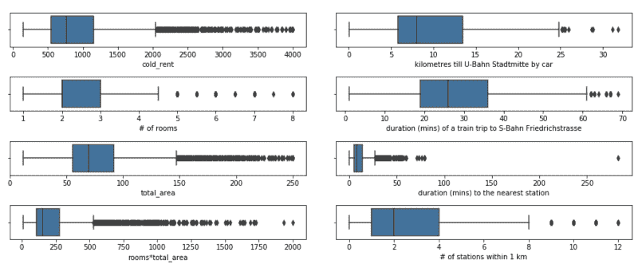

Boxplots of continuous features

#### 2.我是基于整个数据集估算值吗？

由于各种原因，有时会有缺失值。如果我们排除至少有一个缺失值的每个观察值，我们可以得到一个非常精简的数据集。

有许多方法来计算平均值或中值。如何做由你决定**但是**确保只对训练数据计算插补统计**，以避免测试集的[数据泄露](https://machinelearningmastery.com/data-leakage-machine-learning/)** 。

在租房数据里，我还提取了一份公寓的描述。每当公寓的质量、条件或类型缺失时，如果描述中包含这些信息，我会从描述中进行估算。

#### 3.我如何转换分类变量？

根据实现的不同，有些算法不能直接处理分类数据，因此需要以某种方式将它们转换成数值。

有许多方法可以将分类变量转换成数字特征，例如[标签编码、One Hot 编码、bin 编码](http://pbpython.com/categorical-encoding.html)和散列编码。然而，大多数人错误地使用了标签编码**，而实际上应该使用的是一个热门编码。**

**假设，在我们的租赁数据中，我们有一个公寓类型的列，其值如下:[底层、阁楼、公寓、阁楼、底层]。LabelEncoder 可以把这个变成[3，2，1，2，2，1]，引入平凡性，意思是 ground _ floor > loft > maisonette。对于像决策树这样的算法及其变体来说，这种类型的编码方式是可以的，但是应用回归和 SVM 可能没有多大意义。**

**在租赁价格数据集中，**条件**编码如下:**

*   **新:1**
*   **翻新:2**
*   **需要翻新:3**

**而**质量**为:**

*   **卢克斯:1**
*   **比正常情况好:2**
*   **正常:3**
*   **简单:4**
*   **未知:5**

#### **4.我需要标准化变量吗？**

**标准化将所有连续变量带到相同的范围，这意味着如果一个变量的值从 1K 到 1M，另一个从 0.1 到 1，标准化后它们将具有相同的范围。**

**[L1 或 L2 正则化](https://towardsdatascience.com/l1-and-l2-regularization-methods-ce25e7fc831c)是减少[过度拟合](https://machinelearningmastery.com/overfitting-and-underfitting-with-machine-learning-algorithms/)的常用方法，可用于许多回归算法中。然而，在 L1 或 L2 之前应用特征标准化**是很重要的。****

**租赁价格以欧元为单位，因此如果价格以美分为单位，拟合系数将比拟合系数大约大 100 倍。L1 和 L2 对较大系数的惩罚力度更大，这意味着对较小尺度的要素的惩罚力度更大。为了防止这种情况，在应用 L1 或 L2 之前，应该对特征进行标准化。**

**标准化的另一个原因是，如果您或您的算法使用梯度下降，梯度下降会随着要素缩放而收敛得更快。**

#### **5.我需要导出目标变量的对数吗？**

**我花了一段时间才明白，没有通用的答案。**

**这取决于许多因素:**

*   **无论你想要分数误差还是绝对误差**
*   **你用哪种算法**
*   **指标中的残差图和变化告诉你什么**

**在回归中，首先[注意残差图](http://docs.statwing.com/interpreting-residual-plots-to-improve-your-regression/)和度量。有时，目标变量的对数化导致更好的模型，并且模型的结果仍然容易理解。然而，仍然有其他可能感兴趣的变换，比如开平方。**

**关于这个问题，堆栈溢出有很多答案，我认为[残差图和原始和测井目标变量](https://stats.stackexchange.com/questions/319880/non-linear-regression-residual-plots-and-rmse-on-raw-and-log-target-variable)的 RMSE 很好地解释了这个问题。**

**对于租金数据，我得出了价格的对数，因为剩余曲线看起来更好一些。**

**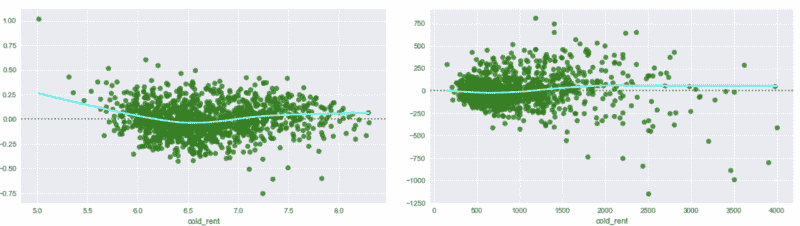

Residual plots of the logarithms (left) and untransformed data (right) of rent not including the bills variable. The right plot exhibits “heteroscedasticity” — the residuals get larger as the prediction moves from small to large.** 

#### **6.一些更重要的东西**

**一些算法，如回归，将遭受数据中的[共线性](https://en.wikipedia.org/wiki/Multicollinearity)，因为系数变得非常不稳定([更多数学](http://www.stat.cmu.edu/~larry/=stat401/lecture-17.pdf))。 [SVM](https://en.wikipedia.org/wiki/Support_vector_machine) [可能会也可能不会因为内核的选择而遭受](https://stats.stackexchange.com/questions/149662/is-support-vector-machine-sensitive-to-the-correlation-between-the-attributes)的共线性。**

**基于决策的算法不会受到多重共线性的影响，因为它们可以在不同的树中互换使用特征，而不会影响性能。然而，特征重要性的解释变得更加困难，因为相关变量可能看起来并不像它实际上那样重要。**

### **机器学习**

**在你熟悉了数据并清除了离群值之后，这是掌握机器学习的最佳时机。有许多算法可以用于这种受监督的机器学习。**

**我想探索三种不同的算法，比较性能差异和速度等特征。这三个是具有不同实现的梯度增强树(XGBoost 和 LightGMB)、随机森林(FR，scikit-learn)和三层神经元网络(NN，Tensorflow)。我选择 RMSLE(均方根对数误差)作为流程优化的衡量标准。我使用 RMSLE 是因为我导出了目标变量的对数。**

**XGBoost 和 LigthGBM 表现相当，RF 稍差，而 NN 最差。**

**

Performance (RMSLE) of the algorithms on the test set.** 

**基于决策树的算法非常擅长解释特征。例如，它们产生一个特征重要性分数。**

#### **功能重要性:寻找租赁价格的驱动因素**

**拟合基于决策树的模型后，您可以看到哪些特征对价格预测最有价值。**

**特征重要性提供了一个分数，该分数指示每个特征在模型内决策树的构造中的信息量。计算该分数的方法之一是计算某个特征在所有树上被分割数据的次数。这个分数可以用[不同的方式](https://datascience.stackexchange.com/questions/12318/how-do-i-interpret-the-output-of-xgboost-importance)计算。**

**功能重要性可以揭示关于主要价格驱动因素的其他见解。**

**对于租赁价格预测，总面积是价格的最重要驱动因素并不奇怪。有趣的是，一些用外部 API 设计的特性也是最重要的特性。**

**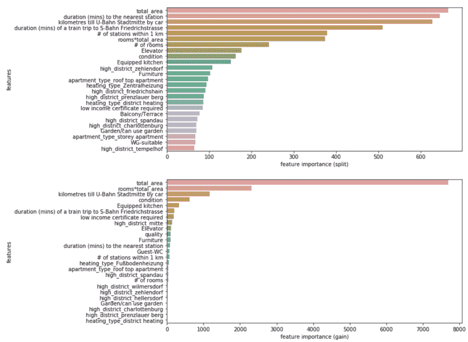

Feature importance calculated by split (above) and by gain (below)** 

**然而，正如在[“使用 XGBoost 的可解释机器学习”](https://towardsdatascience.com/interpretable-machine-learning-with-xgboost-9ec80d148d27)中提到的，根据属性选项的不同，特征重要性可能会有不一致。链接博客的作者 that 尼普斯提出了一种新的计算特征重要性的方法，这种方法既准确又一致。这使用了 [shap Python 库](https://github.com/slundberg/shap)。SHAP 值表示模型输出变化的特征的责任。**

**租赁价格数据的分析结果如下图所示。**

**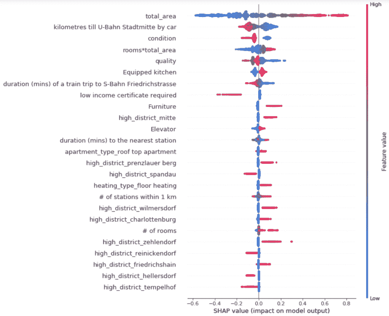

Each apartment has one dot on each row. The x position of the dot is the impact of that feature on the model’s prediction for the customer, and the color of the dot represents the value of that feature for the apartment** 

**该图包含了大量有价值的信息(特征按均值(| SHAP 树|))排序)。小声明:数据是 2018 年初的；该地区可能会发生变化，因此价格相关因素可能会发生变化。**

*   **靠近市中心(开车到地铁站只有几公里，乘火车到地铁弗里德里希街需要很长时间)提高了公寓租金的预期**
*   **总面积是租赁价格的最大驱动力**
*   **如果公寓业主要求你有低收入证明(德语为 WBS)，预测价格更低**
*   **在这些地区租公寓也会提高房租:Mitte、Prenzlauer Berg、Wilmersdorf、Charlottenburg、Zehlendorf 和 Friedrichshain。**
*   **价格较低的地区是:斯潘道、滕珀尔霍夫、婚礼和赖尼克多夫**
*   **显然，一套条件较好的公寓——价格越低越好——质量越好——价格越低越好——配有家具、嵌入式厨房和电梯，价格会更高**

**有趣的是以下特征的影响:**

*   **到最近地铁站的时间**
*   **1 公里范围内的站点数量。**

****到最近的地铁站的持续时间:**
似乎对于一些公寓来说，这一特性的高价值意味着更高的价格。原因是这些公寓位于柏林郊外非常富裕的住宅区。**

**人们还可以看到，靠近地铁站有两个方向:它降低了某些公寓的价格。原因可能是，离地铁站很近的公寓也会受到地铁噪音或振动的影响，但另一方面，它们与公共交通有很好的联系。但是，您可以对此功能进行更深入的调查，因为它仅显示与最近的地铁站的接近度，而不显示与电车/公交车站的接近度。**

****1 公里内的站点数:**
同样适用于公寓 1 公里内的站点数。一般来说，周围的许多地铁站都会提高租金。然而，它也有负面影响——更多的噪音。**

#### **整体平均**

**在玩了不同的模型并比较了性能之后，您可以将每个模型的结果结合起来，构建一个整体！**

**Bagging 是一种机器学习集成模型，它利用几种算法的预测来计算最终的聚合预测。它旨在防止过度拟合，并减少算法的方差。**

**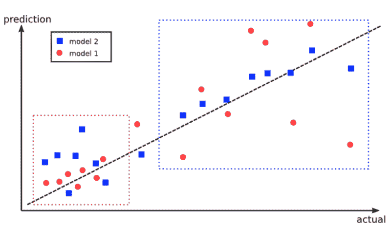

Advantage of using ensembles: The red model performs better in the lower left box, however, the blue model performs better in the upper right box. By combining the predictions from both models, it could improve the overall performance. Fig taken from [here.](https://burakhimmetoglu.com/2016/12/01/stacking-models-for-improved-predictions/)** 

**由于我已经有了来自上述算法的预测，我以所有可能的方式组合了所有四个模型，并基于验证集的 RMSLE 挑选了七个最佳的单一和集合模型。**

**然后在测试集上计算这七个模型的 RMSLE。**

**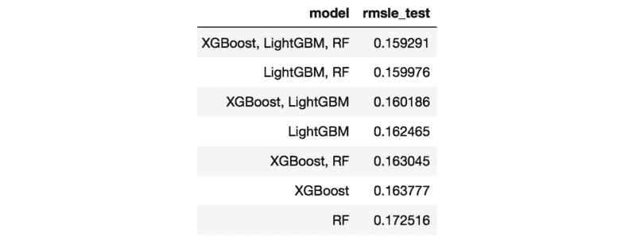

Test RMSLE of the algorithms.** 

**与单个模型相比，三种基于决策树的算法的组合表现最好。**

**你也可以产生一个加权的集合，给一个更好的单一模型分配更多的权重。其背后的推理是，只有在其他模型集体同意一个替代方案的情况下，它们才能推翻最佳模型。**

**事实上，如果不尝试一下，人们永远不会知道一个平均的集合是否比单一模型更好。**

#### **堆叠模型**

**平均或加权集合并不是组合不同模型预测的唯一方式。你也可以用不同的方式堆叠模型！**

**堆叠模型背后的想法是创建几个基础模型和一个基于基础模型结果的元模型，以便产生最终预测。然而，如何训练元模型并不那么明显，因为它可能偏向于基础模型中的最佳模型。在[“改进预测的堆叠模型”](https://burakhimmetoglu.com/2016/12/01/stacking-models-for-improved-predictions/)这篇文章中可以找到关于如何正确操作的很好的解释。**

**对于租赁价格案例，堆叠模型根本没有改善 RMSLE 它们甚至增加了指标。这可能有几个原因——要么是我编码错误；)或者堆叠带来了太多的噪音。**

**如果你想了解更多关于组合和堆叠模型的文章， [Kaggle 组合指南](https://mlwave.com/kaggle-ensembling-guide/)解释了许多不同类型的组合，包括性能比较和这些堆叠模型如何在 Kaggle 的竞争中脱颖而出的介绍。**

### ****最终想法****

*   **听听你身边的人都在说些什么；他们的抱怨可以作为解决大问题的良好开端**
*   **通过提供交互式仪表盘，让人们找到自己的见解**
*   **不要把自己局限于两个变量相乘的通用特征工程。尝试寻找额外的数据或解释来源**
*   **尝试集合和堆叠模型，因为这些方法可以提高性能**

****请提供您显示的数据的日期！****

**数字来源:

[https://www . theodyseyonline . com/the-struggles-of-moving-into-your ' s first-apartment](https://www.theodysseyonline.com/the-struggles-of-moving-into-your-first-apartment)
[https://www . fashion beans . com/content/the-worlds-10-small-apartments-are-彻头彻尾的震惊/](https://www.fashionbeans.com/content/the-worlds-10-smallest-apartments-are-downright-shocking/)**