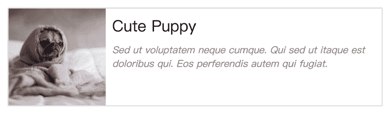
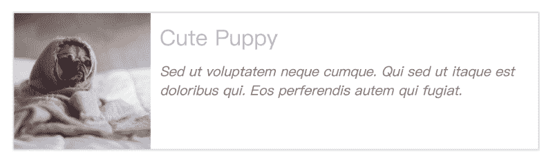
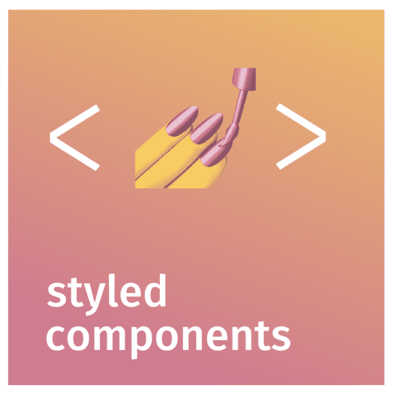
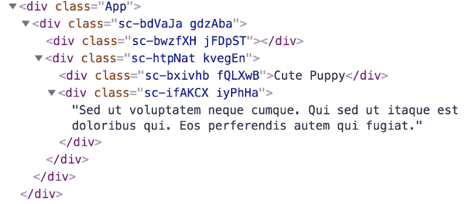
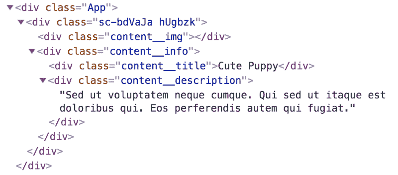

# 如何构建可调试的样式化组件

> 原文：<https://www.freecodecamp.org/news/how-to-build-a-debuggable-styled-component-10f7e4fbea2/>

作者:吴春林

# 如何构建可调试的样式化组件

[https://unsplash.com/photos/4gKHjKG7ty4](https://unsplash.com/photos/4gKHjKG7ty4)

Styled-components 是一个 CSS-In-JavaScript 库。它允许你在你的反应 JSX 文件里面写 CSS 代码。当组件的 CSS 属性可以随样式化组件动态变化时，生活是美好的。

然而，当您尝试调试样式化的组件时，会有一些缺点。在本文中，我将向您介绍使用传统 CSS 和样式化组件构建组件的优缺点。然后，我将向您展示一种简单的方法来克服构建样式化组件的缺陷。敬请期待！

### 入门指南

首先，让我们用一个常规的 CSS 文件制作一个组件。

目前，该组件看起来如下图所示。

很可爱吧！？

### 让“可爱的小狗”这个标题变成另一种颜色

给`Content.jsx`一个道具吧。简单点说，给它一个道具叫**天蓝。**

现在，我们可以基于`skyblue` **更改`Content.jsx` CSS 属性。**我想向您介绍两种通过普通 CSS 添加新 CSS 属性的方法。

#### **内嵌样式**

如你所见，我们将`skyblue`作为向样式对象添加 CSS 属性的条件。然后，我们将样式对象作为内联样式注入。现在结果会是这样的…

标题的颜色现在是天蓝色！现在让我们转到第二种方法。

#### **添加新的 CSS 类**

如你所知，我们制作了一个名为`content--skyblue`的 CSS 类。这是直接使颜色天蓝色。我们想把这个类加到“可爱的小狗”这个标题里。我们正在做的是创建一个数组来存储 CSS 类，然后使用`join`方法用空格分割类。所以现在，类名就像`
Cute Puppy` < /div >。结果看起来也和内联式方法一样。

可以看出，用上面的两种方法修改样式都不方便，尤其是对于那些复杂的 UI 组件。你不想写很多条件语句来设计你的组件，对吗？

那么，**内联式**和**添加新的 CSS 类**的优缺点是什么呢？

#### 赞成的意见

1.  这是普通的 CSS 和普通的 JS——你不需要学习新的语法和 API。
2.  使用浏览器的开发工具易于调试。

#### 骗局

1.  由于 [CSS 的特殊性](http://muki.tw/wordpress/wp-content/uploads/2015/07/CSS-Specificity-full-710x1024.png)，修改 inline-style 并不灵活。您不能简单地添加一个类来覆盖内联样式，因为内联样式具有更高的特异性。
2.  通过添加新的 CSS 类的方法看不出`className`中包含了什么类。当您看到这种代码`
Cute Puppy` < /div >时，您必须回头看看您添加到类中的逻辑。当你需要修改类名的`ave lots` 时，这将是一个主要的缺点。

这就是为什么我想向你们介绍[风格化组件](https://www.styled-components.com/)。

### 样式组件

> 使用 ES6 和 CSS 的精华来设计你的应用程序而没有压力？

styled-components

Styled-components 是一个库，可以很容易地修改 CSS 属性。通过`npm install styled-components --save`或`yarn add styled-components`安装即可。然后您可以使用样式化组件来样式化您的组件。让我们以可爱的小狗为例。

首先，我们需要将样式化组件导入到我们的组件中。我们将其作为一个名为`styled`的名称导入。然后我们可以定义每个样式化组件应该使用什么 HTML 元素。举个例子，

`const Button = styled.button` /* CSS Properties */ ``

表示该按钮组件代表样式化组件渲染 a `<button` / >。然后我们可以简单地将 CSS 属性移动到每个样式化的组件中。就是这样！就这么简单！现在可以看到可爱小狗的原版了。

使用样式组件改变标题的颜色怎么样？样式化组件利用 JavaScript ES6 [模板文字](https://developer.mozilla.org/en-US/docs/Web/JavaScript/Reference/Template_literals)。您可以将函数传递给模板文字。当你想修改基于道具的 CSS 属性时，这将会很有帮助。让我们通过可爱的小狗更深入地探讨这个话题。

我们将道具`skyblue`传递给用样式化组件构建的`Title`组件。然后，我们可以简单地通过模板文本将一个函数传递给我们想要修改的 CSS 属性。正如你所看到的，我们通过一个箭头函数`props => (props.skyblue ? 'skyblue' : 'blac`k’)来决定在什么条件下标题的颜色应该是天蓝色，我们刚刚完成改变标题的颜色！

### 调试怎么样

让我们打开 Chrome Devtools，看看用样式化组件构建组件时会发生什么。

What happened on Chrome Devtools

样式化组件有一个内置的 CSS 模块系统。这对于解决类名冲突问题非常有用。然而，当我们试图在 Chrome Devtools 上调试时，我们肯定不知道我们使用的是什么类。此外，当我们检查`Content.jsx`中的渲染函数时:

你知道我们用的是什么 HTML 元素吗？绝对不是，对吧？您必须回头查看每个样式化的组件，检查它使用的是什么 HTML 元素。实际上这很烦人。此外，当你以这种方式构建样式化组件时，基本上你就放弃了 CSS 选择器的强大功能。

考虑到上面的问题，我想介绍一个简单的方法来构建一个可调试的样式组件，它结合了一般的 CSS 和样式组件。

### 将 CSS 选择器与样式化组件相结合

在这一部分的开始，我想让你知道如何用样式化组件来[样式化现有组件。](https://www.styled-components.com/docs/basics#styling-any-components)

> 这种风格化的方法可以在你自己的或者任何第三方组件上完美地工作。只要它们将类名属性传递给它们呈现的子组件，子组件也应该传递它，依此类推。最终，类名必须传递给实际的 DOM 节点，样式才能生效。

我们需要将 **className** 添加到通用组件中，我们可以用样式化组件轻松地对它们进行样式化。让我们看看如何利用它来构建一个可调试的样式化组件。

我们需要通过**类名**属性包装`Content.jsx`，我们可以用这种模式来设计它:

`const StyledContent = styled(Content)` /* CSS Properties */ ``

然后我们可以将任何组件包装到样式化组件中。此外，我们还可以在 styled-component 内部使用 CSS 选择器。此外，SCSS 语法在样式化组件中也是可用的！让我们看看当我们在 Chrome Devtools 中打开控制台时是如何发生的。

现在这些课程很有意义，对吗？而且我们还是因为 className prop 而受益于内置的 CSS 模块系统。简单来说，你只需要管好组件内部的 CSS 类名，那你就没事了？。还记得我们如何通过向样式化组件传递函数来修改 CSS 属性吗？这个方法还是管用的！当然，结果还是会像…

生活从未如此美好！

### 包裹

我们已经通过两种方法通过传统的 CSS 样式组件。然后我们学习了如何用样式化组件轻松地样式化组件。最后，我们将 CSS 选择器与样式化组件结合起来。现在，组件可以很容易地设计风格，也可以调试。

如果您想尝试使用 styled-components 来设计您的组件，但是在调试时感到痛苦，我建议您尝试一下这种方法。

### [演示](https://chun-lin.github.io/Debuggable-Styled-Components-Example/)

### 源代码

你可以在我的 Github repo 上查看每个方法的源代码

1.[内嵌样式](https://github.com/Chun-Lin/Debuggable-Styled-Components-Example/tree/general-css-version)

2.[添加一个新类](https://github.com/Chun-Lin/Debuggable-Styled-Components-Example/tree/general-css-version)

3.[样式化组件](https://github.com/Chun-Lin/Debuggable-Styled-Components-Example/tree/styled-components-version)

4.[将 CSS 选择器与样式组件结合起来](https://github.com/Chun-Lin/Debuggable-Styled-Components-Example/tree/styled-components-css-selectors)

感谢您阅读我的文章。希望没有浪费你的时间。如果你喜欢这篇文章，请随时给我鼓掌？？？。你的掌声将激励我写更多高质量的文章✍️.

在推特上关注我

在 [Github](https://github.com/Chun-Lin) 上关注我

在 [LinkedIn](https://www.linkedin.com/in/chunlin-wu-4114809b/) 上联系我