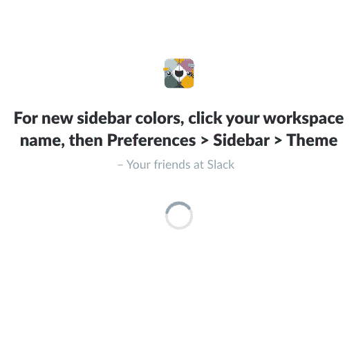
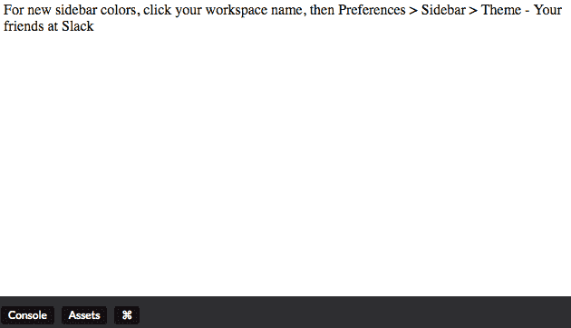
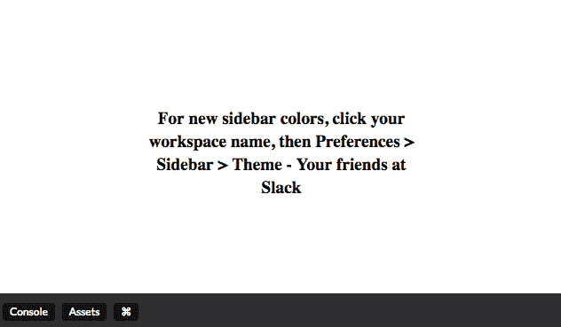
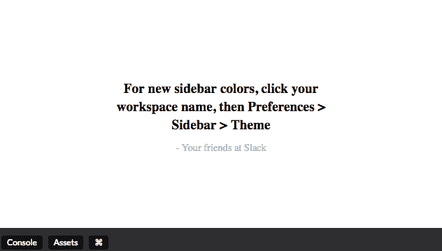
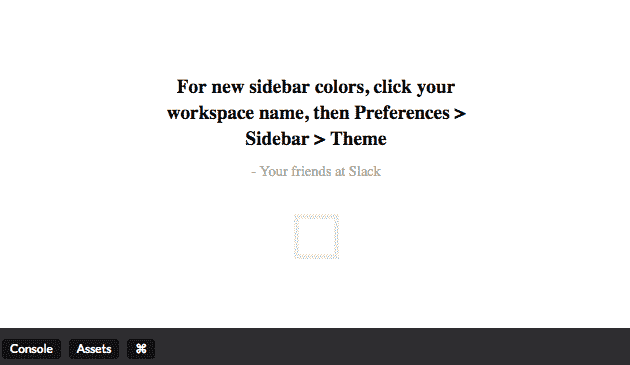
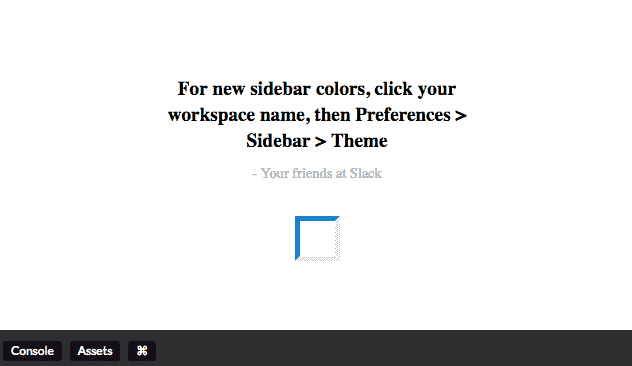
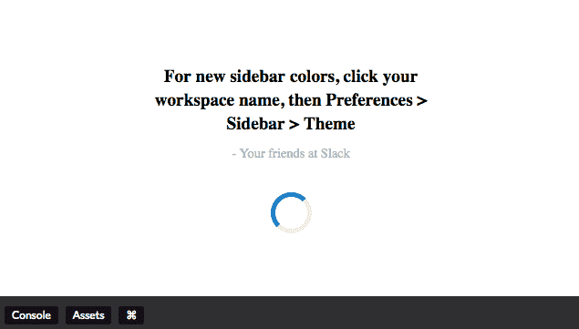
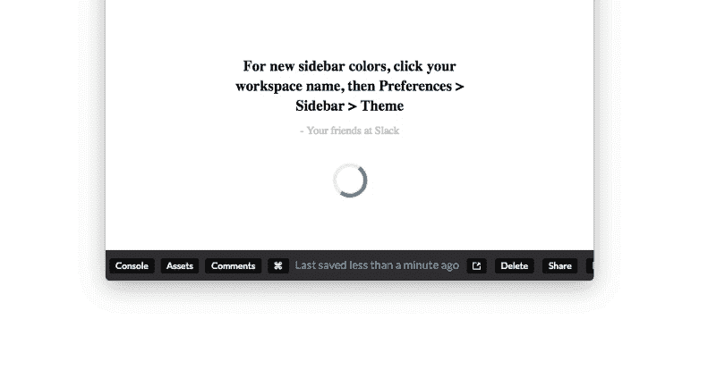
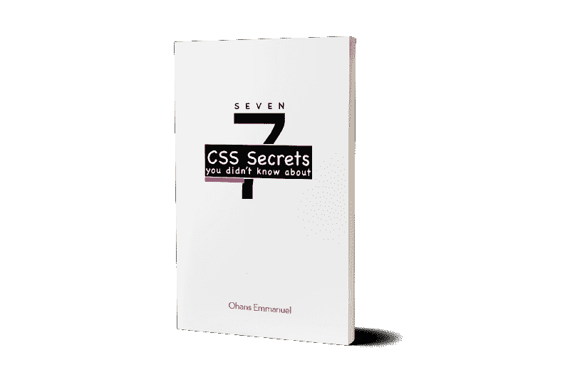

# 如何在 5 分钟内建立一个令人愉快的加载屏幕

> 原文：<https://www.freecodecamp.org/news/how-to-build-a-delightful-loading-screen-in-5-minutes-847991da509f/>

首先，这是我们将要构建的内容。设置你的定时器！



Here’s the [DEMO](https://codepen.io/ohansemmanuel/pen/ZxOjGx) we’ll build.

这看起来眼熟吗？

如果是的话，那是因为你在什么地方看到过这个——[Slack](https://slack.com)！

让我们通过用 CSS 和一些好的 HTML 重新创建它来学习一些东西。

如果你对写一些代码感到兴奋，上 [Codepen](http://codepen.io) 并创建一个新的笔。

现在，我们走吧！

#### 1.加价

这需要的标记非常简单。这是:

```
<section class="loading">
```

```
For new sidebar colors, click your workspace name, then     Preferences > Sidebar > Theme
```

```
<span class="loading__author"> - Your friends at Slack</span>;    <span class="loading__anim"></span>
```

```
</section>
```

很简单，是吧？

如果你不确定为什么类名有奇怪的破折号，我在本文的[中解释了背后的原因。](https://medium.freecodecamp.org/css-naming-conventions-that-will-save-you-hours-of-debugging-35cea737d849)

有一堆文本和一个`.loading__anim`跨度来“模拟”动画图标。

这样做的结果是下面的简单视图。



Not so bad, huh?

#### 2.将内容居中

结果并不是最漂亮的东西。让我们在页面中输入整个`.loading` section 元素。

```
body {  display: flex;  justify-content: center;  align-items: center;  min-height: 100vh;}
```


Now centered!

更好看了？

#### 3.设置加载文本的样式

我知道。我们很快会谈到动画。现在，让我们将`.loading`文本设计得更好看。

```
.loading {  max-width: 50%;  line-height: 1.4;  font-size: 1.2rem;  font-weight: bold;  text-align: center;}
```



#### 4.使作者文本的样式看起来略有不同。

```
.loading__author {  font-weight: normal;  font-size: 0.9rem;  color: rgba(189,189,189 ,1);  margin: 0.6rem 0 2rem 0;  display: block;}
```

这就对了。



#### 5.创建动画加载器

万众期待的一步来了。这将是最长的一步，因为我会花一些时间来确保你理解它是如何工作的。

如果你遇到困难，发表评论，我很乐意帮助你。

嘿，再看看装载机。


你会注意到它的一半笔画是蓝色的，另一半是灰色的。好了，已经解决了。另外，默认情况下，`HTML`元素不会被四舍五入。一切都是一个*盒子*元素。第一个真正的挑战是如何给`.loading__anim`元素一半的边框。

如果你还不明白这一点，不要担心。我会回来的。

首先，我们来梳理一下装载机的尺寸。

```
.loading__anim {  width: 35px;  height: 35px; }
```

现在，加载程序和文本在同一行。这是因为它是一个`span`元素，恰好是一个`HTML` **内联**元素。

让我们确保加载器位于另一行，也就是说，它从另一行开始，与`inline`元素的默认行为相反。

```
.loading__anim {   width: 35px;   height: 35px;   display: inline-block;  }
```

最后，让我们确保加载程序有一些边界设置。

```
.loading__anim {   width: 35px;   height: 35px;   display: inline-block;   border: 5px solid rgba(189,189,189 ,0.25);  }
```

这将在元素周围产生一个灰色的*`5px`边框。*

*现在，这是结果。*

*

You see the grey borders, right?* 

*还不太好。让我们做得更好。*

*一个元素有四条边，`top`、`bottom`、`left`和`right`*

*我们之前设置的`border`声明应用于元素的所有侧面。*

*为了创建加载器，我们需要元素的两边有不同的颜色。*

*你选择哪一方并不重要。我已经使用了下面的`top`和`left`面*

```
*`.loading__anim {  width: 35px;  height: 35px;  display: inline-block;  border: 5px solid rgba(189,189,189 ,0.25);  border-left-color: rgba(3,155,229 ,1);  border-top-color: rgba(3,155,229 ,1);  }`*
```

*现在，`left`和`top`边将会有一个*蓝色的*作为他们的边界。这是结果:*

*

hmmmm. looking nice.* 

*我们有进展了！*

*装载机是圆形的，不是长方形的。让我们通过给`.loader__anim`元素一个`50%`的`border-radius`来改变这一点*

*现在我们有了这个:*

**

*还不错吧。*

*最后一步是制作动画。*

```
*`@keyframes rotate { to {  transform: rotate(1turn) }}`*
```

*希望你对 [CSS 动画](https://www.w3schools.com/css/css3_animations.asp)的工作原理有所了解。`1turn`等于`360deg`，即旋转 360 度完成一圈。*

*像这样应用它:*

```
*`animation: rotate 600ms infinite linear;`*
```

*哟！我们做到了。这些都有意义吗？*

*顺便看看下面的结果:*

*

lo hicimos! (Spanish)* 

*很酷吧。*

*如果任何步骤让你困惑，请留言，我很乐意帮助你。*

### *准备好成为职业选手了吗？*

*我已经创建了一个免费的 CSS 指南，让你的 CSS 技能立即得到提高。[获取免费电子书](https://pages.convertkit.com/0c2c62e04a/60e5d19f9b)。*

*

Seven CSS Secrets you didn’t know about*