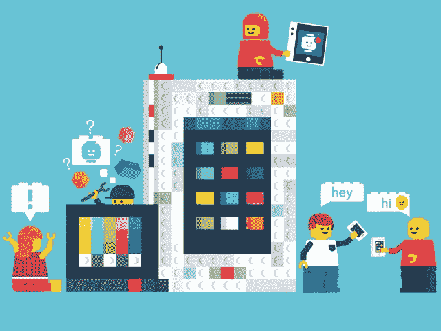
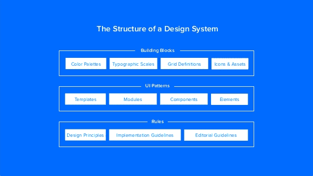
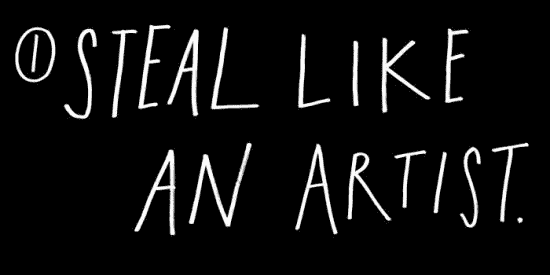

# 如何建立一个小团队的设计系统

> 原文：<https://www.freecodecamp.org/news/how-to-build-a-design-system-with-a-small-team-53a3276d44ac/>

奈玛·巴斯坎德里

# 如何建立一个小团队的设计系统

Illustration by Chris Gilleard

昨晚，我和我的小团队出发去做一些网络工作，学习设计系统。这是 2017 年的流行语，我们渴望了解如何创造自己的产品。

我们已经听说了创建一个设计系统的所有好处:节省时间，减少争论，合作，采用，等等。我很兴奋！

所有的演讲都是关于如何创造一个设计系统。然而，这些是**大的**团队或者他们有专门的资源，甚至有一个设计团队*(2017 年第二个流行词)*来建立和维护设计系统。

晚会结束时，我们有点沮丧地离开了。但是我们并不孤单。在问答环节，许多人问:

*“作为一个单一的设计师，我该如何构建一个设计系统？”*

“我是唯一的设计师，你有什么建议吗？”

但是我和我的团队决定不会让这阻止我们。我们还是要创造自己的设计体系。在我开始之前，这里有一些背景知识。

#### 什么是设计系统？

> “设计系统提供了一个视觉样式、组件和其他关注点的库，由个人、团队或社区记录和发布，作为代码和设计工具，以便采用产品可以更有效和更有凝聚力。”— [内森·柯蒂斯](https://medium.com/eightshapes-llc/defining-design-systems-6dd4b03e0ff6)

简单地说，设计系统是将整个产品联系在一起的可重用组件的集合。

很多人都写过关于设计系统的深度文章和书籍。这里有一些你可能会觉得有用的:

[**设计系统的综合指南——vision Blog**](https://www.invisionapp.com/blog/guide-to-design-systems/)
[*像 Airbnb、优步和 IBM 这样的公司已经改变了他们设计数字产品的方式，加入了他们自己的…*www.invisionapp.com](https://www.invisionapp.com/blog/guide-to-design-systems/)[**设计系统、风格指南和模式库:天哪！-UXcellence**](https://uxcellence.com/2017/design-systems-style-guides-pattern-libraries)
[*许多设计师会互换使用设计系统、模式库和风格指南这些术语。但它们并不意味着…*uxcellence.com](https://uxcellence.com/2017/design-systems-style-guides-pattern-libraries)[**设计系统手册**](https://www.designbetter.co/design-systems-handbook)
[*一个设计系统将产品团队团结在一个共同的视觉语言周围。在这本书里，学习如何创造一个设计…*www.designbetter.co](https://www.designbetter.co/design-systems-handbook)[**创造一个设计系统:100 点过程清单**](https://www.uxpin.com/studio/ebooks/create-design-system-guide-checklist/)
[*知道如何一步一步地建立一个设计系统。基于真实项目。创建一个用户界面库存，获得买入，创建颜色…*www.uxpin.com](https://www.uxpin.com/studio/ebooks/create-design-system-guide-checklist/)

#### 风格指南与设计系统

你可能在想，棒极了但是 ***那不就是一个风格指南吗？***

> “风格指南是设计过程的产物。设计系统是一个活的、有资金支持的产品，有路线图和待办事项，服务于一个生态系统。”— [内森·柯蒂斯](https://twitter.com/nathanacurtis/status/656829204235972608?lang=en)

此外，设计系统是一堆不同大小的组件(或分子),它们可以以无限的方式放在一起，以创建一系列更大的组件。布拉德·弗罗斯特的[原子设计](http://atomicdesign.bradfrost.com/)是组件设计的灵感来源。

#### 设计系统的好处

> “我们今天面临的挑战是，工具之间不能很好地沟通，细节会从裂缝中漏出来，设计和工程之间存在巨大的差距，我们需要做大量的手工工作来确保我们始终处于一切的顶端。”— [UX 训练营](https://blog.prototypr.io/pattern-library-style-guides-design-systems-do-you-need-one-b7857af0f255)

作为一个致力于 B2B 企业软件的小团队，我们在有限的时间、预算和资源下创建了一个设计系统。我想提醒我们团队的好处。

总的来说，我们的团队将节省时间，因为:

*   减少争论—无需浪费时间重新审视相同组件的设计决策
*   可重复使用的组件使规模化成为可能
*   增强协作—改善远程和不同办公室的工作

我有一个自私的理由想要建立一个设计系统。我很快意识到，如果成功，我们可以“自动化”许多任务，让我们有时间做我喜欢的事情，解决用户问题！那是 UX 的核心。

#### 设计系统结构

为了创建一个设计系统，我们需要分解它并理解它的各个部分:

[UX Pin — Design System](https://www.slideshare.net/uxpin/building-a-design-system-a-practitioners-case-study)

这也涉及到一些灵魂的探索。创建设计系统时要问的一些问题:

*   这个系统现在和将来如何运作？
*   我们的愿景是什么？
*   我们试图解决什么问题？
*   这个问题对谁影响最大？
*   我们希望设计系统对我们的工作方式有什么影响？

其他人是如何尝试的:

[**我们如何使用基于组件的设计**](https://medium.com/@lewisplushumphreys/how-were-using-component-based-design-5f9e3176babb)
[*基于组件的设计经常在大型复杂项目中被提及。在这篇文章中，我们将创建一个案例…*medium.com](https://medium.com/@lewisplushumphreys/how-were-using-component-based-design-5f9e3176babb)[**建立一个设计系统**](https://blog.prototypr.io/design-system-ac88c6740f53)
[*建立一个提供统一的 UX、设计规则和模式的系统。* blog.prototypr.io](https://blog.prototypr.io/design-system-ac88c6740f53)

### 我们这个小团队怎么做一个设计系统？

当你没有足够的资源、时间或预算时，你从哪里开始？

#### 1.不要从头开始

> 如果你想从头开始做苹果派，你必须先发明宇宙 —卡尔·萨根

我们的团队正在野外考察现有的设计系统，这样我们就可以——正如 Austin Kleon 所说:

[Steal like and Artist — Austin Kleon](https://www.amazon.com/Steal-Like-Artist-Things-Creative/dp/0761169253)

许多公司已经公开了他们的设计系统，甚至共享草图文件。我在下面分享了一个列表。这一事实，以及许多其他草图资源，使得使用草图作为我们的选择工具变得显而易见。

此外，还有一些工具可以帮助您快速创建设计系统的基线:

[**框架为草图——网页设计系统**](http://framesforsketch.com/)
[*精心制作的组件和最好的草图技术组合成一个强大的网页设计系统。*framesforsketch.com](http://framesforsketch.com/)停止浪费你的时间…symbols.janlosert.com[**Sketch App Sources-免费设计资源和插件-图标、UI 套件、线框、iOS、Android…**](https://www.sketchappsources.com/search_bootstrap.html)
[*Sketch App Sources 是最大的图标、UI 套件、线框和免费草图设计资源集合。*www.sketchappsources.com](https://www.sketchappsources.com/search_bootstrap.html)

#### 2.知道你在做什么

我们已经决定，必须完成我们所有网站和属性的用户界面审计。我们可能需要一些帮助来完成这件事。但是由于它只是记录存在的东西，从其他人那里寻求帮助可能并不困难。这将耗费时间，但最终是值得的。我们将能够在创建新组件时进行整体设计。

这对于学习如何进行 UI 审计可能很有用:

[**《有效 UX 审计的分步指南》——InVision Blog**](https://www.invisionapp.com/blog/guide-to-effective-ux-audit/)
[*这个分步指南将教你如何审计你的用户体验。但是在我们开始之前，让我们先……*www.invisionapp.com](https://www.invisionapp.com/blog/guide-to-effective-ux-audit/)

#### 3.按需构建

设计系统是一个活的文档。意识到工作永远不会结束，我们决定投入进去，边做边建。当我们在项目中迭代工作时，我们将在头脑中设计组件，并最终拥有一个设计系统。幸运的是，我们有几个人，这使我们能够相互协作，相互“窃取”。

**快速提示**:在草图中构建符号。我知道，这看起来很费时间，但是一旦你看到符号的力量，你就会明白那句老话:

> 为了走得快，你必须走得慢

#### 4.了解你的极限

从小处着手。

一些设计系统包含代码片段。这是最终目标，因为它将增加整个公司的采用率，并创造一致的用户体验。但是，我的小团队做不到。还没有，就是说。

我们计划从简单组件的草图文件开始。一旦我们足够远，我们将与我们的前端开发人员一起创建 CSS。当涉及到代码时，允许开发人员使用他们的“选择的武器”可能会让设计系统活起来。随着代码库似乎每天都在变化，我们最好不要插手。

#### 5.保持有条理

听起来很简单，但是随着项目的堆积和截止日期的临近，用“快速和肮脏”的方式做事感觉更容易。保持有条理的确需要时间，而且永远不会结束，但它让每个人都保持理智，减少来回飞来飞去的电子邮件或杂乱的文件。当我们开始使用 UI 工具包开发新事物时，我们将使用上面列出的工具之一来构建它，我们需要保持跟踪。否则，我们将在我们开始的地方结束——到处都是不同的风格！

设计文档版本化是所有设计师的梦想。没有一种产品是 100%正确的。我们将对 Abstract 和 Plant 进行尝试，看看它如何帮助我们保持正确的方向。为企业工作，我们唯一可以用于文件存储的在线平台是一个驱动器。如果你没有受到限制，Google drive 和 Dropbox 也是你的选择。

[**摘要**](https://sketchapphub.com/resource/abstract/)
[*为您的草图文件进行版本控制和文件管理。抽象使设计师能够可靠地版本化和管理…*sketchapphub.com](https://sketchapphub.com/resource/abstract/)[**Plant-面向设计师的版本控制 app 和草图插件**](https://plantapp.io/)
[*Plant 是面向设计师的版本控制 app 和草图插件。同步设计版本，邀请队友，拿满……*plantapp . io](https://plantapp.io/)

这些是我和我的团队在开始这段旅程时将要尝试的第一步。祈祷我们取得一些进展。我很想听听其他小团队，甚至是“一个人的团队”，了解他们是如何应对这一挑战的。

### 设计系统目录

正如承诺的那样，这里有一些灵感或“像艺术家一样偷窃”的设计系统

[**miukimiu/design-systems**](https://github.com/miukimiu/design-systems)
[*design-systems-设计系统的策划列表。创建您自己的设计系统的学习材料和工具。*github.com](https://github.com/miukimiu/design-systems)[**亚特兰蒂斯设计指南|亚特兰蒂斯设计**](https://atlassian.design/)
[*设计、开发、交付。使用 Atlassian 端到端的设计语言，创造出直白而美丽…*Atlassian . design](https://atlassian.design/)[**构建我们新设计系统的幕后视觉语言**](https://airbnb.design/building-a-visual-language/)
[*。这篇文章是我们新设计语言系统系列的一部分。karri…*Airbnb . Design](https://airbnb.design/building-a-visual-language/)[**BBC GEL | home page**](http://www.bbc.co.uk/gel/)
[*我们的全球体验语言(GEL)是 BBC 的共享设计框架，使我们能够创建一致的…*www.bbc.co.uk](http://www.bbc.co.uk/gel/)[**Carbon 设计系统**](http://carbondesignsystem.com/)
[*Carbon 是 IBM 云产品的设计系统。它是一系列单独的样式、组件和指南…*carbondesignsystem.com](http://carbondesignsystem.com/)[**家庭-办公室 UI 结构**](https://developer.microsoft.com/en-us/fabric#/)
[*用于构建无缝融入 Office 和 Office 365 的体验的官方前端框架。*developer.microsoft.com](https://developer.microsoft.com/en-us/fabric#/)[**流畅设计系统**](https://fluent.microsoft.com/)
[*一个复杂世界的雄辩设计系统。现在是大胆、可扩展、通用设计的时候了。这是一个…*fluent.microsoft.com](https://fluent.microsoft.com/)[**和谐设计系统**](http://harmony.intuit.com/)
[*和谐是一个活的设计系统，它将 Intuit 的小企业产品、品牌和营销经验联合起来，横跨…*harmony.intuit.com](http://harmony.intuit.com/)[**IBM 设计语言**](https://www.ibm.com/design/language/)
[*使用 IBM 设计语言创造出制作精美的产品并具有启发性*www.ibm.com](https://www.ibm.com/design/language/)material . io[**Nachos | Trello**](https://design.trello.com/)
[*Trello-Pattern 库*design.trello.com](https://design.trello.com/)[**Pega UX 设计系统**](https://design.pega.com/)
[*Pega 是一个强大的吸引客户和员工的 UX 系统。Pega 软件解决复杂的业务问题…*design.pega.com](https://design.pega.com/)[**Predix 设计系统**](https://www.predix-ui.com)
[*编辑描述*www.predix-ui.com](https://www.predix-ui.com)[**美国 Web 设计标准:联邦政府的设计系统**](https://standards.usa.gov/)
[*该标准提供了研究支持的设计模式，用于构建可访问、响应性强且一致的数字…【关键词】学习如何设计引人入胜的…*experience.sap.com](https://standards.usa.gov/)[**Shopify Polaris**](https://polaris.shopify.com/)
[*我们的风格指南是我们设计系统的蓝图。它有助于我们跨领域协作来构建一个伟大的…*polaris.shopify.com](https://polaris.shopify.com/)[**模式实验室|构建原子设计系统**](http://patternlab.io/)
[*与静态设计工具不同，模式实验室让您可以轻松地将不同的代表性内容交换到您的组件中…* patternlab.io](http://patternlab.io/)

#### 模式库/样式指南

[**WTF 是固体？-Solid**](https://solid.buzzfeed.com/)
[*Solid 是 BuzzFeed 的 CSS 样式指南。受 Basscss 等框架的影响，Solid 使用不可变的原子 css 类来…*solid.buzzfeed.com](https://solid.buzzfeed.com/)[**风格指南**](https://buffer.com/style-guide)
[*Buffer 让你分享正在阅读的任何页面变得超级容易。把你的缓冲区加满，我们会自动分享……*buffer.com](https://buffer.com/style-guide)[**多语:设计指导方针**](https://www.duolingo.com/design/)
[*多语是一个大写的单词。“L”从不大写，名字是…*www.duolingo.com](https://www.duolingo.com/design/)[**模式库-future learn**](https://www.futurelearn.com/pattern-library)
[*享受英国顶尖大学和国际大学的免费在线课程。*www.futurelearn.com](https://www.futurelearn.com/pattern-library)[**设计准则——产品的制造方式。**](http://designguidelines.co/)
[*来自某处的 Web 开发人员*designguidelines.co](http://designguidelines.co/)[**网站样式指南资源**](http://styleguides.io/)
[*用于创建前端样式指南和模式库的协作资源集合*Style Guides . io](http://styleguides.io/)[**网格系统| MailChimp**](https://ux.mailchimp.com/patterns)
[*我们的网格系统由 8 个灵活的列组成，列之间有一个装订线我们应用边框，以便……*ux.mailchimp.com](https://ux.mailchimp.com/patterns)[**样式指南**](https://www.yelp.com/styleguide)
[*编辑描述*www.yelp.com](https://www.yelp.com/styleguide)

如果你觉得这有用，你知道现在该怎么做。[关注](https://medium.com/@msNaema)我，获取更多关于您的订阅源的文章和教程。