# 如何用 HTML、CSS 和 JavaScript 构建自己的开发者作品集网站

> 原文：<https://www.freecodecamp.org/news/how-to-build-a-developer-portfolio-website/>

如今，每个人都需要网站和网络应用程序。因此，如果你从事网页开发工作，你会有很多机会。

但是如果你想找一份网站开发的工作，你需要一个好的作品集网站来展示你的技能和经验。

在本教程中，我将讨论为什么你应该为自己制作一个作品集网站的一些主要原因。然后，我将带您了解如何用 HTML、CSS 和 JavaScript 构建自己的完全响应的 portfolio 网站。

## 目录

*   [什么是开发者组合网站？](#whatisadeveloperportfoliowebsite)
*   [为什么你应该有一个投资组合网站](#whyyoushouldhaveaportfoliowebsite)
*   [作品集项目——如何建立自己的在线开发者作品集](#portfolioprojecthowtobuildyourownonlinedeveloperportfolio)
*   [项目文件夹结构](#theprojectfolderstructure)
*   [基本的 HTML 样板文件](#thebasichtmlboilerplate)
*   [导航条部分](#thenavbarsection)
*   [如何设计导航条的样式](#howtostylethenavbar)
*   [如何打造英雄版块](#howtobuildtheherosection)
*   [如何设计英雄部分](#howtostyletheherosection)
*   [如何创建“更多关于我”部分](#howtobuildthemoreaboutmesection)
*   [如何建立技能部分](#howtobuildtheskillssection)
*   [如何设计技能部分](#howtostyletheskillssection)
*   [如何构建项目部分](#howtobuildtheprojectssection)
*   [如何设计项目部分的样式](#howtostyletheprojectsection)
*   [如何构建联系人部分](#howtobuildthecontactsection)
*   [如何设计联系人部分的样式](#howtostylethecontactsection)
*   [如何设计社交图标](#howtostylethesocialicons)
*   [如何添加滚动到顶部按钮](#howtoaddthescrolltotopbutton)
*   [滚动到顶部按钮的 HTML】](#thehtmlforthescrolltotopbutton)
*   H [如何设计滚动到顶部图标的样式](#howtostylethescrolltotopicon)
*   [如何让你的投资组合网站响应迅速](#howtomakeyourportfoliowebsiteresponsive)
*   [如何创建平板电脑和手机的媒体查询(max-width 720px)](#howtocreatethemediaqueryfortabletsandmobilephonesmaxwidth720px)
*   [如何制作汉堡菜单](#howtobuildthehamburgermenu)
*   [汉堡菜单的 JavaScript 代码](#thejavascriptforthehamburgermenu)
*   [如何让英雄版块反应灵敏](#howtomaketheherosectionresponsive)
*   [如何让“更多关于我”部分更具响应性](#howtomakethemoreaboutmesectionresponsive)
*   [如何让技能部分反应迅速](#howtomaketheskillssectionresponsive)
*   [如何使项目科反应迅速](#howtomaketheprojectssectionresponsive)
*   [如何让联系方式有反应](#howtomakethecontactformresponsive)
*   [如何让网站在小型手机上响应迅速](#howtomakethewebsiteresponsiveonsmallphones)
*   [结论](#conclusion)

## 什么是开发者组合网站？

开发者作品集网站为潜在雇主提供了关于你的技能、经验和你参与过的项目的相关信息。

你可以把你的作品集网站看作是你的在线简历。

## 为什么你应该有一个投资组合网站

### 1.投资组合网站增加你的网上形象

作为一名开发人员，你需要一个在线的存在。你可以在 Twitter、脸书和 Instagram 等社交媒体平台上培养这种在线形象。但那些并不完全是你自己的，因为那些平台的版主几乎完全控制了你的账户。

有了自己的作品集网站，它就在你自己的域名上在线直播。当人们在谷歌这样的搜索引擎上搜索你的名字时，他们可以很容易地找到你，只要你在搜索引擎优化方面做了正确的事情。

### 2.作品集网站是你的在线简历

你的作品集网站就像你的在线简历。潜在客户和招聘经理可以很容易地在网上找到你，查看你以前的项目和技能。

这也意味着，当任何人想给你一个为他们工作的机会，他们要求你以前的项目，你只需给他们一个链接到你的网站(你的投资组合)。它不仅有你的项目，还有你的技能和关于你过去经历的信息。

### 3.作品集网站展示了你所在领域的专业知识

作为一名开发人员拥有(更不用说建立自己的)portfolio 网站传达出一个清晰的信息，那就是你正在将你的技能付诸实践，并且你知道你在做什么。

作品集也有助于与客户建立信任，因为他们有你作品质量的直接证据。

## 作品集项目——如何建立自己的在线开发者作品集

你可以用 HTML、CSS 和 JavaScript 为自己制作一个很酷的作品集网站。这就是我们在这里要做的。

几个月前我就已经这样做了，并在 Gumroad 上把它作为一个免费产品提供给所有人，所以我决定创建一个关于我如何做到这一点的教程。

这是我们将要建造的[现场演示](https://eager-williams-af0d00.netlify.app/?)。

要跟随我，您可以从 [Github](https://github.com/Ksound22/developer-portfolio/tree/starter) 获取启动文件。

### 项目文件夹结构

为了避免混淆，我将把项目的 HTML、CSS、JavaScript、图标和图像放在各自的文件夹中。

HTML 文件放在根文件夹中，图像、图标、CSS 和 JavaScript 文件放在资源文件夹中它们各自的子文件夹中。这是一种常见的做法。

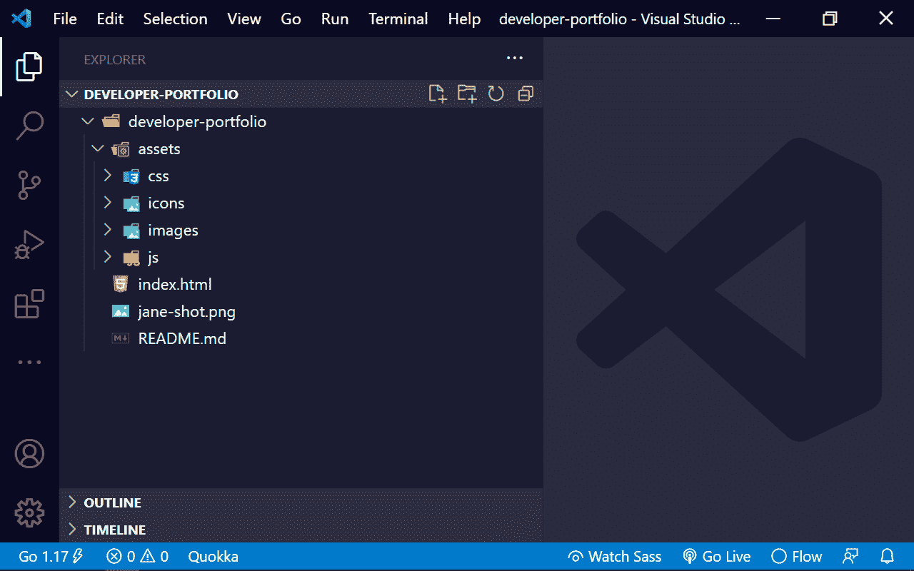

还有一个自述文件，包含我在项目中使用的所有工具，以及它们各自的链接。它可以在起始文件中找到。

### 基本的 HTML 样板

用 HTML、CSS 和 JavaScript 编写整个项目时，每个人都有自己的偏好。有些人喜欢先定义整个 HTML 样板文件，然后再定义 CSS，但我喜欢一部分一部分地做。

因此，我将从导航条部分开始。但是最好先展示一下基本的 HTML 样板文件是什么样的:

```
<!DOCTYPE html>
<html lang="en">
  <head>
    <meta charset="UTF-8" />
    <meta http-equiv="X-UA-Compatible" content="IE=edge" />
    <meta name="viewport" content="width=device-width, initial-scale=1.0" />

    <!--CSS Styles -->
    <link rel="stylesheet" href="assets/css/styles.css" />

    <!-- Favicons -->
    <link
      rel="apple-touch-icon"
      sizes="180x180"
      href="assets/icons/apple-touch-icon.png"
    />
    <link
      rel="icon"
      type="image/png"
      sizes="32x32"
      href="assets/icons/favicon-32x32.png"
    />

    <!-- Animate CSS CDN -->
    <link
      rel="stylesheet"
      href="https://cdnjs.cloudflare.com/ajax/libs/animate.css/4.1.1/animate.min.css"
    />
    <title>Jane Doe | Web Developer</title>
  </head>

  <body>
    <!-- Navbar -->

    <!-- Hero Section -->

    <!-- More about -->

    <!-- Skills section -->

    <!-- Projects section -->

    <!-- Contact section -->

    <!-- Social accounts - Fixed to the right -->

    <!-- Scroll to top -->

    <!-- Footer section -->

    <!-- Website scripts -->
    <script src="assets/js/app.js"></script>

    <!-- Ion icons scripts -->
    <script
      type="module"
      src="https://unpkg.com/ionicons@5.5.2/dist/ionicons/ionicons.esm.js"
    ></script>
    <script
      nomodule
      src="https://unpkg.com/ionicons@5.5.2/dist/ionicons/ionicons.js"
    ></script>
  </body>
</html> 
```

我把 HTML 中的所有部分都注释掉了，这样你可以更好地理解。在样板文件中还有动画 CSS 的 cdn(一个 CSS 动画库)，和 Ionic icons，我为这个项目选择的图标库。

我有一个通过 favicon IO 制作的 Favicon，并将其链接在 head 部分。Favicon 是显示在浏览器标签上的小图片。

### 导航条部分

Navbar 部分包含简单的图标`h1`文本和导航菜单:

```
 <nav>
      <h1>JANE DOE</h1>
      <ul class="navigation">
        <li><a href="#about" class="nav-link">About</a></li>
        <li><a href="#skills" class="nav-link">Skills</a></li>
        <li><a href="#projects" class="nav-link">Projects</a></li>
        <li><a href="#contact" class="nav-link">Contact</a></li>
      </ul>
      <button class="burger-menu" id="burger-menu">
        <ion-icon class="bars" name="menu-outline"></ion-icon>
      </button>
</nav> 
```

如果你想知道按钮元素代表什么，它是移动导航菜单(汉堡包菜单)的切换栏。这将在桌面上隐藏，但在手机上显示。

我还会将网站的各个部分链接到这些导航项目，这样当用户单击任何导航项目时，他们就会被带到与他们单击的导航项目相对应的部分。

这就是为什么我将超链接引用(`href`)属性分别设置为`#about`、`#skills`、`#projects`和`#contacts`。网站的各个部分将这些属性作为 id。

导航栏现在看起来是这样的:
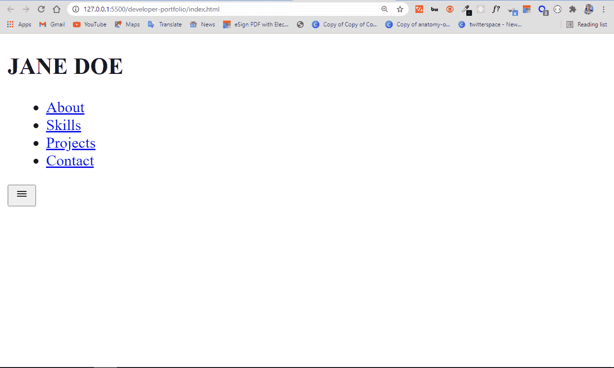

### 如何设计导航条的样式

导航条肯定需要一些样式来使它看起来更好一些。

在正确设计 navbar 样式之前，我将声明一些 CSS 变量，以便以后使用。这是因为，使用 CSS 变量，可以更容易地避免 CSS 文件中的冗余和重复。

声明 CSS 变量的语法如下所示:

```
:root {
  --variable-name: value;
} 
```

要使用该变量，请执行以下操作:

```
selector {
  property: var(--variable-name);
} 
```

我还将从 Google 导入 Roboto 字体，并声明一些 CSS 重置来删除一些默认功能，如元素的边距和填充、`text-decoration`锚标签和`list-style-type`列表。

```
@import url("https://fonts.googleapis.com/css2?family=Roboto:ital,wght@0,400;0,900;1,700&display=swap");

/* Variables */
:root {
  --font-family: "Roboto", sans-serf;
  --normal-font: 400;
  --bold-font: 700;
  --bolder-font: 900;
  --bg-color: #fcfcfc;
  --primary-color: #4756df;
  --secondary-color: #ff7235;
  --primary-shadow: #8b8eaf;
  --secondary-shadow: #a17a69;
  --bottom-margin: 0.5rem;
  --bottom-margin-2: 1rem;
  --line-height: 1.7rem;
  --transition: 0.3s;
}
/* Variables end */

html {
  scroll-behavior: smooth;
}

/* CSS Resets */
* {
  margin: 0;
  padding: 0;
  box-sizing: border-box;
}

ul {
  list-style-type: none;
}

a {
  text-decoration: none;
  color: var(--primary-color);
}

a:hover {
  color: var(--secondary-color);
}

body {
  font-family: var(--font-family);
} 
```

如果你注意到了，我为网站上从第 39 行到第 41 行的所有链接设置了悬停状态。当用户悬停在任何链接上时，它会变成我在 CSS 变量中设置的辅助颜色。

这里有一个声明 CSS 变量的经验法则:如果你发现自己经常在同一个 CSS 文件中使用相同的属性和值，你应该为它声明一个变量以避免重复。

你也应该像我一样，使你的变量名尽可能具有描述性，以便帮助其他可能使用你的代码的人。

随着重置，浏览器中的导航栏有一些变化:
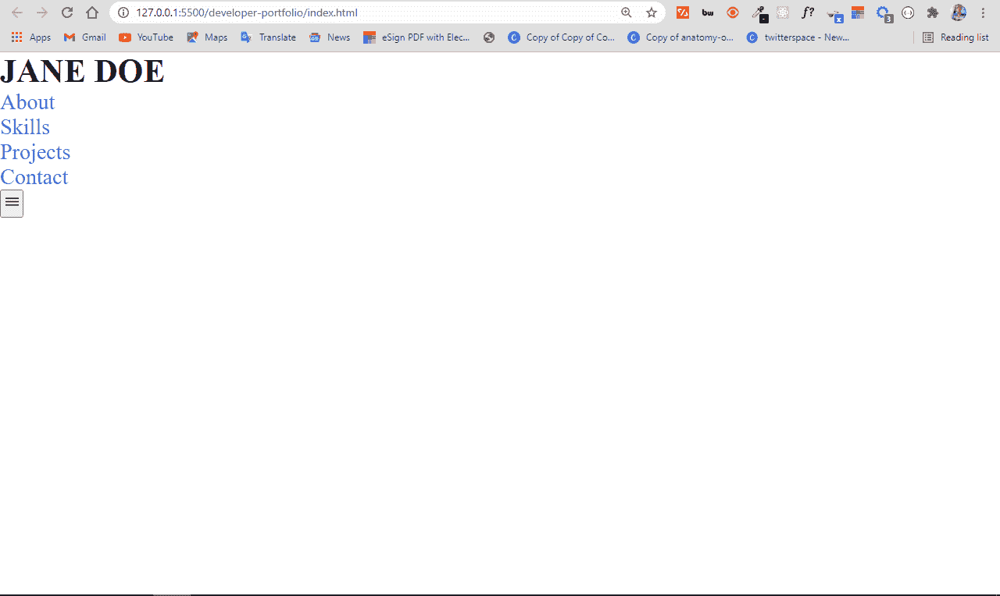

为了设计 navbar 的样式并对齐其中的内容，我将使用 CSS Flexbox:

```
nav {
  position: sticky;
  top: 0;
  left: 0;
  z-index: 1;
  display: flex;
  align-items: center;
  justify-content: space-between;
  padding: 1.5rem 3.5rem;
  background-color: var(--bg-color);
  box-shadow: 0 3px 5px rgba(0, 0, 0, 0.1);
} 
```

**上面的 CSS 在干什么？**

我用 position 属性使 navbar 具有粘性，所以无论如何它都保持在顶部。

值为 1 的`z-index`属性确保导航栏显示在网页上的任何其他元素上。这就是如何制作粘性导航条的方法。

此外，我还用`box-shadow`属性在 navbar 底部应用了阴影。

导航栏有了新的外观:
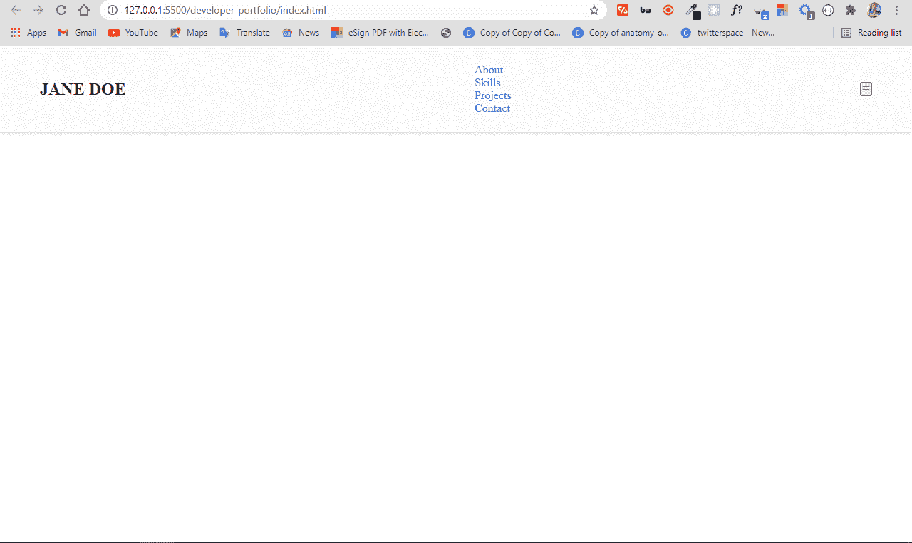

但是我们还没有完成。导航菜单项需要并排，而不是一个在另一个上面。我也会在 Flexbox 上这么做。

我还将通过使 h1、导航项目和汉堡包菜单按钮看起来更好来完成 navbar 样式的其余部分。我将用一些最初声明的 CSS 变量来做这件事。

```
nav h1 {
  color: var(--primary-color);
}

nav a {
  color: var(--primary-color);
  transition: var(--transition);
}
nav a:hover {
  color: var(--secondary-color);
  border-bottom: 2px solid var(--secondary-color);
}

nav ul {
  display: flex;
  gap: 1.9rem;
}

nav ul li {
  font-weight: var(--bold-font);
} 
```

汉堡菜单栏也需要隐藏。它有一个`.burger-menu`类，所以我们可以用它设置一个 none 显示，同时也让按钮看起来更好。

```
.burger-menu {
  color: var(--primary-color);
  font-size: 2rem;
  border: 0;
  background-color: transparent;
  cursor: pointer;
  display: none;
} 
```

我们的导航栏现在看起来更好了:
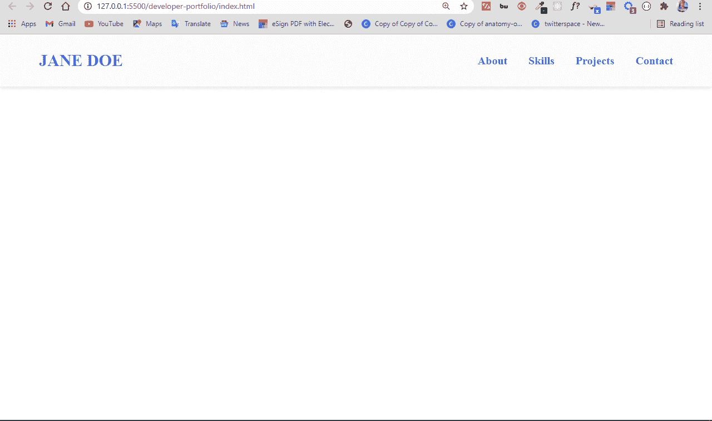

### 如何建立英雄版块

我们要做的下一部分是英雄部分。这不会像 navbar 那样费时费力。

hero 部分的 HTML 样板在下面的代码片段中:

```
<section class="hero" id="about">
      
      <div class="bio animate__animated animate__shakeX">
        <h2 class="bio-title">About Me</h2>
        <p class="bio-text">
          Lorem ipsum dolor sit amet, consectetur adipisicing elit. Mollitia sed
          dolorem fugit sapiente porro veniam pariatur dolore nostrum delectus
          inventore tempore minus nemo, iste ullam illo laboriosam maiores
          repudiandae quos!
        </p>
      </div>
</section> 
```

唯一有点奇怪的是附加在包含`About Me`文本的 div 上的`animate__animated animate__shakeX`的类。这些类名来自动画 CSS，它们用来制作“关于我”文本容器的动画。

这样，网站就有了新的面貌:
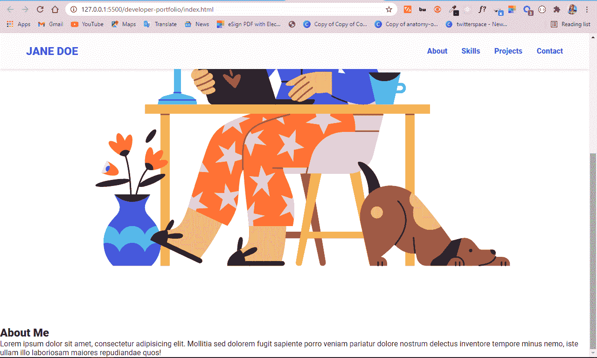

### 如何设计英雄部分的样式

Flexbox 将再次拯救我们！这个部分有两组主要内容——div 中的图像和文本。所以我们可以使用 flexbox 来并排显示它们。您可以在下面的 CSS 代码片段中看到它是如何工作的:

```
.hero {
  display: flex;
  align-items: center;
  justify-content: center;
  gap: 2.5rem;
  max-width: 68.75rem;
  margin: auto;
} 
```

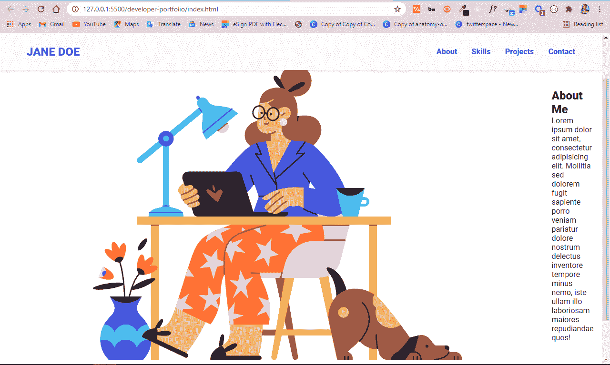

我们的无名氏图像太大了，所以我们需要减少它的宽度和高度。为了可读性，我们还需要设计简历文本(关于我的文本)的样式。最初声明的 CSS 变量在这里非常有用。

```
.hero img {
  height: 37.5rem;
  width: 37.5rem;
}

.bio {
  width: 25rem;
  padding: 0.625rem;
  border-radius: 6px;
  box-shadow: 0px 2px 15px 2px var(--primary-shadow);
}

.bio h1 {
  margin-bottom: var(--bottom-margin);
}

.bio p {
  line-height: var(--line-height);
  padding: 0.3rem 0;
} 
```

英雄部分现在看起来很美:
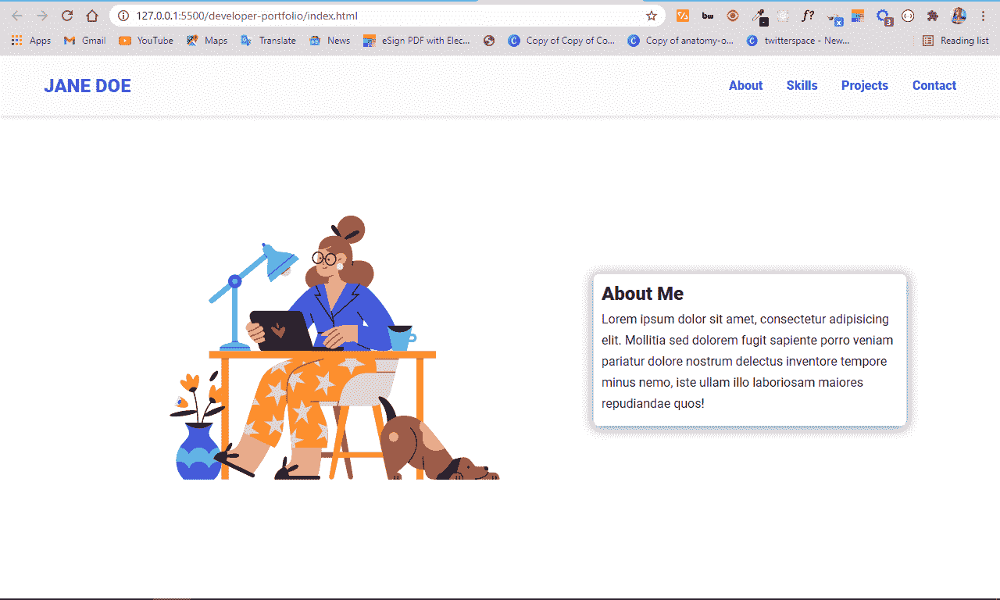

### 如何建立更多关于我的部分

我包括这一部分是为了用一些占位符文本包含更多关于 Jane Doe 的信息。

你可以利用这一点，把你不能放在“关于我”部分的信息包括进来。

本节的 HTML 样板非常简短:

```
 <section class="more-about">
      <h2>More About Me</h2>
      <p>
        Lorem ipsum dolor sit amet consectetur adipisicing elit. Reiciendis
        nesciunt excepturi quos obcaecati incidunt voluptatem ipsam sunt ipsum,
        autem deleniti cupiditate molestias quis unde quae totam porro dicta
        iure animi inventore, veniam hic! Omnis nulla, delectus a voluptatibus
      </p>
      <p>
        Lorem ipsum dolor sit amet consectetur, adipisicing elit. Consequuntur
        nostrum dolor minus, libero delectus praesentium perferendis
      </p>
      <p>
        Lorem ipsum dolor sit amet consectetur adipisicing elit. Vero,
        consequuntur labore? Ea totam voluptas amet!
      </p>
    </section> 
```

CSS 也很简单。我们要做的就是用`--bg-color` CSS 变量设置一个`background-color`，通过设置填充、边距、行高和将 h2 文本居中对齐来使该部分可读:

```
.more-about {
  background-color: var(--bg-color);
  padding: 1rem 6rem;
}

.more-about h2 {
  margin-bottom: var(--bottom-margin);
  text-align: center;
}

.more-about p {
  line-height: var(--line-height);
  padding: 0.4rem;
} 
```

在浏览器中，更多关于部分看起来像这样:
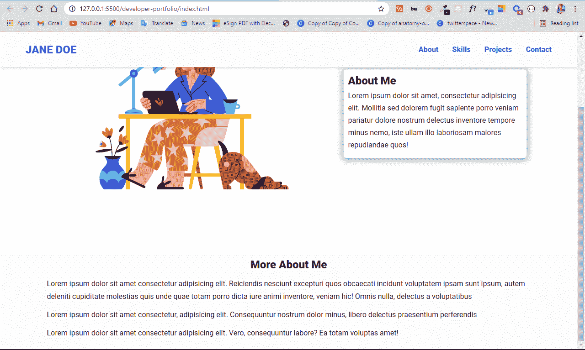

### 如何构建技能部分

从现场演示中，您将看到技能部分包含相关的技能，如 HTML、CSS、JavaScript 等。我可以从 Icons8 中获取这些语言的 SVG 图标。

本节的 HTML 样板在下面的代码片段中:

```
 <section class="skills" id="skills">
      <h2 class="skill-header">My Top Skills</h2>

      <div class="skills-wrapper">
        <div class="first-set animate__animated animate__pulse">
          
          
          
        </div>

        <div class="second-set animate__animated animate__pulse">
          
          
          
        </div>
      </div>
    </section> 
```

总共有六个图标。我没有将它们与 Flexbox 对齐，而是将它们分在两个位置(3 teach ),分为第一组和第二组，这样它们就可以相互重叠。这意味着我们将应用的样式将更具可读性。轻松点。

请注意，我已经将 loading 属性附加到各个图标和图像上，并将其设置为 lazy。这将确保图像仅在用户滚动到包含它们的部分时才被加载。这将随后加快加载时间，因为只有需要的才会被加载。

### 如何设计技能部分的样式

没有造型，技能部分看起来是这样的:
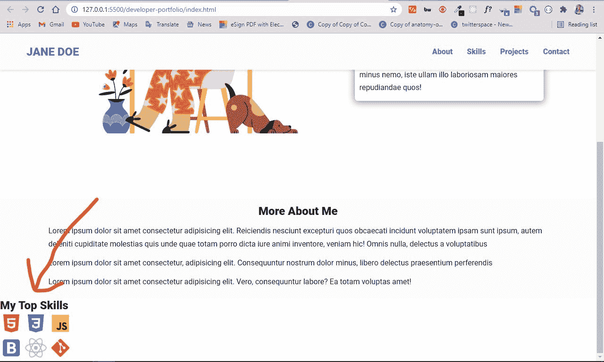

我们应该对该部分进行一点设计，因为它看起来还不够好:

```
.skills {
  max-width: 68.75rem;
  margin: auto;
  text-align: center;
  margin-top: 2.5rem;
}

.skill-header {
  margin-bottom: 1rem;
}

.skills-wrapper img {
  padding: 1.25rem;
}

.icon {
  width: 11.875rem;
  height: 11.25rem;
} 
```

在上面的 CSS 中，我为整个部分定义了一个最大宽度，以将内容推到中心，从而获得更好的用户体验。

我们应用的其他样式与清晰度和可读性有关。例如，我用宽度和高度属性增加了图标的大小，使它们更加明显。我还在所有的图标上添加了一个 16 像素的填充，让它们彼此分开一点点。

技能部分现在看起来很酷:
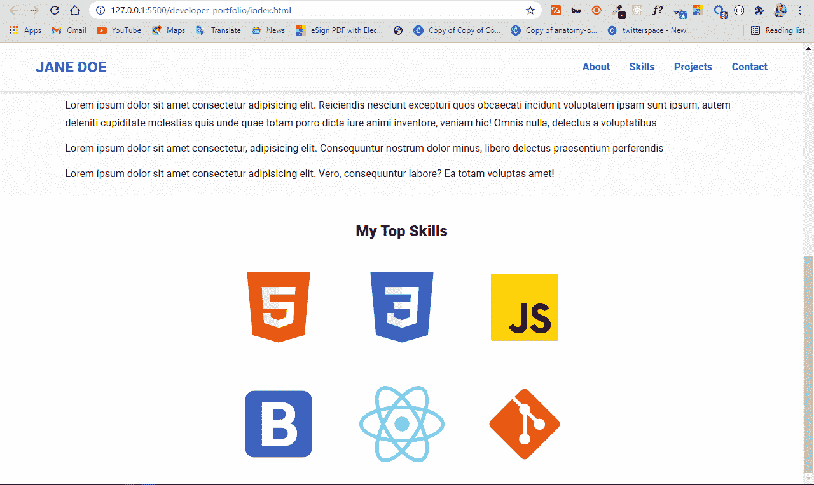

尽管如此，我认为这个部分可以做得更好，所以我决定对盒子阴影属性做一些调整。

请记住，在 HTML 中，有一个名为`.icon-card`的类属性附加在所有图标上。我将使用类名将所有图标放在一张卡片上:

```
.icon-card {
  background-color: #fff;
  border-radius: 11px;
  box-shadow: 0 3px 10px var(--secondary-shadow);
  padding: 20px;
  margin: 10px;
} 
```

技能部分看起来好多了:
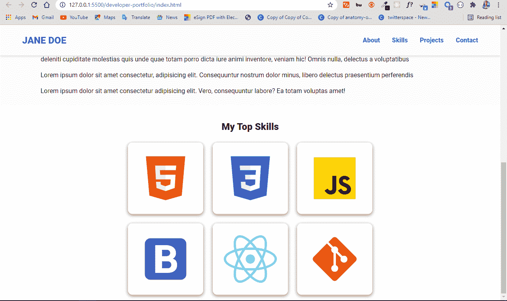
看那个！

### 如何构建项目部分

作品集网站的主要目的之一是展示你的项目。因此，我们需要建立一个部分来展示你在过去工作过的项目。

这一部分可能是最乏味的风格，但 Flexbox 不会停止成为我们的朋友。

这一部分的 HTML 在下面的代码片段中:

```
<section class="projects" id="projects">
      <h2 class="projects-title">Some of my Recent Projects</h2>
      <div class="projects-container">
        <div class="project-container project-card">
          
          <h3 class="project-title">Expense Tracker</h3>
          <p class="project-details">
            Lorem, ipsum dolor sit amet consectetur adipisicing elit. Quas
            ratione vel inventore labore commodi modi quos culpa aut saepe!
            Alias!
          </p>
          <a href="#" target="_blank" class="project-link">Check it Out</a>
        </div>
        <div class="project-container project-card">
          
          <h3 class="project-title">Netflix Clone</h3>
          <p class="project-details">
            Lorem, ipsum dolor sit amet consectetur adipisicing elit. Quas
            ratione vel inventore labore commodi modi quos culpa aut saepe!
            Alias!
          </p>
          <a href="#" target="_blank" class="project-link">Check it Out</a>
        </div>
        <div class="project-container project-card">
          
          <h3 class="project-title">Greeny Earth</h3>
          <p class="project-details">
            Lorem, ipsum dolor sit amet consectetur adipisicing elit. Quas
            ratione vel inventore labore commodi modi quos culpa aut saepe!
            Alias!
          </p>
          <a href="#" target="_blank" class="project-link">Check it Out</a>
        </div>
      </div>
    </section> 
```

查看 HTML，总共有三个项目，都在各自的 div 中，类名为 project-container 和 project-card。这些类名将有助于保持项目风格的一致性。

包含 section 元素本身有一个项目类，以及一个项目 id 属性。类名用于样式化，id 用于将它链接到导航栏上的项目链接。

这些项目有各自的图片，图片的类名为`project-pic`，标题的类名为`project-title`，更多的细节的类名为`project-details`，链接的类名为`project-link`。

给它们起唯一的类名的唯一目的是给它们设计风格。

这些是我刚开始做开发时自己参与的几个项目。

浏览器中的项目部分如下所示:
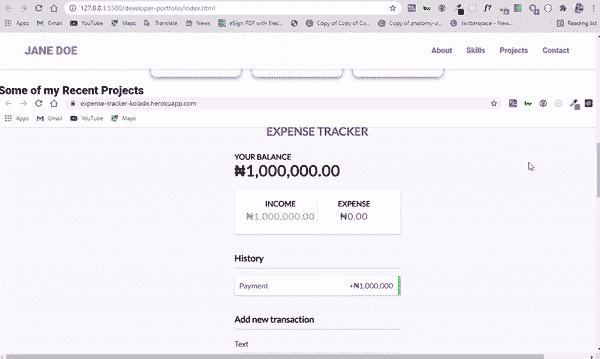

不过，这个部分看起来还不太好——甚至有一个由图像引起的烦人的水平滚动条。所以我们和 CSS 有很大的关系。

### 如何设置项目部分的样式

首先，我将通过设置我们在 CSS 变量中声明的灰色(- bg-color)作为值，给整个部分一个背景色。

我还将通过使用`project-pic`类来减小项目图像的宽度和高度。然后我会用 Flexbox 把项目并排放在一起。

```
.projects {
  background-color: var(--bg-color);
  padding: 32px 0;
  margin-top: 2rem;
}

.project-pic {
  width: 65%;
  height: 60%;
}

.projects-container {
  display: flex;
  align-items: center;
  justify-content: center;
} 
```

截面看起来好多了:
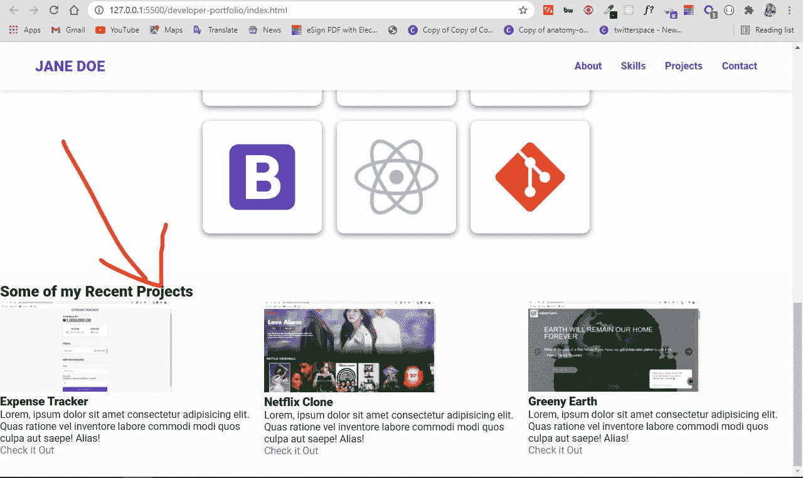

图像现在看起来更好了，但是项目标题、项目细节和项目链接需要在它们各自的容器中很好地对齐。

整个项目部分也需要推到中心。不过，你不需要 Flexbox 来做这件事——通过将 text align 属性设置为 center 值就可以做到:

```
.projects-title {
  text-align: center;
  margin-bottom: 1rem;
}

.project-container {
  text-align: center;
  width: 21.875rem;
  padding: 1rem;
} 
```

注意，我还为单个项目容器设置了宽度`21.875rem (350 pixels)`。这将把它们从侧面推开，以获得更好的用户体验。在这种情况下，用户不需要在看到所有东西之前到处看。

该部分现在看起来更好:
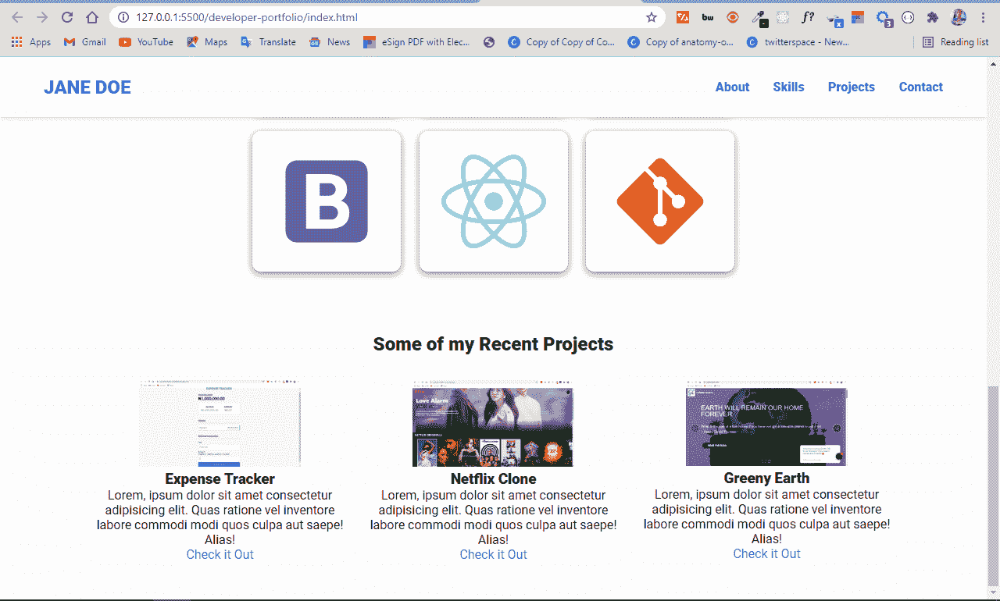

我们还可以把这部分做得更好。项目标题、项目细节和项目链接看起来都是堆在一起的，所以我们应该添加一些填充和边距。

单个项目容器也需要看起来更加独特。属性在这里将再次发挥作用，所以我将它们放在各自的卡片中。

```
.project-container p {
  padding: 0.4rem;
}

.project-title {
  margin-bottom: var(--bottom-margin);
}

.project-details {
  margin-bottom: var(--bottom-margin);
}

.project-card {
  background-color: #fff;
  border-radius: 11px;
  box-shadow: 0 3px 10px var(--primary-shadow);
  padding: 20px;
  margin: 10px;
} 
```

项目部分现在看起来好多了:
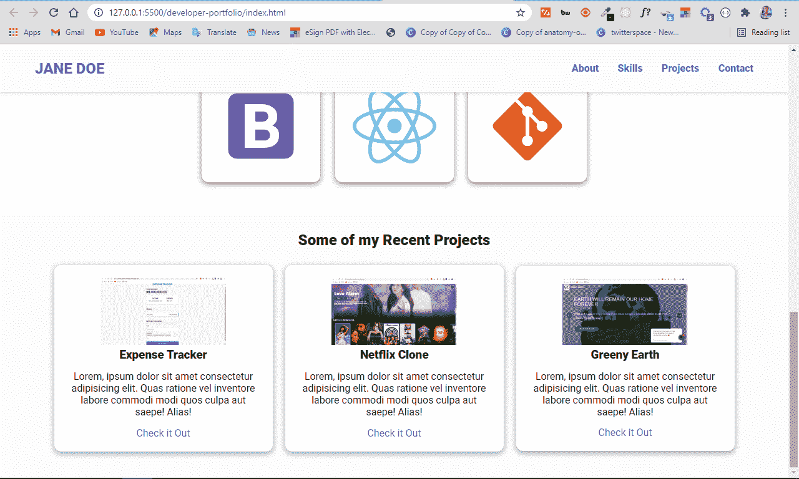

### 如何构建联系人部分

如果潜在的雇主或客户发现你的投资组合网站很有吸引力，他们可能会想联系你。因此，你需要在这一部分有一个联系表格，以及你的社交媒体简介的链接。

这一部分的 HTML 如下所示:

```
<section class="contact" id="contact">
      <h2>Get In Touch With Me</h2>
      <div class="contact-form-container">
        <div class="contact-form">
          <form action="https://formspree.io/f/xyylngw" method="POST">
            <div class="form-control">
              <label for="name">Name</label>
              <input
                type="text"
                id="name"
                name="sender-name"
                placeholder="Enter Your Name"
                class="input-field"
                required
              />
            </div>
            <div class="form-control">
              <label for="email">Email</label>
              <input
                type="email"
                id="email"
                name="sender-email"
                placeholder="Enter Your Email"
                class="input-field"
                required
              />
            </div>
            <div class="form-control">
              <label for="message">Message</label>
              <textarea
                id="message"
                cols="60"
                rows="10"
                placeholder="Enter Your Message"
                name="message"
                class="input-field"
                required
              ></textarea>
            </div>
            <input
              type="submit"
              value="Submit"
              id="submit-btn"
              class="submit-btn"
            />
          </form>
        </div>
      </div>
    </section> 
```

在这里，我们构建了一个联系人表单，其中包含姓名和电子邮件的输入字段，一个`textarea`以便人们可以输入要发送的消息，还有一个提交按钮用于提交消息以便您可以查看。

如果您仔细看看 form 元素，您会看到我将一个 action 属性设置为 Formspree 中的一个 URL。这是我提交表单时选择的。使用 Formspree，您可以直接在电子邮件收件箱中获取邮件，而不必使用复杂的 PHP 或 JavaScript 设置服务器。

请注意，您不能使用我的网址，它对您无效。你可以很容易地在 Formspree 网站上免费设置你自己的。我还在项目的 readme 文件中附加了一个关于如何设置 Formspree 的参考资料。

我已经为各个输入设置了一些`id`和`class`属性来设计它们的样式。所有输入字段还有一个`name`属性。这是 Formspree 表单提交服务所要求的。

为了获得基本的验证，我附加了一个`required`属性，所以如果用户没有填写任何输入字段，表单将拒绝提交。

### 如何设置联系人部分的样式

没有造型，接触部分一点都不好看:
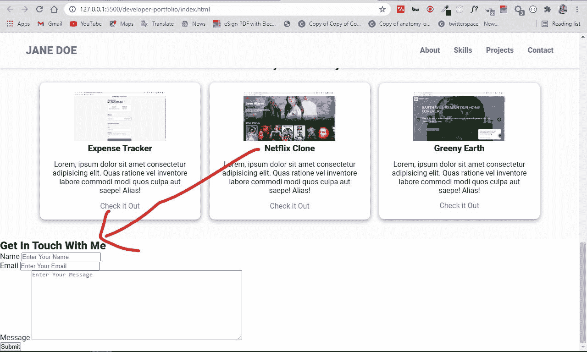

我在 CSS 中要做的就是将整个内容居中对齐，使输入字段看起来更好。

使用 text align 和 margin 属性，您可以将 h2 和 contact 窗体的容器居中对齐。

我还会将整个表单放在一个带有`box-shadow`属性的卡片中。

```
.contact {
  margin-top: 2rem;
}

.contact h2 {
  text-align: center;
  margin-bottom: var(--bottom-margin-2);
}

.contact-form-container {
  max-width: 40.75rem;
  margin: 0 auto;
  padding: 0.938rem;
  border-radius: 5px;
  box-shadow: 0 3px 10px var(--secondary-shadow);
} 
```

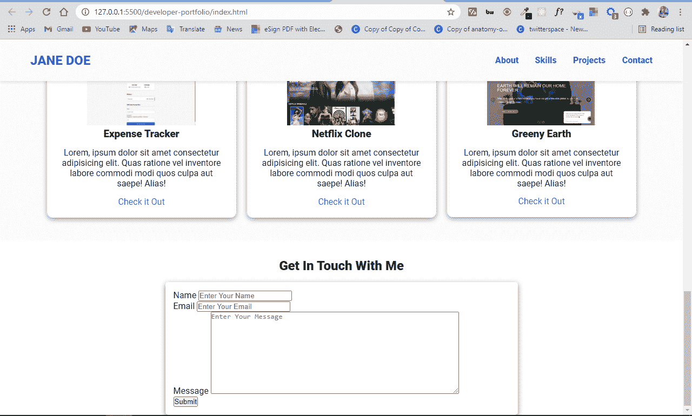

输入字段、文本区、标签和占位符肯定也需要一些样式来帮助对齐和清晰:

```
.contact-form-container label {
  line-height: 2.7em;
  font-weight: var(--bold-font);
  color: var(--primary-color);
}

.contact-form-container textarea {
  min-height: 6.25rem;
  font-size: 14px;
}

.contact-form-container .input-field {
  width: 100%;
  padding-top: 10px;
  padding-bottom: 10px;
  border-radius: 5px;
  border: none;
  border: 2px outset var(--primary-color);
  font-size: 0.875rem;
  outline: none;
} 
```

表单现在看起来更好了: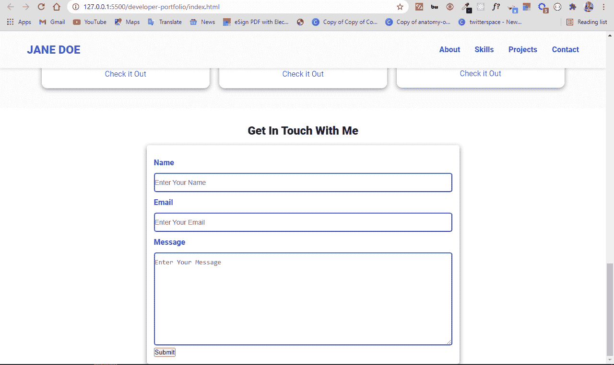

但是占位符与标签不一致。所以我们需要给它一个颜色和一些填充。我将在 CSS 变量列表中给它设置原色。

要为样式选择占位符，可以使用占位符伪类:

```
.input-field::placeholder {
  padding: 0.5rem;
  color: var(--primary-color);
} 
```

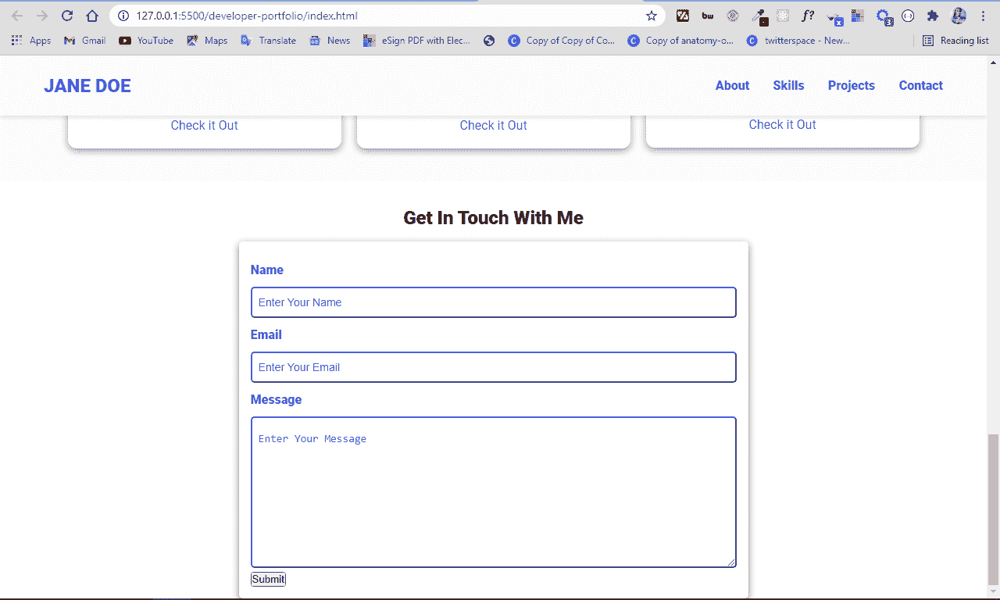

在联系人表单中，唯一剩下的事情就是设计按钮的样式。按钮很容易设计:

```
.submit-btn {
  width: 100%;
  padding: 10px;
  margin: 10px 0;
  background-color: #fff;
  border: 2px solid var(--primary-color);
  border-radius: 5px;
  font-size: 1rem;
  font-weight: var(--bold-font);
  transition: var(--transition);
} 
```

在上面的 CSS 代码片段中，我将按钮的宽度设为 100%,使其在表单容器中一直延伸。我还增加了一些填充、空白、边框和更粗的字体，让它更加清晰可见。

值为 5px 的`border-radius`属性去除了尖锐的边缘，当按钮处于悬停状态时，该过渡用来稍微减慢速度。

悬停状态在下面的 CSS 代码片段中定义:

```
.submit-btn:hover {
  background-color: var(--primary-color);
  border: 2px solid var(--primary-color);
  cursor: pointer;
} 
```

现在形态看起来好多了:
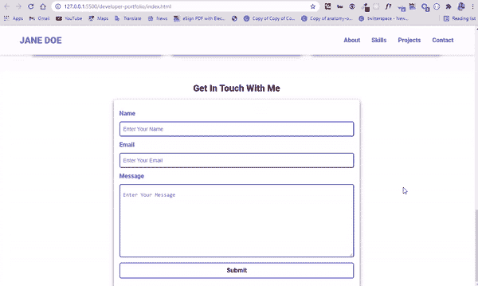

记住，在你的作品集网站上有你的社交媒体链接对任何想联系你的人来说都是加分的。这是我们下一步要做的事情，我们将以独特的方式去做。

社交按钮的 HTML 在下面的代码片段中:

```
 <div class="socials">
      <a href="#" target="_blank"
        ></a>
      <a href="#" target="_blank"
        ></a>
      <a href="#" target="_blank"
        ></a>
      <a href="#" target="_blank"
        ></a> 
```

我选择的社交图标是 icons8 中的动画 gif 图标。我把它们都放在一个带有类`socials`的容器中，并给它们一个单独的类`socicon`用于样式化。

看看下面一些向你眨眼的动画社交媒体图标:


### 如何设计社交图标

```
.socials {
  display: flex;
  flex-direction: column;
  position: fixed;
  right: 1%;
  bottom: 50%;
}

.socicon {
  width: 2rem;
  height: 2rem;
} 
```

有了上面的 CSS，社交图标将被固定在网页的右侧，这样任何访问网站的人无论滚动到哪里都能看到它们。

我还通过给图标分配所有减小的`width`和`height`属性值来减小图标的大小。


看那个！

剩下唯一要做的就是页脚了。除了为版权符号和心脏保留的字符实体之外，页脚 HTML 和 CSS 中没有什么复杂的东西:

```
<footer>
      <p class="copy">&copy; Copyright 2021</p>
      <p class="copy">
        Built with &#x2661; by
        <a href="https://twitter.com/koladechris" target="_blank"
          >Kolade Chris (Ksound)</a
        >
      </p>
</footer> 
```

```
footer {
  background-color: var(--bg-color);
  padding: 1.25rem;
  text-align: center;
  margin: 2rem 0 0;
} 
```

我们现在有一个成熟的投资组合网站！
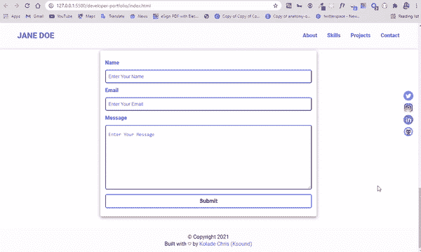

但是我们需要让它反应灵敏，因为它在更小的设备上不好看:
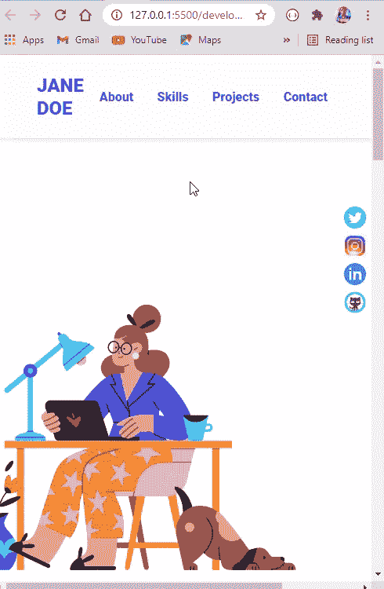

我们需要将各个部分的所有内容显示在另一个部分的顶部(在列布局中)。我们可以通过媒体查询和 Flexbox 轻松做到这一点。

在添加媒体响应查询之前，让我们用 HTML、CSS 和 JavaScript 实现一个滚动到顶部的按钮。

## 如何添加“滚动到顶部”按钮

### “滚动到顶部”按钮的 HTML

对于 HTML，我从 Icons8 获得了一个动画图标，并决定把它放在 I 标签中。

I 标签有一个用于样式化的类`scroll-up`和一个用于用 JavaScript 选择它的 id`scroll-up`。这是因为在我的项目中，我喜欢将类用于样式化，将 id 用于 JavaScript 功能。

```
 <i class="scroll-up" id="scroll-up"
      ></i> 
```

### 如何设计滚动到顶部图标的样式

我将使滚动到顶部的图标像社交图标一样固定。我还将赋予它一个指针的光标属性，这样当用户悬停在光标上时，光标就会改变。

将向上箭头类附加到滚动到顶部图标后，我还将增加图标的大小以提高可见性:

```
.scroll-up {
  position: fixed;
  right: 0.5%;
  bottom: 3%;
  cursor: pointer;
}

.up-arrow {
  width: 3rem;
  height: 3rem;
} 
```

图标好看:


但是它还没有做任何事情。所以我们需要用几行 JavaScript 代码让它发挥作用:

```
// scroll to top functionality
const scrollUp = document.querySelector("#scroll-up");

scrollUp.addEventListener("click", () => {
  window.scrollTo({
    top: 0,
    left: 0,
    behavior: "smooth",
  });
}); 
```

**上面的脚本在做什么？**

第一行选择了 HTML 中附加了 id 属性的 scroll-to-top 按钮。我们在这里使用了`querySelector()`方法。也可以用`getElementById()`的方法。

在剩下的几行中，我使用 click `eventListener`来获取用户的点击动作，并利用 windows 对象的`scrollTo`部分来使按钮起作用。

有了这个功能，当用户点击“滚动到顶部”按钮时，页面会平滑地滚动到网站的顶部和左侧。我这样做是通过设置顶部为`0`，左侧为`0`，行为为`smooth`。

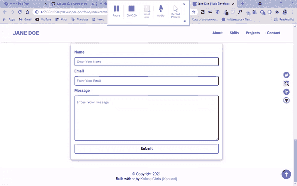

通过打开浏览器的开发人员工具控制台，您可以了解有关 windows 对象的更多信息。键入 window 并按 enter，然后您会看到 windows 对象中所有可用的内容，如下所示:

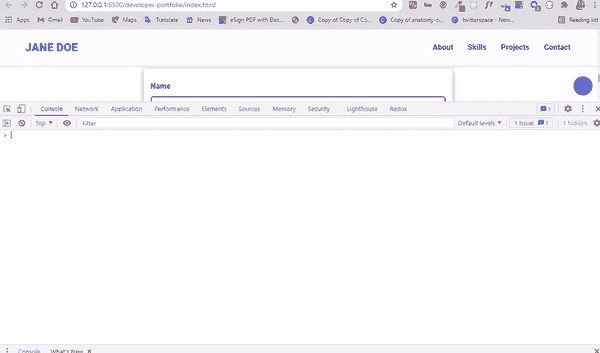

## 如何让你的作品集网站响应迅速

为了使网站反应迅速，我们将使用 CSS 媒体查询和 Flexbox。

首先，我们需要使图像和文本看起来更小，然后通过将`flex-direction`设置为 column，使每个部分的内容以垂直布局显示。

在媒体查询中，我将使用两个断点—`720px`和`420px`。

720px 断点适用于平板电脑和手机，420px 断点适用于像 iPhone 6 这样的小型手机和小型 Android 手机。

媒体查询断点是您希望网站内容根据设备宽度做出响应的点。因此，放在 720px 断点下的任何代码都会在屏幕小于或大于 720px 的设备上反射，这取决于您指定的是 max-width 还是 min-width。

在最大宽度为`720px`的情况下，媒体查询语法如下所示:

```
@media screen and (max-width: 720px) {
  /*changes reflects on screen with a width of 720px and below*/
} 
```

### 如何为平板电脑和手机创建媒体查询(最大宽度 720 像素)

我们将从导航条开始让网站响应，因为导航条在小设备上不好看。

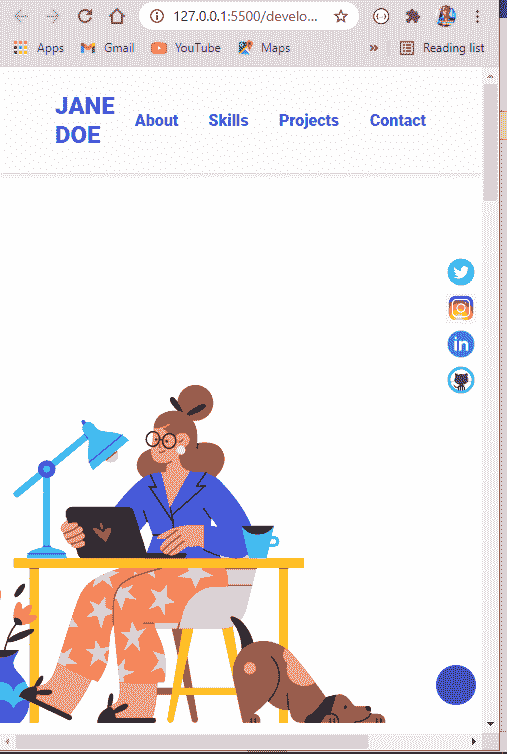

首先，我将减少导航条的填充，使`h1`图标和导航菜单项很好地适应:

```
nav {
    padding: 1.5rem 1rem;
  } 
```

事情现在看起来好一点:


在小型设备上，导航菜单项需要一个在另一个之上，并且需要隐藏起来。所以，是时候更新代码了，这样汉堡菜单最初是隐藏的。

### 如何制作汉堡菜单

要制作汉堡菜单，我们需要将导航菜单项从视口中取出。然后，我们需要在导航列表项上设置一个类`show`,它将用几行 JavaScript 切换(记住导航项在一个无序列表中)。

```
 nav ul {
    position: fixed;
    background-color: var(--bg-color);
    flex-direction: column;
    top: 86px;
    left: 10%;
    width: 80%;
    text-align: center;
    transform: translateX(120%);
    transition: transform 0.5s ease-in;
  }

   nav ul li {
    margin: 8px;
  } 
```

在上面的 CSS 代码片段中，我在无序列表(`ul`)上设置了一个位置 fixed，让它浮在屏幕上。我还用`top: 86px`从顶部向下推了 86px，向左 10%。

我给了它父元素(HTML 中的 nav 元素)80%的宽度，用`text-align: center`把它推到中间，最后用设置为`translateX(120%)`的 transform 属性隐藏它。这将把它推到右边，并迫使它离开视口。

现在，当用户点击显示导航项目时，它们都从右边滑入。太棒了。

如果你想让导航菜单项从左边滑入，将`transform`属性值改为 `transform: translateX(-120%)`(这与 `transform: translateX(120%)`正好相反)。就这么简单，看你的喜好了。

我也给导航项目分配了 8px 的边距，给它们更多的空间。

导航栏现在看起来是这样的:
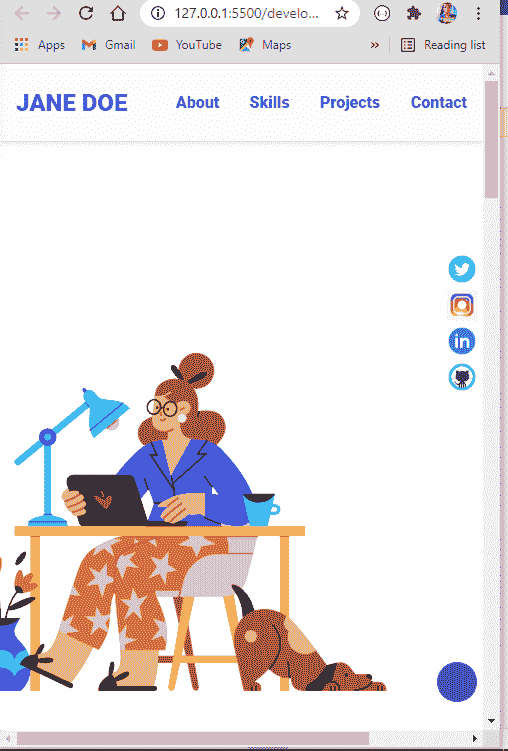

汉堡菜单栏保持隐藏状态。所以我们需要通过给它一个 block 的显示来显示它，设置一个 show 类在 x 轴上平移到 0 来显示它，然后用 JavaScript 切换它。

```
 .burger-menu {
    display: block;
  }

  nav ul.show {
    transform: translateX(0);
  } 
```

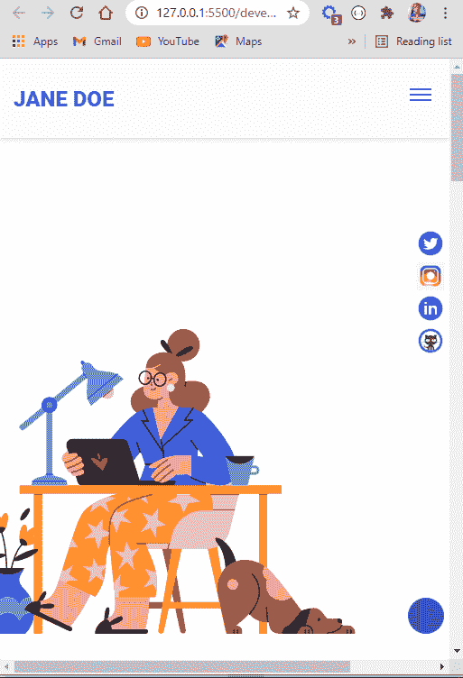

我们的汉堡菜单条现在显示出来了，但是导航项仍然隐藏着。为了展示它，我们需要用 JavaScript 打开和关闭 show 类。

### 汉堡菜单的 JavaScript

要用 JavaScript 打开和关闭导航条导航菜单项，我们首先需要选择导航条的所有相关项，并将它们存储在一些变量中:

```
// Nav hamburgerburger selections

const burger = document.querySelector("#burger-menu");
const ul = document.querySelector("nav ul");
const nav = document.querySelector("nav"); 
```

*   `burger`变量选择汉堡菜单栏
*   `ul`变量选择列表项(导航链接)
*   `nav`变量选择容器本身(导航元素)

接下来我们需要做的是当用户点击汉堡包菜单栏时切换`nav ul.show`类。我们将通过向 hamburger 菜单栏添加一个 click `eventListener`来实现，然后使用 toggle 方法来移除和添加`show`的类。

请记住，我们选择了它，并将其存储在一个名为`burger`的变量中。

```
burger.addEventListener("click", () => {
  ul.classList.toggle("show");
}); 
```

我们的导航项目现在可以切换开和关:
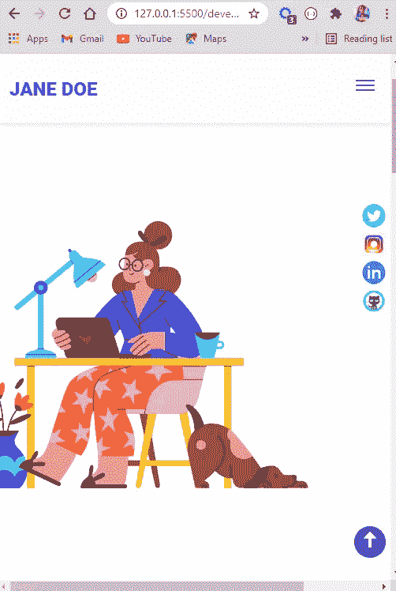

但是有一个问题——移动导航并不是在任何时候被点击的时候都是隐藏的。因此，我们需要在单击任何导航项目链接时删除 nav ul.show 类。

我们也可以用几行 JavaScript 来实现:

```
// Close hamburger menu when a link is clicked

// Select nav links
const navLink = document.querySelectorAll(".nav-link");

navLink.forEach((link) =>
  link.addEventListener("click", () => {
    ul.classList.remove("show");
  })
); 
```

记住导航链接有一个来自 HTML 的类`nav-link`。所以我用那个类选择了它们，并把它们放在一个名为 navLink 的变量中。我们用`querySelectorAll(`方法做到了这一点。

然后，我用`forEach`数组方法遍历所有链接，并监听所有链接上的点击事件。然后，我使用 DOM 提供的`remove()`方法，在任何导航菜单项被点击的时候删除`show`类。这将把所有列表项从视窗中取出。

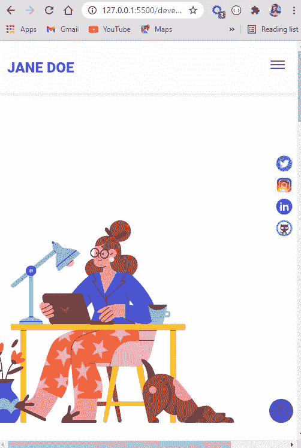

看那个！

那是许多工作。有了我们刚刚介绍的内容，你可以为任何网站制作汉堡菜单。

### 如何让英雄板块有求必应

英雄部分目前看起来不太好:
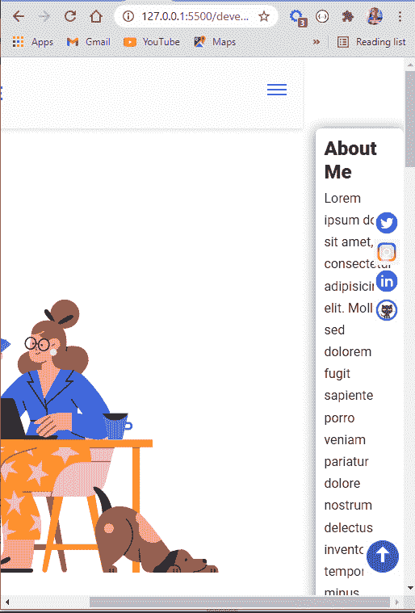

我们需要做的只是在媒体查询中给它一个 flex 方向的列，减少 Jane Doe 图像的宽度和高度，并使 About Me 文本(bio text)可读。

```
.hero {
    margin-top: -4rem;
    flex-direction: column;
    gap: 0;
  }

  .hero img {
        height: 37.5rem;
        width: 30rem;
    }

  .bio {
    margin-top: -7rem;
    width: 20.5rem;
  } 
```

英雄部分现在更好看:


### 如何使“更多关于我”部分更具响应性

“更多关于我”部分看起来不错，但我们肯定可以改进它:
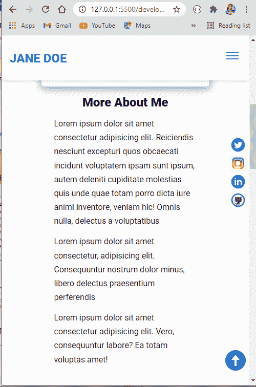

我使用了下面的 CSS 来使它更具可读性和可展示性:

```
 .more-about {
    margin-top: 2rem;
    padding: 1rem 3.5rem;
  }

  .more-about h2 {
    text-align: center;
  }

  .more-about p {
    text-align: justify;
  } 
```

我将整个部分向下推了一点，增加了所有边的填充，将`h2`居中对齐，并对齐文本。
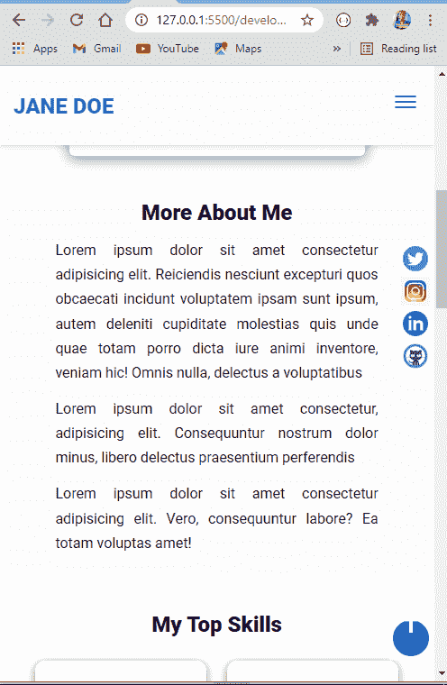

### 如何使技能部分反应灵敏

技能图标显得太大:
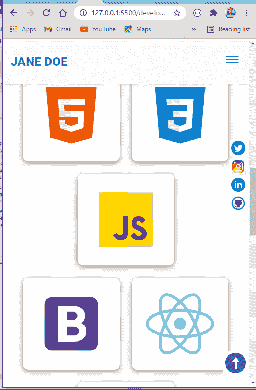

我们在媒体查询中需要做的就是用宽度和高度属性减小图标的大小:

```
.icon {
    width: 5.875rem;
    height: 5.25rem;
  } 
```

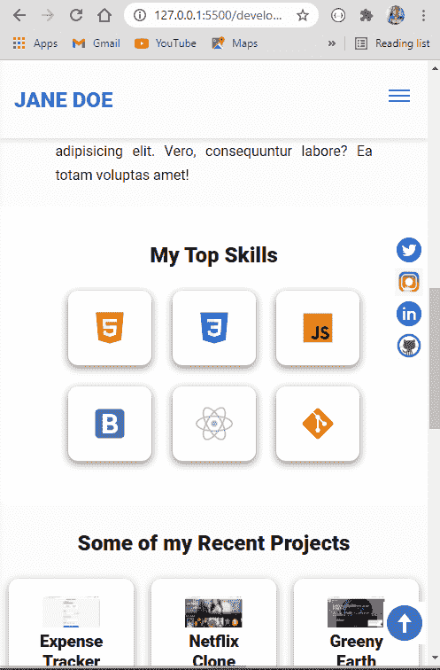

### 如何使项目科反应迅速

在 projects 部分，我们需要通过将 flex 方向设置为 column，使三个项目堆叠在一起。我还会将单个容器的宽度缩小一点。

```
 .projects-container {
    flex-direction: column;
  }

  .project-container {
    width: 20.875rem;
  } 
```

### 如何让联系方式有反应

联系人表单的宽度需要减少，以将其从两侧推开，并确保固定的社交媒体图标不在上面。

我们需要做的就是设置一个最大宽度:

```
 .contact-form-container {
    max-width: 23.75rem;
  } 
```

联系人表单现在看起来更好了:
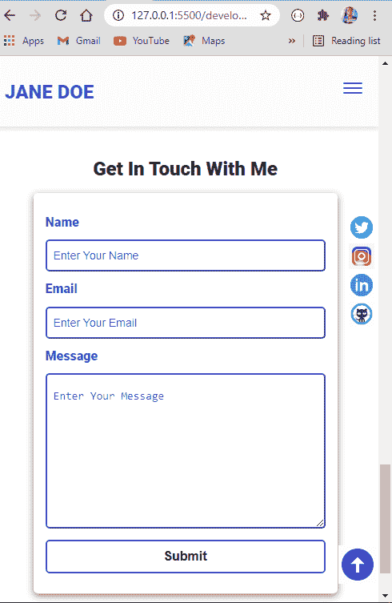

### 如何让网站在小手机上有反应

在 iPhone 6、7 和 8 plus 等小型手机上，社交图标和滚动到顶部图标不显示。还有一个水平滚动条。
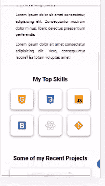

为了解决这些问题，我将在 420px 断点处添加一些媒体查询:

```
@media screen and (max-width: 420px) {
  .hero img {
    height: 37.5rem;
    width: 23rem;
  }

  .bio {
    width: 18.3rem;
  }

  .project-container {
    width: 17.875rem;
  }

  .contact-form-container {
    max-width: 17.75rem;
  }
} 
```

我缩小了我们的 Jane Doe 图像的大小，还缩小了 bio 文本(关于我的文本)、项目容器和 contact form 容器的宽度。

所有这些变化将使图标固定在网站显示的右侧——社交媒体和滚动到顶部图标。
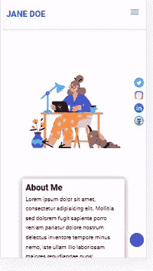

现在一切看起来都很好:
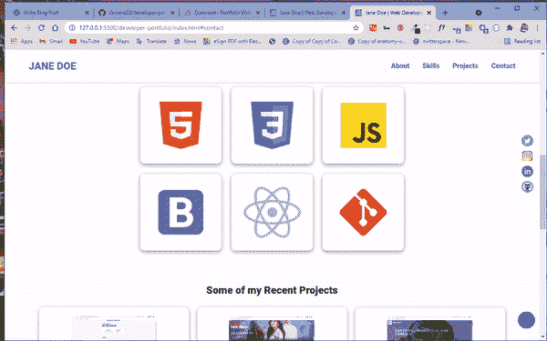

一切都结束了。我们有一个全面响应的投资组合网站。

你可以从这个 [GitHub repo](https://github.com/Ksound22/developer-portfolio) 下载完成版本的 zip 文件。

您也可以查看作品集网站的[现场演示](https://eager-williams-af0d00.netlify.app/?)。它有一个自述文件，包含有关我使用的工具的信息，以及如何定制网站。

## 结论

在本教程中，您了解了什么是开发者组合网站，以及为什么您应该拥有一个这样的网站。

您还学习了如何用 HTML、CSS 和 JavaScript 创建一个完全响应的作品集网站。

本教程的不同部分是一个个小项目，当它们组合在一起时，就变成了一个巨大的单页网站。例如，您可以设计卡片、响应菜单栏、功能联系人表单和滚动到顶部按钮，因为本教程涵盖了所有这些内容。

请根据您的喜好随意定制网站。

如果你觉得这个教程有用，可以分享给你的朋友和家人。我真的很感激。