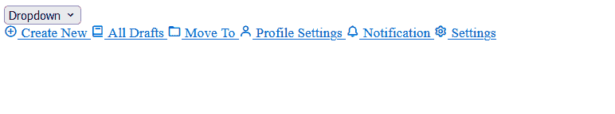
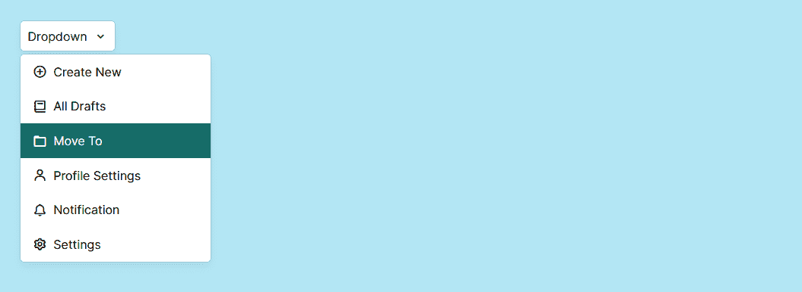
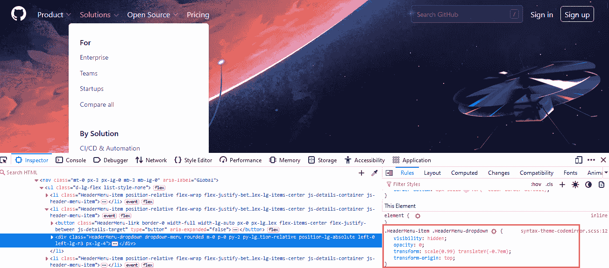
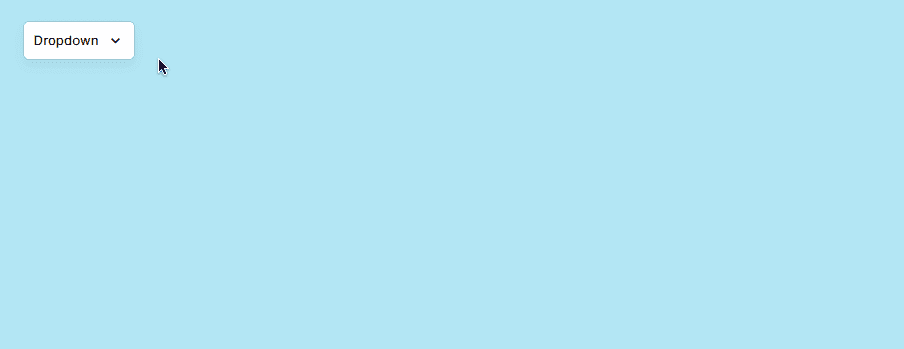

# 如何用 JavaScript 构建下拉菜单

> 原文：<https://www.freecodecamp.org/news/how-to-build-a-dropdown-menu-with-javascript/>

如果你使用互联网，你可能以前用过下拉菜单。它们主要服务于两个目的:在 web 表单中收集用户输入，以及在 web 应用程序中实现操作/导航菜单。

下拉是为相似的元素集合提供众多选项的最佳方式之一，而不需要牺牲应用程序的总体布局流程。除了 web 应用程序，它们也用于独立软件、操作系统等等。

在本指南中，您将学习如何使用 HTML、CSS 和 JavaScript 构建下拉导航菜单。

这是您将要构建的内容的截图。在本指南的最后，我将包含 codepen 文件，以便您可以使用它。


Final result of the dropdown menu

既然我们已经介绍了下拉菜单的基本原理，让我们来讨论如何创建一个下拉菜单的步骤。

## 步骤 1–为下拉列表添加标记

由于我们将在本指南中使用图标，我们需要首先导入它们。为了简单起见，我们将使用一个名为 [Boxicons](https://boxicons.com/) 的免费库。随意挑选你喜欢的其他选择。

有几种方法可以在你的站点中设置框图标。但是最简单的方法是在 HTML 文件的`head`中定义脚本标签，就像这样:

```
<head>
   <link 
     href="https://unpkg.com/boxicons@2.1.4/css/boxicons.min.css" 
     rel="stylesheet"
    />
 </head>
```

导入图标后，创建一个包含类`container`的`div`元素。这个元素将包含`button`和下拉菜单。

在容器内部，创建一个按钮元素，并给它一个类和 id`btn`。对于按钮，传入按钮文本和箭头图标。

这是按钮的标记。

```
<button class="btn" id="btn">
  Dropdown
  <i class="bx bx-chevron-down" id="arrow"></i>
</button>
```

接下来，我们将为下拉菜单本身添加标记。在按钮标签下面，创建一个`div`元素，并给它一个类和 id`dropdown`。在 div 元素中，为每个单独的下拉项目创建一个`a`标签，并传入它们各自的图标和文本。

下面是标记的样子:

```
<div class="dropdown" id="dropdown">
  <a href="#create">
    <i class="bx bx-plus-circle"></i>
    Create New
  </a>
  <a href="#draft">
    <i class="bx bx-book"></i>
    All Drafts
  </a>
  <a href="#move">
    <i class="bx bx-folder"></i>
    Move To
  </a>
  <a href="#profile">
    <i class="bx bx-user"></i>
    Profile Settings
  </a>
  <a href="#notification">
    <i class="bx bx-bell"></i>
    Notification
  </a>
  <a href="#settings">
    <i class="bx bx-cog"></i>
    Settings
  </a>
</div>
```

这是输出。



Dropdown menu markup preview

它看起来还不太好，所以让我们开始设计菜单吧。

## 步骤 2–设计下拉菜单的样式

首先，我们将重置页面上每个元素的默认边距和填充，并将一些值存储在变量中，以便我们可以在整个 CSS 文件中重用它。然后，我们将赋予 body 元素一些全局样式。

```
@import url(https://fonts.googleapis.com/css?family=Inter:100,200,300,regular,500,600,700,800,900);

* {
  margin: 0;
  padding: 0;
  box-sizing: border-box;
  font-family: "Inter", sans-serif;
  --shadow: rgba(0, 0, 0, 0.05) 0px 6px 10px 0px,
    rgba(0, 0, 0, 0.1) 0px 0px 0px 1px;
  --color: #166e67;
  --gap: 0.5rem;
  --radius: 5px;
}

body {
  margin: 2rem;
  background-color: #b3e6f4;
  font-size: 0.9rem;
  color: black;
}
```

下一步是设计按钮和下拉容器本身的样式。为了加快速度，我将只解释样式的重要部分。

复制下面的标记并粘贴到您的 CSS 文件中。

```
.btn {
  background-color: white;
  display: flex;
  align-items: center;
  justify-content: flex-start;
  column-gap: var(--gap);
  padding: 0.6rem;
  cursor: pointer;
  border-radius: var(--radius);
  border: none;
  box-shadow: var(--shadow);
  position: relative;
}

.bx {
  font-size: 1.1rem;
}

.dropdown {
  position: absolute;
  width: 250px;
  box-shadow: var(--shadow);
  border-radius: var(--radius);
  margin-top: 0.3rem;
  background: white;
}

.dropdown a {
  display: flex;
  align-items: center;
  column-gap: var(--gap);
  padding: 0.8rem 1rem;
  text-decoration: none;
  color: black;
}

.dropdown a:hover {
  background-color: var(--color);
  color: white;
}
```

因为下拉菜单通常放置在元素上，所以按钮是相对放置的，而下拉菜单是绝对放置的。这确保了两个元素彼此靠近，并且下拉菜单将放置在元素上。这样，当切换时，它不会影响页面的流动。

以下是输出结果:



Dropdown menu styling 

现在下拉菜单已经被设计好了，我们希望它只在按钮被点击时出现，而不是立即出现。为了隐藏它，我们将使用 CSS。

在之前的一篇文章中，我写了关于如何用 JavaScript 构建一个模态的文章，我们使用了`display: none`来隐藏视图中的模态元素。但是根据 MDN Docs 的说法，利用这个特性的缺点是它是不可动画化的。

因此，在本指南中，我们将采用不同的方法来隐藏下拉菜单。这包括将`visibility`和`opacity`属性组合在一起，以获得想要的结果。这就是 [GitHub](https://github.com) 实现下拉菜单的方法。



Dropdown menu on GitHub

在我们之前创建的 dropdown 类中，添加一个 visibility 属性，给它一个 hidden 值，并将不透明度设置为`0`。这样做将隐藏页面中的下拉菜单。

为了显示模态，我们将创建一个名为`show`的单独的类。这个类将保存 visibility 属性，其值为`visible`，不透明度为`1`。我们可以用 JavaScript 将这个类注入到模型中。

代码如下:

```
.dropdown {
  position: absolute;
  width: 250px;
  box-shadow: var(--shadow);
  border-radius: var(--radius);
  margin-top: 0.3rem;
  background: white;
  transition: all 0.1s cubic-bezier(0.16, 1, 0.5, 1);

  transform: translateY(0.5rem);
  visibility: hidden;
  opacity: 0;
}

.show {
  transform: translateY(0rem);
  visibility: visible;
  opacity: 1;
}

.arrow {
  transform: rotate(180deg);
  transition: 0.2s ease;
}
```

除了隐藏模态元素的样式之外，我们还添加了另一个类，用于在单击下拉按钮时旋转箭头图标。

## 步骤 3 —添加下拉功能

首先，让我们将各自的元素存储到变量中，以便它们可以重用。

```
const dropdownBtn = document.getElementById("btn");
const dropdownMenu = document.getElementById("dropdown");
const toggleArrow = document.getElementById("arrow");
```

下一步是创建一个函数来切换 dropdown 元素上的`show`类，并在单击按钮时旋转下拉箭头。我们将这个函数命名为`toggleDropdown`。

```
const toggleDropdown = function () {
  dropdownMenu.classList.toggle("show");
  toggleArrow.classList.toggle("arrow");
};
```

然后我们可以使用`addEventListener`方法在下拉按钮上调用这个函数。所以任何时候点击按钮，它都会触发控制显示和隐藏下拉菜单的功能。

```
dropdownBtn.addEventListener("click", function (e) {
  e.stopPropagation();
  toggleDropdown();
});
```

如果您注意到了，我们在 dropdown 函数中添加了一个`stopPropagation()`方法。这可以防止按钮元素的函数向下传递到父元素，从而阻止函数运行两次。在下一节中，您将会对此有更多的了解。

以下是输出结果:


dropdown menu toggle

## 如何在单击 DOM 元素时关闭下拉菜单

下拉菜单通常以四种不同的方式关闭:

*   通过点击激活它的按钮
*   通过点击它的任何子元素
*   通过单击菜单外部(在主体上)
*   通过点击退出或向下箭头键

但是对于本指南，让我们专注于前三个。

首先，我们将使用`document.documentElement`选择根元素`<html>`。和以前一样，我们将在里面传递`toggleDropdown()`函数。

但是这一次，我们想要定义一个条件来检查下拉菜单是否包含`show`类。只有在这种情况下，我们才希望触发关闭功能。

```
document.documentElement.addEventListener("click", function () {
  if (dropdownMenu.classList.contains("show")) {
    toggleDropdown();
  }
});
```

下面是最终结果:



Close dropdown when DOM element is clicked

这就是用 JavaScript 构建下拉菜单的方法。下面是测试这个下拉菜单的代码文件。

[https://codepen.io/evavic44/embed/eYKQJjJ?default-tab=html%2Cresult&theme-id=light](https://codepen.io/evavic44/embed/eYKQJjJ?default-tab=html%2Cresult&theme-id=light)

See the Pen [Dropdown menu](https://codepen.io/evavic44/pen/eYKQJjJ) by Eke ([@evavic44](https://codepen.io/evavic44)) on [CodePen](https://codepen.io).

## 结论

我真诚地希望你觉得这篇文章有趣或有用。如果你有，请与你的朋友分享或订阅我的博客，这样你就不会错过任何未来的帖子。感谢阅读。

[GitHub](https://github.com/evavic44) | [推特](https://twitter.com/victorekea) | [博客](https://eke.hashnode.dev) | [作品集](https://victoreke.com)