# 如何在 React Native 中构建翻转计时器

> 原文：<https://www.freecodecamp.org/news/how-to-build-a-flip-timer-in-react-native-e208e54baf58/>

英国瓦伊迪亚

# 如何在 React Native 中构建翻转计时器

Photo by [Vico Luna](https://unsplash.com/@vicolunna?utm_source=medium&utm_medium=referral) on [Unsplash](https://unsplash.com?utm_source=medium&utm_medium=referral)

### 介绍

一个*翻转计时器*是一个数字计时装置，时间由数字指示，数字由一个分瓣显示器顺序显示。

本文将演示在 React Native 中使用其公开的 API 构建一个*翻转计时器*，并且没有额外的依赖。

### 需要克服的挑战

*   使用你的 ***大学数学课程*** 矩阵技术实现`transform-origin`属性，因为它在 React Native 中不受支持。围绕中心原点旋转(默认情况下)很容易，但我们需要平移原点并围绕边缘旋转。
*   翻转数字组件的实现。
*   克服 android 中的`overflow: hidden`问题，因为它不支持绝对定位的元素。

### 内容

1.  **实现翻转编号组件**
2.  **实现文件夹视图**

*   基本布局
*   克服挑战
*   添加转换
*   添加动画

3.**更新定时器组件**

4.**最终结果**

5.**链接**

### 实现翻转数字组件

#### 基本布局

基本布局由两张卡片组成——上部和下部连接在一起，这样视图看起来就像一个翻转计时器。

**号码卡**

这是一个基本的布局，由一个包装和两张卡片组成— *下层*，*上层。*

**注**:下一张牌加上了之前的号码。一旦我们实现了*文件夹视图*，它的用途就会显现出来。

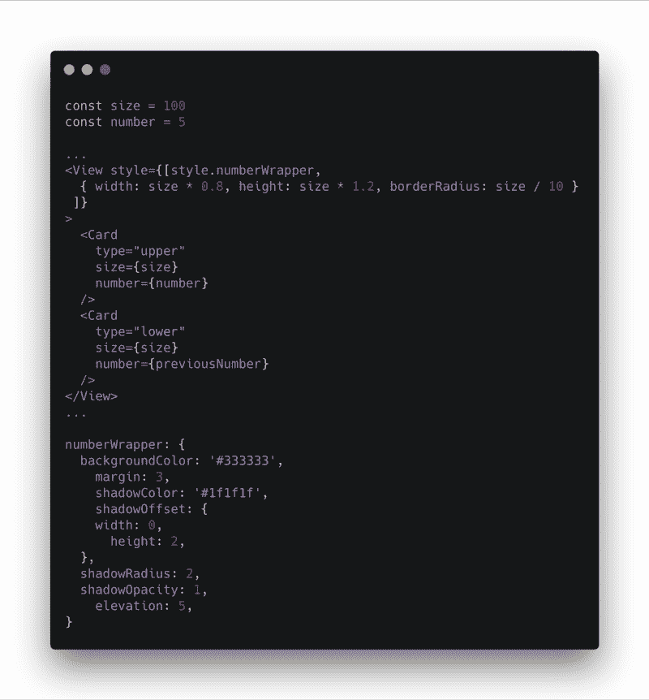

Image Credit: [Carbon](https://github.com/dawnlabs/carbon). | Code: [GitHub](https://github.com/pritishvaidya/react-native-flip-timer/blob/master/src/components/flip-number/number-card.js)

**卡**

卡片的包装上有`overflow: hidden`，我们根据卡片的类型(大写或小写)翻译它的项目(数字)。

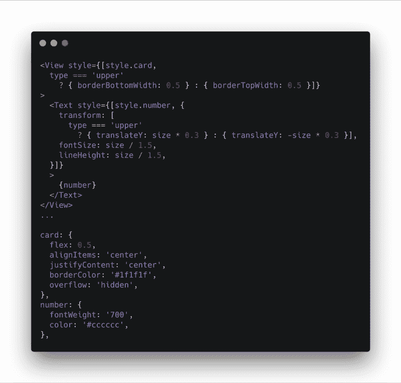

Image Credit: [Carbon](https://github.com/dawnlabs/carbon). | Code: [GitHub](https://github.com/pritishvaidya/react-native-flip-timer/blob/master/src/components/flip-number/card.js)

### 实现文件夹视图

#### 基本布局

为了构建 FoldView，我们需要两张 *FlipCards* 类似于*数字卡*，但是有*绝对定位*，这样当应用翻转动画时，它们就在*数字卡*的上方。

**号码卡**

将 *FlipCard* 组件添加到 *NumberCard* 组件中。

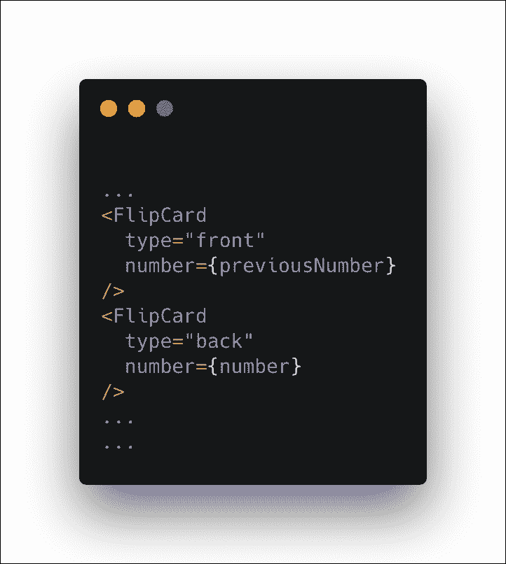

Image Credit: [Carbon](https://github.com/dawnlabs/carbon). | Code: [GitHub](https://github.com/pritishvaidya/react-native-flip-timer/blob/master/src/components/flip-number/number-card.js)

**翻牌**

FlipCard 组件是一个动画包装器，在应用翻转动画时使用绝对定位。

**挑战(下篇和下篇)** : `overflow: hidden`绝对定位*安卓出现重大问题。*使用这个 [StackOverflow](https://stackoverflow.com/a/21684490/6606831) post，可以通过在绝对定位元素内部使用一个*溢出容器*来解决。

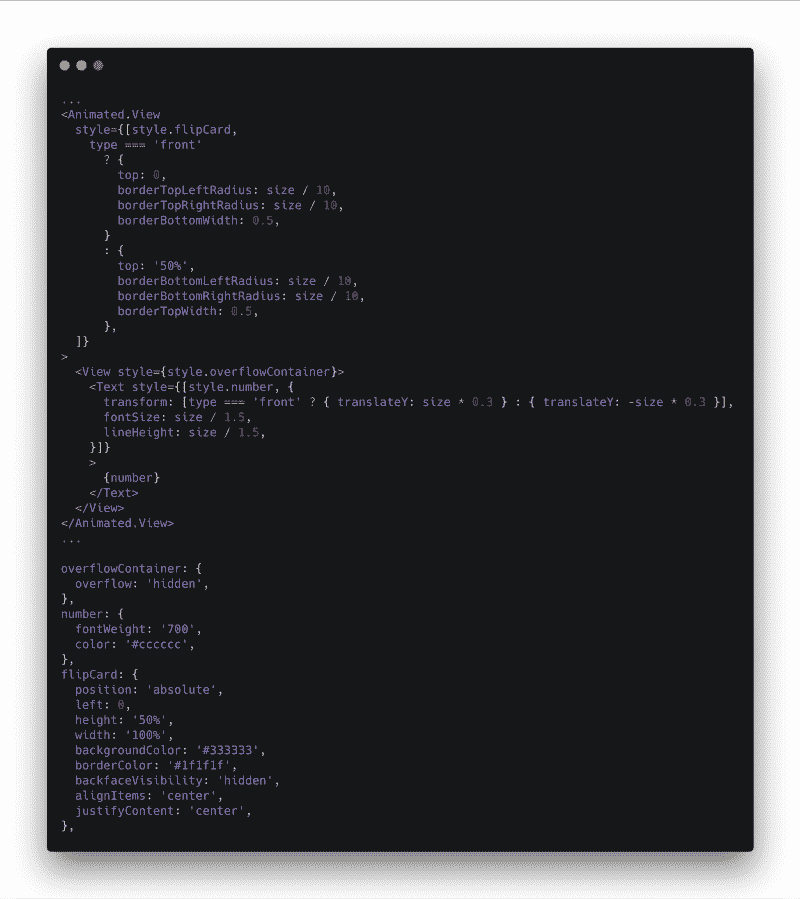

Image Credit: [Carbon](https://github.com/dawnlabs/carbon). | Code: [GitHub](https://github.com/pritishvaidya/react-native-flip-timer/blob/master/src/components/flip-number/flip-card.js)

#### 决赛成绩

#### 克服挑战

现在是困难的部分。我们需要添加沿边缘折叠 FlipCard 组件。

由于 React Native 不支持`transform-origin`属性，我们需要找到一些其他方法来移动底部边缘上的旋转原点。

幸运的是，有一种方法可以克服这个问题。根据这篇牛逼的[文章](https://commitocracy.com/implementing-foldview-in-react-native-e970011f98b8)和阅读 [MDN](https://developer.mozilla.org/en-US/) 文档中的 [transform-origin](https://developer.mozilla.org/en-US/docs/Web/CSS/transform-origin) 属性，它可以使用**矩阵来实现。**

**Utils**

React Native 在 [MatrixMath.js](https://github.com/facebook/react-native/blob/master/Libraries/Utilities/MatrixMath.js) 中公开了几个矩阵操作。我们需要的最重要的是

*   **单位矩阵:**返回一个 4 * 4 的单位矩阵`[1, 0, 0, 0, 0, 1, 0, 0, 0, 0, 1, 0, 0, 0, 0, 1]`

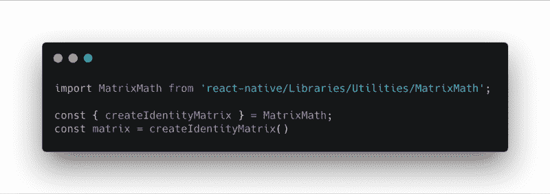

Image Credit: [Carbon](https://github.com/dawnlabs/carbon). | Code: [GitHub](https://github.com/pritishvaidya/react-native-flip-timer/blob/master/src/utils/index.js)

*   **乘法矩阵:**该实用方法基于作为输入提供的 4*4 矩阵`a`和`b`的乘法生成输出。

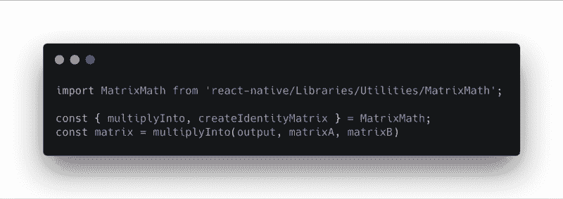

Image Credit: [Carbon](https://github.com/dawnlabs/carbon). | Code: [GitHub](https://github.com/pritishvaidya/react-native-flip-timer/blob/master/src/utils/index.js)

*   **Rotate Matrix:** 这是一个定制的实用方法，它采用一个 4*4 的矩阵和它将被旋转的角度，然后将其乘以原始矩阵以返回生成的结果。

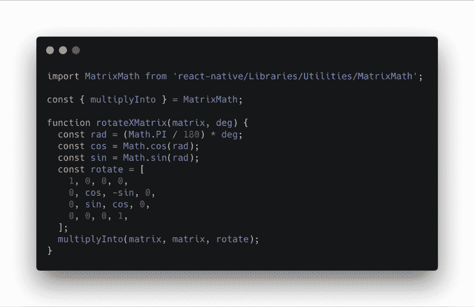

Image Credit: [Carbon](https://github.com/dawnlabs/carbon). | Code: [GitHub](https://github.com/pritishvaidya/react-native-flip-timer/blob/master/src/utils/index.js)

*   **透视矩阵:**这个实用方法将允许我们使用透视样式来原生反应，然后乘以原始的 4*4 矩阵。

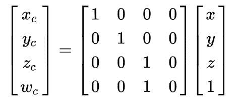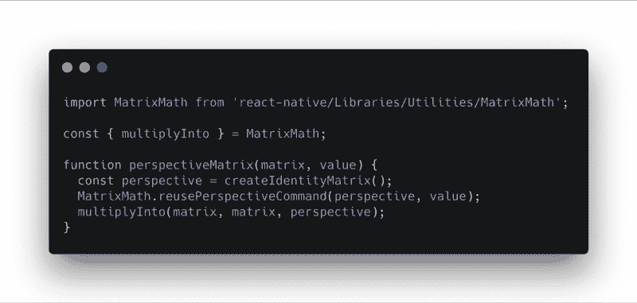

Image Credit: [Carbon](https://github.com/dawnlabs/carbon). | Code: [GitHub](https://github.com/pritishvaidya/react-native-flip-timer/blob/master/src/utils/index.js)

*   **平移矩阵:**该实用方法将平移原点并修改原始的 4*4 矩阵

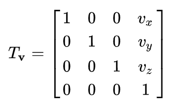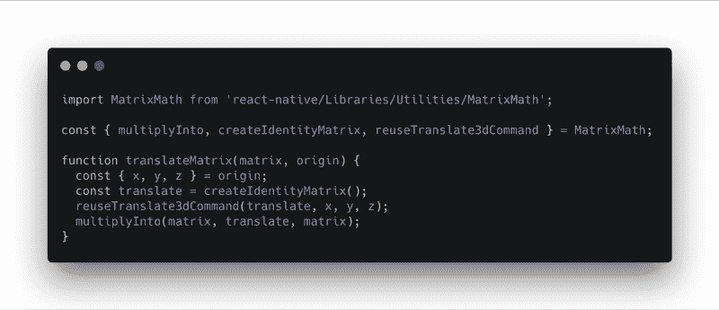

Image Credit: [Carbon](https://github.com/dawnlabs/carbon). | Code: [GitHub](https://github.com/pritishvaidya/react-native-flip-timer/blob/master/src/utils/index.js)

*   **解平移矩阵:**该实用方法将解平移原点并修改原始的 4*4 矩阵

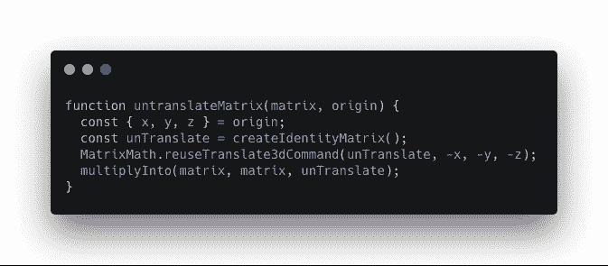

Image Credit: [Carbon](https://github.com/dawnlabs/carbon). | Code: [GitHub](https://github.com/pritishvaidya/react-native-flip-timer/blob/master/src/utils/index.js)

#### 添加转换

`deg`是旋转的角度，而`y`是组件平移的高度。

**挑战(第一部分)**:结合上面的 utils，`transform-origin`成功实现。

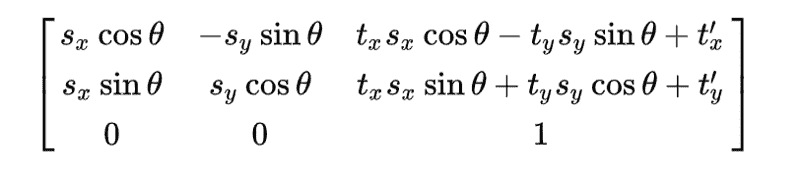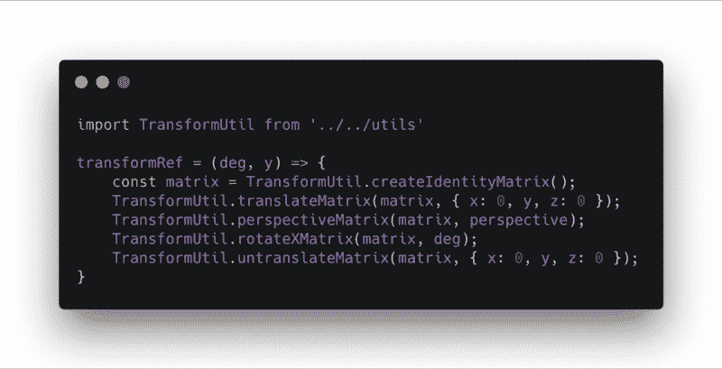

Image Credit: [Carbon](https://github.com/dawnlabs/carbon). | Code: [GitHub](https://github.com/pritishvaidya/react-native-flip-timer/blob/master/src/components/timer.js)

#### 添加动画

Image Credit: [Carbon](https://github.com/dawnlabs/carbon). | Code: [GitHub](https://github.com/pritishvaidya/react-native-flip-timer/blob/master/src/components/timer.js)

### 更新计时器组件

#### 添加时间效用

这个实用程序将增加一秒钟的计时器，并调整小时，分钟，秒。

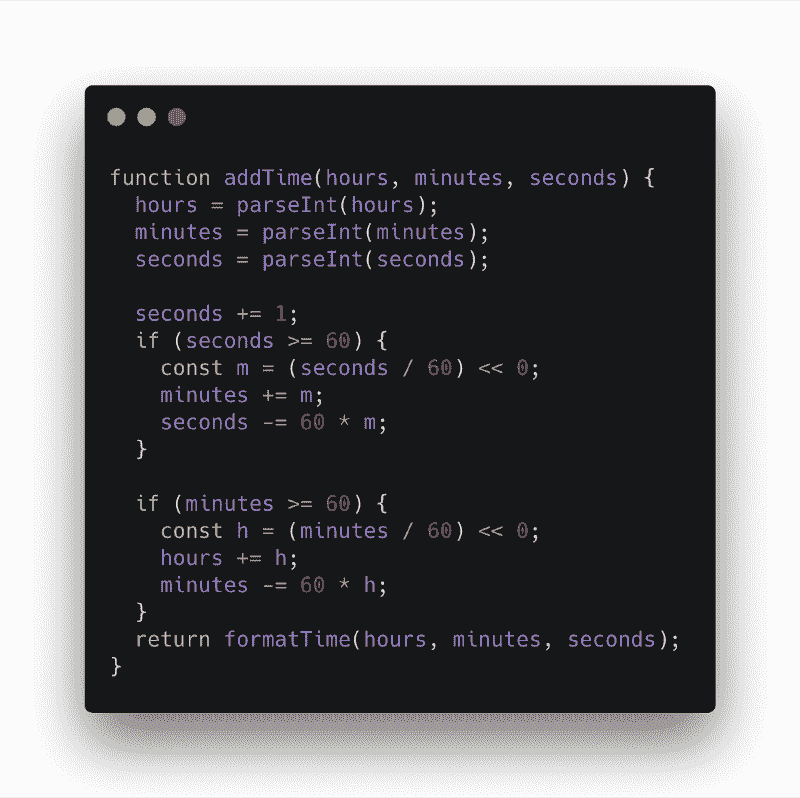

Image Credit: [Carbon](https://github.com/dawnlabs/carbon). | Code: [GitHub](https://github.com/pritishvaidya/react-native-flip-timer/blob/master/src/utils/index.js)

#### 计时器组件

计时器组件将调用 **Time Util** 并根据小时、分钟、秒更新组件

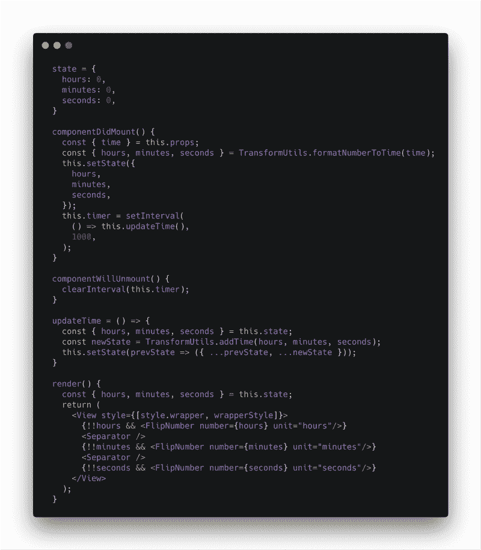

Image Credit: [Carbon](https://github.com/dawnlabs/carbon). | Code: [GitHub](https://github.com/pritishvaidya/react-native-flip-timer/blob/master/src/components/timer.js)

#### 翻转数字组件

该组件只是根据数字位置将数字分成两部分，并调用 **NumberCard** 组件。

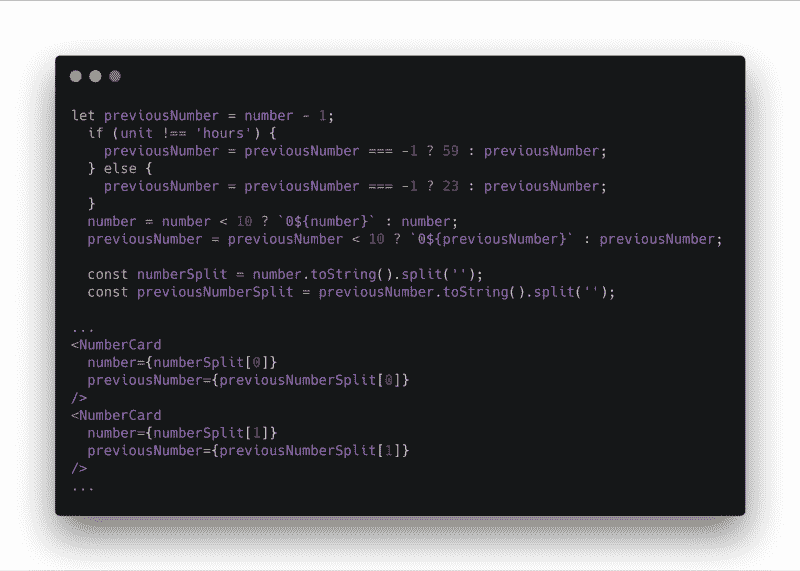

Image Credit: [Carbon](https://github.com/dawnlabs/carbon). | Code: [GitHub](https://github.com/pritishvaidya/react-native-flip-timer/blob/master/src/components/flip-number/index.js)

### 决赛成绩

### 链接

我已经为它发布了一个包含更多可定制属性的包。

*   npm : [反应原生翻转定时器](https://www.npmjs.com/package/react-native-flip-timer)
*   GitHub:[react-native-flip-timer](https://github.com/pritishvaidya/react-native-flip-timer)

更多酷的东西可以在我的[***stack overflow***和](https://stackoverflow.com/users/6606831/pritish-vaidya)[***GitHub***](https://github.com/pritishvaidya)*个人资料中找到。*

*关注我关于[***LinkedIn***，](https://www.linkedin.com/in/pritish-vaidya-506686128/) [***中***](https://medium.com/@pritishvaidya94) ， [***推特***](https://twitter.com/PritishVaidya) 进一步更新新文章。*

*一拍，二拍，三拍，四十？*

**

**原载于 2019 年 3 月 2 日[blog.pritishvaidya.com](https://blog.pritishvaidya.com/posts/2019-03-02-building-a-flip-timer-in-react-native/)。**