# 如何在 Nextjs 中用 Supabase、React 和 Tailwind CSS 构建全栈应用

> 原文：<https://www.freecodecamp.org/news/how-to-build-a-full-stack-application-with-tailwind-css-and-supabase-in-nextjs/>

无服务器数据库最近很流行。它们允许你开发一个全功能的应用程序，而无需构建服务器或编写服务器代码。

无服务器数据库是一种云计算解决方案，可以让您分发和灵活管理您的资源。

在本教程中，我们将使用 Next.js 中的 Supabase、React 和 TailwindCSS 构建一个全栈应用程序。

### 概述

*   什么是 Supabase？
*   为什么要用 Supabase？
*   如何建立一个超级项目
*   如何设置我们的前端应用程序
*   如何用 Supabase 客户端构建我们的前端应用程序布局
*   如何构建我们的应用程序
*   结论
*   资源

### 先决条件

*   React.js 实践经验
*   异步函数的基本知识
*   GitHub 账户

## 什么是 Supabase？

Supabase 是一个基于 PostgreSQL 的开源无服务器数据库，允许你在几分钟内为你的应用构建一个实时后端。

PostgreSQL 是一个对象关系数据库系统，已经被积极开发了 25 年以上，并以其可靠性和性能而闻名。

Supabase 包括几项现成的服务/功能，旨在让您的生活更加轻松。这些包括但不限于以下内容:

*   证明
*   实时数据库
*   UI 组件
*   RLS(行级安全性)

### 为什么要用 Supabase？

*   Supabase 负责缩放(即使它使用 SQL 数据库)。
*   虽然 Supabase 是基于 PostgreSQL 的，但是数据迁移很容易。
*   与 Firebase 不同，您可以运行复杂的查询或文本搜索。

## 步骤 1:如何建立一个 Supabase 项目

本节将构建我们的项目并将 Supabase 集成到我们的应用程序中。

### 注册一个 Supabase 帐户并创建一个项目

首先，让我们在这里注册一个 Supabase 账户[。若要继续，您需要一个 GitHub 帐户。如果你还没有 GitHub 的账户，你可以在这里注册](https://api.supabase.io/platform/login)。

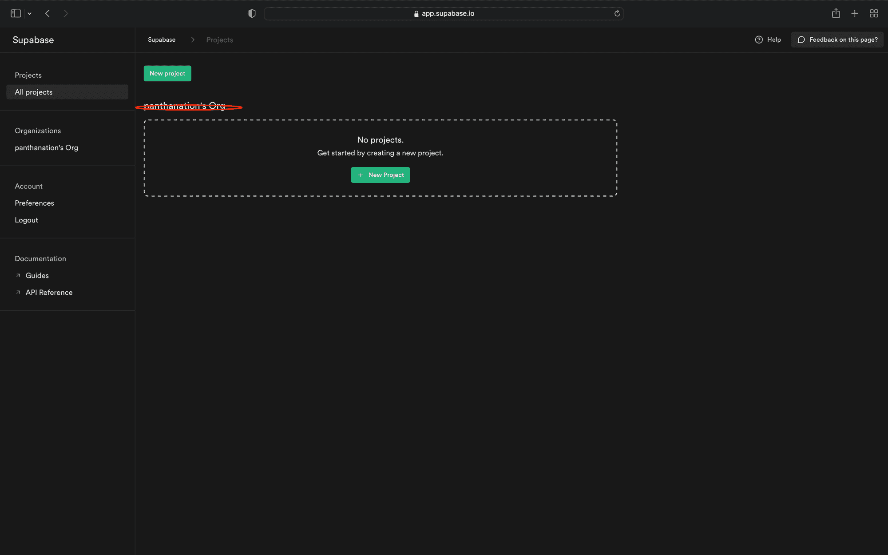

登录后，我们被重定向到我们的控制面板，如上面的屏幕截图所示。

接下来，我们现在可以点击`New Project`按钮为我们的演示应用程序创建一个新项目，如下所示:

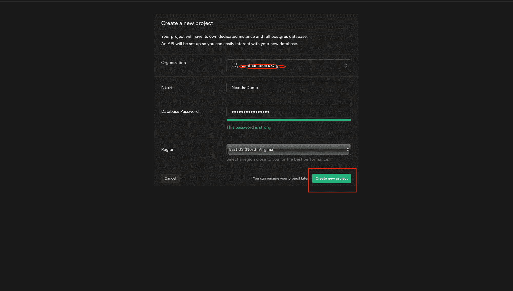

然后我们会看到下面的屏幕，它显示项目现在正在构建。

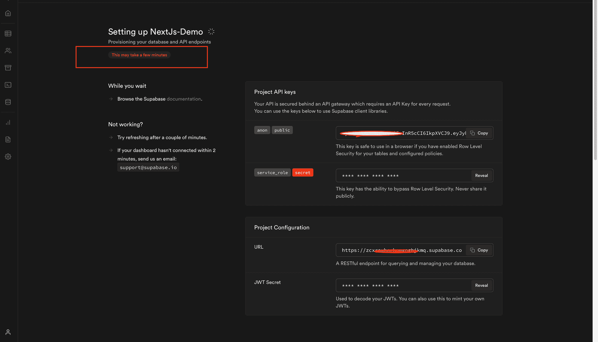

接下来，我们需要通过点击工具条上显示的数据库图标来创建我们的数据库。我们还需要单击屏幕右上方显示的加号图标来制作我们需要的每一列，如下所示。

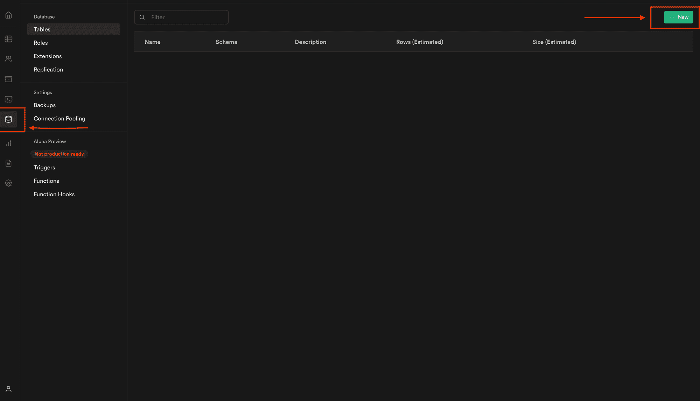

### 如何创建我们的应用程序所需的列

对于这个 todo 项目，我们将创建五列:

*   `Name`:类型为`text.`
    `Activity`的任务名称:与类型`text.`相关的任务活动
*   `StartDate`:这是任务预计以`date.`类型开始的时间
*   `EndDate`:预计任务结束的日期，类型为`date.`

创建完所有这些字段后，我们应该会看到类似下面的内容。

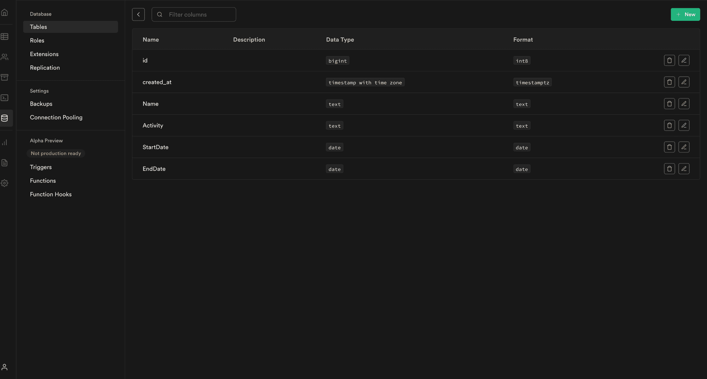

我们已经创建了项目并创建了单独的列。在下一节中，我们将通过设置我们的前端应用程序来进行下一步。

## 步骤 2:设置我们的前端应用程序

为了创建一个新项目，我们使用`npx create-next-app -e with-tailwindcss .`命令在我们选择的目录中搭建一个新项目。

上面指定的命令在 Next.js 中设置了一个 TailwindCSS 项目。

TailwindCSS 是一个 CSS 框架，包含了很多帮助我们设计网站风格的类。

我们使用以下命令来安装依赖项:

```
 cd <project name> 
    yarn add @supabase/supabase-js 
```

在创建应用程序并安装依赖项后，我们将看到一条消息，其中包含浏览我们的站点并在本地运行它的说明。使用下面的命令，我们可以执行这个。

```
 npm run dev 
```

Next.js 将在 [http://localhost:3000](http://localhost:3000) 启动一个默认可访问的热重装开发环境。

我们应该会看到类似下面的内容。

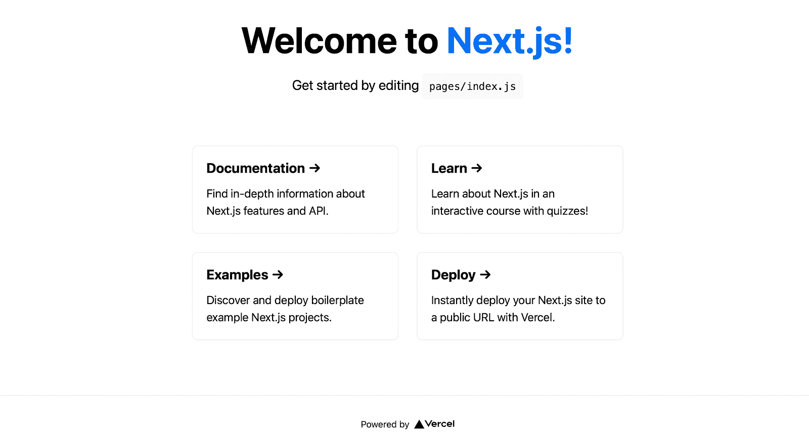

## 步骤 3:用 Supabase 客户端构建我们的前端应用程序布局

我们现在可以构建我们的前端应用程序了，因为我们已经完成了前端设置。

让我们更新我们的`pages/index.js`文件，以包含以下代码:

```
import Head from "next/head";

export default function Home() {
  return (
    <div className="flex flex-col items-center justify-center py-2">
      <div>
        <Head>
          <title>Supabase and NextJs Demo</title>
          <link rel="icon" href="/favicon.ico" />
        </Head>

        <main className="flex flex-col items-center justify-center w-full flex-1 px-20 text-center">
          <h1 className="text-4xl font-bold mt-20">
            <a className="text-blue-600" href="/">
              Full Stack Application With Tailwind CSS and Supabase in NextJs
            </a>
          </h1>

          <div className="flex flex-wrap items-center justify-around max-w-4xl mt-6 sm:w-full">
            <div className="p-8 mt-6 border w-96 rounded-xl hover:text-blue-600 focus:text-blue-600">
              <div className="w-full max-w-sm">
                <form className="bg-white rounded px-8 pt-6 pb-8 mb-4">
                  <div className="mb-4">
                    <label
                      className="block text-gray-700 text-sm font-bold mb-2"
                      htmlFor="taskName"
                    >
                      Task Name
                    </label>
                    <input
                      className="shadow appearance-none border rounded w-full py-2 px-3 text-gray-700 leading-tight focus:outline-none focus:shadow-outline"
                      id="taskName"
                      type="text"
                    />
                  </div>
                  <div className="mb-4">
                    <label
                      className="block text-gray-700 text-sm font-bold mb-2"
                      htmlFor="taskActivity"
                    >
                      Task Activity
                    </label>

                    <textarea
                      className="form-textarea mt-1 block shadow appearance-none border rounded w-full py-2 px-3 text-gray-700 leading-tight focus:outline-none focus:shadow-outline"
                      rows="3"
                      placeholder="Task Activity"
                    ></textarea>
                  </div>

                  <div className="mb-4">
                    <label
                      className="block text-gray-700 text-sm font-bold mb-2"
                      htmlFor="startDate"
                    >
                      Task Start Date
                    </label>
                    <input
                      className="shadow appearance-none border rounded w-full py-2 px-3 text-gray-700 leading-tight focus:outline-none focus:shadow-outline"
                      id="startDate"
                      type="date"
                    />
                  </div>
                  <div className="mb-4">
                    <label
                      className="block text-gray-700 text-sm font-bold mb-2"
                      htmlFor="endDate"
                    >
                      Task End Date
                    </label>
                    <input
                      className="shadow appearance-none border rounded w-full py-2 px-3 text-gray-700 leading-tight focus:outline-none focus:shadow-outline"
                      id="endDate"
                      type="date"
                    />
                  </div>
                  <div className="flex items-center justify-between">
                    <button
                      className="bg-blue-500 hover:bg-blue-700 text-white font-bold py-2 px-4 rounded focus:outline-none focus:shadow-outline"
                      type="button"
                    >
                      Add Task
                    </button>
                  </div>
                </form>
              </div>
            </div>

            <div className="p-2 mt-6 w-96 rounded-xl focus:text-blue-600">
              <table className="shadow-lg bg-white">
                <tbody>
                  <tr>
                    <th className="bg-blue-400 border text-left px-4 py-4">
                      S/N
                    </th>
                    <th className="bg-blue-400 border text-left px-8 py-4">
                      Name
                    </th>
                    <th className="bg-blue-400 border text-left px-8 py-4">
                      Activity
                    </th>
                    <th className="bg-blue-400 border text-left px-14 py-4">
                      Start Date
                    </th>
                    <th className="bg-blue-400 border text-left px-16 py-4">
                      End Date
                    </th>

                    <th className="bg-blue-400 border text-left px-4 py-4">
                      Action
                    </th>
                  </tr>
                  <tr>
                    <td className="border px-4 py-4"></td>
                    <td className="border px-4 py-4"></td>
                    <td className="border px-8 py-4"></td>
                    <td className="border px-8 py-4"></td>
                    <td className="border px-8 py-4"></td>
                    <td className="border px-8 py-4">
                      {" "}
                      <button
                        className="bg-red-500 hover:bg-red-700 text-white font-bold py-2 px-4 rounded focus:outline-none focus:shadow-outline"
                        type="button"
                      >
                        Delete
                      </button>
                    </td>
                  </tr>
                </tbody>
              </table>
            </div>
          </div>
        </main>
      </div>
    </div>
  );
} 
```

我们在上面的代码片段中为我们的应用程序添加了一个布局，并用 TailwindCSS 对其进行了样式化。

如果我们在浏览器中访问我们的应用程序，我们应该会看到类似下面的内容。

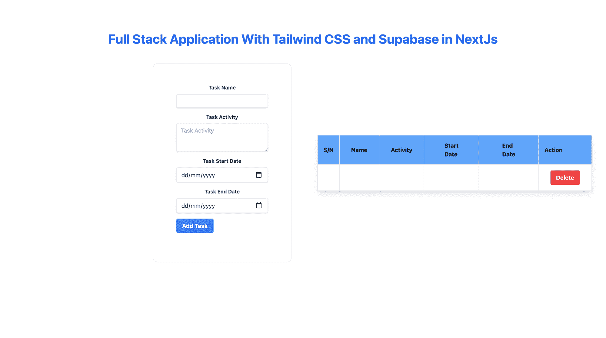

我们将使用`Supabase`包将我们的应用程序链接到我们的数据库。使用环境变量是我们配置它的最好方法。

您可以在 Next.js 中设置环境变量，方法是在项目的根目录中创建一个名为`.env`的文件，并将它们保存在那里。

最好在一个变量前面加上`NEXT_PUBLIC_`以向浏览器公开它。

将以下配置添加到项目根目录中名为`.env`的文件中:

```
NEXT_PUBLIC_SUPABASE_URL=https://app-id.supabase.co
NEXT_PUBLIC_SUPABASE_ANON_KEY=your-public-api-key 
```

我们可以在 Supabase 仪表板设置中找到我们的 API URL 和 API 键的值，如下所示:

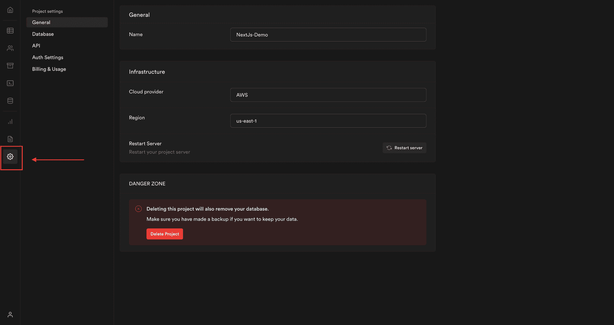

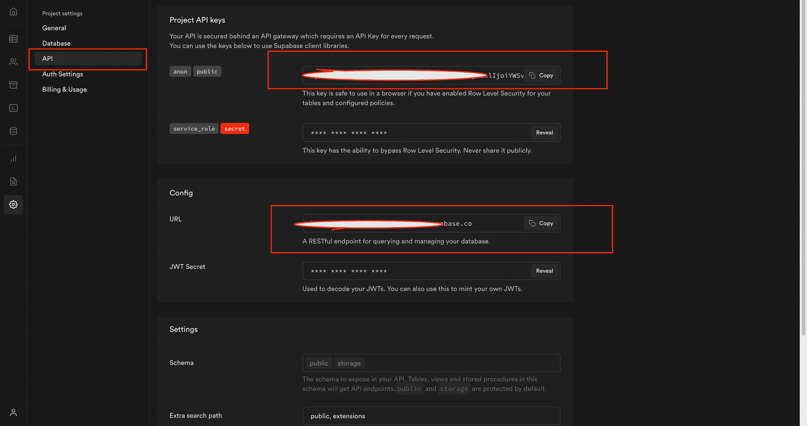

接下来，我们将在项目的根目录下创建一个名为`client.js`的文件，然后添加以下代码:

```
 import { createClient } from "@supabase/supabase-js";

export const supabase = createClient(
  process.env.NEXT_PUBLIC_SUPABASE_URL,
  process.env.NEXT_PUBLIC_SUPABASE_TOKEN
); 
```

导入之后，我们现在可以在应用程序的任何地方使用 Supabase 实例。

## 步骤 4:构建我们的应用程序

让我们更新我们的`pages/index.js`文件，这样我们就可以使用 Supabase 实例添加一个新任务，代码如下:

```
// ...
import { useState, useEffect } from "react";
import { supabase } from "../client";

export default function Home() {

  // Declare a new state variable to store task details
  const [task, setTask] = useState({
    Name: "",
    Activity: "",
    StartDate: "",
    EndDate: "",
  });

  const { Name, Activity, StartDate, EndDate } = task;

  // Create a function that handles the new task creation
  async function addTask() {
    await supabase
      .from("Task") // Select the Table
      .insert([
        {
          Name,
          Activity,
          StartDate,
          EndDate,
        },
      ]) // Insert the new task
      .single();
    setTask({
      Name: "",
      Activity: "",
      StartDate: "",
      EndDate: "",
    }); // Reset the task details
  }

  return (
    <div className="flex flex-col items-center justify-center py-2">
      <div>
       // ...
        <main className="flex flex-col items-center justify-center w-full flex-1 px-20 text-center">
          <h1 className="text-4xl font-bold mt-20">
            <a className="text-blue-600" href="/">
              Full Stack Application With Tailwind CSS and Supabase in NextJs
            </a>
          </h1>

          <div className="flex flex-wrap items-center justify-around max-w-4xl mt-6 sm:w-full">
            <div className="p-8 mt-6 border w-96 rounded-xl hover:text-blue-600 focus:text-blue-600">
              <div className="w-full max-w-sm">
                <form className="bg-white rounded px-8 pt-6 pb-8 mb-4">
                  <div className="mb-4">
                    <label
                      className="block text-gray-700 text-sm font-bold mb-2"
                      htmlFor="taskName"
                    >
                      Task Name
                    </label>
                    <input
                      className="shadow appearance-none border rounded w-full py-2 px-3 text-gray-700 leading-tight focus:outline-none focus:shadow-outline"
                      id="taskName"
                      type="text"
                      value={Name.toString()}
                      onChange={(e) =>
                        setTask({ ...task, Name: e.target.value })
                      }
                    />
                  </div>
                  <div className="mb-4">
                    <label
                      className="block text-gray-700 text-sm font-bold mb-2"
                      htmlFor="taskActivity"
                    >
                      Task Activity
                    </label>

                    <textarea
                      className="form-textarea mt-1 block shadow appearance-none border rounded w-full py-2 px-3 text-gray-700 leading-tight focus:outline-none focus:shadow-outline"
                      rows="3"
                      placeholder="Task Activity"
                      value={Activity.toString()}
                      onChange={(e) =>
                        setTask({ ...task, Activity: e.target.value })
                      }
                    ></textarea>
                  </div>

                  <div className="mb-4">
                    <label
                      className="block text-gray-700 text-sm font-bold mb-2"
                      htmlFor="startDate"
                    >
                      Task Start Date
                    </label>
                    <input
                      className="shadow appearance-none border rounded w-full py-2 px-3 text-gray-700 leading-tight focus:outline-none focus:shadow-outline"
                      id="startDate"
                      type="date"
                      value={StartDate.toString()}
                      onChange={(e) =>
                        setTask({ ...task, StartDate: e.target.value })
                      }
                    />
                  </div>
                  <div className="mb-4">
                    <label
                      className="block text-gray-700 text-sm font-bold mb-2"
                      htmlFor="endDate"
                    >
                      Task End Date
                    </label>
                    <input
                      className="shadow appearance-none border rounded w-full py-2 px-3 text-gray-700 leading-tight focus:outline-none focus:shadow-outline"
                      id="endDate"
                      type="date"
                      value={EndDate.toString()}
                      onChange={(e) =>
                        setTask({ ...task, EndDate: e.target.value })
                      }
                    />
                  </div>
                  <div className="flex items-center justify-between">
                    <button
                      className="bg-blue-500 hover:bg-blue-700 text-white font-bold py-2 px-4 rounded focus:outline-none focus:shadow-outline"
                      type="button"
                      onClick={addTask} // Call the addTask Function
                    >
                      Add Task
                    </button>
                  </div>
                </form>
              </div>
            </div>

            <div className="p-2 mt-6 w-96 rounded-xl focus:text-blue-600">
              // ...
            </div>
          </div>
        </main>
      </div>
    </div>
  );
} 
```

在上面的代码片段中，我们创建了一个名为`AddTask`的函数，使用 Supabase 实例添加一个新任务。我们还在`AddTask`按钮的 onClick 属性中引用了它。

接下来，在测试我们的应用程序之后，您可能会注意到，在输入任务细节并单击按钮`Add Task`之后，什么也没有发生。这是因为我们没有从数据库中处理任务检索。

让我们更新我们的`pages/index.js`文件，以便能够从我们的数据库中检索所有任务，如下所示:

```
// ...
export default function Home() {
  const [loading, setLoading] = useState(true);
  const [tasks, setTasks] = useState([]);

  // ...

  async function getTasks() {
    const { data } = await supabase.from("Task").select(); // Select all the tasks from the Task Table
    setTasks(data);
    setLoading(false);
  }

  // Run the getTasks function when the component is mounted
  useEffect(() => {
    getTasks();
  }, []);

  // Check if loading
  if (loading)
    return (
      <div className="flex justify-center items-center">
        <div
          className="
      animate-spin
      rounded-full
      h-32
      w-32
      border-t-2 border-b-2 border-blue-500 mt-36
    "
        ></div>
      </div>
    );
  return (
    <div className="flex flex-col items-center justify-center py-2">
      <div>
       // ...
        <main className="flex flex-col items-center justify-center w-full flex-1 px-20 text-center">
          <h1 className="text-4xl font-bold mt-20">
            <a className="text-blue-600" href="/">
              Full Stack Application With Tailwind CSS and Supabase in NextJs
            </a>
          </h1>

          <div className="flex flex-wrap items-center justify-around max-w-4xl mt-6 sm:w-full">
            <div className="p-8 mt-6 border w-96 rounded-xl hover:text-blue-600 focus:text-blue-600">
              // ...
              </div>
            </div>

            <div className="p-2 mt-6 w-96 rounded-xl focus:text-blue-600">
              <table className="shadow-lg bg-white">
                <tbody>
                  <tr>
                    <th className="bg-blue-400 border text-left px-4 py-4">
                      S/N
                    </th>
                    <th className="bg-blue-400 border text-left px-8 py-4">
                      Name
                    </th>
                    <th className="bg-blue-400 border text-left px-8 py-4">
                      Activity
                    </th>
                    <th className="bg-blue-400 border text-left px-14 py-4">
                      Start Date
                    </th>
                    <th className="bg-blue-400 border text-left px-16 py-4">
                      End Date
                    </th>

                    <th className="bg-blue-400 border text-left px-4 py-4">
                      Action
                    </th>
                  </tr>
                  {task &&
                    tasks.map((task, index) => (
                      <tr key={task.id}>
                        <td className="border px-4 py-4">{index + 1}</td>
                        <td className="border px-4 py-4">{task.Name}</td>
                        <td className="border px-8 py-4">{task.Activity}</td>
                        <td className="border px-8 py-4">{task.StartDate}</td>
                        <td className="border px-8 py-4">{task.EndDate}</td>
                        <td className="border px-8 py-4">
                          {" "}
                          <button
                            className="bg-red-500 hover:bg-red-700 text-white font-bold py-2 px-4 rounded focus:outline-none focus:shadow-outline"
                            type="button"
                          >
                            Delete
                          </button>
                        </td>
                      </tr>
                    ))}
                </tbody>
              </table>
            </div>
          </div>
        </main>
      </div>
    </div>
  );
} 
```

我们创建了一个名为`getTasks`的函数来检索使用 Supabase 实例添加的所有任务。我们还迭代检索到的所有任务，以表格格式显示所有记录，如上面的代码片段所示。

让我们测试一下我们的应用程序，我们应该能够添加一个新的任务，并查看到目前为止我们已经创建的所有任务。

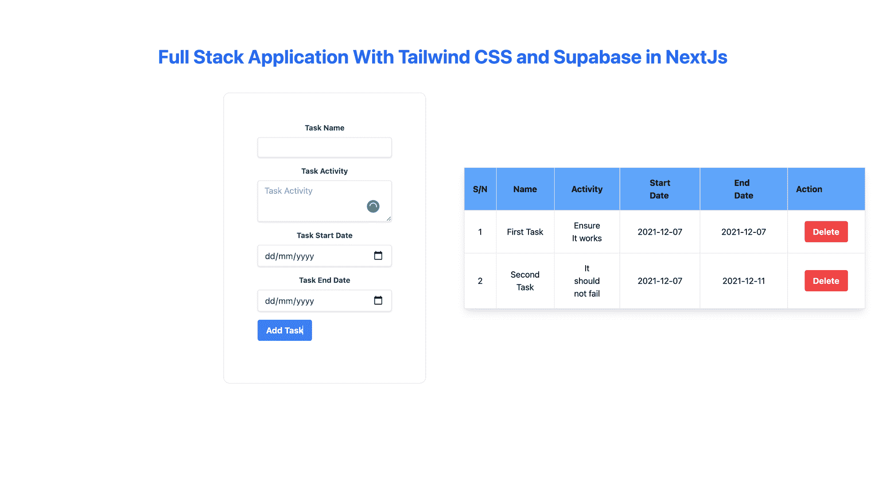

有用！但是，当添加了新任务时，我们必须刷新页面才能看到新任务。我们不想那样。让我们用下面的代码片段更新我们的`addTask`函数:

```
 async function addTask() {
    await supabase
      .from("Task")
      .insert([
        {
          Name,
          Activity,
          StartDate,
          EndDate,
        },
      ])
      .single();
    setTask({
      Name: "",
      Activity: "",
      StartDate: "",
      EndDate: "",
    });
    getTasks(); // Refresh the tasks
  } 
```

我们现在将看到一个新任务添加到我们的任务表中，而无需刷新页面。

让我们制作出现在表格右侧的`Delete`按钮，从我们的数据库中删除任务。

用下面的代码片段更新我们的`pages/index.js`文件:

```
 async function deleteTask(id) {
    await supabase.from("Task").delete().eq("id", id); // the id of row to delete
    getTasks();
  } 
```

更新删除按钮 onClick 属性，如下所示:

```
 // ...

      <button
        className="bg-red-500 hover:bg-red-700 text-white font-bold py-2 px-4 rounded focus:outline-none focus:shadow-outline"
        type="button"
        onClick={() => deleteTask(task.id)} // Delete the task
       >
        Delete
      </button> 
```

当我们测试我们的应用程序时，我们应该添加一个新任务，添加所有的任务，并删除我们想要的任何任务。我们可以在下图中看到它应该是什么样子，在这里我们删除了之前创建的一个任务。

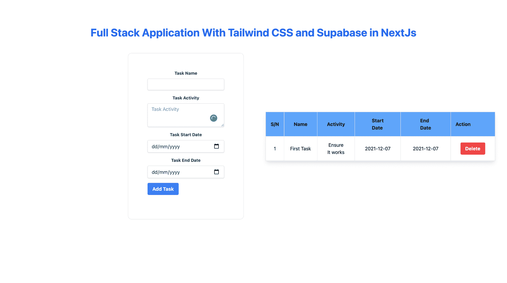

你可以[点击这里](https://github.com/Olanetsoft/supabase-and-nextjs-demo)查看 GitHub 上的完整代码。

## 结论

本教程向您展示了如何在 Next.js 中使用 Supabase、React 和 TailwindCSS 构建一个全栈应用程序。

编码快乐！

### 资源

*   [超级文档](https://supabase.io/docs/)
*   [NextJs 文档](https://nextjs.org/)
*   [顺风 CSS](https://tailwindcss.com/)