# 如何在 React with RxJS 6 中构建 GitHub 搜索功能并重新组合

> 原文：<https://www.freecodecamp.org/news/how-to-build-a-github-search-in-react-with-rxjs-6-and-recompose-e9c6cc727e7f/>

这篇文章是为那些有 React 和 RxJS 经验的人准备的。我只是分享我在制作这个 UI 时发现有用的模式。

这是我们正在建造的:

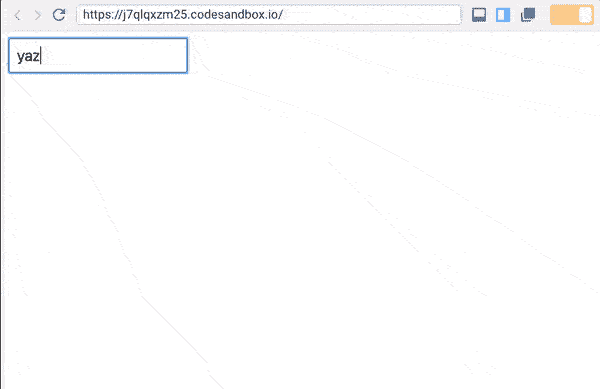

没有类、生命周期挂钩或`setState`。

### 设置

一切都在我的 GitHub 上。

```
git clone https://github.com/yazeedb/recompose-github-ui
cd recompose-github-ui
yarn install 
```

`master`分支已经完成了项目，所以如果你想继续的话，检查一下`start`分支。

`git checkout start`

并运行该项目。

`npm start`

应用程序应该在`localhost:3000`上运行，这是我们的初始 UI。

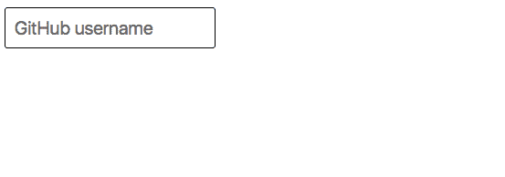

在您喜欢的文本编辑器中打开项目并查看`src/index.js`。

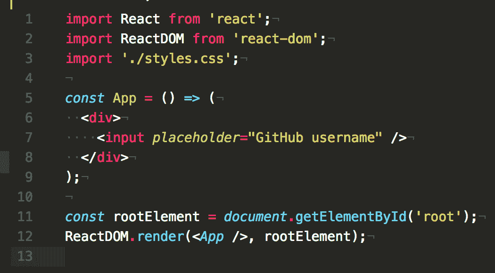

### 重写

如果你还没看过的话， [Recompose](https://github.com/acdlite/recompose/) 是一个很棒的 React 工具带，用于以函数式编程风格制作组件。它有很多功能，我很难选择[我最喜欢的](https://www.freecodecamp.org/news/how-to-build-a-github-search-in-react-with-rxjs-6-and-recompose-e9c6cc727e7f/my-favorite-recompose-functions)。

这是 Lodash/Ramda，但用于反应。我也喜欢他们支持可观的。引用来自[的文件](https://github.com/acdlite/recompose/blob/master/docs/API.md#observable-utilities):

> 事实证明，React 组件 API 的大部分可以用可观察性来表示

我们今天将练习这个概念！？

### 流式传输我们的组件

现在`App`是一个普通的 React 组件。我们可以使用 Recompose 的 [componentFromStream](https://github.com/acdlite/recompose/blob/master/docs/API.md#componentfromstream) 函数通过 observable 返回它。

这个函数最初将[呈现为空组件](https://github.com/acdlite/recompose/blob/master/src/packages/recompose/componentFromStream.js#L8)，当我们的可观察对象返回一个新值时，*将重新呈现*。

#### 少量配置

重组流遵循 [ECMAScript Observable 建议](https://github.com/tc39/proposal-observable)。它展示了 observables 最终发布到现代浏览器时应该如何工作。

然而，在它们完全实现之前，我们依赖 RxJS、xstream、most、Flyd 等库。

Recompose 不知道我们正在使用哪个库，所以它提供了一个`setObservableConfig`来将 ES Observables 转换成我们需要的任何东西。

在`src`中创建一个名为`observableConfig.js`的新文件。

并添加以下代码以使重新组合与 RxJS 6:

```
import { from } from 'rxjs';
import { setObservableConfig } from 'recompose';

setObservableConfig({
  fromESObservable: from
}); 
```

将其导入`index.js`:

```
import './observableConfig'; 
```

我们准备好了！

#### 重新编译+rhex js

导入`componentFromStream`。

```
import React from 'react';
import ReactDOM from 'react-dom';
import { componentFromStream } from 'recompose';
import './styles.css';
import './observableConfig'; 
```

开始用这段代码重新定义`App`:

```
const App = componentFromStream((prop$) => {
  // ...
}); 
```

请注意，`componentFromStream`接受了一个回调函数，该函数需要一个`prop$`流。这个想法是我们的`props`成为一个可观察的，我们将它们映射到一个反应组件。

如果你使用过 RxJS，你会知道映射值的完美操作符。

#### 地图

顾名思义，您正在将`Observable(something)`转换成`Observable(somethingElse)`。在我们这里，`Observable(props)`变成了`Observable(component)`。

导入`map`运算符:

```
import { map } from 'rxjs/operators'; 
```

重新定义应用程序:

```
const App = componentFromStream((prop$) => {
  return prop$.pipe(
    map(() => (
      <div>
        <input placeholder="GitHub username" />
      </div>
    ))
  );
}); 
```

从 RxJS 5 开始，我们就用`pipe`代替链式操作符。

保存并检查你的用户界面，同样的结果！

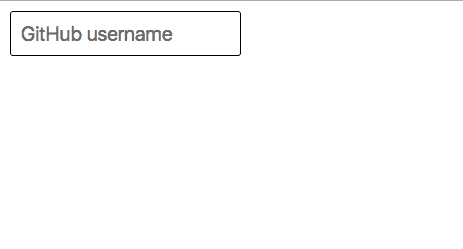

### 添加事件处理程序

现在，我们将使`input`更具反应性。

从重新组合中导入`createEventHandler`。

```
import { componentFromStream, createEventHandler } from 'recompose'; 
```

像这样使用它:

```
const App = componentFromStream((prop$) => {
  const { handler, stream } = createEventHandler();

  return prop$.pipe(
    map(() => (
      <div>
        <input onChange={handler} placeholder="GitHub username" />{' '}
      </div>
    ))
  );
}); 
```

`createEventHandler`是一个具有两个有趣属性的对象:`handler`和`stream`。

[在](https://github.com/acdlite/recompose/blob/master/src/packages/recompose/createEventHandler.js)、`handler`的引擎盖下，是一个将值推送到`stream`的事件发射器，而`stream`是一个向其订户广播这些值的可观察对象。

所以我们将结合`stream`可观测值和`prop$`可观测值来获取`input`的当前值。

这里是个不错的选择。

#### 鸡和蛋的问题

不过，要使用`combineLatest`，`stream`和`prop$`都必须发射。`stream`不会发射，直到`prop$`发射，反之亦然。

我们可以通过给`stream`一个初始值来解决这个问题。

导入 RxJS 的`startWith`运算符:

```
import { map, startWith } from 'rxjs/operators'; 
```

并创建一个新变量来捕获修改后的`stream`。

```
const { handler, stream } = createEventHandler();

const value$ = stream.pipe(
  map((e) => e.target.value),
  startWith('')
); 
```

我们知道`stream`将从`input`的 onChange 中发出事件，所以让我们立即将每个`event`映射到它的文本值。

最重要的是，我们将把`value$`初始化为一个空字符串——对于空的`input`来说，这是一个合适的默认值。

#### 结合这一切

我们准备合并这两个流，并将`combineLatest`作为创建方法导入，**不作为操作符**。

```
import { combineLatest } from 'rxjs'; 
```

您也可以导入`tap`操作符来检查值:

```
import { map, startWith, tap } from 'rxjs/operators'; 
```

像这样使用它:

```
const App = componentFromStream((prop$) => {
  const { handler, stream } = createEventHandler();
  const value$ = stream.pipe(
    map((e) => e.target.value),
    startWith('')
  );

  return combineLatest(prop$, value$).pipe(
    tap(console.warn),
    map(() => (
      <div>
        <input onChange={handler} placeholder="GitHub username" />
      </div>
    ))
  );
}); 
```

现在，当您键入时，`[props, value]`会被记录下来。

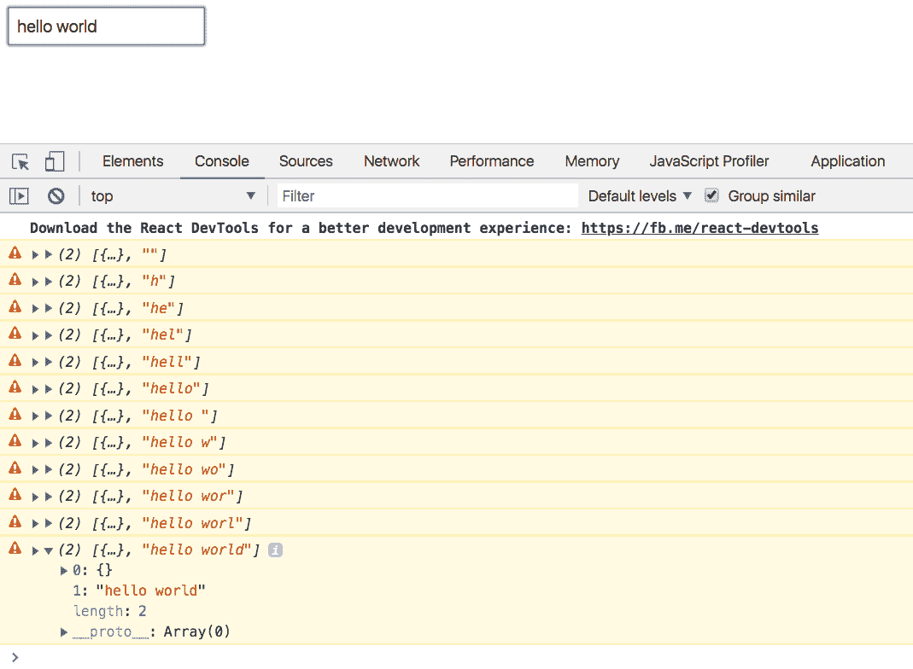

### 用户组件

这个组件将负责获取/显示我们给它的用户名。它将从`App`接收`value`，并将其映射到一个 AJAX 调用。

#### JSX/CSS

这一切都是基于这个令人敬畏的 GitHub 卡项目。大部分的东西，尤其是样式，都被复制/粘贴或修改以适应反应和道具。

创建一个文件夹`src/User`，将[这个代码](https://raw.githubusercontent.com/yazeedb/recompose-github-ui/master/src/User/User.css)放入`User.css`:

而[这个代码](https://raw.githubusercontent.com/yazeedb/recompose-github-ui/master/src/User/Component.js)变成了`src/User/Component.js`:

该组件只是用 GitHub API 的标准 JSON 响应填充一个模板。

#### 集装箱

既然“笨”的部分已经解决了，让我们来做“聪明”的部分:

这里是`src/User/index.js`:

```
import React from 'react';
import { componentFromStream } from 'recompose';
import { debounceTime, filter, map, pluck } from 'rxjs/operators';
import Component from './Component';
import './User.css';

const User = componentFromStream((prop$) => {
  const getUser$ = prop$.pipe(
    debounceTime(1000),
    pluck('user'),
    filter((user) => user && user.length),
    map((user) => <h3>{user}</h3>)
  );

  return getUser$;
});

export default User; 
```

我们将`User`定义为`componentFromStream`，它返回一个映射到`<h3>`的`prop$`流。

#### 去抖时间

由于`User`会通过键盘接收它的道具，所以我们不想听每一个单独的发射。

当用户开始键入时，`debounceTime(1000)`跳过所有发射 1 秒钟。这种模式常用于[型广告](https://www.learnrxjs.io/operators/filtering/debouncetime.html)。

#### 勇气

这个组件期望`prop.user`在某个时候出现。`pluck`抢`user`，所以我们不需要每次都析构我们的`props`。

#### 过滤器

确保`user`存在并且不是空字符串。

#### 地图

现在，只需将`user`放在一个`<h3>`标签中。

#### 连接起来

回到`src/index.js`，导入`User`组件:

```
import User from './User';
```

并提供`value`作为`user`道具:

```
return combineLatest(prop$, value$).pipe(
  tap(console.warn),
  map(([props, value]) => (
    <div>
      <input onChange={handler} placeholder="GitHub username" />
      <User user={value} />{' '}
    </div>
  ))
); 
```

现在你的值在 1 秒钟后就显示在屏幕上了。

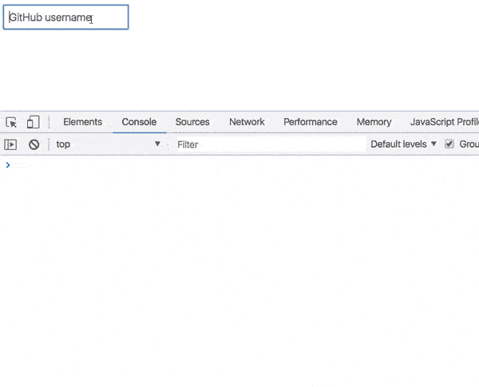

好的开始，但是我们需要真正的获取用户。

### 获取用户

GitHub 的用户 API 可以在这里[获得。我们可以很容易地将其提取到`User/index.js`中的一个助手函数中:](https://api.github.com/users)

```
const formatUrl = (user) => `https://api.github.com/users/${user}`; 
```

现在我们可以在`filter`后面加上`map(formatUrl)`:

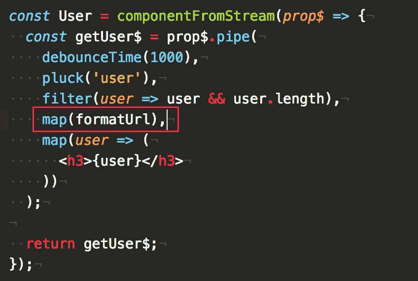

您会注意到，现在 1 秒钟后，API 端点会呈现在屏幕上:

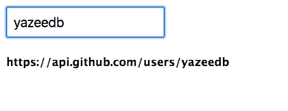

但是我们需要做一个 API 请求！`switchMap`和`ajax`来了。

#### 开关图

也用在打字头中，`switchMap`对于字面上的**将**从一个可观察到的切换到另一个是很棒的。

假设用户输入一个用户名，我们在`switchMap`中获取它。

如果用户在结果返回之前输入了新的东西会怎么样？我们关心之前的 API 响应吗？

没有。

`switchMap`将取消前一次获取并专注于当前获取。

#### 创建交互式、快速动态网页应用的网页开发技术

RxJS 提供了自己的`ajax`实现，可以很好地配合`switchMap`！

#### 使用它们

两个都导入吧。我的代码如下所示:

```
import { ajax } from 'rxjs/ajax';
import { debounceTime, filter, map, pluck, switchMap } from 'rxjs/operators'; 
```

像这样使用它们:

```
const User = componentFromStream((prop$) => {
  const getUser$ = prop$.pipe(
    debounceTime(1000),
    pluck('user'),
    filter((user) => user && user.length),
    map(formatUrl),
    switchMap((url) =>
      ajax(url).pipe(
        pluck('response'),
        map(Component)
      )
    )
  );

  return getUser$;
}); 
```

**将**从我们的`input`流切换到`ajax`请求流。一旦请求完成，将它的`response`和`map`抓取到我们的`User`组件。

我们有结果了！

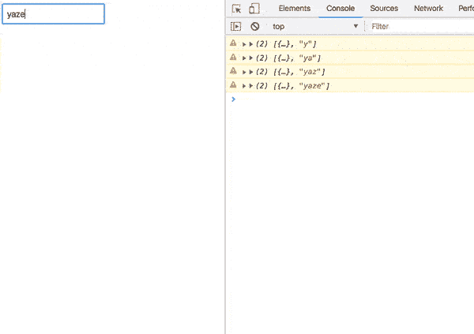

### 错误处理

请尝试输入一个不存在的用户名。

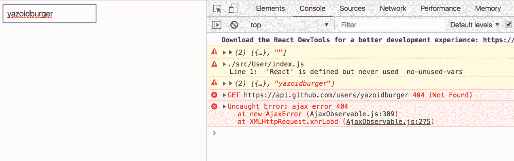

即使您更改了，我们的应用程序也已损坏。您必须刷新才能获取更多用户。

这是一个糟糕的用户体验，对不对？

#### 捕捉错误

有了`catchError`操作符，我们就可以对屏幕做出合理的反应，而不是无声的打破。

导入它:

```
import {
  catchError,
  debounceTime,
  filter,
  map,
  pluck,
  switchMap
} from 'rxjs/operators'; 
```

并把它粘在你的链条末端。

```
switchMap((url) =>
  ajax(url).pipe(
    pluck('response'),
    map(Component),
    catchError(({ response }) => alert(response.message))
  )
); 
```

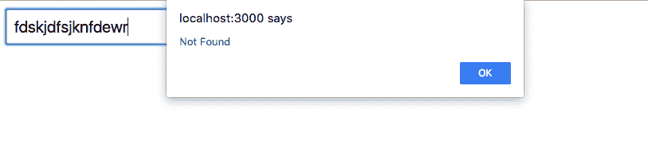

至少我们得到了一些反馈，但我们可以做得更好。

#### 误差成分

创建一个新组件，`src/Error/index.js`。

```
import React from 'react';

const Error = ({ response, status }) => (
  <div className="error">
    <h2>Oops!</h2>
    <b>
      {status}: {response.message}
    </b>
    <p>Please try searching again.</p>
  </div>
);

export default Error; 
```

这将很好地显示来自 AJAX 调用的`response`和`status`。

让我们在`User/index.js`中导入它:

```
import Error from '../Error'; 
```

而`of`来自 RxJS:

```
import { of } from 'rxjs'; 
```

记住，我们的`componentFromStream`回调必须返回一个可观察值。我们可以通过`of`来实现。

下面是新代码:

```
ajax(url).pipe(
  pluck('response'),
  map(Component),
  catchError((error) => of(<Error {...error} />))
); 
```

简单地将`error`对象作为道具散布在我们的组件上。

现在，如果我们检查我们的用户界面:

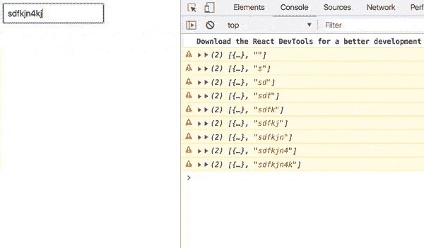

好多了！

### 负载指示器

通常，我们现在需要某种形式的状态管理。还有什么方法可以建立一个负载指示器？

但是在伸手拿`setState`之前，我们先看看 RxJS 能不能帮到我们。

[重组文档](https://github.com/acdlite/recompose/blob/master/docs/API.md#observable-utilities)让我朝这个方向思考:

> 而不是`setState()`，把多个流组合在一起。

**编辑**:我最初用的是`BehaviorSubject` s，但是[马蒂·兰基宁](https://medium.com/@milankinen)用一个聪明的方法来简化这段代码。谢谢你马蒂！

导入`merge`运算符。

```
import { merge, of } from 'rxjs'; 
```

当请求发出时，我们将把我们的`ajax`与一个加载组件流合并。

内部`componentFromStream`:

```
const User = componentFromStream((prop$) => {
  const loading$ = of(<h3>Loading...</h3>);
  // ...
}); 
```

一个简单的`h3`装载指示器变成了可观察的！像这样使用它:

```
const loading$ = of(<h3>Loading...</h3>);

const getUser$ = prop$.pipe(
  debounceTime(1000),
  pluck('user'),
  filter((user) => user && user.length),
  map(formatUrl),
  switchMap((url) =>
    merge(
      loading$,
      ajax(url).pipe(
        pluck('response'),
        map(Component),
        catchError((error) => of(<Error {...error} />))
      )
    )
  )
); 
```

我喜欢这种简洁。进入`switchMap`后，合并`loading$`和`ajax`观察值。

由于`loading$`是一个静态值，它将首先发出。然而，一旦异步`ajax`结束，*就会*发出并显示在屏幕上。

在测试之前，我们可以导入`delay`操作符，这样转换就不会发生得太快。

```
import {
  catchError,
  debounceTime,
  delay,
  filter,
  map,
  pluck,
  switchMap,
  tap
} from 'rxjs/operators'; 
```

并在`map(Component)`之前使用它:

```
ajax(url).pipe(
  pluck('response'),
  delay(1500),
  map(Component),
  catchError((error) => of(<Error {...error} />))
); 
```

我们的结果？

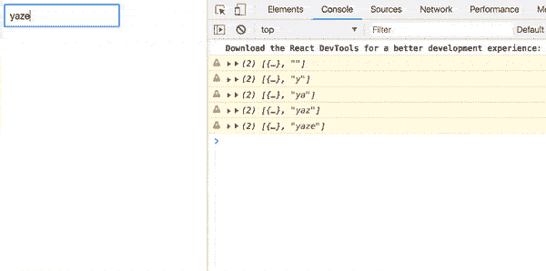

我想知道这种模式要走多远，往什么方向走。请分享你的想法！