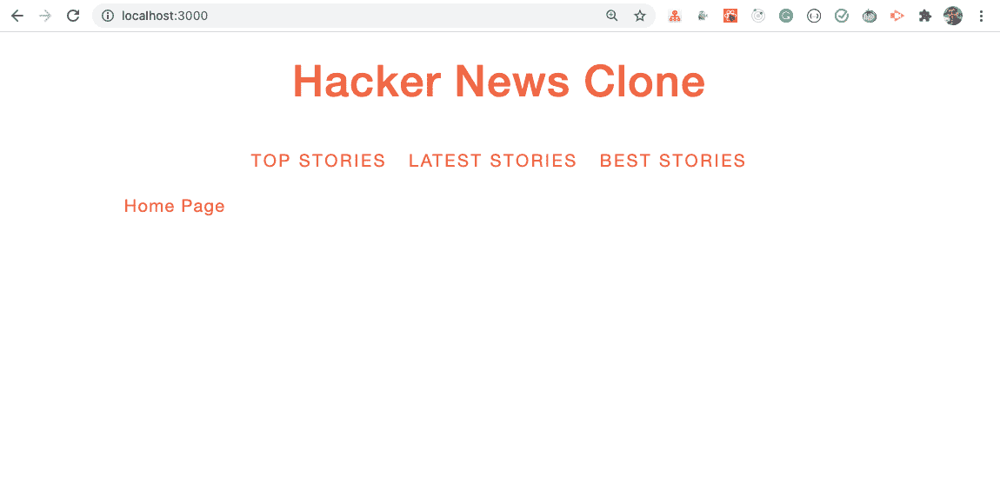
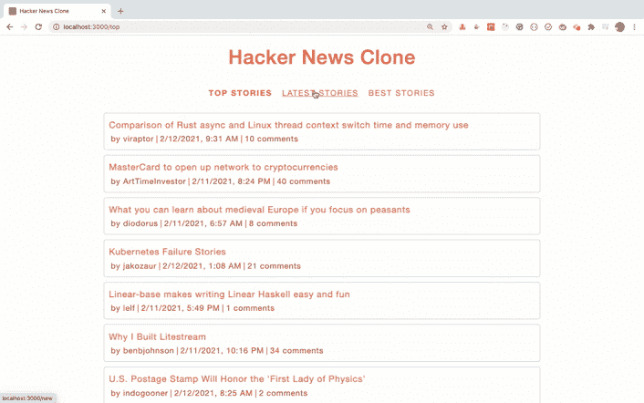
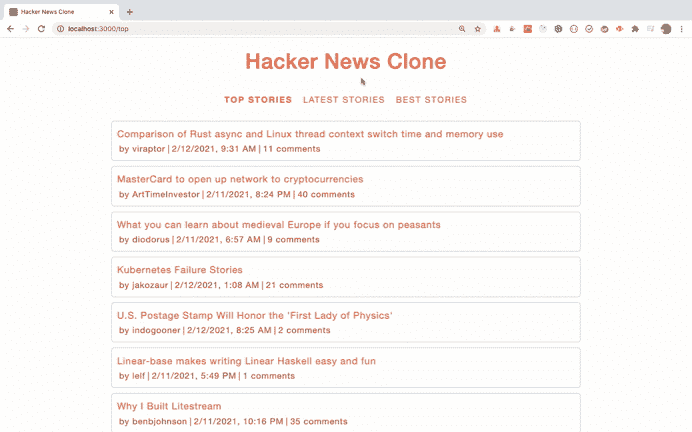
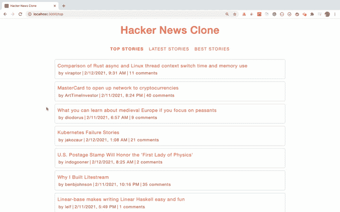

# 如何使用 React 构建黑客新闻克隆

> 原文：<https://www.freecodecamp.org/news/how-to-build-a-hacker-news-clone-using-react/>

在本教程中，我们将在 React 中构建一个迷你[黑客新闻](https://news.ycombinator.com/)克隆。

我们将使用 React Hooks 语法来构建这个应用程序。所以如果你是 React 钩子的新手，可以看看我的[React 钩子介绍](https://levelup.gitconnected.com/an-introduction-to-react-hooks-50281fd961fe?source=friends_link&sk=89baff89ec8bc637e7c13b7554904e54)文章来学习钩子的基础知识。

所以让我们开始吧。

## API 简介

我们将使用来自这个 url 的黑客新闻 API。

API 获取头条新闻，请使用以下网址:[https://hacker-news.firebaseio.com/v0/topstories.json?打印=漂亮](https://hacker-news.firebaseio.com/v0/topstories.json?print=pretty)

API 获取新的故事，使用这个 URL:[https://hacker-news.firebaseio.com/v0/newstories.json?打印=漂亮](https://hacker-news.firebaseio.com/v0/newstories.json?print=pretty)

API 获取最佳故事，请使用以下网址:[https://hacker-news.firebaseio.com/v0/beststories.json?打印=漂亮](https://hacker-news.firebaseio.com/v0/beststories.json?print=pretty)

上面的每个故事 API 只返回一个表示一个故事的 id 数组。

因此，为了获得这个特定故事的细节，我们需要进行另一个 API 调用。

API 获取故事细节，使用这个 URL:[https://hacker-news.firebaseio.com/v0/item/story_id.json?打印=漂亮](https://hacker-news.firebaseio.com/v0/item/story_id.json?print=pretty)

例如:[https://hacker-news.firebaseio.com/v0/item/26061935.json?打印=漂亮](https://hacker-news.firebaseio.com/v0/item/26061935.json?print=pretty)

## 如何设置项目

使用`create-react-app`创建一个新项目:

```
npx create-react-app hackernews-clone-react-app 
```

项目创建完成后，删除`src`文件夹中的所有文件，并在`src`文件夹中创建`index.js`和`styles.scss`文件。同样，在`src`文件夹中创建`components`、`hooks`、`router`、`utils`文件夹。

像这样安装所需的依赖项:

```
yarn add axios@0.21.0 bootstrap@4.6.0 node-sass@4.14.1 react-bootstrap@1.4.0 react-router-dom@5.2.0 
```

打开`styles.scss`，将[中的内容添加到这里的](https://github.com/myogeshchavan97/hackernews-clone-react-app/blob/master/src/styles.scss)中。

我们将使用 SCSS 语法来编写 CSS。所以，如果你是第一次来 SCSS，可以在这里查看我的文章。

## 如何创建初始页面

在`components`文件夹中创建一个新文件`Header.js`，内容如下:

```
import React from 'react';
import { NavLink } from 'react-router-dom';

const Header = () => {
  return (
    <React.Fragment>
      <h1>Hacker News Clone</h1>
      <div className="nav-link">
        <NavLink to="/top" activeClassName="active">
          Top Stories
        </NavLink>
        <NavLink to="/new" activeClassName="active">
          Latest Stories
        </NavLink>
        <NavLink to="/best" activeClassName="active">
          Best Stories
        </NavLink>
      </div>
    </React.Fragment>
  );
};

export default Header; 
```

在这个文件中，我们添加了一个导航菜单来查看不同类型的故事。每个环节都增加了一个`active`的类。因此，当我们点击该链接时，它将被突出显示，表明我们在哪个路线上。

在`components`文件夹中创建一个新文件`HomePage.js`，内容如下:

```
import React from 'react';

const HomePage = () => {
  return <React.Fragment>Home Page</React.Fragment>;
};

export default HomePage; 
```

在`components`文件夹中创建一个新文件`PageNotFound.js`，内容如下:

```
import React from 'react';
import { Link } from 'react-router-dom';

const PageNotFound = () => {
  return (
    <p>
      Page Not found. Go to <Link to="/">Home</Link>
    </p>
  );
};

export default PageNotFound; 
```

在`router`文件夹中创建一个新文件`AppRouter.js`，内容如下:

```
import React from 'react';
import { BrowserRouter, Route, Switch } from 'react-router-dom';
import Header from '../components/Header';
import HomePage from '../components/HomePage';
import PageNotFound from '../components/PageNotFound';

const AppRouter = () => {
  return (
    <BrowserRouter>
      <div className="container">
        <Header />
        <Switch>
          <Route path="/" component={HomePage} exact={true} />
          <Route component={PageNotFound} />
        </Switch>
      </div>
    </BrowserRouter>
  );
};

export default AppRouter; 
```

在这个文件中，最初，我们为路由添加了两条路由，一条用于主页，另一条用于无效路由。

如果你是 React 路由器的新手，请查看我的免费课程 React 路由器简介。

现在，打开`src/index.js`文件，在其中添加以下内容:

```
import React from 'react';
import ReactDOM from 'react-dom';
import AppRouter from './router/AppRouter';
import 'bootstrap/dist/css/bootstrap.min.css';
import './styles.scss';

ReactDOM.render(<AppRouter />, document.getElementById('root')); 
```

现在，通过运行`yarn start`命令启动应用程序，您将看到以下屏幕:



## API 集成

现在，在`utils`文件夹中创建一个名为`constants.js`的新文件，内容如下:

```
export const BASE_API_URL = 'https://hacker-news.firebaseio.com/v0'; 
```

在`utils`文件夹中创建另一个名为`apis.js`的文件，内容如下:

```
import axios from 'axios';
import { BASE_API_URL } from './constants';

const getStory = async (id) => {
  try {
    const story = await axios.get(`${BASE_API_URL}/item/${id}.json`);
    return story;
  } catch (error) {
    console.log('Error while getting a story.');
  }
};

export const getStories = async (type) => {
  try {
    const { data: storyIds } = await axios.get(
      `${BASE_API_URL}/${type}stories.json`
    );
    const stories = await Promise.all(storyIds.slice(0, 30).map(getStory));
    return stories;
  } catch (error) {
    console.log('Error while getting list of stories.');
  }
}; 
```

在这个文件中，对于`getStories`函数，我们传递我们想要的故事类型(`top`、`new`或`best`)。然后，我们对本文开头提供的相应的`.json` URL 进行 API 调用。

注意，我们已经将函数声明为`async`，因此我们可以使用`await`关键字来调用 API 并等待响应。

```
const { data: storyIds } = await axios.get(
  `${BASE_API_URL}/${type}stories.json`
); 
```

由于`axios`库总是在响应的`.data`属性中返回结果，我们取出该属性并将其重命名为`storyIds`，因为 API 返回一个故事 id 数组。

这里，我们使用 ES6 析构语法将`data`属性重命名为`storyIds`。这样就很容易理解`storyIds`包含了什么，而不是将其命名为`data`。

请注意，上面的代码与下面的代码相同:

```
const response = await axios.get(
  `${BASE_API_URL}/${type}stories.json`
);
const storyIds = response.data; 
```

因为我们得到了一个故事 id 数组，而不是对每个`id`进行单独的 API 调用，然后等待前一个调用完成，所以我们使用`Promise.all`方法对所有的故事 id 同时进行 API 调用。

```
const stories = await Promise.all(
  storyIds.slice(0, 30).map((storyId) => getStory(storyId))
); 
```

这里，我们使用数组切片方法只取前 30 个故事 id，这样数据加载速度会更快。

然后，我们使用数组映射方法调用`getStory`函数，通过将`storyId`传递给它来对单个故事项进行 API 调用。

和在 map 函数中一样，我们只需将 storyId 传递给`getStory`函数。我们可以将其简化为以下代码:

```
const stories = await Promise.all(storyIds.slice(0, 30).map(getStory)); 
```

所以`storyId`会自动传递给`getStory`函数。

在`getStory`函数中，我们使用 ES6 模板字面语法来创建一个基于传递的 id 的动态 URL，以便进行 API 调用。

一旦我们有了可用的故事，我们就从`getStories`函数返回它。

## 如何创建数据提取器

在`hooks`文件夹中创建一个新文件`dataFetcher.js`，内容如下:

```
import { useState, useEffect } from 'react';
import { getStories } from '../utils/apis';

const useDataFetcher = (type) => {
  const [stories, setStories] = useState([]);
  const [isLoading, setIsLoading] = useState(false);

  useEffect(() => {
    setIsLoading(true);
    getStories(type)
      .then((stories) => {
        setStories(stories);
        setIsLoading(false);
      })
      .catch(() => {
        setIsLoading(false);
      });
  }, [type]);

  return { isLoading, stories };
};

export default useDataFetcher; 
```

在这个文件中，我们声明了一个自定义钩子`useDataFetcher`，它将故事类型作为参数，并在`useEffect`钩子内调用在`apis.js`文件中定义的`getStories`函数。

我们在这里使用`useState`钩子添加了两个状态变量，即`stories`和`isLoading`。在进行 API 调用之前，我们将`isLoading`状态设置为`true`。一旦我们得到完整的响应，我们将其设置为`false`。

我们还将 catch 块中的`isLoading`状态设置为`false`,这样如果出现错误，加载程序将被隐藏。

一旦收到响应，我们用 API 的响应设置`stories`数组，并从对象的钩子返回`isLoading`和`stories`。这意味着任何使用这个钩子的组件都能够获得这些状态值的更新值。

另外，请注意，我们已经添加了`type`作为对`useEffect`钩子的依赖，作为数组中的第二个参数。因此，每当我们点击导航菜单时(对于`top`、`latest`或`best`的故事)，类型将会改变，这个`useEffect`钩子将再次运行，以进行 API 调用来获取与该类型相关的故事。

如果你还记得的话，在`apis.js`文件中，`getStories`函数被声明为`async`，所以它总是返回一个承诺。因此，我们在`getStories`函数中添加了`.then`处理程序，以从`dataFetcher.js`文件中的`useEffect`钩子内的响应中获取实际数据，如下所示:

```
getStories(type)
      .then((stories) => {
      ... 
```

## 如何在用户界面中显示数据

现在，在`components`文件夹中创建一个名为`ShowStories.js`的新文件，内容如下:

```
import React from 'react';
import Story from './Story';
import useDataFetcher from '../hooks/dataFetcher';

const ShowStories = (props) => {
  const { type } = props.match.params;
  const { isLoading, stories } = useDataFetcher(type);

  return (
    <React.Fragment>
      {isLoading ? (
        <p className="loading">Loading...</p>
      ) : (
        <React.Fragment>
          {stories.map(({ data: story }) => (
            <Story key={story.id} story={story} />
          ))}
        </React.Fragment>
      )}
    </React.Fragment>
  );
};

export default ShowStories; 
```

在这个文件中，我们在组件内部使用了`useDataFetcher`定制钩子。基于`isLoading`标志，我们或者显示`Loading`消息，或者通过对每个单独的故事使用数组映射方法来显示故事列表。

在`components`文件夹中创建一个新文件`Story.js`，内容如下:

```
import React from 'react';

const Link = ({ url, title }) => (
  <a href={url} target="_blank" rel="noreferrer">
    {title}
  </a>
);

const Story = ({ story: { id, by, title, kids, time, url } }) => {
  return (
    <div className="story">
      <div className="story-title">
        <Link url={url} title={title} />
      </div>
      <div className="story-info">
        <span>
          by{' '}
          <Link url={`https://news.ycombinator.com/user?id=${by}`} title={by} />
        </span>
        |<span>
          {new Date(time * 1000).toLocaleDateString('en-US', {
            hour: 'numeric',
            minute: 'numeric'
          })}
        </span>|
        <span>
          <Link
            url={`https://news.ycombinator.com/item?id=${id}`}
            title={`${kids && kids.length > 0 ? kids.length : 0} comments`}
          />
        </span>
      </div>
    </div>
  );
};

export default Story; 
```

在这个文件中，我们显示了单个的故事。

为了定义`Link`组件，我们使用隐式返回的 ES6 arrow 函数速记语法。

所以下面的代码:

```
const Link = ({ url, title }) => (
  <a href={url} target="_blank" rel="noreferrer">
    {title}
  </a>
);
```

与以下代码相同:

```
const Link = ({ url, title }) => {
  return (
    <a href={url} target="_blank" rel="noreferrer">
     {title}
    </a>
  );
}
```

在箭头函数中，如果只有一行语句，那么我们可以跳过花括号，返回关键字。

所以下面的代码:

```
const add = (a,b) => a + b;
```

与以下代码相同:

```
const add = (a,b) => {
  return a + b;
}
```

但是为了使 JSX 看起来整洁，像一个单行语句，我们在定义`Link`组件时添加了额外的圆括号。

接下来，对于`Story`组件，我们这样定义它:

```
const Story = ({ story: { id, by, title, kids, time, url } }) => {
  // some code
}
```

这里，我们使用 ES6 析构语法来获取从`ShowStories`组件传递来的 story 对象的属性。

所以上面的代码和下面的代码是一样的:

```
const Story = (props) => {
  const { id, by, title, kids, time, url } = props.story;
  // some code
}
```

它与下面的代码相同:

```
const Story = ({ story }) => {
  const { id, by, title, kids, time, url } = story;
  // some code
}
```

在 API 响应中，我们以秒为单位获取故事的时间。因此，在`Story`组件中，我们将它乘以 1000，将其转换为毫秒，这样我们就可以使用 JavaScript 的`toLocaleDateString`方法以正确的格式显示正确的日期:

```
{new Date(time * 1000).toLocaleDateString('en-US', {
  hour: 'numeric',
  minute: 'numeric'
})}
```

现在，打开`AppRouter.js`文件，在`PageNotFound`路线之前为`ShowStories`组件添加另一条路线。

```
<Switch>
  <Route path="/" component={HomePage} exact={true} />
  <Route path="/:type" component={ShowStories} />
  <Route component={PageNotFound} />
</Switch> 
```

另外，在顶部为`ShowStories`组件添加一个导入:

```
import ShowStories from '../components/ShowStories'; 
```

现在，通过运行`yarn start`命令重启应用程序，并验证应用程序。



如您所见，应用程序正在正确地从 HackerNews API 加载热门、最新和最佳新闻。

## 如何处理动态重定向

如果您还记得，我们添加了`HomePage`组件，这样我们就可以在应用程序加载时显示一些内容。但是现在我们实际上不需要`HomePage`组件，因为我们可以在应用程序加载时显示头条新闻页面。

因此，打开`AppRouter.js`文件，从下面的代码中修改前两条路线:

```
<Route path="/" component={HomePage} exact={true} />
<Route path="/:type" component={ShowStories} /> 
```

对于此代码:

```
<Route path="/" render={() => <Redirect to="/top" />} exact={true} />
<Route
  path="/:type"
  render={({ match }) => {
    const { type } = match.params;
    if (!['top', 'new', 'best'].includes(type)) {
       return <Redirect to="/" />;
    }
    return <ShowStories type={type} />;
  }}
/> 
```

在第一条路线中，当我们通过访问`http://localhost:3000/`加载应用程序时，我们将用户重定向到`/top`路线。

```
<Route path="/" render={() => <Redirect to="/top" />} exact={true} /> 
```

这里，我们使用渲染道具模式。因此，我们没有提供组件，而是使用了一个名为`render`的 prop，在这里我们可以直接在函数内部编写组件代码。

要知道为什么我们使用`render`而不是`component`道具，以及它解决了什么问题，请查看我的免费[反应路由器](https://yogeshchavan1.podia.com/react-router-introduction)介绍课程。

接下来，我们增加了一条`/:type`路线:

```
<Route
  path="/:type"
  render={({ match }) => {
    const { type } = match.params;
    if (!['top', 'new', 'best'].includes(type)) {
      return <Redirect to="/" />;
    }
    return <ShowStories type={type} />;
  }}
/> 
```

在这里，如果路线与`/top`或`/new`或`/best`匹配，那么我们向用户显示`ShowStories`组件。如果用户为像`/something`这样的路线输入了一些无效值，我们将再次把用户重定向到`/top`路线，该路线将呈现带有`top`故事的`ShowStories`组件..

我们在 if 条件内使用了上面代码中的 ES7 数组`includes`方法。

默认情况下，React 路由器向`<Route />`中提到的每个组件传递一些道具。其中一个是`match`，所以`props.match.params`将包含`type`的实际传递值。

因此，当我们访问`http://localhost:3000/top`，`props.match.params`将包含值`top`。当我们访问`http://localhost:3000/new`，`props.match.params`将包含值`new`等等。

对于 render prop 函数，我们通过使用以下语法使用析构来获取 props 对象的`match`属性:

```
render={({ match }) => {
} 
```

这与以下内容相同:

```
render={(props) => {
 const { match } = props;
} 
```

另外，不要忘记从位于`AppRouter.js`文件顶部的`react-router-dom`包中导入`Redirect`组件。

```
import { BrowserRouter, Redirect, Route, Switch } from 'react-router-dom'; 
```

现在，打开`ShowStories.js`文件并修改下面的代码:

```
const ShowStories = (props) => {
  const { type } = props.match.params;
  const { isLoading, stories } = useDataFetcher(type); 
```

对于此代码:

```
const ShowStories = ({ type }) => {
  const { isLoading, stories } = useDataFetcher(type ? type : 'top'); 
```

这里，我们将从`AppRouter`组件传递来的`type`道具传递给`useDataFetcher`定制钩子。这将根据传递的`type`呈现正确的数据类型。

## 如何添加装载覆盖

现在，我们添加了重定向代码，以便在应用程序加载时自动重定向到`/top`路由。无效路由也重定向到`/top`路由。

但是当数据加载时，我们显示一个简单的加载消息。在加载数据时，用户可以单击另一个链接向服务器发出额外的请求，这并不好。

因此，让我们将加载消息添加到屏幕上，这样用户就不能在数据加载时单击任何地方。

在`components`文件夹中创建一个新文件`Loader.js`，内容如下:

```
import { useState, useEffect } from 'react';
import ReactDOM from 'react-dom';

const Loader = (props) => {
  const [node] = useState(document.createElement('div'));
  const loader = document.querySelector('#loader');

  useEffect(() => {
    loader.appendChild(node).classList.add('message');
  }, [loader, node]);

  useEffect(() => {
    if (props.show) {
      loader.classList.remove('hide');
      document.body.classList.add('loader-open');
    } else {
      loader.classList.add('hide');
      document.body.classList.remove('loader-open');
    }
  }, [loader, props.show]);

  return ReactDOM.createPortal(props.children, node);
};

export default Loader; 
```

现在打开`public/index.html`文件，在 id 为`root`的 div 旁边添加另一个 id 为`loader`的 div，如下所示:

```
<div id="root"></div>
<div id="loader"></div> 
```

我们在`Loader.js`中使用的`ReactDOM.createPortal`方法将在 id 为`loader`的 div 中插入加载程序，因此它将在我们的`React`应用程序 DOM 层次结构之外。这意味着我们可以用它来为我们的整个应用程序提供一个覆盖。这是使用`React Portal`创建装载机的主要原因。

因此，即使我们在`ShowStories.js`文件中包含了`Loader`组件，它也会被呈现在所有 div 之外(但是在 id 为`loader`的 div 之内)。

在`Loader.js`文件中，我们首先创建了一个 div，我们将在其中添加一个加载器消息

```
const [node] = useState(document.createElement('div')); 
```

然后，我们将`message`类添加到该 div，最后将该 div 添加到在`index.html`中添加的 loader div:

```
document.querySelector('#loader').appendChild(node).classList.add('message'); 
```

基于从`ShowStories`组件传递的`show`属性，我们将添加或删除`hide`类。最后，我们将使用以下代码呈现`Loader`组件:

```
ReactDOM.createPortal(props.children, node); 
```

然后我们在页面的 body 标签中添加或删除`loader-open`类，这将禁用或启用页面的滚动:

```
document.body.classList.add('loader-open');
document.body.classList.remove('loader-open'); 
```

我们在`ShowStories`组件内的开始和结束`Loader`标记之间传递的数据将在`props.children`内可用。因此，我们可以显示一个简单的加载消息，也可以包含一个作为加载器显示的图像。

现在，让我们使用这个组件。

打开`ShowStories.js`文件，用以下内容替换其内容:

```
import React from 'react';
import Story from './Story';
import useDataFetcher from '../hooks/dataFetcher';
import Loader from './Loader';

const ShowStories = (props) => {
  const { type } = props.match.params;
  const { isLoading, stories } = useDataFetcher(type);

  return (
    <React.Fragment>
      <Loader show={isLoading}>Loading...</Loader>
      <React.Fragment>
        {stories.map(({ data: story }) => (
          <Story key={story.id} story={story} />
        ))}
      </React.Fragment>
    </React.Fragment>
  );
};

export default ShowStories; 
```

这里，我们通过向加载器组件传递 show prop 来使用它。

```
<Loader show={isLoading}>Loading...</Loader> 
```

现在，如果您检查应用程序，您将看到加载覆盖图:



所以现在用户在数据加载时不能点击任何链接，这是一个很好的改进。

对于每个故事，我们将作者和总评论显示为超链接。点击它们会将我们带到 Hackernews 网站，显示相应的详细信息，如下图 gif 所示。



## 结束点

我们已经完成了应用程序功能的构建。

你可以在这里找到完整的 GitHub 源代码[，在这里](https://github.com/myogeshchavan97/hackernews-clone-react-app)找到现场演示[。](https://hackernews-clone-react-app.netlify.app/)

为了进一步提高您的技能，您可以通过添加额外的功能来改进应用程序，例如:

*   添加分页功能，为每页加载接下来的 30 条记录
*   使用[黑客新闻 API](https://github.com/HackerNews/API) 在应用程序中创建一个单独的页面来显示评论。点击后，评论会计算链接的数量，而不是将用户重定向到黑客新闻网站

### 感谢阅读！

想建更多惊艳的项目？点击查看[。](https://github.com/myogeshchavan97#choose-pinned-repositories)

另外，你可以查看我的免费[React 路由器入门](https://yogeshchavan1.podia.com/react-router-introduction)课程，从头开始学习 React 路由器。

想详细了解 ES6+的所有特性，包括 let 和 const、promises、各种 promise 方法、数组和对象析构、arrow 函数、async/await、import 和 export 等等吗？

查看我的《掌握现代 JavaScript》一书。这本书涵盖了学习 React 的所有先决条件，并帮助您更好地掌握 JavaScript 和 React。

**别忘了订阅我的[每周简讯](https://yogeshchavan.dev)，在你的收件箱里直接获得惊人的提示、技巧、文章和折扣优惠。**