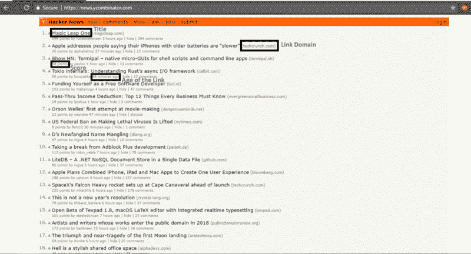
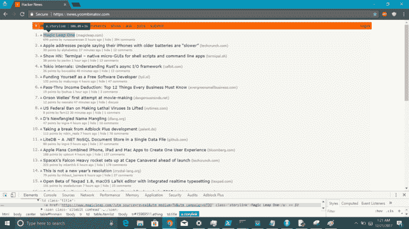

# 如何用仅仅 7 行 R 代码构建一个黑客新闻首页刮刀

> 原文：<https://www.freecodecamp.org/news/how-to-build-a-hacker-news-frontpage-scraper-with-just-7-lines-of-r-code-221af6acb98/>

通过 AMR

# 如何用仅仅 7 行 R 代码构建一个黑客新闻首页刮刀


This is not R — [https://www.pexels.com/photo/coffee-writing-computer-blogging-34676/](https://www.pexels.com/photo/coffee-writing-computer-blogging-34676/)

Web 抓取曾经是一项困难的任务，需要 XML 树解析和 HTTP 请求方面的专业知识。但是随着 beautiful soup(Python)和 rvest(R)等新一代抓取库的出现，web 抓取已经成为任何初学者的玩具。

这篇文章旨在解释使用 R——一种非常好的编程语言——来执行数据分析和数据可视化是多么简单。面前的任务非常简单。构建一个 web scraper，抓取互联网上最受欢迎的页面之一的内容(至少在编码人员中是这样的):[黑客新闻首页](https://news.ycombinator.com/)。

### 软件包安装和加载

我们将要使用的 R 包是`rvest.` `rvest`可以从[起重机](https://cran.r-project.org/web/packages/rvest/index.html)安装并加载到 R 中，如下所示:

```
library(rvest)
```

`rvest`的`read_html()`函数可用于提取 url 的 HTML 内容，作为 read_html 函数的参数。

```
content <- read_html('https://news.ycombinator.com/')
```

为了无忧无虑地工作，请确保您不在任何组织防火墙之后。如果是这样，用代理配置你的 RStudio 绕过防火墙，否则你可能会面临一个`connection timed out error`。

以下是 HN 首页布局截图(重点元素突出显示):



现在，将黑客新闻首页的 HTML 内容加载到 R 对象*内容*中，让我们提取我们需要的数据—从标题开始。

有一个特别重要的方面，使任何网页抓取任务成功。也就是识别 HTML 元素的正确 CSS 选择器或 XPath 值，这些元素的值应该被抓取。获得正确元素值的最简单方法是在任何浏览器的开发者工具中使用`the inspect tool` 。

下面是 CSS 选择器值的截图。当鼠标停留在黑客新闻首页的链接标题上时，它会被突出显示。



```
title <- content %>% html_nodes('a.storylink') %>% html_text()title [1] "Magic Leap One"                                                                   [2] "Show HN: Terminal – native micro-GUIs for shell scripts and command line apps"    [3] "Tokio internals: Understanding Rust's async I/O framework"                        [4] "Funding Yourself as a Free Software Developer"                                    [5] "US Federal Ban on Making Lethal Viruses Is Lifted"                                [6] "Pass-Thru Income Deduction"                                                       [7] "Orson Welles' first attempt at movie-making"                                      [8] "D’s Newfangled Name Mangling"                                                     [9] "Apple Plans Combined iPhone, iPad, and Mac Apps to Create One User Experience"    [10] "LiteDB – A .NET NoSQL Document Store in a Single Data File"                      [11] "Taking a break from Adblock Plus development"                                    [12] "SpaceX’s Falcon Heavy rocket sets up at Cape Canaveral ahead of launch"          [13] "This is not a new year’s resolution"                                             [14] "Artists and writers whose works enter the public domain in 2018"                 [15] "Open Beta of Texpad 1.8, macOS LaTeX editor with integrated real-time typesetting"[16] "The triumph and near-tragedy of the first Moon landing"                          [17] "Retrotechnology – PC desktop screenshots from 1983-2005"                         [18] "Google Maps' Moat"                                                               [19] "Regex Parser in C Using Continuation Passing"                                    [20] "AT&T giving $1000 bonus to all its employees because of tax reform"              [21] "How a PR Agency Stole Our Kickstarter Money"                                     [22] "Google Hangouts now on Firefox without plugins via WebRTC"                       [23] "Ubuntu 17.10 corrupting BIOS of many Lenovo laptop models"                       [24] "I Know What You Download on BitTorrent"                                          [25] "Carrie Fisher’s Private Philosophy Coach"                                        [26] "Show HN: Library of API collections for Postman"                                 [27] "Uber is officially a cab firm, says European court"                              [28] "The end of the Iceweasel Age (2016)"                                             [29] "Google will turn on native ad-blocking in Chrome on February 15"                 [30] "Bitcoin Cash deals frozen as insider trading is probed"
```

rvest 包支持管道%>%操作符。因此，包含 HTML 页面内容的 R 对象(用 read_html 读取)可以通过管道与使用 CSS 选择器或 XPath 作为其参数的`th html_node` s()连接。然后它可以提取相应的 XML 树(或 HTML 节点值),其文本值可以用`th html_tex` t()函数提取。

rvest 的美妙之处在于，它在 html_nodes()和 html_text()等函数的掩护下抽象了整个 XML 解析操作。从而使我们更容易用最少的代码实现我们的抓取目标。

与 Title 一样，网页中其他必需元素的 CSS 选择器值可以用 Chrome Inspect 工具来识别。它们也可以作为参数传递给 html_nodes()函数，各自的值可以被提取并存储在 R 对象中。

```
link_domain <- content %>% html_nodes('span.sitestr') %>% html_text()score <- content %>% html_nodes('span.score') %>% html_text()age <- content %>% html_nodes('span.age') %>% html_text()
```

所有重要的信息都是从这一页中提取出来的。现在，可以用提取的元素制作 R 数据帧，以将提取的数据放入结构化格式中。

```
df <- data.frame(title = title, link_domain = link_domain, score = score, age = age)
```

以下是 RStudio viewer 中最终数据帧的屏幕截图:


因此，在短短 7 行代码中，我们已经成功地用 r。

r 是一种执行数据分析和数据可视化的极好的语言。这里使用的代码可以在我的 github 上找到[。](https://github.com/amrrs/HN_scraper_in_R)