# 如何用 Next.js 和 Vercel - Jamstack 手册构建一个 Jamstack 站点

> 原文：<https://www.freecodecamp.org/news/how-to-build-a-jamstack-site-with-next-js-and-vercel-jamstack-handbook/>

Jamstack 架构是一个旧思想的现代方法:制作快速的静态网站，但使用 JavaScript 等工具使其动态化。

我们如何利用 web 框架 Next.js 和托管平台 Vercel 来构建和部署高性能、可靠的 web 应用？

*注意:这是我的 [Jamstack 手册](https://jamstackhandbook.com/)的预览，一本你需要了解的关于 Jamstack 的指南。它有 3 个教程，包括这个。[获取您的副本](https://jamstackhandbook.com/)，学习如何使用 JavaScript 和静态 web 构建快速、动态的应用程序。*

*   我们将建造什么？
*   第一步:开始下一步。JS React app
*   [步骤 2:用 Git 建立项目](#step-2-setting-up-the-project-with-git)
*   [步骤 3:用 Vercel 部署 Next.js】](#step-3-deploying-next-js-with-vercel)
*   [我们刚刚部署了什么？](#what-did-we-just-deploy)
*   [用 Git 理解现代 CI/CD](#understanding-modern-ci-cd-with-git)
*   [做出改变，看它自动展开](#make-a-change-and-watch-it-automatically-deploy)
*   我们学到了什么？

[https://www.youtube.com/embed/9nV4pIrKmyE?feature=oembed](https://www.youtube.com/embed/9nV4pIrKmyE?feature=oembed)

[Next.js](https://nextjs.org/) 是一个由 [Vercel](https://vercel.com/) 构建和维护的 web 框架。Next.js 使构建新的 React 应用程序变得容易，并提供了大量现成的功能，如服务器端呈现(SSR)和静态站点生成(SSG)。

## 我们将建造什么？

我们的项目本身会相对简单。我们将使用默认的 Next.js Starter 作为一种轻松引导项目的方式，学习如何配置 Next.js 进行静态编译，然后使用我们对 Vercel 的定制来部署该项目。

> Starter 是一个模板，允许开发人员从命令行重新创建该模板。安装 starter 时，框架将设置项目并安装所有依赖项。

## 第一步:开始下一步。JS React app

首先，我们要导航到我们想要创建项目的目录。

我们将使用一个启动器来创建我们的项目。为此，我们有两个选项供包管理器使用:yarn 或 npm。在本演练的剩余部分，您可以选择您认为更合适的方式。

```
yarn create next-app
# or
npx create-next-app
```

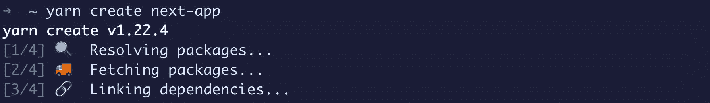

Creating a new Next.js app

运行该命令时，Next.js 将首先要求您输入项目名称。在这里，我们可以使用任何名称来标识项目。我要用我的-nextjs-app。


Naming a Next.js project

安装完成后，我们就可以开始使用 Next.js 了。

在终端中导航到项目所在的新目录并运行:

```
yarn dev
# or
npm run dev
```

这将启动您的开发服务器，这将使您的新站点在 [http://localhost:3000](http://localhost:3000) 可用。

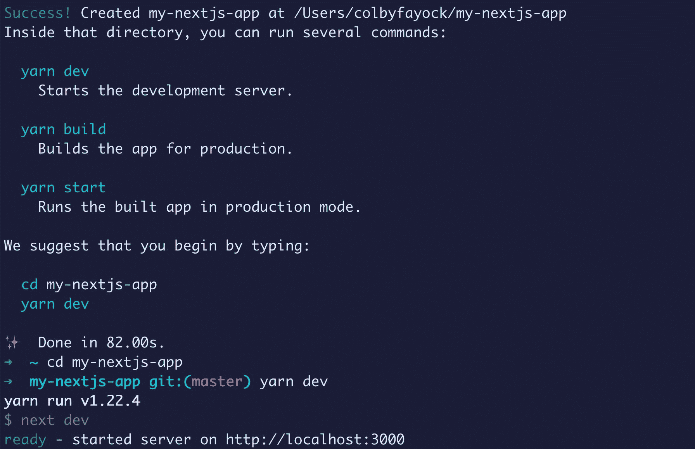

Starting Next.js development server

如果您打开您的 [http://localhost:3000](http://localhost:3000) 地址，您现在应该看到 Next.js 默认项目！

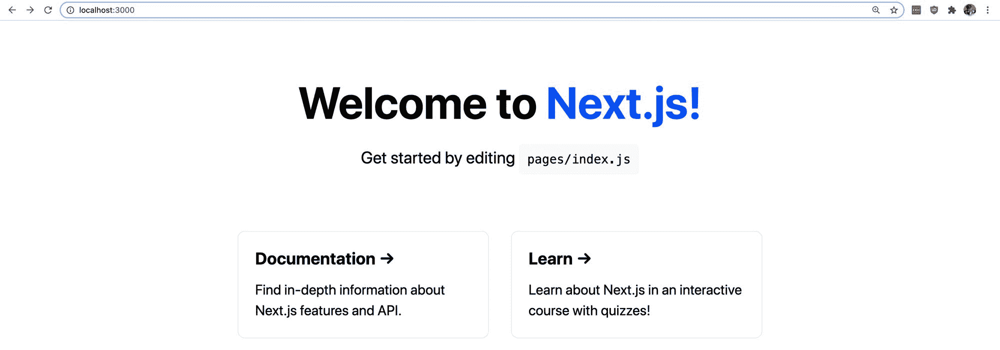

New Next.js app

## 步骤 2:用 Git 设置项目

你需要自己设置下一步。使用 Vercel 支持的 Git 提供者创建一个新的存储库。

在撰写本文时， [Vercel 支持 GitHub、Gitlab 和 Bitbucket](https://vercel.com/docs/git-integrations) 。

如果你是第一次选择提供商，GitHub 是一个可靠的选择，而且很容易上手。

然后，您需要将项目添加到新的存储库中，并将项目推送到 Git。

> 需要帮助吗？查看“使用命令行将现有项目添加到 GitHub”[https://docs . GitHub . com/en/GitHub/importing-your-projects-to-GitHub/使用命令行将现有项目添加到 GitHub](https://docs.github.com/en/github/importing-your-projects-to-github/adding-an-existing-project-to-github-using-the-command-line)

对于本演练的其余部分，我将引用 GitHub，但对于任何受支持的提供者，说明应该是相同的。

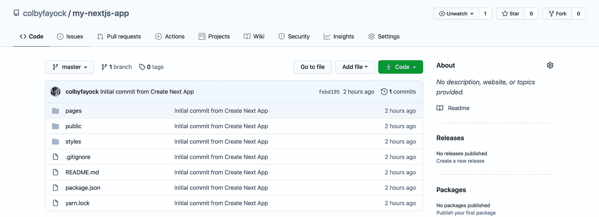

Next.js app on GitHub

## 步骤 3:用 Vercel 部署 Next.js

一旦你的项目用 GitHub 设置好，导航到 vercel.com 并登录。

如果您还没有 Vercel 帐户，现在应该创建一个。我建议用你的 GitHub 帐户创建一个帐户，因为它会帮助你导入你的项目。

在 Vercel 仪表盘内，点击**导入项目**。

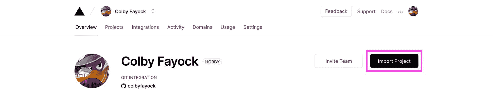

Import project to Vercel

接下来，在 Import Git Repository 下，点击**继续**。

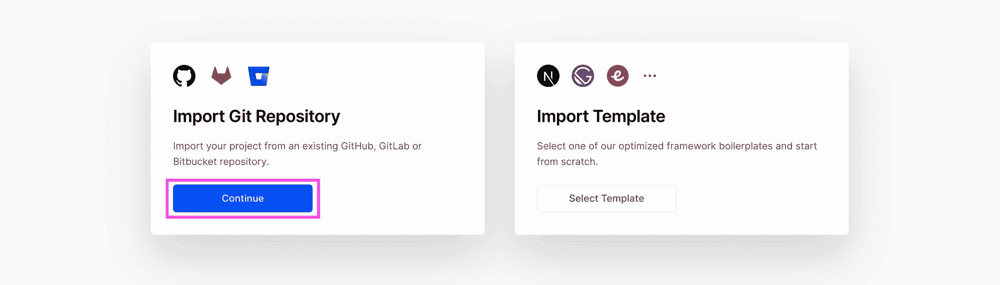

Import Git repository to Vercel

Vercel 现在会询问存储库 URL。这将是您刚刚为您的项目创建的存储库的主页。


Add Git repo URL to Vercel

在你点击 Continue 之后，Vercel 已经检测到你的项目使用了 Next.js，这意味着我们不需要设置和自定义配置，可以点击 Deploy！

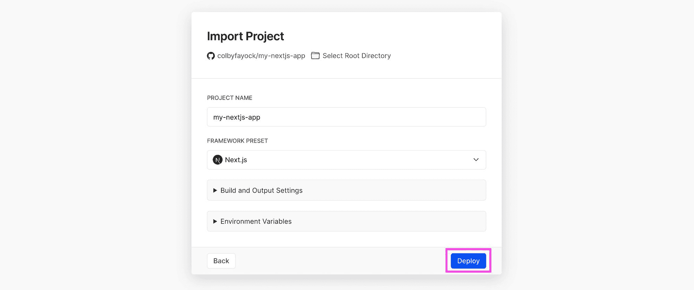

Deploy Next.js project to Vercel

此时，Vercel 将开始工作，开始构建新项目并将其部署到他们的基础设施中。

一旦完成，它会祝贺你，并给你一个访问你的网站的链接。

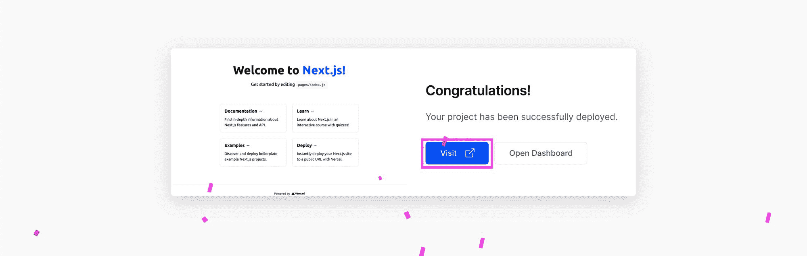

Vercel project successfully deployed

单击“访问”,您将被定向到 internet 上的项目直播:

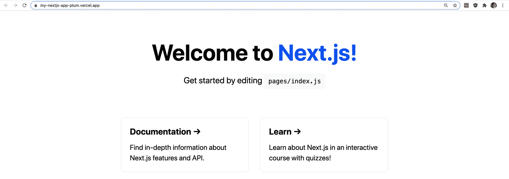

Next.js app live

## 我们刚刚部署了什么？

我们刚刚用 Next.js 创建了一个新的 React 应用程序，并将其部署到 Vercel。

我们将详细介绍每个具体步骤:

*   **创建 Next App:** 我们首先在电脑上创建了一个新的 Next.js 项目。这为我们提供了一个新的 React 应用程序，包括依赖项和代码，以开始一个基本的网站。
*   **将项目添加到 Git:** 我们将新的 Next.js 项目添加到由 Vercel 支持的 Git 在线存储库中。这使得我们可以轻松地将项目与其他服务(如 Vercel)进行交互。
*   **将 Git 连接到 Vercel:** 我们将项目从 Git 导入到 Vercel。这允许 Vercel 与我们的代码进行交互。
*   **Build&Deploy with Vercel:**Vercel 下载了我们的代码，能够识别出这是一个 Next.js 项目，构建了我们的项目，并将编译后的输出部署到它的基础设施中，并在 web 上提供。

如果你在等待更多的步骤来让你的项目走向世界，那就没有了！发布一个新的 React 项目的起点现在比以往任何时候都低，Next.js 和 Vercel 正在帮助你实现这个目标。

## 用 Git 理解现代 CI / CD

像 Vercel 这样的现代基础设施提供商的另一个好处是，当利用 GitHub 作为服务连接时，Vercel 可以监视我们主要分支上的变化。

一旦 Vercel 意识到发生了变化，它将下载最新的代码，并重新运行与我们第一次所做的相同的过程(除了任何缓存和优化)。

这意味着，每当我们对生产分支进行新的变更时，它们都会被自动部署。

## 进行更改并观察它自动部署

为了测试自动部署，让我们对我们的项目进行更改。

在我们的项目中，让我们对`pages/index.js`中的一些页面内容进行修改。我准备把标题改成“科尔比的 Next.js 项目”。

```
<h1 className={styles.title}>
  Colby's Next.js App
</h1>
```

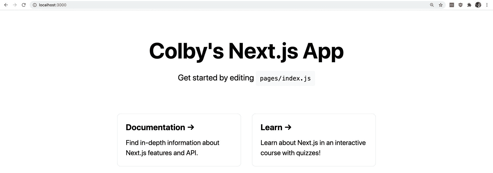

Next.js app with change

接下来，将这个更改提交到您的主 Git 分支，并将其推送到 GitHub。

如果您等待几秒钟并导航回[vercel.com](https://vercel.com)，找到您的项目并点击部署选项卡。

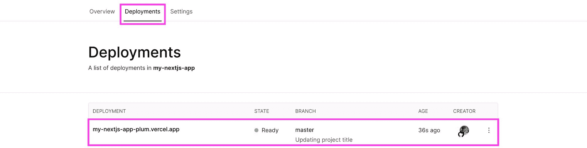

Vercel deployment when change detected

您将看到您的项目现在正在运行，或者如果您不够快，可能已经完成。现在，如果您再次打开您的网站链接，您将看到已部署的更改！


Deployed changed Next.js app to Vercel

## 我们学到了什么？

Next.js 是一个 web 框架，它允许我们快速轻松地构建一个新的 React 应用程序。

这一点，以及其他类似的框架，对于立即提高工作效率，而不是花时间自己构建项目框架是非常有用的。

Vercel 是一个托管和部署平台，它允许我们与我们最喜欢的受支持的 Git 提供者集成。一旦连接上，Vercel 将下载我们的项目，构建我们的项目，并将输出部署到互联网上。

像 Vercel 这样的现代基础设施工具将会关注我们的 Git 库的变化，并将构建和部署我们的项目，以便我们总是看到最新的版本。

## 了解更多关于 Jamstack 的信息！

你可以通过我的 Jamstack 手册了解更多关于 Jamstack 的知识，包括 2 个更深入的教程。

[【jamstackhandbook.com】阶下](https://jamstackhandbook.com/)

[](https://twitter.com/colbyfayock)

*   [？在 Twitter 上关注我](https://twitter.com/colbyfayock)
*   [？订阅我的 Youtube](https://youtube.com/colbyfayock)
*   [✉️注册我的简讯](https://www.colbyfayock.com/newsletter/)
*   [？赞助我](https://github.com/sponsors/colbyfayock)