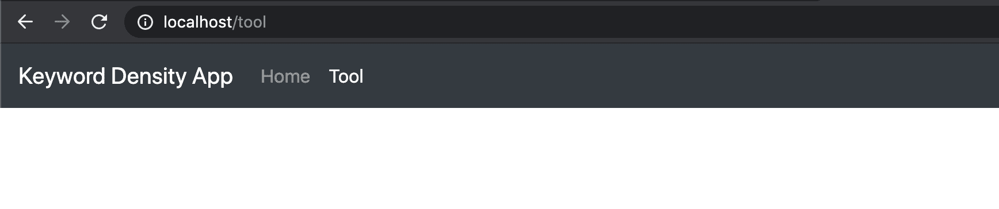
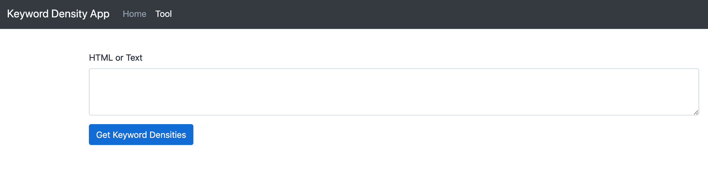
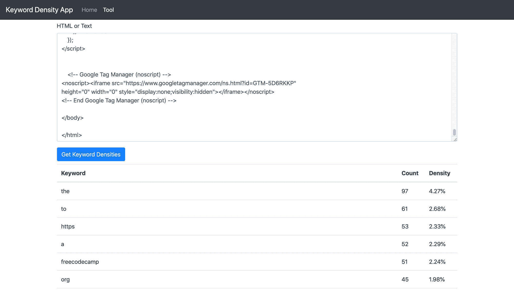

# PHP Laravel 教程——如何从头开始构建一个关键词密度工具

> 原文：<https://www.freecodecamp.org/news/how-to-build-a-keyword-density-tool-with-laravel/>

你好，freeCodeCamp 的读者们。我希望我能给你带来一些伟大的编码内容的灵感，教育，当然，乐趣！

在本教程中，我们将了解关键词密度，以及如何使用 Laravel 构建一个可以计算关键词密度的工具。

网络工具将允许我们粘贴一整页的 HTML。然后，魔术将被执行给我们一个精确的关键字密度分数。

简单总结一下，这里有一些我们在构建工具时会涉及到的基本技能。

1.  Laravel 路线、控制器和视图
2.  Laravel 布局
3.  HTML 和表单
4.  JQuery 和 Ajax
5.  一些原生 PHP
6.  有点 SEO！

## 什么是关键词密度？

如果你有自己的网站或博客，你可能已经知道什么是关键词密度。对于那些不知道它是什么意思的人，我将在下面给出一个简短而甜蜜的解释。

关键词密度是通常在一大段文本中计算单词或关键词出现的次数。密度以百分比报告，用以下公式简单计算。

关键字密度=(关键字数/字数)* 100

### 为什么这很重要？

关键词密度是谷歌搜索引擎算法中的一个关键因素。人们普遍认为，为谷歌排名优化网页的一个好的关键词密度是 3.5%左右。如果百分比更高，例如 20%，那么这可能被视为“关键字填充”，因此可能会严重影响您的谷歌搜索排名。

所以，这是关于 SEO 的一个很小的教训，并给你一点我们试图建立的背景。

## 用 Laravel 构建关键词密度工具

本教程将假设我们都从一个全新的 Laravel 构建开始，使任何人都可以从任何特定的点继续。(如果开头几节是告诉你去吸蛋，那就抱歉了！)

此外，只是为了进一步的背景下，我是建立在 MacOS 与 XAMPP 本地。

### 先决条件

1.  安装一个 PHP 环境并访问根目录
2.  已安装作曲家
3.  你最喜欢的代码编辑器，解释 PHP，HTML，CSS 和 JS。

检查完所有这些先决条件后，我们现在可以动手了。

## 创建我们的 Laravel 应用程序

首先，我们需要下载并安装一个新的 Laravel 版本。按照下面的步骤来实现这一点。

1.  在 web 服务器的根目录下打开命令行界面，例如 XAMPP⁩/⁨xamppfiles/⁩htdocs/
2.  运行以下命令，让 composer 发挥它的魔力

```
composer create-project --prefer-dist laravel/laravel KeywordDensityApp
```

**顶部提示:**如果您正在 MacOS 上工作，那么请执行以下步骤来启用对 Laravel 存储文件夹的权限。

1.  通过您的 CLI 导航到项目文件夹(' KeywordDensityApp ')
2.  运行以下命令

```
sudo chmod -R 777 storage/*
```

## 添加控制器和视图

现在我们已经有了基本的方法，我们可以开始建立我们的控制器和网页，允许用户粘贴和分析一些 HTML。

我们可以用两种方式创建一个新的控制器:通过 PHP artisan 命令行助手或者简单地用你的代码编辑器创建。请随意使用以下任何方法，只要确保控制器匹配即可

### 用 PHP artisan 创建控制器

```
php artisan make:controller ToolController
```

### 用代码编辑器创建控制器

1.  找到以下位置-project folder/App/Http/Controllers
2.  创建新的。名为 ToolController 的 php 文件

确保这个新创建的文件包含以下内容:

```
<?php

namespace App\Http\Controllers;

use Illuminate\Http\Request;

class ToolController extends Controller
{
    //
} 
```

现在让我们创建视图。

### 用代码编辑器创建视图

1.  找到项目文件夹/资源/视图下的视图文件夹
2.  创建一个名为 tool 的新文件夹
3.  创建一个名为 index.blade.php 的新视图 PHP 文件

### 现在让我们创建一个布局文件

对于大多数 Laravel 应用程序，您会希望构建一个布局文件，这样您就不必一遍又一遍地重复大量的 HTML 来获得相同的设计。

这个布局非常简单，使用一个简单的引导模板，并有一个对“内容”区域的@yield 调用，我们将在视图中使用它。此外，还有一个对“脚本”的@yield 调用，我们稍后会用到它。

1.  找到项目文件夹/资源/视图下的视图文件夹
2.  在此创建一个名为 layouts 的新文件夹
3.  创建一个名为 master.blade.php 的新文件
4.  将以下代码添加到文件中

```
<!DOCTYPE html>
<html lang="{{ str_replace('_', '-', app()->getLocale()) }}">
<head>
    <meta charset="utf-8">
    <meta name="viewport" content="width=device-width, initial-scale=1">

    <title>Keyword Density Tool</title>
    <link rel="stylesheet" href="https://stackpath.bootstrapcdn.com/bootstrap/4.4.1/css/bootstrap.min.css"
          integrity="sha384-Vkoo8x4CGsO3+Hhxv8T/Q5PaXtkKtu6ug5TOeNV6gBiFeWPGFN9MuhOf23Q9Ifjh" crossorigin="anonymous">
    <!-- Fonts -->
    <link href="https://fonts.googleapis.com/css?family=Nunito:200,600" rel="stylesheet">
    <meta name="csrf-token" content="{{ csrf_token() }}">
<style>
    body {padding-top: 5em;}
</style>
</head>
<body>

<nav class="navbar navbar-expand-md navbar-dark bg-dark fixed-top">
    <a class="navbar-brand" href="#">Keyword Density App</a>
    <button class="navbar-toggler" type="button" data-toggle="collapse" data-target="#navbarsExampleDefault" aria-controls="navbarsExampleDefault" aria-expanded="false" aria-label="Toggle navigation">
        <span class="navbar-toggler-icon"></span>
    </button>

    <div class="collapse navbar-collapse" id="navbarsExampleDefault">
        <ul class="navbar-nav mr-auto">
            <li class="nav-item">
                <a class="nav-link" href="/">Home <span class="sr-only">(current)</span></a>
            </li>
            <li class="nav-item active">
                <a class="nav-link" href="{{route('KDTool')}}">Tool</a>
            </li>
        </ul>

    </div>
</nav>

<main role="main" class="container mt-3">

    @yield('content')

</main><!-- /.container -->

<script src="https://code.jquery.com/jquery-3.2.1.min.js"></script>
<script src="https://cdn.jsdelivr.net/npm/popper.js@1.16.0/dist/umd/popper.min.js"></script>
<script src="https://stackpath.bootstrapcdn.com/bootstrap/4.4.1/js/bootstrap.min.js"></script>
@yield('scripts')
</body>
</html>
```

### 扩展我们的视图以使用布局文件

现在让我们在欢迎视图和工具索引视图中使用新创建的布局文件。按照以下步骤扩展布局。

1.  将以下代码添加到 project folder/resources/views/welcome . blade . PHP 和 project folder/resources/views/tool/index . blade . PHP 中

```
@extends('layouts.master')

@section('content')

@endsection
```

尝试呈现工具目录的索引页面，例如 localhost/tool。它应该看起来像下面这样。



Basic view layout

## 链接控制器、路线和视图

现在我们有了一个控制器和视图，我们需要首先定义一个路由，然后向控制器添加一个返回视图方法。

### 定义路线

1.  在 ProjectFolder/routes/web.php 下找到 web routes 文件
2.  将以下代码添加到文件的底部:

```
Route::get('/tool', 'ToolController@index')->name('KDTool');
```

### 创建新的控制器方法

现在，回到 ToolController 并添加以下函数:

```
public function index()
{
   return view('tool.index');
}
```

您可以根据个人喜好随意更改视图名称、路由 URL 或控制器功能。只要确保它们都匹配，页面呈现。

## 构建我们的工具视图

现在，有了我们之前设置的视图和布局文件，我们可以开始添加我们需要的 HTML 格式的内容。它只包含一些文本、文本区输入表单和一个提交按钮。

将以下 HTML 添加到 project folder/resources/views/tool/index . blade . PHP 文件的内容部分。

```
 <form id="keywordDensityInputForm">
        <div class="form-group">
            <label for="keywordDensityInput">HTML or Text</label>
            <textarea class="form-control" id="keywordDensityInput" rows="12"></textarea>
        </div>
        <button type="submit" class="btn btn-primary mb-2">Get Keyword Densities</button>
    </form>
```

视图现在应该呈现如下:



Keyword Density Tool View with Text Area input

## 创建前端和后端之间的桥梁

现在，我们在前端几乎拥有了我们需要的一切:一个简单的输入文本区域，用户可以在其中粘贴纯文本或 HTML。缺少的是按下“获取关键字密度”按钮时的逻辑。

这个桥接逻辑将基本上完成以下工作。

1.  聆听点击获取关键字密度按钮的声音
2.  抓取非空文本区输入的内容
3.  使用 JQuery Ajax 将数据发送到后端进行处理，并等待响应。
4.  当响应被传回时，处理数据并创建一个包含人类可读统计信息(关键字密度)的 HTML 表。

### 前端

为此，我们将使用一个页面内脚本，我们可以使用@section 标签注入该脚本。

将以下内容添加到 tool/index.blade.php 视图的内容部分之后。

```
@section ('scripts')
    <script>
        $('#keywordDensityInputForm').on('submit', function (e) { // Listen for submit button click and form submission.
            e.preventDefault(); // Prevent the form from submitting
            let kdInput = $('#keywordDensityInput').val(); // Get the input
            if (kdInput !== "") { // If input is not empty.
			// Set CSRF token up with ajax.
                $.ajaxSetup({
                    headers: {
                        'X-CSRF-TOKEN': $('meta[name="csrf-token"]').attr('content')
                    }
                });

                $.ajax({ // Pass data to backend
                    type: "POST",
                    url: "/tool/calculate-and-get-density",
                    data: {'keywordInput': kdInput},
                    success: function (response) {
                        // On Success, build a data table with keyword and densities
                        if (response.length > 0) {
                            let html = "<table class='table'><tbody><thead>";
                            html += "<th>Keyword</th>";
                            html += "<th>Count</th>";
                            html += "<th>Density</th>";
                            html += "</thead><tbody>";

                            for (let i = 0; i < response.length; i++) {
                                html += "<tr><td>"+response[i].keyword+"</td>";
                                html += "<td>"+response[i].count+"</td>";
                                html += "<td>"+response[i].density+"%</td></tr>";
                            }

                            html += "</tbody></table>";

                            $('#keywordDensityInputForm').after(html); // Append the html table after the form.
                        }
                    },
                });
            }
        })
    </script>
@endsection
```

我们注入的整个脚本将处理上面所有编号的列表项。

剩下要做的就是处理来自后端的数据。

### 后端

首先，在我们进一步进行编码之前，我们需要处理这样一个事实，即纯文本和 HTML 都可以提交。为此，我们可以使用一个漂亮的工具来帮助我们。

对于这个用例来说，html2text 是完美的 PHP 库，所以是时候安装它了。html2text 完全按照 tin 上所说的做，将 html 标记转换为纯文本。

幸运的是，这个包有一个 composer install 命令，所以在项目根目录下的 CLI 中输入以下命令。

```
composer require html2text/html2text
```

现在，我们的后端控制器将从视图中创建的 HTML 表单接收 HTML 或纯文本请求。我们现在需要创建一个路由来处理这个调用，并将这个调用路由到将发挥神奇作用的特定控制器。

将以下 PHP 添加到 web.php 路由文件中:

```
Route::post('/tool/calculate-and-get-density', 'ToolController@CalculateAndGetDensity');
```

其次，将以下内容添加到 ToolController.php 文件中:

```
 public function CalculateAndGetDensity(Request $request) {
        if ($request->isMethod('GET')) {

        }
    }
```

好了，舞台已经准备好了。让我们编写代码来计算关键字密度并返回数据。

首先，新安装的 html2text 包需要添加 use 语句。将以下内容添加到 ToolController.php 的顶部，在其他使用声明的正下方:

```
use Html2Text\Html2Text;
```

然后我们需要处理传入的 get 参数，确保它没有被设置，然后将参数内容转换为纯文本。重构 CalculateAndGetDensity 函数，如下所示:

```
public function CalculateAndGetDensity(Request $request) {
        if ($request->isMethod('GET')) {

            if (isset($request->keywordInput)) { // Test the parameter is set.
                $html = new Html2Text($request->keywordInput); // Setup the html2text obj.
                $text = $html->getText(); // Execute the getText() function.

            }

        }
    }
```

现在我们有了一个变量来保存为 keywordInput 参数剥离的所有文本，我们可以开始计算密度了。

我们需要处理以下问题:

1.  确定总字数
2.  分析文本字符串并将其转换为键值数组(键是关键字，值是单词的出现次数)
3.  按降序排序，从数组中最大的匹配项开始
4.  循环访问键和值数组，将值推送到一个新的数组，该数组带有一个额外的“density”字段，该字段利用了我们在本文前面看到的关键字 density 公式。此公式将使用值(出现次数)和总字数。
5.  最后，返回数据

记下注释，将函数重构为如下所示:

```
public function CalculateAndGetDensity(Request $request) {
        if ($request->isMethod('GET')) {

            if (isset($request->keywordInput)) { // Test the parameter is set.
                $html = new Html2Text($request->keywordInput); // Setup the html2text obj.
                $text = strtolower($html->getText()); // Execute the getText() function and convert all text to lower case to prevent work duplication
                $totalWordCount = str_word_count($text); // Get the total count of words in the text string
                $wordsAndOccurrence  = array_count_values(str_word_count($text, 1)); // Get each word and the occurrence count as key value array
                arsort($wordsAndOccurrence); // Sort into descending order of the array value (occurrence)

                $keywordDensityArray = [];
                // Build the array
                foreach ($wordsAndOccurrence as $key => $value) {
                    $keywordDensityArray[] = ["keyword" => $key, // keyword
                        "count" => $value, // word occurrences
                        "density" => round(($value / $totalWordCount) * 100,2)]; // Round density to two decimal places.
                }

                return $keywordDensityArray;
            }
        }
    }
```

**注意:**html 2 text 的美妙之处在于，它并不真正关心它首先转换的是 HTML 还是纯文本，所以我们不需要担心用户提交的是 HTML 还是纯文本。它仍然会生成纯文本。

## 对其进行测试

最后，我们准备好测试工具了，哇哦！继续并呈现工具索引视图(localhost/tool)。

1.  现在，你可以去任何你选择的网站，从那个网站加载一个页面，点击右键，然后点击查看源代码。
2.  复制全部内容并返回工具。
3.  将内容粘贴到文本区域，然后单击获取关键字密度按钮。
4.  等待回复并查看关键字密度表！
5.  看看我下面的例子，它使用了这个页面的 HTML。



Keyword Density Tool & Table of keywords

就是这样！

## 摘要

在本文中，我们学习了如何从头构建一个 Laravel 应用程序。它触及了开发中的整个堆栈的不同部分，如 JQuery、PHP、HTML 等。希望随着对这个应用程序的理解，同样的方法可以用来构建其他的东西，也许更大更好。

### 可能的进一步发展

关键字密度工具目前将“停止”字考虑在内。众所周知，谷歌爬虫会忽略停用词。it，the，as，a 之类的词，看上面的工具截图，可以看出用的很多！

可以进行进一步的开发来过滤停用词，并只计算非停用词的密度，这可能是 SEO 评分的更好视图。

我希望你喜欢这篇文章！如果你有，请随意看看我的博客，[https://www.codewall.co.uk/](https://www.codewall.co.uk/)

下次见！