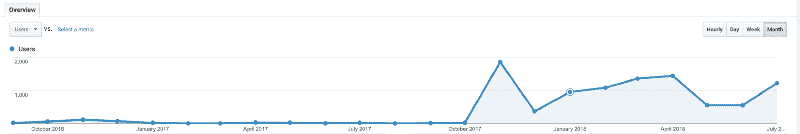
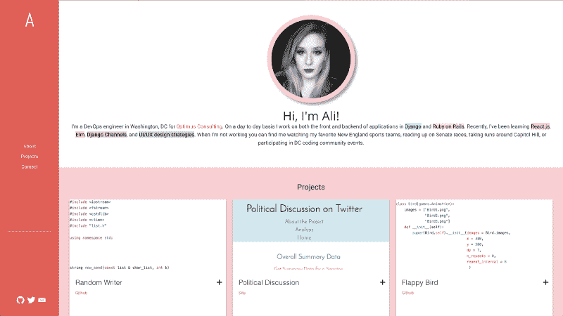
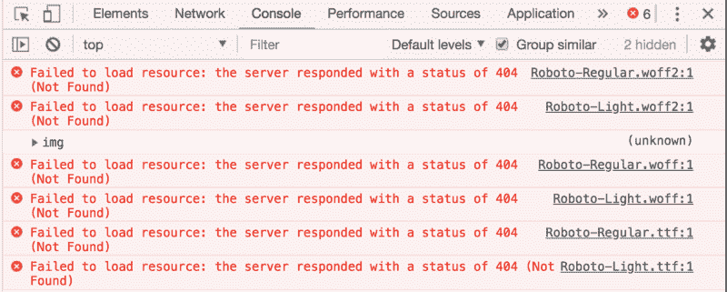
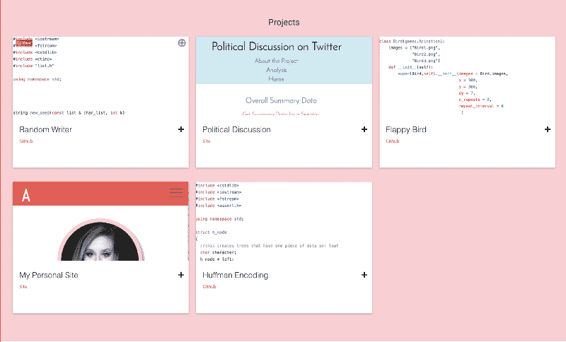
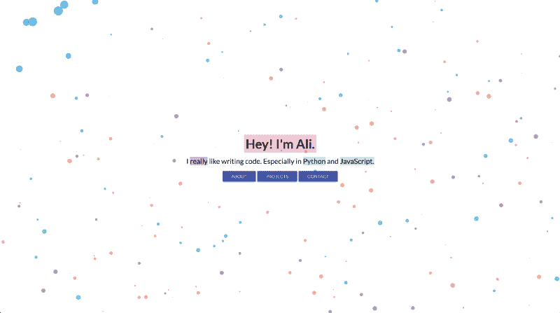
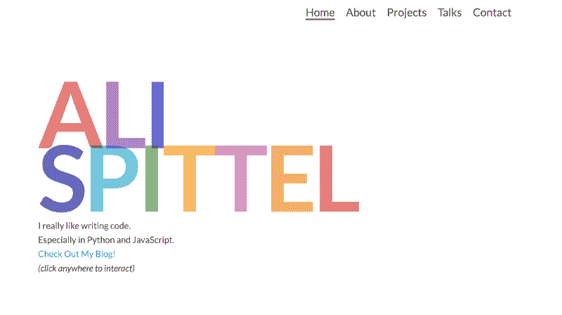
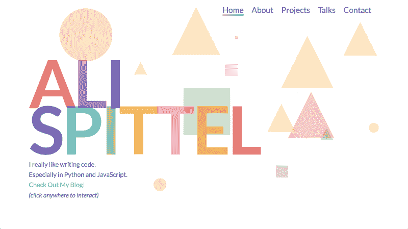

# 如何建立一个 kickbutt 组合

> 原文：<https://www.freecodecamp.org/news/how-to-build-a-kickbutt-portfolio-57b26a0b825d/>

作者:阿里·斯皮特尔

这些年来，我重建了我的网站几次，并对我的作品集的展示方式做了一些改变。在这篇文章中，我将分享我的个人建议，并深入探讨什么有效，什么无效，以帮助你建立一个令人敬畏的投资组合。我还会给你提供一些我喜欢的其他人的投资组合的链接。

据 GitHub 报道，我从 2016 年 9 月开始就有了一个个人网站，里面有我的作品集。查看我网站的谷歌分析，从 2016 年 9 月到 2017 年 10 月，我的投资组合的两次迭代只有不到 300 次浏览。我很沮丧，但我没有放弃。？

2017 年 10 月，我对[我的网站](https://www.alispit.tel/)做了一次彻底的重写，结果相当戏剧化。我在第一个月就获得了 1861 次浏览，从那以后，我平均每个月都有上千次点击。

当然，相关性不是因果关系，但我认为重新设计肯定有积极的影响。这不完全是脸书，但对于一个除了我的信息之外什么都不向浏览者提供的投资组合网站来说，我认为这些数字已经很不错了。？

Personal Site Visitors

### 什么没起作用

在我开始我目前真正喜欢的作品之前，我想谈谈我的前两个网站。

#### 我的第一个作品集

第一个作品集是一个 Jekyll 网站，使用了 SASS 和 Pug。出于怀旧的原因，我将它部署在这里。看看项目，都是大学的，大部分都是 C++！

My first iteration - Learning CSS

对于网站的实际内容来说，这种设置是不必要的复杂。这么简单的页面我用了 Jekyll，Materialize (CSS 框架)，SASS，Pug。我认为 Gulp 设置比实际需要的 CSS 要长。？

我刚刚过渡到以任何身份编写前端代码，所以这对我来说确实是一个使用 SASS 和 Gulp 的学习机会。我也不需要哲基尔。我只列出了几个项目，只有一页。

此外，控制台中显示了一堆 404，用于未找到的资源。如果我是一个正在浏览网站的开发者，我肯定会对此提出批评。

我的项目截图不是很好。它们要么是编码的，要么是以非最佳方式裁剪的。

字体也太小，所以很难阅读文本。我的社交偶像并不是最突出的，这意味着他们可能没有太高的参与率。

不过，有些事情我做得很好。我真的很喜欢简历中突出显示的单词。它吸引用户去看那些关键词，即使他们没有阅读整个简历。我也很欣赏这个网站的响应速度，这样用户就可以在不同大小的屏幕上浏览这个网站。目前，我大约三分之一的流量来自移动端，所以记住这些用户很重要。

#### 我的第二个作品集

My second iteration - Polka Dots :-)

第二次迭代是一个 HTML 和 CSS 网站，背景是移动的圆点。你可以点击查看[。我承认我仍然对这个投资组合情有独钟。](http://third-match.surge.sh/)

我真的很喜欢移动的气泡，以及它们如何随着用户交互而变化。我也喜欢这个网站的简约风格。我认为主页上的快速简历很有效，很好地表达了我的兴趣。

同样，字体有点小，必须导航到一个新的 HTML 页面才能查看关于我的任何信息，这可能不是最好的用户体验。此外，把我的演讲和我的代码项目放在同一个页面上，会让它看起来不平衡和混乱。

总的来说，你可以在我目前的作品中看到这个作品集的很多主题。

### 什么奏效了

去年 10 月，我从零开始，建立了一个有点与众不同的[投资组合](https://www.alispit.tel/)。**你的作品集是你将建立的唯一一个完全创造性表达自己的网站，没有任何限制。**

所以，我全力以赴——内置互动、动画，应有尽有。

My final iteration - The Works

如果你点击主页上的任何地方，就会出现一个随机的形状。如果你将鼠标悬停在字母上，它们会显示动画。如果你把鼠标悬停在我的照片上，它就会旋转。

我在这个作品集里使用了 Vue，所以它可以无缝地从一页过渡到另一页。我还增加了字体大小，这样读者可以更快更容易地收集信息。我的联系人页面提供了大按钮，可以在互联网上的任何地方关注我。

这种设计的最初版本是用 HTML、CSS 和几行 JavaScript 构建的。就我的技术需求而言，这完全没问题。出于我自己的可维护性需求，我想转移到 Vue。重新配置的设置使得添加新项目变得更加容易。我也喜欢 Vue Router 提供的平滑路由，而不是导航到一个实际的新页面。

这个设计抓住了人们的注意力，他们停留在网站上是为了与之互动。此外，人们经常联系我，询问我的网站，如果我在找工作的话，那就太棒了！

### 我还能做得更好的地方

以下是我仍然可以改进的一些地方

*   至于将人们转化到我的其他社交媒体的有效性，我可以在每个页面上有到我的其他社交媒体的链接，而不仅仅是联系页面。
*   我可能还需要筛选我的项目，选择几个来展示，而不是列出 26 个个人项目。
*   我也没有我的项目截图。这是故意的，但是如果我把这个项目的截图放在他们上面，我可能会给他们带来更多的流量。我不喜欢在我的程序截图中添加不同的调色板。

我没有太多让我觉得超级印象深刻的项目。在大多数情况下，它们非常小，我创建它们是为了学习一些东西。我可以进一步优化我的网站，但现在，我真的很喜欢它的位置。

### 我的技巧为建立一个 kickbutt 投资组合

*   制作一个真实表达自己的作品集。从很多方面来说，编程是一个创造性的领域，所以发挥你的创造力吧！
*   使网站具有互动性，这样人们就会想呆在你的网站上，并且记住它。
*   买个域名。我从 aspittel.github.io 转到了 alispit.tel，我真的很喜欢我名字上的玩法，你可以很便宜地得到很多域名。我使用 NameCheap，它完全值得这个域名每年 8 美元的费用。
*   确保您没有控制台错误。很多技术雇主都在寻找这个，所以要确保你的网站没有 bug！
*   不要仅仅为了使用某项技术而使用它。如果你有一个超级简约的个人网站，不要为了使用而使用重型框架或库。拥有一个超级慢的简单网站是糟糕的用户体验。
*   确保你的网站能够在手机上响应和运行。我也鼓励你让它为使用分屏设置的用户工作。
*   我会避免使用网上找到的模板。对我来说，当这些被使用的时候，它是非常明显的。我理解非 web 开发人员使用它们，但是如果你是 web 开发人员，就展示你的技能吧！
*   利用投资组合推销自己。如果你想向雇主炫耀特定的技能，确保这些技能在你的网站上有所体现。我想让人们访问我的博客，所以我把它放在了我的主页上。我也想做更多的演讲，所以我有一整页的篇幅来做我的演讲。我不想再专业地写 C++代码，所以我把这些项目从我的网站上删除了。
*   请确保您的链接没有断开。在某些方面，我完全犯了罪，但它看起来并不好，然后你的观众就看不到那个目的地了！
*   保持你的投资组合是最新的。我也为没有经常这样做而感到内疚，但我至少每隔几个月就会尝试在我的网站上添加新的项目和讲座。
*   用批判的眼光，有意识地进行设计。在进入代码之前，我用草图来绘制我的网站。
*   想想页面速度。我在我所有的网站上运行了 [lighthouse](https://developers.google.com/web/tools/lighthouse/) 测试，以确保它们的性能。

### 我最喜欢的几个投资组合

*   蒂莫·贝克尔(Timo Becker)——你把这些点连接起来，创造出不同的插图——只是玩玩它，太棒了。
*   Ben Halpern -这个网站是如此令人难忘和有趣。
*   朱莉娅·库塞诺娃(Julia Khusainova)——这个网站非常简约，但传达了重点。
*   Nik Papic——又一个简单却漂亮的。
*   罗比·莱昂纳迪 -一份游戏简历！
*   [Dinesh Pandiyan](https://flexdinesh.github.io/) -颜色变化是一个非常酷的功能，我喜欢极简主义的设计。

### 你的网站

我喜欢看别人的投资组合，并为他们提供建议。当我看到投资组合反馈线索时，我总是对它们进行评论。如果你有一个正在寻找反馈的网站，[发推特](https://twitter.com/aspittel)给我一个你网站的链接，我会看一下，然后给你一些反馈！或者，如果你有一个很棒的，也发给我吧！我很想把它加入我的最爱列表。

另外，如果你喜欢这篇文章，[订阅](https://tinyletter.com/ali_writes_code)我的每周简讯，里面有我本周最喜欢的链接！

*最初发表于[zen-of-programming.com](https://zen-of-programming.com/kickass-portfolio)。*