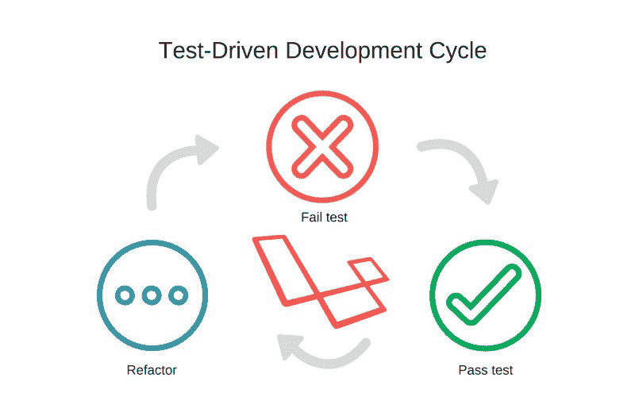

# 如何用测试驱动开发构建 Laravel REST API

> 原文：<https://www.freecodecamp.org/news/how-to-build-a-laravel-rest-api-with-test-driven-development-c4bb6417db3c/>

作者 Kofo Okesola

# 如何用测试驱动开发构建 Laravel REST API



Test-driven Laravel development

TDD 和敏捷开发方法论的先驱之一 James Grenning 有一句名言:

> 如果你不是在做测试驱动的开发，你就是在做调试之后的开发

今天我们将进行一次由测试驱动的旅行。我们将创建一个具有认证和 CRUD 功能的 Laravel REST API，而无需打开 Postman 或浏览器。？

> **注意:**本演练假设您理解了 [Laravel](https://laravel.com/docs/5.7) 和 [PHPUnit](https://phpunit.de/documentation.html) 的基本概念。如果你不介意的话？我们开车吧。

#### 设置项目

首先用`composer create-project --prefer-dist laravel/laravel tdd-journey`创建一个新的 Laravel 项目。

接下来，我们需要运行我们将使用的认证架子，继续运行`php artisan make:auth`，然后运行`php artisan migrate`。

我们实际上不会使用生成的路线和视图。对于这个项目，我们将使用 [jwt-auth](https://github.com/tymondesigns/jwt-auth) 。所以请继续[在你的应用中设置](https://github.com/tymondesigns/jwt-auth/wiki/Installation)。

> **注意:**如果你对 JWT 的`generate`命令有错误，你可以按照[这个](https://github.com/tymondesigns/jwt-auth/issues/1298#issuecomment-330458018)修复，直到它被添加到稳定版本。

最后，你可以删除`tests/Unit`和`tests/Feature`文件夹中的`ExampleTest`，这样它就不会干扰我们的测试结果，我们就可以开始了。

#### **编写代码**

1.  首先将您的`auth`配置设置为默认使用 JWT 驱动程序:

然后将以下内容添加到您的`routes/api.php`文件中:

2.现在我们已经设置好了驱动程序，用同样的方式设置您的用户模型:

我们所做的只是实现了`JWTSubject`并添加了所需的方法。

3.接下来，我们需要在控制器中添加我们的身份验证方法。

运行`php artisan make:controller AuthController`并添加以下方法:

这一步非常简单，我们所做的就是将`authenticate`和`register`方法添加到我们的控制器中。在`authenticate`方法中，我们验证输入，尝试登录，如果成功就返回令牌。在 register 方法中，我们验证输入，用输入创建一个新用户，并基于此为用户生成一个令牌。

4.接下来，进入精彩部分。测试我们刚刚写的东西。使用`php artisan make:test AuthTest`生成测试类。在新的`tests/Feature/AuthTest`中添加这些方法:

上面代码中的注释很好地描述了代码。您应该注意的一件事是我们如何在每个测试中创建和删除用户。测试的全部意义在于，理想情况下，它们应该相互独立，并且独立于数据库状态。

现在运行`$vendor/bin/phpunit`或`$ phpunit`，如果你已经在全球范围内安装了的话。运行它应该会给出成功的断言。如果不是这样，您可以查看日志，修复并重新测试。这就是 TDD 的美丽循环。

5.现在我们已经有了我们的认证工作，让我们为 CRUD 添加项目。对于本教程，我们将使用食物食谱作为我们的 CRUD 项目，因为，为什么不呢？

从创建我们的迁移`php artisan make:migration create_recipes_table`开始，并添加以下内容:

然后运行迁移。现在使用`php artisan make:model Recipe`添加模型，并将其添加到我们的模型中。

然后将这个方法添加到`user`模型中。

6.现在我们需要端点来管理我们的食谱。首先，我们将创建控制器`php artisan make:controller RecipeController`。接下来，编辑`routes/api.php`文件并添加`create`端点。

在控制器中，也添加 create 方法

用`php artisan make:test RecipeTest`生成特征测试，并编辑内容如下:

代码非常简单明了。我们所做的就是创建一个处理用户注册和令牌生成的方法，然后我们在`testCreate()`方法中使用该令牌。注意`RefreshDatabase`特征的使用，该特征是 Laravel 在每次测试后重置数据库的便捷方式，对于我们漂亮的小项目来说是完美的。

好了，现在，我们想要断言的只是响应的状态，继续运行`$ vendor/bin/phpunit`。

如果一切顺利，您应该会收到一个错误。？

```
There was 1 failure:
```

```
1) Tests\Feature\RecipeTest::testCreateExpected status code 200 but received 500.Failed asserting that false is true.
```

```
/home/user/sites/tdd-journey/vendor/laravel/framework/src/Illuminate/Foundation/Testing/TestResponse.php:133/home/user/sites/tdd-journey/tests/Feature/RecipeTest.php:49
```

```
FAILURES!Tests: 3, Assertions: 5, Failures: 1.
```

查看日志文件，我们可以看到罪魁祸首是`Recipe`和`User`类中的`publisher`和`recipes`关系。Laravel 试图在表中找到一个`user_id`列，并将其用作外键，但是在我们的迁移中，我们将`publisher_id`设置为外键。现在，按照以下方式调整线条:

```
//Recipe filepublic function publisher(){    return $this->belongsTo(User::class,'publisher_id');}
```

```
//User filepublic function recipes(){    return $this->hasMany(Recipe::class,'publisher_id');}
```

然后重新运行测试。如果一切顺利，我们得到所有的绿色测试！？

```
...                                                                 3 / 3 (100%)
```

```
...
```

```
OK (3 tests, 5 assertions)
```

现在我们仍然需要测试食谱的创建。为此，我们可以断言用户的食谱计数。将您的`testCreate`方法更新如下:

现在，我们可以继续填充剩下的方法了。是时候做些改变了。首先，我们的`routes/api.php`

接下来，我们将方法添加到控制器中。这样更新你的`RecipeController`类。

代码和注释已经很好地解释了逻辑。

最后我们的`test/Feature/RecipeTest`

除了额外的测试，唯一的不同是添加了一个类范围的用户文件。这样，`authenticate`方法不仅生成了一个令牌，还为后续操作设置了用户文件。

现在运行`$ vendor/bin/phpunit`,如果操作正确，您应该已经完成所有绿色测试。

#### 结论

希望这能让您深入了解 TDD 在 Laravel 中是如何工作的。它绝对是一个比这更广泛的概念，一个不局限于特定方法的概念。

尽管这种开发方法看起来比通常的**调试后** 过程要长，但它非常适合在代码早期捕捉错误。尽管有非 TDD 方法更有用的情况，但它仍然是一种需要习惯的坚实的技能和习惯。

这个演练的完整代码可以在 Github [这里](https://github.com/kofoworola/tdd-journey)找到。你可以随意摆弄它。

干杯！