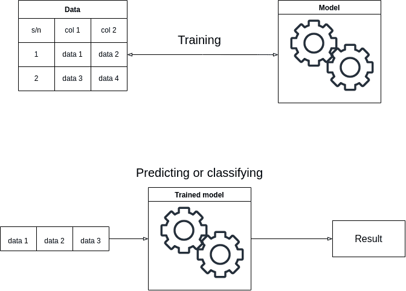
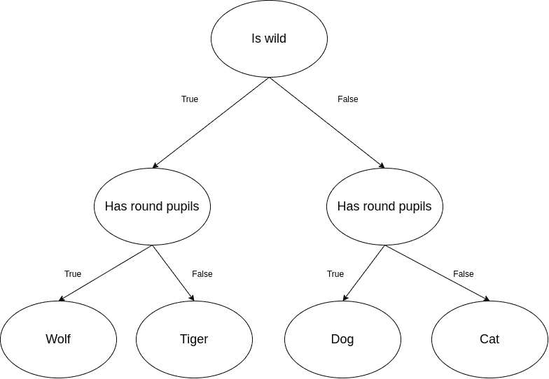
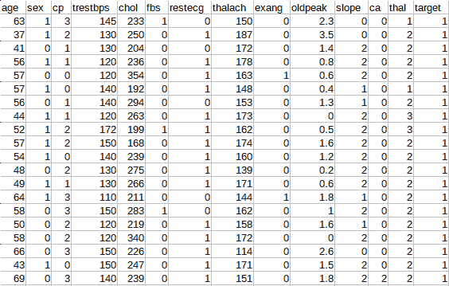

# 如何在 Rust 中建立机器学习模型

> 原文：<https://www.freecodecamp.org/news/how-to-build-a-machine-learning-model-in-rust/>

机器学习是计算机编程中一个非常有趣的概念。它涉及使用数据来训练计算机程序执行任务。

在这个过程中，程序通过发现模式从数据中学习。这减少了程序员在某些应用程序中硬编码规则的需要。

像 Python 和 R 这样的语言非常适合学习和执行机器学习任务。但是这些语言不是绝对的。他们有弱点。一些机器学习应用可能需要以很高的速度和计算机资源效率来执行操作。

Rust 是一种强大而高效的编程语言。虽然 Rust 没有一个成熟的生态系统，但这种编程语言的本质使它非常适合需要速度和效率的应用程序。

Rust 程序员会发现本教程对机器学习入门很有用。而且，机器学习工程师会发现这个教程在 Rust 上开始机器学习很有用。

## 先决条件

要跟随本教程，您需要以下内容:

*   关于铁锈的知识
*   您的系统中安装了 Rust

## 什么是机器学习？

在机器学习中，**模型**是可以从数据中理解模式的软件对象。训练模型是向模型提供数据以绘制模式的过程。机器学习是训练模型执行任务的过程。

一旦你训练了你的模型，你就可以用它从新数据中得出结论。你可以将这些结论建立在分类或预测的基础上。预测模型使用当前数据来预测事件、结果或结局。分类模型使用数据对对象或概念进行分类。

下图是机器学习过程的基本概述:



## 什么是决策树？

决策树算法是最简单的机器学习算法之一。与大多数其他算法不同，该算法给出了机器学习的真实含义。

决策树是一种用于分类和回归任务的机器学习算法。决策树的结构类似于树。它有根节点、内部节点、叶节点和分支。

下表是代表四种动物的分类及其属性的数据示例:

| 序列号 | 是野生的 | 有圆圆的瞳孔 | 动物 |
| one | 真实的 | 真实的 | 沃尔夫 |
| Two | 真实的 | 错误的 | 泰格 |
| three | 错误的 | 真实的 | 狗 |
| four | 错误的 | 错误的 | 猫 |

模型识别表中的模式，然后创建具有以下结构的树:



根节点是决策树中的第一个节点。叶节点位于决策树的最后一行。内部节点位于根节点和叶节点之间。决策树可以有一层以上的内部节点。

我们将在本文中使用这个算法。

## 入门指南

Rust 中有[一堆工具](https://lib.rs/science/ml)可以让你创建机器学习应用。所有的工具都很棒，但是在本教程中，你将使用[临法](https://rust-ml.github.io/linfa/)。Linfa 是一个类似于流行的 Python 机器学习工具包 [scikit-learn](https://scikit-learn.org/) 的工具包。

在本节中，您将学习如何为机器学习建立一个 Rust 项目。建立项目的过程相对简单。你需要做的就是遵循这些步骤:

首先，使用以下命令创建一个名为 *ml-project* 的新项目:

```
cargo new --bin ml-project 
```

接下来，将以下依赖关系粘贴到`ml-project`的 *Cargo.toml* 文件中的`[dependencies]`下:

```
linfa = "0.6.0"
linfa-trees = "0.6.0"
linfa-datasets = { version = "0.6.0", features = ["iris"] } 
```

最后，运行以下命令来构建依赖项:

```
cargo build 
```

下面是对依赖关系的解释:

*   `linfa`是林发机器学习模型的基础包。
*   `linfa-trees`是构建决策树模型的一个子程序包。
*   `linfa-datasets`是一个提供已经准备好的数据集的包。

`linfa-datasets`包是可选的。如果您想准备自己的数据集，请遵循下一节。

## 如何准备数据集

日常项目中使用的大多数机器学习模型都是用外部数据训练的，而不是工具包提供的数据。在本节中，您将学习如何从 csv 文件准备您自己的数据集。

首先，如果你没有可以使用的数据集，你需要得到一个数据集。你可以从 [Kaggle](https://www.kaggle.com/) 得到一个数据集。对于本教程，我将使用[心脏病数据集](https://www.kaggle.com/datasets/yasserh/heart-disease-dataset)。心脏病数据集如下所示:



在这个数据集中，`target`表示一个人有心脏病。1 表示他们有心脏病，0 表示他们没有心脏病。

数据集上的其余字段是每个人的详细信息。模型可以从这个数据集中学习，并能够判断一个人是否患有心脏病。

下载完数据集后，将 csv 文件解压到项目的 *src* 文件夹中。

```
.
├── Cargo.lock
├── Cargo.toml
└── src
    ├── heart.csv
    └── main.rs 
```

为了准备数据集，您需要将`csv`和`ndarray`包添加到您的项目中。打开 *Cargo.toml* ，在`[dependencies]`下面写下:

```
csv = "1.1"
ndarray = "0.15.6" 
```

现在，运行`cargo build`下载包，您就可以开始了。

在接下来的步骤中，我将指导您构建一个`get_dataset`函数。`get_dataset`函数读取 *heart.csv* 文件，解析其内容，用其内容准备数据集，并返回准备好的数据集。我们开始吧！

首先，导入必要的包:

```
use csv::Reader;
use std::fs::File;
use ndarray::{ Array, Array1, Array2 };
use linfa::Dataset; 
```

接下来，将下面的`get_dataset`函数写入 *main.rs* :

```
fn get_dataset() -> Dataset<f32, i32, ndarray::Dim<[usize; 1]>> {
 let mut reader = Reader::from_path("./src/heart.csv").unwrap();

 let headers = get_headers(&mut reader);
 let data = get_data(&mut reader);
 let target_index = headers.len() - 1;

 let features = headers[0..target_index].to_vec();
 let records = get_records(&data, target_index);
 let targets = get_targets(&data, target_index);

 return Dataset::new(records, targets)
   .with_feature_names(features);
} 
```

最后，添加`get_headers`、`get_data`、`get_records`和`get_targets`的定义:

```
fn get_headers(reader: &mut Reader<File>) -> Vec<String> {
 return reader
   .headers().unwrap().iter()
   .map(|r| r.to_owned())
   .collect();
}

fn get_records(data: &Vec<Vec<f32>>, target_index: usize) -> Array2<f32> {
 let mut records: Vec<f32> = vec![];
 for record in data.iter() {
   records.extend_from_slice( &record[0..target_index] );
 }
 return Array::from( records ).into_shape((303, 13)).unwrap();
}

fn get_targets(data: &Vec<Vec<f32>>, target_index: usize) -> Array1<i32> {
 let targets = data
   .iter()
   .map(|record| record[target_index] as i32)
   .collect::<Vec<i32>>();
  return Array::from( targets );
}

fn get_data(reader: &mut Reader<File>) -> Vec<Vec<f32>> {
 return reader
   .records()
   .map(|r|
     r
       .unwrap().iter()
       .map(|field| field.parse::<f32>().unwrap())
       .collect::<Vec<f32>>()
   )
   .collect::<Vec<Vec<f32>>>();
} 
```

以下是对`get_dataset`功能的逐步解释:

首先，初始化一个指向*的阅读器。/src/heart.csv* :

```
let mut reader = Reader::from_path("./src/heart.csv").unwrap(); 
```

接下来，从`reader`中提取标题和数据:

```
let headers = get_headers(&mut reader);
let data = get_data(&mut reader); 
```

然后，计算标题中`target`的索引:

```
let target_index = headers.len() - 1; 
```

之后，从`headers`获取特征:

```
let features = headers[0..target_index].to_vec(); 
```

接下来，从`data`中检索记录和目标:

```
let records = get_records(&data, target_index);
let targets = get_targets(&data, target_index); 
```

最后，用`records`、`targets`和`features`构建数据集，然后返回:

```
return Dataset::new(records, targets)
   .with_feature_names(features); 
```

要完成函数并查看数据集的外观，请使用下面的`main`函数:

```
fn main() {
   let dataset = get_dataset();
   println!("{:?}", dataset);
} 
```

一旦您将它作为您的主函数并使用`cargo run`运行它，您将在输出中看到数据集:

```
DatasetBase { records: [[63.0, 1.0, 3.0, 145.0, 233.0, ..., 0.0, 2.3, 0.0, 0.0, 1.0],
 [37.0, 1.0, 2.0, 130.0, 250.0, ..., 0.0, 3.5, 0.0, 0.0, 2.0],
 [41.0, 0.0, 1.0, 130.0, 204.0, ..., 0.0, 1.4, 2.0, 0.0, 2.0],
 [56.0, 1.0, 1.0, 120.0, 236.0, ..., 0.0, 0.8, 2.0, 0.0, 2.0],
 [57.0, 0.0, 0.0, 120.0, 354.0, ..., 1.0, 0.6, 2.0, 0.0, 2.0],
 ...,
 [57.0, 0.0, 0.0, 140.0, 241.0, ..., 1.0, 0.2, 1.0, 0.0, 3.0],
 [45.0, 1.0, 3.0, 110.0, 264.0, ..., 0.0, 1.2, 1.0, 0.0, 3.0],
 [68.0, 1.0, 0.0, 144.0, 193.0, ..., 0.0, 3.4, 1.0, 2.0, 3.0],
 [57.0, 1.0, 0.0, 130.0, 131.0, ..., 1.0, 1.2, 1.0, 1.0, 3.0],
 [57.0, 0.0, 1.0, 130.0, 236.0, ..., 0.0, 0.0, 1.0, 1.0, 2.0]], shape=[303, 13], strides=[13, 1], layout=Cc (0x5), const ndim=2, targets: [1, 1, 1, 1, 1, 1, 1, 1, 1, 1, 1, 1, 1, 1, 1, 1, 1, 1, 1, 1, 1, 1, 1, 1, 1, 1, 1, 1, 1, 1, 1, 1, 1, 1, 1, 1, 1, 1, 1, 1, 1, 1, 1, 1, 1, 1, 1, 1, 1, 1, 1, 1, 1, 1, 1, 1, 1, 1, 1, 1, 1, 1, 1, 1, 1, 1, 1, 1, 1, 1, 1, 1, 1, 1, 1, 1, 1, 1, 1, 1, 1, 1, 1, 1, 1, 1, 1, 1, 1, 1, 1, 1, 1, 1, 1, 1, 1, 1, 1, 1, 1, 1, 1, 1, 1, 1, 1, 1, 1, 1, 1, 1, 1, 1, 1, 1, 1, 1, 1, 1, 1, 1, 1, 1, 1, 1, 1, 1, 1, 1, 1, 1, 1, 1, 1, 1, 1, 1, 1, 1, 1, 1, 1, 1, 1, 1, 1, 1, 1, 1, 1, 1, 1, 1, 1, 1, 1, 1, 1, 1, 1, 1, 1, 1, 1, 0, 0, 0, 0, 0, 0, 0, 0, 0, 0, 0, 0, 0, 0, 0, 0, 0, 0, 0, 0, 0, 0, 0, 0, 0, 0, 0, 0, 0, 0, 0, 0, 0, 0, 0, 0, 0, 0, 0, 0, 0, 0, 0, 0, 0, 0, 0, 0, 0, 0, 0, 0, 0, 0, 0, 0, 0, 0, 0, 0, 0, 0, 0, 0, 0, 0, 0, 0, 0, 0, 0, 0, 0, 0, 0, 0, 0, 0, 0, 0, 0, 0, 0, 0, 0, 0, 0, 0, 0, 0, 0, 0, 0, 0, 0, 0, 0, 0, 0, 0, 0, 0, 0, 0, 0, 0, 0, 0, 0, 0, 0, 0, 0, 0, 0, 0, 0, 0, 0, 0, 0, 0, 0, 0, 0, 0, 0, 0, 0, 0, 0, 0, 0, 0, 0, 0, 0, 0], shape=[303], strides=[1], layout=CFcf (0xf), const ndim=1, weights: [], shape=[0], strides=[0], layout=CFcf (0xf), const ndim=1, feature_names: ["age", "sex", "cp", "trestbps", "chol", "fbs", "restecg", "thalach", "exang", "oldpeak", "slope", "ca", "thal"] } 
```

## 如何创建决策树模型

在这一节中，我将向您展示如何创建决策树模型并训练它。我将使用的数据集是由`linfa-datasets`提供的虹膜数据集。

鸢尾数据集包含几种鸢尾的萼片宽度、萼片高度、花瓣宽度和花瓣高度的记录，并根据数字标记的物种对每个记录进行分类。

该模型的代码很简单。打开 *main.rs* 文件，将以下内容粘贴到其中:

```
use linfa_trees::DecisionTree;
use linfa::prelude::*;

fn main() {
    let (train, test) = linfa_datasets::iris()
        .split_with_ratio(0.9);

    let model = DecisionTree::params()
        .fit(&train).unwrap();

    let predictions = model.predict(&test);

    println!("{:?}", predictions);
    println!("{:?}", test.targets);
} 
```

这里有一个解释:

首先，导入必要的包:

```
use linfa_trees::DecisionTree;
use linfa::prelude::*; 
```

接下来，获取数据集，并分成测试和训练数据:

```
let (train, test) = linfa_datasets::iris()
    .split_with_ratio(0.9); 
```

之后，初始化模型并用训练数据对其进行训练:

```
let model = DecisionTree::params()
    .fit(&train).unwrap(); 
```

然后，使用测试数据进行一些预测:

```
let predictions = model.predict(&test); 
```

最后，将预测值与实际值进行比较:

```
println!("{:?}", predictions);
println!("{:?}", test.targets); 
```

如果您用`cargo run`运行程序，您将得到终端中的预测类别和实际类别作为输出:

```
$ cargo run
[2, 2, 2, 2, 2, 2, 2, 2, 2, 2, 2, 2, 2, 2, 2], shape=[15], strides=[1], layout=CFcf (0xf), const ndim=1
[2, 2, 2, 2, 2, 2, 2, 2, 2, 2, 2, 2, 2, 2, 2], shape=[15], strides=[1], layout=CFcf (0xf), const ndim=1 
```

从上面可以看出这个模型是 100%准确的。并非所有的机器学习模型都是如此。如果在上述中训练模型之前混洗数据集，模型可能不再准确。

机器学习的目标是尽可能准确。大多数时候，100%的准确性是不可能的。

## 结论

在本教程中，您学习了一些关于机器学习的知识，也看到了如何使用 Rust 创建决策树模型。

Linfa 中的机器学习模型遵循类似的构建和训练过程，因此使用其他类型的模型所需要做的就是了解每一种模型，这样就万事大吉了。

您可以使用[它的文档](https://docs.rs/linfa/latest/linfa/)来了解关于 Linfa 及其支持的模型的更多信息。

感谢您的阅读，祝您编码愉快！