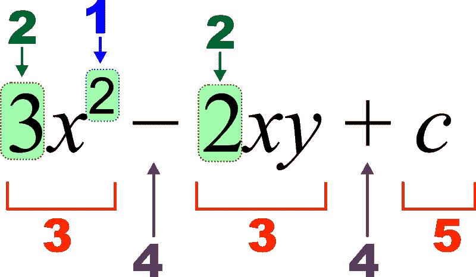
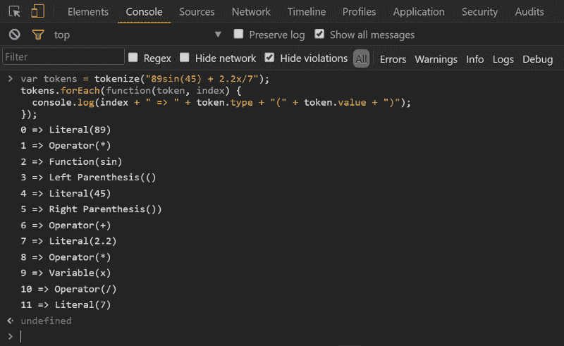

# 如何使用 JavaScript(或任何其他语言)构建数学表达式标记器

> 原文：<https://www.freecodecamp.org/news/how-to-build-a-math-expression-tokenizer-using-javascript-3638d4e5fbe9/>

作者:Shalvah

# 如何使用 JavaScript(或任何其他语言)构建数学表达式标记器



Source: Wikimedia Commons

不久前，我受到启发，想开发一个应用程序来解决特定种类的数学问题。我发现我必须将表达式解析成抽象语法树，所以我决定用 Javascript 构建一个原型。在处理解析器时，我意识到必须首先构建标记化器。我会教你如何自己做一个。(警告:这比乍看起来容易。)

### 什么是记号赋予器？

一个[记号赋予器](https://en.wikipedia.org/wiki/Lexical_analysis#Tokenization)是一个程序，它把一个表达式分解成叫做**记号**的单元。例如，如果我们有一个类似“我是一个大胖开发人员”的表达，我们可以用不同的方式来标记它，例如:

使用单词作为标记，

```
0 => I’m1 => a2 => big3 => fat4 => developer
```

使用非空白字符作为标记，

```
0 => I1 => ‘2 => m3 => a4 => b…16 => p17 => e18 => r
```

我们也可以把所有的字符都看作记号

```
0 => I1 => ‘2 => m3 => (space)4 => a5 => (space)6 => b…20 => p21 => e22 => r
```

你明白了，对吧？

记号化器(也称为词法分析器)用于开发编程语言的编译器。它们帮助编译器从你想说的话中获得结构上的意义。不过，在这种情况下，我们为数学表达式构建一个。

### 代币

一个有效的数学表达式由数学上有效的记号组成，对于这个项目来说，这些记号可以是**文字**、**变量**、**运算符、函数*或*函数参数分隔符**。
以上几点说明:

*   文字是数字的别称(在这种情况下)。我们只允许整数或小数形式的数字。
*   变量是你在数学中熟悉的那种:a，b，c，x，y，z。对于这个项目，所有变量都被限制为一个字母的名称(所以不像 *var1* 或 *price* )。这就是为什么我们可以将像 *ma* 这样的表达式标记为变量 *m* 和 *a* 的乘积，而不是单个变量 *ma* 。
*   运算符作用于文字、变量和函数的结果。我们将允许运算符+、-、*、/和^.
*   函数是“更高级”的操作。它们包括 sin()、cos()、tan()、min()、max()等
*   函数参数分隔符只是逗号的一个别出心裁的名字，用在这样的上下文中: *max(4，5)* (两个值中最大的一个)。我们称之为函数参数分隔符，因为它可以分隔函数参数(对于接受两个或更多参数的函数，如 *max* 和 *min* )。

我们还将添加两个通常不被认为是记号的记号，但是将帮助我们更清楚:**左**和**右括号**。你知道那些是什么。

### 一些注意事项

#### 隐式乘法

隐式乘法简单地说就是允许用户编写“速记”乘法，例如 *5x* ，而不是 *5*x* 。更进一步，它还允许用函数( *5sin(x)* = *5*sin(x)* )来做这件事。

更进一步，它允许 5(x)和 5(sin(x))。我们可以选择允许或不允许。权衡？不允许它实际上会使标记化更容易，并允许多字母变量名(如`price`)。允许它使平台对用户来说更直观，并且，提供了一个额外的挑战去克服。我选择了允许。

#### 句法

虽然我们不是在创造一种编程语言，但是我们需要有一些关于什么构成一个有效表达式的规则，这样用户就知道该输入什么，我们也知道该计划什么。确切地说，*数学符号必须根据这些语法规则组合起来，表达式才有效。以下是我的规则:*

1.  令牌可以由 0 个或多个空白字符分隔

```
2+3, 2 +3, 2 + 3, 2 + 3 are all OK 5 x - 22, 5x-22, 5x- 22 are all OK
```

换句话说，**空格与**无关(除了在像文字 22 这样的多字符标记中)。

2.**函数参数得在括号里** ( *sin(y)* ， *cos(45)* ，而不是 *sin y* ， *cos 45* )。(为什么？我们将删除字符串中的所有空格，所以我们想知道一个函数在哪里开始和结束，而不必做一些“体操”。)

3.隐式乘法只允许在**文字量和变量**之间，或者**文字量和函数**之间进行，按照这个顺序(也就是说，文字量总是排在前面)，可以有括号，也可以没有括号。这意味着:

*   *a(4)* 将被视为函数调用而不是 *a*4*
*   不允许使用 *a4*
*   *4a* 和 *4(a)* 正常

现在，让我们开始工作。

### 数据建模

在头脑中有一个样本表达式来测试这一点是有帮助的。我们将从一些基本的东西开始: *2y + 1*

我们所期望的是一个数组，它列出了表达式中不同的标记，以及它们的类型和值。因此，对于这种情况，我们预计:

```
0 => Literal (2)1 => Variable (y)2 => Operator (+)3 => Literal (1)
```

首先，我们将定义一个令牌类来简化事情:

```
function Token(type, value) {   this.type = type;   this.value = value}
```

### 算法

接下来，让我们构建记号赋予器函数的框架。

我们的记号赋予器将遍历`str`数组的每个字符，并基于它找到的值构建记号。

请注意，我们假设用户给了我们一个有效的表达式，所以我们将在整个项目中跳过任何形式的验证。]

```
function tokenize(str) {  var result=[]; //array of tokens    // remove spaces; remember they don't matter?  str.replace(/\s+/g, "");
```

```
 // convert to array of characters  str=str.split("");
```

```
str.forEach(function (char, idx) {    if(isDigit(char)) {      result.push(new Token("Literal", char));    } else if (isLetter(char)) {      result.push(new Token("Variable", char));    } else if (isOperator(char)) {      result.push(new Token("Operator", char));    } else if (isLeftParenthesis(char)) {      result.push(new Token("Left Parenthesis", char));    } else if (isRightParenthesis(char)) {      result.push(new Token("Right Parenthesis", char));    } else if (isComma(char)) {      result.push(new Token("Function Argument Separator", char));    }  });
```

```
 return result;}
```

上面的代码相当简单。作为参考，帮手`isDigit()`、`isLetter()`、`isOperator()`、`isLeftParenthesis()`、`isRightParenthesis()`定义如下(不要被符号吓到——那叫 [regex](http://www.regular-expressions.info/) ，真的很牛逼):

```
function isComma(ch) { return (ch === ",");}
```

```
function isDigit(ch) { return /\d/.test(ch);}
```

```
function isLetter(ch) { return /[a-z]/i.test(ch);}
```

```
function isOperator(ch) { return /\+|-|\*|\/|\^/.test(ch);}
```

```
function isLeftParenthesis(ch) { return (ch === "(");}
```

```
function isRightParenthesis(ch) { return (ch == ")");}
```

*【注意，这里没有* isFunction() *，* isLiteral() *或者* isVariable() *函数，因为我们单独测试字符。]*

所以现在我们的解析器实际上工作了。试试这些表达式:2 + 3，4a + 1，5x+ (2y)，11 + sin(20.4)。

一切都好吗？

不完全是。

您会发现，对于最后一个表达式，11 被报告为两个文字标记，而不是一个。另外`sin`被报告为*三个*令牌而不是一个。这是为什么呢？

让我们停下来想一想这个问题。我们逐个字符地对数组进行了标记，但实际上，我们的一些标记可以包含多个字符。例如，文字可以是 5，7.9，.函数可以是 sin、cos 等。变量只有单个字符，但在隐式乘法中可以一起出现。我们如何解决这个问题？

#### 缓冲

我们可以通过实现一个缓冲区来解决这个问题。实际上是两个。我们将使用一个缓冲区保存文字字符(数字和小数点)，一个缓冲区保存字母(包括变量和函数)。

缓冲器是如何工作的？当 tokenizer 遇到一个数字/小数点或字母时，它会将它推入适当的缓冲区，并一直这样做，直到它输入不同种类的运算符。其操作将因操作者而异。

例如，在表达式*456.7 xy+6sin(7.04 x)-min(a，7)* 中，它应该是这样的:

```
read 4 => numberBuffer read 5 => numberBuffer read 6 => numberBuffer read . => numberBuffer read 7 => numberBuffer x is a letter, so put all the contents of numberbuffer together as a Literal 456.7 => result read x => letterBuffer read y => letterBuffer + is an Operator, so remove all the contents of letterbuffer separately as Variables x => result, y => result + => result read 6 => numberBuffer s is a letter, so put all the contents of numberbuffer together as a Literal 6 => result read s => letterBuffer read i => letterBuffer read n => letterBuffer ( is a Left Parenthesis, so put all the contents of letterbuffer together as a function sin => result read 7 => numberBuffer read . => numberBuffer read 0 => numberBuffer read 4 => numberBuffer x is a letter, so put all the contents of numberbuffer together as a Literal 7.04 => result read x => letterBuffer ) is a Right Parenthesis, so remove all the contents of letterbuffer separately as Variables x => result - is an Operator, but both buffers are empty, so there's nothing to remove read m => letterBuffer read i => letterBuffer read n => letterBuffer ( is a Left Parenthesis, so put all the contents of letterbuffer together as a function min => result read a=> letterBuffer , is a comma, so put all the contents of letterbuffer together as a Variable a => result, then push , as a Function Arg Separator => result read 7=> numberBuffer ) is a Right Parenthesis, so put all the contents of numberbuffer together as a Literal 7 => result
```

完成。你现在找到窍门了，对吧？

我们快到了，只是还有几个案子要处理。

这是你坐下来深入思考你的算法和数据建模的时候。如果我的当前字符是一个操作符，并且 numberBuffer 非空，会发生什么？两个缓冲区可以同时为非空吗？

将所有这些放在一起，我们得出了以下结果(箭头左侧的值描述了我们当前的字符(ch)类型，NB =数字缓冲区，LB =字母缓冲区，LP =左括号，RP =右括号

```
loop through the array:  what type is ch?
```

```
digit => push ch to NB  decimal point => push ch to NB  letter => join NB contents as one Literal and push to result, then push ch to LB  operator => join NB contents as one Literal and push to result OR push LB contents separately as Variables, then push ch to result  LP => join LB contents as one Function and push to result OR (join NB contents as one Literal and push to result, push Operator * to result), then push ch to result  RP => join NB contents as one Literal and push to result, push LB contents separately as Variables, then push ch to result  comma => join NB contents as one Literal and push to result, push LB contents separately as Variables, then push ch to result
```

```
end loop
```

```
join NB contents as one Literal and push to result, push LB contents separately as Variables,
```

有两点需要注意。

1.  注意我在哪里添加了“将操作符*推送到结果”？这就是我们将隐式乘法转换为显式乘法。同样，当把 LB 的内容作为变量分别清空时，我们需要记住在它们之间插入乘法运算符。
2.  在函数循环结束时，我们需要记住清空缓冲区中的所有内容。

### 翻译成代码

综上所述，您的 tokenize 函数现在应该如下所示:

我们可以运行一个小演示:

```
var tokens = tokenize("89sin(45) + 2.2x/7");tokens.forEach(function(token, index) {  console.log(index + "=> " + token.type + "(" + token.value + ")":});
```



Yeah! Note the added *s for the implicit multiplications

### 包装它

这是您分析您的功能并衡量它做什么与您希望它做什么的点。问自己这样的问题:“功能是否如预期的那样工作？”以及“我是否涵盖了所有的边缘案例？”

这种情况的边缘情况可以包括负数等。您还可以对函数进行测试。如果最后你感到满意，你可以开始寻找如何改进它。

感谢阅读。请点击小心脏推荐这篇文章，如果你喜欢它，请分享！如果你尝试了另一种方法来构建数学符号化器，请在评论中告诉我。