# 如何用标准库和 Node.js 构建 Meetup Slack bot

> 原文：<https://www.freecodecamp.org/news/how-to-build-a-meetup-slack-app-with-standard-library-52f96b27d95a/>

作者 Janeth Ledezma

# 如何用标准库和 Node.js 构建 Meetup Slack bot

在本指南中，您将学习如何设置一个 [Slack](https://slack.com) 应用程序来显示来自 [Meetup 的 API](https://www.meetup.com/meetup_api/) 的信息，该 API 将来自 Meetup 的存储数据提供给其他应用软件。

Meetup 是一个受欢迎的网站，有相似兴趣的人可以在这里组成团体，在他们所在的城市组织活动。

一旦我们成功地向 Meetup 的 API 发出请求，我们将收到来自 Meetup 的响应，我们将从 JSON 有效负载中提取特定的数据，并在 Slack 中显示这些数据。我们将设计 Slack 应用程序的附件，以便它显示事件的名称、描述、日期和时间、位置等等！

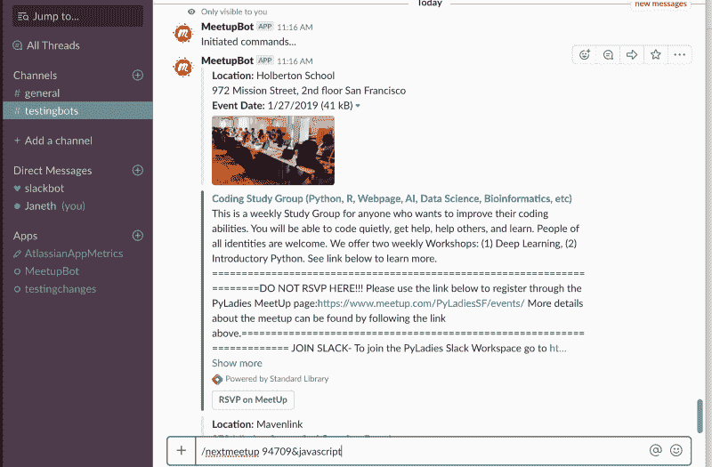

### 工作原理:

当你在 Slack 的 message box 中提交`/nextmeetup 94709&javascript`(或者任何邮政编码和感兴趣的话题)时，就会触发一个 webhook。在标准库上构建和托管的 webhook 将首先向 Meetup 的 API 发出一个请求，该 API 将返回一个 JSON 有效负载和查询结果。

然后，webhook 将为每个事件创建 Slack 消息，并将这些消息发布到指定的通道。

没必要不知所措！让我们一步一步来。

### 你需要什么:

[1x 备用账户](https://medium.com/p/52f96b27d95a/edit)

[1x Meetup 帐户](https://www.meetup.com/)

[1x 标准库账户](https://stdlib.com/)

### 步骤 1:设置您的 Slack 应用程序

确保你已经[登录 Slack](https://slack.com/signin) ，并访问你在 https://api.slack.com/apps[的 Slack 应用仪表板](https://api.slack.com/apps)。您将看到如下所示的屏幕。

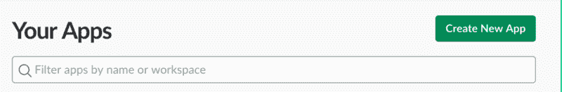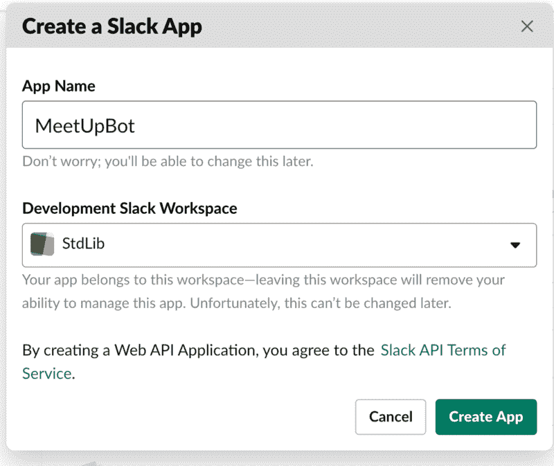

点击**创建新应用。**您将看到一个模式，输入您的应用程序名称和您想要添加的开发 Slack 工作区。

从这里，点击**创建应用，**你会发现自己在一个**基本信息**页面。

向下滚动到**显示信息。**你可以在这里为你的 Slack 应用程序命名、描述和图片。

在浏览器中保持**基本信息**页面打开。我们将马上使用它来检索您的 Slack 应用程序的凭证，以将该应用程序连接到托管在标准库上的后端逻辑——运行您的应用程序的代码。

### 步骤 2:创建一个免费的标准图书馆帐户

我们将在[标准库](https://stdlib.com)上托管我们的 Slack 应用程序代码——该代码将从 Meetups API 请求和接收特定信息。因此，前往标准库上的[代码，申请你的免费账户。](https://code.stdlib.com)

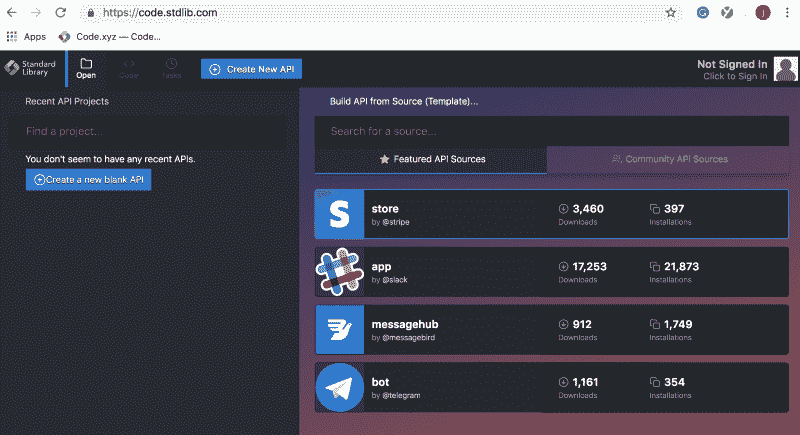

### 步骤 3:在标准库上复制并修改 Slack 应用程序代码模板

登录或注册后，您将登陆“**特色 API 源”**这些是[标准库](https://www.freecodecamp.org/news/how-to-build-a-meetup-slack-app-with-standard-library-52f96b27d95a/undefined)上提供的应用代码模板，任何人都可以轻松复制和修改应用。您将选择 Slack 应用程序代码模板，并对其进行修改，以创建支持您的 Slack 应用程序的 API。

为您的 API 项目输入一个唯一的名称，然后点击**ok。**

#### Slack 应用源代码模板的简要说明:

让我们暂停一会儿来理解我们正在看的东西。左侧栏是标准库为您构建 Slack 应用程序而设置的 API 项目支架。

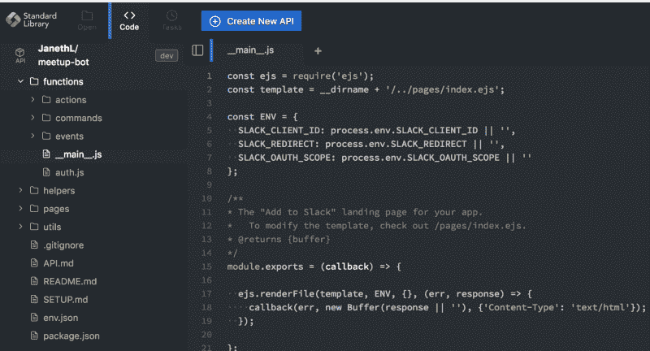

Slack 应用程序的代码模板有四个目录。我们将只在`functions`目录中工作，该目录配备了另外三个文件夹

除了一个单独的文件`__main__.js.`之外，你的应用程序的 Slack 动作、slash 命令和事件的指令也存在于这些文件夹中。

当您部署 API 时，标准库将自动为每个目录生成 HTTPS 端点(URL)。由此产生的 URL 将允许我们配置 webhooks 来监听和响应 [Slack 的动作](https://api.slack.com/actions)、[斜线命令](https://api.slack.com/slash-commands)和[事件](https://api.slack.com/events-api)。

所有五个文件夹(包括`functions`文件夹)都设置了一个`__main__.js` 文件(目录的主端点)。当这些端点`__main__.js`从 Slack 收到消息时，它们会分派适当的功能。对于本教程，当我们通过 Slack Bot 调用 API 时，文件`__main__.js`将调度`commands`端点。现在，让我们回到我们的机器人设置！

### 步骤 4:向标准库 API 添加一个命令

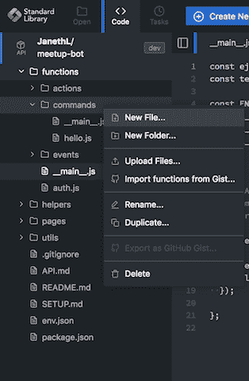

Create an additional command

`commands:``commands`目录是所有松弛斜线命令的端点。将光标放在`commands`目录上并单击鼠标右键，创建一个附加命令。选择**新建文件**并将你的斜杠命令文件命名为 **nextmeetup.js** 点击**ok**。

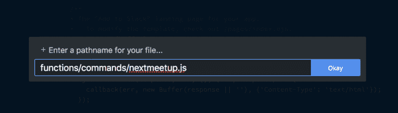

Name your command

此时，你会注意到里面有一个“hello world”JavaScript 函数(`__main__.js`)，是自动生成的。

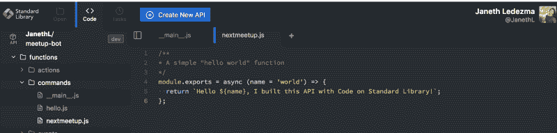

用以下内容替换`nextmeetup.js`的内容:

### 代码的简要说明:

当你通过 Slack 应用提交`/nextmeetup`时，你是在向 Meetup 的 API 发出 GET 请求。

每个对 Meetups API 的请求都必须使用 API 密钥进行认证，因此我们将 Meetup 密钥从我们的`env.json`文件传递到我们的请求中。我们还发送带有两个参数 zip 和 topic 的 GET 请求。

Meetup API 返回一组 Meetup 事件对象，我们可以通过记录我们的响应:`console.log(response.data)`从标准库日志的代码中查看这些对象。您的日志选项卡位于调试部分的下面。

`response.data`是一个匹配您的查询的事件数组，我们希望为每个事件创建两个附件(一个用于位置，一个用于细节)。我们有一个名为`formatAttachement`的函数，我们可以在每个事件上调用它。结果被放入一个名为`attachments`的数组中，该数组被发送给 Slack。

一旦将代码复制并粘贴到文件`nextmeetup.js`中，保存更改并导航到左侧栏菜单上的`env.json`文件。

### **步骤 5:用应用凭证和密钥填充 env.json 文件**

在`env.json`中，您会注意到 API 的环境变量。您可以为本地、开发和发布(生产)环境设置不同的值。此文件将保存您的标准图书馆帐户、Meetup 帐户和 Slack 应用程序凭据的所有唯一访问密钥。

我们将只修改`"dev"`环境变量— **确保你修改的是正确的设置**！请注意，`"dev”`值是针对您的开发环境的，`"release"`值应该只在您准备好发布应用程序时填充。`“local”` 从标准库的代码中部署时，变量可以留空，但在使用[命令行工具](https://github.com/stdlib/lib)时，应该填写变量。

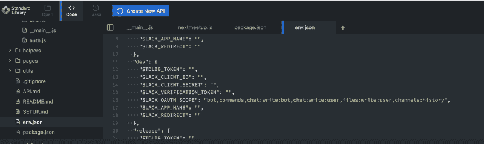

让我们从填充`“STDLIB_TOKEN”`变量开始。将光标放在引号之间(见屏幕)，右击并选择**插入库令牌…** 或使用快捷键⌘ + K

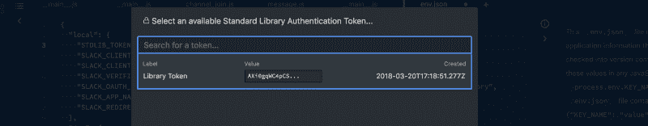

Select your library token

选择**库令牌**填写`"dev"`环境。

现在回到你的 Slack 应用的**基本信息**页面，向下滚动到**应用证书**:

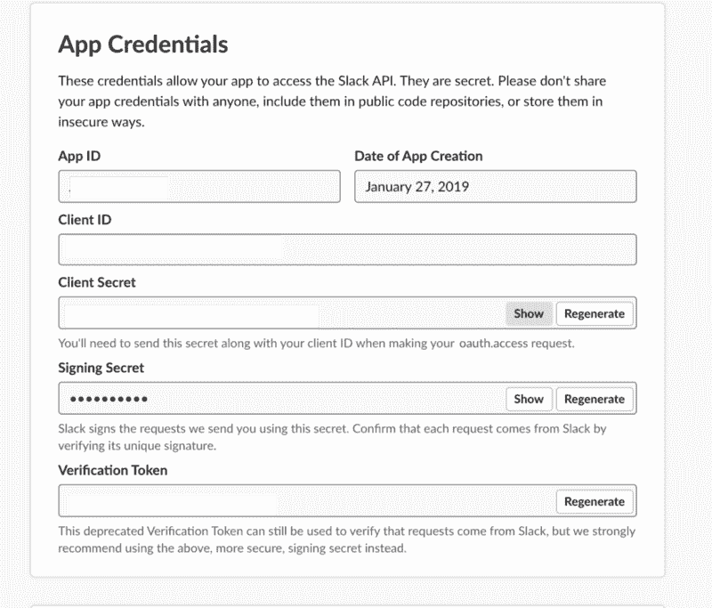

复制您的**客户端 ID、客户端密码**和**验证令牌**。将它们粘贴到`env.json`文件的`“dev”`部分各自的字段中。

为您的 Slack 应用程序添加名称`SLACK_APP_NAME`。

例: `SLACK_APP_NAME:Meetup-bot`

一旦您部署了您的 API，`“SLACK_REDIRECT”`值将是由标准库生成的 https 端点。即使我们还没有部署，现在也可以使用这个结构填充它。`https://<username>.api.stdlib.com/<apiname&g`t；@dev/auth/ —使用您的标准库用户名和 API 名称。一旦我们部署了代码，您可以返回来确认您是否正确填写了该值。

我的`SLACK_REDIRECT`看起来是这样的:`[https://Janethl.api.stdlib.com/slack-meetup-bot@dev/auth/](https://Janethl.lib.id/slack-meetup-bot@dev/auth/)` —确保你添加的认证路径末尾有一个斜杠。

您的 Slack 应用的功能和权限已经设置为以下 [*范围*](https://api.slack.com/docs/oauth-scopes) *:*

" SLACK_OAUTH_SCOPE": `bot,commands,chat:write:bot,chat:write:user,files:write:user,channels:history`

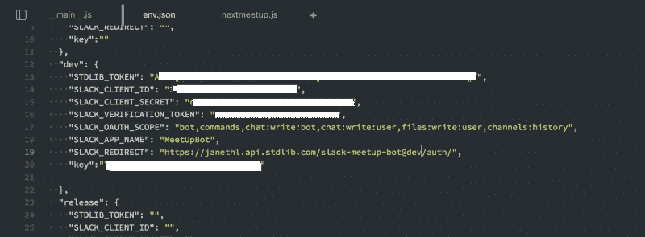

您需要添加的最后一个变量是您的 Meetup API 密钥。Meetup 要求每个请求都使用 API 密钥进行认证。

### 步骤 6:检索您的 Meetup API 密钥

在 Meetup.com 登录或创建一个帐户。前往[https://secure.meetup.com/meetup_api/key/](https://secure.meetup.com/meetup_api/key/)取回你唯一的 API 密匙。点按锁以显示您的 API 密钥并拷贝它。

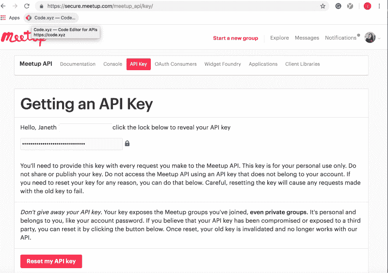

返回到标准库上[代码的`env.json`文件。添加您的 Meetup 密钥作为一个`"key"`值，正如我在图中所做的:](https://code.stdlib.com)

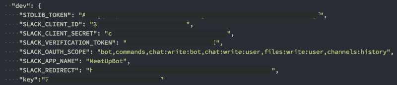

确保使用**'⌘+s’**保存更改(或点击右下角的**保存**)。

在侧边栏菜单上，打开位于事件目录下的`__main__.js`文件。通过点击“**运行**，将你的 Slack 应用的代码部署到标准库。

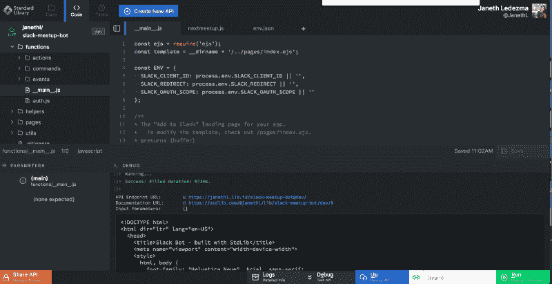

*   在部署您的代码后不久，标准库会生成一个 HTTPS API 端点 URL，您的代码就位于其中。这个地址由您的<用户名> .api.stdlib.com 和您给 API @ the environment[的名称组成:https://janethl.api.stdlib.com/slack-meetup-bo](https://janethl.lib.id/slack-meetup-bot@dev/commands/nextmeetup/)t @ dev/

我们现在有了一个 URL，允许我们从 Slack 应用程序向 Meetup 的 API 发送和接收消息。现在我们需要在 Slack 中将我们的 URL 设置为 webhook，所以让我们回到 Slack 应用仪表板

### 步骤 7:创建一个新的斜杠命令并设置一个 Webhook

我们现在需要设置我们的 Slack 应用程序来响应斜杠命令(`/`)。为此，我们需要在 Slacks API 页面上设置一个 webhook。

#### 什么是 Webhook？

也许我们可以通过将 webhook 与 API 进行比较来理解它是什么。API 是基于请求的，这意味着当第三方应用程序发出请求时，它们就会运行。webhook 是基于事件的——代码将在特定事件触发它时运行。

要设置 webhook，服务提供者必须允许其消费者注册一个 URL，当事件发生时，提供者可以将信息发送到该 URL。在这个例子中，Slack 使我们能够注册我们的 URL 地址，一旦注册，一个斜杠命令可以触发我们的 webhook，它将执行我们的 URL 中的代码。

既然我们理解了这一点，让我们前往 Slack 的 API 页面来设置我们的 webhook。找到，在侧边栏菜单上选择**斜线命令**。

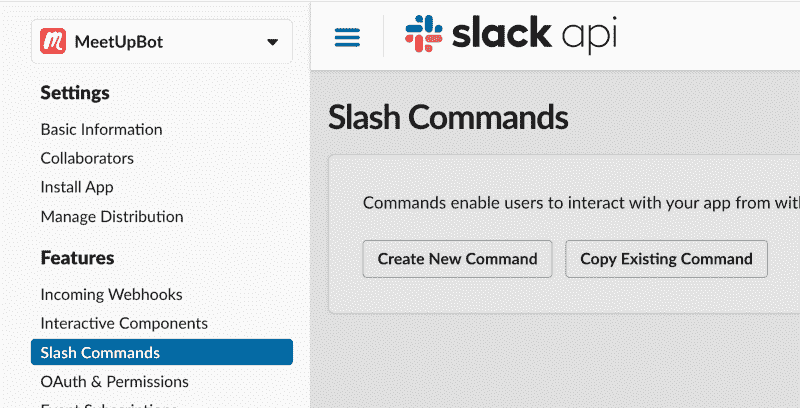

点击**创建新命令**后，您将被要求输入您的命令细节，在本例中使用:

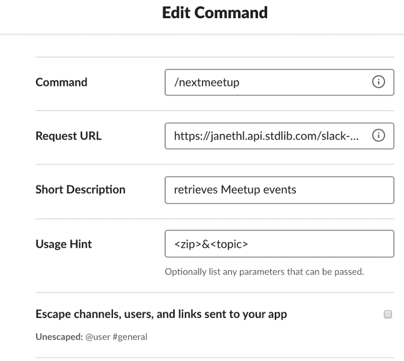

命令:`/nextmeetup`

请求 URL: `https://<username>.api.stdlib.com/<apiname>@dev/`命令/:bg

简短描述:`retrieves Meetup events`

用法提示:`[<zip>&&l`t；主题>

完成后点击**保存**。

### 步骤 8:启用 OAuth 和权限

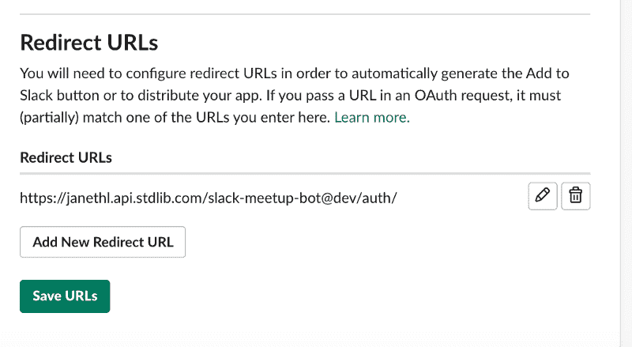

回到你的 [Slack App](https://api.slack.com/apps) ，在侧边栏菜单上，点击 **OAuth &权限**。

一旦到了那里，你就需要输入一个**重定向 URL** ，如下所示:`https://<username>.api.stdlib.com/ <apiname&g`t；@dev/auth/

点击“添加”和“保存网址”

*这个重定向 URL 应该与我们在标准库的代码上的`env.json`文件中设置的 URL 相匹配。*

### 第九步:给你的 Slack 应用添加一个机器人

回到你的 Slack 应用页面，点击左边栏**的**机器人用户**。**点击**添加 Bot 用户**。保留默认设置。

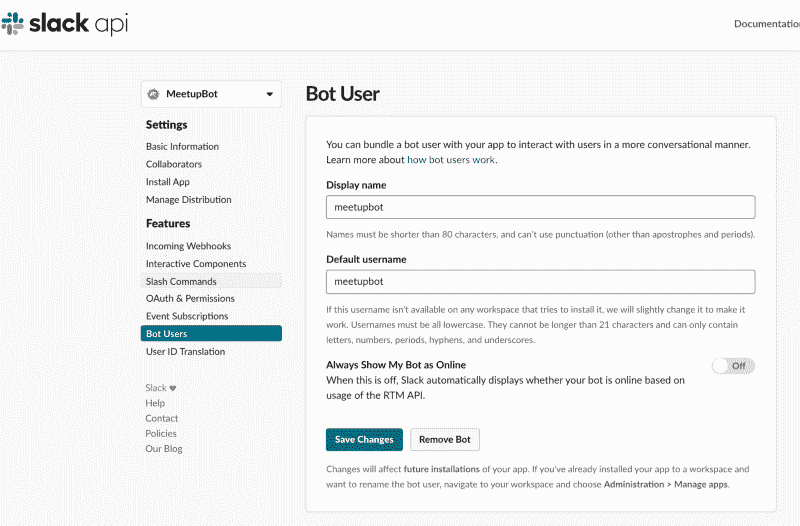

Add a Bot User

**最后一步**是授权应用。在浏览器中，键入:`https://<username>.api.stdlib.com/<apin` ame > @dev/

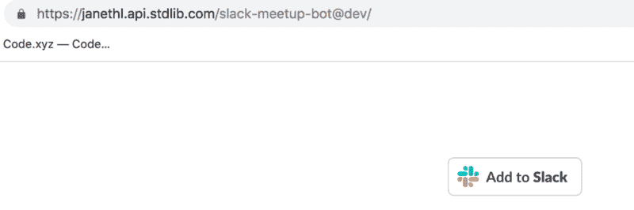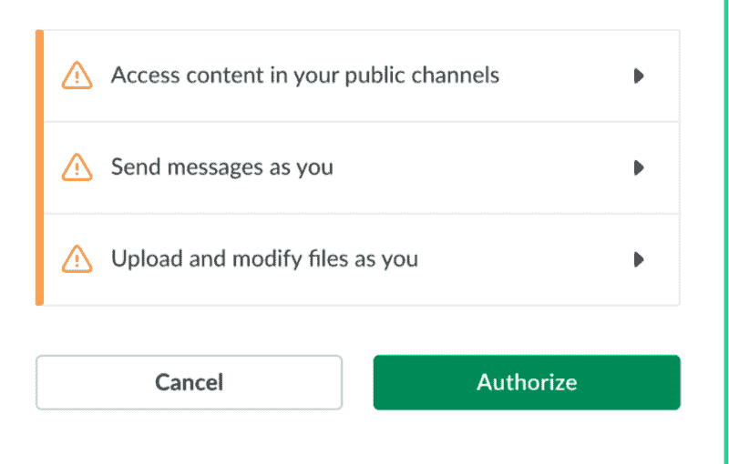

点击**添加到松弛时间**按钮。您将被带到另一个授权屏幕。

点击**授权**。您应该会看到一条成功消息！

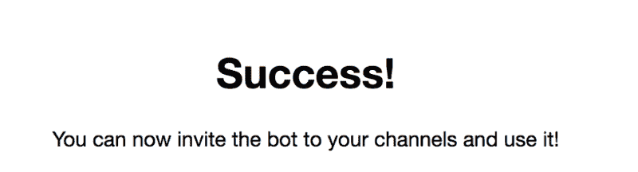

### 步骤 10:测试您的 Slack Meetup 应用程序

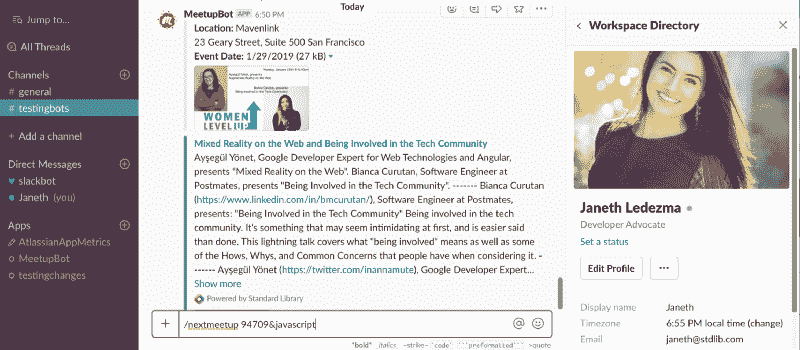

你们都完了。试试吧！您的 Slack 应用程序现在可以在您授权的 Slack 工作区中使用。你的 Slack 应用应该响应一个`/nextmeetup<94709>&<ja` vascript >，正如我在上面的截图中显示的。

### 就这样&谢谢你！

我希望这篇教程对你有所帮助。我希望您能在这里、**给我发电子邮件**，或者在 Twitter 上关注[标准库](http://www.stdlib.com?utm_source=content&utm_medium=blog&utm_campaign=scrape_service)、 [@StdLibHQ](https://twitter.com/StdLibHQ) 。

Janeth Ledezma 是标准库和 Cal grad-go bears 的开发者倡导者！当她不学习阿拉伯语或健身时，你会发现她在她的 CBR500R 上探索 NorCal。？？？通过 Twitter @ms [s_ledezma 关注她与标准图书馆的旅程。](https://twitter.com/mss_ledezma)