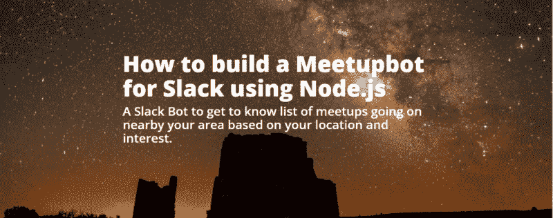
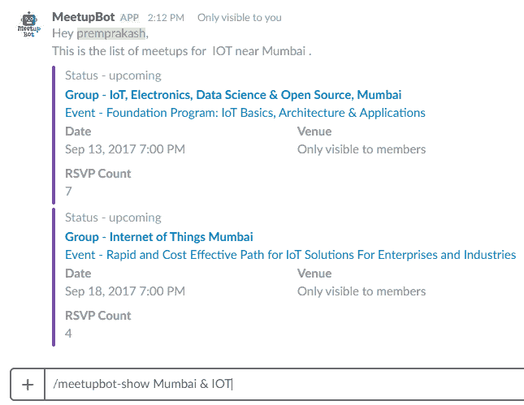
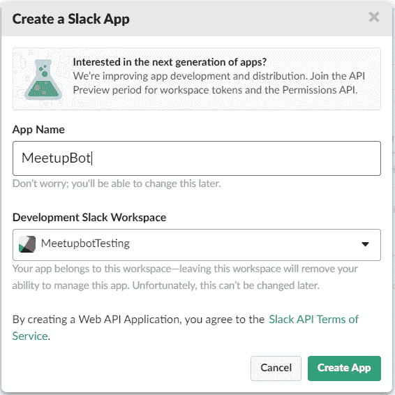
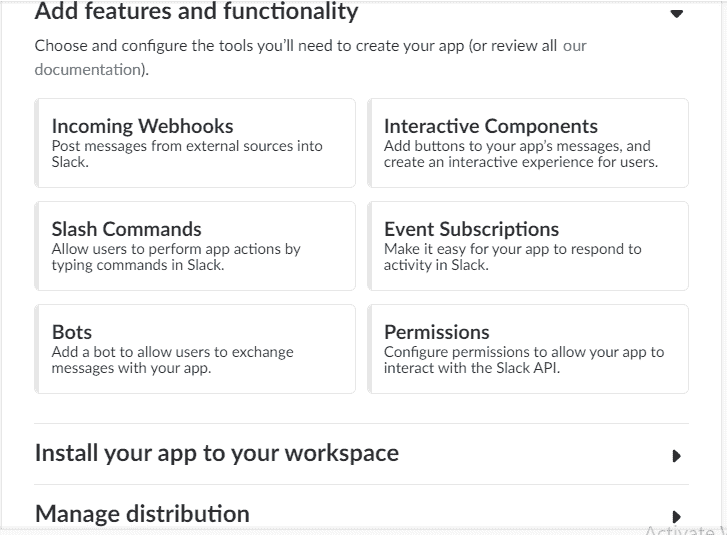
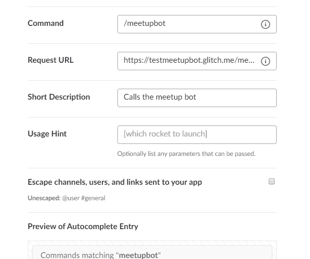

# 如何使用 Node.js 为 Slack 构建 Meetupbot

> 原文：<https://www.freecodecamp.org/news/how-to-build-a-meetupbot-for-slack-using-node-js-618725aa4c6e/>

作者:premprakashsingh

# 如何使用 Node.js 为 Slack 构建 Meetupbot

M[eetupbot for Slack](http://premsingh.me/blog/2017/10/01/meetupbot-for-slack/)

### 什么是懈怠？

如果你是第一次接触 Slack，这是一个很好的团队协作和即时通讯平台，可以在组织内外使用，帮助团队沟通和协作。

我第一次使用 Slack 是在一个学习小组。您可以创建不同的渠道来分隔消息和讨论。您也可以创建私有通道来保持团队中消息的私密性。

最好的功能是它还允许在其平台上集成。这也是它不同于其他消息传递和协作平台的地方。

你可以整合谷歌日历、Twitter、Trello 等等。它还可以让你创建自定义应用程序，如机器人。

### 项目

在这篇文章中，我将带你使用 Node.js 为 Slack 构建一个 [MeetupBot](https://meetupbotteam.github.io/meetupbot-landing-page/) ,它会根据你的兴趣给出你所在地附近正在进行的会议列表。

感到兴奋吗？

它将使用 Slack 的斜杠命令。你可以在 Slack 中输入 **/meetupbot** 来调用 [MeetupBot](https://meetupbotteam.github.io/meetupbot-landing-page/) ，它会和命令列表一起欢迎你。

我和我的两个团队成员[扎梅尔](https://github.com/zamhaq)和[莱纳斯](https://github.com/nusli)作为 [Chingu](https://medium.com/chingu) 团队的一部分建立了这个项目

您将需要 Node.js 和 API 如何工作的基础知识。让我们开始吧。

### 建立时差会议的步骤

#### 步骤 1 —项目设置

我的回购网址: [slack-meetup-bot](https://github.com/PREMPRAKASHSINGH/slack-meetup-bot)
小故障:[glitch.com](https://glitch.com/)Meetup _ API:[meetup.com/meetup_api](https://www.meetup.com/meetup_api/)

*   先把我的仓库[叉到这里](https://github.com/PREMPRAKASHSINGH/slack-meetup-bot)。
*   然后转到[glitch.com](https://glitch.com/)创建一个项目，并将项目名称编辑成一个较短的名称。
*   点击**项目名称**&g**t；高级选项** ons。然后 cli **ck 从 Git** Hub 导入。您首先需要授予 GitHub repo 的访问权限，以便将您的存储库导入 Glitch。
*   在这里进入 [Meetup Api，点击 **API 键**标签并保存，因为你将把它和每个请求一起传递给 Meetup Api。](https://www.meetup.com/meetup_api/)
*   在你的 Glitch 项目中打开`**.env**`文件，设置一个变量 **SECRET** 作为你的 Meetup API 密匙`SECRET=<MeetupApiK` ey >
*   点击 Glitch 中的 **Show Live** ，您将获得您的 Glitch 项目 URL。

#### 步骤 2——创建一个 Slack 应用程序

*   进入[松弛应用](https://api.slack.com/)然后点击**你的应用**&g**t；创建新的**应用程序。
    它将显示以下屏幕:

输入应用名称，选择**开发空闲工作区**，点击**创建应用**。现在我们需要做 3 件事来让它在我们的松弛工作空间中工作。

在下一个屏幕上，您将看到包含以下内容的应用配置页面:

1.  激活传入的 webhooks。
2.  创建斜杠命令。
3.  将您的应用程序安装到您的工作区。

*   现在点击**输入网页挂钩**并激活它。
    Incoming Webhooks 允许你向 Slack 发布消息。
*   接下来点击**斜线命令**，创建一个为 **/meetupbot** 。命令为`/meetupbot`，**请求 URL** 为`**<glitch-project-url>/mee**` tupbot，**添加一个简短描述**描述**和一个 Usag** e 提示。

*   通过激活传入的 Webhooks 并创建斜杠命令，你应该已经在权限上有了一个绿色的勾号。
*   现在，点击**将您的应用程序安装到您的工作区**，这将带您进入下一个屏幕，在安装之前进行确认和授权。现在你可以走了。

#### 第 3 步—在您的渠道中进行测试

打开你的 Slack 团队频道，输入 **/meetupbot** ，你应该可以看到你的命令弹出来。点击**进入**，你会看到一条来自 MeetupBot 的问候信息和一个你可以使用的命令列表。

由于您只创建了一个斜杠命令，请转到您的应用程序页面，再创建 1 个命令作为**/meetup boot-show**，用**请求 URL** 作为`<glitch-project-url>/meetupbo` t-show(遵循步骤 2 —创建 Slack 命令)。

现在尝试这个命令，键入`**/meetupbot-show San Francisco and JavaScript**` 然后按回车键，你会看到旧金山的 JavaScript meetups 列表，包括事件和 Meetup 组的名称、Meetup 的日期、状态、地点和 Rsvp 计数等细节。点击事件，它会带你到他们的 Meetup 事件页面。

就这样，恭喜你已经使用 Node.js 成功地为 Slack 创建了一个 MeetupBot。

### 让我们理解代码。

我们使用 Google Geocode API 从命令中传递的位置/地址参数中获取纬度和经度。这个纬度和经度以及兴趣参数随后被传递给 Meetup API，以获得 Meetup 列表。

我们还使用 Express.js 和 JavaScript Promises，npm 包 Moment.js 来解析日期和请求进行 API 调用。

当你调用`**/meetupbot**`时会发生什么？它向`glitch-project-url/meetupbot`发出 Post 请求。

请求体包含`user_name`、`text`等信息。回复对象是 Slack API 的 JSON 响应格式。

当你调用`**/meetupbot-show**`时会发生什么？它向`glitch-project-url/meetupbot`发出 Post 请求。请求体包含`user_name`、`text` (如位置和兴趣，用&)等信息。

我们首先确保随命令发送的位置和兴趣参数不为空。

然后，我们将位置传递给`getGeocode`方法，这是一个 JavaScript Promise，它调用 Google Geocode API 并返回纬度和经度，然后传递给`getMeetupEvents` Promise，通过调用 meetup API 来获取 Meetup 列表。

Meetup API 返回一个 Meetup 事件对象数组，我们遍历该数组，以 Slack response 格式创建一个事件对象数组，并将其放入我们在开始时创建的`attachment`数组中。

然后，带有事件附件的回复将作为响应返回，并显示在您的 Slack 中。

这个响应将只对你(调用机器人的用户)可见，不会打扰到 channel 的其他成员。

在上面的代码中，我们有如下两个承诺:

*   `getGeoCode()` —这将位置作为参数，并使用位置作为查询字符串对 Google Geocode API 进行 API 调用，并返回`latlong`。
*   `getMeetupEvents()` —这将位置和兴趣作为参数，并对包含 API 关键字、纬度、经度、文本或兴趣和半径作为查询字符串参数的 Meetup API 进行 API 调用。

上面的代码使用了 JavaScript Promise，它主要用于处理异步操作。它允许您编写风格类似于同步代码的异步代码。

通过使用可链接的`then`，也有助于避免嵌套回调。如果你在代码中有嵌套的回调，那么它看起来就像金字塔结构，也被称为“回调地狱”。

### 官方会议

官方 MeetupBot 还有一个命令 **/meetupbot-find** 来获取您所在位置/区域的 meetup 群组列表，并且还有 Oauth 代码，以便您可以通过单击 add to slack 按钮来安装它。

你可以在这里找到 [MeetupBot 登陆页面](https://meetupbotteam.github.io/meetupbot-landing-page/)和 [MeetupBot github repo](https://github.com/MeetupBotTeam/slack-meetup-bot) 。现在就开始用吧。

你觉得这篇文章有用吗？请在下面写下您的评论。

如果你觉得这篇文章很有帮助，请与你的朋友分享，并给他们一些掌声。

—谢谢:)

原贴[此处](http://howtocoder.com/blog/how-to-build-meetupbot-for-slack-using-nodejs)。