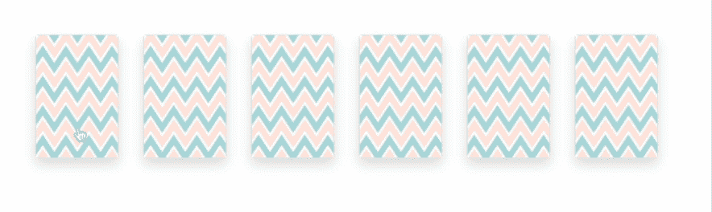
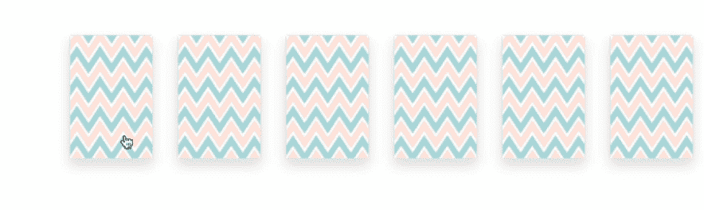
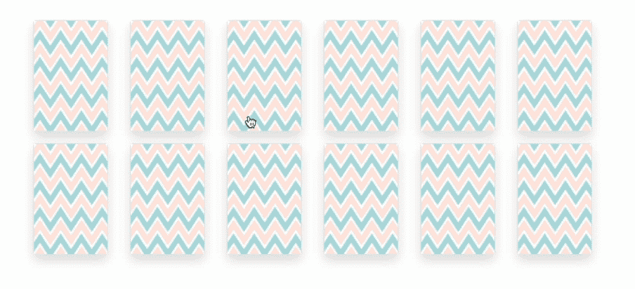
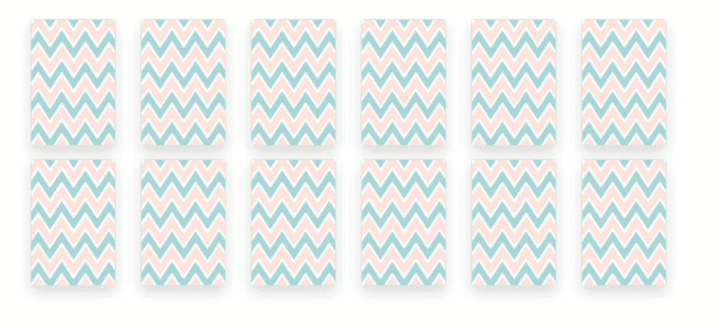
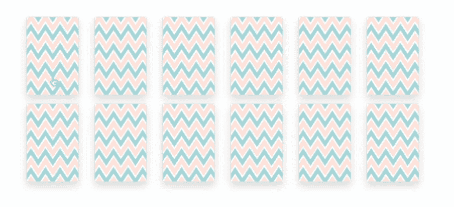
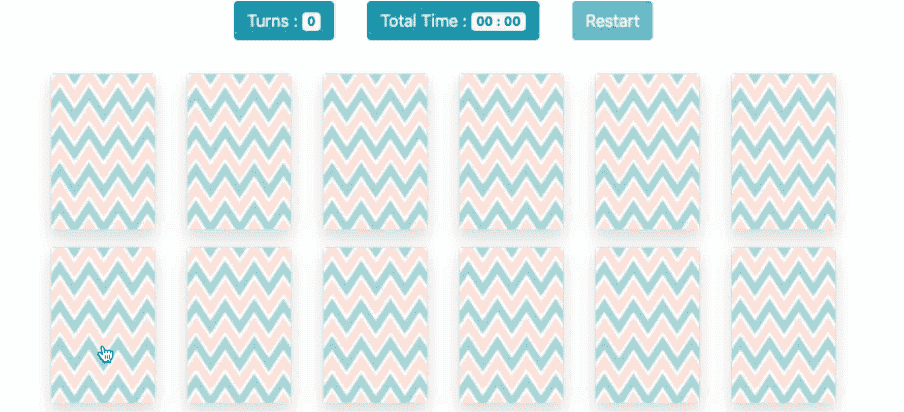

# 如何用 Vue.js 搭建内存卡游戏

> 原文：<https://www.freecodecamp.org/news/how-to-build-a-memory-card-game-with-vuejs/>

如果你是 Vue 的新手，想要更新你的基础知识，这个有趣的练习将帮助你构建一个有趣的游戏。

在这篇文章中，我将带你一步一步地在 VueJS 中构建一个存储卡游戏。

在本文结束时，您可以期望了解到以下内容:

*   如何使用 v-for 指令遍历对象数组。
*   使用 *v-bind* 指令的动态类和样式绑定
*   如何添加*方法*和*计算出的*属性。
*   如何使用 Vue.set 向对象添加反应属性
*   如何使用 *setTimeout* 方法延迟 JavaScript 执行？
*   Javascript 对象的*浅层克隆 vs 深层克隆*。
*   如何使用 *Lodash* 实用程序库？

让我们开始吧。

## 准备就绪-包括库

第一步很简单:只需将 CDN 中的库导入到我们的基本 HTML5 标记中，这样我们就可以开始我们的小项目了。

```
<!DOCTYPE html>
<html lang="en">
<head>
    <meta charset="UTF-8">
    <meta name="viewport" content="width=device-width, initial-scale=1.0">
    <title>Memory Card Game</title>
    <link rel="stylesheet" href="https://stackpath.bootstrapcdn.com/bootstrap/4.4.1/css/bootstrap.min.css"
    integrity="sha384-Vkoo8x4CGsO3+Hhxv8T/Q5PaXtkKtu6ug5TOeNV6gBiFeWPGFN9MuhOf23Q9Ifjh" crossorigin="anonymous">

    <!-- development version, includes helpful console warnings -->
    <script src="https://cdn.jsdelivr.net/npm/vue/dist/vue.js"></script>
</head>
<body>

</body>
</html>
```

## **允许用户查看卡片网格**

接下来，让我们定义必要的 HTML 标记、CSS 样式和一个基本的 Vue 实例，以便用户可以看到卡片网格。

### 实例视图

让我们创建一个新的 Vue 实例，并定义一个名为 cards 的数据属性，它保存着卡片列表。

```
let app = new Vue({
    el: '#app',
    data:{
            cards: [
                {
                    name: 'Apple',
                    img: 'apple.gif',

                },
                {
                    name: 'Banana',
                    img: 'banana.gif',

                },
                {
                    name: 'Orange',
                    img: 'orange.jpg',

                },
                {
                    name: 'Pineapple',
                    img: 'pineapple.png',

                },
                {
                    name: 'Strawberry',
                    img: 'strawberry.png',

                },
                {
                    name: 'watermelon',
                    img: 'watermelon.jpg',

                },
            ],
    },
});
```

数组中的每个对象都包含两个属性:图像的名称(将用于执行匹配)和卡片的图像。

### HTML MarkUp

因为我们现在已经在 Vue 实例中准备好了数据，所以我们可以在 VueJS 中使用 v-for 指令来遍历它。

```
 <div id="app">
    <div class="row">
        <div class="col-md-6 col-lg-6 col-xl-5 mx-auto">
             <div class="row justify-content-md-center">
                    <div v-for="card in cards" class="col-auto mb-3 flip-container">
                    <div class="memorycard">
                        <div class="front border rounded shadow"></div>
                        <div class="back rounded border"></div>
                    </div>
                 </div>
            </div>
        </div>
    </div>
    </div>
```

我们使用了一些基本的引导标记和 VueJS 的 v-for 指令来遍历卡片，并以网格格式显示它们。

每个存储卡由两部分组成:

*   正面:这包含所有卡片的公共图案图像(默认卡片视图)
*   back:这包含实际的卡片图像(默认情况下需要隐藏)

让我们添加一些基本的 CSS，以便我们只显示卡的前面部分(常见的设计模式):

```
 .flip-container {
        -webkit-perspective: 1000;
        -moz-perspective: 1000;
        -o-perspective: 1000;
        perspective: 1000;
        min-height: 120px;
        cursor: pointer;
    }
    .front,
    .back {
        -webkit-backface-visibility: hidden;
        -moz-backface-visibility: hidden;
        -o-backface-visibility: hidden;
        backface-visibility: hidden;
        -webkit-transition: 0.6s;
        -webkit-transform-style: preserve-3d;
        -moz-transition: 0.6s;
        -moz-transform-style: preserve-3d;
        -o-transition: 0.6s;
        -o-transform-style: preserve-3d;
        -ms-transition: 0.6s;
        -ms-transform-style: preserve-3d;
        transition: 0.6s;
        transform-style: preserve-3d;
        top: 0;
        left: 0;
        width: 100%;
    }
    .back {
        -webkit-transform: rotateY(-180deg);
        -moz-transform: rotateY(-180deg);
        -o-transform: rotateY(-180deg);
        -ms-transform: rotateY(-180deg);
        transform: rotateY(-180deg);
        position: absolute;
    }
```

刷新页面，您应该会看到六张卡片正面朝上，以网格格式堆叠在一起。实际的卡片图像隐藏在背面。


Front side of card (Looped through v-for directive)

## 让我们翻牌

接下来，让我们将一个事件绑定到我们的卡片上，这样当它被点击时，就会翻转并显示它后面的图像。

让我们修改我们的原始卡片数组，为每张卡片添加另一个属性。这将确定卡当前是否翻转。

添加下面的 CSS。当翻转的类被添加到类中时，它将显示卡片图像。这也给了我们一个很好的转弯效果。

```
 .flip-container.flipped .back {
        -webkit-transform: rotateY(0deg);
        -moz-transform: rotateY(0deg);
        -o-transform: rotateY(0deg);
        -ms-transform: rotateY(0deg);
        transform: rotateY(0deg);
    }
    .flip-container.flipped .front {
        -webkit-transform: rotateY(180deg);
        -moz-transform: rotateY(180deg);
        -o-transform: rotateY(180deg);
        -ms-transform: rotateY(180deg);
        transform: rotateY(180deg);
    }
```

让我们使用 Vue **创建的**生命周期事件来添加新属性，并添加 flipCard 方法来翻转卡片

```
 created(){
        this.cards.forEach((card) => {
            card.isFlipped = false;
        });
    },

    methods:{
        flipCard(card){
            card.isFlipped = true;
        }
    }
```

首先，我们将 click 事件绑定到 cards 来调用 flipCard 方法。然后我们还将使用 v-bind 指令将**翻转的**类绑定到卡上。

```
...
<div v-for="card in cards" class="col-auto mb-3 flip-container" :class="{ 'flipped': card.isFlipped }" @click="flipCard(card)">
 ...
```

听起来差不多，让我们看看卡是否会在点击时翻转。



Card not flipping on clicking

没用。为什么不呢？

让我们回到我们创建的生命周期方法，我们遍历卡片列表并添加了一个名为 isFlipped 的新属性。看起来不错，但是 Vue 不喜欢。

为了使新的对象属性具有反应性，您必须使用 Vue.set 方法将它们添加到对象中。

```
 created(){
        this.cards.forEach((card) => {
            Vue.set(card,'isFlipped',false)
        });
    },
```

现在卡片应该在点击时翻转:



好吧，干得好。让我们继续下一个。

## **加倍并洗牌**

是的，没错！为了用这些卡片做一个记忆游戏，我们需要每张卡片正好有一对。我们还需要在每次游戏加载时打乱卡片的顺序。

让我们在 Vue 实例中定义一个名为 memoryCards 的新属性。在这里，我们将存储将要使用的牌(即实际牌量的两倍，也是洗牌后的牌)。

```
...
memoryCards: [],
...
```

### 加倍

为了创建所有卡片的两个副本，让我们连接卡片数组来创建并将其分配给 memoryCards 属性。

更改 HTML 标记中的 v-for 指令，以循环遍历 memoryCards 属性，而不是 Cards:

```
<div v-for="card in memoryCards" class="col-auto mb-3 flip-container" :class="{ 'flipped': card.isFlipped }" @click="flipCard(card)">
```

接下来，修改创建了的生命周期方法**,以将串联数组分配到 memoryCards 中:**

```
 created(){
        this.cards.forEach((card) => {
            Vue.set(card,'isFlipped',false)
        });

        var cards1 = this.cards;
        var cards2 = this.cards;
        this.memoryCards = this.memoryCards.concat(cards1, cards2);
    },
```

看起来很简单，对吧？

但这不会正常工作。这段代码有两个问题:

1.  将 this.cards 直接分配给 cards1 不会产生 cards 对象的另一个副本。cards1 仍在引用原始对象。
2.  由于 cards1 和 cards2 仍然引用同一个对象，这意味着我们已经连接了两个指向同一个对象数组的数组。

更改 memoryCards 对象中对象的任何属性都会更改原始数组以及数组中它自己的数组对。



嗯，这是个问题。

如果您四处寻找正确复制数组或对象的解决方案，以便它不引用原始数组，您可能会遇到对数组进行浅层复制的解决方案。

### 什么是浅抄？

浅抄是指只抄一级。这对于只包含原始值的数组或对象来说很好。

进行浅层复制的一种方法是通过 spread 操作符，在我们的例子中，它类似于下面的代码:

```
...
   var cards1 = [...this.cards];
   var cards2 = [...this.cards];
   this.memoryCards = this.memoryCards.concat(cards1, cards2);
...
```

但这不是我们的解决方案，因为在我们的例子中，我们有一个对象数组，没有任何原始值。因此，如果我们对数组进行深层复制，我们的问题就可以解决。

### 什么是深度复制？

对于包含其他对象或数组的对象和数组，复制这些对象需要深层复制。否则，对嵌套引用所做的更改将会更改嵌套在原始对象或数组中的数据。

有多种方法可以进行深度复制，但是我们将使用最简单和最常见的方法来使用 **Lodash** 库。

现在，什么是****洛达什图书馆？****

**Lodash 通过消除处理数组、数字、对象、字符串等的麻烦，使 JavaScript 变得更加简单。**

**对于我们的例子，Lodash 有一个执行 deepCopy 的方法，这使得它简单得可笑。**

**首先，通过下载或通过 CDN 引用 Lodash，将它包含在您的页面中。**

```
`<script src="https://cdn.jsdelivr.net/npm/lodash@4.17.15/lodash.min.js"></script>`
```

**接下来，您可以使用 Lodash 的 **cloneDeep** 方法来执行我们的 cards 数组的深度复制。**

```
 `var cards1 = _.cloneDeep(this.cards);
 var cards2 = _.cloneDeep(this.cards);
 this.memoryCards = this.memoryCards.concat(cards1, cards2);`
```

### **洗牌**

**现在我们想打乱串联的数组。Lodash 也有洗牌的方法。让我们使用方法并简化代码，以便在一行中进行连接和混排。**

```
`created(){
        this.cards.forEach((card) => {
            Vue.set(card,'isFlipped',false)
        });

        this.memoryCards = _.shuffle(this.memoryCards.concat(_.cloneDeep(this.cards), _.cloneDeep(this.cards)));
    },`
```

****

**牌现在像预期的那样洗牌和翻转。**

**继续下一件事！**

## **匹配卡**

**下一步是匹配翻转的卡片。一个用户一次最多可以翻两张牌。如果它们相同，那就是匹配！如果不是，我们就把它们翻回来。**

**让我们解决这个问题。**

**我们将为每张卡添加一个新属性来跟踪该卡是否已经匹配。修改创建的方法以包含以下代码:**

```
`this.cards.forEach((card) => {
    Vue.set(card,'isFlipped',false);
    Vue.set(card,'isMatched',false);
});`
```

**创建新的数据属性来存储翻转的卡片:**

```
`flippedCards: [],`
```

**接下来，我们修改 flipCard 方法来执行匹配:**

```
`flipCard(card){
    card.isFlipped = true;

    if(this.flippedCards.length < 2)
        this.flippedCards.push(card);
    if(this.flippedCards.length === 2)    
        this._match(card);
},

_match(card){

    if(this.flippedCards[0].name === this.flippedCards[1].name)
        this.flippedCards.forEach(card => card.isMatched = true);
    else
        this.flippedCards.forEach(card => card.isFlipped = false);

    this.flippedCards = [];
},` 
```

**这里的逻辑很简单:我们不断向 flippedCards 数组添加卡片，直到有两张卡片。**

**一旦有两张卡，我们就进行匹配。**

*   **如果两张卡的名称相同，我们通过将 isMatched 属性设置为 true 来将这两张卡标记为匹配。**
*   **否则，我们将 isFlipped 属性设置回 false。**

**在此之后，我们清空翻牌阵列。**

**添加一个新的 CSS 属性来淡出匹配的卡片:**

```
`.matched{
   opacity: 0.3;
}`
```

**如果属性设置为 true，则向容器添加类绑定以添加匹配的卡:**

```
`:class="{ 'flipped': card.isFlipped, 'matched' : card.isMatched }"`
```

**这里的逻辑运作良好，但一切发生得太快，玩家无法理解发生了什么。如果牌不匹配，它们甚至会在用户看到露出的牌之前被翻回来。**

**让我们使用 JavaScript 的 setTimeout 方法来故意添加几微秒的延迟。**

```
`_match(card){
    if(this.flippedCards[0].name === this.flippedCards[1].name){
        setTimeout(() => {
            this.flippedCards.forEach(card => card.isMatched = true);
            this.flippedCards = [];
        }, 400);
    }
    else{
        setTimeout(() => {
            this.flippedCards.forEach((card) => {card.isFlipped = false});
            this.flippedCards = [];
        }, 800);
    }
},`
```

**在将它们标记为匹配之前，我们增加了 400 微秒的延迟，并在翻转它们之前增加了 800 微秒的延迟。**

**同时修改 flipCard 方法，以便在以下情况下不翻牌**

*   **卡已经匹配**
*   **卡片已经翻转**
*   **用户已经翻了两张牌**

```
`flipCard(card){

    if(card.isMatched || card.isFlipped || this.flippedCards.length === 2)
            return;

    card.isFlipped = true;

    if(this.flippedCards.length < 2)
        this.flippedCards.push(card);
    if(this.flippedCards.length === 2)    
        this._match(card);
},`
```

****

**我们就快到了，只差几步了。**

## **完成游戏**

**当所有的牌都匹配时，游戏被标记为结束。**

**让我们快速编写代码条件。我们在 Vue 实例中引入了一个新的数据属性:**

```
`...
finish: false`
```

**接下来，我们修改 match 方法，在每次成功匹配后检查是否所有的卡都匹配了。**

```
`setTimeout(() => {
    this.flippedCards.forEach(card => card.isMatched = true);
    this.flippedCards = [];

    //All cards matched ?
    if(this.memoryCards.every(card => card.isMatched === true)){
        this.finish = true;
    }

}, 400);`
```

**我们使用 JavaScript 数组的 every 方法来评估给定条件的真值，如果不是，则返回假值。**

## **记录总圈数和总时间**

**我们已经完成了这个游戏，所以现在让我们给它一些收尾工作，让它变得更有趣。我们将添加用户已经进行了多少回合，以及他们如何按时完成游戏。**

**首先，我们将介绍一些新的数据属性:**

```
`start: false
turns: 0,
totalTime: {
    minutes: 0,
    seconds: 0,
},`
```

**一旦有两张牌翻转，我们将增加计数。因此，我们将修改 _match 方法来增加圈数。**

```
`...
_match(card){

    this.turns++;

    ...`
```

**接下来，我们修改 flipCard 方法来启动计时器:**

```
`flipCard(card){

    if(card.isMatched || card.isFlipped || this.flippedCards.length === 2)
            return;

    if(!this.start){
        this._startGame();
    }

    ...
    ...`
```

**增加两个新方法，一旦游戏开始就开始计时:**

```
`_startGame(){
    this._tick();
    this.interval = setInterval(this._tick,1000);
    this.start = true;
},

_tick(){
    if(this.totalTime.seconds !== 59){
         this.totalTime.seconds++;
         return
     }

     this.totalTime.minutes++;
     this.totalTime.seconds = 0;
},`
```

**当分钟和秒钟是个位数时，我们使用计算属性在分钟和秒钟前面填充“0”:**

```
`computed:{
    sec(){
        if(this.totalTime.seconds < 10){
            return '0'+this.totalTime.seconds;
        }
        return this.totalTime.seconds;
    },
    min(){
        if(this.totalTime.minutes < 10){
            return '0'+this.totalTime.minutes;
        }
        return this.totalTime.minutes;
    }
}`
```

**在您的 HTML 上方添加以下 HTML，以显示总圈数和总时间:**

```
`<div class="d-flex flex-row justify-content-center py-3">
    <div class="turns p-3"><span class="btn btn-info">Turns : <span class="badge" :class="finish ? 'badge-success' : 'badge-light'">{{turns}}</span> </span></div>
    <div class="totalTime p-3"><span class="btn btn-info">Total Time : <span class="badge" :class="finish ? 'badge-success' : 'badge-light'">{{min}} : {{sec}}</span></span></div>
</div>`
```

**修改游戏结束条件，在游戏结束后停止计时:**

```
`if(this.memoryCards.every(card => card.isMatched === true)){
    clearInterval(this.interval);
    this.finish = true;
}`
```

## **重置**

**我们已经到了最后一步，如果你已经走到这一步，那就做得很好。**

**让我们添加一个按钮来重置游戏:**

```
`<div class="totalTime p-3"><button class="btn btn-info" @click="reset" :disabled="!start">Restart</button></div>`
```

**将 click 事件绑定到 reset 方法:**

```
`reset(){
    clearInterval(this.interval);

    this.cards.forEach((card) => {
        Vue.set(card, 'isFlipped',false);
        Vue.set(card, 'isMatched',false);
    });

    setTimeout(() => {  
        this.memoryCards = [];
        this.memoryCards = _.shuffle(this.memoryCards.concat(_.cloneDeep(this.cards), _.cloneDeep(this.cards)));
        this.totalTime.minutes = 0;
        this.totalTime.seconds = 0;
        this.start = false;
        this.finish = false;
        this.turns = 0;
        this.flippedCards = [];

        }, 600);

},`
```

**我们清空计时器，重新洗牌，并将所有字段重置回默认值。**

**我们还修改了创建的生命周期方法，以调用 reset 方法来避免代码重复:**

```
`created(){
    this.reset();
},`
```

**这就对了。你现在在 VueJS 中有一个记忆游戏。**

****

**如果你正在寻找学习 VueJS 基础知识以及这些有趣的练习，你可以在我的个人博客上阅读 VueJS 教程系列[5 气球 VueJS 课程](https://www.5balloons.info/vuejs-tutorials-course-introduction/)。**