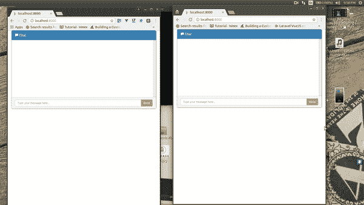

# 如何在 Django 中建立消息传递状态

> 原文：<https://www.freecodecamp.org/news/how-to-build-a-message-delivery-status-in-django-e8d1eb2e8b6a/>

作者奥贡迪普·塞缪尔

# 如何在 Django 中建立消息传递状态

今天我们就用 Django 和 Pusher 做一个实时消息传递状态框架。

为了遵循本教程，需要对 Django 和 Vue 有一个基本的了解。

### 建立姜戈

首先，如果我们还没有 Python Django 库，我们需要安装它。为了安装 Django，我们运行:

安装完 Django 之后，就该创建我们的项目了。使用以下命令打开一个终端并创建一个新项目:

[https://gist.github.com/4896cf41463ff83e191949a02bbead23](https://gist.github.com/4896cf41463ff83e191949a02bbead23)

在上面的命令中，我们创建了一个名为`pusher_message`的新项目。下一步将是在我们的新项目中创建一个应用程序。为此，让我们运行以下命令:

一旦我们完成了新应用程序的设置，我们需要告诉 Django 我们的新应用程序，因此我们将进入`pusher_message\settings.py`并将消息应用程序添加到我们已安装的应用程序中，如下所示:

完成以上工作后，是时候运行应用程序了，看看是否一切顺利。

在我们的终端 shell 中，我们运行:

如果我们将浏览器导航到`http://localhost:8000`，我们应该会看到以下内容:

### 在 Pusher 上设置一个应用程序

至此，Django 已经准备就绪。我们现在需要设置 Pusher，并获取我们的应用程序凭证。

我们需要在 [Pusher](https://pusher.com/signup) 上注册，创建一个新的应用程序，还需要复制我们的秘密应用程序密钥和应用程序 id。

下一步是安装所需的库:

在上面的 bash 命令中，我们安装了一个包，`pusher`。这是 Python 的官方 Pusher 库，我们将用它来触发和发送我们的消息给 Pusher。

### 创建我们的应用程序

首先，让我们创建一个模型类，它将生成我们的数据库结构。
让我们打开`message\models.py`，将内容替换为以下内容:

在上面的代码块中，我们定义了一个名为`Conversation`的模型。对话表由以下字段组成:

*   将消息链接到创建它的用户的字段
*   存储消息的字段
*   存储消息状态的字段
*   存储消息创建日期和时间的字段

### 运行迁移

我们需要进行迁移并运行它们，以便创建我们的数据库表。为此，让我们在终端中运行以下命令:

### 创造我们的观点

在 Django 中，视图不一定指我们应用程序的 HTML 结构。事实上，我们可以将它视为我们的`Controller`，正如其他一些框架中所提到的那样。

让我们打开`message`文件夹中的`views.py`,将内容替换为:

在上面的代码中，我们定义了四个主要函数，它们是:

*   `index`
*   `broadcast`
*   `conversation`
*   `delivered`

在`index`函数中，我们添加了 login required decorator，我们还传递了尚不存在的 login URL 参数，因为我们需要在`urls.py`文件中创建它。此外，我们渲染了一个名为`chat.html`的默认模板，我们也将很快创建它。

在`broadcast`函数中，我们检索正在发送的消息的内容，将其保存到我们的数据库中，并最终触发一个 Pusher 请求传入我们的消息字典，以及一个通道和事件名称。
在`conversations`函数中，我们简单地获取所有对话，并将其作为 JSON 响应返回。

最后，我们有`delivered`函数，这个函数负责我们的消息传递状态。

在这个函数中，我们通过提供给我们的 ID 获取对话。然后，我们验证想要触发交付事件的用户不是最初发送消息的用户。此外，我们传入`socket_id`，这样 Pusher 就不会将事件广播回触发它的人。

`socket_id`代表触发事件的套接字连接的标识符。

### 填充 URL 的. py

让我们打开我们的`pusher_message\urls.py`文件，并用以下内容替换:

这个文件中有什么变化？我们在文件中添加了六条新路线。
我们已经定义了入口点，并将其分配给我们的`index`函数。接下来，我们定义了登录 URL，`login_required` decorator 将尝试访问它来验证用户。

我们使用了默认的`auth`函数来处理它，但是传入了我们自己的自定义登录模板，我们很快就会创建这个模板。

接下来，我们为`conversation`消息触发器、所有`conversations`以及最后的`delivered`对话定义了路由。

### 创建 HTML 文件

现在，我们需要创建两个 HTML 页面，这样我们的应用程序才能顺利运行。在构建应用程序的过程中，我们引用了两个 HTML 页面。

让我们在我们的`messages`文件夹中创建一个名为`templates`的新文件夹。

接下来，我们在`templates`文件夹中创建一个名为`login.html`的文件，并用以下内容替换它:

### Vue 组件和推动器绑定

就是这样！现在，每当一个新的消息被发送，它将被广播，我们可以收听，使用我们的频道，实时更新状态。下面是我们使用 Vue.js 编写的示例组件。

**请注意:**在下面的 Vue 组件中，定义了一个名为`**queryParams**`的新函数来序列化我们的 POST 主体，因此它可以作为`**x-www-form-urlencoded**`发送到服务器，而不是作为`**payload**`。我们这样做是因为 Django 不能处理作为`**payload**`进入的请求。

下图展示了我们所构建的内容:

### 结论

在本文中，我们介绍了如何使用 Django 和 Pusher 创建实时消息传递状态。我们已经完成了从 CSRF 检查中免除某些功能，以及免除广播公司接收它们触发的事件。

代码托管在一个公共的 GitHub 库上。可以下载用于教育目的。

有没有更好的方法来构建我们的应用程序、预订或评论？请在评论中告诉我们。记住，分享就是学习。

本帖最初由作者发表在推手博客[这里](https://blog.pusher.com/how-to-build-a-message-delivery-status-in-django/)。

为清晰起见，此版本已经过编辑，可能与原始帖子有所不同。