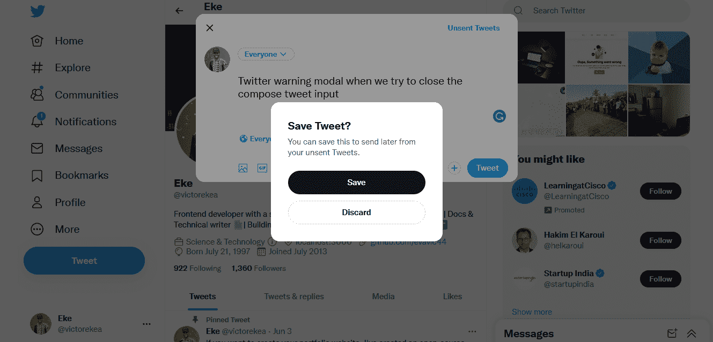
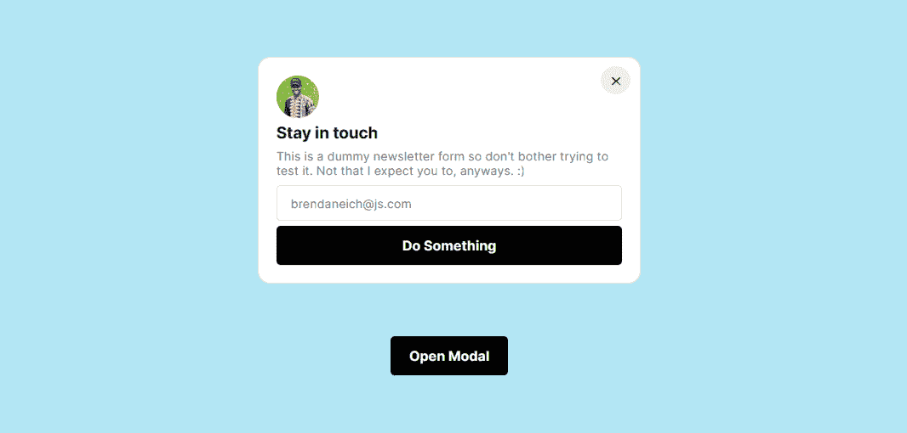
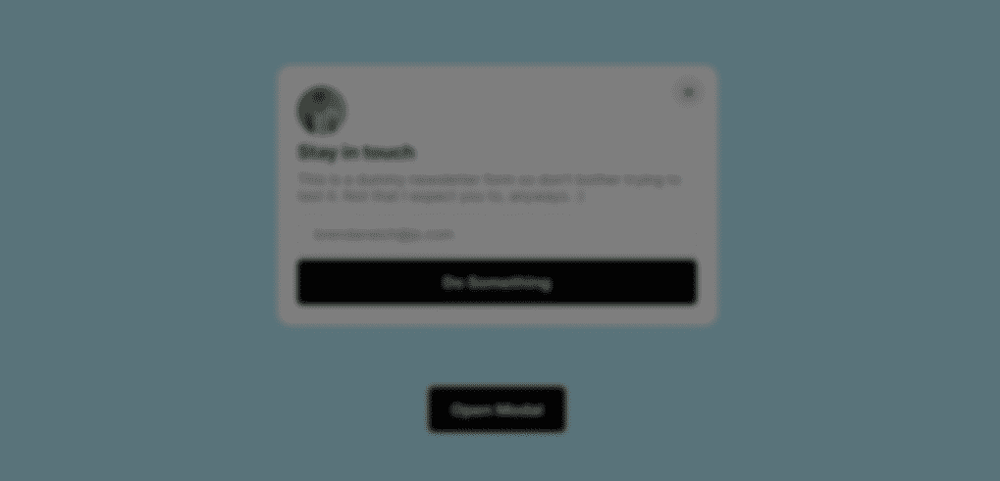
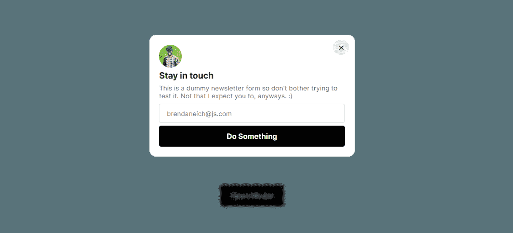
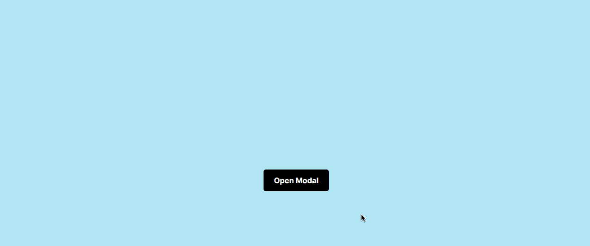
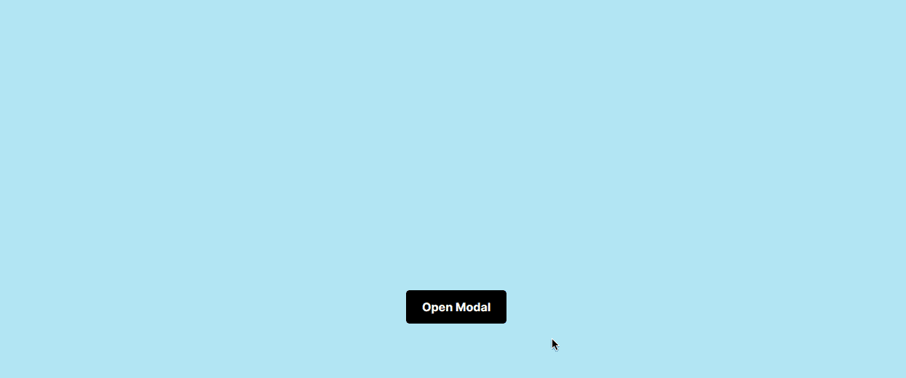

# 如何用 JavaScript 构建一个模型

> 原文：<https://www.freecodecamp.org/news/how-to-build-a-modal-with-javascript/>

这种情况以前可能发生在你身上:你无意中试图在网页上执行一个动作，但幸运地得到一个弹出窗口，要求你确认你的决定。

这个弹出窗口被称为模态窗口。它是一个网页元素，弹出并显示在其他页面内容的前面。

您可以使用情态动词来做一些事情，例如存储您不想立即在网页上看到的信息、创建导航菜单、添加行动号召元素等等。

一个很好的例子就是当你试图关闭撰写推文菜单时出现在 Twitter 上的模态。



您还可以将模态用于其他事情，比如创建行动号召元素、导航菜单、时事通讯小部件等等。

作为一名 web 开发人员，知道如何构建模型是一项非常有用的技能。在本教程中，我将带您了解如何使用 HTML、CSS 和 JavaScript 创建一个简单的模型。

这是我们将要构建的内容的截图:


这些步骤非常容易遵循，因此您可以定制模型或从头开始构建自己的模型，这完全取决于您。在本文的最后，我将提供 codepen 文件，以便您可以使用它。

## 步骤 1–添加标记

好了，让我们从 HTML 开始。

首先，您将添加一个`section`元素并给它两个类，`modal`和`hidden.`，在这个元素下，您还将有一个`<div>`元素，它有一个类`overlay`和`hidden`。最后，您将添加一个包含类`btn`和`btn-open.`的`<button>`元素

看起来是这样的:

```
<section class="modal hidden"></section>
<div class="overlay hidden"></div>
<button class="btn btn-open">Open Modal</button> 
```

*   具有 modal 类的 section 元素将作为您的模态容器。
*   具有类`overlay`的 div 将作为你的覆盖元素。这是模态打开时看到的深色模糊背景。
*   类别为`btn`和`btn-open`的按钮将作为你的模态按钮，所以当你点击这个按钮时，它会启动我们的模态。

现在在你的模态中，添加标记，并且添加`X`按钮来关闭模态。该按钮将被分配一个`btn-close`类。

因此，您的完整标记最终会是这样的:

```
<section class="modal hidden">
  <div class="flex">
    
    <button class="btn-close">⨉</button>
  </div>
  <div>
    <h3>Stay in touch</h3>
    <p>
      This is a dummy newsletter form so don't bother trying to test it. Not
      that I expect you to, anyways. :)
    </p>
  </div>

  <input type="email" id="email" placeholder="brendaneich@js.com" />
  <button class="btn">Submit</button>
</section>

<div class="overlay hidden"></div>
<button class="btn btn-open">Open Modal</button> 
```

**重要提示** ⚠️注意到了添加到模态元素和覆盖元素中的隐藏类。这是非常重要的，因为您将使用 CSS 将这些类作为目标来隐藏您的模态和覆盖。

以下是输出结果:


## 步骤 2–设计模型样式

让我们从重置页面上每个元素的默认边距和填充开始，然后将模式按钮和打开模式按钮居中。

现在跳到你的 CSS 并添加以下样式:

```
* {
  margin: 0;
  padding: 0;
  box-sizing: border-box;
  font-family: "Inter", sans-serif;
}

body {
  display: flex;
  flex-direction: column;
  align-items: center;
  justify-content: center;
  color: #222;
  position: relative;
  min-height: 100vh;
} 
```

下一步是样式化模态容器本身和容器内部的元素。这个过程有点长，所以我只是在这里复制和粘贴样式，然后解释一下:

```
.modal {
  display: flex;
  flex-direction: column;
  justify-content: center;
  gap: 0.4rem;
  width: 450px;
  padding: 1.3rem;
  min-height: 250px;
  position: absolute;
  top: 20%;
  background-color: white;
  border: 1px solid #ddd;
  border-radius: 15px;
}

.modal .flex {
  display: flex;
  align-items: center;
  justify-content: space-between;
}

.modal input {
  padding: 0.7rem 1rem;
  border: 1px solid #ddd;
  border-radius: 5px;
  font-size: 0.9em;
}

.modal p {
  font-size: 0.9rem;
  color: #777;
  margin: 0.4rem 0 0.2rem;
}

button {
  cursor: pointer;
  border: none;
  font-weight: 600;
}

.btn {
  display: inline-block;
  padding: 0.8rem 1.4rem;
  font-weight: 700;
  background-color: black;
  color: white;
  border-radius: 5px;
  text-align: center;
  font-size: 1em;
}

.btn-open {
  position: absolute;
  bottom: 150px;
}

.btn-close {
  transform: translate(10px, -20px);
  padding: 0.5rem 0.7rem;
  background: #eee;
  border-radius: 50%;
} 
```

这是输出结果:



您所做的是样式化模态元素，然后使用 absolute 属性定位它。这是因为您之前向 body 元素添加了一个位置相对属性。

您还设计了 modal 中的元素，但我不会深入细节，因为这对我们来说并不重要。

## 步骤 3–添加覆盖图

对于覆盖图，您希望将它放置在整个页面上，并带有微妙的深色背景和模糊效果。

因为您有了相对于 body 元素的位置，所以可以使用 position fixed 属性在 body 元素上添加覆盖。你将覆盖它 100%的视口宽度和高度。

```
.overlay {
  position: fixed;
  top: 0;
  bottom: 0;
  left: 0;
  right: 0;
  width: 100%;
  height: 100%;
  background: rgba(0, 0, 0, 0.5);
  backdrop-filter: blur(3px);
  z-index: 1;
} 
```

以下是输出结果:



覆盖是可行的，但是您只希望它影响主体元素，而不是模态元素。要解决这个问题，请向模式容器添加一个更高的`z-index`属性。

```
.modal {
  z-index: 2;
} 
```

现在模型应该在覆盖层上，而不是在它后面。



您已经成功地创建了模型，并在它后面添加了一个覆盖图！但是你不想显示模态，至少在点击`open-modal`按钮之前不想。

要隐藏它，您需要将之前添加的`.hidden`类指向 CSS 中的 modal 和 overlay 元素。您还将显示“无”。

```
.hidden {
  display: none;
} 
```

现在只有按钮显示在页面上。现在，您可以使用 JavaScript 处理模态功能。

## 步骤 4–添加模式功能

在我们继续之前，我认为最好解释一下模态是如何工作的。还记得你是如何使用`hidden`类来隐藏模态和覆盖的吗？要在元素中添加或删除这个类，您将使用 DOM 的 classList 元素。

但是首先，您需要使用 DOM 的`querySelector`方法选择您的类，并将它们存储在变量中，以便它们可以重用。

```
const modal = document.querySelector(".modal");
const overlay = document.querySelector(".overlay");
const openModalBtn = document.querySelector(".btn-open");
const closeModalBtn = document.querySelector(".btn-close"); 
```

## 如何打开模态

在 other 中要显示模态，创建一个名为`openModal`的函数。在这个函数中，您将使用 DOM `classList`属性，该属性采用不同的方法，如`.remove()`和`.add()`，从`modal`和`overlay`中移除`hidden`类。

```
const openModal = function () {
  modal.classList.remove("hidden");
  overlay.classList.remove("hidden");
}; 
```

然后你可以使用一个`eventListener`将这个函数绑定到打开的模态按钮`openModalBtn`上。这样，任何时候点击这个按钮，函数就会执行，显示模态。

```
openModalBtn.addEventListener("click", openModal); 
```

现在当你点击`open modal`按钮时，这将从模态元素中移除`hidden`类，你可以看到你的模态。

以下是输出结果:



## 如何关闭模态

为了关闭模态，您还将创建一个名为`closeModal`的函数。在函数内部，使用`.add()`方法添加回您移除的`hidden`类。

`classList`属性也有一个`add()`方法，当你点击`closeModal`按钮时，你可以用它来添加隐藏类。就像您在按钮上添加了一个`eventListener`来关闭模态一样，您将对`x`按钮做同样的事情——但是这一次，您将添加回`hidden`类。

```
const closeModal = function () {
  modal.classList.add("hidden");
  overlay.classList.add("hidden");
}; 
```

要关闭模态，添加一个`eventListener`到关闭模态按钮来执行你刚才写的函数。

```
closeModalBtn.addEventListener("click", closeModal); 
```

现在，当您单击关闭按钮时，该函数会将隐藏的类添加回模态和覆盖组件，从而关闭模态。

这是输出


通常，当您在模式容器外部或网页正文上单击时，模式也会被关闭。要做到这一点，添加一个`eventListener`来在你点击覆盖时关闭模态。

```
overlay.addEventListener("click", closeModal); 
```



## 如何在按键时关闭模态

除了在单击关闭按钮或覆盖时关闭模式之外，还可以附加一个事件侦听器来监视键盘事件。

在这种情况下，您希望在按下`Escape`键时关闭模态，就像 Twitter compose 模态示例一样。

```
document.addEventListener("keydown"); 
```

但是这次您想要的事件类型不是`“click”`事件——您想要使用`“keydown”`事件来执行您的函数。

接下来，您将编写一个条件来检查当前按下的键是否是`Escape`键，以及模态是否不包含`hidden`类。所以它是打开的，你想执行`closeModal`功能(本质上，关闭模态)。

```
document.addEventListener("keydown", function (e) {
  if (e.key === "Escape" && !modal.classList.contains("hidden")) {
    modalClose();
  }
}); 
```

现在，当模态打开时，你按下`<kbd>Esc</kbd>`键，它将关闭模态。

这样，您就成功地创建了一个包含 HTML、CSS 和 JavaScript 的模态组件，它就像预期的那样工作。🥳

下面是实际测试该模型的 codepen 文件:

[https://codepen.io/evavic44/embed/zYjjzoV?default-tab=html%2Cresult&theme-id=light](https://codepen.io/evavic44/embed/zYjjzoV?default-tab=html%2Cresult&theme-id=light)

See the Pen [Modal with overlay and blur](https://codepen.io/evavic44/pen/zYjjzoV) by Eke ([@evavic44](https://codepen.io/evavic44)) on [CodePen](https://codepen.io).

## 结论

我真诚地希望你觉得这篇文章有趣或有用。如果你有，请与你的朋友分享或订阅我的博客，这样你就不会错过任何未来的帖子。感谢阅读。

[GitHub](https://github.com/evavic44) | [推特](https://twitter.com/victorekea) | [博客](https://eke.hashnode.dev) | [作品集](https://victoreke.com)