# 如何用 SAP 对话式 AI 和 NodeJS 构建电影机器人

> 原文：<https://www.freecodecamp.org/news/how-to-build-a-movie-bot-with-sap-conversational-ai-and-nodejs-5d7221b83267/>

保罗·皮纳德

# 如何用 SAP 对话式 AI 和 NodeJS 构建电影机器人

#### 通过在 Facebook Messenger 上询问您自己的聊天机器人，从电影数据库中获得电影推荐。

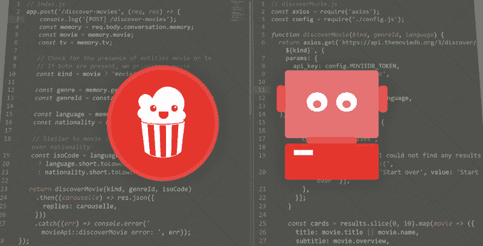

本教程结束时，您将能够构建一个功能完整的电影机器人，能够根据几个标准进行电影推荐。我们使用 [SAP 对话式人工智能机器人构建平台](https://cai.tools.sap/) ( [在此免费注册](https://cai.tools.sap/signup))和[电影数据库](https://www.themoviedb.org/?language=en)获取电影信息。

以下是与电影机器人的演示聊天:


### 我们今天在建造什么？

与第三方 API 的交互允许比简单的问答聊天机器人更有趣的用例。有了 **Bot 技能**，我们增加了直接从构建器调用 **webhooks** 的选项，这使得它更加容易。

今天的机器人需要几个步骤:

1.  提取句子中的关键信息
2.  构建 bot 流程(触发器、需求、操作)
3.  创建并连接能够从电影数据库获取数据的 bot API

你需要一个 [SAP 对话式人工智能账户](https://cai.tools.sap/signup/?utm_source=blog)，[节点。JS](https://nodejs.org/en/) 和潜在的 [Ngrok](https://ngrok.com/) 进行测试。

*在我们开始之前，[如果你正在寻找一本详细介绍你的第一个机器人的创建的指南，请查阅这本指南，而不是](https://medium.freecodecamp.org/how-to-build-your-first-chatbot-with-the-sap-conversational-ai-9a1a2bd44e3c)。*

我们开始吧！

### 步骤 1:从句子中提取关键信息

*意图*有助于确定句子的整体意思。对于我们的用例，知道用户*想看什么东西*是不够的。

我们需要知道用户想看什么。

*实体*就是为了解决这个问题而设计的:它们提取句子中的关键信息。

意图让你明白你必须做些什么。实体帮助你实际做一些事情。

假设您是一家提供电话和互联网接入的电信公司。你的机器人有一个意图，当人们抱怨停电时，它能理解:


提取的实体将有助于理解*什么*出了问题，*在哪里*以及从*何时*开始。

对于我们的电影机器人，我们将尝试提取 **3 条关键信息**:

1.  用户想看什么(电影还是电视节目)
2.  他们在寻找什么类型的电影
3.  用哪种语言

#### 使用黄金实体

为了帮助你加快开发速度，SAP 对话式 AI 默认提取几个实体:日期、地点、电话号码…

[此处提供了详尽的列表](https://cai.tools.sap/docs/concepts/gold-entities)。

`Language`实体将会有所帮助:

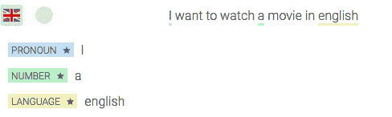

Gold Entities — Language

*看到实体名称旁边的小星星了吗？它将黄金实体与定制实体区分开来。*

我们将用它来满足我们的第三个要求:电影语言。

#### 创建自定义实体

我们将创建自定义实体来提取我们需要的信息。和意图一样，训练非常重要:你给你的机器人添加的例子越多，它就越准确。

训练你的实体可以通过多种意图发生。实体独立于意图。

对于我们的电影机器人，我们只需要一个意图、`discover`和两个实体:

*   `recording`识别用户想看电影**还是想看电视节目**
*   `genre`

打开意图`discover`并添加表达式。确保涵盖每一种可能性，这意味着健康的表达组合:

*   完全没有实体:“我男朋友今晚想看些东西”
*   一个实体:“我想看电影”
*   很多实体:“能给我推荐几部法剧电视剧吗？”

要标记表达式，请选择要标记的文本，然后键入实体名称:


Tagging custom entities

你应该添加更多的例子:15 个就够了，但是一个生产就绪的机器人需要至少 50 个例子才能运行良好。为了加速这个过程，你可以派生出[这个机器人](https://cai.tools.sap/pe/movie-bot-skills-training/train/intents) [ [录制实体](https://cai.tools.sap/pe/movie-bot-skills-training/train/entities/recording)，[流派实体](https://cai.tools.sap/pe/movie-bot-skills-training/train/entities/genre)，然后从这个[机器人](https://cai.tools.sap/pe/movie-bot-skills-training/train/intents)派生出[发现意图](https://cai.tools.sap/pe/movie-bot-skills-training/train/discover)。

你可以在这里看到“法语”被检测为一个民族，而不是一种语言，因为这就是它在这个上下文中的含义。在构建 bot 流时，我们将确保检查这两个实体。

#### 添加自定义内容

既然我们已经标记了我们的实体，我们将充实它们！如下所示，从您的 bot 的 training 选项卡下打开 entities 面板:


Entities section

现在让我们打开`genre`实体。如果你看面板的右上方，你应该会看到一个显示`free - restricted`和`settings`的开关。打开它，这样我们可以详细解释您可以访问的不同选项:

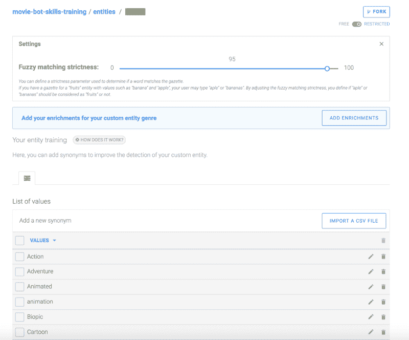

Entity panel

在实体面板中，您可以访问实体的不同选项:

*   自由与受限-当您没有严格的值列表并且希望机器学习检测所有可能的值时，可以使用自由自定义实体。而如果您有一个严格的单词列表要检测，并且不需要自动检测实体，则使用受限的自定义实体。
*   模糊匹配-模糊匹配是一个介于 0 和 1 之间的索引，用于指示某个单词与实体值列表中的单词的接近程度。如果这个单词在这个索引之上，那么平台会将它标记为列表中最接近的值。
*   值列表—您可以在此添加实体的所有值列表，这些值可以是不同的值或同义词

关于实体更深入的信息，你可以阅读我们详细的[文档](https://cai.tools.sap/docs/concepts/entity)。

在我们的例子中，我们的`genre`实体将是`restricted`,因为移动数据库 API 只管理特定的流派列表。以下是列表:

```
[ { id: 28, name: 'Action' }, { id: 12, name: 'Adventure' }, { id: 16, name: 'Animation' }, { id: 35, name: 'Comedy' }, { id: 80, name: 'Crime' }, { id: 99, name: 'Documentary' }, { id: 18, name: 'Drama' }, { id: 10751, name: 'Family' }, { id: 14, name: 'Fantasy' }, { id: 36, name: 'History' }, { id: 27, name: 'Horror' }, { id: 10402, name: 'Music' }, { id: 9648, name: 'Mystery' }, { id: 10749, name: 'Romance' }, { id: 878, name: 'Science Fiction' }, { id: 53, name: 'Thriller' }, { id: 10752, name: 'War' }, { id: 37, name: 'Western' } ]
```

将所有不同的流派加入我们的价值观列表。不要忘记也添加同义词，如 SF，科幻的科幻，浪漫的浪漫或动画，动画的卡通。您可以从[那里](https://cai.tools.sap/pe/movie-bot-skills-training/train/entities/genre)获取值列表。

正如您在上面的 JSON 中看到的，有与流派相关联的 id。原因是电影数据库不能根据其英文名称搜索特定的类型，而是根据一个自定义编号。我们可以为每个流派值关联一个特定的 id，该 id 将在 NLP API 的 JSON 中返回。我们可以将它传递给电影数据库 API。这就是定制致富的目的。每当检测到一个实体时，NLP API 返回的 JSON 就会增加关于该实体的附加信息。

在自定义丰富面板中，我们需要创建 3 个密钥:

*   `name`–映射相同值下的同义词
*   `id`–增加电影数据库的 id
*   `article`–添加该流派的文章(我们稍后会用到)

为了添加自定义丰富，点击`add new key`并添加上面列出的三个键。对于文章，将默认键值设置为“a ”,因为大多数类型都带有“a”。在 name 中，您可以开始添加特定的浓缩，并将其映射到您的`article`、`id`和`name`的所有不同值，如下所示:

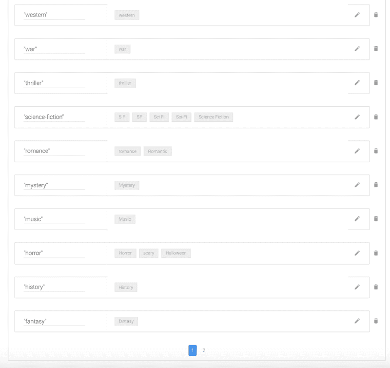

Custom enrichments for name

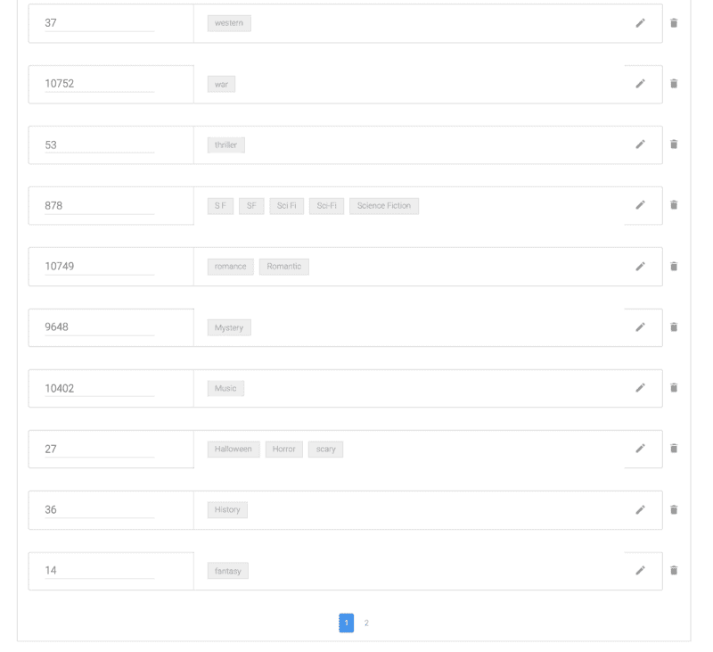

Custom enrichments for ids

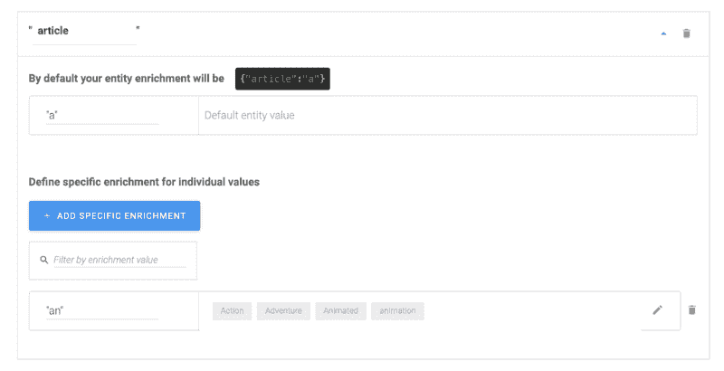

Custom enrichments for article

您可以从这个[页面](https://cai.tools.sap/pe/movie-bot-skills-training/train/entities/genre)中派生出整个实体，其中将包括浓缩。现在已经完成了，让我们在测试控制台中测试它。如果您发送句子“我想看一部动画电影”,您现在应该会看到以下自定义内容:

```
"genre": [      {        "value": "animated",        "raw": "animated",        "confidence": 0.99,        "name": "animation",        "id": 16,        "article": "an"      }
```

太好了，现在我们的丰富内容为我们提供了通用名称、id 和文章！让我们对记录实体做同样的事情。回到实体面板，点击录音。然后使其受限，并添加电视节目和电影的所有可能值和同义词(例如电视节目、节目、电影、影片、电影等。).点击查看完整列表[。现在转到 custom enrichments，添加关键字`type`，并添加 2 个特定值:](https://cai.tools.sap/pe/movie-bot-skills-training/train/entities/recording)

*   `movie`–所有电影的同义词
*   `tv`–所有电视节目的同义词

它应该是这样的:

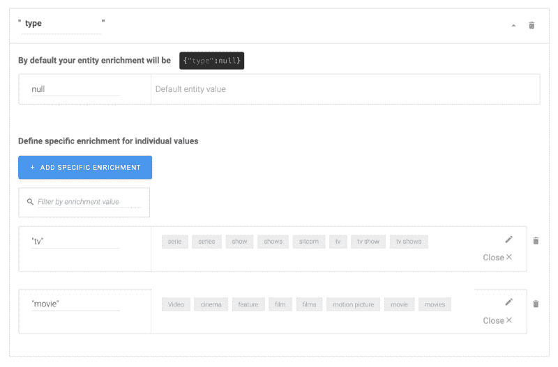

Custom enrichments for type

发回我们的句子“我想看一部动画电影”我们现在也有了丰富的录音:

```
"recording": [      {        "value": "movie",        "raw": "movie",        "confidence": 0.99,        "type": "movie"      }    ]
```

### **第二步:构建你的机器人流程**

因为我们只需要确保在调用一个节点之前满足所有的条件。JS API，构建部分会相当简单。

我们只需要一项技能，姑且称之为`discover`。

*你可以在这里找到一个配置技能[的例子。](https://cai.tools.sap/pe/movie-bot-skills-training/skills/discover)*

#### 扳机

如果意图 *@discover* 存在，我们想要触发此技能:

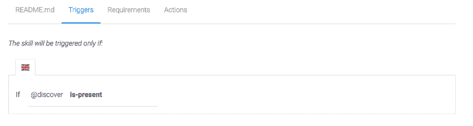

Message triggers

该选项卡帮助您在进入*动作*之前收集数据。我们希望确保用户在继续之前指定了录音、流派、语言以及是或否的意图:

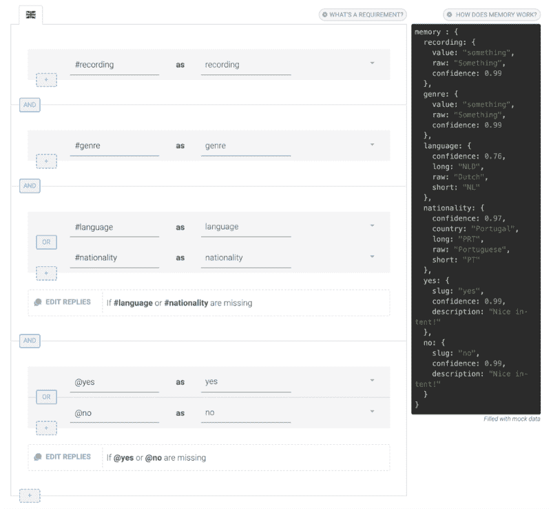

Requirements

需求将被逐一检查。它们都可以在第一条消息上实现。例如，如果用户说*我想看英文版的犯罪电影*，那么*动作*就会被立即触发。

对于每个需求，您可以选择发送一条消息，如果它是完整的，或者如果它是缺失的。

当一个需求完成时发送消息可以让你的 bot 更生动:*一部犯罪电影？我也爱他们！*，但是当需求缺失时几乎是强制性的:你需要要求你的用户填写你需要知道的内容。

例如，如果缺少#流派，我会发送带有建议流派的快速回复:

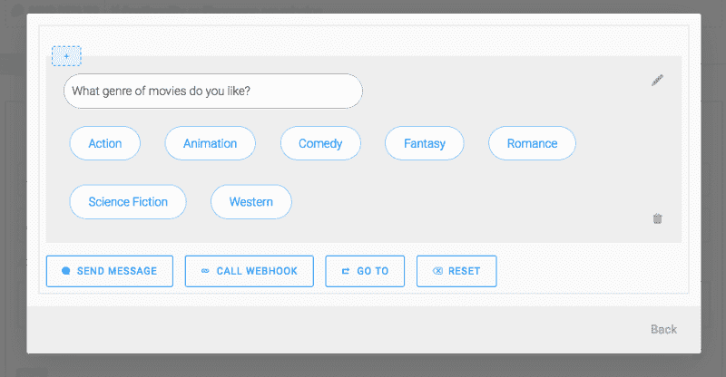

Conditional message if a requirement is missing

对于确认，我们使用内存来显示动态消息，以验证用户使用@yes 和@no intent 的选择:

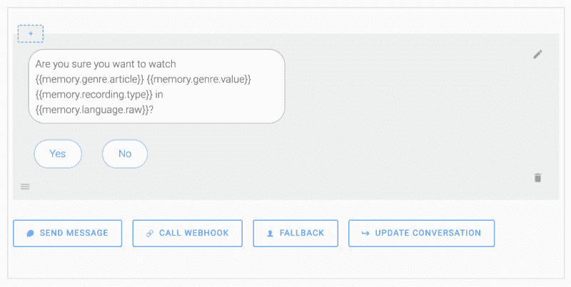

Using the memory for dynamic message

为 4 组实体设置好问题后，转到`Actions`选项卡。

#### 行动

一旦需求得到满足，如果用户同意，我们希望调用我们的 API 来实际执行搜索。否则我们重置内存并再次询问用户想看什么。

如果`_memory.no`存在——重置整个内存，并发送一条信息，如“我们重新开始，你想看什么？”

如果`_memory.yes`存在，创建一个`CALL WEHBOOK`动作。您可以键入完整的 URL(例如:`https://mydomainname.com/discover-movies`)，也可以键入相对 URL ( `/discover-movies`)。当你输入一个相对 URL 时，SAP 对话式人工智能将在你的机器人设置中使用参数`Bot base URL`。

接下来，添加一个动作`UPDATE CONVERSATION > EDIT MEMORY > RESET ALL` 内存，以便在调用完成后清空内存。

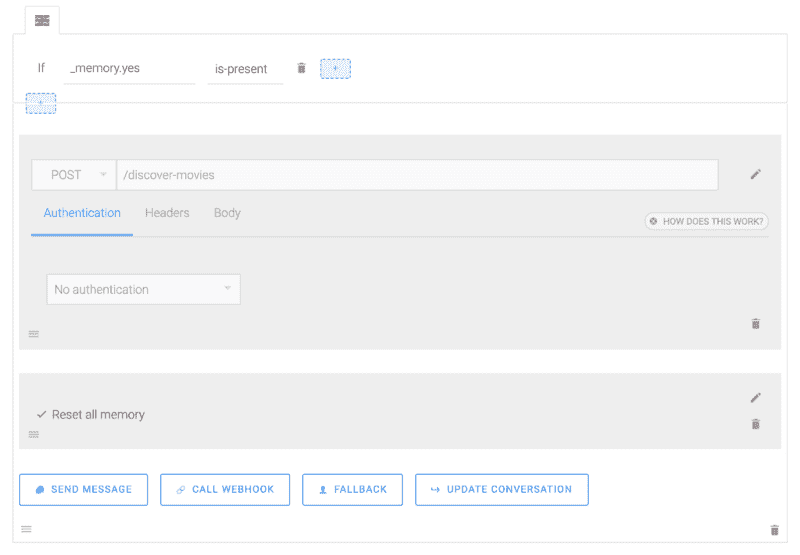

Actions

如果你没有公共服务器，或者你想在开发过程中测试你的机器人，ngrok 是一个非常方便的工具。它会为您创建一个公共 URL，并将请求转发到您的计算机。

安装完成后，运行

```
ngrok http 5000
```

并将**HTTPS**(https://XXX . ngrok . io)中的`Forwarding` URL 复制到你的 bot 设置(“Bot webhook base URL”字段)。对这些 URL 的所有请求将被转发到您计算机的端口 5000。

你的机器人现在需要的是它的 API 来获取你的电影！

### 步骤 3:创建电影机器人 API

这个机器人的 NodeJS 部分相当简单:它将充当 SAP 对话式 AI 和电影数据库之间的 HTTP 代理。

当您的应用程序收到来自 SAP conversatile AI 的请求时，它会向电影数据库发送一个包含您的用户标准的搜索查询，并将 JSON 答案格式化为 SAP conversatile AI 消息格式。


Bot API diagram

#### 选项 1:自动方式

您可以直接从我们的 Git 库克隆整个项目:[https://github.com/plieb/movie-bot-skills-training](https://github.com/plieb/movie-bot-skills-training)

#### 选项 2:手动方式

**步骤 1——搭建你的项目**

```
mkdir movie-bot && cd movie-botnpm initnpm install --save express body-parser axiostouch index.js config.jsmkdir discover-movies && cd discover-moviestouch index.js movieApi.jscd..
```

**步骤 2—获取 TMDb API 令牌**

您将需要一个令牌来使用电影数据库 API，[在这里生成一个](https://developers.themoviedb.org/3)，并编辑您的`config.js`文件:

```
module.exports = { MOVIEDB_TOKEN: process.env.MOVIEDB_TOKEN || 'PURYOURTOKENHERE', PORT: process.env.PORT || 5000, };
```

**第三步——用快速应用程序填充 index . js**
 **让我们创建一个快速应用程序来处理来自 SAP conversatile AI 的请求。为了更好地组织我们的项目，如步骤 1 所示，我们有一个包含 bot 代码核心的文件夹`/discover-movies/`(而不是将所有文件放在同一个文件夹中)，我们通过`loadMovieRoute`调用它。**

```
`const express = require('express');const bodyParser = require('body-parser');const config = require('./config');const loadMovieRoute = require('./discover-movies');const app = express();app.use(bodyParser.json());loadMovieRoute(app);app.post('/errors', function(req, res) {  console.log(req.body);  res.sendStatus(200);});const port = config.PORT;app.listen(port, function() {  console.log(`App is listening on port ${port}`);});`
```

****步骤 4 —填写 discover-movies/index.js****

**我们要求 SAP conversatile AI 在用户满足搜索条件时向`/discover-movies`发送一个 POST 请求。**

**我们的控制器的主要目标是从内存中挑选并格式化首选项，然后将它们发送到电影数据库的 API:**

```
`const config = require('../config'); const { discoverMovie } = require('./movieApi'); function loadMovieRoute(app) { app.post('/discover-movies', function(req, res) { console.log('[GET] /discover-movies'); const kind = req.body.conversation.memory['recording'].type; const genre = req.body.conversation.memory['genre'].id; const language = req.body.conversation.memory['language']; const nationality = req.body.conversation.memory['nationality']; const isoCode = language ? language.short.toLowerCase() : nationality.short.toLowerCase(); return discoverMovie(kind, genreId, isoCode) .then(function(carouselle) { res.json({ replies: carouselle, conversation: { } }); }) .catch(function(err) { console.error('movieApi::discoverMovie error: ', err); }); }); } module.exports = loadMovieRoute;`
```

****第 5 步——填写 discover-movie/movie API . js****

**既然我们已经提取并格式化了请求的所有过滤器，我们需要将请求发送到电影数据库并格式化答案:**

```
`const axios = require('axios');const config = require('../config');function discoverMovie(kind, genreId, language) {  return moviedbApiCall(kind, genreId, language).then(response =>    apiResultToCarousselle(response.data.results)  );}function moviedbApiCall(kind, genreId, language) {  return axios.get(`https://api.themoviedb.org/3/discover/${kind}`, {    params: {      api_key: config.MOVIEDB_TOKEN,      sort_by: 'popularity.desc',      include_adult: false,      with_genres: genreId,      with_original_language: language,    },  });}function apiResultToCarousselle(results) {  if (results.length === 0) {    return [      {        type: 'quickReplies',        content: {          title: 'Sorry, but I could not find any results for your request :(',          buttons: [{ title: 'Start over', value: 'Start over' }],        },      },    ];  }  const cards = results.slice(0, 10).map(e => ({    title: e.title || e.name,    subtitle: e.overview,    imageUrl: `https://image.tmdb.org/t/p/w600_and_h900_bestv2${e.poster_path}`,    buttons: [      {        type: 'web_url',        value: `https://www.themoviedb.org/movie/${e.id}`,        title: 'View More',      },    ],  }));  return [    {      type: 'text',      content: "Here's what I found for you!",    },    { type: 'carousel', content: cards },  ];}module.exports = {  discoverMovie,};`
```

****步骤 6——启动发动机！****

**仅此而已！你可以测试你的机器人了。**

**通过运行`node index.js`启动您的应用程序**

**一切正常，您应该看到:`App started on port 5000`**

**电影推荐、天气、健康、交通……有了第三方 API，一切皆有可能！既然您已经熟悉了工作流程，我们迫不及待地想听听您对您正在构建的内容的看法！记住，如果你需要帮助，非常欢迎你通过下面的评论区或通过 [Slack](https://slack.cai.tools.sap/) 联系我们。**

***最初发表于 [SAP 对话式人工智能博客](https://cai.tools.sap/blog/nodejs-chatbot-movie-bot/)。***