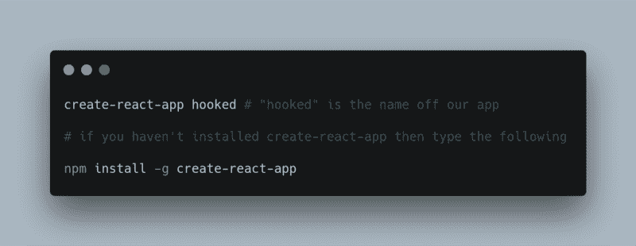
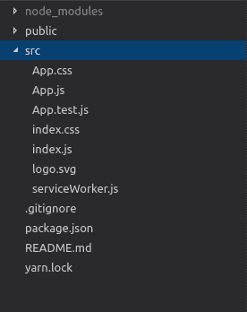

# 如何使用 React Hooks 构建电影搜索应用

> 原文：<https://www.freecodecamp.org/news/how-to-build-a-movie-search-app-using-react-hooks-24eb72ddfaf7/>

React hooks 终于是[这里](https://reactjs.org/blog/2019/02/06/react-v16.8.0.html)！！！我知道，对于这一套新的 API 所带来的可能性，大家都非常兴奋。如果你仍然对此持怀疑态度，那么我强烈建议你去看看这个媒体[的文章](https://medium.com/@dan_abramov/making-sense-of-react-hooks-fdbde8803889)，以便了解这个团队在提出钩子时试图解决的问题。

我最初并不像社区的其他人那样兴奋，所以我决定等到它正式发布，以防 API 有任何变化。所以，在它发布后的周末，我决定阅读它，令人惊讶的是(不是)有很多关于钩子和如何开始使用它们的文章和帖子。

我知道有些人可能会说“另一篇 hooks 文章，真的吗？”，对他们，我说“是的…是的，还有更多来自那里”。对于本文，我们将使用钩子构建一个非常简单的应用程序。本质上，我们不会在这个应用程序中使用任何类组件。我将解释一些 API 是如何工作的，以及它们应该如何在我们可能构建的任何应用程序中使用。

下面是我们完成后该应用程序的外观图像:


I know, the name is really creative…

基本上，该应用程序将能够通过 [OMDB API](http://www.omdbapi.com/) 搜索电影，并将结果呈现给用户。构建这个应用程序的原因只是为了让我们能够更好地理解在应用程序中使用钩子，这有助于理解我们将使用的一些钩子在您自己的真实应用程序中所起的作用。在我们开始构建应用程序之前，需要做一些事情:

*   节点(≥ 6)
*   一个很酷的文本编辑器
*   一个来自 OMDB 的 API 密匙(你可以在这里获得或者用我的)

太好了，一旦我们有了这些，下一步就是设置 React 应用程序。在本教程中，我们将使用 **create-react-app —** 这是一个非常棒的工具，可以设置 react 应用程序，而不必从头开始处理所有的配置。您可以通过键入以下内容来创建新的应用程序:



如果您喜欢复制和粘贴，那么:

```
create-react-app hooked # "hooked" is the name off our app

# if you haven't installed create-react-app then type the following

npm install -g create-react-app
```

完成后，我们应该有一个名为“Hooked”的文件夹，其目录结构如下所示:



INITIAL PROJECT STRUCTURE

我们将在此应用程序中使用 4 个组件，因此让我们概述每个组件及其功能:

*   app . js——它将是其他 3 个组件的父组件。它还将包含处理 API 请求的函数，并且它将有一个在组件的初始呈现期间调用 API 的函数。
*   Header.js —一个简单的组件，它呈现应用程序标题并接受标题属性
*   movie . js——它渲染每部电影。电影对象只是作为道具传递给它。
*   Search.js —包含一个带有输入元素和搜索按钮的表单，包含处理输入元素和重置字段的函数，还包含一个调用作为 props 传递给它的搜索函数的函数。

让我们开始在`src`目录中创建一个新文件夹，并将其命名为`components`,因为所有组件都将放在那里。然后我们将把`App.js`文件移到那个文件夹中。然后，我们将创建`Header`组件。创建一个名为`Header.js`的文件，并在其中添加以下代码:

```
import React from "react";

const Header = (props) => {
  return (
    <header className="App-header">
      <h2>{props.text}</h2>
    </header>
  );
};

export default Header;
```

这个组件不需要太多的解释——它基本上是一个用`text`属性呈现`header`标签的功能组件。

别忘了更新我们的`index.js`文件中的导入:

```
import React from 'react';
import ReactDOM from 'react-dom';
import './index.css';
import App from './components/App'; // this changed
import * as serviceWorker from './serviceWorker';

ReactDOM.render(<App />, document.getElementById('root'));

// If you want your app to work offline and load faster, you can change
// unregister() to register() below. Note this comes with some pitfalls.
// Learn more about service workers: http://bit.ly/CRA-PWA

serviceWorker.unregister();
```

并且用这些样式更新我们的`App.css`(非强制):

```
.App {
  text-align: center;
}

.App-header {
  background-color: #282c34;
  height: 70px;
  display: flex;
  flex-direction: column;
  align-items: center;
  justify-content: center;
  font-size: calc(10px + 2vmin);
  color: white;
  padding: 20px;
  cursor: pointer;
}

.spinner {
  height: 80px;
  margin: auto;
}

.App-intro {
  font-size: large;
}

/* new css for movie component */

* {
  box-sizing: border-box;
}

.movies {
  display: flex;
  flex-wrap: wrap;
  flex-direction: row;
}

.App-header h2 {
  margin: 0;
}

.add-movies {
  text-align: center;
}

.add-movies button {
  font-size: 16px;
  padding: 8px;
  margin: 0 10px 30px 10px;
}

.movie {
  padding: 5px 25px 10px 25px;
  max-width: 25%;
}

.errorMessage {
  margin: auto;
  font-weight: bold;
  color: rgb(161, 15, 15);
}

.search {
  display: flex;
  flex-direction: row;
  flex-wrap: wrap;
  justify-content: center;
  margin-top: 10px;
}

input[type="submit"] {
  padding: 5px;
  background-color: transparent;
  color: black;
  border: 1px solid black;
  width: 80px;
  margin-left: 5px;
  cursor: pointer;
}

input[type="submit"]:hover {
  background-color: #282c34;
  color: antiquewhite;
}

.search > input[type="text"]{
  width: 40%;
  min-width: 170px;
}

@media screen and (min-width: 694px) and (max-width: 915px) {
  .movie {
    max-width: 33%;
  }
}

@media screen and (min-width: 652px) and (max-width: 693px) {
  .movie {
    max-width: 50%;
  }
}

@media screen and (max-width: 651px) {
  .movie {
    max-width: 100%;
    margin: auto;
  }
}
```

一旦我们有了这些，下一件事就是创建`Movie`组件。为此，我们将创建一个名为`Movie.js`的文件，并添加以下代码:

```
import React from "react";

const DEFAULT_PLACEHOLDER_IMAGE =
  "https://m.media-amazon.com/images/M/MV5BMTczNTI2ODUwOF5BMl5BanBnXkFtZTcwMTU0NTIzMw@@._V1_SX300.jpg";

const Movie = ({ movie }) => {
  const poster =
    movie.Poster === "N/A" ? DEFAULT_PLACEHOLDER_IMAGE : movie.Poster;
  return (
    <div className="movie">
      <h2>{movie.Title}</h2>
      <div>
        
      </div>
      <p>({movie.Year})</p>
    </div>
  );
};

export default Movie;
```

这需要更多的解释，但它也只是一个呈现电影标题、图像和年份的表示性组件(它没有任何内部状态)。`DEFAULT_PLACEHOLDER_IMAGE`的原因是因为从 API 中检索到的一些电影没有图像，所以我们将呈现一个占位符图像，而不是一个断开的链接。

现在我们将创建`Search`组件。这一部分令人兴奋，因为在过去，为了处理内部状态，我们必须创建一个类组件…但现在不是了！因为通过钩子，我们可以让一个功能组件处理它自己的内部状态。让我们创建一个名为`Search.js`的文件，在该文件中，我们将添加以下代码:

```
import React, { useState } from "react";

const Search = (props) => {
  const [searchValue, setSearchValue] = useState("");

  const handleSearchInputChanges = (e) => {
    setSearchValue(e.target.value);
  }

  const resetInputField = () => {
    setSearchValue("")
  }

  const callSearchFunction = (e) => {
    e.preventDefault();
    props.search(searchValue);
    resetInputField();
  }

  return (
      <form className="search">
        <input
          value={searchValue}
          onChange={handleSearchInputChanges}
          type="text"
        />
        <input onClick={callSearchFunction} type="submit" value="SEARCH" />
      </form>
    );
}

export default Search;
```

这太令人兴奋了！！！我相信你已经看到了我们将要使用的第一个 hooks API，它叫做`useState`。顾名思义，它允许我们向功能组件添加反应状态。`useState`钩子接受一个参数，即初始状态，然后它返回一个包含当前状态的数组(相当于类组件的`this.state`)和一个更新它的函数(相当于`this.setState`)。

在我们的例子中，我们将当前状态作为搜索输入字段的值进行传递。当 onChange 事件被调用时，调用`handleSearchInputChanges`函数，该函数用新值调用状态更新函数。`resetInputField`函数基本上调用了状态更新函数(`setSearchValue`)，用一个空字符串来清除输入字段。查看[这个](https://reactjs.org/docs/hooks-state.html)以了解更多关于`useState` API 的信息。

最后，我们将使用以下代码更新`App.js`文件:

```
import React, { useState, useEffect } from "react";
import "../App.css";
import Header from "./Header";
import Movie from "./Movie";
import Search from "./Search";

const MOVIE_API_URL = "https://www.omdbapi.com/?s=man&apikey=4a3b711b"; // you should replace this with yours

const App = () => {
  const [loading, setLoading] = useState(true);
  const [movies, setMovies] = useState([]);
  const [errorMessage, setErrorMessage] = useState(null);

    useEffect(() => {
    fetch(MOVIE_API_URL)
      .then(response => response.json())
      .then(jsonResponse => {
        setMovies(jsonResponse.Search);
        setLoading(false);
      });
  }, []);

    const search = searchValue => {
    setLoading(true);
    setErrorMessage(null);

    fetch(`https://www.omdbapi.com/?s=${searchValue}&apikey=4a3b711b`)
      .then(response => response.json())
      .then(jsonResponse => {
        if (jsonResponse.Response === "True") {
          setMovies(jsonResponse.Search);
          setLoading(false);
        } else {
          setErrorMessage(jsonResponse.Error);
          setLoading(false);
        }
      });
  	};

    return (
     <div className="App">
      <Header text="HOOKED" />
      <Search search={search} />
      <p className="App-intro">Sharing a few of our favourite movies</p>
      <div className="movies">
        {loading && !errorMessage ? (
         <span>loading...</span>
         ) : errorMessage ? (
          <div className="errorMessage">{errorMessage}</div>
        ) : (
          movies.map((movie, index) => (
            <Movie key={`${index}-${movie.Title}`} movie={movie} />
          ))
        )}
      </div>
    </div>
  );
};

export default App;
```

让我们看一下代码:我们使用了 3 个`useState`函数，所以是的，我们可以在一个组件中有多个`useState`函数。第一个用于处理加载状态(当 loading 设置为 true 时，它呈现一个‘loading…’文本)。第二个用于处理从服务器获得的电影数组。最后，第三个用于处理发出 API 请求时可能出现的任何错误。

在那之后，我们遇到了我们在应用中使用的第二个钩子 API:`useEffect`钩子。这个钩子基本上让你在你的函数组件中执行副作用。所谓副作用，我们指的是数据获取、订阅和手动 DOM 操作。关于这个钩子最好的部分是来自 React 官方文档的引用:

> 如果你熟悉 React 类生命周期方法，你可以把`useEffect`钩子看作是`componentDidMount`、`componentDidUpdate`和`componentWillUnmount`的组合。

这是因为`useEffect`在第一次渲染(`componentDidMount`)和每次更新(`componentDidUpdate`)后都会被调用。

我知道你可能想知道如果它在每次更新后都被调用，这和`componentDidMount`有什么相似之处。这是因为`useEffect`函数接受两个参数，一个是你要运行的函数，另一个是数组。在那个数组中，我们只是传入一个值，告诉 React 如果传入的值没有改变，就跳过应用一个效果。

根据文档，这类似于我们在`componentDidUpdate`中添加一个条件语句:

```
 // for class components
componentDidUpdate(prevProps, prevState) {
  if (prevState.count !== this.state.count) {
    document.title = `You clicked ${this.state.count} times`;
  }
}

// using hooks it will become
useEffect(() => {
  document.title = `You clicked ${count} times`;
}, [count]); // Only re-run the effect if count changes
```

在我们的例子中，我们没有任何改变的值，所以我们可以传入一个空数组来告诉 React 这个效果应该被调用一次。

正如你所看到的，我们有 3 个`useState`函数有些关联，它们应该可以以某种方式组合在一起。谢天谢地，React 团队已经把我们包括在内了，因为他们做了一个钩子来帮助我们——这个钩子叫做`useReducer`。让我们转换我们的`App`组件来使用我们的新钩子，所以我们的`App.js`现在看起来像这样:

```
import React, { useReducer, useEffect } from "react";
import "../App.css";
import Header from "./Header";
import Movie from "./Movie";
import Search from "./Search";

const MOVIE_API_URL = "https://www.omdbapi.com/?s=man&apikey=4a3b711b";

const initialState = {
  loading: true,
  movies: [],
  errorMessage: null
};

const reducer = (state, action) => {
  switch (action.type) {
    case "SEARCH_MOVIES_REQUEST":
      return {
        ...state,
        loading: true,
        errorMessage: null
      };
    case "SEARCH_MOVIES_SUCCESS":
      return {
        ...state,
        loading: false,
        movies: action.payload
      };
    case "SEARCH_MOVIES_FAILURE":
      return {
        ...state,
        loading: false,
        errorMessage: action.error
      };
    default:
      return state;
  }
};

const App = () => {
  const [state, dispatch] = useReducer(reducer, initialState);

    useEffect(() => {

        fetch(MOVIE_API_URL)
            .then(response => response.json())
            .then(jsonResponse => {

            dispatch({
                type: "SEARCH_MOVIES_SUCCESS",
                payload: jsonResponse.Search
        	});
      	});
  	}, []);

    const search = searchValue => {
    	dispatch({
      	type: "SEARCH_MOVIES_REQUEST"
    	});

        fetch(`https://www.omdbapi.com/?s=${searchValue}&apikey=4a3b711b`)
      	.then(response => response.json())
      	.then(jsonResponse => {
        	if (jsonResponse.Response === "True") {
          	dispatch({
                type: "SEARCH_MOVIES_SUCCESS",
                payload: jsonResponse.Search
          	});
        	} else {
          	dispatch({
                type: "SEARCH_MOVIES_FAILURE",
                error: jsonResponse.Error
          	});
          }
      	});
	  };

    const { movies, errorMessage, loading } = state;

    return (
    <div className="App">
      <Header text="HOOKED" />
      <Search search={search} />
      <p className="App-intro">Sharing a few of our favourite movies</p>
      <div className="movies">
        {loading && !errorMessage ? (
          <span>loading... </span>
        ) : errorMessage ? (
          <div className="errorMessage">{errorMessage}</div>
        ) : (
          movies.map((movie, index) => (
            <Movie key={`${index}-${movie.Title}`} movie={movie} />
          ))
        )}
      </div>
    </div>
  );
};

export default App;
```

因此，如果一切顺利，那么我们应该看不到应用程序的行为有任何变化。现在让我们来看看挂钩是如何工作的。

钩子有 3 个参数，但是对于我们的用例，我们将只使用 2 个。一个典型的`useReducer`钩子应该是这样的:

```
const [state, dispatch] = useReducer(
    reducer,
    initialState
);
```

`reducer`参数类似于我们在 Redux 中使用的参数，如下所示:

```
const reducer = (state, action) => {
  switch (action.type) {
    case "SEARCH_MOVIES_REQUEST":
      return {
        ...state,
        loading: true,
        errorMessage: null
      };
    case "SEARCH_MOVIES_SUCCESS":
      return {
        ...state,
        loading: false,
        movies: action.payload
      };
    case "SEARCH_MOVIES_FAILURE":
      return {
        ...state,
        loading: false,
        errorMessage: action.error
      };
    default:
      return state;
  }
};
```

reducer 接受 initialState 和 action，因此基于 action 类型，reducer 返回一个新的 State 对象。例如，如果分派的动作类型是`SEARCH_MOVIES_REQUEST`，那么状态会用新对象更新，其中`loading`的值为真，而`errorMessage`为空。

另一件要注意的事情是，在我们的`useEffect`中，我们现在调度一个动作，其有效负载是我们从服务器获取的电影数组。同样，在我们的`search`函数中，我们实际上分派了三个不同的动作。

*   一个动作是更新我们的状态对象的`SEARCH_MOVIES_REQUEST`动作，使`loading=true and errorMessage = null`。
*   如果请求成功，那么我们调度另一个类型为`SEARCH_MOVIES_SUCCESS` 的动作，更新我们的状态对象 making `loading=false and movies = action.payload`，其中有效负载是从 OMDB 获得的电影数组。
*   如果有一个错误，我们将改为调度一个不同的类型为`SEARCH_MOVIES_FAILURE`的动作，该动作更新我们的状态对象 making `loading=false and errorMessage = action.error`，其中`action.error`是从服务器得到的错误消息。

要了解更多关于`useReducer`钩子的信息，你可以查看官方[文档](https://reactjs.org/docs/hooks-reference.html#usereducer)。

#### 包扎

哇！！！我们已经走了很长一段路，我相信你和我一样对钩子的可能性感到兴奋。对我个人来说，向初学者介绍 React 要容易得多，因为我不需要解释类如何工作或者`this`如何工作，或者`bind`如何在 JS 中工作，这在我看来很棒。

在本教程中，我们只接触了一些钩子，我们甚至没有涉及到创建我们自己的定制钩子的特性。如果你有一些关于钩子的其他用例，或者你已经实现了你自己的定制钩子，请留下你的评论，加入到兴奋的行列中来。

注意:这篇文章与前一篇关于 [Webpack](https://medium.freecodecamp.org/how-to-build-modern-applications-with-webpack-c81ccf6dd54f) 的文章无关，后一篇文章已经在撰写中？。

这是本文 GitHub repo 的[链接](https://github.com/samie820/hooks-movie-app)。