# 如何用 Phaser 3、Express 和 Socket 构建多人卡牌游戏？超正析象管(Image Orthicon)

> 原文：<https://www.freecodecamp.org/news/how-to-build-a-multiplayer-card-game-with-phaser-3-express-and-socket-io/>

我是一名桌面游戏开发者，我一直在寻找数字化游戏体验的方法。在本教程中，我们将使用 [Phaser 3](http://phaser.io/) 、 [Express](https://expressjs.com/) 和 [Socket 构建一个多人卡牌游戏。IO](https://socket.io/) 。

就先决条件而言，您需要确保在您的机器上安装并配置了[节点](https://nodejs.org/en/) / [NPM](https://www.npmjs.com/) 和 [Git](https://github.com/) 。一些 JavaScript 的经验会有所帮助，你可能想在学习这个之前浏览一下基础 Phaser 教程。

感谢 Scott Westover 关于这个主题的教程，Kal_Torak 和 Phaser 社区回答了我所有的问题，我的好朋友 Mike 帮助我构思了这个项目的架构。

注意:我们将使用我的桌面卡牌游戏*[Entromancy:Hacker Battles](https://www.nightpathpub.com/hacker-battles)*中的资源和颜色。如果你愿意，你可以使用自己的图像(甚至是[移相器矩形](http://phaser.io/examples/v3/view/game-objects/shapes/rectangle))和颜色，并且你可以在 [GitHub](https://github.com/sominator/multiplayer-card-project) 上访问整个项目代码。

如果您喜欢更直观的教程，您也可以跟随本文的配套视频:

[https://www.youtube.com/embed/fEwAgKBgoJM?feature=oembed](https://www.youtube.com/embed/fEwAgKBgoJM?feature=oembed)

我们开始吧！

## 游戏

我们简单的纸牌游戏将会有一个 Phaser 客户端，它将处理大部分游戏逻辑，并执行诸如发牌、提供拖放功能等操作。

在后端，我们将构建一个使用 Socket 的 Express 服务器。IO 在客户端之间进行通信，这样当一个玩家打出一张牌时，它就会出现在另一个玩家的客户端中，反之亦然。

我们这个项目的目标是为一个多人卡牌游戏创建一个基本框架，你可以在此基础上构建并调整以适应你自己的游戏逻辑。

首先，让我们解决客户！

## 客户

为了支持我们的客户，我们将在 [GitHub](https://github.com/photonstorm/phaser3-project-template) 上克隆半官方的 Phaser 3 Webpack 项目模板。

打开您喜欢的命令行界面并创建一个新文件夹:

```
mkdir multiplayer-card-project
cd multiplayer-card-project
```

克隆 git 项目:

```
git clone https://github.com/photonstorm/phaser3-project-template.git
```

这个命令会将模板下载到/multiplayer-card-project 中名为“phase 3-project-template”的文件夹中。如果您想遵循我们教程的文件结构，继续将模板文件夹的名称改为“client”

导航到新目录并安装所有依赖项:

```
cd client
npm install
```

您的项目文件夹结构应该如下所示:

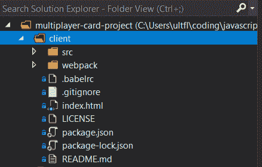

在我们处理文件之前，让我们回到 CLI，在/client 文件夹中输入以下命令:

```
npm start
```

我们的 Phaser 模板利用 Webpack 来启动一个本地服务器，该服务器又在我们的浏览器中提供一个简单的游戏应用程序(通常位于 http://localhost:8080)。整洁！

让我们在您最喜欢的代码编辑器中打开我们的项目，并做一些修改以适应我们的纸牌游戏。删除/client/src/assets 中的所有内容，用来自 [GitHub](https://github.com/sominator/multiplayer-card-project/tree/master/client/src/assets) 的卡片图片替换它们。

在/client/src 目录中，添加一个名为“scenes”的文件夹和一个名为“helpers”的文件夹

在/client/src/scenes 中，添加一个名为“game.js”的空文件。

在/client/src/helpers 中，添加三个空文件:“card.js”、“dealer.js”和“zone.js”。

您的项目结构现在应该如下所示:

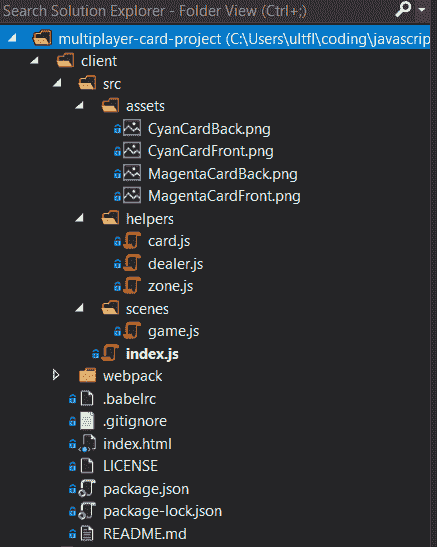

酷！您的客户可能会因为我们删除了一些内容而向您抛出错误，但不要担心。打开/src/index.js，这是我们前端应用程序的主要入口。输入以下代码:

```
import Phaser from "phaser";
import Game from "./scenes/game";

const config = {
    type: Phaser.AUTO,
    parent: "phaser-example",
    width: 1280,
    height: 780,
    scene: [
        Game
    ]
};

const game = new Phaser.Game(config);
```

我们在这里所做的只是重组样板文件，利用 Phaser 的“场景”系统，这样我们就可以将我们的游戏场景分开，而不是试图将所有东西都塞进一个文件中。如果你正在创建多个游戏世界，构建指令屏幕之类的东西，或者通常试图保持事物整洁，场景会很有用。

让我们转到/src/scenes/game.js 并编写一些代码:

```
export default class Game extends Phaser.Scene {
    constructor() {
        super({
            key: 'Game'
        });
    }

    preload() {
        this.load.image('cyanCardFront', 'src/assets/CyanCardFront.png');
        this.load.image('cyanCardBack', 'src/assets/CyanCardBack.png');
        this.load.image('magentaCardFront', 'src/assets/MagentaCardFront.png');
        this.load.image('magentaCardBack', 'src/assets/MagentaCardBack.png');
    }

    create() {
        this.dealText = this.add.text(75, 350, ['DEAL CARDS']).setFontSize(18).setFontFamily('Trebuchet MS').setColor('#00ffff').setInteractive();
    }

    update() {

    }
}
```

我们正在利用 [ES6 类](https://www.freecodecamp.org/news/how-to-use-github-and-es6-features-to-create-and-structure-your-code/)来创建一个新的游戏场景，它包含了 preload()、create()和 update()函数。

preload()用于...良好的...预装我们将在游戏中使用的任何资源。

create()在游戏启动时运行，我们将在这里建立大部分用户界面和游戏逻辑。

update()每帧调用一次，在我们的教程中不会用到它(但在你自己的游戏中可能会有用，这取决于它的要求)。

在 create()函数中，我们创建了一小段文本，表示“发牌”，并将其设置为交互式的:


非常酷。让我们创建一点占位符代码，以了解一旦启动并运行，我们希望整个系统如何工作。将以下内容添加到 create()函数中:

```
 let self = this;

		this.card = this.add.image(300, 300, 'cyanCardFront').setScale(0.3, 0.3).setInteractive();
        this.input.setDraggable(this.card);

		this.dealCards = () => {

        }

		this.dealText.on('pointerdown', function () {
            self.dealCards();
        })

        this.dealText.on('pointerover', function () {
            self.dealText.setColor('#ff69b4');
        })

        this.dealText.on('pointerout', function () {
            self.dealText.setColor('#00ffff');
        })

        this.input.on('drag', function (pointer, gameObject, dragX, dragY) {
            gameObject.x = dragX;
            gameObject.y = dragY;
        })
```

我们增加了很多结构，但没什么变化。现在，当我们的鼠标悬停在“发牌”文本上时，它会以赛博朋克热粉色突出显示，并且屏幕上会出现一张随机的牌:

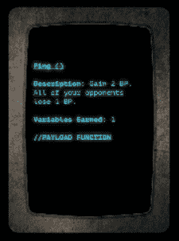

我们将图像放置在(300，300)的(x，y)坐标上，将其比例设置得小一点，并使其具有交互性和可拖动性。我们还添加了一点逻辑来确定拖动时应该发生什么:它应该遵循鼠标的(x，y)坐标。

我们还创建了一个空的 dealCards()函数，当我们单击“DEAL CARDS”文本时将调用该函数。此外，我们将“this”保存到一个名为“self”的变量中，这样我们就可以在函数中使用它，而不用担心范围问题。

如果我们不开始移动东西，我们的游戏场景会变得很快很乱，所以让我们删除以“this.card”开头的代码块，并移到/src/helpers/card.js 来编写:

```
export default class Card {
    constructor(scene) {
        this.render = (x, y, sprite) => {
            let card = scene.add.image(x, y, sprite).setScale(0.3, 0.3).setInteractive();
            scene.input.setDraggable(card);
            return card;
        }
    }
}
```

我们已经创建了一个新的类，它接受一个场景作为参数，并具有一个 render()函数，该函数接受(x，y)坐标和一个 sprite。现在，我们可以从其他地方调用这个函数，并向它传递必要的参数来创建卡片。

让我们在游戏场景的顶部导入卡片:

```
import Card from '../helpers/card';
```

并在我们的空 dealCards()函数中输入以下代码:

```
 this.dealCards = () => {
        	for (let i = 0; i < 5; i++) {
                let playerCard = new Card(this);
                playerCard.render(475 + (i * 100), 650, 'cyanCardFront');
            }
    	}
```

当我们单击“发牌”按钮时，我们现在遍历一个 for 循环，该循环创建牌并在屏幕上顺序呈现它们:

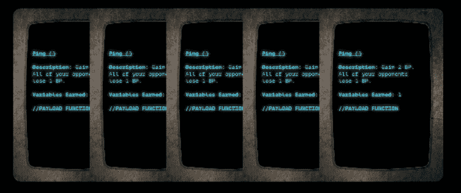

很好。我们可以在屏幕上拖动这些卡片，但是为了支持我们的游戏逻辑，限制它们的放置位置可能会更好。

让我们转到/src/helpers/zone.js 并添加一个新类:

```
export default class Zone {
    constructor(scene) {
        this.renderZone = () => {
            let dropZone = scene.add.zone(700, 375, 900, 250).setRectangleDropZone(900, 250);
            dropZone.setData({ cards: 0 });
            return dropZone;
        };
        this.renderOutline = (dropZone) => {
            let dropZoneOutline = scene.add.graphics();
            dropZoneOutline.lineStyle(4, 0xff69b4);
            dropZoneOutline.strokeRect(dropZone.x - dropZone.input.hitArea.width / 2, dropZone.y - dropZone.input.hitArea.height / 2, dropZone.input.hitArea.width, dropZone.input.hitArea.height)
        }
    }
}
```

Phaser 有内置的 dropzones，允许我们指定游戏对象可以放在哪里，我们已经在这里设置了一个，并为它提供了一个轮廓。我们还向 dropzone 添加了一点数据，称为“cards ”,我们稍后会用到。

让我们将我们的新区域导入到游戏场景中:

```
import Zone from '../helpers/zone';
```

并在 create()函数中调用它:

```
 this.zone = new Zone(this);
        this.dropZone = this.zone.renderZone();
        this.outline = this.zone.renderOutline(this.dropZone);
```

不算太寒酸！

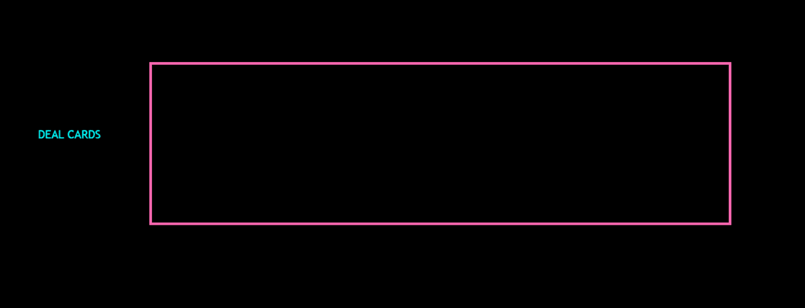

我们需要增加一点逻辑来决定如何将牌放入区域。让我们在“this.input.on('drag ')”函数下面这样做:

```
 this.input.on('dragstart', function (pointer, gameObject) {
            gameObject.setTint(0xff69b4);
            self.children.bringToTop(gameObject);
        })

        this.input.on('dragend', function (pointer, gameObject, dropped) {
            gameObject.setTint();
            if (!dropped) {
                gameObject.x = gameObject.input.dragStartX;
                gameObject.y = gameObject.input.dragStartY;
            }
        })

        this.input.on('drop', function (pointer, gameObject, dropZone) {
            dropZone.data.values.cards++;
            gameObject.x = (dropZone.x - 350) + (dropZone.data.values.cards * 50);
            gameObject.y = dropZone.y;
            gameObject.disableInteractive();
        })
```

从代码的底部开始，当一张卡片被放下时，我们增加 dropzone 上的“cards”数据值，并根据卡片上已经有多少张卡片，将卡片的(x，y)坐标分配给 dropzone。我们还会在卡片掉落后禁用它们的交互性，这样它们就无法收回:

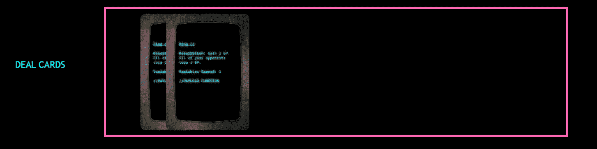

我们还做了这样的设计，当我们的卡片被拖动时会有不同的颜色，如果它们没有被放到拖放区，它们会回到它们的起始位置。

尽管我们的客户端还不太完整，但在实现后端之前，我们已经尽了最大努力。我们现在可以发牌，在屏幕上拖动它们，然后放到拖放区。但是要向前发展，我们需要建立一个服务器来协调我们的多人游戏功能。

## 服务器

让我们在根目录(在/client 上方)打开一个新的命令行，并键入:

```
npm init
npm install --save express socket.io nodemon
```

我们已经初始化了一个新的 package.json 并安装了 Express，Socket。IO 和 [Nodemon](https://nodemon.io/) (它将监视我们的服务器并在发生变化时重启它)。

在我们的代码编辑器中，让我们将 package.json 的“脚本”部分改为:

```
 "scripts": {
    "start": "nodemon server.js"
  },
```

非常好。我们已经准备好组装我们的服务器了！在我们的根目录中创建一个名为“server.js”的空文件，并输入以下代码:

```
const server = require('express')();
const http = require('http').createServer(server);
const io = require('socket.io')(http);

io.on('connection', function (socket) {
    console.log('A user connected: ' + socket.id);

    socket.on('disconnect', function () {
        console.log('A user disconnected: ' + socket.id);
    });
});

http.listen(3000, function () {
    console.log('Server started!');
});
```

我们正在进口 Express 和 Socket。IO，请求服务器监听端口 3000。当客户端连接到该端口或从该端口断开时，我们将使用客户端的套接字 id 将事件记录到控制台。

打开新的命令行界面并启动服务器:

```
npm run start
```

我们的服务器现在应该运行在 localhost:3000 上，Nodemon 将监视我们的后端文件的任何变化。除了控制台日志显示“服务器启动了！”

在我们的另一个开放命令行界面中，让我们导航回我们的/client 目录并安装 Socket 的客户端版本。IO:

```
cd client
npm install --save socket.io-client
```

我们现在可以在游戏场景中导入它:

```
import io from 'socket.io-client';
```

太好了！我们刚刚把前端和后端连接起来。我们需要做的就是在 create()函数中编写一些代码:

```
 this.socket = io('http://localhost:3000');

        this.socket.on('connect', function () {
        	console.log('Connected!');
        }); 
```

我们正在初始化一个新的“socket”变量，它指向我们的本地端口 3000，并在连接时登录到浏览器控制台。

在 http://localhost:8080(我们的 Phaser 客户端在这里运行)打开和关闭几个浏览器，您应该会在命令行界面中看到以下内容:

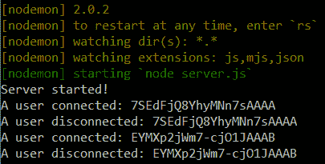

耶。让我们开始向我们的 server.js 文件添加逻辑，以满足我们的纸牌游戏的需要。用以下代码替换现有代码:

```
const server = require('express')();
const http = require('http').createServer(server);
const io = require('socket.io')(http);
let players = [];

io.on('connection', function (socket) {
    console.log('A user connected: ' + socket.id);

    players.push(socket.id);

    if (players.length === 1) {
        io.emit('isPlayerA');
    };

    socket.on('dealCards', function () {
        io.emit('dealCards');
    });

    socket.on('cardPlayed', function (gameObject, isPlayerA) {
        io.emit('cardPlayed', gameObject, isPlayerA);
    });

    socket.on('disconnect', function () {
        console.log('A user disconnected: ' + socket.id);
        players = players.filter(player => player !== socket.id);
    });
});

http.listen(3000, function () {
    console.log('Server started!');
});
```

我们已经初始化了一个名为“players”的空数组，并在每次客户端连接到服务器时添加一个套接字 id，同时在连接断开时删除套接字 id。

如果一个客户端是第一个连接到服务器的，我们要求套接字。IO to " [发出](https://socket.io/get-started/chat/#Emitting-events)一个事件，表明他们将成为玩家 a。随后，当服务器收到一个名为" dealCards "或" cardPlayed "的事件时，它应该向客户端发回相应的更新。

信不信由你，这就是我们让服务器工作所需的全部代码！让我们把注意力转回到游戏场景。在 create()函数的顶部，键入以下内容:

```
 this.isPlayerA = false;
        this.opponentCards = [];
```

在以“this.socket.on(connect)”开头的代码块下，编写:

```
 this.socket.on('isPlayerA', function () {
        	self.isPlayerA = true;
        })
```

现在，如果我们的客户端第一个连接到服务器，服务器将发出一个事件，告诉客户端它将成为玩家 a。客户端套接字接收该事件，并将我们的“isPlayerA”布尔值从 false 变为 true。

注意:从现在开始，您可能需要重新加载您的浏览器页面(设置为 http://localhost:8080)，而不是让 Webpack 自动为您重新加载，以便客户端正确地断开和重新连接到服务器。

我们需要重新配置我们的 dealCards()逻辑，以支持我们游戏的多人模式，因为我们希望客户发给我们一组可能与对手不同的牌。此外，我们希望在屏幕上呈现对手牌的背面，反之亦然。

我们将转移到空的/src/helpers/dealer.js 文件，导入 card.js，并创建一个新类:

```
import Card from './card';

export default class Dealer {
    constructor(scene) {
        this.dealCards = () => {
            let playerSprite;
            let opponentSprite;
            if (scene.isPlayerA) {
                playerSprite = 'cyanCardFront';
                opponentSprite = 'magentaCardBack';
            } else {
                playerSprite = 'magentaCardFront';
                opponentSprite = 'cyanCardBack';
            };
            for (let i = 0; i < 5; i++) {
                let playerCard = new Card(scene);
                playerCard.render(475 + (i * 100), 650, playerSprite);

                let opponentCard = new Card(scene);
                scene.opponentCards.push(opponentCard.render(475 + (i * 100), 125, opponentSprite).disableInteractive());
            }
        }
    }
}
```

有了这个新类，我们将检查客户端是否是玩家 A，并决定在这两种情况下应该使用什么精灵。

然后，我们向我们的客户发牌，同时在屏幕顶部呈现对手牌的背面，并将它们添加到我们在游戏场景中初始化的对手牌数组中。

在/src/scenes/game.js 中，导入庄家:

```
import Dealer from '../helpers/dealer';
```

然后将我们的 dealCards()函数替换为:

```
 this.dealer = new Dealer(this);
```

在以“this.socket.on('isPlayerA ')”开头的代码块下，添加以下内容:

```
 this.socket.on('dealCards', function () {
            self.dealer.dealCards();
            self.dealText.disableInteractive();
        })
```

我们还需要更新我们的 dealText 函数，以适应这些变化:

```
 this.dealText.on('pointerdown', function () {
            self.socket.emit("dealCards");
        })
```

唷！我们创建了一个新的发牌员职业，它将处理发给我们的牌，并将对手的牌显示在屏幕上。当客户端套接字从服务器接收到“dealcards”事件时，它将从这个新类中调用 dealCards()函数，并禁用 dealText，这样我们就不能无缘无故地一直生成卡片。

最后，我们更改了 dealText 功能，这样当它被按下时，客户端会向服务器发出一个我们想要发牌的事件，这将所有事情联系在一起。

打开两个指向 http://localhost:8080 的浏览器，在其中一个上点击“发牌”。您应该在任一屏幕上看到不同的精灵:

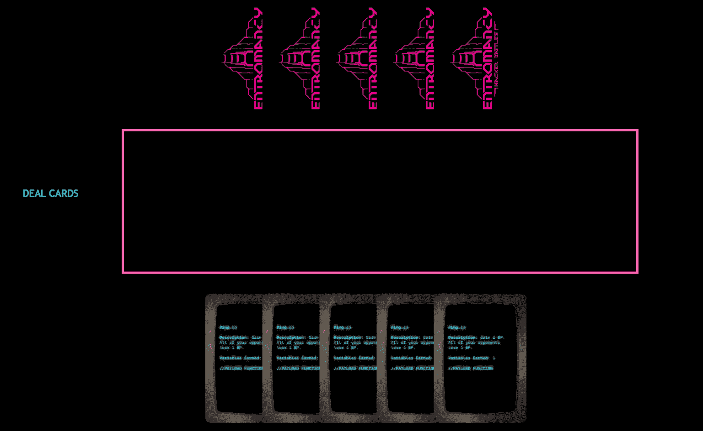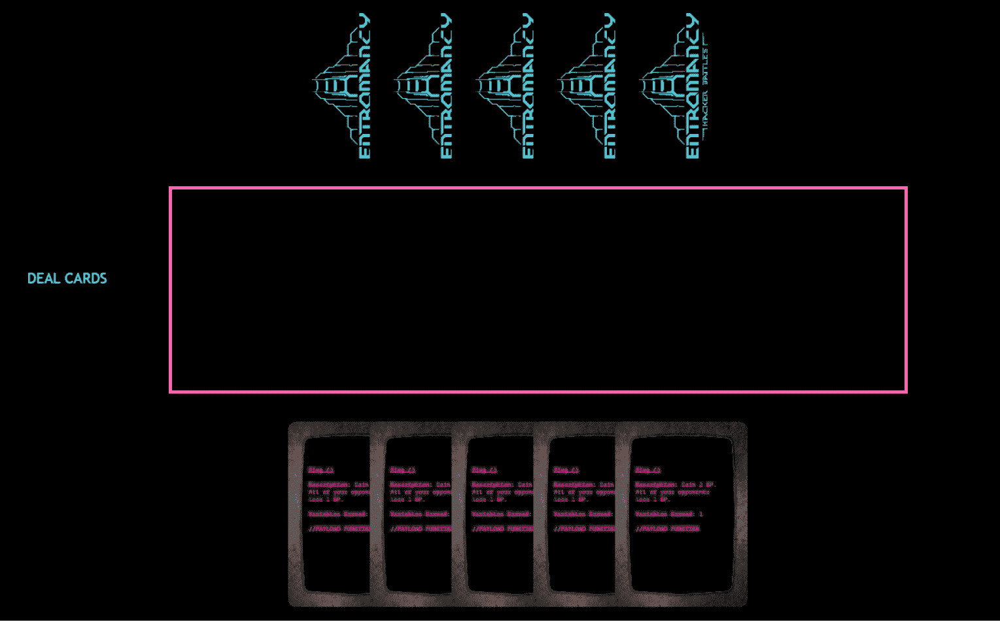

再次注意，如果这一步有问题，您可能需要关闭一个浏览器并重新加载第一个浏览器，以确保两个客户端都与服务器断开连接，这应该记录到您的命令行控制台中。

我们仍然需要弄清楚如何在对手的客户端中呈现掉的牌，反之亦然。我们可以在我们的游戏场景中做到这一切！更新以“this.input.on('drop ')”开头的代码块，在末尾添加一行:

```
 this.input.on('drop', function (pointer, gameObject, dropZone) {
            dropZone.data.values.cards++;
            gameObject.x = (dropZone.x - 350) + (dropZone.data.values.cards * 50);
            gameObject.y = dropZone.y;
            gameObject.disableInteractive();
            self.socket.emit('cardPlayed', gameObject, self.isPlayerA);
        })
```

当一张卡片被放入我们的客户端时，套接字将发出一个名为“cardPlayed”的事件，传递游戏对象的详细信息和客户端的 isPlayerA 布尔值(这可能是真或假，取决于客户端是否是第一个连接到服务器的)。

回想一下，在我们的服务器代码中。IO 简单地接收“cardPlayed”事件，并将相同的事件发送回所有客户端，从发起事件*的客户端传递关于游戏对象和 isPlayerA 的相同信息。*

让我们在“this.socket.on('dealCards ')”代码块下面写下当客户端从服务器接收到“cardPlayed”事件时应该发生什么:

```
 this.socket.on('cardPlayed', function (gameObject, isPlayerA) {
            if (isPlayerA !== self.isPlayerA) {
                let sprite = gameObject.textureKey;
                self.opponentCards.shift().destroy();
                self.dropZone.data.values.cards++;
                let card = new Card(self);
                card.render(((self.dropZone.x - 350) + (self.dropZone.data.values.cards * 50)), (self.dropZone.y), sprite).disableInteractive();
            }
        })
```

代码块首先将从服务器接收的 isPlayerA 布尔值与客户端自己的 isPlayerA 进行比较，这是一项检查，以确定接收事件的客户端是否与生成事件的客户端相同。

让我们想得更深入一点，因为它使用套接字公开了我们的客户机-服务器关系如何工作的一个关键组件。IO 作为连接器。

假设客户端 A 首先连接到服务器，并通过“isPlayerA”事件被告知它应该将其 isPlayerA 布尔值更改为 **true** 。这将决定当用户通过客户端点击“发牌”时会生成什么样的牌。

如果客户端 B 第二次连接到服务器，它永远不会被告知改变它的 isPlayerA 布尔值，它保持**假**。这也将决定它会生成什么样的牌。

当客户端 A 丢弃一张卡时，它向服务器发出一个“cardPlayed”事件，传递关于被丢弃的卡及其 isPlayerA 布尔值的信息，该值为 **true** 。然后，服务器用自己的“cardPlayed”事件将所有信息转发给所有客户端。

客户端 A 从服务器接收该事件，并注意到来自服务器的 isPlayerA 布尔值为 **true** ，这意味着该事件是由客户端 A 自己生成的。没有什么特别的事情发生。

客户端 B 从服务器接收相同的事件，并注意到来自服务器的 isPlayerA 布尔值为**真**，尽管客户端 B 自己的 isPlayerA 为**假**。由于这种差异，它执行代码块的其余部分。

接下来的代码将从服务器接收的游戏对象的“texturekey”(基本上是图像)存储到一个名为“sprite”的变量中。它销毁了呈现在屏幕顶部的一张对手牌的背面，并增加了 dropzone 中的“cards”数据值，以便我们可以继续从左到右放置牌。

然后，代码在 dropzone 中生成一张新卡，该卡使用 sprite 变量创建放在另一个客户端中的同一张卡(如果您有附加到该游戏对象的数据，也可以使用类似的方法将其附加到这里)。

您的最终/src/scenes/game.js 代码应该如下所示:

```
import io from 'socket.io-client';
import Card from '../helpers/card';
import Dealer from "../helpers/dealer";
import Zone from '../helpers/zone';

export default class Game extends Phaser.Scene {
    constructor() {
        super({
            key: 'Game'
        });
    }

    preload() {
        this.load.image('cyanCardFront', 'src/assets/CyanCardFront.png');
        this.load.image('cyanCardBack', 'src/assets/CyanCardBack.png');
        this.load.image('magentaCardFront', 'src/assets/magentaCardFront.png');
        this.load.image('magentaCardBack', 'src/assets/magentaCardBack.png');
    }

    create() {
        this.isPlayerA = false;
        this.opponentCards = [];

        this.zone = new Zone(this);
        this.dropZone = this.zone.renderZone();
        this.outline = this.zone.renderOutline(this.dropZone);

        this.dealer = new Dealer(this);

        let self = this;

        this.socket = io('http://localhost:3000');

        this.socket.on('connect', function () {
            console.log('Connected!');
        });

        this.socket.on('isPlayerA', function () {
            self.isPlayerA = true;
        })

        this.socket.on('dealCards', function () {
            self.dealer.dealCards();
            self.dealText.disableInteractive();
        })

        this.socket.on('cardPlayed', function (gameObject, isPlayerA) {
            if (isPlayerA !== self.isPlayerA) {
                let sprite = gameObject.textureKey;
                self.opponentCards.shift().destroy();
                self.dropZone.data.values.cards++;
                let card = new Card(self);
                card.render(((self.dropZone.x - 350) + (self.dropZone.data.values.cards * 50)), (self.dropZone.y), sprite).disableInteractive();
            }
        })

        this.dealText = this.add.text(75, 350, ['DEAL CARDS']).setFontSize(18).setFontFamily('Trebuchet MS').setColor('#00ffff').setInteractive();

        this.dealText.on('pointerdown', function () {
            self.socket.emit("dealCards");
        })

        this.dealText.on('pointerover', function () {
            self.dealText.setColor('#ff69b4');
        })

        this.dealText.on('pointerout', function () {
            self.dealText.setColor('#00ffff');
        })

        this.input.on('drag', function (pointer, gameObject, dragX, dragY) {
            gameObject.x = dragX;
            gameObject.y = dragY;
        })

        this.input.on('dragstart', function (pointer, gameObject) {
            gameObject.setTint(0xff69b4);
            self.children.bringToTop(gameObject);
        })

        this.input.on('dragend', function (pointer, gameObject, dropped) {
            gameObject.setTint();
            if (!dropped) {
                gameObject.x = gameObject.input.dragStartX;
                gameObject.y = gameObject.input.dragStartY;
            }
        })

        this.input.on('drop', function (pointer, gameObject, dropZone) {
            dropZone.data.values.cards++;
            gameObject.x = (dropZone.x - 350) + (dropZone.data.values.cards * 50);
            gameObject.y = dropZone.y;
            gameObject.disableInteractive();
            self.socket.emit('cardPlayed', gameObject, self.isPlayerA);
        })
    }

    update() {

    }
}
```

保存所有东西，打开两个浏览器，点击“发牌”。当您在一个客户端中拖放一张牌时，它应该会出现在另一个客户端的 dropzone 中，同时还会删除一张牌，表示已经玩过一张牌:

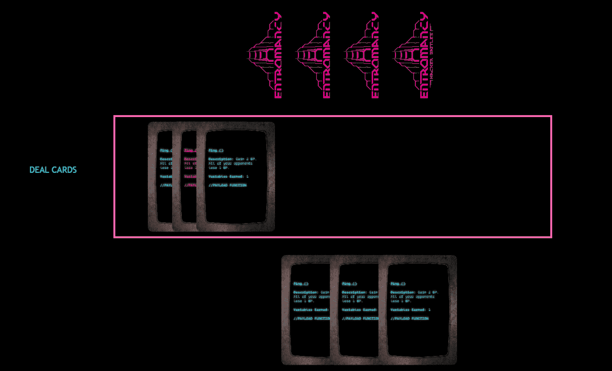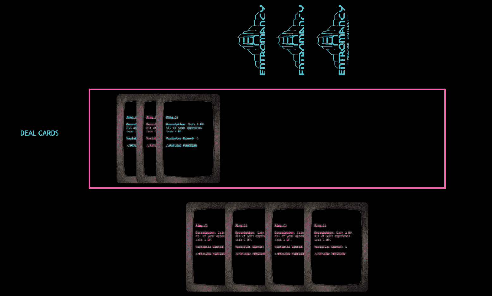

就是这样！现在你应该有了一个多人卡牌游戏的功能模板，你可以用它来添加你自己的卡牌、艺术和游戏逻辑。

第一步可以是通过洗牌并随机返回一张牌来增加你的庄家级别(提示:查看 [Phaser)。Math.RND.shuffle(【数组】)](https://photonstorm.github.io/phaser3-docs/Phaser.Math.RandomDataGenerator.html#shuffle__anchor))。

编码快乐！

如果你喜欢这篇文章，请考虑[查看我的游戏和书籍](https://www.nightpathpub.com/)，[订阅我的 YouTube 频道](https://www.youtube.com/msfarzan?sub_confirmation=1)，或者[加入 *Entromancy* Discord](https://discord.gg/RF6k3nB) 。

米（meter 的缩写））S. Farzan 博士曾为知名视频游戏公司和编辑网站(如 Electronic Arts、Perfect World Entertainment、Modus Games 和 MMORPG.com)撰稿和工作，并担任过*地下城&龙无冬*和*质量效应:仙女座*等游戏的社区经理。他是 *[Entromancy:一款赛博朋克奇幻 RPG](https://www.nightpathpub.com/rpg)* 的创意总监兼首席游戏设计师，也是 *[夜路三部曲](http://nightpathpub.com/books)* 的作者。在 Twitter 上找到 m . s . Farzan[@ sominator](https://twitter.com/sominator)。